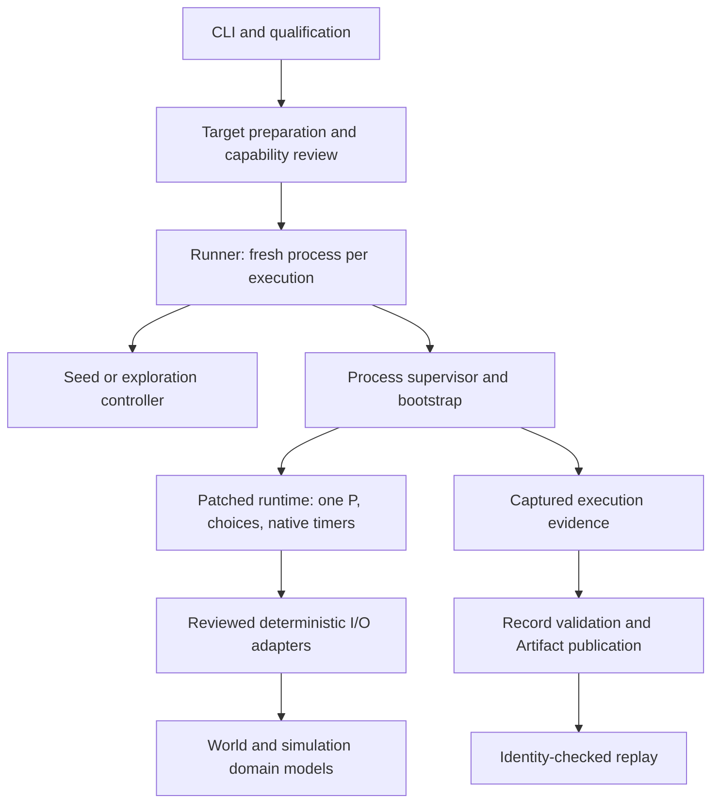

# Gomad v3 architecture assessment

Assessed 2026-09-27 against the working checkout (initial HEAD `cf65250093`). This is a source/design assessment, not a new runtime qualification. References are evidence anchors from that checkout; implementation tasks must re-anchor them before editing.

## Verdict

Keep the system architecture. Its separation of runtime scheduling, host process supervision, modeled external events, and durable replay evidence is appropriate for deterministic testing. The best improvements are narrower ownership of shared policy and protocol layout, stronger architectural checks, and accurate qualification claims. A broad package rewrite would add migration risk without addressing the observed determinism problems.

The implementation already contains deep modules worth preserving: pure seed control, exploration frontiers, World, launch-resource ownership, read-only mount capture, Record identity/validation, Artifact publication, capability policy, and host process/filesystem primitives. Recommending their extraction again would duplicate completed work.

## System architecture

The diagram shows control/data relationships, not Go import edges. World can also be used explicitly by the target. Native runtime timers remain owned by the runtime; simulation domain semantics remain outside it.

| Design | Assessment | Consequence |
| --- | --- | --- |
| Fresh process for each execution | Strong isolation of globals, runtime state, descriptors and allocation history | Keep parallelism across processes; do not replace this with reusable target workers |
| Single-P runtime with virtual time at quiescence | Coherent mechanism for native Go timers and scheduling | Busy loops and unsupported host waits need the wall watchdog; virtual time cannot cure them |
| Separate World and domain adapters | Keeps external-event policy out of runtime internals | Preserve explicit replay identities and backend fidelity differences |
| Exact identity and bounded evidence | Makes claims auditable and resource use finite | Preserve fail-closed handling of missing, corrupt, overflowed and incompatible evidence |
| Immutable publication and recoverable campaign state | Suitable for interrupted campaigns and parallel hosts | Keep seed ordinal commits distinct from atomic exploration-round commits |
| Pinned runtime patch plus generated overlays | Practical but costly at every upstream Go upgrade | Reduce handwritten protocol knowledge; require per-platform requalification |

This is a trusted-test system, not an OS security sandbox. Raw-syscall resistance should not be inferred from capability analysis or fail-closed shims (`ARCHITECTURE.md:49`).

## Ranked improvements

### 1. Complete determinism qualification before optional refactoring

**Impact: high. Owner: existing F5/F6/F7 specs.** Capability support, same-seed repeatability, exact replay, and matching an expected failure are four different results. The milestone history records unresolved fresh-run/replay divergence; changing packages does not fix it.

Evidence: `target/internal/build/context.go:80` selects classic GC; runtime host-arrival handling and stack-scan synchronization are in `toolchain/runtime/overlay/src/runtime/gomad.go`; `.plans/GOMAD_MILESTONES.md` F5/F6 records the measured divergence channels. These are recorded architectural sensitivities, not newly reproduced defects in this review. The README's classic-GC repeatability claim needs qualification against the latest measured workloads.

Keep minimized allocation, host-handoff and replay-environment regressions with their existing milestone owners. Do not expand this maintenance spec into deterministic-GC research or relax an `intermittent` expectation into a support claim. Linux clock auditing remains F7 work.

### 2. Give completed-execution assessment and retention policy one owner

**Impact: high maintenance value. Effort: two focused refactors. Spec tasks 2–3.**

Runner's `runLocal` covers approximately 800 lines. The important issue is repeated policy: World decoding/validation, coverage projection, evidence construction, novelty, bounds, and artifact input composition recur across seed, choice, and simulation exploration.

Evidence: `runner/runner.go:844`, `runner/choice_exploration_campaign.go:308`, `runner/simulation_exploration_campaign.go:305`; success publication around `runner.go:974`, choice `:410`, simulation `:443`.

Extract a private assessor with narrow inputs and detached validated results, followed by shared retention decisions/composition. Keep filesystem verification, cancellation, counters, expandability, journal writes and round commits in their current owners. Prefer private runner files if a new subpackage would require circular types or forwarding APIs. Do not introduce a generic strategy framework.

Verify the shared interface directly and retain end-to-end strategy tests for malformed evidence, retention capacity, error precedence, out-of-order completion, cancellation and interrupted resume. Compare canonical projections using fixed supplied identities; actual rebuilt Runner identities will change.

### 3. Generate the runtime's early bootstrap protocol consumer

**Impact: medium system-maintenance value. Effort: medium. Spec task 1.**

The runtime repeats the bootstrap frame size, header constants and seed offset by hand, alongside generated host and overlay codecs. This makes a protocol update a coordinated edit across a third consumer.

Evidence: `gomadIOConfigFrame`, `gomadReadConfig`, and `gomadConfigSeed` near the end of `toolchain/runtime/overlay/src/runtime/gomad.go` embed 212 bytes and seed offset 172. `deterministicio/schema/iowire.json` defines bootstrap framing; protocol generation already emits a runtime choice endpoint (`internal/gomadtool/generation/protocol/protocol.go:351`).

Generate an allocation-free runtime-safe projection from the existing definition. Keep descriptor transport and early activation in runtime; keep later checksum/identity validation in the current validator. This is an ownership improvement, not a finding that full validation is absent. Exercise actual runtime consumption with valid, empty, truncated and malformed frames on both supported hosts.

### 4. Remove unusable public executor test seams

**Impact: medium API clarity. Effort: medium. Spec task 4.**

`Executor.Run` and `ReplayExecutor.Run` use `runner/internal/execution.Spec` and `Result`. A caller outside the Runner subtree cannot import those types to implement either interface. Yet public request structures expose them as injectable dependencies.

Evidence: `runner/runner.go:118`, `runner/runner.go:167`, `runner/replay_operation.go:28`; related fields exist in resume, shard execution and minimization requests.

Move this injection to private dependencies and migrate tests atomically. Keep usable public `Preparer` and `ArtifactReplayer` seams. This is explicitly a Go source compatibility change, even though normal consumers omit these fields; inventory consumers before removal. Do not expose process descriptors and wire details as a workaround. Verify intended public use from an external consumer package.

### 5. Make architecture checks enforce coverage and effects

**Impact: medium prevention. Effort: medium. Spec task 5.**

The existing owner/import checks are useful, but package discovery lists selected roots. An unlisted new top-level host package can escape inspection. Checks ignore imports outside the module, so a nominally pure module can acquire host effects without violating the current owner graph.

Evidence: `architecture_test.go:371` (`listHostPackages`), `:429` (`ownerMayImport`), and `:468` (`moduleMayImport`). Existing checks intentionally encode completed cleanup, but filename presence is not proof of purity.

Discover all host packages with explicit overlay/fixture exclusions; inspect both qualified platform source sets. Add targeted host-effect rules for pure modules and signature visibility checks for the public Runner surface. A mixed package such as campaign storage requires file-level purity checks for its controller. Test the checker with negative fixtures, and avoid a blanket standard-library allowlist.

### 6. Reconcile the architectural claims with shipped behavior

**Impact: medium correctness of guidance. Effort: small, folded into final qualification. Spec task 6.**

`SPEC.md`'s `PLATFORM.SUPPORT` and the final verification section in `ARCHITECTURE.md` still describe Darwin-only qualification. The architecture research section describes choice tracing as future work despite shipped tracing/replay. `GLOSSARY.md:56` and `:70` retain old simulation delivery-state wording. Reconcile these with the platform descriptor, actual implementations and current qualification evidence, preserving stable requirement IDs.

## Deferred changes

The target capability facade remains large (`target/capability.go`, about 1,339 production lines), but listing, build and provenance already have owners. Defer further decomposition until repeated policy changes identify a useful seam. Do not split by line count alone.

Do not replace the runtime, merge native timers into World, add a generic plugin framework, move already-extracted modules again, or promise cross-toolchain/platform replay.

## Delivery and verification

`fn-102-gomad-architecture-consolidate` depends on F7. Tasks 1 and 2 are independent candidates; then tasks 3, 4 and 5 follow task 2 in order; task 6 integrates both branches. All six tasks are sized M. Runtime correctness work necessary for F4–F7 stays in those specs.

Baseline actually run: `GOWORK=off .toolchain/bin/go test -tags test_dep .` from `tools/gomad3`, with activation environment removed: **pass**. This verifies the current architecture tests, not full runtime qualification. The new spec was structurally validated with Flow-Next: six tasks, no errors or warnings. Implementation must run focused tests, generated-source checks, full Gomad gates on both qualified platforms, and project lint, preserving explicit blockers where a host is unavailable.

Flow-Next plan review with `gpt-5.6-sol` at high returned **SHIP** after correcting three planning gaps: overlay allowlist registration, explicit task edit scopes, and a misplaced performance baseline. The final plan uses deterministic 10/100-job resource-bound checks and data-flow review, with no quantitative performance claim. The review receipt is retained beside this assessment as `plan-review.json`.
