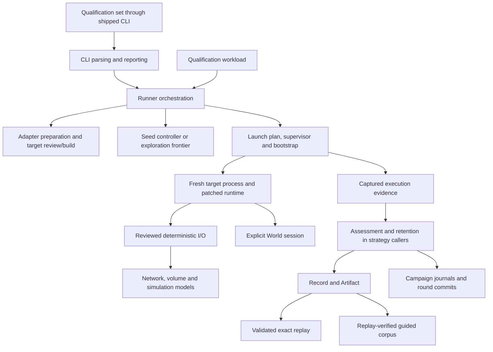

# Gomad v3 architecture and deep module assessment

Archived for this spec from the September 30 assessment. Source references
describe that working snapshot. Subsequent documentation moves are retained
as historical paths where a local link no longer resolves.

**Date:** 2026-09-30  
**Scope:** `tools/gomad3`, with its simulation callers, delivery constraints, qualification manifests, and CI as context.  
**Source baseline:** HEAD `29917069e`, including the existing working-tree documentation changes.  
**Method:** Three focused source reviews, an import and interface inventory, and independent verification of the findings below. No source changes or runtime qualification runs.

Gomad can become easier to extend and use by giving campaign options, completed-execution assessment, retention policy, and complete target preparation clearer owners. Its separation of runtime scheduling, host supervision, external models, and durable evidence already provides the right foundation. Preserve those owners while making callers learn fewer sequencing rules.

The highest-priority finding is concrete. The CLI constructs required simulation-exploration bounds, but the isolated coordinator drops three fields before validation. Most other findings concern maintenance cost and interface depth, rather than demonstrated behavior failures. Optional simulation refactors need design work and qualification before adoption.

## Current architecture

This diagram shows execution and evidence flow. It is not a Go import graph.



The host Go package graph is directional. `runner` composes `target`, `artifact`, `record`, `choice`, deterministic I/O, World, and private execution/campaign/exploration modules. `record` depends only on private canonical JSON within this module. World likewise has no dependency on Runner or target preparation. Build-time deterministic I/O adapters depend on `target`, so moving their composition into `target` without moving lower-level types would create an import cycle.

The separate runtime overlay is a second execution environment with restricted dependencies and startup constraints. Its source cannot simply import the host packages. Generated protocol endpoints are the appropriate seam between these environments.

### Ownership and depth

| Module | Present responsibility | Assessment |
| --- | --- | --- |
| `toolchain` | Pinned source, patch/overlay identity, cache, locking, build publication | Deep. `Build` hides a substantial verified lifecycle and has private dependencies. |
| `target` | Target identity, capability review, provenance, build/cache verification | Substantial depth, but callers still assemble the complete adapter/preparation protocol. |
| `deterministicio` | Contract identity, transcripts, source adapters, host sessions, bootstrap | Useful domain owner with a broad effect surface. Improve composition before splitting packages. |
| `readonlymount` | Bounded capture and replay of host inputs | Deep. Preserve one owner for capture and path-independent replay inputs. |
| Seed controller | Pending jobs, slots, counters, failure stopping | Pure and isolated. Keep host launches and publication outside it. |
| Choice and simulation frontiers | Candidate identity, bounds, deterministic rounds and expansion | Deep. Distinct candidate semantics justify separate implementations. |
| `execution` | Fresh process lifetime, descriptor plan, containment, output and transport | Deep physical execution module. Its private types should stay private. |
| `runner` | Application orchestration plus repeated interpretation/retention policy | Main deepening opportunity. Its public request combines several different lifetimes. |
| `record` | Canonical envelope, hashes, failure identity, validation | Deep. File decomposition already exists without forwarding packages. |
| `artifact` | Verified immutable publication and payload access | Deep. Preserve durability, no-replace publication and validated reuse. |
| Campaign storage | Journals, recovery, resume, immutable execution segments and round commits | Deep. Seed and exploration transaction differences are meaningful. |
| Guided corpus | Identity, novelty, bounded selection, publication, mandatory replay, admission | Deep. Corpus admission has stronger requirements than ordinary success retention. |
| World | Bounded external-event state, ordering, snapshots and transition replay | Deep in-process module with detached values and no host effects. |
| Qualification workload | Independent repetitions, evidence comparison, replay and report publication | Useful application module. Keep independent preparation per repetition. |
| Qualification set | Manifest execution, capability preflight, checkpoints, shards and reporting | Broad but cohesive. Its subprocess seam intentionally exercises the shipped tool. |
| CLI | Flags, presence-sensitive validation, installation/wiring, execution and reporting | Carries too much application construction; can become thinner without changing commands. |

Representative existing seams are [toolchain.Build](../../../tools/gomad3/toolchain/build.go), [target.Prepare](../../../tools/gomad3/target/target.go), [Record finalization](../../../tools/gomad3/record/record.go), [Artifact publication](../../../tools/gomad3/artifact/store.go), [World restore](../../../tools/gomad3/world/snapshot.go), [corpus admission](../../../tools/gomad3/runner/internal/corpus/admission.go), and [qualification workload execution](../../../tools/gomad3/qualification/workload/workload.go).

### Complexity inventory

The tracked-file inventory contains 118 non-generated Go files and 34,680 lines under Runner, including tests and private subpackages. Excluding generated files and fixture directories, the largest production files include `runner.go` (1,965 lines), `target/capability.go` (1,350), `qualification/set/set.go` (1,166), and CLI `cli.go` (1,063). These counts locate review work; they do not establish that a module is shallow.

`CampaignSpec` has 44 exported fields. Its interface also includes strategy-specific constraints, positive-bound requirements, injection restrictions, resume rules and command wiring. This knowledge burden is stronger evidence for restructuring than file size.

## Summary and priority matrix

Each finding has one primary debt dimension. Impact describes maintenance cost and change risk; it does not mean every item is an urgent defect.

| Dimension | Findings | High impact |
| --- | --- | --- |
| Complexity hotspots | 2 | 1 |
| Deprecated API usage | 0 established | 0 |
| Duplication clusters | 3 | 2 |
| Architecture ownership and interface debt | 6 | 2 |
| Total | 11 | 5 |

### Quick wins

| Item | Impact | Effort | Recommended change |
| --- | --- | --- | --- |
| F1 immediate correction | High | Low | Carry the three missing simulation bounds across both coordinator conversions and exercise that seam. |
| F8 current contract guidance | Medium | Low | Reconcile supported-platform and implemented-feature claims against current evidence. |

### Strategic refactors

| Item | Impact | Effort | Recommended change |
| --- | --- | --- | --- |
| F1 options ownership | High | Medium | One campaign-options representation; separate serializable intent from process wiring and private dependencies. |
| F2 execution assessment | High | Medium | One private assessor for common World, coverage, choice and outcome interpretation. |
| F3 retention and evidence composition | High | Medium | Shared policy and artifact inputs, with strategy-owned durable transactions. |
| F4 complete target preparation | High | High | One composition module above target and adapter implementation. |
| F10 simulation progress lifecycle | High | High | Explore an operation-lifecycle interface that hides accounting and ordering constraints. |

### Incremental improvements

| Item | Impact | Effort | Recommended change |
| --- | --- | --- | --- |
| F5 public interface and CLI construction | Medium | Medium | Private executor dependencies; shared semantic normalization; explicit supported consumer interface. |
| F6 simulation-time protocol | Medium | Medium | Generate host and runtime-safe layouts from one definition. |
| F7 architecture checks | Medium | Medium | Check package coverage, host effects and public signature visibility, with negative fixtures. |
| F9 target Go commands | Medium | Medium | Reuse host execution primitives and distinguish bounded diagnostics from complete structured output. |

### Defer pending a concrete change

| Item | Impact | Effort | Revival condition |
| --- | --- | --- | --- |
| F11 backend-specific handles | Medium | High | A new network/filesystem operation repeatedly touches process and local dispatch or causes handle-state errors. |

## Detailed findings

### F1 Campaign options drift across isolated coordination

**Dimension:** Architecture. **Impact:** High. **Effort:** Low for the defect, Medium for ownership.

`CampaignSpec` declares `MaxForcedDecisions`, `MaxExplorationResultBytes` and `SimulationDimensionLimits` at `runner/runner.go:148`. The CLI supplies them at `cmd/gomad/internal/cli/cli.go:617` and enables isolated coordination at `:626`. `coordinatorConfig`, its outbound conversion and its inbound conversion omit all three (`runner/coordinator.go:23`, `:105`, `:295`). `CoordinatorMain` calls `runLocal`, which validates the reconstructed request; `runner.go:1276` rejects the resulting zero forced-decision bound.

This is source-confirmed field loss on the shipped command path. It was not reproduced by executing a campaign. Local simulation tests inject an executor and bypass the coordinator (`runner_test.go:980`, `:1015`, `:2365`), while the isolated configuration test at `:1704` covers choice tracing. Parser and local-controller tests therefore do not establish end-to-end option delivery.

Correct the missing fields first. Then give campaign options one data owner used by the local request and coordinator envelope. Separate callbacks, executor injection, child commands and resolved host identity. Group execution limits, observation, retention and strategy settings by their invariants. The immutable campaign/artifact schema retains its own compatibility obligations; it should not become the mutable request type.

Verify distinct nonzero simulation bounds through actual encode/decode and coordinator execution. Test all supported strategies through that seam and preserve error classifications. A full struct equality check is useful for transport data, while behavioral tests establish the execution result.

Evidence: [Runner request and validation](../../../tools/gomad3/runner/runner.go), [coordinator transport](../../../tools/gomad3/runner/coordinator.go), [CLI construction](../../../tools/gomad3/cmd/gomad/internal/cli/cli.go), [Runner tests](../../../tools/gomad3/runner/runner_test.go).

### F2 Completed executions need one assessment owner

**Dimension:** Duplication. **Impact:** High. **Effort:** Medium.

Seed completion validates World, decodes semantic coverage, projects choice features, classifies the outcome and constructs qualification evidence (`runner.go:845`, `:873`, `:892`, `:914`, `:925`). Choice and simulation completion repeat that sequence (`choice_exploration_campaign.go:291`; `simulation_exploration_campaign.go:333`). Guidance projects choice evidence again (`guidance.go:83`). Existing `execution.Classify` only hides one part of this protocol.

Create a private assessor configured once with prepared-target identity and observation rules. Its operation should accept a completed execution and return detached validated evidence and outcome. Callers should not repeat World seed/schema checks, coverage decoding or common projection rules.

Keep target-file verification, captured-input filesystem work, cancellation, counters, journal transitions and strategy-specific expandability outside the pure interpretation core. Captured-input results can enter assessment after their effectful owner verifies them. Simulation decision interpretation remains with its existing owner. Start with private Runner files, where extraction can avoid circular types and forwarding interfaces.

Tests should cross the assessor's interface using malformed World data, wrong seed, missing or truncated choice evidence, semantic coverage errors, successful exits and watchdog/cancellation observations. Pin current error precedence before routing every strategy through it. Retain strategy tests for scheduling and transactions.

Evidence: [seed completion](../../../tools/gomad3/runner/runner.go), [choice completion](../../../tools/gomad3/runner/choice_exploration_campaign.go), [simulation completion](../../../tools/gomad3/runner/simulation_exploration_campaign.go), [guidance](../../../tools/gomad3/runner/guidance.go).

### F3 Retention decisions and artifact inputs need one owner

**Dimension:** Duplication. **Impact:** High. **Effort:** Medium.

Success novelty, complete-transcript requirements, count/byte limits, artifact payload assembly and publication error translation recur in seed, choice and simulation campaigns (`runner.go:957`, `:974`; `choice_exploration_campaign.go:397`; `simulation_exploration_campaign.go:430`, `:445`). Guidance assembles another artifact input at `guidance.go:90`. Shared `manifestForRun` at `runner.go:1640` has already reduced duplication, but callers still understand payload composition and retention sequencing.

Use the assessment from F2 to produce a retention decision and complete artifact input. A private policy module should own novelty and remaining budgets. Its state must advance only at the correct durable commit point. Artifact storage continues to verify bytes and own physical publication.

Keep seed ordinal publication, whole exploration-round staging and corpus admission as separate transactions. Corpus admission requires matching replay before inclusion. A generic strategy transaction would obscure those different guarantees.

Verify novelty across semantic and choice features, incomplete transcripts, zero remaining count/bytes, publication failures, deduplication and replay failure during corpus admission. Preserve canonical manifests and payload bytes with supplied fixed identities. Rebuilt Runner identity will legitimately change.

Evidence: [seed retention](../../../tools/gomad3/runner/runner.go), [choice retention](../../../tools/gomad3/runner/choice_exploration_campaign.go), [simulation retention](../../../tools/gomad3/runner/simulation_exploration_campaign.go), [Artifact input](../../../tools/gomad3/artifact/publication.go).

### F4 Complete target preparation is still a caller protocol

**Dimension:** Architecture. **Impact:** High. **Effort:** High.

Runner prepares adapters, calls a preparer, attaches adapter metadata and validates the prepared target (`runner.go:522–547`). Portable plans repeat the sequence (`portable_plan.go:119–136`). Analysis creates a private root, prepares adapters and returns a cleanup callback (`cli/analyze.go:53–67`). Compatibility review owns another temporary-root and adapter/review lifecycle (`qualification/analysis/prepared_review.go:21–50`). The shared target module alone does not hide the whole supported preparation process.

Introduce one composition module above `target` and deterministic I/O adapter implementation. It should offer two explicit operations, complete target preparation and capability inspection, using one private adapter workspace. Inspection must preserve closure mode's no-compilation guarantee and linked mode's build-without-execution behavior. A prepared result should already contain complete adapter identity and validated target metadata.

The seam should hide adapter selection, module/overlay rewriting, review ordering, metadata projection and workspace cleanup. Let campaign/portable-bundle owners retain destination publication and journal transitions. Existing capability policy, build cache and provenance owners remain implementations beneath the seam.

Do not add `target -> deterministicio` while deterministic I/O imports `target`; that would cycle. A private module such as `internal/preparation` is a possible location, subject to interface design. Keep stable adapter paths that enter build information, exact module/source pins, cache identities and external-module behavior.

Verify fresh/cache preparation, external modules with local replacements, invalid adapter sums, unsupported closure, malformed linked evidence, binary changes and cleanup failures through the new interface. Qualification repetitions must still prepare independently, even if the verified cache avoids relinking.

Evidence: [Runner preparation](../../../tools/gomad3/runner/runner.go), [portable plans](../../../tools/gomad3/runner/portable_plan.go), [analysis preparation](../../../tools/gomad3/cmd/gomad/internal/cli/analyze.go), [review preparation](../../../tools/gomad3/qualification/analysis/prepared_review.go), [adapter registry](../../../tools/gomad3/deterministicio/adapter_registry.go).

### F5 Public requests expose execution mechanics and private test seams

**Dimension:** Architecture. **Impact:** Medium. **Effort:** Medium, including Go source compatibility.

Public `Executor` and `ReplayExecutor` accept and return `runner/internal/execution` types (`runner.go:118`; `replay_operation.go:28`). Ordinary consumers outside the Runner subtree cannot import those types to implement the interfaces. Public requests also expose supervisor/bootstrap/coordinator commands and Runner identity. The CLI must assemble these mechanics repeatedly, while application rules occur in both `resolveExploreSelection` (`cli.go:718`) and Runner validation (`runner.go:1233`). Plan mode reuses explore through a hidden flag (`cli.go:689`).

Move executor substitution into private dependencies and retain usable public seams where actual consumers need them. Put semantic campaign normalization in Runner; keep CLI flag-presence rules and text/JSON reporting in the CLI. Share parsing directly between plan and explore. Resolve installation and private child-mode wiring in one application construction path.

A public tool object is justified only if external Go consumers need it. For a CLI-focused product, deepen private construction first. If a public interface is intended, callers should provide target intent, search/observation/retention settings and locations; the implementation should resolve process mechanics. Preserve the command grammar and immutable artifact formats while inventorying consumers before Go interface changes.

Add an external-consumer compile fixture for the supported interface. Keep actual CLI/coordinator tests alongside isolated module tests. Removing the unusable public executor must not expose descriptor or bootstrap types instead.

Evidence: [campaign request](../../../tools/gomad3/runner/runner.go), [replay request](../../../tools/gomad3/runner/replay_operation.go), [CLI application construction](../../../tools/gomad3/cmd/gomad/internal/cli/cli.go), [qualification construction](../../../tools/gomad3/cmd/gomad/internal/cli/qualify.go).

### F6 Simulation time duplicates wire layout knowledge

**Dimension:** Duplication. **Impact:** Medium. **Effort:** Medium.

Host simulation-time code defines 40-byte requests, 32-byte responses, magic values, kind numbers and byte offsets (`execution/simulation_time.go:14–115`). Runtime code independently declares and consumes the same layout (`runtime/gomad.go:55–69`, `:1068–1169`). Bootstrap, model and choice protocols already use generated endpoints. The prior recommendation to generate early bootstrap consumption is completed (`runtime/gomad_iowire_generated.go`; generator `protocol.go:325`).

Add a simulation-time definition to the existing generation system and produce host and runtime-safe codecs/constants from it. Keep raw descriptor reads and startup/quiescence handling in runtime. Generated runtime code must satisfy allocation, stack and dependency constraints; a host JSON or reflection codec is unsuitable there.

Preserve the existing protocol bytes, reserved-zero checks, generation correlation and monotonic-time checks. Shared malformed-frame vectors should exercise both consumers, including truncated messages, unknown kinds and changed generation. Test actual runtime consumption on both qualified platforms.

Evidence: [host time protocol](../../../tools/gomad3/runner/internal/execution/simulation_time.go), [runtime protocol consumer](../../../tools/gomad3/toolchain/runtime/overlay/src/runtime/gomad.go), [generated bootstrap](../../../tools/gomad3/toolchain/runtime/overlay/src/runtime/gomad_iowire_generated.go), [protocol generation](../../../tools/gomad3/internal/gomadtool/generation/protocol/protocol.go).

### F7 Architecture checks miss new roots and host effects

**Dimension:** Architecture. **Impact:** Medium. **Effort:** Medium.

`listHostPackages` enumerates selected roots (`architecture_test.go:371`). A new top-level package can remain outside discovery. Import checking skips standard-library and external imports (`:35`), so it cannot enforce the documented purity of controllers, World or semantic policy. Several checks require files to exist or obsolete files to disappear. Those checks preserve useful migration constraints, but file presence does not establish module depth.

Discover the complete host package set with explicit fixture/overlay exclusions, across both supported source sets. Add targeted effect rules for pure modules and signature checks for public types that expose inaccessible internal types. Mixed packages, such as campaign storage containing its pure controller, need file-level rules rather than a blanket package ban.

Use negative fixtures proving that an unowned root, forbidden host effect, invalid owner edge and inaccessible public signature each fail the checker. Preserve current ownership checks that still prevent regressions. Avoid a broad standard-library allowlist that would turn legitimate implementation choices into unrelated test failures.

Evidence: [architecture checks](../../../tools/gomad3/architecture_test.go).

### F8 Architectural guidance conflicts with shipped contracts

**Dimension:** Architecture. **Impact:** Medium. **Effort:** Low.

`SPEC.md:152` names only `darwin/arm64` as qualified. `ARCHITECTURE.md:601` retains Darwin-only runtime qualification wording and its final paragraph classifies runtime choice tracing as research. `GLOSSARY.md:56` and `:70` describe simulation backends as future/unimplemented. README, generated platform declarations, implemented choice replay and current milestones describe Linux qualification and implemented backends.

Reconcile the documents without weakening known limitations. Generated release descriptors should provide supported-platform facts. Qualification reports and manifests should provide workload dispositions. Specs retain stable requirement IDs; architecture prose explains ownership and constraints. CI expectation matching, capability support, same-seed repeatability and exact replay must remain distinguishable claims.

The current milestone document records residual Linux divergence, four suites without exact replay and host-clock escapes such as `LastGC`. Those are existing qualification constraints, not new defects established by this analysis. Documentation should expose them accurately without implying that a structural refactor resolves them.

Evidence: [spec](../../../tools/gomad3/SPEC.md), [architecture](../../../tools/gomad3/ARCHITECTURE.md), glossary (`../../../tools/gomad3/GLOSSARY.md`, assessment snapshot path), [current milestones](../../../.plans/GOMAD_MILESTONES.md), [platform descriptor](../../../tools/gomad3/toolchain/version/version.json).

### F9 Target preparation has inconsistent command ownership

**Dimension:** Architecture. **Impact:** Medium. **Effort:** Medium.

Target compilation directly uses `exec.CommandContext` and unbounded `CombinedOutput` (`target/target.go:737–741`). Capability listing separately implements bounded command capture (`target/internal/capabilityreview/list.go:89–128`). Toolchain building already uses private dependencies over bounded `hostexec` requests (`toolchain/build.go:63–79`, `:208–213`).

Give target preparation a private Go-command adapter that uses the established host execution primitives for command lifetime, cancellation and bounded diagnostics. Preserve the purpose of each output. Compiler diagnostics can retain bounded head/tail plus full hashes; package-list JSON requires complete bounded data and must reject overflow instead of parsing truncated output.

This seam has real production and test adapters and can make fresh/cache preparation tests independent of real compilation. Keep domain-specific invalid-input diagnostics and linked-capability errors in their current semantic owners. The evidence establishes inconsistent implementation and an unbounded diagnostic capture, not a reproduced descendant-process leak.

Verify cancellation, long compiler output, structured-output overflow, malformed listing, build failure and cache-release errors through the adapter. Reusing `hostexec` should remove lifetime mechanics rather than add a forwarding package.

Evidence: [target compilation](../../../tools/gomad3/target/target.go), [capability listing](../../../tools/gomad3/target/internal/capabilityreview/list.go), [toolchain dependencies](../../../tools/gomad3/toolchain/build.go), [host execution](../../../tools/gomad3/internal/hostexec/command.go).

### F10 Simulation progress accounting exposes a wide lifecycle protocol

**Dimension:** Complexity. **Impact:** High. **Effort:** High. **Status:** Exploratory design candidate.

The simulation time arbiter has eight related external-work methods, including begin, handled begin, forwarding, transfer, acknowledgement, delivery and end (`execution/simulation_time.go:312–434`). Coordinator code selects these transitions, while transport uses delivered/arrived/discarded callbacks (`simulation_model.go:30–50`). Callers must keep external, handling and delivered counts consistent with model completion and consumption. Existing arbiter tests cover many of these cases; this analysis establishes an interface burden rather than a new correctness defect.

Explore a private operation-lifecycle module whose interface creates an operation handle, records its terminal disposition and consumes an acknowledged arrival. It should encapsulate progress accounting, correlation and inactive-participant checks. Host transport still owns blocking and cancellation, domain models own semantic mutation, and native runtime timers remain runtime-owned.

Design this twice before committing to a handle abstraction. Compare a token-based interface with a typed transition function over a private arbiter state. The winning design must eliminate caller sequencing knowledge, avoid extra independent state, and preserve acknowledgement-before-admission and transfer atomicity.

Test delivered-but-unconsumed work, arrival during quiescence, forwarding, abandoned responses, participant death/restart and stale incarnations through the proposed seam. Keep process conformance tests because isolated state-machine tests cannot establish cross-process timing behavior.

Evidence: [time arbiter](../../../tools/gomad3/runner/internal/execution/simulation_time.go), [model transport](../../../tools/gomad3/runner/internal/execution/simulation_model.go), [process coordination](../../../tools/gomad3/runner/internal/execution/simulation_unix.go), [arbiter tests](../../../tools/gomad3/runner/internal/execution/simulation_time_test.go).

### F11 Backend handles carry several implementation shapes

**Dimension:** Complexity. **Impact:** Medium. **Effort:** High. **Status:** Defer pending a concrete change.

Network `Listener` and `Conn` combine process handles, in-process simulation ownership and local connection state (`overlay/src/internal/gomadio/network.go:41–68`). Operations repeatedly branch between process, simulation and standalone implementations (`:102–157` and subsequent handle methods). Filesystem operations have similar process-versus-local dispatch. This spreads knowledge of valid handle shapes across methods.

If future operations repeatedly need those changes, select a private backend-specific handle implementation at creation and dispatch through a small internal interface. Real adapters already exist, so the seam would represent actual variation. Keep ordinary `net` and `os` caller interfaces stable and keep semantic models separate from transport.

This refactor affects the pinned overlay, locks, deadlines, mappings, stale-incarnation checks and replay-before-mutation guarantees. Its present benefit is smaller than the Runner policy work. Start with one handle family and demonstrate simpler code and unchanged conformance before extending it. Do not add a generic backend plugin system.

Evidence: [network handles](../../../tools/gomad3/toolchain/runtime/overlay/src/internal/gomadio/network.go), [process network adapter](../../../tools/gomad3/toolchain/runtime/overlay/src/internal/gomadio/process_network.go), [filesystem overlay](../../../tools/gomad3/toolchain/runtime/overlay/src/internal/gomadfs/fs.go).

## Secondary design opportunities

These five opportunities were also reviewed. They are outside the eleven ranked findings because they need a concrete consumer or change to establish migration value.

| Opportunity | Current evidence | Possible deeper interface | Tradeoff |
| --- | --- | --- | --- |
| Artifact reference versus owned handle | `artifact/store.go:49` uses one value for published references and live `os.Root`; `artifact/open.go:70`, `:79`, `:83` expose close/detach/payload distinctions. | `Open` returns an owned pointer handle with private manifest; `Snapshot` returns a detached reference. | Medium effort and public Go interface changes; keep pinned-directory access and payload revalidation. |
| Typed model commands | `simulation/schema/modelwire.json` declares operations; generated requests expose `String1/2`, `Int1/2`, `Uint1/2`, flags and data. Process network and volume adapters map their meaning manually. | Typed domain commands with one owner translating to the existing compact envelope. | Additional builders alone add little depth; stronger shape rejection changes the accepted contract. |
| Validated installation description | `target/target.go:367`, `:375`, build/cache helpers and `adapter_registry.go:227` independently derive installed locations. | Concrete validated installation value carrying identity and owned paths. | Stable replacement paths affect build information and identity; preserve locations during migration. |
| Atomic seed completion | `campaign/controller.go:98` requires `FinishAttempt` followed by success/cancel/failure accounting. | One pure `Complete(completion)` transition, with distinct-failure input explicit. | Local simplification; retain observable counter and stop semantics. |
| Internal capability policy separation | `target/capability.go` combines host evidence collection, validation, linked projection and policy; adapter source hashing is reused from deterministic I/O. | Private collector, pure evaluator and linked projector behind the same capability-review interface; a shared source-inventory owner if changes require it. | Existing compatibility policy already has an owner. Avoid duplicate evaluators, generic registrations and splits motivated only by file size. |

The Artifact distinction is especially useful if external callers start managing payload handles. Publication and opening are already deep; the improvement would make lifetime ownership explicit. The current freely mutable manifest and copied handle require caller discipline. This analysis does not establish a reachable corruption defect from that design.

For typed model commands, preserve partial-read/write results together with errors, stale-handle classification, capacities and backend capability differences. Keep operation semantics with the domain owner and framing with the wire owner. A shared frame format cannot erase in-process versus process fidelity differences.

Evidence: [Artifact lifetime](../../../tools/gomad3/artifact/open.go), [model schema](../../../tools/gomad3/simulation/schema/modelwire.json), [network model adapter](../../../tools/gomad3/toolchain/runtime/overlay/src/internal/gomadio/process_network.go), [installation resolution](../../../tools/gomad3/toolchain/installation.go), [seed controller](../../../tools/gomad3/runner/internal/campaign/controller.go), [capability facade](../../../tools/gomad3/target/capability.go).

## Proposed interfaces and dependency placement

These sketches describe intended knowledge reduction. They are design proposals, not implemented declarations or new public promises.

### Preparation

```go
// Conceptual internal interface.
Prepare(ctx, targetRequest) (validatedPreparedTarget, error)
Inspect(ctx, targetRequest) (capabilityInspection, error)
```

The preparation implementation owns its temporary workspace and selected adapters. Results carry complete identity. Private dependencies supply host commands and filesystem operations. A caller-owned durable destination is explicit where needed; cleanup of implementation-only workspace stays inside the module.

### Completed execution policy

```go
assessment, err := assessor.Assess(completedExecution)
decision, err := retention.Decide(assessment)
publication := composeArtifact(assessment, decision)
```

The assessor hides common interpretation. Retention hides novelty and bounds. Artifact composition hides payload layout. The campaign owner chooses the durable transaction and commits policy state at its successful commit point. This is a private composition of deep modules, with no universal strategy interface.

### Tool intent and private execution wiring

```go
// Existing user operations can retain their names.
Explore(ctx, request) (campaignResult, error)
Replay(ctx, artifactLocation, replayOptions) (replayResult, error)
```

A request groups target intent, search settings, resource limits, observation and retention. Implementation construction resolves installation, build identity and private child commands. Keep callbacks at the host entry point and serialize only execution intent. External callers should never need to import execution internals or construct descriptor layouts.

The proposed ownership flow is:

```text
CLI and qualification callers
  -> validated operation request
  -> preparation owner
  -> Runner orchestration
       -> existing seed/frontier policy
       -> existing execution lifetime
       -> common completed-execution assessment
       -> retention and artifact composition
       -> existing strategy-specific durable commit
```

### Dependencies and test seams

| Proposed module | Dependency category | Test seam |
| --- | --- | --- |
| Options validation and normalization | In-process | Direct requests and results; include mutually exclusive strategy settings. |
| Evidence interpretation | In-process core | Detached records/transcripts; internal effectful input-capture stage stays separate. |
| Retention policy | In-process | Decisions and state committed after simulated transaction outcomes. |
| Preparation | Host process and filesystem effects | Existing private host-command adapter plus real temporary directories and fixture modules. |
| Protocol consumers | Two execution environments | Generated byte vectors plus actual host/runtime consumption. |
| Simulation progress | In-process state with host transport | Pure transition checks and existing process conformance. |

Introduce Go interfaces where production and test/backend adapters actually vary. Use concrete functions and private types for pure computation. Smaller exported surfaces and fewer caller obligations matter more than additional packages.

## Recommended sequence

1. Correct F1's missing transport fields and add one regression through isolated coordination. Reconcile F8's contract guidance separately.
2. Unify campaign-options ownership and private construction. Preserve CLI grammar, flag-presence rules and public compatibility where possible; identify unavoidable Go interface changes before implementation.
3. Extract F2 assessment, then F3 retention/composition. Migrate one strategy at a time, preserving each strategy's durable commits and current error precedence.
4. Establish F4 complete preparation above existing owners. Integrate F9's host-command seam where it reduces real process mechanics. Migrate explore, plan, analyze and compatibility review to the shared operations.
5. Add F7 fitness checks for the resulting ownership rules and F6 generated simulation-time consumers. Existing generator output and overlay allowlists must stay synchronized.
6. Revisit F10 and F11 only with a concrete simulation change or evidence that the smaller interface reduces lifecycle mistakes. Compare alternative interfaces before adding new state.

The delivery document places earlier consolidation ideas in F10 D1–D5 with revival triggers. F1 supplies new concrete evidence for request ownership and transport checks. This report does not start deferred work or change task state. Any implementation should reconcile its scope with the existing Flow specs rather than create a competing backlog.

## Preserve during restructuring

Fresh processes per execution, native runtime timer ownership, World purity, detached model state, separate evidence identities, explicit capacity outcomes, exact compatibility pins, controlled environment, replay validation before activation/mutation, complete tape consumption, seed ordinal commits, atomic exploration rounds and replay-verified corpus admission remain essential.

Preserve existing code comments when moving or refactoring code. Retain schemas and canonical byte projections unless a separate compatibility change is intended. Keep public command behavior and failure precedence. Avoid source translation, test rewriting, generic plugin infrastructure, reusable target workers and speculative capability-package splits.

A small runtime patch is a useful constraint even though `gomad.go` is large. Moving native time or domain models into one universal scheduler would expand the supported contract and invalidate current reasoning. The separately owned simulation network, persistence and fault models remain valuable deep modules.

## Verification and limits

The source analysis inspected current implementations, tests, generated consumers, CI targets, platform declarations, delivery milestones and the previous assessment. Independent checks confirmed the coordinator's three missing fields, repeated preparation and assessment protocols, inaccessible executor interfaces, duplicated time layout and architecture-check gaps. The import inventory found the expected directional host package relationships; no import-cycle finding is claimed.

No Go tests, toolchain builds, campaigns, benchmarks or platform qualification runs were performed. Runtime behavior and performance gains from proposed designs remain unmeasured. Existing workload limitations come from current project evidence, not a fresh reproduction. The generated reports received file/link/content checks; HTML layout was not browser-verified.

Implementation verification should use focused module tests first, then the required generated-source/architecture checks and affected strategy/process tests. Overlay and protocol changes require runtime conformance and qualification on both `darwin/arm64` and `linux/amd64`. Preserve the current smoke gate plus affected suites; the full functional set remains an on-demand run. Follow the repository's `test_dep` requirement.

### Findings evaluation

“Recommend” means the source establishes a useful restructuring target. It does not authorize code changes in this analysis. Exploratory proposals remain choices for later interface design.

| Finding | Verified observation | Verdict |
| --- | --- | --- |
| F1 | Three required simulation fields absent from transport and rejected after reconstruction | Recommend immediate fix and options ownership |
| F2 | Same common evidence interpretation in three strategy paths | Recommend private shared assessor |
| F3 | Repeated novelty/bounds/payload composition; different transaction guarantees | Recommend shared policy with separate commits |
| F4 | Repeated complete preparation across Runner, plan, analysis and review | Recommend composition owner above existing modules |
| F5 | Public execution interfaces require inaccessible internal types; repeated construction | Recommend private dependencies and narrower consumer intent |
| F6 | Handwritten time layouts remain; generated early bootstrap is already complete | Recommend time protocol generation; skip old bootstrap extraction |
| F7 | Fixed root discovery and skipped external imports leave coverage/effect gaps | Recommend targeted negative-tested checks |
| F8 | Platform and implemented-feature statements conflict with current code/evidence | Recommend documentation reconciliation |
| F9 | Target compiler uses unbounded capture while adjacent owners use bounded execution | Recommend shared command mechanics with distinct output contracts |
| F10 | Callers sequence multiple progress-accounting operations | Explore alternatives; no new defect established |
| F11 | Handles carry several backend shapes and repeated dispatch | Defer until a concrete operation justifies migration |

No deprecated-library finding was established. No dependency freshness claim or third-party migration recommendation is made. Existing deep modules, already-completed bootstrap generation and legitimate independent qualification preparation were excluded from the refactor list.
