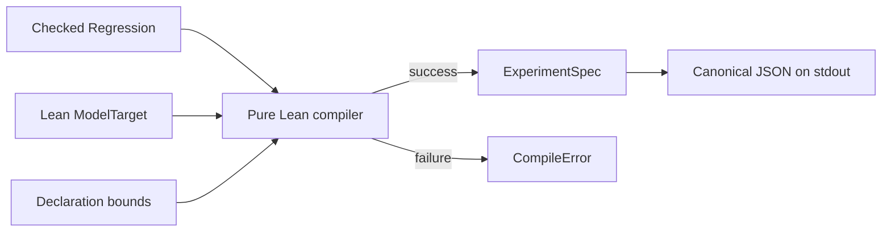

# Lean regression DSL and Nexus ExperimentSpec

> HTML render lens (local): open `.flow/artifacts/fn-1-lean-regression-dsl-and-nexus/spec.html` — regenerable, markdown is the record. <!-- flow-next:artifact-link -->

## Conversation Evidence

> user (turn 1): "after the proto api lean generator; what does temporal/.plans/UMPIRE_COMPONENTS.md say we culd do next/separately"
> user (turn 2): "$flow-next-capture define a small Lean regression DSL and compile one bounded Nexus scenario into an inspectable ExperimentSpec"
> user (turn 3): "Umpire3 should not be used at all"

## Overview

This plan serves Lean model and Umpire tool developers. It adds no Temporal server behavior,
runtime configuration, deployment requirement, or operator workflow. The deliverable is one
developer-facing path from a checked Lean regression declaration to a deterministic inspection
artifact for the existing Nexus caller-closure semantics.

## Goal & Context
<!-- scope: business -->

<!-- Source-tag breakdown: 60% [user] / 40% [paraphrase] -->

The Protobuf-to-Lean generator supplies mechanical wire structure, but it intentionally does not
define Temporal product behavior. The next narrow proof point is to show that a concise,
Lean-owned regression declaration can express one real Nexus behavior and compile into an
environment-independent artifact that an engineer can inspect without starting Temporal.

This slice establishes the authoring/compiler seam only. It should be small enough to validate the
shape of the DSL and `ExperimentSpec` before broader exploration, execution, or evidence machinery
depends on them.

## Architecture & Data Models
<!-- scope: technical -->

<!-- Source-tag breakdown: 80% [paraphrase] / 20% [user] -->

The slice has one deep public seam: `compile : ModelTarget → Regression → Except CompileError
ExperimentSpec`. The compiler is pure Lean and returns an immutable value; it does not publish a
file or call a runtime.

`Regression` is a closed intent language for stable identity, typed resources that resolve into a
setup, requested action attempts, named precedence edges, a non-empty collection of expected
properties, and declaration-size bounds. Resource, action, and property identities are unique
within their own kind. Ordering rejects duplicate edges, self edges, and cycles.

`ModelTarget` owns the allowed resources, setup-dependent action projections, and property
observations. Compilation first resolves the declared resources into a target-owned setup. Each
mapped action projection then returns either a model-owned outcome or a stable `impossibleAction`
error for that setup; name resolution alone is never enough to establish a transition.

The model/semantic identity is derived from the canonical compiled target slice: the target
declaration plus the resolved setup, projected outcomes, and property observation contracts
consumed by this regression. It is not an arbitrary caller-supplied hash. This identity covers
changes to semantic contract data visible to compilation, while proof-only refactors that preserve
the same contract intentionally retain it. `ExperimentSpec` records the identity alongside both
action attempts and projected outcomes, all expected properties, explicit bounds, omissions,
format version, and provenance.

Bounds limit the number of resources, action attempts, and precedence edges accepted by the
compiler. They are compilation limits for this declaration, not state-exploration or liveness
bounds.

Requested action attempts remain distinct from successful semantic transitions. The DSL asks for
an action; the setup-dependent target projection determines whether the attempt is applicable and,
if so, which model-owned outcome it produces.

The pilot starts from the existing caller-closure clash configuration, requests caller force-close,
projects that attempt through the model's upgrade resolution, and expects the checked honored-delivery
and cancellation-uniqueness properties.

The inspection surface serializes a successful `ExperimentSpec` as canonical JSON with fixed field
and collection order and prints it to standard output. Compilation failure prints one structured
diagnostic and no JSON; the slice never creates a partially written artifact.

The DSL, compiler, and artifact contract are independent of Umpire3. They do not import, wrap,
copy, or use Umpire3 code, generated artifacts, schemas, semantic declarations, tests, or runtime
behavior. [user]



## API Contracts
<!-- scope: technical -->

- `compile` accepts one checked regression and one matching model target and returns exactly one
  environment-independent `ExperimentSpec`, or one deterministic `CompileError` with a stable kind,
  subject identity, and context. [paraphrase]
- The DSL can name resources, requested action attempts, ordering, a non-empty collection of
  expected properties, and explicit bounds; features not needed by the pilot remain unavailable
  rather than receiving placeholder semantics. [paraphrase]
- The `ExperimentSpec` exposes its format version, regression identity, model/semantic identity,
  resources and resolved setup, action attempts and projected model outcomes, ordering, every
  expected property, bounds, declared omissions, and provenance in a deterministic
  human-inspectable representation. [paraphrase]
- Compilation resolves semantic names through Lean-owned declarations. Protobuf-derived field or RPC
  names never acquire product semantics merely because they appear in the generated API catalog.
  [paraphrase]
- Compilation inputs are limited to the current Lean semantic declarations and generated API
  catalog; Umpire3 is not an input, dependency, or behavioral reference. [user]
- Regression and target identifiers must match exactly. Resource, action, and property references
  resolve within typed namespaces; same-spelling identifiers of different kinds do not collide.
- A mapped action is projected against the resolved setup. An inapplicable mapped action returns
  `impossibleAction` with stable action/setup context; it cannot compile as a successful outcome.
- The expected-property collection must be non-empty. The pilot names honored delivery and
  cancellation uniqueness as two distinct property identities, and both appear in the artifact.
- Resource and action bounds must be positive; the precedence-edge bound may be zero. Actual counts
  must not exceed their corresponding bounds.
- The inspector is split into a pure, injectable runner and a thin CLI writer. The production
  registry contains only the one pilot; tests may inject malformed registry entries to exercise
  target mismatch and compiler failures without adding a production configuration surface.
- Canonical JSON is emitted only after compilation succeeds. The inspection command requires no
  Temporal server, execution profile, or writable output path. [user]

## Edge Cases & Constraints
<!-- scope: technical -->

- Missing or duplicate identities within a kind, unresolved resources/actions/properties, duplicate
  or self-referential precedence edges, cyclic ordering, and exceeded bounds fail compilation before
  an artifact is emitted.
- An action attempt that has no declared projection, or whose mapped projection is inapplicable to
  the resolved setup, fails rather than being treated as a successful transition. [paraphrase]
- Recompiling unchanged semantic input produces the same inspectable artifact regardless of map
  iteration or incidental declaration order.
- A change to the canonical target slice consumed by the regression—including a projected outcome
  or property observation contract—is visible in the artifact and cannot be mistaken for output
  from the prior contract. Proof-only changes preserving that contract are intentionally identity
  neutral. [paraphrase]
- The pilot remains finite and explicitly bounded; it does not make an exhaustive claim beyond those
  bounds. [paraphrase]
- The compiler and inspector do not write files. Atomic publication, persistence, and cleanup are
  outside this slice, so failure cannot leave a partial output artifact.
- Any dependency on or reuse of Umpire3 code, artifacts, schemas, semantics, tests, or runtime
  behavior fails verification. [user]

## Quick commands

```bash
make -C model check
make umpire-check-api
make umpire-check-regression
```

## Acceptance Criteria
<!-- scope: both -->

- **R1:** A concise Lean regression declaration expresses the bounded Nexus caller-closure
  cancellation pilot using named resources, requested action attempts, ordering, the two distinct
  honored-delivery and cancellation-uniqueness expectations, and finite bounds. Errors: an empty
  expectation collection, missing or duplicate identities, unresolved references,
  duplicate/self/cyclic ordering, and exceeded bounds are rejected during checking or compilation.
- **R2:** Compilation preserves the distinction between requesting an action and establishing a
  successful semantic transition; the selected Lean model owns the allowed outcome. Errors: an
  unmapped or impossible action attempt returns a compile error and emits no `ExperimentSpec`.
  [paraphrase]
- **R3:** The checked pilot compiles without a running Temporal environment into exactly one
  human-inspectable `ExperimentSpec` containing the declared resources and resolved setup, action
  attempts and projected outcomes, ordering, both expectations, bounds, omissions, format version,
  semantic/model identity, and provenance. Errors: an incompatible or unresolved model identity
  fails closed with no partial artifact. [paraphrase]
- **R4:** Repeated compilation of unchanged input produces identical deterministic output, while a
  change to canonical semantic contract data consumed by compilation—including a projected outcome
  or property observation contract—produces a distinguishable identity. Proof-only refactors that
  preserve that contract need not change identity. Errors: nondeterministic output or stale identity
  reuse for changed consumed contract data fails the compiler's verification tests.
- **R5:** Positive fixtures check the complete pilot declaration and compiled artifact, and negative
  fixtures cover malformed declarations, unresolved semantic names, impossible action intent,
  ordering cycles, and invalid bounds. Errors: fixture failures identify the rejected declaration
  or contract rather than silently omitting it.
- **R6:** The slice builds and checks through the repository's established Lean and generator
  verification surfaces without requiring a new execution runtime. Errors: generated drift or Lean
  elaboration failure makes verification fail. [paraphrase]
- **R7:** The implementation has no dependency on and performs no reuse of Umpire3 code, generated
  artifacts, schemas, semantic declarations, tests, or runtime behavior. Umpire3 is not used as a
  behavioral oracle or implementation reference. Errors: any detected Umpire3 dependency or reuse
  makes verification fail. [user]

## Boundaries
<!-- scope: business -->

- Only one bounded Nexus regression and the minimum reusable DSL/compiler surface needed to express
  it are in scope. [user]
- A general exploration language, variation axes, coverage strategies, minimization, and promotion
  are out of scope. [paraphrase]
- Temporal execution, `ExperimentRun`, raw or semantic evidence, conformance results, replay, and
  remote qualification are out of scope. [paraphrase]
- Generated Go test wrappers and documentation generation are out of scope. [paraphrase]
- Dynamic-config import and expansion of the selected Protobuf wire surface are out of scope unless
  the pilot exposes a concrete missing input. [paraphrase]
- A Go-side compiler, artifact publisher, persistent output directory, and new third-party dependency
  are out of scope.
- The compiler does not infer behavioral semantics from Protobuf descriptors and does not create a
  second semantic authority beside Lean. [paraphrase]
- Umpire3 is entirely out of scope and must not be imported, wrapped, copied, adapted, or consulted
  as an implementation or behavioral reference. [user]

## Decision Context
<!-- scope: both — conditionally substructured -->

- Build the smallest authoring/compiler vertical slice after the Protobuf importer so its contracts
  can be tested without waiting for a new runtime. [paraphrase]
- Keep authoring Lean-first; a generated Go authoring facade is deferred until demonstrated usability
  evidence calls for one. [paraphrase]
- Use a pure Lean value plus stdout-only canonical JSON; file publication and a Go wrapper are
  rejected as unnecessary boundaries for this proof point.
- Represent ordering as named precedence edges rather than a procedural action list, while keeping
  the pilot's selected point fully ordered where its semantics require it.
- Derive model identity from the canonical compiled target slice—including resolved setup,
  projected outcomes, and property observation contracts—so callers cannot bless stale consumed
  semantics with an arbitrary hash.
- Build this slice independently of Umpire3; its code, artifacts, schemas, semantics, tests, and
  runtime behavior are neither reuse sources nor behavioral references. [user]

## Early proof point

Task `fn-1-lean-regression-dsl-and-nexus.1` proves the core approach by compiling a synthetic checked
regression deterministically, preserving multiple expectations, and rejecting every structural
error class plus one mapped-but-inapplicable action through the closed compiler interface. If that
cannot be expressed cleanly in pure Lean, reconsider the DSL/compiler boundary before binding the
Nexus pilot in task `.2`.

## References

- Umpire proposed components and milestones — the C3/C4 authoring and compiler seam.
- Nexus AutoClose model — the authoritative caller-closure configuration and checked properties.
- Temporal Lean model guide — the structural-versus-semantic authority boundary.

## Requirement coverage

| Req | Description | Task(s) | Gap justification |
| --- | --- | --- | --- |
| R1 | Bounded Nexus caller-closure regression declaration | `.1`, `.2` | — |
| R2 | Attempt/transition separation through the selected model | `.1`, `.2` | — |
| R3 | One environment-independent inspectable ExperimentSpec | `.1`, `.2` | — |
| R4 | Deterministic output and model identity drift | `.1`, `.2` | — |
| R5 | Positive and negative compiler fixtures | `.1`, `.2`, `.3` | — |
| R6 | Established Lean and generator verification surfaces | `.2`, `.3` | — |
| R7 | Complete exclusion of Umpire3 | `.1`, `.2`, `.3` | — |
