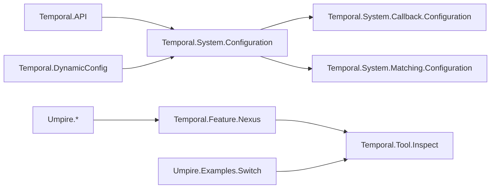

# Temporal Semantic Model Layout and Umpire Domain Purity

## Overview

Complete the package split by separating Temporal-owned semantic models from the reusable Umpire library. Reusable Umpire modules, examples, fixtures, and tests become fully domain-neutral; Temporal feature meaning, system mechanisms, and developer tooling move into explicit `Temporal.Feature.*`, `Temporal.System.*`, and `Temporal.Tool.*` namespaces.

The result is a clean replacement: no compatibility aliases or obsolete module roots remain, while the stable regression command, model behavior, planner output, and inspector scenario identities remain intact.

## Goal & Context
<!-- scope: business -->

Lean model authors need module names to communicate semantic ownership. Today, Temporal product vocabulary still appears in reusable Umpire tests, and Temporal feature, configuration-system, and tooling concerns are grouped under one Umpire-qualified Temporal namespace. This makes the reusable boundary less trustworthy and obscures whether a model describes product behavior, an implementation mechanism, or a tool.

The migration affects model developers and users of the direct inspector executable. The public make-level regression entry point remains stable. It introduces no runtime or operational behavior beyond internal Lean target and executable renames.

## Architecture & Data Models
<!-- scope: technical -->

The reusable library owns only domain-neutral semantic declarations, authoring DSLs, planning, artifacts, examples, and synthetic tests. Temporal product semantics use three altitudes:

- `Temporal.Feature.*` owns product-visible behavior, abstract feature state, properties, behaviors, and checked targets.
- `Temporal.System.*` owns concrete configuration interpretation, routing, delivery, evidence, execution mechanisms, and future refinement inputs.
- `Temporal.Tool.*` owns inspection and other developer tooling without owning behavioral meaning.

Generated representation and configuration catalogs remain `Temporal.API.*` and `Temporal.DynamicConfig.*`. They are mechanical inputs rather than feature or system semantics.



The configuration system has one shared core/facade and two one-way consumers. Shared configuration never imports Callback or Matching. Feature models never import concrete System configuration or execution mechanisms. The production Temporal aggregate imports Feature and System model facades, but not Tool executable code.

## API Contracts
<!-- scope: technical -->

- The public semantic namespaces are `Temporal.Feature.Nexus.AutoClose`, `Temporal.Feature.Nexus.CallerClosure`, `Temporal.System.Configuration`, `Temporal.System.Callback.Configuration`, `Temporal.System.Matching.Configuration`, and `Temporal.Tool.Inspect`.
- `Temporal.System.Configuration` retains the generic classification/use types and checkers, immutable views, validation, deterministic resolution, provenance, and catalog-fixture conformance. Callback and Matching own their concrete classifications, interpretations, contexts, and typed uses.
- The test aggregate is `TemporalModelTests`; the executable is `temporal-model-inspect`.
- `temporal-model-inspect` keeps the scenario identities `workflow-nexus.query.exact-action-caller-closure` and `switch.query.exact-action`, canonical JSON output, exit statuses, and structured diagnostics.
- `make umpire-check-regression` remains the stable repository-root entry point.

## Edge Cases & Constraints
<!-- scope: technical -->

- The cutover is source-clean: old modules, namespaces, aggregate/executable targets, standalone auto-close root, and current documentation references are removed rather than aliased.
- Truthful source provenance follows moved Feature, System, and Tool modules. Golden artifacts may change only at those source locations; declaration identities, semantic digests, format versions, planner order, validation behavior, and portable fields remain stable.
- Existing configuration error kinds, invalid-input behavior, fixture mismatch behavior, resolution order, override semantics, callback address policy, admission, dispatch, and matching semantics remain unchanged.
- Existing explanatory comments move with their declarations and tests.
- The Umpire source guard covers every committed text artifact in production, examples, fixtures, comments, and tests while excluding build/runtime state. It rejects Temporal imports/namespaces and Temporal-owned semantic/source prefixes while allowing ordinary domain-neutral uses of the word “temporal.”
- Temporal import guards reject Feature-to-System and System-to-Feature dependencies, plus shared Configuration imports of Callback or Matching; Tool remains the only layer permitted to compose Feature and reusable examples for inspection.
- Historical Flow records and historical design documents are not rewritten to match the new layout.

## Approach

1. Extract shared configuration and matching semantics behind the System configuration boundary, then extract callback semantics and colocated tests.
2. Move the auto-close model and bounded caller-closure scenario into the Feature/Nexus namespace, preserving proofs, planning behavior, and truthful artifact provenance.
3. Replace product vocabulary in reusable Umpire tests with synthetic declarations while preserving all positive, negative, determinism, connector, law-witness, and digest assertions.
4. Move inspection into Tool, assemble the import-only Temporal test root, and perform one clean Lake/Makefile/documentation cutover.

## Quick commands

```bash
make umpire-check-regression
```

## Acceptance Criteria
<!-- scope: both -->

- **R1:** Every production, example, fixture, comment, and test under the reusable Umpire library is domain-neutral, and a regression guard rejects Temporal imports/namespaces plus `nexus.*`, `workflow.*`, and `workflow-nexus.*` semantic/source prefixes. Errors: any forbidden token or reverse import fails the regression command; ordinary domain-neutral uses of “temporal” remain accepted.
- **R2:** Temporal model code is owned by the approved Feature, System, and Tool namespaces with the documented one-way dependency graph, and the prior Umpire-qualified Temporal modules/namespaces are absent without compatibility aliases. Errors: stale imports, namespace declarations, module roots, or reverse Feature/System dependencies fail build or source guards.
- **R3:** Shared configuration, Callback configuration, and Matching configuration retain their existing public semantics and colocated coverage across the new System boundaries. Errors: malformed values, missing declarations, invalid overrides, unknown settings, fixture mismatches, invalid callback addresses, and rejected admission/dispatch paths produce the same checked results as before.
- **R4:** The Nexus auto-close model and caller-closure scenario retain their proofs, Workflow/Nexus composition coverage, bounded planning result, query identity, deterministic artifact, and validation behavior under Feature/Nexus ownership. Errors: invalid declaration/property/behavior/query/planning cases remain rejected through their existing typed errors; only approved source-provenance paths may change.
- **R5:** `TemporalModelTests` and `temporal-model-inspect` replace the old Temporal test and executable targets; both registered inspector scenarios retain canonical output, and invalid arguments, failed scenarios, and unknown scenarios retain status/stdout/stderr contracts. Errors: the former targets are unavailable, unknown scenario output remains one canonical diagnostic with no stdout artifact, and invalid arity remains a non-zero structured error.
- **R6:** `make umpire-check-regression` remains the stable root command, builds all renamed targets, enforces stale-interface and domain-purity guards, checks deterministic fixtures, and is documented with the new direct inspector command. Errors: any build, guard, fixture, determinism, or diagnostic mismatch propagates as a non-zero make failure.
- **R7:** Existing explanatory comments remain attached to the declarations and assertions they explain through mechanical moves and namespace updates. Errors: no runtime error surface; review treats dropped or materially detached comments as a migration defect.

## Early proof point

Task `fn-10-temporal-semantic-model-layout-and.1` validates that the largest mixed module can be decomposed behind a shared System configuration facade without changing resolution or fixture behavior. If it fails, re-evaluate the Configuration/Callback/Matching seam before moving further Temporal modules.

## Boundaries
<!-- scope: business -->

- No new DSL semantics, `SemanticValue` redesign, Observation/evidence adapter, planner capability, or promotion workflow.
- No new product-visible callback feature contract or Feature/System refinement module.
- No compatibility aliases or permanent re-export facades for old module, namespace, target, or executable names.
- No generated Lean API drift verification, CI workflow, or model-local Makefile changes.
- No glossary generation; the separately planned glossary/index work consumes the final namespace layout.
- No rewriting of historical Flow or design records.

## Decision Context
<!-- scope: both — conditionally substructured -->

The design uses semantic altitude rather than an extra Temporal Umpire qualifier: Feature names product meaning, System names mechanisms, and Tool names developer-facing inspection. A vertical package per concern keeps declarations near their tests while the shared Configuration core remains a deep module with one stable facade. A clean replacement was chosen over compatibility aliases because the interfaces are internal and aliases would preserve the misleading ownership model. Generated catalogs remain outside Feature/System because they are mechanical representations, not semantic interpretations.

The generic switch example remains reusable because it is deliberately synthetic. Actual Workflow/Nexus composition tests move to Temporal Feature rather than teaching the Umpire library about one consumer domain. Generated API drift/CI work remains declined and outside this refactor.

## References

- `.plans/UMPIRE_DSL.md`, section 22, “Temporal semantic placement and domain purity” (approved 2026-08-25)
- Completed package-split spec `fn-9-umpire-reusable-dsl-package-split`
- Completed Temporal dynamic-configuration spec `fn-8-umpire-temporal-dynamic-config`

## Requirement coverage

| Req | Description | Task(s) | Gap justification |
|-----|-------------|---------|-------------------|
| R1 | Reusable Umpire production and tests are domain-neutral and guarded | `fn-10-temporal-semantic-model-layout-and.5`, `.7` | — |
| R2 | Approved Feature/System/Tool ownership and clean cutover | `fn-10-temporal-semantic-model-layout-and.1`, `.2`, `.3`, `.4`, `.6`, `.7` | — |
| R3 | Configuration semantics and tests split without behavior drift | `fn-10-temporal-semantic-model-layout-and.1`, `.2`, `.7` | — |
| R4 | Nexus feature semantics and deterministic planning remain intact | `fn-10-temporal-semantic-model-layout-and.3`, `.4`, `.7` | — |
| R5 | Test and inspector targets cleanly renamed with stable behavior | `fn-10-temporal-semantic-model-layout-and.6`, `.7` | — |
| R6 | Stable root regression command and live documentation | `fn-10-temporal-semantic-model-layout-and.7` | — |
| R7 | Existing comments preserved through the migration | `fn-10-temporal-semantic-model-layout-and.1`, `.2`, `.3`, `.4`, `.6` | — |
