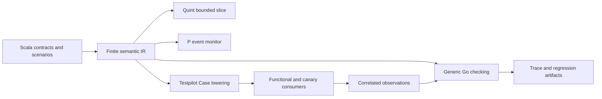

# Scala Umpire prototype for standalone activities and Nexus
> HTML render lens: open `.flow/artifacts/fn-107-scala-umpire-prototype-for-standalone/spec.html` locally — regenerable, markdown is the record. <!-- flow-next:artifact-link -->

## Goal & Context

A Temporal feature developer should be able to describe a promise, discover a design flaw, add implementation detail, and check a real execution without changing the Go checker. This prototype tests that hypothesis on standalone activities and Nexus.

Standalone activities supply an existing Go comparison model and a small runtime scenario. Nexus caller-close/reset supplies a reviewed design flaw involving irreversible handler effects, retained knowledge, and ownership transfer. The prototype must expose that flaw from authored promises and assumptions before the corresponding product feature ships.

The agreed prototype design supplies the scope. The existing Scala-to-IR foundation supplies the starting point. The work delivers readable Scala definitions, one finite semantic IR, generic Go consumers, and explicit evidence of their agreement. Feature developers own Scala behavior. Framework developers own the compiler, algorithms, wire adaptation, and actuators.

## Architecture & Data Models



Authors use contracts, refinements, and observations at every level. Product contracts describe visible behavior; system contracts introduce participants, channels, queues, persistence, and recovery. Further refinements reuse the same vocabulary. Distinguish a logical operation, an execution attempt, and a delivery message.

Refinement includes initial-state correspondence, state projection, and visible event/result projection. Each detailed transition maps to a permitted abstract transition or an invisible stutter that emits no product-visible result. Progress has separate assumptions and checks. Filling a knowledge gap does not establish refinement.

The semantic core contains typed finite values, guarded atomic transitions, explicit nondeterministic alternatives, named participants, bounded channels, pure predicates, state invariants, and finite event monitors. The system view names communicating machines, typed events, and queues; the feature view exposes guarded actions. Both lower to the same core. Split send, receive, commit, and acknowledgment when their ordering matters. Scala owns channel behavior, interruption points, persistence guarantees, faults, bounds, policies, observations, scenarios, and search priorities. Go implements reusable evaluation, search, serialization, lowering, evidence processing, and real side effects. A Go adapter must not decide whether an activity is eligible or which run owns a Nexus outcome.

An opaque contract supplies an explicit interface and all allowed bounded behavior. Checks that use it name the assumption. The scoped-refinement experiment replaces the activity's opaque durable-queue provider with a detailed queue/persistence provider, checks its interface and visible behavior, and includes a violating-provider negative control. This demonstrates the prototype's refinement semantics independently of P's module-refinement checker. A reachable undeclared behavioral hole makes affected results incomplete. Unsupported source constructs and malformed IR are definition/admission errors, never semantic holes.

Retain the existing TASTy lifter for the first experiment. Extend its supported subset rather than adding a second frontend. Keep native enums, records, matches, and pure functions as the author surface; choose the minimum declaration syntax by reviewing two specimens before expanding the compiler.

The prototype must own its Scala framework, feature definitions, compiler wrapper and generated jars under `model/scalav2`; its authoring project lives in `model/scalav2/scala/{umpire,temporal}`. It must build, lift, test and lint without `model/scala`. Shared protobuf schemas, generated APIs, generic Go checking and existing Go comparison models remain reusable inputs. Task 16 relocates the prototype additions and restores only the eleven task-2 legacy-path changes from guarded saved-before bytes; later tasks use v2-owned Scala paths.

Import existing public, internal, and persistence protobuf descriptors as needed by those specimens. Preserve presence, oneofs, enums, and validation constraints. Exploration selects authored abstractions of relevant fields rather than enumerating full messages. Scala can declare symbolic identity and correlation roles for existing fields. A generated UUID may be checked for validity and non-emptiness while its exact spelling is abstracted; retain equality relationships wherever a property depends on them.

Scenarios are dependency DAGs of typed commands, learned values, observations, and worker instructions. A generated run ID or operation token is bound once and consumed by dependent branches. Lower executable scenarios into the existing Testpilot Case/Program/Contract boundary. The semantic IR carries model behavior; the execution Case carries one bounded plan and deterministic contract. Their schemas have separate responsibilities and must not be conflated.

The existing Testpilot abstraction is a mandatory integration point. Functional and canary consumers use its Profile, Driver, Prepare, Run, and Evaluate boundaries. Reuse typed RPCs, learned values, correlation, fault recording, SDK worker execution, and replay. The plan may evolve Testpilot where a missing primitive prevents the experiment; each change names the gap, preserves model authority, and checks existing consumer compatibility. Expected gaps include activity SDK activation, durable-commit observation, hold-delivery control, and authored-monitor support. Do not introduce a parallel Scala-specific runtime.

Testpilot exposes an optional producer-neutral prepared assessment interface for model conformance. A caller supplies an immutable prepared factory bound to the admitted Case identity, model identity, query, and evaluation ceilings. It creates fresh passive assessment state per Run or offline replay. The facade composes it with the existing Contract monitor for live events and drives the same factory through recorded events for Evaluate. Assessment results carry trace conformance and property conclusions separately from the existing Contract Verdict. The shared protocol may add a generic assessment result carrier on Run and Evaluation; the factory's bound model/query identity makes replay mismatches errors. Existing Prepare/Run/Evaluate callers retain the built-in Contract path. Testpilot imports no Scala-specific package, and the caller's IR adapter imports only public Testpilot interfaces.

The isolated canary harness receives an explicit Case/Profile binding through a test-only binding/preflight seam in the existing consumer. Its activity Case identity and worker script must match the functional consumer's canonical bytes. Production's fixed Case/Profile binding and preflight route remain fixed; no command-line or production configuration override is added.

## API Contracts

Checking takes an admitted IR model, a selected query/property, and an explicit finite scope. Its receipt names model identity, scope, assumptions, checked claims, coverage, and missing support. A witness identifies source definitions and transitions and must replay through the same Go semantics. Exhaustion with no counterexample establishes only the stated finite safety scope. Progress requires an explicit deadlock witness, a fair non-progress cycle, or a violated modeled deadline.

Runtime assessment reports trace conformance and each property's verdict separately. The checker retains all modeled executions compatible with observations and causal order. Conformance fails when none explains sufficient evidence and a semantic hole cannot account for the mismatch. At a property's declared evaluation point, agreement across all remaining possibilities establishes satisfaction or violation; disagreement yields inconclusive. Insufficient evidence never becomes a false Boolean operand.

Scala declares required controls and observations. Immutable environment profiles supply capabilities and resource bindings. Preparation rejects an unavailable required actuator before target I/O and names it. An executable scenario with insufficient property evidence runs and returns an inconclusive assessment. Wall-clock driver limits are operational stops; modeled deadlines use the declared logical/event/local timing facts. Unrelated process timestamp changes cannot alter a causally unchanged verdict.

Observations report committed facts with logical operation, attempt, delivery, run, and causal identities where relevant. RPC invocation or write invocation does not imply receiver effect or durable commit. Crossed operation/run/attempt evidence cannot satisfy a correlated promise.

Event monitors are passive. They cannot disable behavior or eliminate a counterexample. Their state participates in explored-state identity, so histories carrying different obligations remain distinguishable. Partial-evidence checking advances a monitor for each compatible execution and leaves the property inconclusive when their conclusions disagree.

## Edge Cases & Constraints

The initial verification profile uses finite enums/records, bounded collections and counters, finite action parameters, symbolic IDs with equality, bounded logical time, and a finite fault budget. It excludes arbitrary Scala execution and unrestricted recursion. Scope-bound exhaustion is recorded as incomplete when the query needs behavior beyond that bound. Unsupported protobuf validation constraints produce a source-linked diagnostic or an explicit check-support limitation; they cannot silently disappear.

Start each specimen with one logical entity. Exploration may increase the activity scope to two logical activities, bounded retries, and one declared fault. Nexus uses one logical operation, one original run, one reset successor, one handler, one cancellation, and a bounded completion channel. Receipts always carry the actual bounds. A tenfold input increase either stays within explicit resource ceilings or returns a resource-limit result; it never silently truncates an allegedly exhaustive result.

The activity design control starts scheduled with no admitted attempt. It enqueues stale eligibility, applies pause, delivers the old message, and wrongly admits a new attempt without checking current eligibility. No unpause intervenes. The corrected design checks eligibility at authoritative admission. Work already admitted before pause remains a distinct case. This is a deliberately faulty specimen, not a claim of a known Temporal server defect.

Queue/persistence refinement records enqueue, durable commit, delivery, admission, and acknowledgment separately. Its implementation detail must follow the selected activity route. Channel declarations state FIFO or reordered, reliable or lossy, and duplicate-delivery behavior explicitly; no external checker default supplies Temporal semantics. Go derives permitted fault choices from those declarations at each authored interruption point. Competing timer firings remain independent until a causal or declared scheduling constraint orders them. Crash loses ephemeral state; loss of committed storage requires a separately authored fault. Use a shared network machine only for a failure correlating multiple channels. The Nexus route is modeled independently.

The Nexus design separates cancel intent, delivery, handler effect, reported outcome, durable retention, and caller knowledge. Closing a workflow freezes its history while declared detached work may proceed. Cancellation principal and lifetime rules survive reset. Stable logical operation/request identity spans distinct run identities. Reset reconstructs retained evidence and transfers ownership; it cannot undo a handler effect.

Pin two Nexus negative controls. First, the handler becomes terminal after caller close, receives a permanent completion rejection, stops reporting, and reset reconstructs the operation as open from a point after start but before close/cancellation. Second, a completion arriving after reset is acknowledged by the original run while the successor stays uninformed. The corrected design retains the outcome and transfers/routes the delivery obligation to the current owner. A completion may be acknowledged only after current-owner commit or durable retention with an outstanding obligation that ownership transfer preserves. Check canceled, succeeded, and failed outcomes, duplicate delivery, transient rejection, permanent rejection, and lost acknowledgment.

A finite timeout converts an apparent indefinite Nexus hang into a lost-outcome/unnecessary-wait result unless a separate progress violation is established. Conditional progress states handler-reporting, retry, recovery, fairness, deadline, and retention assumptions. A finite prefix ending open is not a liveness counterexample.

Use current synchronous/asynchronous Nexus runtime completion to demonstrate the shared seam. Caller-close/reset remains design checking unless the implementation exposes the needed behavior and commitments. This prototype does not resume the separately deferred Nexus cancellation implementation.

Generated artifacts fix model identity, inputs, dependency graph, worker script, seed, and declared fault decisions. Bind physical resources at execution. Identical generation inputs produce identical bytes. Controlled local replay pins the supported scheduling decisions. Black-box repetition permits different legal interleavings. Record only realized faults as runtime evidence. Existing violations supported before an operational failure remain violations; incomplete later evidence cannot fabricate satisfaction. Live and offline evaluation use the same precedence.

## Acceptance Criteria

- **R1:** Review two Scala authoring sketches and their expected traces before framework expansion. Each uses native Scala plus a small declaration vocabulary and names product/system boundaries, properties, observations, and finite assumptions. Record the feature-specific source size and edit-to-diagnostic baseline. Errors: unsupported syntax is identified explicitly; a hand-reviewed sketch is never reported as a checked proof.
- **R2:** Extend the existing frontend/IR with exactly the constructs needed by the specimens, preserving typed semantics, source-linked identities, optional presence, nondeterministic branches, and declared holes. Errors: unknown versions, bad references, crossed types, invalid bounds, unrestricted constructs, and unsupported validation constraints are diagnosed; empty transition sets remain disabled actions rather than holes.
- **R3:** Check bounded safety, composition, and refinement with the generic Go semantics. Receipts identify bounds, assumptions, coverage, and affected holes; every reported witness replays. Errors: visible-output stutter, initial-state mismatch, reachable uncontracted holes, rejected witnesses, and resource exhaustion never become successful refinement or search success; unrelated holes do not erase established violations.
- **R4:** The standalone activity slice agrees with the existing Go model on every corresponding finite state/action/result/property, including disabled actions. Search finds the stale-delivery/pause negative control and excludes it in the corrected slice. Queue/persistence detail satisfies the declared coarse refinement and crash guarantee; replacing its opaque provider passes scoped refinement while a violating provider fails. Errors: pre-pause admission, stale delivery, duplicate messages, competing timers, failed commit, acknowledgment loss, and separately declared storage loss remain distinguishable.
- **R5:** The Nexus slice exposes both pinned close/reset negative controls and excludes them for the corrected design within declared bounds. It preserves outcome/ownership safety across canceled, succeeded, and failed outcomes and checks progress only under named assumptions. Errors: transient versus permanent rejection, reset before/after retention/acknowledgment, duplicate completion, principal loss, timeout resolution, deadlock, and fair non-progress cycles receive the specified distinct assessments.
- **R6:** Scala-declared protobuf observations, DAG scenarios, learned IDs, and worker scripts lower into admitted Testpilot Cases without feature policy in Go. Reuse existing Case/Program/Contract, Profile/Driver, and Prepare/Run/Evaluate abstractions; make narrowly required changes there and verify existing consumers. Errors: absent/empty IDs, mismatched descriptors, crossed correlations, duplicate bindings, dependency cycles, unavailable scripts, and unsupported executable constructs are rejected before I/O or identified as explicit support gaps according to the boundary that fails; a separate Scala-specific execution runtime is outside this contract.
- **R7:** Run the same public standalone activity completion scenario/property and Scala-declared Go SDK script through a functional consumer and an isolated canary consumer. Translate selected activity completion/retry/pause-unpause and Nexus synchronous/asynchronous tests, preserving their behavioral assertions. Errors: missing capability prevents execution before I/O; public execution does not claim internal commitments it cannot observe; concurrent repeated runs bind independent resources and learned identities.
- **R8:** A local activity pause/delivery scenario uses a declared hold-delivery control and correlated attempt-admission commit observation. The canary profile rejects that control. Removing commit evidence leaves the admission property inconclusive whenever public evidence cannot resolve it. Realize and record one declared fault, check runtime conformance/property results separately, and replay the assessment offline. Errors: timeout after commit, acknowledgment loss, missing/crossed evidence, clock skew, and operational failure follow the same evidence/precedence rules live and offline.
- **R9:** Export the complete selected finite slice to Quint and compare all reachable initial states and transitions, visible events/results, disabled actions, and selected properties with Go. Replay its counterexamples through Go. Author state invariants and finite event monitors for terminal finality, at most one admitted active attempt, and Nexus retained-outcome/ownership/acknowledgment. One P monitor agrees with the same authored Go monitor on the supported bounded event traces and states its coverage. Errors: unsupported constructs are rejected, rejected external witnesses remain errors, and syntax-only export is not accepted as semantic agreement or P module-refinement validation.
- **R10:** Scala-authored variation domains and priorities drive discovery of an execution absent from pinned regressions. Reproduce and minimize a controlled runtime failure into a replayable regression proposal; inspect its product/system steps, fault decisions, evidence, and holes. Identical generation inputs produce byte-identical artifacts. A Go feature developer adds a scenario and changes a policy by editing feature Scala alone; record steps, feature-specific lines, and diagnostic latency. Errors: unreproduced runtime failures are not promoted; minimization preserves validity/dependencies and the failure; search bounds and sampled runtime coverage are reported separately; black-box repetition does not promise a fixed schedule.

- **R11:** The v2 generation, lifting, native tests, Go checks and lint pass in an isolated snapshot with `model/scala` absent and v2 jars regenerated from scratch. The pre-isolation gate fails in that same snapshot. Regeneration is deterministic; source relocation and recorded lint normalization preserve Definition IDs, tables, refinement, evidence and behavior fingerprints. Legacy edits are limited to guarded restoration of the task-2 delta, preserving preexisting and later user changes. Active build/runtime dependencies on the legacy Scala tree are rejected.

## Early proof point

Task fn-107-scala-umpire-prototype-for-standalone.1 reviews the two sketches and expected traces. Task fn-107-scala-umpire-prototype-for-standalone.4 establishes the executable proof point by combining Go parity, the pause counterexample, and its corrected refinement. If either milestone fails, reconsider the authoring vocabulary or semantic core before building runtime/export consumers.

## Boundaries

- Only standalone activities and Nexus are feature specimens. Workflow close/reset are small contracts required by Nexus.
- No production CallerClosePolicy implementation, broad workflow model, or deferred Nexus cancellation feature work.
- No repository-wide frontend migration or replacement of existing Lean models and checks. The v2 experiment owns its Scala inputs and tooling; legacy Scala remains an independent baseline.
- No arbitrary Scala interpreter, unbounded verification, advanced search reduction, or proof assistant project.
- No full P or TLA+ exporter. Quint covers the finite selected slice; P covers one monitor.
- No new canary scheduling service, deployment, automatic regression promotion, or external publishing.
- No broad generated API drift verifier or new GitHub Actions coverage. Preserve existing focused generation checks.
- No editor/IDE platform or standalone visualization application. A local trace artifact is sufficient.

## Decision Context

The Scala experiment is explicitly authorized as a follow-on to the comparative model and frontend work. Existing Umpire rules still govern generic semantics, checked admission, evidence, and runtime ownership. Legacy Lean-only requirements do not prevent this authorized prototype.

Retaining TASTy minimizes frontend changes. Using the current generic Go model/search utilities and Testpilot execution boundary minimizes runtime duplication. Two consumers test the portability of one authored behavior. Full bounded Quint agreement tests the semantic abstraction; a single P monitor tests event-level adaptation at smaller cost. Section 10's Temporal fit supplies the combination of guarded feature actions, communicating system machines, channel-derived faults, event monitors, and scoped module refinement. The selected existing standalone/workflow activity parity tests compare their shared contract without a full workflow model.

The [Nexus reviewer finding](https://app.notion.com/p/3878fc56773880a59c32d389e57dc4b1?d=3cd8fc5677388036b17b001c58fc1dd8#0e021b7e8a94407a846075edd62a2504) and [CallerClosePolicy design](https://app.notion.com/p/3878fc56773880a59c32d389e57dc4b1) motivate the Nexus controls. They are design evidence, not proof of the current server's behavior. The author must declare outcome preservation and the handler reporting assumptions for the checker to find the flaw.

Schema library choices, instrumentation placement, and concrete control hooks are scheduled investigation within the relevant implementation tasks. They must satisfy the contracts above; they are not unresolved product decisions.

Maintainability (plan review): duplication - none identified; structure - use the public producer-neutral prepared assessment seam to prevent a dependency from generic Testpilot to the Scala-specific conformance adapter.

## Quick commands

```bash
make umpire-check-scala
make lint-scala
mise exec -- go test -tags test_dep ./model/scalav2/... ./model/go/...
```

Task-specific commands cover runtime adapters, functional execution, and backend agreement. The final prototype demonstration records exact commands and finite bounds for each acceptance claim.

## Requirement coverage

| Req | Description | Task(s) | Gap justification |
| --- | --- | --- | --- |
| R1 | Review two Scala authoring sketches and their expected traces before framework expansion. Each uses native Scala plus a small declaration vocabulary and names product/system boundaries, properties, observations, and finite assumptions. Record the feature-specific source size and edit-to-diagnostic baseline. Errors: unsupported syntax is identified explicitly; a hand-reviewed sketch is never reported as a checked proof. | fn-107-scala-umpire-prototype-for-standalone.1, fn-107-scala-umpire-prototype-for-standalone.4, fn-107-scala-umpire-prototype-for-standalone.5, fn-107-scala-umpire-prototype-for-standalone.11 | — |
| R2 | Extend the existing frontend/IR with exactly the constructs needed by the specimens, preserving typed semantics, source-linked identities, optional presence, nondeterministic branches, and declared holes. Errors: unknown versions, bad references, crossed types, invalid bounds, unrestricted constructs, and unsupported validation constraints are diagnosed; empty transition sets remain disabled actions rather than holes. | fn-107-scala-umpire-prototype-for-standalone.2, fn-107-scala-umpire-prototype-for-standalone.6, fn-107-scala-umpire-prototype-for-standalone.15, fn-107-scala-umpire-prototype-for-standalone.16 | — |
| R3 | Check bounded safety, composition, and refinement with the generic Go semantics. Receipts identify bounds, assumptions, coverage, and affected holes; every reported witness replays. Errors: visible-output stutter, initial-state mismatch, reachable uncontracted holes, rejected witnesses, and resource exhaustion never become successful refinement or search success; unrelated holes do not erase established violations. | fn-107-scala-umpire-prototype-for-standalone.2, fn-107-scala-umpire-prototype-for-standalone.3, fn-107-scala-umpire-prototype-for-standalone.7, fn-107-scala-umpire-prototype-for-standalone.14, fn-107-scala-umpire-prototype-for-standalone.15 | — |
| R4 | The standalone activity slice agrees with the existing Go model on every corresponding finite state/action/result/property, including disabled actions. Search finds the stale-delivery/pause negative control and excludes it in the corrected slice. Queue/persistence detail satisfies the declared coarse refinement and crash guarantee; replacing its opaque provider passes scoped refinement while a violating provider fails. Errors: pre-pause admission, stale delivery, duplicate messages, competing timers, failed commit, acknowledgment loss, and separately declared storage loss remain distinguishable. | fn-107-scala-umpire-prototype-for-standalone.1, fn-107-scala-umpire-prototype-for-standalone.3, fn-107-scala-umpire-prototype-for-standalone.4, fn-107-scala-umpire-prototype-for-standalone.10, fn-107-scala-umpire-prototype-for-standalone.14 | — |
| R5 | The Nexus slice exposes both pinned close/reset negative controls and excludes them for the corrected design within declared bounds. It preserves outcome/ownership safety across canceled, succeeded, and failed outcomes and checks progress only under named assumptions. Errors: transient versus permanent rejection, reset before/after retention/acknowledgment, duplicate completion, principal loss, timeout resolution, deadlock, and fair non-progress cycles receive the specified distinct assessments. | fn-107-scala-umpire-prototype-for-standalone.1, fn-107-scala-umpire-prototype-for-standalone.3, fn-107-scala-umpire-prototype-for-standalone.5, fn-107-scala-umpire-prototype-for-standalone.14 | — |
| R6 | Scala-declared protobuf observations, DAG scenarios, learned IDs, and worker scripts lower into admitted Testpilot Cases without feature policy in Go. Reuse existing Case/Program/Contract, Profile/Driver, and Prepare/Run/Evaluate abstractions; make narrowly required changes there and verify existing consumers. Errors: absent/empty IDs, mismatched descriptors, crossed correlations, duplicate bindings, dependency cycles, unavailable scripts, and unsupported executable constructs are rejected before I/O or identified as explicit support gaps according to the boundary that fails; a separate Scala-specific execution runtime is outside this contract. | fn-107-scala-umpire-prototype-for-standalone.1, fn-107-scala-umpire-prototype-for-standalone.6, fn-107-scala-umpire-prototype-for-standalone.7, fn-107-scala-umpire-prototype-for-standalone.9, fn-107-scala-umpire-prototype-for-standalone.10, fn-107-scala-umpire-prototype-for-standalone.12, fn-107-scala-umpire-prototype-for-standalone.13, fn-107-scala-umpire-prototype-for-standalone.22 | — |
| R7 | Run the same public standalone activity completion scenario/property and Scala-declared Go SDK script through a functional consumer and an isolated canary consumer. Translate selected activity completion/retry/pause-unpause and Nexus synchronous/asynchronous tests, preserving their behavioral assertions. Errors: missing capability prevents execution before I/O; public execution does not claim internal commitments it cannot observe; concurrent repeated runs bind independent resources and learned identities. | fn-107-scala-umpire-prototype-for-standalone.6, fn-107-scala-umpire-prototype-for-standalone.9, fn-107-scala-umpire-prototype-for-standalone.11, fn-107-scala-umpire-prototype-for-standalone.13, fn-107-scala-umpire-prototype-for-standalone.22 | — |
| R8 | A local activity pause/delivery scenario uses a declared hold-delivery control and correlated attempt-admission commit observation. The canary profile rejects that control. Removing commit evidence leaves the admission property inconclusive whenever public evidence cannot resolve it. Realize and record one declared fault, check runtime conformance/property results separately, and replay the assessment offline. Errors: timeout after commit, acknowledgment loss, missing/crossed evidence, clock skew, and operational failure follow the same evidence/precedence rules live and offline. | fn-107-scala-umpire-prototype-for-standalone.6, fn-107-scala-umpire-prototype-for-standalone.7, fn-107-scala-umpire-prototype-for-standalone.10, fn-107-scala-umpire-prototype-for-standalone.11, fn-107-scala-umpire-prototype-for-standalone.12, fn-107-scala-umpire-prototype-for-standalone.23 | — |
| R9 | Export the complete selected finite slice to Quint and compare all reachable initial states and transitions, visible events/results, disabled actions, and selected properties with Go. Replay its counterexamples through Go. Author state invariants and finite event monitors for terminal finality, at most one admitted active attempt, and Nexus retained-outcome/ownership/acknowledgment. One P monitor agrees with the same authored Go monitor on the supported bounded event traces and states its coverage. Errors: unsupported constructs are rejected, rejected external witnesses remain errors, and syntax-only export is not accepted as semantic agreement or P module-refinement validation. | fn-107-scala-umpire-prototype-for-standalone.2, fn-107-scala-umpire-prototype-for-standalone.3, fn-107-scala-umpire-prototype-for-standalone.4, fn-107-scala-umpire-prototype-for-standalone.5, fn-107-scala-umpire-prototype-for-standalone.8, fn-107-scala-umpire-prototype-for-standalone.14, fn-107-scala-umpire-prototype-for-standalone.15 | — |
| R10 | Scala-authored variation domains and priorities drive discovery of an execution absent from pinned regressions. Reproduce and minimize a controlled runtime failure into a replayable regression proposal; inspect its product/system steps, fault decisions, evidence, and holes. Identical generation inputs produce byte-identical artifacts. A Go feature developer adds a scenario and changes a policy by editing feature Scala alone; record steps, feature-specific lines, and diagnostic latency. Errors: unreproduced runtime failures are not promoted; minimization preserves validity/dependencies and the failure; search bounds and sampled runtime coverage are reported separately; black-box repetition does not promise a fixed schedule. | fn-107-scala-umpire-prototype-for-standalone.11, fn-107-scala-umpire-prototype-for-standalone.22 | — |
| R11 | The v2 generation, lifting, native tests, Go checks and lint pass in an isolated snapshot with `model/scala` absent and v2 jars regenerated from scratch. The pre-isolation gate fails in that same snapshot. Regeneration is deterministic; source relocation and recorded lint normalization preserve Definition IDs, tables, refinement, evidence and behavior fingerprints. Legacy edits are limited to guarded restoration of the task-2 delta, preserving preexisting and later user changes. Active build/runtime dependencies on the legacy Scala tree are rejected. | fn-107-scala-umpire-prototype-for-standalone.16 | — |
