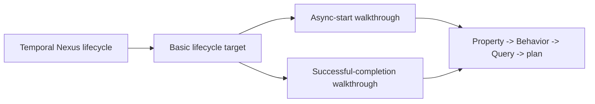

# Basic Nexus Umpire DSL Showcases

## Overview

Add an introductory Temporal-owned Nexus example that demonstrates the public Umpire Property, Behavior, Query, and planning surfaces without requiring readers to first understand caller ownership, connector composition, cancellation clashes, or multiple planning modes. The example uses one shared minimal lifecycle target and two deterministic one-step use cases: asynchronous start and successful completion.

The existing caller-closure scenario remains the advanced Workflow–Nexus integration reference. The new material becomes the bridge between the domain-neutral switch example and that advanced scenario.

## Goal & Context
<!-- scope: business -->

Lean model authors need a short, product-relevant path for learning how Temporal semantics enter the reusable Umpire DSLs. The current Nexus caller-closure scenario proves valuable integration behavior, but its ownership relation, multiple capabilities and providers, connector, several properties, and four query modes make it unsuitable as a first example.

This change serves developers reading or authoring Temporal models. It introduces no end-user, deployment, or operational behavior.

## Architecture & Data Models
<!-- scope: technical -->

After the Temporal semantic-layout cutover, a small Nexus lifecycle adapter lives under Feature ownership and reuses the existing authoritative operation lifecycle rather than defining another Nexus state machine. It exposes one capability, one provider, a fixed set of teaching states and actions, deterministic transition results, and the finite planning evidence needed by the public Umpire pipeline.

Two named walkthroughs share that adapter:

- asynchronous start: a scheduled operation receives the start action and becomes started;
- successful completion: a started operation receives the succeed action and becomes succeeded.

Each walkthrough presents its Property, exact one-action Behavior, checked Query, and deterministic planner result as a readable progression. The support adapter is the deep module: it encapsulates target composition and bounded-planner scaffolding so the walkthroughs stay focused on author intent.



## API Contracts
<!-- scope: technical -->

- The teaching target is Temporal-owned and imports only the final Feature Nexus lifecycle plus public Umpire interfaces.
- The target contains one capability/provider path and supports exactly the states/actions required by the two walkthroughs; unsupported state/action pairs produce no transition.
- Each walkthrough exposes the authored and checked Property, Behavior, and Query stages plus a deterministic planner result so readers can inspect both declarations and validated values.
- Behavior selects the controllable action; transition outcomes and observations remain owned by the target model.
- The examples compile through the public Temporal aggregate and their tests compile through the Temporal model test aggregate.

## Edge Cases & Constraints
<!-- scope: technical -->

- This spec depends on `fn-10-temporal-semantic-model-layout-and`; implementation targets its final Feature namespace, test aggregate, and command names rather than transitional paths.
- The examples share one lifecycle target. Separate miniature targets per DSL are forbidden because they would duplicate scaffolding and obscure how the stages compose.
- Invalid declaration composition continues to surface through the existing typed Umpire errors. Tests must also cover an unsupported lifecycle action and a behavior/trace mismatch.
- The reusable Umpire package remains free of Temporal and Nexus concepts. No reusable DSL semantics or public error types change.
- The advanced caller-closure scenario, inspector registry, scenario identities, canonical fixtures, and diagnostics remain unchanged.
- Existing comments in touched files are preserved. New comments should explain teaching boundaries or non-obvious decisions, not restate code.

## Approach

1. Build and test the small lifecycle target against the final Feature Nexus model, proving composition, both valid transitions, unsupported-transition behavior, finite completeness, and deterministic planning inputs.
2. Add the two progressive walkthroughs over that shared target, with focused positive and negative checks at the Property, Behavior, Query, and planner boundaries.
3. Expose the examples through the final Temporal/test aggregates, reconcile the entire live architecture document with the final Feature/System/Tool layout, and update the model learning path to lead from the generic switch, through the basic Nexus walkthroughs, to caller-closure as the advanced reference.

## Quick commands

```bash
cd model && mise exec -- lake build TemporalModelTests
make umpire-check-regression
```

## Risks & Dependencies

- `fn-10-temporal-semantic-model-layout-and` is a hard sequencing dependency because it replaces the current module, test-root, and inspector layout.
- The primary complexity risk is tutorial scaffolding overwhelming domain intent. Structural cardinality limits and a shared support module keep the public walkthroughs small.
- The examples deliberately rely on existing Umpire checking/planning contracts. If those contracts cannot express the two one-step cases without new DSL semantics, stop and reassess the example shape rather than extending the DSL.

## Test Notes

- Compile the final Temporal aggregate and import-only Temporal model test aggregate.
- Check both authoritative lifecycle transitions and at least one unsupported state/action pair.
- Check target composition, the single resolved provider/capability path, and finite completeness.
- For each walkthrough, check Property validation, Behavior admission of the intended trace, rejection of a mismatched trace, Query validation, selected action/outcome/observation, and deterministic repeated planning.
- Check that live model documentation contains no pre-cutover standalone library, `Temporal.Umpire.*`, old test-root, or old inspector names after the `fn-10` dependency lands.
- Run the full Umpire regression to prove the advanced scenario, inspector registry, fixtures, domain-purity guards, and diagnostics did not change.

## Acceptance Criteria
<!-- scope: both -->

- **R1:** A Temporal-owned basic Nexus lifecycle target reuses the authoritative Feature lifecycle and models the scheduled-to-started and started-to-succeeded one-step transitions through one capability and one provider. Errors: unsupported state/action pairs return no transition; missing or conflicting composition inputs retain the existing typed declaration errors.
- **R2:** The asynchronous-start walkthrough separately exposes and validates its Property, exact one-action Behavior, Query, and deterministic planner result, with the model—not the Behavior—owning the started outcome and observation. Errors: declaration/check failures retain their typed Property, Behavior, or Query errors; a non-start action or mismatched trace is not admitted.
- **R3:** The successful-completion walkthrough separately exposes and validates its Property, exact one-action Behavior, Query, and deterministic planner result over the same target, with the model owning the succeeded outcome and observation. Errors: declaration/check failures retain their typed Property, Behavior, or Query errors; a non-succeed action or mismatched trace is not admitted.
- **R4:** The public model and architecture documentation consistently describe the final Feature/System/Tool module layout, imports, dependency map, test root, and inspector executable, and provide a progressive learning path from the reusable switch example to the two basic Nexus walkthroughs and then to caller-closure as the advanced reference. Errors: any pre-cutover standalone library, `Temporal.Umpire.*`, old test-root, old inspector, stale command, or stale learning-path reference remaining in live model documentation is a verification defect with no runtime error surface.
- **R5:** The change leaves reusable Umpire semantics and the advanced caller-closure inspection contract unchanged. Errors: any new Temporal/Nexus dependency under reusable Umpire, registry membership change, scenario-identity change, fixture drift, diagnostic drift, or regression failure is rejected by the existing build/regression guards.

## Early proof point

Task `fn-11-basic-nexus-umpire-dsl-showcases.1` validates that the final Nexus lifecycle can be adapted to one small Umpire target with deterministic bounded planning. If it fails, re-evaluate the shared-target example boundary before authoring the walkthroughs or documentation.

## Boundaries
<!-- scope: business -->

- No Nexus runtime endpoint, worker, SDK, namespace, networking, retry, timer, callback, or cross-cluster behavior.
- No cancellation race, caller ownership, connector, AutoClose policy, or multi-provider example; caller-closure remains the advanced home for those concerns.
- No new Umpire syntax, semantics, errors, planner capability, Observation/evidence adapter, artifact format, or promotion workflow.
- No inspector registration, command, scenario identity, canonical fixture, Makefile manifest entry, or Lake target for the new examples.
- No reusable `Umpire.Examples` Nexus module and no changes to the domain-neutral switch example.
- No CI workflow wiring; the existing repository regression command is the required verification gate.

## Decision Context
<!-- scope: both -->

One shared target plus two one-step walkthroughs is the smallest shape that satisfies both “some basic Nexus use cases” and separate visibility of the Property, Behavior, and Query stages. The shared target is deliberately a deep module: it hides composition, completeness, and incremental-planner machinery behind a narrow teaching interface while preserving the target-owned outcome rule.

Separate targets per DSL were rejected as repetitive and misleading because the DSLs are designed to compose. A single multi-step exact-trace scenario was rejected because it introduces ordering concepts before readers understand exact-action behavior. Inspector registration and golden artifacts were rejected as showcase-irrelevant ceremony; direct Lean checks provide the teaching and regression value without changing the production scenario surface.

Rollout is compile-time only: land after the layout dependency, compile the new modules through existing aggregates, update the learning-path documentation, and use the unchanged regression command as the rollback signal. Reverting the example imports and docs fully removes the showcase without data or runtime migration.

## References

- Dependency: `fn-10-temporal-semantic-model-layout-and`
- Reusable package contract: `fn-9-umpire-reusable-dsl-package-split`
- [Temporal Nexus architecture](https://github.com/temporalio/temporal/blob/main/docs/architecture/nexus.md)
- [Lean source files and modules](https://lean-lang.org/doc/reference/latest/Source-Files-and-Modules/)

## Requirement coverage

| Req | Description | Task(s) | Gap justification |
|-----|-------------|---------|-------------------|
| R1 | Minimal shared Nexus lifecycle target | fn-11-basic-nexus-umpire-dsl-showcases.1 | — |
| R2 | Async-start Property/Behavior/Query walkthrough | fn-11-basic-nexus-umpire-dsl-showcases.2 | — |
| R3 | Successful-completion Property/Behavior/Query walkthrough | fn-11-basic-nexus-umpire-dsl-showcases.2 | — |
| R4 | Public aggregates and progressive documentation | fn-11-basic-nexus-umpire-dsl-showcases.3 | — |
| R5 | Reusable/advanced contracts remain unchanged | fn-11-basic-nexus-umpire-dsl-showcases.1, fn-11-basic-nexus-umpire-dsl-showcases.2, fn-11-basic-nexus-umpire-dsl-showcases.3 | — |
