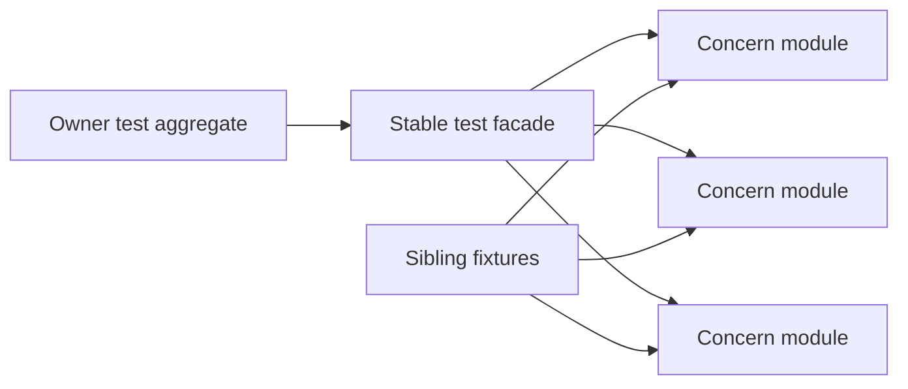

# Lean Test Suite Decomposition Follow-up

## Overview

Refine the completed semantic-layout baseline into concern-focused Lean test modules. The six approved suites that remain strictly above 300 lines are split behind stable import-only facades, while the already-decomposed Temporal owner suites remain intact. Each suite is an independent fresh-agent work unit executed serially on the shared current branch; a final integration pass verifies assertion, comment, import, and regression invariants across the combined change.

## Conversation Evidence

> user (turn 1): "is temporal/model/Umpire/Property/Tests.lean a good example of how Lean tests are structured? idiomatic/best practices?"
> user (turn 2): "suggest better version"
> user (turn 3): "what's more idiomatic/better?"
> user (turn 4): "yes"
> user (turn 5): "let's apply the same to each large Tests.lean - use a fresh sub agent for each task and follow own recommendation for split"
> user (turn 6): "approved"
> user (turn 7): "how do we get it into flow?"
> user (turn 8): "it's a followup to fn10"
> user (repository instructions): "when refactoring/changing code, preserve the existing comments"
> user (repository instructions): "always let the user commit, unless you are prompted to do it"
> user (repository instructions): "do not use git worktrees"

## Goal & Context
<!-- scope: business -->
<!-- Goal & Context: 50% [user] / 50% [paraphrase] -->

Make the project's large Lean regression suites easier to navigate and maintain by decomposing
them into idiomatic, concern-focused modules without changing the production model they exercise.
This is a separate follow-up to fn-10: it starts only after that spec is closed and uses its final
semantic ownership layout as an immutable baseline.

The direct users are Lean model authors and reviewers. End-user behavior, deployment, and operations
are unaffected.

## Architecture & Data Models
<!-- scope: technical -->
<!-- Architecture & Data Models: 20% [user] / 80% [paraphrase] -->

The approved inventory is fixed at the fn-10 closure baseline. Six owner-specific suites remain
strictly above 300 lines and are decomposed by testing concern; suites at exactly 300 lines or below
remain intact. Existing suite roots become stable import-only facades. Concern modules import a
sibling fixtures module instead of importing the facade.

Fixtures contain only base vocabulary and helpers shared by multiple concerns. Consumer-specific
variants stay with their consumer. Every new fixtures or concern module has a short module comment,
while pre-existing explanatory comments move verbatim with the declaration or assertion they
explain.

Each suite split is a separate Flow task owned by a fresh sub-agent. Because work runs on one shared
current branch and worktrees are forbidden, suite workers execute serially even though their write
surfaces are disjoint. A coordinating integration pass reviews the combined result and runs the full
regression gate.



## API Contracts
<!-- scope: technical -->
<!-- API Contracts: 100% [paraphrase] -->

Production DSL behavior and public APIs remain unchanged. Existing reusable and Temporal test
aggregate imports remain stable. Each split root directly imports every concern module; no concern
or fixtures module imports its root facade. Public visibility tests stay isolated from internal
fixtures and directly import only their production facade.

Test declarations continue to use the project's elaboration-based conventions: anonymous examples,
computation-oriented decisions for closed values, direct proofs for theorem contracts, and
definitional equality only when that is the behavior under test.

The fixed inventory contains reusable Core, Behavior, Property, Planning, and Query tests plus
shared Temporal configuration tests. The final owner-specific Nexus, Callback, Tool, reusable
Switch, and Temporal aggregate suites remain unchanged because they are cohesive and below the
threshold.

## Edge Cases & Constraints
<!-- scope: technical -->
<!-- Edge Cases & Constraints: 25% [user] / 75% [paraphrase] -->

No task may be claimed while fn-10 remains open. At claim time, the assigned suite tree must still
match the approved fn-10 closure baseline; concurrent drift in an owned tree stops that task for
human direction instead of silently expanding or rebasing its inventory.

Each worker records a declaration-level mapping from every original test and explanatory comment to
its destination module before movement. Counts distinguish existing module comments from new leaf
module comments and do not rely only on textual matching. Meaningful assertions are neither lost,
duplicated, nor weakened. Semantic fixture strings remain byte-for-byte stable from the fn-10
baseline.

The known vacuous canonical self-comparisons in the Behavior and Property suites are removed because
they cannot detect regressions. The Property negative uniqueness case must evaluate the focused
uniqueness property itself. Planning's separate visibility suite and the Callback-owned
configuration suite remain byte-for-byte unchanged. Query visibility directly imports only its
public production facade.

The integration task may repair missing aggregate imports or another demonstrable split-integration
defect, but it may not repartition a suite or rewrite its assertions without reopening that suite's
task. Any concurrent fn-11 aggregate change is preserved and reconciled rather than overwritten.

Implementation agents make only the task-scoped commits required by the flow-next worker protocol,
never include unrelated or user-owned changes, and do not use a git worktree.

## Approach

1. Require fn-10 to be closed, pin its closure baseline, and freeze the approved six-suite assertion, comment, and semantic-string inventories.
2. Dispatch one fresh suite agent at a time to split each still-large suite into a sibling fixtures module plus cohesive concern modules behind its stable root facade.
3. Integrate the six suite-local changes, verify direct facade coverage and cycle freedom, reconcile declaration/comment inventories, preserve unrelated aggregate changes, and run the full Lean and Umpire regression gates.

## Quick commands

```bash
(cd model && mise exec -- lake build UmpireTests TemporalModelTests)
make umpire-check-regression
git diff --check
```

## Risks & Dependencies

- `fn-10-temporal-semantic-model-layout-and` is a hard sequencing dependency. Its tasks and completion review are finished, but fn-12 remains blocked until the fn-10 spec is closed.
- The principal correctness risk is a mechanically green split that loses, duplicates, weakens, or detaches an assertion/comment. Per-suite declaration maps and the final integration pass address that risk.
- Shared fixtures can become a shallow dumping ground. Each task keeps consumer-specific variants in the concern that uses them and exposes only genuinely shared base vocabulary.
- `fn-11-basic-nexus-umpire-dsl-showcases` may independently update the Temporal test aggregate. The integration task preserves that work and changes an aggregate only when a missing fn-12 facade import is demonstrated.
- Current-branch execution without worktrees means the six fresh suite agents run serially. This trades speed for safe isolation of user-owned workspace state.
- Rollback is structural and suite-local: reverting a suite's facade and concern modules restores the pre-split layout without data, runtime, or compatibility migration.

## Test Notes

- Each suite task directly elaborates every new fixtures and concern module with the pinned Lean toolchain, then builds the narrowest existing aggregate that reaches the suite.
- Per-suite evidence records the original declaration/comment-to-destination map, preserves semantic source strings, and proves each facade directly imports every concern while no child imports the facade.
- The Query visibility module is checked for one direct production-facade import and no fixtures import. Planning visibility and Callback configuration tests are checked byte-for-byte against the fn-10 closure baseline.
- The final integration pass builds both owner test aggregates, runs the full Umpire regression, and uses filesystem-aware `rg --no-ignore` scans so untracked new leaves are included in trailing-whitespace and reusable-Umpire domain-purity checks. It also verifies the two approved assertion removals and focused uniqueness correction.
- No generated API or dynamic-config files are regenerated, and no documentation, Lake target, Make target, or CI workflow changes are expected.

## Acceptance Criteria
<!-- scope: both -->

- **R1:** The spec depends on fn-10, and no fn-12 task is claimed until the fn-10 spec is closed; planning and implementation use that closure baseline without changing fn-10. Errors: an open fn-10 spec, work against an intermediate layout, or amendments to fn-10 do not satisfy this criterion.
- **R2:** The approved fn-10 closure inventory is evaluated once: each of its six test roots still strictly above 300 lines receives the approved concern split, while cohesive owner modules at or below the threshold remain intact. Errors: silently omitting an inventoried suite, expanding scope from later unrelated growth, or fragmenting a below-threshold owner module does not satisfy this criterion.
- **R3:** Each split suite has cohesive concern modules, a cycle-free sibling-fixtures boundary, short module comments on every new file, and an import-only root that directly covers every concern. Public visibility checks directly import only their production facade. Errors: child-to-facade imports, missing direct facade coverage, visibility access to fixtures, or unrelated fixtures accumulating in the shared module do not satisfy this criterion.
- **R4:** Every original declaration and explanatory comment has a declaration-level destination record and occurs exactly once, semantic fixture strings remain byte-for-byte stable, the two approved vacuous comparisons are removed, and the Property uniqueness failure evaluates the focused uniqueness property. Errors: missing, duplicated, detached, rewritten, or weakened assertions/comments, textual-count-only evidence, or unrelated semantic-string changes do not satisfy this criterion.
- **R5:** Lean test idioms remain consistent across the split suites: anonymous examples, computation-oriented decisions for closed checks, direct theorem proofs, and definitional equality only when it is the tested contract. Errors: introducing a custom assertion framework or replacing theorem-level checks with weaker computations does not satisfy this criterion.
- **R6:** Every suite task is performed by a fresh sub-agent scoped to that suite, agents run serially on the shared current branch, and the coordinator performs integration. Agents make only the task-scoped implementation and lifecycle commits required by the flow-next worker protocol, preserve unrelated and user-owned changes, and do not use worktrees. Errors: reusing a worker across suites, overlapping workers in the shared workspace, cross-suite or unrelated commits, absorbing user-owned changes, or worktrees do not satisfy this criterion.
- **R7:** Every new fixtures and concern module passes direct Lean elaboration, each narrow owner aggregate passes, and the integrated model build, working-tree-aware whitespace/domain scans, structural import checks, assertion/comment inventories, and root Umpire regression pass. Errors: tracked-file-only scans, a focused pass without the full integration gate, build-only evidence without structural/inventory checks, or a green aggregate with a failed direct module does not satisfy this criterion.

## Early proof point

Task `fn-12-lean-test-suite-decomposition-follow-up.1` validates the facade, fixtures boundary,
declaration inventory, and concern-module split on the largest reusable suite. If it fails,
re-evaluate the fixtures boundary and inventory method before continuing with tasks `.2` through
`.6`.

## Boundaries
<!-- scope: business -->

- No production DSL behavior or public API changes.
- No amendment, narrowing, or expansion of fn-10 tasks; this work follows its closed result.
- No whole-repository re-inventory or additional split of cohesive owner modules at or below the approved threshold.
- No custom test framework, assertion DSL, new dependency, runtime I/O suite, or property-testing framework.
- No unrelated Lake, Make, CI, documentation, aggregate, or architecture changes.
- No generated API or dynamic-config changes, regeneration, drift verification, or CI coverage.
- No cross-suite or unrelated agent commits, concurrent shared-workspace workers, or git worktrees; task-scoped flow-next worker and lifecycle commits are allowed.

## Decision Context
<!-- scope: both — conditionally substructured -->

- A separate follow-up avoids planning against fn-10's intermediate ownership and keeps the semantic migration's scope unchanged.
- Concern modules make failures and fixtures local, while an import-only root preserves existing test entry points.
- One Flow spec keeps the consistency refactor and final regression gate together; per-suite tasks preserve the approved fresh-agent ownership boundary.
- Serial workers are required because the user selected the shared current branch and prohibited worktrees; disjoint write surfaces still make failures suite-local.
- Splitting already-small owner modules was rejected because file count alone is not a maintainability improvement.
- One monolithic refactor task was rejected because it would erase the fresh-agent ownership boundary and make assertion/comment loss harder to isolate.
- A cross-DSL shared fixture package was rejected as overkill because it would couple otherwise independent suites and obscure their public-module boundaries.
- Generated Lean API drift verification and CI coverage remain declined scope; this plan does not reopen that decision.

## References

- Dependency: `fn-10-temporal-semantic-model-layout-and`
- Coordination overlap: `fn-11-basic-nexus-umpire-dsl-showcases`
- Approved project design: “Lean test suite structure” (2026-08-25)
- Declined decision: “Generated API drift verification”
- [Lean source files and modules](https://lean-lang.org/doc/reference/latest/Source-Files-and-Modules/)
- [Lean proof validation](https://lean-lang.org/doc/reference/latest/ValidatingProofs/)

## Requirement coverage

| Req | Description | Task(s) | Gap justification |
|-----|-------------|---------|-------------------|
| R1 | Require the closed fn-10 baseline without modifying fn-10 | fn-12-lean-test-suite-decomposition-follow-up.7 | — |
| R2 | Evaluate the approved inventory and split only the six roots above threshold | fn-12-lean-test-suite-decomposition-follow-up.1, fn-12-lean-test-suite-decomposition-follow-up.2, fn-12-lean-test-suite-decomposition-follow-up.3, fn-12-lean-test-suite-decomposition-follow-up.4, fn-12-lean-test-suite-decomposition-follow-up.5, fn-12-lean-test-suite-decomposition-follow-up.6, fn-12-lean-test-suite-decomposition-follow-up.7 | — |
| R3 | Cohesive concern modules, fixtures boundaries, module comments, and direct import-only facades | fn-12-lean-test-suite-decomposition-follow-up.1, fn-12-lean-test-suite-decomposition-follow-up.2, fn-12-lean-test-suite-decomposition-follow-up.3, fn-12-lean-test-suite-decomposition-follow-up.4, fn-12-lean-test-suite-decomposition-follow-up.5, fn-12-lean-test-suite-decomposition-follow-up.6, fn-12-lean-test-suite-decomposition-follow-up.7 | — |
| R4 | Preserve mapped declarations/comments and make only the approved assertion corrections | fn-12-lean-test-suite-decomposition-follow-up.1, fn-12-lean-test-suite-decomposition-follow-up.2, fn-12-lean-test-suite-decomposition-follow-up.3, fn-12-lean-test-suite-decomposition-follow-up.4, fn-12-lean-test-suite-decomposition-follow-up.5, fn-12-lean-test-suite-decomposition-follow-up.6, fn-12-lean-test-suite-decomposition-follow-up.7 | — |
| R5 | Preserve established Lean test idioms | fn-12-lean-test-suite-decomposition-follow-up.1, fn-12-lean-test-suite-decomposition-follow-up.2, fn-12-lean-test-suite-decomposition-follow-up.3, fn-12-lean-test-suite-decomposition-follow-up.4, fn-12-lean-test-suite-decomposition-follow-up.5, fn-12-lean-test-suite-decomposition-follow-up.6, fn-12-lean-test-suite-decomposition-follow-up.7 | — |
| R6 | Use fresh serial suite agents with only task-scoped flow-next commits and no worktrees | fn-12-lean-test-suite-decomposition-follow-up.1, fn-12-lean-test-suite-decomposition-follow-up.2, fn-12-lean-test-suite-decomposition-follow-up.3, fn-12-lean-test-suite-decomposition-follow-up.4, fn-12-lean-test-suite-decomposition-follow-up.5, fn-12-lean-test-suite-decomposition-follow-up.6, fn-12-lean-test-suite-decomposition-follow-up.7 | — |
| R7 | Run direct module, aggregate, working-tree, structural, inventory, and full regression checks | fn-12-lean-test-suite-decomposition-follow-up.1, fn-12-lean-test-suite-decomposition-follow-up.2, fn-12-lean-test-suite-decomposition-follow-up.3, fn-12-lean-test-suite-decomposition-follow-up.4, fn-12-lean-test-suite-decomposition-follow-up.5, fn-12-lean-test-suite-decomposition-follow-up.6, fn-12-lean-test-suite-decomposition-follow-up.7 | — |
