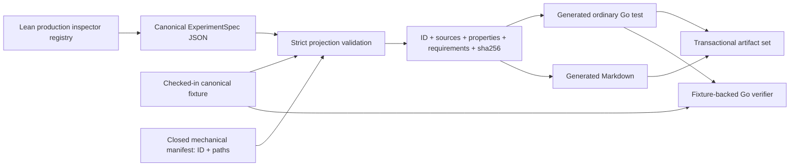

# Deterministic Go regression projections

## Overview

Complete the roadmap's C5 slice by projecting one existing, stable Lean regression into two familiar checked-in artifacts: an ordinary Go test wrapper and readable Markdown. The pilot is the current Workflow–Nexus caller-closure regression already registered by the production inspector and backed by a canonical `ExperimentSpec` fixture.

The projection remains deliberately thin. Lean and the canonical `ExperimentSpec` own all behavioral meaning; Go records and verifies stable identity, source provenance, and a concise semantic fingerprint. It neither reproduces the modeled procedure nor claims that Temporal executed or conformed.

## Goal & Context
<!-- scope: business -->

Lean model authors need a deterministic way to expose a stable regression to Go engineers without asking them to read a large canonical JSON artifact first. Go engineers and reviewers should be able to find a normal `_test.go` entry point, follow it back to the authoritative Lean declaration, and detect when its checked-in projection no longer matches the current semantic artifact.

This is developer tooling only. It changes no Temporal server behavior, public API, deployment, configuration, monitoring, or operator workflow. The successful outcome is one end-to-end projection that closes Milestone A's remaining generator gap and establishes a narrow extension seam for later stable regressions.

## Architecture & Data Models
<!-- scope: technical -->

The existing production inspector registry remains the only semantic input. A private, closed projection manifest selects exactly the caller-closure registry identity and supplies only mechanical repository layout: its canonical fixture and the two owned output paths. It carries no actions, outcomes, properties, or other behavioral semantics.

The generator invokes the existing inspector for that identity, validates the returned `umpire-experiment/v1`, and cross-checks the complete displayed metadata against the checked-in canonical fixture before rendering. Its internal projection record contains the stable regression identity, supported artifact format, sorted Lean source provenance, fixture path, property identities, observation-requirement identities, and a concise `sha256:` fingerprint computed over the exact UTF-8 contents of `ExperimentSpec.semanticIdentity`. Artifact provenance paths are model-root-relative by contract; validation resolves them under the repository's model root, while generated navigation renders the unambiguous repository-facing path with a `model/` prefix. The full semantic identity remains Lean-owned and is never copied into generated Go or Markdown.

A shared Go test helper is the deep test-facing module. Given a generated reference, it resolves and strictly reads the checked-in fixture, verifies format, query identity, model-root-relative source provenance, property identities, observation-requirement identities, and semantic fingerprint, and reports mismatches through `testing.TB`. The generated wrapper contains one normal `TestXxx` function that calls this helper; it does not start Temporal, execute an `ExperimentSpec`, or establish a conformance result.

Both generated files form one managed artifact set. Rendering completes and validates in memory, then the repository's shared transactional artifact publisher stages, validates, locks, atomically installs, rolls back handled failures, and recovers interrupted publication across both output roots.



## API Contracts
<!-- scope: technical -->

- `make umpire-gen-regression-projections` builds the existing inspector and regenerates the fixed Go and Markdown artifacts for the one stable pilot. It is silent on success and accepts no arbitrary or ephemeral scenario identity.
- `make umpire-check-regression-projections` regenerates into an isolated temporary root, byte-compares the complete fixed output set with the checked-in files, and runs the focused Go generator and projection-verifier tests.
- The stable `make umpire-check-regression` gate includes the projection check without changing the inspector's current single-scenario success and structured-error contracts.
- The private projection manifest contains exactly: inspector identity, canonical fixture path, generated Go path, and generated Markdown path. Adding semantic descriptions or execution instructions to this manifest is forbidden.
- The derived fingerprint is lowercase SHA-256 over the decoded `ExperimentSpec.semanticIdentity` string bytes and is rendered as `sha256:<64 lowercase hexadecimal characters>`. It is a concise projection fingerprint, not an independently authored semantic identity.
- Inspector provenance paths are canonical and model-root-relative. The generator validates each path as a contained Lean source below the model root, preserves the canonical value for inspector/fixture comparison, and renders `model/<provenance-path>` wherever a repository-facing navigation path is shown.
- The generated Go file begins with the standard `// Code generated ... DO NOT EDIT.` marker before the package clause. Each wrapper has a deterministic, valid, collision-checked Go test name and passes identity, supported format, canonical source provenance, fixture path, property identities, observation-requirement identities, and fingerprint to the shared verifier. Its comments render repository-facing `model/` source paths.
- The generated Markdown begins with an equally explicit generated/projection-only notice and presents the same identity, format, Lean sources, fixture, semantic fingerprint, property identities, and observation-requirement identities as the Go projection. It states that no runtime execution or evidence is represented.
- Outputs use UTF-8, LF line endings, stable ordering, no timestamps, no absolute paths, and no host, user, environment, or random data. Go bytes are normalized through the standard formatter.

## Edge Cases & Constraints
<!-- scope: technical -->

- Inspector failure, empty or mixed stdout/stderr, malformed JSON, an unsupported format version, a query-identity mismatch, an empty semantic identity, missing or unsafe model-root-relative source provenance, duplicate sources, or a stale/missing/malformed fixture fails before publication. Inspector and fixture projection records must agree on format, identity, canonical sources, properties, observation requirements, and fingerprint; changing any displayed field alone is stale. Diagnostics identify the stage and stable identity without dumping the complete semantic artifact.
- The closed manifest structurally excludes the reusable switch example and every ephemeral or exploration-only candidate. Unknown identities are still covered through the injected inspector/generator test seam, not exposed as a production selection flag.
- Manifest fixture/output paths are repository-relative; artifact provenance paths are model-root-relative. Both reject absolute paths, traversal, symlink escape, wrong file kinds, and paths outside their distinct declared roots. A missing or unwritable output root, concurrent writer, validation failure, or interrupted install leaves the previous complete output set recoverable and never publishes only one artifact.
- Generated Go identifier derivation rejects empty names and collisions after normalization. Source order, JSON object order, map iteration, and input ordering cannot affect output bytes.
- The fixture-backed Go helper fails on missing files, unsupported fixture versions, malformed JSON, identity/source/property/observation-requirement/fingerprint disagreement, or unsafe fixture paths. It never skips a mismatch and never interprets actions, outcomes, observations, or evidence.
- Existing comments in touched source and build files remain attached to the behavior they explain.
- No new third-party dependency is introduced.

## Approach

1. Define the closed one-regression projection model, strict `ExperimentSpec` extraction, semantic-identity fingerprinting, deterministic Go/Markdown rendering, and exhaustive synthetic/golden coverage.
2. Add the isolated Go projection verifier over checked-in canonical fixtures, proving the generated wrapper can be a useful ordinary test without a runtime.
3. Compose inspector execution, fixture cross-checking, renderer output, and transactional two-file publication behind one generator command with injected seams for failures.
4. Generate the caller-closure artifacts, add focused generation/check targets to the stable regression gate, and document ownership, regeneration, and the explicit no-runtime boundary.

## Quick commands

```bash
go test -count=1 -tags test_dep ./tools/umpire/internal/generate/regression ./tools/umpire/regression
make umpire-check-regression-projections
make umpire-check-regression
```

## Non-functional Targets

- Identical validated inputs produce byte-identical Go and Markdown on repeated clean runs and across input ordering differences.
- Generation performs one bounded inspector invocation for the single manifest entry and holds no runtime service connection.
- Publication is all-or-nothing across the two managed outputs and safe under concurrent invocation, handled write failure, and restart after interruption.
- Generated artifacts remain small navigation aids: they contain metadata and identifiers, never the full semantic identity or canonical `ExperimentSpec` body.

## Rollout, Rollback, and Documentation

Rollout is repository-local and compile-time only: land the generator, helper, checked-in projections, Make targets, and model documentation together. The focused check proves regeneration is clean and the generated Go package compiles and tests without Lean or a running Temporal server once artifacts are checked in.

Rollback removes the two generated files, their generator/helper surface, and Make/documentation wiring. No data migration, server rollout, feature flag, or compatibility alias is required. The existing inspector and canonical fixture remain valid throughout.

The model README documents the two commands, output ownership, source-of-truth rule, provenance-root conversion, fingerprint definition, and the distinction between projection verification and runtime execution/evidence. The generated Markdown is the readable regression index for this pilot; broader glossary, discovery, and promotion documentation remains owned elsewhere. The component-status roadmap is updated from “not implemented” to the exact landed one-regression C5 surface and actual Make interface.

## Risks & Mitigations

- **A projection could be mistaken for execution.** Both generated artifacts and the helper use explicit projection-only language, and the helper verifies metadata only.
- **Go could become a second semantic authority.** The manifest is restricted to IDs and paths; all displayed semantic metadata is extracted from the inspector and fixture, and mismatches fail closed.
- **The current semantic identity is too large for a wrapper.** Render only the precisely defined SHA-256 fingerprint while retaining the full Lean identity in the canonical fixture.
- **Two outputs could drift independently.** Render them from one projection record and publish/check them as one complete artifact set.
- **Future catalog growth could force premature abstraction.** Keep one closed entry now; collision and ordering checks make later extension safe without creating a public configuration surface.

## Acceptance Criteria
<!-- scope: both -->

- **R1:** The generator obtains the current canonical `umpire-experiment/v1` for exactly the stable caller-closure identity through the existing production inspector, validates its identity and non-empty model-root-relative Lean provenance against real sources below the model root, cross-checks the fixture's complete displayed projection record, and derives `sha256:` from the exact decoded semantic-identity bytes. Canonical provenance is preserved for comparison and rendered with a `model/` prefix for repository navigation. Errors: inspector failure, empty or contradictory output, malformed JSON, unsupported version, identity mismatch, empty identity, missing/duplicate/unsafe provenance, absent real source, any format/identity/source/property/observation-requirement/fingerprint disagreement, or missing/malformed/stale fixture returns non-zero before rendering or publication and preserves the prior outputs.
- **R2:** One checked-in ordinary `_test.go` wrapper has the standard generated marker, a deterministic collision-free `TestXxx` name, repository-facing source and fingerprint comments, and a single call to the shared fixture-backed projection verifier carrying format, stable identity, canonical sources, property identities, observation-requirement identities, fixture, and fingerprint. The verifier confirms every field without requiring Lean or Temporal. Errors: invalid/colliding names fail generation; missing, unsafe, malformed, unsupported, or mismatched fixture data fails the Go test without skipping or claiming execution.
- **R3:** One checked-in generated Markdown document presents the same stable identity, format, Lean source provenance, fixture, semantic fingerprint, properties, and observation requirements as the Go projection, with an explicit model-projection/no-runtime notice and no duplicated procedural semantics. Errors: missing metadata, Go/Markdown disagreement, nondeterministic ordering, or language that claims runtime execution/evidence fails focused golden or consistency tests.
- **R4:** Repeated clean generation produces byte-identical formatted Go and Markdown with stable ordering and no machine-dependent data, and publishes both files as one validated transactional artifact set. Errors: incomplete artifact maps, unsafe or symlinked paths, path escape, unwritable roots, concurrent writers, validation/format failure, or interrupted installation fails closed, rolls back or recovers through the shared publisher, and never leaves a one-file partial update.
- **R5:** Repository-root generation and check targets own the two projections, the check target detects missing, renamed, or byte-modified outputs and runs focused Go coverage, and the stable Umpire regression gate includes it. The model documentation explains commands, ownership, provenance roots, fingerprinting, and the projection-only boundary; the component-status roadmap records the landed C5 pilot and actual Make interface instead of “not implemented.” Errors: inspector/build/test/diff failures propagate non-zero; stale commands, paths, status, ownership text, or runtime claims are documentation defects.
- **R6:** The implementation consumes only the current reusable Umpire/Temporal inspector contract and shared generic generation mechanics; it introduces no Umpire3 dependency or semantic reuse, runtime executor, evidence/conformance logic, exploration/promotion workflow, Go authoring facade, generated Lean API drift verification, or CI/GitHub Actions wiring. Errors: any forbidden dependency, duplicated behavioral procedure, or declined drift/CI scope is a verification failure.

## Early proof point

Task `fn-13-deterministic-go-regression-projections.1` proves that the existing caller-closure `ExperimentSpec` can be reduced to a strict, concise projection record and rendered deterministically without copying its semantic body. If it fails, re-evaluate the projection boundary and fingerprint contract before adding the test helper, command, or checked-in outputs.

## Boundaries
<!-- scope: business -->

- No Temporal execution, environment adapter, `ExperimentRun`, evidence collection, semantic verdict, conformance, replay, or qualification; those remain C6 and later work.
- No discovery/list/explain surface, exploration candidate generation, promotion, artifact migration, glossary/index expansion, or fn-5 ownership.
- No generated Go authoring facade and no Go copy of actions, outcomes, state transitions, properties, or observation procedures.
- No public unified `umpire` CLI; repository Make targets and one internal generator command are sufficient for this slice.
- No projection of the reusable switch or the unimplemented basic fn-11 showcases; the existing stable caller-closure artifact is the sole pilot.
- No changes to the Lean DSL, planner, `ExperimentSpec` format, inspector registry membership, scenario identities, or canonical diagnostic contracts.
- No generated Lean API drift verification, GitHub Actions, or other CI workflow wiring.
- No Umpire3 code, artifact, schema, semantic declaration, test, runtime, or generator reuse.

## Decision Context
<!-- scope: both -->

The existing production inspector registry and canonical fixture already provide the smallest reliable C5 input, so a new Lean catalog/list command was rejected as redundant. A private one-entry manifest supplies only repository layout and keeps stable-selection policy closed until another concrete regression needs projection.

The caller-closure regression was chosen over fn-11's teaching examples because it already has a stable production identity and canonical fixture; fn-11 intentionally excludes inspector registration and artifacts. A Given/When/Then summary was deferred because the current canonical artifact does not carry that prose, and authoring it in Go would create a second semantic narrative. The generated document instead renders authoritative identifiers and provenance in a readable form.

A fixture-backed verifier was chosen over a no-op/log-only wrapper because it detects real identity and projection drift while remaining honest about the absence of runtime execution. Hashing the decoded Lean-owned semantic identity gives Go a compact comparison token without inventing a second semantic identity or embedding roughly the entire artifact in source.

Direct Umpire3 reuse was rejected because the current model contract is independent and prior work explicitly prohibits it; only the repository's domain-neutral artifact publication utility is reused. Generated Lean API drift verification and GitHub Actions coverage remain declined per `.flow/memory/declined/generated-api-drift-verification.md` and are not reopened by this request.

## References

- Umpire components and delivery status, C5 and Milestone A
- Dependency: `fn-1-lean-regression-dsl-and-nexus`
- Dependency: `fn-10-temporal-semantic-model-layout-and`
- Go command documentation: generated-code marker and explicit generation behavior
- Go `testing` package: `_test.go` and `TestXxx` discovery contract
- Existing repository transactional artifact-set publisher and clean-regeneration patterns

## Requirement coverage

| Req | Description | Task(s) | Gap justification |
|-----|-------------|---------|-------------------|
| R1 | Inspector/fixture validation and semantic fingerprint | `fn-13-deterministic-go-regression-projections.1`, `.3` | — |
| R2 | Ordinary generated Go wrapper and fixture-backed verifier | `fn-13-deterministic-go-regression-projections.1`, `.2`, `.4` | — |
| R3 | Readable generated Markdown consistent with Go | `fn-13-deterministic-go-regression-projections.1`, `.4` | — |
| R4 | Byte determinism and transactional two-file publication | `fn-13-deterministic-go-regression-projections.1`, `.3`, `.4` | — |
| R5 | Make checks, stable regression integration, and docs | `fn-13-deterministic-go-regression-projections.4` | — |
| R6 | C5-only isolation and declined-scope enforcement | `fn-13-deterministic-go-regression-projections.1`, `.2`, `.3`, `.4` | — |
