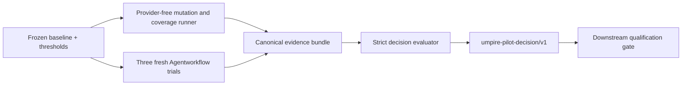

# Milestone A pilot baseline and Lean-first usability decision

> HTML render lens: local file `.flow/artifacts/fn-14-milestone-a-pilot-baseline-and-lean/spec.html` — regenerable, markdown is the record. <!-- flow-next:artifact-link -->

## Overview

Freeze and execute the pre-live Milestone A proof protocol before downstream runtime or qualification work. The pilot records eight source-backed historical Nexus defects, twelve semantic mutations across five closed families, current hand-authored coverage and cost baselines, and exactly three independent Agentworkflow authoring trials. A strict, recomputable receipt produces one of four outcomes: `LEAN_FIRST_GO`, `FACADE_FOLLOW_UP`, `NO_GO`, or `INCONCLUSIVE`.

This spec measures the existing Lean-first authoring and thin Go projection path. It does not change semantic model APIs, apply agent-produced patches, implement a Go authoring facade, or claim that Temporal executed or conformed.

## Goal & Context
<!-- scope: business -->

Before investing in current-model live integration, model engineers need evidence that the checked Lean path detects relevant mistakes quickly enough and that a fresh engineer or coding agent can make a small semantic change without copying framework machinery. Reviewers need the inputs, thresholds, raw measurements, trial patches, and decision formula fixed before results are collected so the outcome cannot be selected after the fact.

The pilot consumes the completed basic Nexus walkthroughs, current deterministic regression projection, and fn-5 catalog/orientation surface. It owns the Lean-first/facade decision threshold exactly once. Later qualification may consume the decision receipt but must not restate or weaken its gates.

## Architecture & Data Models
<!-- scope: technical -->



`tools/umpire/pilot` is the deep measurement module. It owns strict pilot manifests, isolated source snapshots, mutation validity and detection classification, coverage/timing aggregation, normalized Agentworkflow evidence, and the closed decision evaluator. It invokes existing inspector, regression, Lean, Go, and Agentworkflow commands; it does not duplicate their semantic checkers or shell-execution engines.

Agentworkflow gains one generic read-only `agentworkflow export <run-id> --json` boundary with schema `agentworkflow.evidence-export/v1`. It reopens and integrity-validates the admitted request, checkpoint, result, attempt manifests/event streams, base/candidate workspace digests, and bounded canonical patch bytes before emitting them. It rejects corrupt lifecycle data, source/candidate drift, binary or symlink changes, unsafe paths, size/event limits, and any patch that cannot be reproduced from the verified workspaces. The export neither resumes, applies, nor mutates a run and contains no pilot rubric or Umpire-specific semantics.

The frozen baseline names exactly eight distinct source-backed historical defects: timeout classification, nil headers, empty namespace completion, failure-conversion races, error-cause/caller-closure loss, cancellation retry identity, retry-delay parsing, and defensive header copying. Every entry records a stable source reference, unique root-cause key, expected semantic failure, required evidence, and `modeled`, `partial`, or `out_of_model` classification. Duplicate root causes, unverifiable references, live-only reproductions presented as model evidence, and post-measurement edits fail validation.

The mutation manifest contains exactly twelve valid semantic mutations spanning the closed families `outcome-classification`, `caller-closure`, `cancellation-retry`, `metadata-integrity`, and `artifact-binding`, with at least two per family and links to at least four distinct historical defects. Each mutation declares its isolated patch, eligibility layer, exact command, expected failure stage/reason, and whether it is mandatory. Compilation/setup failures that do not reach the declared semantic seam are invalid mutations, not detections.

The retained bundle lives at `docs/research/umpire-milestone-a-pilot-evidence/v1/`. Its canonical `umpire-pilot-decision/v1` receipt records source/tree, toolchain, baseline, threshold, exercise, mutation, coverage, timing, Agentworkflow backend/model/config, normalized trial, and payload digests. The payload digest covers every canonical bundle member except the decision receipt. `decision.ReadBundle(root)` strictly validates containment and hashes, recomputes every metric/gate/outcome, and rejects any declared/derived disagreement. `Receipt.AuthorizesQualification()` is true only for `LEAN_FIRST_GO`.

## API Contracts
<!-- scope: technical -->

- Baseline, threshold, exercise, mutation, and evidence schemas are versioned, exact, canonical JSON. Unknown or duplicate fields, trailing values, invalid enums, absolute/traversing/symlinked paths, missing members, and digest disagreement fail closed.
- Provider-free mutation runs start from the recorded source commit/tree in isolated temporary repository snapshots, never Git worktrees. The runner records command, output digest, duration, exit classification, pre/post tree digests, and semantic-stage evidence; it never mutates the caller's repository.
- Timing uses one unmeasured warmup followed by the fixed sample counts in the threshold manifest. Percentiles use nearest-rank calculation. Cached and uncached samples are labeled and never mixed.
- Exactly three Agentworkflow trials start from byte-identical snapshots with unique stores/workspaces, fresh backend sessions, the same pinned prompt/config/model, no resume/memory/human messages/manual patching, and sequential execution. One infrastructure-only retry per trial is retained append-only; a second infrastructure failure makes the evidence incomplete.
- The fresh exercise asks each trial to add a handler-reported-failure walkthrough through Property, Behavior, Query, and tests after using the fn-5 orientation/list/explain surface. Candidate changes are never applied. The only allowed modified files are `BasicLifecycle.lean`, `BasicLifecycleTests.lean`, `BasicOperations.lean`, and `BasicOperationsTests.lean` under `model/Temporal/Feature/Nexus/Examples/`.
- Agentworkflow remains the authority for candidate isolation, declared checks, retained run integrity, attempt events, and canonical patch bytes. The pilot consumes only its strict read-only evidence export and adds pilot rubric/timing classifications; it never scrapes the store layout or reconstructs patches from path metadata.
- Root Make owns `umpire-pilot-run`, `umpire-pilot-check`, and `umpire-pilot-verify EVIDENCE=...`; no model-local Makefile or CI workflow is added. Check/verify never rerun a provider or mutate retained evidence. Run emits `umpire-pilot-progress/v1` JSON Lines to stderr for phase, mutation/sample, trial/attempt, and completion transitions plus a heartbeat at least every 30 seconds while a child is active; progress never enters canonical evidence or captured child output.

## Predeclared Thresholds
<!-- scope: both -->

| Gate | Pass threshold |
| --- | --- |
| Corpus validity | Exactly 12 valid semantic mutations, all five named families, at least two per family, and at least four distinct historical-defect links |
| Defect detection | 100% of predeclared mandatory mutations and at least 10/12 overall |
| Feedback latency | Warm focused-check nearest-rank p50 at most 60 seconds and p90 at most 180 seconds |
| Coverage | 100% of mandatory matrix cells and at least 85% of eligible family-by-layer cells |
| Execution | Candidate-check p50 at most 90 seconds; full-regression p50 at most 300 seconds and maximum at most 600 seconds |
| Fresh-agent validity | Exactly three valid independent trials; at most one retained infrastructure-only retry per trial |
| Authoring | At least 2/3 successful; successful-trial p50 at most 30 minutes; every success at most 45 minutes; at most one failed qualifying-check repair cycle per success |
| Maintenance | No candidate changes outside the four-file allowlist; at most 250 added plus deleted lines per success; zero copied target/kernel/provider/catalog/generator scaffolds |
| Usability | At least 2/3 trials score at least 8/10 and pass mandatory orientation, semantic ownership, validation-command, and allowlist items |
| Reproducibility | Every retained hash validates and two provider-free reruns agree on normalized classifications, coverage, and all non-duration decision inputs |

The evaluator applies one precedence order: invalid, incomplete, digest-invalid, or unreproducible evidence is `INCONCLUSIVE`; otherwise any corpus, detection, feedback, coverage, or execution gate failure is `NO_GO`; otherwise all authoring, maintenance, and usability gates passing is `LEAN_FIRST_GO`; otherwise the outcome is `FACADE_FOLLOW_UP`. `FACADE_FOLLOW_UP` authorizes only a separately captured facade spec, never live qualification.

## Edge Cases & Constraints
<!-- scope: technical -->

- Historical entries with the same root cause, missing evidence, unverifiable source references, flaky-only failures, or required live services do not count as distinct model-reproducible defects.
- Timed-out, exhausted, unsatisfiable, invalid, compile-failed, and setup-failed mutations retain distinct classifications. None may be relabeled as a semantic detection without the declared seam/reason.
- Every attempted Agentworkflow trial and retry is append-only. Provider failure, cancellation, capacity exhaustion, source drift, resumed context, human intervention, scope escape, manual candidate editing, or missing/invalid evidence export is visible; invalid attempts are never silently replaced.
- Backend/model/config provenance is recorded, but no specific provider is product semantics. All three valid trials use the same pinned backend/model/config for comparability.
- Concurrent pilot publication is lock-protected and all-or-nothing. Existing evidence cannot be overwritten without an explicit new schema/version directory.
- Generated Go projections remain metadata checks only. Neither their success nor the pilot decision counts as Temporal runtime execution, evidence, or conformance.

## Quick commands

```bash
go test -count=1 -tags test_dep ./tools/umpire/pilot/...
make umpire-pilot-run
make umpire-pilot-check
make umpire-pilot-verify EVIDENCE=docs/research/umpire-milestone-a-pilot-evidence/v1
make umpire-check-regression
```

## Acceptance Criteria
<!-- scope: both -->

- **R1:** A frozen canonical baseline records exactly the eight named, distinct, source-backed historical Nexus defects; exactly twelve semantic mutations span all five named families with at least two per family and at least four distinct defect links; and the current AutoClose, BasicLifecycle, BasicOperations, CallerClosure, inspector/catalog, and thin-projection coverage surfaces are inventoried. Errors: duplicate/unverifiable defects, invalid classification, missing/extra mutation, nonsemantic mutation, family/link shortfall, or post-freeze drift fails before measurement. [paraphrase]
- **R2:** Commands, warmup/sample method, nearest-rank percentile calculation, coverage denominators, time budget, eligibility rules, fresh-agent prompt/config/model, four-file allowlist, ten-point rubric, retry policy, exact thresholds, and decision precedence are immutable inputs fixed before measurement. Errors: missing threshold, ambiguous denominator, protocol/exercise drift, or evidence predating/following a changed input is invalid. [paraphrase]
- **R3:** Every provider-free mutation and baseline command runs from the recorded tree in an isolated non-worktree snapshot, proves it reached the declared semantic seam, retains exact classifications/timings/digests, leaves the caller tree unchanged, and produces the frozen family-by-layer matrix. Errors: invalid or survived mandatory mutation, command drift, unexpected write, timeout misclassification, coverage shortfall, or threshold miss is retained and fed to the decision rather than hidden. [paraphrase]
- **R4:** Exactly three fresh, identical, sequential Agentworkflow trials attempt the fixed handler-failure walkthrough with unique stores/workspaces and no resume, memory, human intervention, manual patching, or applied candidate. The strict Agentworkflow evidence export supplies integrity-verified attempt events and canonical patch bytes; checks, timings, rubric scores, attempts, and infrastructure-only retries are retained append-only. Errors: export corruption, context reuse, source/config drift, scope escape, duplicate semantics, missing qualification evidence, or unpermitted retry invalidates the affected evidence. [paraphrase]
- **R5:** The versioned evidence bundle and public strict reader retain and verify all manifests, mutations, command records, Agentworkflow exports, normalized patches, trial events/results, rubric results, timings, source/tool/backend provenance, and hashes; two provider-free reruns reproduce normalized non-duration inputs. Errors: unsupported schema, malformed/unknown/duplicate fields, unsafe paths, source/candidate/export drift, hash/payload mismatch, gate/outcome mismatch, incomplete member set, concurrent partial publication, or nondeterministic rerun fails closed. [paraphrase]
- **R6:** The evaluator recomputes exactly one outcome with the declared precedence. Only `LEAN_FIRST_GO` authorizes downstream qualification; `FACADE_FOLLOW_UP` authorizes only a separate facade spec; semantic/performance gate failure is `NO_GO`; incomplete or invalid evidence is `INCONCLUSIVE`. No caller override, warning-only bypass, or hand-edited decision is accepted. [user]
- **R7:** The pilot remains measurement and decision tooling: outside the generic read-only Agentworkflow evidence export, it changes no Agentworkflow engine/config semantics; it changes no Lean semantic API or production model fixture, applies no agent patch, starts no Temporal service, claims no runtime conformance, implements no Go facade, creates no CI workflow/worktree/model-local Makefile, and has no dependency on, inspection of, or use of Umpire3. Root documentation and `UMPIRE4_COMPONENTS.md` link the retained evidence and state the measured decision without duplicating thresholds. [user]

## Early proof point

Task `.2` must first prove two historical-defect-linked mutations—timeout classification and handler-failure/caller-closure handling—are valid, reach their declared semantic seams, are detected for the expected reasons, and fit the focused feedback threshold. Task `.3` must prove one synthetic Agentworkflow run can export integrity-verified events and canonical patch bytes without mutation. Task `.4` must prove that export can be normalized and scored without applying its patch. Failure blocks expansion to the full corpus or live provider trials.

## Boundaries
<!-- scope: business -->

- No generated Go authoring facade; ergonomics evidence may authorize a separately planned follow-up only.
- No current-model runtime adapter, Temporal service, participant, evidence interpreter, semantic verdict, replay, minimization, promotion, or qualification implementation.
- No changes to Umpire Property, Behavior, Query, target, planner, artifact, inspector, catalog, or projection semantics.
- No Agentworkflow workflow/backend/config/apply behavior changes; its only extension is the generic strict read-only evidence export.
- No mutation of the real repository by measurement or agent trials and no Git worktree.
- No CI/GitHub Actions gate, remote/canary profile, network dependency outside the explicitly pinned agent provider, or automatic provider rerun during checks.
- No Umpire3 dependency, inspection, invocation, artifact, schema, or code reuse.

## Decision Context
<!-- scope: both -->

### Motivation
<!-- scope: business -->

The roadmap already makes a Go authoring facade conditional on evidence. A provider-free core plus three fixed fresh-author trials separates semantic detection power from ergonomics, while a closed receipt keeps later work from reinterpreting the result.

### Implementation Tradeoffs
<!-- scope: technical -->

A narrative-only assessment was rejected because it cannot prove thresholds were fixed before results. Building a facade comparison prototype was rejected because it would bias the decision and expand scope before Lean-first usability is measured. The selected design retains provider-dependent usability evidence but makes mutation, coverage, timing, bundle verification, and outcome derivation provider-free and reproducible.

## Requirement coverage

| Req | Description | Task(s) | Gap justification |
| --- | --- | --- | --- |
| R1 | Frozen defect/mutation/coverage inventory | `.1`, `.2`, `.6` | — |
| R2 | Immutable protocol and thresholds | `.1`, `.4`, `.5`, `.6` | — |
| R3 | Isolated mutation/coverage/timing measurement | `.2`, `.5`, `.6` | — |
| R4 | Three fresh Agentworkflow trials | `.3`, `.4`, `.5`, `.6` | — |
| R5 | Strict reproducible evidence bundle | `.2`, `.3`, `.4`, `.5`, `.6` | — |
| R6 | Closed decision and downstream authorization | `.5`, `.6` | — |
| R7 | Boundary and documentation enforcement | `.1`–`.6` | — |
