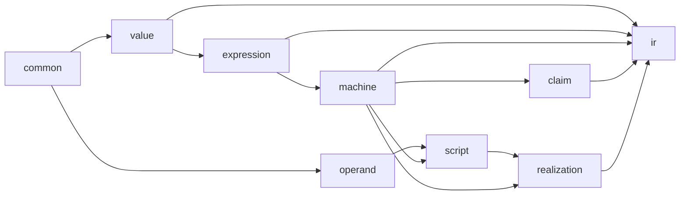

# Modularize the Umpire IR schema

> HTML render lens: .flow/artifacts/fn-145-modularize-the-umpire-ir-schema/spec.html — open locally; regenerable, markdown is the record. <!-- flow-next:artifact-link -->

## Goal & Context
<!-- scope: business -->

Model authors and Umpire tool maintainers need the 1,326-line IR schema to expose its existing ownership boundaries without changing what any Model means. Split the schema by responsibility first, then replace the local empty marker in a separate cleanup. Every lifted Model, generated Case, query answer, wire payload and artifact identity remains stable across the declaration-only split.

The work starts after the current DSL and source-layout changes close so one baseline can prove the schema move. It supersedes only fn-131's realization-file extraction slice. fn-131 retains its metadata, canonicalization, level-checking and producer-provenance work.

## Architecture & Data Models
<!-- scope: technical -->



The protobuf package and generated message packages stay unchanged. The root schema keeps `Model`; eight responsibility files own common markers, finite values, model expressions, machines, claims, realization operands, scripts and realizations. The generation gate treats the imported schema closure as one input set instead of assuming one file.

The standard empty marker migration follows the proven split. Containing oneof arms remain the semantic discriminator. The descriptor ledger records the retired top-level marker name so a later declaration cannot reuse it; protobuf field reservations apply only inside surviving messages.

## Edge Cases & Constraints
<!-- scope: technical -->

- Declaration moves change file descriptors and generated file-level symbols even when message full names and wire bytes stay stable.
- ScalaPB must generate every imported file. Generating only the root schema is incomplete.
- The checked schema ledger must cover the relocated declaration union, including messages absent from generated production Models but exercised by fixtures.
- Schema-closure hashing must invalidate cold builds when any imported file changes while retaining the existing warm-build behavior.
- Focused generation, descriptor and artifact checks remain in scope. Broad generated-API drift CI remains declined.

## Acceptance Criteria
<!-- scope: both -->

- **R1:** The Umpire IR schema is split into root, common, value, expression, machine, claim, operand, script and realization files with one acyclic import graph. Every package, message and enum full name, field number, oneof arm, comment and within-message field order is unchanged. Errors: import cycles, duplicate declarations, missing imported declarations and package changes fail schema generation.
- **R2:** ScalaPB generation, schema stamps, stale-output checks, Make prerequisites and API-linter exemptions consume the complete schema closure, including linked Go descriptor freshness and exclusion from the separate Scala API jar. Errors: changing any imported schema invalidates the generated API stamp; removing an expected generated output fails the stale check; an unchanged warm build reuses the closure stamp.
- **R3:** The descriptor regression ledger covers the complete relocated declaration set and retains its wire assertions. Lifted ProtoJSON, deterministic Model bytes, Query answers, generated Cases and artifact identities are identical across the split. Errors: any unclassified descriptor, JSON, byte, answer, Case or identity delta stops the migration.
- **R4:** The local empty marker is replaced with `google.protobuf.Empty` in a separate change while each containing oneof arm keeps its meaning. Serialized payload bytes and Umpire behavior remain equal, and generated callers and descriptor expectations use the standard type. Errors: an arm changes presence, oneof selection, bytes or admission behavior; a retired marker name or field number is reused.
- **R5:** The module map, Model documentation and milestone overview describe the resulting schema ownership and generation boundary. Errors: no error surface beyond documentation link and vocabulary checks.
- **R6:** A focused evaluation records whether `RequiredSetting` and overlapping disposition or cleanup enums create a demonstrated maintenance problem. The decision retains domain ownership and includes fn-144's planned setting relations, origins and scoped bindings. A proposed shared schema requires an explicit ownership decision before implementation. Errors: no error surface beyond the evidence and dependency review; no shared type is introduced by this evaluation.

## Early proof point

Task fn-145-modularize-the-umpire-ir-schema.1 validates that the gate and descriptor ledger can consume a multi-file schema closure before declarations move. If it fails, re-evaluate the extraction boundary and generation entry point before continuing with Task fn-145-modularize-the-umpire-ir-schema.2.

## Boundaries
<!-- scope: business -->

- Runtime CEL expressions and values belong to the CEL adoption spec.
- Elapsed-time fields belong to the Duration migration spec.
- No declaration is removed because the checked production corpus omits it.
- No Umpire-to-Testpilot schema import is added.
- fn-131 keeps metadata side tables, canonical projection, expression-level checks and producer provenance.
- Shared `RequiredSetting` or enum leaves stay separate until duplication shows a maintenance failure.
- No broad generated-API drift workflow or new CI job is added.

## Decision Context
<!-- scope: both -->

Maintainability (plan review): duplication - omitted linked-descriptor exclusions would generate IR classes into both Scala jars; Task 1 now covers the full exclusion closure; structure - none identified.

The existing sections already form an acyclic ownership graph, so declaration extraction exposes the current design without introducing a new language or dependency. A generic opcode tree, source-position table and domain-value merger would combine structural work with semantic migration and obscure the equivalence proof. Those changes stay outside this spec.

Source action items come from the Umpire IR schema consolidation research. Its runtime CEL and Duration recommendations are scheduled in the following specs. The shared-leaf recommendation is evaluated by R6 without presuming a new schema owner.

fn-131 proposed a realization-only package split. This spec preserves the existing package across all nine files, which keeps Umpire's public schema boundary stable and avoids creating a second generated package for one part of a `Model`.

## Quick commands

```bash
make protoc
make umpire-gen-model
make umpire-check-model MODEL_GATE_ARGS=--skip-go-checks
go test -tags test_dep -p 2 -timeout 30m ./tools/umpire/...
make umpire-check-cases
```

## Requirement coverage

| Req | Description | Task(s) | Gap justification |
| --- | --- | --- | --- |
| R1 | The Umpire IR schema is split into root, common, value, expression, machine, claim, operand, script and realization files with one acyclic import graph. Every package, message and enum full name, field number, oneof arm, comment and within-message field order is unchanged. Errors: import cycles, duplicate declarations, missing imported declarations and package changes fail schema generation. | fn-145-modularize-the-umpire-ir-schema.2 | — |
| R2 | ScalaPB generation, schema stamps, stale-output checks, Make prerequisites and API-linter exemptions consume the complete schema closure, including linked Go descriptor freshness and exclusion from the separate Scala API jar. Errors: changing any imported schema invalidates the generated API stamp; removing an expected generated output fails the stale check; an unchanged warm build reuses the closure stamp. | fn-145-modularize-the-umpire-ir-schema.1, fn-145-modularize-the-umpire-ir-schema.2 | — |
| R3 | The descriptor regression ledger covers the complete relocated declaration set and retains its wire assertions. Lifted ProtoJSON, deterministic Model bytes, Query answers, generated Cases and artifact identities are identical across the split. Errors: any unclassified descriptor, JSON, byte, answer, Case or identity delta stops the migration. | fn-145-modularize-the-umpire-ir-schema.1, fn-145-modularize-the-umpire-ir-schema.2, fn-145-modularize-the-umpire-ir-schema.4 | — |
| R4 | The local empty marker is replaced with `google.protobuf.Empty` in a separate change while each containing oneof arm keeps its meaning. Serialized payload bytes and Umpire behavior remain equal, and generated callers and descriptor expectations use the standard type. Errors: an arm changes presence, oneof selection, bytes or admission behavior; a retired marker name or field number is reused. | fn-145-modularize-the-umpire-ir-schema.3, fn-145-modularize-the-umpire-ir-schema.4 | — |
| R5 | The module map, Model documentation and milestone overview describe the resulting schema ownership and generation boundary. Errors: no error surface beyond documentation link and vocabulary checks. | fn-145-modularize-the-umpire-ir-schema.4 | — |
| R6 | A focused evaluation records whether `RequiredSetting` and overlapping disposition or cleanup enums create a demonstrated maintenance problem. The decision retains domain ownership and includes fn-144's planned setting relations, origins and scoped bindings. A proposed shared schema requires an explicit ownership decision before implementation. Errors: no error surface beyond the evidence and dependency review; no shared type is introduced by this evaluation. | fn-145-modularize-the-umpire-ir-schema.4 | — |
