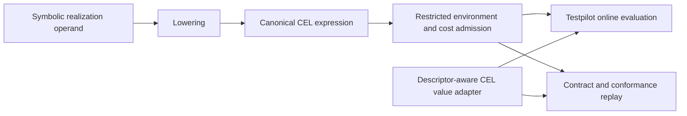

# Adopt CEL for runtime predicates and values

> HTML render lens: .flow/artifacts/fn-146-adopt-cel-for-runtime-predicates-and/spec.html — open locally; regenerable, markdown is the record. <!-- flow-next:artifact-link -->

## Goal & Context
<!-- scope: business -->

Case authors and runtime maintainers need one standard predicate representation and evaluator across Testpilot execution, verification and Umpire realization lowering. Adopt canonical CEL expressions, a pinned restricted environment and native evaluation while keeping finite Model expressions, model atoms, descriptor-exact admission and symbolic template authority distinct.

The accepted prototypes compiled all 358 expression roots in the checked Case corpus and established Scala and Go protobuf interoperability. Production work must now prove real descriptor paths, captures, correlated facts and online versus offline replay before checked-in artifacts migrate together.

## Architecture & Data Models
<!-- scope: technical -->



Testpilot owns the executable CEL schema, environment, value adapter and evaluator. Umpire keeps symbolic operands and lowers supported operands into that neutral contract without importing Testpilot into the Umpire IR. Canonical CEL protobuf bytes form the bridge to the CEL-Go AST version used by the pinned engine, and the conversion rejects unsupported nodes before engine loading.

Case format 2.0 records CEL expressions and standard CEL runtime values. Duration becomes format 3.0 and evidence/state consolidation becomes format 4.0 in the following specs. Each stage migrates its producers, consumers, Case files and recorded Run companions together. Only the current format is supported; old formats are rejected before decoding or Driver I/O. No legacy decoder, encoder or evaluator is retained. Intermediate schema and consumer tasks form one breaking integration batch; generation-only checks may gate a temporarily red consumer tree. Producer/admission version switches occur after CEL consumers integrate, and managed-artifact parity gates follow regeneration, not intermediate tasks.

## Edge Cases & Constraints
<!-- scope: technical -->

- Missing values, errors, short-circuiting, NaN, enum aliases and numeric comparisons receive explicit successor-format semantics. Domain checks remain only where a documented domain contract requires them.
- The value adapter uses the Case's authoritative descriptor catalog. Global protobuf lookup cannot decide opaque or catalog-only messages.
- `ModelValue` remains a finite model atom. `ValueType` remains descriptor-exact request and response admission.
- Capture namespaces, exact ordinals, path authority, correlated occurrence streams and resource ceilings stay explicit domain contracts.
- Admission distinguishes invalid authored fields from unknown wire fields on admitted protobuf payloads. The adapter preserves the latter without admitting descriptor-mismatched authored paths.
- CEL expression IDs follow deterministic traversal order. Source metadata is diagnostic, maps have a deterministic canonical order, and the current canonical encoder defines the identity boundary before regeneration.
- The site matrix covers nested presence, map misses, mixed wildcard absence, float32 widening, message and opaque-Any equality, enum aliases and existential matching across multiple correlated facts. Each site records how missing bindings, evaluator errors, cancellation and cost exhaustion affect admission, execution or verdicts.
- fn-144's planned operand and settings additions must fit the restricted environment when that deferred spec resumes.

## Acceptance Criteria
<!-- scope: both -->

- **R1:** Case format 2.0 carries canonical CEL expressions and standard CEL runtime values and is explicitly distinguishable from format 1.0. Case parsing, Run decoding, canonicalization and checked-in companions migrate together; old formats are unsupported. AST IDs, source metadata treatment and map ordering are deterministic and specified before identity changes. Errors: unknown format versions, mismatched Case and Run identities and attempted reinterpretation of legacy expressions are rejected before Driver I/O.
- **R2:** One pinned restricted CEL environment admits the supported AST nodes, variables, paths, functions and cost budget for instruction inputs, guards, Contract predicates, evidence guards and correlated conditions. Errors: unsupported nodes or fields, unauthorized references, unknown variables, type mismatches, duplicate capture identities and budget overflow report the source location and fail admission.
- **R3:** Format 2.0 replaces the custom runtime `Value`, enum, list and map containers with the standard CEL value schema through a descriptor-aware adapter. It preserves signed and unsigned extrema, bytes, typed maps, lists, enum type and number, registered messages, unknown wire fields and opaque `Any` payloads. `ModelValue` and `ValueType` remain separate. Errors: numeric narrowing overflow, unresolved required descriptors, unknown enum policy violations, authored assignments or paths outside the authoritative descriptor are rejected; unknown admitted payload wire fields are retained.
- **R4:** Testpilot execution, verification, rule expansion, environment-reference discovery and canonicalization use the admitted CEL contract and native evaluation. Online and offline evaluation agree on the same recorded event data. Errors: evaluator errors map to the documented admission or verdict result; capture ordinals, missing bindings and correlated lifetimes keep their existing rejection identities.
- **R5:** Umpire realization operands lower into the restricted CEL contract with symbolic name substitution, source diagnostics and path restrictions intact. Finite Model expressions and symbolic protobuf templates remain unchanged. Errors: unsupported operand forms, invalid empty guard conjunctions, unresolved learned values and paths outside the lowering subset fail at the Umpire source position.
- **R6:** Correlated facts, captures and Run Event guards evaluate through the same environment during live execution, replay and model conformance. Errors: source-specific ambiguity, causal-parent, ownership and occurrence-lifetime failures retain their current verdict or admission class.
- **R7:** Successor-format sites use CEL exclusively, and superseded custom predicate machinery and walkers retire after their callers move. No legacy evaluator or compatibility dispatch remains. The module map, semantics, protocol docs and milestone overview name CEL ownership and the pinned conversion boundary. Errors: ownership checks reject dispatch to retired evaluation or an Umpire-to-Testpilot IR dependency.

## Early proof point

Task fn-146-adopt-cel-for-runtime-predicates-and.4 proves bounded native evaluation with real descriptor paths, a captured value and matching online/offline event data before verification rollout. If it fails, re-evaluate the domain bindings and engine bridge before Task fn-146-adopt-cel-for-runtime-predicates-and.5 or later. Task fn-146-adopt-cel-for-runtime-predicates-and.1 first pins the breaking format and identity boundary.

## Boundaries
<!-- scope: business -->

- Finite Model `Expr`, pattern matching, lambdas, channels, holes and named choices remain Umpire constructs.
- No generic CEL value replaces `ModelValue` or descriptor-exact `ValueType`.
- Symbolic protobuf templates, capture ownership and path authority stay at their domain boundaries.
- No Umpire IR import of Testpilot schemas is added.
- Duration, evidence-table and correlated-state normalization land in later specs.
- CEL dependency upgrades beyond the pinned production version are outside scope.

## Decision Context
<!-- scope: both -->

The accepted prototypes establish representation reuse and native engine feasibility. Production adoption now separates standard CEL behavior from domain bindings instead of wrapping the old expression language inside CEL leaves. This removes duplicated evaluation implementations while retaining the checks that belong to descriptors, scopes and evidence ownership.

Source action items come from both schema research notes and the accepted CEL runtime investigation. The implementation records the site-specific error and semantic matrix before rollout; adoption itself is settled.

The Umpire schema split lands first so its operand ownership is stable. Testpilot defines the neutral executable environment, then Umpire lowering consumes it. This one-way ownership avoids a circular schema dependency.

## Quick commands

```bash
go test -tags test_dep ./common/testing/testpilot/internal/ir/... ./common/testing/testpilot/internal/execution/... ./common/testing/testpilot/internal/verification/...
go test -tags test_dep ./tools/umpire/realization/... ./tools/umpire/lower/... ./tools/umpire/conformance/...
make umpire-check-cases
```

## Migration policy

The owner authorized breaking IR changes on 2026-10-06. Preserve supported behavior and domain authority, not historical wire compatibility. Regenerate managed artifacts and recorded companions under the current schema; remove superseded fields and runtime machinery. Format checks reject retired artifacts explicitly.

## Requirement coverage

| Req | Description | Task(s) | Gap justification |
| --- | --- | --- | --- |
| R1 | Case format 2.0 carries canonical CEL expressions and standard CEL runtime values and is explicitly distinguishable from format 1.0. Case parsing, Run decoding, canonicalization and checked-in companions migrate together; old formats are unsupported. AST IDs, source metadata treatment and map ordering are deterministic and specified before identity changes. Errors: unknown format versions, mismatched Case and Run identities and attempted reinterpretation of legacy expressions are rejected before Driver I/O. | fn-146-adopt-cel-for-runtime-predicates-and.1, fn-146-adopt-cel-for-runtime-predicates-and.7 | — |
| R2 | One pinned restricted CEL environment admits the supported AST nodes, variables, paths, functions and cost budget for instruction inputs, guards, Contract predicates, evidence guards and correlated conditions. Errors: unsupported nodes or fields, unauthorized references, unknown variables, type mismatches, duplicate capture identities and budget overflow report the source location and fail admission. | fn-146-adopt-cel-for-runtime-predicates-and.2, fn-146-adopt-cel-for-runtime-predicates-and.4 | — |
| R3 | Format 2.0 replaces the custom runtime `Value`, enum, list and map containers with the standard CEL value schema through a descriptor-aware adapter. It preserves signed and unsigned extrema, bytes, typed maps, lists, enum type and number, registered messages, unknown wire fields and opaque `Any` payloads. `ModelValue` and `ValueType` remain separate. Errors: numeric narrowing overflow, unresolved required descriptors, unknown enum policy violations, authored assignments or paths outside the authoritative descriptor are rejected; unknown admitted payload wire fields are retained. | fn-146-adopt-cel-for-runtime-predicates-and.3 | — |
| R4 | Testpilot execution, verification, rule expansion, environment-reference discovery and canonicalization use the admitted CEL contract and native evaluation. Online and offline evaluation agree on the same recorded event data. Errors: evaluator errors map to the documented admission or verdict result; capture ordinals, missing bindings and correlated lifetimes keep their existing rejection identities. | fn-146-adopt-cel-for-runtime-predicates-and.4, fn-146-adopt-cel-for-runtime-predicates-and.5, fn-146-adopt-cel-for-runtime-predicates-and.7 | — |
| R5 | Umpire realization operands lower into the restricted CEL contract with symbolic name substitution, source diagnostics and path restrictions intact. Finite Model expressions and symbolic protobuf templates remain unchanged. Errors: unsupported operand forms, invalid empty guard conjunctions, unresolved learned values and paths outside the lowering subset fail at the Umpire source position. | fn-146-adopt-cel-for-runtime-predicates-and.6, fn-146-adopt-cel-for-runtime-predicates-and.7 | — |
| R6 | Correlated facts, captures and Run Event guards evaluate through the same environment during live execution, replay and model conformance. Errors: source-specific ambiguity, causal-parent, ownership and occurrence-lifetime failures retain their current verdict or admission class. | fn-146-adopt-cel-for-runtime-predicates-and.5, fn-146-adopt-cel-for-runtime-predicates-and.6, fn-146-adopt-cel-for-runtime-predicates-and.7 | — |
| R7 | Successor-format sites use CEL exclusively, and superseded custom predicate machinery and walkers retire after their callers move. No legacy evaluator or compatibility dispatch remains. The module map, semantics, protocol docs and milestone overview name CEL ownership and the pinned conversion boundary. Errors: ownership checks reject dispatch to retired evaluation or an Umpire-to-Testpilot IR dependency. | fn-146-adopt-cel-for-runtime-predicates-and.7 | — |
