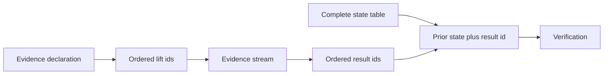

# Consolidate Testpilot evidence and correlated state schemas

> HTML render lens: .flow/artifacts/fn-148-consolidate-testpilot-evidence-and/spec.html — open locally; regenerable, markdown is the record. <!-- flow-next:artifact-link -->

## Goal & Context
<!-- scope: business -->

Case producers and Testpilot runtime maintainers need one evidence-lifting representation and one normalized representation of complete correlated states and transition results. Remove duplicated extraction shapes and repeated result payloads while preserving supported hand-authored Cases, ordered evidence behavior, causal authorization, bounded admission and current-format replay.

## Architecture & Data Models
<!-- scope: technical -->



An evidence declaration owns source identity, projected schema, operation key, scope and field expressions, guard and constants. A response lift owns an ordered list of declaration IDs and an Observation destination. Contract evidence policies remain separate because they control retention and external evidence admission.

Each local complete state stores a model atom plus ordered fields. Each result stores action, destination state, outcome and facts. Transitions reference prior state and result IDs, while projection rules retain ordered result IDs. Local deterministic IDs and expanded-work charging prevent compression from bypassing limits.

Case format 4.0 owns evidence and state/result normalization plus the derived-field cleanup. Replace the old shapes directly, regenerate Cases and recorded Run companions, and reject retired formats. No historical decoding or compatibility binder is retained. Scalar singleton-oneof cleanup is already owned by the Duration spec. The normalization producer/consumer tasks form one breaking integration batch, with public emission switching only once admission understands the tables. Exactly format 4.0 emission and admission activate together after all shape cleanups and before final regeneration; intermediate checks do not require managed artifacts to be current.

## Edge Cases & Constraints
<!-- scope: technical -->

- Ordered response lifts keep first-match selection. Overlapping Run Event declarations still fail the Run.
- Dense source ordinals, controller ownership, causal parents and read or poll behavior remain unchanged.
- Equal state atoms with different fields are distinct complete states.
- A result may be legal from several prior states. Projection output never chooses a prior state.
- Contract retention, redaction and rejection policies remain valid for external evidence even when no Program declaration exists.
- Artifact-size and admission-cost measurements justify local tables. No global `ModelValue` intern table is added without evidence.

## Acceptance Criteria
<!-- scope: both -->

- **R1:** All response and Run Event lifts refer to generalized evidence declarations that can express dynamic scopes, admitted guards, constant fields, operation keys and projected sources. Inline lift fields are removed in the same coordinated conversion. Errors: retired inline forms, unknown declaration IDs, invalid projected paths and declaration shape mismatches are rejected before execution.
- **R2:** Source-specific selection remains exact. Response lifts apply declaration IDs in order and choose the first match; overlapping Run Event declarations fail; unclaimed records and absent paths retain their current behavior. Errors: ambiguity, wrong source kind, sparse ordinals, foreign controller ownership and invalid causal parents keep distinct diagnostics.
- **R3:** Contract evidence policies remain independent from Program extraction declarations and still admit supported externally supplied evidence. Errors: retained fields outside policy, disallowed sources or scopes and a derived catalog that would erase a generic Contract path are rejected.
- **R4:** A local complete-state table interns each `(ModelValue atom, ordered fields)` pair once, and a local result table stores action, destination state, outcome and facts once. Transitions reference prior state and result IDs; projections retain ordered result IDs. Equal atoms with unequal fields receive distinct state IDs and remain supported. Errors: duplicate or dangling IDs, conflicting definitions for one ID, result order changes and a result referenced from an unauthorized prior state are rejected.
- **R5:** Lowering, admission and verification preserve continuity, full transition authorization, causal submission checks, verdicts and exact capture ordinals with the normalized tables. Errors: expanded work is charged before enumeration with overflow-safe ceilings; compressed input cannot evade state, result, transition or projection limits.
- **R6:** Derived and redundant fields are removed in the successor format. Deadline presence determines Contract rule kind, operation transitions are the correlated clock, support uses explicit presence, response paths determine cardinality and local instruction references omit redundant entrypoint IDs. Surviving marker arms use `google.protobuf.Empty`. Errors: retired field spellings are supplied, absent versus present-empty dependency semantics change, or a derived value disagrees with its source.
- **R7:** Evidence declarations move to a leaf evidence schema while correlated verification stays in the correlated schema. Program and instruction, Contract and Run, source locations, provenance and model atoms retain their ownership. Errors: schema imports form a cycle or Testpilot imports Umpire.
- **R8:** The migration measures compact artifact size and admission cost before and after, preserves the checked generated and hand-authored fixture surface, and regenerates checked-in Case and Run companions for current-format replay. Errors: any uncategorized identity, replay, verdict, causal-buffering, default, ceiling or online versus offline agreement delta stops rollout.
- **R9:** The semantics, module map, protocol documentation and milestone overview describe evidence ownership, complete-state identity, result ordering and successor-format conversion. Errors: no error surface beyond documentation and ownership gates.

## Early proof point

Task fn-148-consolidate-testpilot-evidence-and.1 validates that one declaration can reproduce every existing inline and referenced lift, including ordered overlap and absent-path fixtures. This is a before/after fixture proof, not a compatibility binder. If it fails, re-evaluate the generalized declaration before producer and consumer rollout in Task fn-148-consolidate-testpilot-evidence-and.2.

## Boundaries
<!-- scope: business -->

- Contract evidence retention, redaction and rejection policies are not derived from Program declarations.
- Ordinary single-assignment captures and correlated occurrence streams do not merge.
- Rule instances remain the supported condensation mechanism.
- No global model-value intern table is added.
- Provenance, source locations, `ValueType`, instruction outcomes and event identity remain domain-specific.
- No generic `Struct`, `FieldMask`, `Type` or `Status` substitution is added.

## Decision Context
<!-- scope: both -->

The existing inline and declaration-backed lift forms bind the same concepts through separate paths, but the declaration form lacks several supported inline capabilities. Generalizing the declaration first preserves those capabilities and lets one binder own extraction.

State and result tables follow identities the runtime already checks. A full transition row cannot stand in for a result because one result may be authorized from several prior states. Interning the complete atom-plus-fields state retains predicate behavior and continuity without introducing a repository-wide value table.

## Quick commands

```bash
go test -tags test_dep ./common/testing/testpilot/internal/execution/... ./common/testing/testpilot/internal/verification/...
go test -tags test_dep ./tools/umpire/lower/... ./tools/umpire/conformance/...
make umpire-check-cases
```

## Migration policy

The owner authorized breaking IR changes on 2026-10-06. Preserve supported behavior and domain authority, not historical wire compatibility. Regenerate managed artifacts and recorded companions under the current schema; remove superseded fields and runtime machinery. Format checks reject retired artifacts explicitly.

## Requirement coverage

| Req | Description | Task(s) | Gap justification |
| --- | --- | --- | --- |
| R1 | All response and Run Event lifts refer to generalized evidence declarations that can express dynamic scopes, admitted guards, constant fields, operation keys and projected sources. Inline lift fields are removed in the same coordinated conversion. Errors: retired inline forms, unknown declaration IDs, invalid projected paths and declaration shape mismatches are rejected before execution. | fn-148-consolidate-testpilot-evidence-and.1, fn-148-consolidate-testpilot-evidence-and.2 | — |
| R2 | Source-specific selection remains exact. Response lifts apply declaration IDs in order and choose the first match; overlapping Run Event declarations fail; unclaimed records and absent paths retain their current behavior. Errors: ambiguity, wrong source kind, sparse ordinals, foreign controller ownership and invalid causal parents keep distinct diagnostics. | fn-148-consolidate-testpilot-evidence-and.1, fn-148-consolidate-testpilot-evidence-and.2 | — |
| R3 | Contract evidence policies remain independent from Program extraction declarations and still admit supported externally supplied evidence. Errors: retained fields outside policy, disallowed sources or scopes and a derived catalog that would erase a generic Contract path are rejected. | fn-148-consolidate-testpilot-evidence-and.2 | — |
| R4 | A local complete-state table interns each `(ModelValue atom, ordered fields)` pair once, and a local result table stores action, destination state, outcome and facts once. Transitions reference prior state and result IDs; projections retain ordered result IDs. Equal atoms with unequal fields receive distinct state IDs and remain supported. Errors: duplicate or dangling IDs, conflicting definitions for one ID, result order changes and a result referenced from an unauthorized prior state are rejected. | fn-148-consolidate-testpilot-evidence-and.3, fn-148-consolidate-testpilot-evidence-and.4 | — |
| R5 | Lowering, admission and verification preserve continuity, full transition authorization, causal submission checks, verdicts and exact capture ordinals with the normalized tables. Errors: expanded work is charged before enumeration with overflow-safe ceilings; compressed input cannot evade state, result, transition or projection limits. | fn-148-consolidate-testpilot-evidence-and.4 | — |
| R6 | Derived and redundant fields are removed in the successor format. Deadline presence determines Contract rule kind, operation transitions are the correlated clock, support uses explicit presence, response paths determine cardinality and local instruction references omit redundant entrypoint IDs. Surviving marker arms use `google.protobuf.Empty`. Errors: retired field spellings are supplied, absent versus present-empty dependency semantics change, or a derived value disagrees with its source. | fn-148-consolidate-testpilot-evidence-and.5, fn-148-consolidate-testpilot-evidence-and.6 | — |
| R7 | Evidence declarations move to a leaf evidence schema while correlated verification stays in the correlated schema. Program and instruction, Contract and Run, source locations, provenance and model atoms retain their ownership. Errors: schema imports form a cycle or Testpilot imports Umpire. | fn-148-consolidate-testpilot-evidence-and.1, fn-148-consolidate-testpilot-evidence-and.5, fn-148-consolidate-testpilot-evidence-and.6 | — |
| R8 | The migration measures compact artifact size and admission cost before and after, preserves the checked generated and hand-authored fixture surface, and regenerates checked-in Case and Run companions for current-format replay. Errors: any uncategorized identity, replay, verdict, causal-buffering, default, ceiling or online versus offline agreement delta stops rollout. | fn-148-consolidate-testpilot-evidence-and.3, fn-148-consolidate-testpilot-evidence-and.4, fn-148-consolidate-testpilot-evidence-and.7 | — |
| R9 | The semantics, module map, protocol documentation and milestone overview describe evidence ownership, complete-state identity, result ordering and successor-format conversion. Errors: no error surface beyond documentation and ownership gates. | fn-148-consolidate-testpilot-evidence-and.7 | — |
