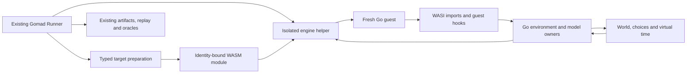

# WASM Gomad execution backend

Implement the complete approved execution-backend plan at `.turbo/plans/wasm-gomad-execution-backend.md`. The user explicitly requested full implementation on2026-10-09. Preserve existing production defaults/native overlays and qualification ownership, comments and local research; no worktrees or force pushes. Dependency/build PRs12495-12497 remain distinct from Gomad integration. User retains commits unless specifically requested; this scope has no new publication authority.

The user requires hermetically sealed guest execution. Every guest file, network, clock and entropy operation uses captured immutable inputs or in-memory models. Deny live host resources and native I/O fallbacks. Build preparation, module loading and retained evidence publication remain outside guest semantics.

Current owner direction (2026-10-10): develop tools/gomad_wasm and tools/gomad3 together in this temporal repository. Task fn-151.13 owns relocation and recoverable retirement of temporal_wasm. Task fn-151.12 is cancelled; no standalone extraction or deletion of gomad3 is planned. Tasks 1–4 retain historical acceptance, task 5 remains in progress with incomplete qualification, and tasks 6–11 remain queued. The owner requested a stop after in-flight work: this migration does not authorize further feature work, task5 qualification, commits or publication. Historical receipts bind their original source candidate, not this integrated checkout. Native qualification remains deferred under fn-128/fn-149. [MILESTONES.md](../../MILESTONES.md) is the operative guide.

## Acceptance Criteria

- **R1:** Typed backend/engine identity and bounded isolated Wasmtime execution prove the corrected main-based artifact can instantiate without hidden host imports.
- **R2:** Deterministic captured WASI namespace, entropy, clock/poll and capacity behavior have positive/negative seam tests and retained fresh-instance repeatability.
- **R3:** SQLite and unchanged testcore/functional smoke execute in one guest with truthful capability dispositions and existing provider semantics.
- **R4:** Preparation, campaigns, canonical artifacts, input/engine preflight, replay and lifecycle integration preserve native formats/defaults and negative validation.
- **R5:** WASM runtime choices, stable identities, independent entropy and diagnostics support alternate outcomes and exact forced replay; any optional checkpoint profile has a separate safety/site/identity gate.
- **R6:** Strict idle/timer/readiness handshakes and bounded exploration/resume preserve logical order and report CPU-loop/capacity outcomes honestly.
- **R7:** File-backed SQLite faults and crash recovery use modeled durable volumes, stable fault matching, replay and independent oracles.
- **R8:** Guest network interception supports declared stream/partition/delay/reset semantics, negative/reference-model checks and replayed Temporal recovery.
- **R9:** Independent guest incarnations use a broker/global clock/separate durable volumes with stale-handle rejection and a two-cluster Temporal recovery gate; no cross-instance WAL sharing.
- **R10:** Retained WASM support/qualification and measured cost comparisons distinguish stock/controlled/cooperative/checkpoint profiles and do not borrow deferred native evidence.
- **R11:** Proven cost reductions, immutable code caching and supported installation/discovery/replay documentation preserve baseline semantics and production builds.
- **R13:** Develop Gomad WASM and Gomad v3 together in temporal: migrate tools/gomad_wasm, its required integration changes and fn-151 tracking/evidence into temporal, preserve existing destination work, and retire temporal_wasm without losing unique work.

## Repository migration (owner decision, 2026-10-10)

The active checkout is temporal. tools/gomad_wasm remains a nested module beside tools/gomad3, with reviewed public shared owners rather than copied standalone code. fn-151.12 is administratively cancelled and satisfies no active R-ID. fn-151.13 records the migration. Historical source, unrelated dirty records and bulk retained evidence are archived recoverably in sibling temporal_wasm.retired-20261010; see its RETIRED.md. Original task1–4 receipts reference that archive’s .tmp paths. Task5 partial handover and failed logs are also copied into this checkout’s .flow/tmp/fn151-5-current. Original absolute paths and frozen identities remain historical, not destination qualification.

## Approved Plan (2026-10-09 baseline)

---
status: draft
date: 2026-10-09
---

# Plan: WASM as a Gomad execution backend

## Context

Give Temporal developers a second Gomad backend that runs ordinary Go tests inside WASM, explores scheduling and modeled failures, and retains an artifact that reproduces a discovered failure exactly. Reuse Gomad's campaign, choice, evidence and oracle machinery. Preserve native execution for race detection, weak-memory coverage and supported native workloads.

The current result proves compilation, not guest execution. The inspected artifact has 33 distinct WASI Preview1 imports, 96.125 MiB initial linear memory, and a 227.04 MiB file. Stock Go WASI has one execution thread and fake TCP connections within one guest. Those properties reduce the execution surface but do not supply goroutine control, strict virtual time, network fault injection or replay qualification.

The original compilation stack was incorrectly based on the Gomad fork. Its measurements remain historical evidence for that source identity. The corrected dependency/build stack starts at `temporalio/temporal` main. Establish fresh artifact provenance from that stack before executing this plan. Gomad integration belongs in the Gomad checkout and its own future delivery scope; upstream dependency/build PRs should contain no Gomad internals or Flow records.

The corrected stack now has a verified main-based module at source `eea8b6f538` (upstream main `c253c64775`): 238,058,702 bytes, SHA-256 `551734fd82cb854ad03651f8bbb6bdb66f75acb6786ab106bb3b207f48a45743`. Inspection records 37 function-import entries and 33 distinct names, with 1,539 initial memory pages (96.1875 MiB). Retained inspection is `.tmp/upstream-pr-stack/.tmp/wasi-artifact-inspection.json`; native/build verification is `upstream-stack-verification.json` in the same directory. Guest execution remains unverified.

## Decisions and scope

| Decision | Planned choice and reason |
| --- | --- |
| Product | One Gomad product with native and WASM execution adapters, shared evidence/oracles and explicit capability profiles. |
| Implementation placement | The user requested a separate `tools/gomad_wasm` module. Keep WASM environment, execution, fixtures, runtime inputs and delivery commands there; reuse Gomad's existing semantic owners through reviewed public interfaces. |
| First workload | One fresh guest containing testcore, server, SDK clients and workers. Fake TCP is local to that guest. |
| First engine | Evaluate a pinned Wasmtime embedding in an isolated host helper. Its fuel and resource controls fit bounded execution. Confirm the actual large Go module works before accepting the dependency. |
| Engine isolation | The Go Runner starts a helper process for each execution. The helper owns the engine, guest memory, host imports and cleanup. No engine or Rust types enter the public Runner interface. |
| Hermetic guest I/O | The user requires sealed execution. Guest files, network links, clocks and entropy use captured immutable inputs and in-memory models. Runtime imports cannot access live host resources or fall back to native I/O. Preparation and evidence publication remain outside guest semantics. |
| Runtime profiles | Keep a stock-WASI experimental profile and a separate hooked-WASI profile. Record their capabilities separately; qualify strict time and choice exploration only for the latter. |
| Go identity | Reproduce the stock Go 1.27.0 compilation baseline first. Evaluate a Go 1.27.1 WASM profile aligned with Gomad's pinned toolchain before porting hooks. Different Go versions have distinct identities and evidence. |
| Application source | Preserve unchanged functional-test bodies and production defaults. Use existing injection seams and narrowly scoped build selections. Never overlay a test to manufacture support. |
| Multi-instance Temporal | Start with one complete Temporal cluster per guest and an independent SQLite volume per cluster, communicating through existing cross-cluster interfaces. Sharing one SQLite WAL database between instances is excluded. |
| Adoption | Ship incrementally after retained gates. Backend replacement requires a later evidence-based decision. |

Wasmtime is a proposed implementation dependency, not an installed repository library. Its [determinism guidance](https://docs.wasmtime.dev/examples-deterministic-wasm-execution.html) calls for deterministic imports, controlled floating-point behavior and memory growth. Its [interruption guidance](https://docs.wasmtime.dev/examples-interrupting-wasm.html) distinguishes fuel from epoch interruption. The engine evaluation must pin the release, configuration, helper build and host platform. Use Wazero as a bounded comparison candidate if Wasmtime packaging or compatibility fails, rather than implementing two engines in the first delivery.

Native qualification stays with fn-128 and fn-149. This plan does not revive those owners, authorize native qualification, or move their retained acceptance. Follow the source delivery order in `MILESTONES.md` before changing shared Gomad owners. Introduce future WASM scope and its own acceptance before implementation; this document describes dependencies and gates rather than creating a second task tracker.

## Pattern Survey

### Analogous Features

- `tools/gomad3/runner/runner.go:117` — Public `Preparer` and `ArtifactReplayer` seams surround an internal `executionRunner`; `Explore` prepares once and supplies typed `execution.Spec` requests for fresh executions. The executor seam is not a public backend API.
- `tools/gomad3/internal/preparation/preparation.go:52` — `Prepare` owns adapter selection, target preparation, prepared-target validation, and cleanup, with typed stage errors. Supplying a custom preparer still passes through validation.
- `tools/gomad3/runner/replay_operation.go:74` — `Replay` validates the retained artifact, reconstructs I/O/World/choice/simulation capabilities, executes the retained target, and compares observed evidence. `preflight` at line 429 checks compatibility before execution.
- `tools/gomad3sim/cluster.go:80` — `Run` supports in-process and process node lifecycles; `Start`, `Crash`, and `Restart` use stable node/incarnation handles. `tools/gomad3sim/spec.go:192` currently admits only `BackendInProcess` and `BackendProcess`.
- `tests/gomadfunctional/frontend_test.go:11` — `TestFrontendSystemInfo` is the smallest existing Temporal one-box probe, using `testcore.NewEnv` with `WithInMemorySQLitePersistence`.
- `tools/gomad3integration/qualification/smoke.json:1` — The existing smoke manifest selects unchanged `./tests` activity, child workflow, update, and user-timer suites; it retains bounded choices and successful artifacts for replay. Its existing native tags, probes, and platform expectations are profile-specific.

### Reusable Utilities

- `tools/gomad3/world/world.go:72` — `New`, `Register`, `Ready`, `Cancel`, and `Quiesce` provide a pure, explicitly driven event model. `tools/gomad3/world/queue.go:38` owns ordering; `tools/gomad3/world/replay.go:53` owns replay codecs and transition checks. World does not own application heaps or invoke application callbacks.
- `tools/gomad3/choice/tape.go:19` — `ExecutionIdentity`, `CanonicalDecision`, `ProjectReplayPlan`, `ValidateReplayPlan`, and `BuildForcedRankPrefix` bind decisions to target/toolchain/platform/implementation identities and support bounded alternate-choice exploration.
- `tools/gomad3/choice/diagnostic.go:120` — `DecodeDiagnosticTrace` and `DiffDiagnostics` provide transport-independent diagnostic validation/comparison. `NewDiagnosticSession` and `choice.NewSession` use native files/pipes and are distinct transport owners.
- `tools/gomad3/toolchain/runtime/overlay/src/runtime/gomad.go:833` — `gomadChoiceDecision` owns runtime decision validation; `gomadChoiceAssignGoroutineIdentity` at line 1104 and `gomadChoiceTimerCreated` at line 1145 own stable logical identities. `gomadChoiceRunqIndex`, `gomadChoiceSelectPollIndex`, `gomadTimerRand`, and `gomadDiagnosticAppend` are the current runnable/select/timer/random/diagnostic anchors.
- `tools/gomad3/runner/internal/execution/simulation_time.go:105` — `newSimulationTimeArbiter`, `quiesce`, and `settleLocked` coordinate participant readiness and virtual time. `simulation_progress.go` tracks delivery/response progress separately from transport arrival.
- `tools/gomad3sim/scenario.go:42` — `NewScenarioStep`, `Sequence`, `Repeat`, `Choose`, and `BoundedParallel` provide typed bounded scenario composition. `tools/gomad3sim/fault.go:70` — `NewFaultPlan` records stable match/action identities.
- `tools/gomad3/toolchain/runtime/overlay/src/internal/gomadio/simulation_network.go:187` — `BeginSimulation`, `PartitionSimulation`, `HealSimulation`, and `DelaySimulation` own modeled TCP topology and transitions. `internal/gomadfs/simulation_volume.go:130` owns volume lifecycle/replay; `internal/gomadfs/volume.go:292` — `EnumerateCrashStates` owns bounded dependency-valid persistence alternatives.
- `tools/gomad3sim/oracle.go:44` — `StateInvariant`, `ExactHistory`, `NoDuplicateOrLost`, and `EventualConvergence` evaluate detached, bounded evidence independently of node execution.
- `tools/gomad3/runner/internal/exploration/simulation/frontier.go:194` — `New` and `NextRound` retain bounded exploration state with distinct dimensions; `internal/minimizer/minimizer.go:67` — `New`, `Next`, and `Commit` retain reduction lineage.
- `tools/gomad3/artifact/publication.go:33` — `PublishArtifact` publishes canonical hashed target/output/World/I/O/choice/simulation/input payloads. `artifact/open.go:33` — `OpenArtifact` validates the retained layout and payloads. `qualification/qualification.go:95` — `BuildQualificationReport` distinguishes repeatability, successful outcomes, replay evidence, and diagnostic agreement.

### Convention Anchors

- **Neutral core and Temporal integration:** `tools/gomad3/go.mod:1` is a nested application-neutral module pinned to Go 1.27.1. `tools/gomad3sim`, `tools/gomad3integration`, and `tests/gomadfunctional` belong to root `go.mod`, pinned to Go 1.27.0. Root package work is not covered by the nested module’s ordinary package traversal.
- **Runtime linkage rather than ordinary model imports:** `tools/gomad3sim/runtime_process_model.go:17` links intercepted stubs to overlay-owned `internal/gomadio` and `internal/gomadfs`. The network/volume implementation is not currently an ordinary importable host library; unchanged root harness source still depends on these runtime bridges.
- **Generated protocol ownership:** `tools/gomad3/internal/gomadtool/generation/protocol/protocol.go:384` — `GenerateProtocols` derives host/runtime codecs from `deterministicio/schema/iowire.json`, `choice/schema/choicewire.json`, `simulation/schema/modelwire.json`, and `simulation/schema/timewire.json`. It also binds implementation digests and verifies stale generated outputs. `tools/gomad3/Makefile:27` and `:160` own generation and check-only validation.
- **Native transport boundary:** `runner/internal/execution/process_unix.go:89` runs supervisor/bootstrap processes; `bootstrap_unix.go:19` installs inherited descriptors and launches targets. `runtime/gomad.go:262`, `:303`, and `:369` use `mmap` for choice/tape/diagnostic transport. `execution.Spec` validation requires supervisor/bootstrap commands. These are concrete native assumptions.
- **Static one-box wiring:** `tests/testcore/onebox.go:286` supplies `temporal.WithStaticHosts`; `temporal/fx.go:415` selects static membership. `tests/testcore/test_cluster.go:518` obtains loopback ports through `freeport`, so address allocation remains part of the execution profile.
- **Build and qualification separation:** `tools/gomad3/Makefile:125`, `:138`, `:146`, and `:195` separate host, overlay, root simulation, and full toolchain gates. `toolchain/buildkey.go:48` binds source/toolchain/build identity; qualification manifests and reports retain their own schemas.
- **Deferred native evidence:** `MILESTONES.md:40` preserves the source delivery order and fn-128/fn-149 native deferrals. `docs/research/gomad/2026-10-09-wasm-gomad-backend.md:3` records source/artifact inspection only; it supplies no WASM execution or qualification result. Integration README history does not override current manifests or those deferrals.

### Proposed Alignment

Follow the existing neutral Runner, preparation, artifact, World, choice, scenario, and oracle owners, while treating WASM execution transport and profile identity as distinct concerns. Blend semantic reuse with explicit boundary adaptation: current Unix launch validation, `mmap` transport, overlay model linkage, native probes, and source inventories leave substantial backend-specific work. Preserve the existing native qualification owners and compare backends through detached outcomes and model evidence under their recorded profiles.

## Architecture

The Runner owns campaign intent, immutable inputs, publication and replay. A private execution seam selects the existing native executor or a WASM helper executor. Preparation produces a typed prepared target; a WASM module must not masquerade as a native executable merely to pass Unix validation.

The execution path contains four deep modules. The engine module compiles, instantiates, runs and disposes a guest with explicit limits. The Go environment module implements captured namespace/descriptor/entropy behavior; the helper validates WASI layouts and exchanges bounded typed requests with that owner. The event module owns virtual time and readiness ordering through World's existing semantics. The simulation module owns node incarnations, broker links, volumes and fault matching. Expose a small execution request/result to the Runner; keep WASI pointer layouts and engine handles inside the helper.

Implementation placement is `tools/gomad_wasm/`, a separate Go module named `go.temporal.io/server/tools/gomad_wasm`, pinned to Go 1.27.1. Its `wasi/` package owns the Go environment and helper transport, `wasmhost/` owns the Rust engine helper, `testdata/` owns guest fixtures, and `toolchain/runtime/wasm/` will own WASM-specific runtime inputs. Public Gomad contracts are reused through an explicit local module dependency. Narrow public hostexec and hostfs interfaces delegate to the existing supervised-process and bounded-file owners; their algorithms remain single-owned. Future Runner integration must use a reviewed public boundary rather than importing another module's private executor. Admit shared interface changes through `TestPackageArchitecture` and preserve native records, defaults and runtime inputs. Shared deterministic algorithms should remain with their current Go owners or become explicitly owned generated/pure modules; do not duplicate them casually in Rust. The engine helper can exchange bounded events with a Go model owner outside the blocked guest.

Use the existing protocol schemas when semantics match. Introduce a schema revision only when a new backend field or operation needs it. Generate Go, guest and helper codecs from one owner, and preserve legacy/native canonical bytes and interpretation. Include backend kind, guest/compiler/runtime identities, helper/engine configuration, host platform, captured inputs, collector profile, limits, model versions and stream versions in WASM provenance. Replay checks those inputs before instantiation. Portable `.wasm` does not imply portable exact replay across engines or hosts.

### Scheduler and compiler strategy

The scheduler is Go runtime code inside the module. Inspected stock Go WASM has no sysmon or asynchronous preemption; local dispatch is normally FIFO. Ready selects, map/runtime randomness, timers, readiness and collector behavior still require controlled inputs and qualification. Identical emitted module bytes alone do not establish the dynamic replay contract.

The [scheduler/emission research](../../docs/research/gomad/2026-10-09-wasm-scheduler-and-emission.md) includes a compile-only Go 1.27.1 probe. `GOEXPERIMENT=preemptibleloops` emits backedge calls to `runtime.goschedguarded`; the normal compilation of that fixture does not. This verifies an existing emission seam, not effective preemption or guest correctness. A single-threaded WASM runtime still needs a safe deterministic request-arming and consumption policy.

| Profile or technique | Planned disposition |
| --- | --- |
| Controlled-host stock Go | Qualify fixed-input repeatability first; supply no forced-goroutine-choice claim. |
| Cooperative runtime hooks | Initial scheduling capability, with seeded/forced choices at existing yield/block points and explicit CPU-loop exclusions. This matches the native contract's declared cooperative scope. |
| Existing experimental loop checks | First optional emission experiment. Admit only after safe request arming, stack-growth interactions and actual loop switching are demonstrated. |
| Opt-in SSA checkpoint pass | Fallback when existing checks cannot meet a named long-computation coverage requirement. Emit ordinary resumable runtime calls at reviewed sites, with bounded work counters and deferred requests. |
| Function-entry debug hooks | `maymorestack` uses a non-resumable call on WASM and must not itself preempt. Consider counting/request generation only; never call `Gosched` directly there. |
| Post-link WASM rewriting | Defer Go-specific continuation rewriting. Raw instrumentation lacks Go stack-root/resume metadata and needs a separately qualified ABI transformation. |
| Engine fuel | Bound execution and optionally order separate instances. It resumes the current Go continuation and supplies no internal goroutine switch by itself. |

Checkpoint insertion must preserve stack roots, liveness, synthetic PCs and unwind/resume metadata. Exclude system stacks, runtime startup, locked/allocation regions, foreign transitions and unsafe barrier sequences; runtime exclusion alone does not cover compiler-generated barriers in user code. Bind compiler flags, site manifest, policy/budget and transformed module identity into evidence. A changed checkpoint profile rejects older tapes before execution.

Checkpoints can improve fairness without advancing strict virtual time. An infinite runnable loop still prevents quiescent time advancement and can leave future timers pending. Treat bounded non-progress honestly. Any instruction/work-driven application clock is a different declared profile, rather than an incidental consequence of adding checks.

## Implementation Steps

### Phase 0. Freeze the candidate and evaluate the execution seam

1. Rebuild the corrected upstream-main WASI target and inspect its import/memory inventory. Retain source/module identities, compiler version, flags and artifact digest. Keep the original Gomad-derived artifact as a separate baseline.
2. Inspect `runner/runner.go`, `internal/preparation/preparation.go`, `target/target.go`, `runner/internal/execution/process.go` and `runner/replay_operation.go`. Define the smallest typed backend seam that can accept a WASM module while preserving the native path's validation and error precedence.
3. Prototype one isolated Wasmtime helper against a small fixture and the large server artifact. Verify compilation, instantiation, import interception, bounded memory and interruption. Choose and pin the actual engine release after this gate. Reject an engine requiring production Go/cgo changes or hidden host imports.
4. Decide record/provenance extension through the existing `record` and `artifact` owners. Separate preparation failure, unsupported capability, guest failure, replay divergence, deterministic capacity exhaustion, cancellation and host infrastructure failure.

**Exit gate:** the helper instantiates the exact module, executes a bounded fixture and stops an infinite-loop fixture with a classified result. All imported operations have an explicit owner or denial. No general-purpose backend framework or production changes are necessary to prove this gate.

### Phase 1. Implement a deterministic WASI environment

1. Build immutable argv/environment and captured read-only inputs. Implement virtual writable directories and stable descriptor allocation rather than inheriting host files. Model path normalization, descriptor rights, offsets, directory order/cookies, metadata, partial reads/writes and closure.
2. Implement `random_get` with a recorded advancing seeded stream. Validate guest ranges and integer overflow before touching memory. The stock profile has one imported entropy stream; independent runtime/application streams arrive with guest hooks.
3. Implement wall/monotonic clocks, `poll_oneoff` and `sched_yield` with a documented exploratory clock policy. Return nonblocking polls without advancing time. Record relative/absolute timers and deterministic readiness ordering. Treat lock-wait stalls as evidence requiring a guest idle hook; do not silently tick time until the test passes.
4. Bound output, trace, pending events, descriptors, filesystem bytes, linear memory and execution work. Fuel bounds guest work; it does not choose another Go goroutine. Use a real-time watchdog only to classify infrastructure/non-progress outcomes, never as simulated scheduling input.
5. Return modeled errno values for valid modeled failures. Terminate on an operation outside the reviewed profile. Deny live DNS, host sockets, writable host mounts, inherited entropy and clocks.

**Exit gate:** fixed-input map/select/random/timer/fake-TCP fixtures repeat their canonical outcomes and import transcripts in 100 fresh instances. Malformed ranges, rights violations, unsupported calls, output saturation, clock corner cases, cancellation and host-helper death have deterministic or explicitly infrastructure classifications.

### Phase 2. Prove SQLite and one-guest Temporal viability

1. Execute the existing compiled SQLite tests in the guest, covering schema quoting, FTS5, timestamp precision/defaults, named shared memory, error conversion and cancellation retention. Distinguish guest failures from host implementation mistakes.
2. Build `TestFrontendSystemInfo` from `tests/gomadfunctional/frontend_test.go` into a single WASM test guest. Reuse `testcore.NewEnv`, `WithInMemorySQLitePersistence`, `temporal.WithStaticHosts` and the existing one-box injection path. Capture schemas/configuration and bind loopback addresses inside the guest.
3. Inventory freeport, membership, process signals, pprof, exporters, TLS, SDK/FX shutdown and optional providers. Permit source changes only through existing injection seams or narrow opt-in build selections that preserve default production behavior. Keep metrics/FTS5 enabled.
4. Compile the unchanged `./tests` package. Execute one targeted workflow start/complete path first, then the existing smoke manifest's activity, child workflow, update and user-timer suites as the profile permits. Preserve each unsupported suite's first cause; do not rewrite tests or copy native qualified expectations into a WASM manifest.

**Exit gate:** a workflow completes through the real frontend/history/matching/worker paths with its SDK and worker in the same guest, and the guest tears down cleanly. Retain a deliberate application failure and its repeatable evidence. If startup requires unsupported production behavior or bespoke test overlays, stop this path and record the blocker.

### Phase 3. Integrate preparation, artifacts and replay

1. Implement WASM preparation in `tools/gomad_wasm` through a reviewed public Runner contract, with the `target` and `internal/preparation` owners retaining common validation. Use read-only module resolution and explicit collector/build selections. Cache compilation by complete build identity. A compiled engine-module cache is a separate host-local optimization, not portable replay evidence.
2. Implement the WASM executor provider in `tools/gomad_wasm` and connect it through the public Runner contract. Launch a fresh helper execution, freeze target/input snapshots, collect bounded output/events and dispose all guest/host handles. Reuse existing Runner cancellation and outcome classification.
3. Extend artifact publication/open/replay through their owners. Bind module, imported capability inventory, runtime/engine/helper, environment/models/limits and transcript. Reuse `Replay` preflight and `BuildQualificationReport`; preserve existing native records and old artifacts.
4. Add an explicit backend selection to campaign intent without changing native defaults. Diagnose stock-WASI replay support honestly; a repeatable stock execution does not imply forced-choice replay support.

**Exit gate:** discover an intentional failure, publish it, terminate the helper, then replay it in 100 fresh executions. Changed module/input/engine/model identity and corrupt payloads are rejected before guest execution. Native source tests and fixed-byte record fixtures remain unchanged and passing.

### Phase 4. Port guest runtime choices, streams and diagnostics

1. Audit native hook semantics in `runtime/gomad.go`, the seeded draw inventory and conformance fixtures. Build a minimal WASM-specific patch/overlay from the pinned Go source. Preserve native overlay bytes and generator inputs.
2. Port stable goroutine/timer identities, run-queue selection, ready-select decisions and map/runtime entropy semantics. Bind choice sites to the actual guest source and build. Route application entropy separately through reviewed guest imports.
3. Replace native `mmap`/descriptor transport with bounded guest buffers and versioned host imports. Generate encoders from `choicewire`, `iowire`, `timewire` and `modelwire` owners where applicable. No arbitrary pointers or generic syscall escape should cross the seam.
4. Reuse `CanonicalDecision`, `ProjectReplayPlan`, `ValidateReplayPlan` and `BuildForcedRankPrefix`. Validate choice kind/site, enabled alternatives, selected rank and full tape consumption. Reuse `DecodeDiagnosticTrace`/`DiffDiagnostics` with guest transport adaptation.
5. Qualify allocation/map behavior, automatic GC and cleanup/finalizer channels under the declared collector profile. Preserve collector policy. Any collector-owned patch requires its own explicit policy decision; disabling GC is diagnostic evidence only.
6. Adapt `runtime/lock_wasip1.go` timed notification waits and `beforeIdle` through a reviewed parking/deadline handshake. Stock timed waits can remain runnable while reading the clock; a frozen clock plus idle-only advancement can otherwise stall them.
7. After cooperative replay passes, optionally evaluate existing SSA loop checks with a deterministic request controller. If insufficient, add one opt-in normal-call checkpoint pass in the WASM compiler path, admitted site selection, cheap work budget, deferral rules and a site manifest. Preserve the default compiler/native paths and exclude unsafe/runtime sites.

**Exit gate:** run-queue, ready-select, map, timer and runtime-entropy fixtures reach multiple intended outcomes, replay each recorded outcome exactly, and reject missing, extra, altered or inapplicable decisions. The canary's alternate failing branch is reachable through a forced prefix. Repeat 32 seeds in 100 fresh instances each; this is a proposed acceptance budget, not a determinism bound.

**Optional checkpoint gate:** a call-free finite loop beside a ready non-timed heartbeat switches at the declared safe work budget. Stack growth, pointer-heavy/GC/barrier fixtures preserve roots and invariants; unsafe sites defer rather than switch. Entry-check restart churn and lost requests are absent. Infinite-loop behavior, uninstrumented/import/bulk-operation gaps and strict-time effects are recorded. Compare module size, emitted/executed checks, yield count, trace cost and workload slowdown with the cooperative profile before admitting this capability.

### Phase 5. Establish strict virtual time and exploration

1. Add guest idle/timer/deadline handshakes and connect them to World's `Register`, `Ready`, `Cancel` and `Quiesce` semantics. Reuse simulation-time/progress ownership while replacing transport-specific assumptions.
2. Advance time only after the guest has no runnable work and pending completions are settled. Preserve timer ties, cancellations, equal-time ordering and the distinction between zero-time polling and true blocking. Runtime bookkeeping clock reads must not advance logical time.
3. Route bounded choice exploration through existing frontier owners. Preserve forced-prefix identities, breadth-first round ordering, execution/depth/byte stopping predicates and immutable round transactions. Parallel host completion order must not choose the committed frontier.
4. Integrate retain-success, diagnostics, recovery/resume and compatible minimization incrementally. Advertise capabilities only after their gates pass; reject commands requiring missing features.

**Exit gate:** sleeper/runnable/deadline/cancellation fixtures agree with the strict time contract; a CPU loop yields a bounded non-progress outcome. Repeated campaigns have matching canonical rounds. Interrupted campaigns resume without losing or duplicating logical executions. Choices and virtual time no longer depend on host wall time or completion order.

### Phase 6. Add modeled storage faults and crash recovery

1. Use a file-backed SQLite VFS for fault workloads. Named `memdb` remains useful for smoke tests but bypasses outer WASI storage interception. Verify that real file-backed reads/writes/syncs actually reach the modeled seam.
2. Reuse the current volume model semantics, `EnumerateCrashStates` and fault identities. Because the implementation is overlay-owned, first choose a pure shared owner or a typed host/guest adapter that preserves behavior and canonical transcripts. Do not copy the volume implementation into an unrelated host model.
3. Define visible versus durable writes, metadata durability, WAL ordering and `fd_sync`. Add bounded short writes, I/O errors, sync failure, space exhaustion and only reviewed torn-write outcomes. Match faults by resource, operation and occurrence rather than wall time.
4. Crash the entire guest, discard its handles/pending work, retain only the model's durable state and instantiate a fresh guest. Exercise SQLite reopen/recovery followed by a Temporal recovery workload.
5. Evaluate detached `ExactHistory`, `NoDuplicateOrLost`, `StateInvariant` and bounded `EventualConvergence` observations. Do not use the replayed trace itself as an independent correctness oracle.

**Exit gate:** find and exactly replay a named storage-fault result, including a negative durability canary. Acknowledged committed operations survive supported crash states; expected aborts/errors remain typed. The same fault and recovered history reproduce in fresh guests without real host filesystem behavior becoming model input.

### Phase 7. Model one-guest network behavior

1. Add an interception seam to the guest net implementation before fake TCP completes delivery. WASI socket imports do not observe these in-guest packets. Reuse existing `gomadio` network semantics via a narrowly owned guest adapter.
2. Model stable listener/connection identities, stream delivery, delay, backpressure, deadlines, cancellation, half-close, reset and partition/heal. Partition affects delivery/connectivity; arbitrary byte deletion is not TCP packet loss.
3. Connect network readiness to the same World/time arbiter and fault plan. Define whether existing connections drain, block or reset for each supported action. Bound queues and pending deliveries without silently dropping evidence.
4. Test real gRPC/SDK traffic in the one-guest Temporal profile and retain independent workflow/history observations under delay and reset.

**Exit gate:** generated network operation sequences match the declared reference model, including negative/capacity cases. A Temporal retry or recovery result caused by a named network action replays with matching choice, I/O, model and outcome evidence.

### Phase 8. Run independent guest nodes through a broker

1. Add a WASM backend to `gomad3sim` only after actual node execution exists. Extend `Spec` validation, start/crash/restart ownership and incarnation identities through their current owners. Avoid admitting a backend string that silently falls back to native execution.
2. Replace same-guest fake dialing/listening with explicit guest imports backed by a host broker. First qualify two small service fixtures. The broker owns addresses, link state, flow control and ordered readiness, not the OS network.
3. Run at most one guest continuation at a time initially. Serialize visible model effects; use one global virtual clock and settle all participant progress before advancing it. Fuel slices bound work between instances but cannot substitute for guest goroutine-choice hooks.
4. Give each node incarnation a fresh Store/heap/package state and independent virtual volume attachment. Reject stale descriptors, requests and broker completions after crash/restart. Share compiled module code only; never share guest mutable memory accidentally.
5. Progress to two complete Temporal clusters, each with its own SQLite store, and existing cross-cluster replication interfaces. Inject directional partitions, heals and whole-cluster crashes; observe recovery and convergence. Separately document what same-cluster service failover would require.

**Exit gate:** a broker fixture and a two-cluster Temporal workload replay partition/heal and crash/restart outcomes with the same global event order and durable observations. No cross-instance SQLite WAL sharing occurs. Same-cluster multi-service failover remains unsupported until a separately reviewed shared persistence architecture exists.

### Phase 9. Qualify support and measure the cost

1. Create WASM-specific qualification manifests for fixture, SQLite, one-box smoke and multi-instance workloads. Bind current integrated source, compiler/runtime/engine/model profile and host platform. List unsupported behavior explicitly; do not inherit native platform expectations.
2. Compare stock WASI, controlled-host WASI, cooperative hooked WASI and any admitted checkpoint profile on matched workloads. Compare native Gomad only where its owner has current retained qualification; historical native results are descriptive, not a current-candidate proof.
3. Measure cold module build/engine compilation, warm compile-cache use, fresh instantiation, test elapsed time, CPU time, guest/host peak memory, fuel overhead, trace bytes, virtual-to-wall time, distinct semantic outcomes and replayable bugs per compute-hour. Use matched run order, seeds, limits and repeated samples. Separate host queue/setup from test execution.
4. Keep native race tests and normal persistence/functional coverage. WASM does not establish weak-memory/data-race coverage. Initially scope exact replay to a pinned engine/host; widen only after a retained portability corpus passes on each claimed platform.
5. Add on-demand WASM qualification first. Scheduled soak follows a stable support gate, with retained raw reports and actual repeated-run counts. A proposed seed budget is not a measured bound.

**Exit gate:** each advertised workload has a retained pass/replay report, every intentionally introduced canary is found and replayed, unsupported cases fail closed, and measured cost fits the agreed execution budget. Evaluate adoption by supported workloads and replayable bug yield, not binary size alone.

### Phase 10. Reduce cost and deliver the supported backend

1. Re-measure size from the corrected main-based artifact. Separate debug names, linked provider code, engine code/cache, guest heap and host model memory. Keep an unstripped artifact for diagnostics.
2. Turn only proven provider exclusions into narrowly scoped build selections. Preserve core services, SQLite/FTS5, metrics and schema behavior. Reject configurations selecting an excluded provider. Verify native default builds remain unchanged.
3. Share immutable compiled module code across fresh executions, retain bounded model/trace allocation, and tune concurrency from measured memory rather than the raw module size. Avoid full heap snapshot/restore until all future-relevant guest/engine/host state has an owned contract.
4. Document installation, capability profiles, discovery/replay workflows, unsupported cases, fault semantics, evidence portability and native coverage. Keep the native backend available. Promote WASM defaults or replace native only through a separate owner decision supported by the comparison matrix.

**Exit gate:** a developer can build a supported unchanged test, discover a canary failure, replay and inspect it from a clean checkout, and obtain a truthful support/cost report. Optimized and baseline profiles have distinct identities and both preserve their claimed semantics.

## Dependency and delivery order

| Batch | Phases | Value and dependency |
| --- | --- | --- |
| A | 0-2 | Prove the actual module and one-guest Temporal workload can execute; stop early on unsupported production requirements. |
| B | 3 | Supply retained artifacts and fresh replay through existing Gomad owners. |
| C | 4-5 | Deliver choice diversity, forced replay, strict virtual time and bounded exploration. Depends on B. |
| D | 6-7 | Add storage and network fault fidelity. Design work can proceed independently; integrated clock/protocol gates remain serialized. |
| E | 8 | Add independent instances and cluster recovery after node/broker/volume semantics pass. |
| F | 9-10 | Qualify, compare and optimize each supported profile. Performance measurement begins in A and continues per batch. |

Slice each batch into independently reviewable implementation units around the owners above. Do not put the entire backend into one change. Existing native source prerequisites and byte-preservation requirements still apply to shared-owner changes. No calendar estimate is credible until Batch A produces actual compile, startup and memory measurements.

## Error handling and resource policy

Guest/application failures retain bounded diagnostics and typed outcomes. Replay mismatch reports the first differing choice, event or input. Unsupported imports/capabilities terminate with an explicit unsupported result. Missing required tape entries, invalid ranks and leftover tape entries are divergence. Deterministic limits are capacity outcomes. Host OOM, engine crashes and watchdog kills are infrastructure/non-progress outcomes, not invented application invariant failures. Cancellation drains or discards owned work according to lifecycle rules and cannot change committed campaign order.

Memory32 limits addressable guest memory to 4 GiB; the corrected module's initial 96.1875 MiB is not peak memory. Use a declared per-profile memory limit, checked arithmetic and an admitted growth policy. Host pressure below that limit can still make growth fail unless backing resources are secured in advance. Keep such failure outside replayable modeled outcomes. Ten node instances multiply heap, stacks and SQLite memory even when engine code is shared. At ten times the workload, reject capacity honestly or lower concurrency; never silently truncate observations or fault/choice tapes.

GC remains enabled for supported workloads. A changed collector profile changes identity and requires its own qualification. Preserve native collector-file restrictions. Bound all pending operations and outputs so a stalled guest cannot grow host state without limit.

## Verification

Every phase's exit gate is required for that capability claim. Unit tests cover model semantics and negative cases through their owned interfaces; execution fixtures cover the actual guest/host seam. No native host-source pass substitutes for a WASM runtime gate.

| Area | Required evidence |
| --- | --- |
| Identity and preparation | Current source/compiler/module digest; expected import inventory; changed module/engine/input rejection before execution; native target validation and canonical-byte regressions preserved. |
| Environment | Range/overflow/rights/path checks, stable directory/descriptor behavior, modeled errno, partial I/O, stdout limits, unsupported imports, independent entropy after hook port. |
| Runtime | Ready-select/runq diversity, map/runtime stream inventory, stable goroutine/timer IDs, automatic-GC fixtures, clock/idle correctness, precise mutated/missing/extra tape rejection. |
| Lifecycle | Fresh guest state, cancellation, guest crash, helper crash, timeout/fuel distinction, descriptor cleanup, stale incarnation rejection and deterministic capacity outcomes. |
| Storage/network | Declared reference sequence comparisons; WAL/recovery, sync/short-write/error canaries; partition/heal/backpressure/reset/deadline cases; matching replay/model evidence. |
| Temporal | Existing SQLite tests; `TestFrontendSystemInfo`; workflow start/complete, activity retry/cancel, child workflow, update, timers, visibility/FTS5 and shutdown; two-cluster replication/recovery only after broker gates. |
| Campaign | Intentional failure discovery, fresh exact replay, interrupted-round recovery/resume, retained success support, bounded choice exploration, compatible minimization, detached oracles. |
| Cost and support | Repeated matched workloads, cold/warm separation, actual peak memory, trace costs, support matrix and replayable failures per compute-hour. |

Use the repository's existing host/overlay/generation/lint gates for each changed owner. The nested module and root integration packages require separate verification. Preserve both stock and patched source-set checks, generator ownership and architecture tests. Add explicit WASM execution gates; compile-only tests cannot satisfy them. Record each result against a frozen integrated candidate and retain only the small meaningful handover plus referenced evidence.

## Context Files

- `MILESTONES.md` - delivery order, preservation, source/native ownership and bounded server changes.
- `tools/gomad3/README.md`, `SPEC.md`, `ARCHITECTURE.md` - actual product/runtime/replay contracts.
- `docs/research/gomad/2026-10-09-wasm-gomad-backend.md` - source findings and current WASI limitations.
- `docs/research/gomad/2026-10-09-wasm-scheduler-and-emission.md` - actual scheduler/compiler owners, compile-only evidence, safe checkpoint choices and the experiment matrix.
- `docs/research/gomad/2026-10-09-wasi-compilation.md` and `2026-10-09-wasi-binary-size.md` - historical artifact provenance and measurements.
- `tools/gomad3/runner/runner.go`, `runner/replay_operation.go`, `internal/preparation/preparation.go`, `runner/internal/execution/process.go` - execution/preparation/replay ownership and native assumptions.
- `tools/gomad3/choice/tape.go`, `choice/diagnostic.go`, `world/world.go` - transport-independent choices, diagnostics and event semantics.
- `tools/gomad3/toolchain/runtime/overlay/src/runtime/gomad.go` and `toolchain/draw_inventory_test.go` - existing hook and stream semantics.
- `tools/gomad3/internal/gomadtool/generation/protocol/protocol.go` - shared protocol and identity generation.
- `tools/gomad3sim/cluster.go`, `spec.go`, `scenario.go`, `fault.go`, `oracle.go`, `runtime_process_model.go` - simulation/oracle reuse and runtime linkage limits.
- `tests/gomadfunctional/frontend_test.go`, `tests/testcore/onebox.go`, `tests/testcore/test_cluster.go`, `tools/gomad3integration/qualification/smoke.json` - unchanged testcore path and existing smoke selections.

## Developer outcomes

- As a Temporal developer, I want a retained failure to replay with its scheduler and fault decisions so that I can debug the first divergence.
- As a test author, I want ordinary testcore and functional-test bodies to run under a declared WASM profile so that I can reuse existing tests.
- As a Gomad maintainer, I want shared evidence and model owners with explicit backend identities so that WASM does not create a second incompatible simulator.
- As an operator of exploration campaigns, I want measured memory, execution and bug-yield costs so that I can choose the backend and concurrency for a supported workload.

