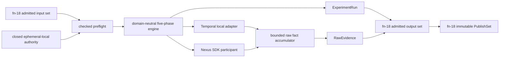

# Bounded local Temporal execution and SDK participant

> HTML render lens (local): open `.flow/artifacts/fn-19-bounded-local-temporal-execution-and/spec.html` — regenerable, markdown is the record. <!-- flow-next:artifact-link -->

## Umpire4 architecture reconciliation

The reusable Go package is `tools/umpire/runner`, with a separate `participant` protocol and adapters under `tools/umpire/adapter`. All model-owned execution profiles, participant programs, configuration interpretation, and evidence-source contracts live under `Temporal.System`; `Temporal.Feature` retains only product-visible meaning. The runner consumes fn-18's complete current ExperimentSpec and operational bindings without reconstructing missing semantic intent.

There is no installed public `umpire-local-run` command. Generated ordinary Go tests call the reusable runner directly for local/CI execution and retain normal `go test` discovery, filtering, breakpoints, and failure reporting. A focused internal integration harness may prove the adapter contract, but it is not a second user-facing run-tests surface.

## Overview

Deliver the first current-model execution slice: consume one fn-18-admitted `ExperimentSpec` plus portable `RuntimeConfiguration`, realize the exact Nexus caller-closure action in an isolated ephemeral Temporal server through one Go SDK participant, and publish an `ExperimentRun` plus bounded `RawEvidence` without interpreting that evidence or evaluating a Property.

The reusable center is a domain-neutral Go runtime/participant boundary. Temporal environment ownership stays in a Temporal adapter, and the Nexus action/program binding stays in a Nexus adapter. A closed built-in local authority profile structurally excludes remote endpoints, credentials, ambient namespaces, arbitrary executables, and user-supplied hooks.

## Goal & Context
<!-- scope: business -->

An inspectable semantic plan is useful only if the same identity can drive a real system and return truthful operational evidence. This slice proves that seam locally and safely: one admitted caller-closure experiment becomes one isolated run, one explicit force-close attempt, complete source closure/cleanup facts, and one immutable output set.

The primary user is a model/runtime engineer exercising the first live scenario. They provide a complete input set, output root, and stable run identity; the command either rejects before side effects, publishes an operationally succeeded/failed/incomplete run with raw evidence, or reports that execution occurred but publication failed. A valid run never claims semantic satisfaction or conformance.

## Architecture & Data Models
<!-- scope: technical -->



`tools/umpire/runtime` is the deep reusable module. It imports fn-18's admitted artifact API and owns checked run requests, a closed phase machine, budgets, participant commands/receipts, evidence accumulation, cleanup dominance, and construction of inert Run/RawEvidence values. It has no Temporal, Nexus, model-planning, Observation, or Property vocabulary.

Temporal-specific authority and lifecycle code lives below `tools/umpire/temporal/local`; the first Nexus program/binding lives below `tools/umpire/temporal/nexus`. The model-side concrete portable profile is under `model/Temporal/System/Execution`, while the Nexus-specific RuntimeConfiguration composition is under `model/Temporal/Feature/Nexus`. Reusable `model/Umpire` artifact types remain unaware of Temporal and Nexus.

### Exact input and authority contract

The CLI accepts one fn-18 `AdmittedSet` whose manifest contains exactly one `umpire-experiment/v1` and one `umpire-runtime-configuration/v1`, with no Run, evidence, Result, coverage, or unrelated member. Set admission, member identities, semantic references, and all cross-bindings are complete before runtime preflight.

`CheckedRunRequest` contains the admitted set, a 1–512-byte namespaced `runIdentity`, unsigned seed, positive attempt, and an in-memory `AuthorityProfile`. This first binding accepts seed `0` and attempt `1` only. Workflow, operation, task-queue, worker, and participant correlation IDs are derived from the run identity plus closed kind suffixes; duplicate kind/ID pairs reject before server startup.

The only authority is `temporal.runtime-profile.ephemeral-local` version 1. It creates a loopback `temporaltest` LiteServer, fresh namespace, clients, and workers owned by one invocation through a new context-aware error-returning lifecycle API. Existing panic-oriented test helpers remain wrappers, but the runtime path publishes each acquired handle before the next fallible step, unwinds partial startup, never dereferences a nil `testing.T`, applies the SDK worker stop timeout, and returns bounded shutdown errors. It exposes no address/config/credential flags and never connects to a pre-existing server. Namespace, task queue, and endpoint names are runtime facts, never `RuntimeConfiguration` authority. Concurrent processes are isolated by separate servers/namespaces; the engine itself admits one request at a time.

The profile requires exact generic capabilities for ephemeral server lifecycle, SDK worker lifecycle, and complete workflow-history reading. Its `profile.semanticDigest` and `profileRequiredCapabilities` use fn-18's non-self-referential projection. The concrete Nexus configuration adds the exact fn-4 evidence-profile/Observation-program/mapping references and one participant binding whose protocol identity/version/digest and capabilities match the checked Nexus program.

The first concrete phase budgets are fixed and canonical: preparation 30s/1 attempt/128 records/1 MiB; realization 30s/1/128/1 MiB; observation 30s/1/3584/12 MiB; isolation 15s/1/128/1 MiB; cleanup 15s/1/128/1 MiB. Their totals are 120s, 5 attempts, 4096 records, and 16 MiB. The local profile rejects altered units, zero/sub-second/over-ceiling time, retries, a larger aggregate, or a config whose exact capability union/profile/program references drift. SDK/Nexus retry policies are explicitly single-attempt; no SDK default retry is inherited.

### Participant protocol and scenario binding

`participant.Program` is checked inert data, not another behavioral DSL or persisted artifact. It contains identity/version/semantic digest, sorted supported target/action/capability declarations, and exactly four closed commands: `prepare`, `realize`, `observe`, and `cleanup`. A `Command` binds program, run, phase, occurrence, attempt, and closed typed arguments. A `Receipt` binds the same identities, one of `accepted|rejected|unsupported|failed|canceled`, zero or more bounded raw facts, and explicitly acquired/released resource handles. Values contain no callbacks or arbitrary maps.

The sole initial program binds `workflow-nexus.target.caller-closure` and the one planned occurrence/action `workflow-nexus.occurrence.force-close` / `workflow.action.force-close`. Preparation starts one SDK caller workflow, one Nexus operation/handler, and waits for the operation-started readiness receipt. Realization force-closes the caller exactly once. Observation waits for terminal caller history and the participant cancellation receipt. Isolation verifies the run-owned namespace has no second command/operation and closes collection inputs. Cleanup stops participant workers, closes clients, and stops the ephemeral server. Any different target, action, occurrence, fault, participant count, protocol, capability, or program digest rejects before Temporal startup.

The adapter never compares live facts to model-owned outcomes or resulting states. Force-close acceptance is an operational receipt, not proof of cancellation delivery, ownership, uniqueness, or Property satisfaction.

### Five-phase execution contract

Preflight is pure and happens before a phase or environment exists. Once preparation starts, the engine returns a valid Run/RawEvidence attempt even when operations fail; it never collapses an operational failure into a tooling error.

Phases have exact order `preparation → realization → observation → isolation → cleanup`. Preparation must succeed before realization. Observation is attempted after every started realization, including rejected/failed/timed-out/canceled realization, to retain failure evidence. Isolation is attempted whenever preparation acquired a live resource. Cleanup is attempted exactly once whenever preparation began, regardless of parent cancellation or prior failure. Isolation and cleanup receive fresh independently bounded contexts, never an already-canceled parent context. A phase cannot return to active or overwrite a terminal status; phases that cannot start remain `not-started` with the fn-18 timestamp/code rules.

The invocation deadline is the sum of configured phases; each phase additionally has its own deadline. The first terminal cause wins for that phase. User context cancellation marks the active primary phase `canceled`, skips any unsafe remaining primary work, then still runs bounded isolation/cleanup. Process crash is outside recoverable run semantics, but the server is in-process/ephemeral and fn-18 publication exposes no partial set; no remote operation can outlive the process.

Operational status uses the first matching row below; higher rows dominate every compound case. The engine retains all compatible phase/control/source diagnostics in canonical phase/identity order even when one row determines the summary.

| Precedence | Exact condition | Engine/result |
| ---: | --- | --- |
| 0 | engine invariant violation or fn-18 admission failure for constructed output | return `invariant` error, no publishable artifacts; CLI status 1 with `executionOccurred` reflecting whether preparation began |
| 1 | any phase status `failed`; control status `rejected|unsupported|failed`; any source status `failed` (including history iterator/close failure); or cleanup returns a concrete non-timeout failure | operational `failed` |
| 2 | no row 1 condition, and any phase is `timed-out|canceled`; a post-preparation phase is `not-started`; control is `not-attempted`; any source is `partial`; capacity N+1/gap/unknown-absence exists; or cleanup/isolation deadline expires | operational `incomplete` |
| 3 | all five phases `succeeded`, the one control attempt is `accepted`, every source is `closed`, no gap/capacity omission exists, and cleanup proves zero open handles | operational `succeeded` |

Thus cleanup timeout plus partial cleanup closure is `incomplete`; realization failure plus cleanup timeout is `failed`; earlier timeout plus concrete cleanup failure is `failed`; a history iterator error is `failed`; and capacity exhaustion without another hard error is `incomplete`. No other combination is valid.

### Raw evidence and publication contract

The adapter emits exactly four sources: `participant-output`, `history`, `control-receipt`, and `cleanup`. Source-local ordinals begin at zero and increase without gaps unless an explicit fn-18 gap records capacity/drop/unsupported data. History is closed only after the caller reaches a terminal event and the iterator is exhausted; participant output closes only after every command channel terminates; control closes only after exactly one force-close request/receipt; cleanup closes only after every tracked handle is released. Missing closure makes capture partial/failed and operational status incomplete/failed.

Only allowlisted mechanical fields are retained: event type/id, workflow/run/operation correlation IDs, command kind/status, cancellation callback count, open-handle count, and closed error codes. Namespace/task-queue/endpoint identities are digest-token fields. Headers, credentials, raw Nexus payloads, SDK payload bytes, stack traces, and arbitrary error text are never retained; presence is redacted or a named SHA-256 digest token. Evidence construction enforces fn-18's 64-source, 4096-fact, 128-field, 1-MiB payload, per-phase record/byte, global byte, reference, and causal-DAG limits before append. N+1 returns an explicit capacity omission and partial gap; it never allocates or silently truncates beyond the ceiling.

The engine constructs Run and RawEvidence in memory, fn-18 encodes/admit-checks them, and creates a new complete set containing the two input artifacts plus Run and RawEvidence. The CLI calls fn-18 `PublishSet`; it never implements a second writer. No partial set is visible. Because the environment is ephemeral, a process crash leaves no live external run; a publication failure after execution is reported with `executionOccurred: true` and the run identity, and the command never retries execution automatically.

## API Contracts
<!-- scope: technical -->

- `CheckRequest(admittedSet, authority, runIdentity, seed, attempt)` returns one immutable checked request or a structured preflight error and performs no IO.
- `Run(ctx, checkedRequest, environmentFactory, participant)` returns admitted in-memory output artifacts after bounded isolation/cleanup. It never parses bytes, publishes, maps evidence, or evaluates a Property.
- Environment and participant methods are phase-specific and accept only the engine's bounded contexts and closed command values. Resource acquisition returns tracked handles immediately so cleanup cannot depend on a later successful phase.
- Exact preflight error kinds are `input-set|profile|configuration|target|action|occurrence|participant|protocol|capability|budget|run-identity|seed|attempt|duplicate`. Runtime error codes are closed per phase and sanitized; raw third-party messages never enter canonical artifacts.
- Exact direct CLI: `umpire-local-run --set <directory> --output-root <directory> --run-id <namespaced-id>`. No profile, endpoint, namespace, task-queue, credential, executable, seed, attempt, retry, timeout, or arbitrary option flags exist in v1.
- The success/operational-result line is exactly one canonical object plus LF with ordered fields `{formatVersion, runIdentity, operationalStatus, experimentSemanticIdentity, runtimeConfigurationSemanticIdentity, runArtifactIdentity, rawEvidenceArtifactIdentity, artifactSetIdentity, manifestSha256, destination}`. `formatVersion` is `umpire-local-run-summary/v1`; every field is non-null; destination is the fn-18 returned immutable manifest-digest directory.
- The tooling-error line is exactly one canonical object plus LF with ordered fields `{formatVersion, kind, phase, subject, code, executionOccurred, publicationOccurred, runIdentity, artifactSetIdentity, manifestSha256, destination}`. `formatVersion` is `umpire-local-run-error/v1`; `phase`, `runIdentity`, `artifactSetIdentity`, `manifestSha256`, and `destination` are explicit nullable fields. `kind` is `arguments|input|preflight|runtime-invariant|publication|reporting`; `code` and `subject` are closed sanitized identifiers. No raw error/detail field exists.
- Status 0 means operational `succeeded` and publication completed. Status 2 means operational `failed|incomplete` and publication completed. Both write the summary to stdout and no stderr. Status 1 is a tooling/preflight/publication/reporting error and writes no successful stdout plus the error object to stderr; callers must inspect the two booleans rather than infer publication. Preflight has `false/false`; post-start invariant or publication failure has `true/false`; summary-write failure after publication has `true/true` and includes the full manifest identity/digest/destination so callers do not rerun. If stderr is also unavailable, exit remains 1 and the immutable destination remains authoritative.
- Root Make exposes only `make umpire-run-local SET=<directory> OUTPUT_ROOT=<directory> RUN_ID=<namespaced-id>`. Required variables are validated before the command; all Make changes are in the repository-root Makefile.

## Edge Cases & Constraints
<!-- scope: technical -->

- Unsupported or mixed input sets, profile/config/program drift, invalid capability unions, nonzero seed, attempt other than one, and unsupported semantic declarations fail before environment creation.
- A participant rejection or Temporal server/API error remains an operational artifact when preparation started. Model outcome `upgrade` is never synthesized from a successful API response.
- A history iterator error, missing terminal event, duplicate event/fact, causal orphan/cycle, source close race, or N+1 fact makes evidence partial/failed; none can be reported closed.
- Broken stdout after successful publication produces the exact status-1 reporting error with `executionOccurred: true` and `publicationOccurred: true`; it does not delete or republish the immutable set. Broken stdout before publication cannot occur because publication precedes summary output.
- Output-root permission/path/conflict checks run before execution where fn-18 can do so, but final publication may still fail. Automatic rerun, durable remote recovery, and retention are not provided.
- The first program has no authored requested fault; fault realization remains unsupported and rejects preflight.
- Existing comments are preserved in every reused lifecycle, history, and publication module.

## Quick commands
<!-- scope: technical -->

```bash
go test -count=1 ./tools/umpire/runtime/...
go test -count=1 ./tools/umpire/temporal/local/...
go test -count=1 ./tools/umpire/temporal/nexus/...
go test -count=1 ./tools/umpire/cmd/umpire-local-run/...
go test -count=1 ./temporaltest/...
cd model && mise exec -- lake build Temporal.System.Execution.LocalProfileTests
cd model && mise exec -- lake build Temporal.Feature.Nexus.ExecutionTests
make umpire-run-local SET=tools/umpire/temporal/nexus/testdata/caller-closure-input-set OUTPUT_ROOT=/tmp/umpire-local-runs RUN_ID=umpire.local.caller-closure.run-1
```

## Acceptance Criteria
<!-- scope: both -->

- **R1:** Runtime accepts only a complete fn-18-admitted two-member ExperimentSpec/RuntimeConfiguration set plus the exact closed local authority, validates all identities/references/capabilities/budgets/program/target/action/occurrence/run arguments before IO, and returns no partial checked request or side effect on any preflight error. [paraphrase]
- **R2:** One domain-neutral checked participant/runtime interface owns commands, receipts, resources, phase orchestration, and artifact construction without Temporal/Nexus vocabulary, arbitrary callbacks/maps, alternate semantic IR, byte parsing, publication, evidence interpretation, or Property evaluation. Temporal and Nexus code remain vertical adapters. [user]
- **R3:** The five-phase engine enforces exact per-phase/global bounds, single attempts, terminal-state rules, observation after started realization, independent isolation/cleanup contexts, cleanup exactly once, cancellation precedence, the complete hard-failure/incomplete/success precedence table, source-capacity outcomes, and deterministic diagnostics. Every post-start failure produces truthful bounded Run/RawEvidence values or an invariant error that cannot be published. [paraphrase]
- **R4:** The sole authority profile starts and owns one loopback ephemeral Temporal server, fresh namespace, clients, and workers per invocation through an error-returning, partial-start-cleaning, context-bounded lifecycle API; exposes no remote/ambient authority; records run-owned correlation identities; and guarantees cooperative teardown and process-crash disappearance without shared-state contamination. [paraphrase]
- **R5:** One exact Nexus SDK participant prepares the caller/operation, realizes only the planned force-close occurrence once, observes terminal history/cancellation receipt, proves resource isolation, and cleans every handle. Unsupported target/action/occurrence/fault/protocol/capability/program inputs fail before server startup; operational receipts never become model outcomes or semantic verdicts. [paraphrase]
- **R6:** Four bounded sources preserve gapless source order, causal/reference closure, terminal history, control and cleanup receipts, explicit partial/failed gaps, allowlisted dispositions, N+1 capacity evidence, and exact fn-18 bindings. The admitted published set contains only ExperimentSpec, RuntimeConfiguration, ExperimentRun, and RawEvidence and no SemanticEvidence/Result. [paraphrase]
- **R7:** Independent fake-adapter phase/failure oracles, field/reference/capacity mutations, one bounded live caller-closure run, exact CLI/root status contracts, public docs, and roadmap status prove the local operational slice. No remote/CI/canary execution, fault injection, semantic interpretation, conformance, replay/minimization/promotion, qualification, model-local Makefile, or prohibited legacy dependency is introduced. [user]
- **R8:** The runner consumes one complete current ExperimentSpec and exposes a reusable library used by deterministic generated Go tests; no public local-run/run-tests command or root wrapper is installed. This supersedes the command portion of R7. Errors: reconstructing setup/program/order/observation/termination/cleanup intent in Go, accepting an incomplete legacy spec for execution, bypassing generated-test digest binding, or introducing a second CLI execution surface fails completion.
- **R9:** Temporal execution profiles, participant programs, configuration meaning, evidence-source contracts, and adapter bindings are owned by `Temporal.System`, while Feature remains product-only and the reusable runner/participant packages remain domain-neutral. Errors: a Feature import of System, a runtime program under Feature, Temporal/Nexus vocabulary in runner/participant, or an adapter claiming a model outcome or Property result fails completion.

## Early proof point
<!-- scope: technical -->

Task `.3` is the runtime proof gate. A deterministic fake environment/participant enumerates success plus failure, timeout, and cancellation at every phase, source capacity N/N+1, duplicate/missing receipts, and cleanup failure after each prior outcome. An independent transition-table oracle must match the precedence table, exact phase statuses, control attempts, source closures, omissions, operational status, cleanup count, and admitted output shape. Tasks `.4`–`.8` and `.9` cannot proceed if cleanup is skipped/doubled, canceled parent context leaks into isolation/cleanup, a preflight error performs IO, or any invalid output passes fn-18 admission.

## Boundaries
<!-- scope: business -->

- No remote, existing-cluster, gRPC, CI, black-box, canary, credential, endpoint, namespace, arbitrary executable, or multi-profile adapter.
- No requested-fault realization, retries, multi-attempt campaign, concurrency scheduler, lease, durable live-run journal, crash resume, or automatic rerun.
- No planning, space lowering, exploration/coverage scoring, evidence mapping/qualification, Property evaluation, semantic evidence, Result, conformance, replay, minimization, promotion, or release qualification.
- No new persisted format, permissive decoder, alternate artifact/semantic IR, second writer, or compatibility alias.
- No additional SDK language, general participant process manager, arbitrary participant plugin, or standalone participant CLI.
- No model-local Makefile or CI workflow.
- No inspection, import, invocation, dependency, compatibility, or migration path for the prohibited legacy implementation.

## Decision Context
<!-- scope: both -->

The existing `temporaltest` LiteServer eliminates remote authority, stale external operations, namespace leases, and credential handling rather than adding policy machinery for them. A single closed profile/program is the smallest proof of the current artifact-to-runtime seam.

Participant commands are a narrow runtime protocol, not a Drive/Behavior DSL: the already-compiled ExperimentSpec owns what to do, while the adapter owns how one exact semantic action is realized. Keeping the protocol inert and domain-neutral permits later SDK implementations without moving Temporal/Nexus concepts into reusable Umpire types.

The runtime publishes failed/incomplete operational attempts because failures are evidence. Semantic interpretation stays downstream so a successful force-close request cannot be mislabeled as caller-closure conformance.

The runtime does not promise crash-resumable remote cleanup. The single in-process ephemeral authority removes that failure class for this slice; a later existing-cluster adapter must design explicit authority, leases, durable correlation, and recovery rather than silently inheriting local assumptions.

## References
<!-- scope: technical -->

- `.plans/UMPIRE4_COMPONENTS.md:303-327,394-416,613-640,706-716` — C6/C9 ownership, Milestone B, and pilot order.
- `.flow/specs/fn-18-versioned-umpire-artifact-boundary.md` — strict admitted artifact, RuntimeConfiguration, Run, RawEvidence, set, and publication contracts.
- `.flow/specs/fn-4-umpire-observation-and-semantic-verdicts.md` — downstream mapping/qualification authority and first synthetic Temporal evidence profile.
- `model/Temporal/Feature/Nexus/CallerClosure.lean:462-525` — exact scenario/action/property identities and meaning.
- `model/Temporal/Feature/Nexus/testdata/nexus-caller-closure-experiment-spec.json` — canonical sole input experiment.
- `temporaltest/server.go`, `temporaltest/options.go`, `temporaltest/server_test.go:31` — loopback server/client/worker lifecycle.
- `tests/nexus_test_base.go:25-94` and `tests/nexus_standalone_test.go:37-55,2337-2354` — Nexus enablement, server setup, and control API patterns.
- `tests/nexus_workflow_update_test.go` and `tests/versioning_test.go` — worker lifecycle and complete history iteration patterns.
- `go.mod` and official Go SDK v1.44.0 `client`, `worker`, and `workflow` documentation — pinned API/lifecycle/determinism contracts.

## Requirement coverage
<!-- scope: both -->

| Req | Description | Task(s) | Gap justification |
| --- | --- | --- | --- |
| R1 | Strict admitted input/preflight | `.1`, `.2`, `.5`, `.8` | — |
| R2 | Domain-neutral runtime/participant boundary | `.2`, `.3`, `.4`, `.5` | — |
| R3 | Bounded five-phase engine | `.2`, `.3`, `.7` | — |
| R4 | Ephemeral local authority | `.1`, `.4`, `.7`, `.9` | — |
| R5 | Nexus SDK participant | `.5`, `.6`, `.7` | — |
| R6 | Raw evidence/output set | `.3`, `.6`, `.7` | — |
| R7 | Oracles, live command, docs/boundaries | `.1`–`.9` | — |
| R8 | Complete ExperimentSpec through generated Go tests | `.1`–`.8` | — |
| R9 | System-owned programs and execution configuration | `.1`, `.5`, `.6`, `.8` | — |
