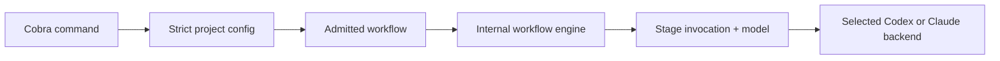

# Agentworkflow configuration and CLI

## Goal & Context
<!-- scope: business -->

Agentworkflow users need one tool-owned project configuration location, predictable model selection
for each workflow stage, and a conventional CLI that remains script-compatible. The project
configuration moves to `.agentworkflow/config.yml`, provider models become stage-specific, and the
standalone command adopts Cobra. Developers should see the tool as an executable rather than an
accidental public Go library; operators and scripts retain the current commands, flags, output
streams, machine-readable formats, and exit categories.

The approved detailed design is recorded in
`docs/superpowers/specs/2026-08-24-agentworkflow-configuration-cli-design.md`.

## Overview

Replace the default configuration path and protected project directory, extend the admitted
workflow contract with optional Codex and Claude model names on agent-backed stages, propagate the
effective model to each provider invocation, internalize implementation-only Go packages, migrate
the command tree to Cobra, and update current documentation.

## Architecture & Data Models
<!-- scope: technical -->

The strict project loader owns configuration discovery, path containment, protected inputs, and the
resolved YAML view. The normalized workflow owns a closed provider-model mapping for each logical
stage. The admitted request checkpoints that mapping before execution. Each agent invocation
receives the matching model for its logical stage; a whole-run CLI override takes precedence.

Cobra owns command/flag/argument parsing and delegates to internal configuration, backend, and
engine modules. The executable entry point contains only process setup and exit.



## API Contracts
<!-- scope: technical -->

The default project configuration is `.agentworkflow/config.yml`. An explicit configuration path
must remain inside the project and use a YAML extension. `.agentworkflow` is readable in isolated
workspace snapshots, cannot be source-excluded, and is always protected from candidate mutation.

Agent-backed workflow stages accept an optional `models` mapping whose only keys are `codex` and
`claude`, each containing a non-blank string. `check` and `apply` reject the field. A run selects the
entry matching its backend; absence delegates to the provider default. `--model` remains a
whole-run override. Plan review/revision share the plan model, all review lenses share the review
model, and all repair attempts share the repair model.

The CLI retains `init`, `doctor`, `run`, `resume`, `inspect`, `report`, `diff`, `apply`, and nested
`config explain`, including current flags, positional task support, stdout/stderr behavior, JSON
output, and exit-code categories.

## Approach

- Update the centralized strict configuration and recipe normalization before the engine consumes
  the new contract.
- Carry immutable model data through admitted workflow stages and invocation values; keep one
  backend per run and let constructor configuration represent the explicit CLI override.
- Move the unconsumed root library surface and its test helper below `internal/`.
- Build a fresh Cobra command tree per execution with injected context and writers so tests remain
  isolated and output/exit compatibility stays explicit.
- Remove obsolete configuration-format detection and current migration prose without changing
  runtime JSON protocols or output.

## Quick commands

```bash
cd tools/agentworkflow && GOWORK=off go test -tags test_dep ./...
cd tools/agentworkflow && GOWORK=off go build ./cmd/agentworkflow
make fmt-imports
GOLANGCI_LINT_BASE_REV=<reviewed-base> GOLANGCI_LINT_FIX=false make lint-code
```

## Edge Cases & Constraints
<!-- scope: technical -->

- `init` preserves existing `.agentworkflow` contents and atomically refuses to overwrite an
  existing `config.yml`, including concurrent creation races.
- Unknown model keys, blank values, non-string/null values, duplicate YAML keys, and model mappings
  on non-agent stages fail before workspace creation or backend startup.
- Configuration may carry both providers' model values; only the selected provider's value applies.
- Existing `.spec/agentworkflow.yaml` is not auto-discovered and no former-format migration probe is
  performed. Missing configuration uses the normal new-path error.
- Omitted stage models stay omitted in resolved/checkpointed data and retain provider-default
  behavior. Checkpoints without model fields remain readable and use provider defaults.
- Resume uses the admitted workflow models. A changed whole-run `--model` changes backend identity
  and remains rejected by the existing resume identity check.
- Provider rejection of a model follows normal agent-failure retention and outcome handling.
- Cobra parse/argument failures remain usage errors; semantic, backend, filesystem, capacity,
  cancellation, output-write, and workflow outcomes preserve current classifications.
- Existing comments remain intact when code is changed or moved.
- On this long-lived branch, the user-approved lint completion gate compares the complete configured
  analyzer set against the reviewed implementation base on a case-sensitive filesystem. Findings
  inherited from the stale canonical `main` comparison are recorded separately and are not fn-2
  completion failures.

## Acceptance Criteria
<!-- scope: both -->

- **R1:** `init`, default load, resolved config, source protection, and engine project validation use `.agentworkflow/config.yml` and protect the entire `.agentworkflow` tree while keeping it readable in snapshots. Errors: missing config points to the new path; existing/concurrently-created config is not overwritten; escaping paths/symlinks and attempts to exclude `.agentworkflow` are rejected.
- **R2:** Agent-backed stages accept optional non-blank `models.codex` and `models.claude` values and preserve them in resolved YAML. Errors: unknown keys, invalid scalar/null/blank values, duplicate keys, and `models` on `check` or `apply` are rejected before backend startup.
- **R3:** Every agent invocation uses the selected backend's logical-stage model, including plan review/revision, parallel review lenses, repair rounds, and resumes; `--model` overrides all configured values and omission emits no model argument. Errors: provider model rejection follows the existing agent-failure path; a conflicting resume override is rejected by backend identity validation.
- **R4:** Cobra implements the complete existing command tree with compatible flags, positional arguments, help, stdout/stderr routing, JSON output, and exit-code categories. Errors: unknown commands/flags and invalid arguments return usage status without corrupting machine-readable stdout; writer failures return failure status.
- **R5:** The engine, workflow contracts/results, backend interface, examples/tests, and backend test helper are importable only from inside the Agentworkflow module, with a thin executable entry point. Errors: the full module builds without stale imports or duplicate package surfaces.
- **R6:** Current code, tests, and user documentation no longer detect, recommend, or describe the former JSON project configuration, and current paths/examples no longer use `.spec`; runtime JSON results, checkpoints, events, schemas, and `--json` output are unchanged. Errors: no legacy-specific fallback or diagnostic remains.
- **R7:** Focused and complete module tests pass with `-tags test_dep`, the command builds, imports are formatted, and the complete configured repository lint set passes against the reviewed fn-2 implementation base on a case-sensitive filesystem. Errors: no completion claim is made for a failing in-scope verification command; inherited findings from the stale canonical `main` comparison are recorded separately.

## Boundaries
<!-- scope: business -->

- No automatic configuration migration or compatibility alias for old default paths.
- No provider model-catalog lookup or validation beyond a closed mapping and non-blank values.
- No per-stage backend switching; one backend remains selected for the run.
- No changes to retained runtime JSON/JSONL schemas or machine-readable CLI output.
- No new workflow stages, automatic apply mode, or target-specific workflow overlays.
- Historical design records remain historical; current product documentation carries the new contract.

## Decision Context
<!-- scope: both -->

The stage-centric provider mapping keeps portable project intent next to each workflow prompt while
avoiding backend construction per stage. Invocation-scoped model data is durable in the admitted
request and naturally covers retries and resume. A single CLI override retains operator control.

Full internalization is appropriate because repository search found no consumer outside this module;
leaving the root package public would harden an unsupported API. A fresh Cobra tree with injected
writers preserves the existing test seam and prevents flag state from leaking between tests. Model
catalog validation and compatibility migration were rejected as overkill and contrary to the
requested breaking change.

## Early proof point

Task fn-2-agentworkflow-configuration-and-cli.1 validates the new default path, protection rules,
and strict stage model schema. If it fails, re-evaluate the configuration boundary before changing
engine, package, or CLI architecture.

## References

- Approved design: `docs/superpowers/specs/2026-08-24-agentworkflow-configuration-cli-design.md`
- Cobra v1.10.2 user guide: https://github.com/spf13/cobra/blob/v1.10.2/site/content/user_guide.md
- Cobra v1.10.2 API: https://pkg.go.dev/github.com/spf13/cobra@v1.10.2
- Go module layout and internal packages: https://go.dev/doc/modules/layout
- YAML 1.2.2 mapping rules: https://yaml.org/spec/1.2.2/

## Requirement coverage

| Req | Description | Task(s) | Gap justification |
|-----|-------------|---------|-------------------|
| R1 | New configuration location and protection | fn-2-agentworkflow-configuration-and-cli.1, fn-2-agentworkflow-configuration-and-cli.2 | — |
| R2 | Strict per-stage provider model schema | fn-2-agentworkflow-configuration-and-cli.1 | — |
| R3 | Durable effective model propagation and precedence | fn-2-agentworkflow-configuration-and-cli.2, fn-2-agentworkflow-configuration-and-cli.4 | — |
| R4 | Cobra CLI parity | fn-2-agentworkflow-configuration-and-cli.4 | — |
| R5 | Internal-only Go implementation surface | fn-2-agentworkflow-configuration-and-cli.3, fn-2-agentworkflow-configuration-and-cli.4 | — |
| R6 | Remove obsolete configuration references and update current docs | fn-2-agentworkflow-configuration-and-cli.1, fn-2-agentworkflow-configuration-and-cli.5 | — |
| R7 | Complete scoped verification | fn-2-agentworkflow-configuration-and-cli.5, fn-2-agentworkflow-configuration-and-cli.6, fn-2-agentworkflow-configuration-and-cli.7 | — |
