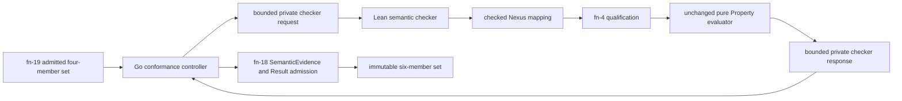

# Local execution semantic conformance

> HTML render lens: local file `.flow/artifacts/fn-20-local-execution-semantic-conformance/spec.html` — regenerable, markdown is the record. <!-- flow-next:artifact-link -->

## Umpire4 architecture reconciliation

The semantic checker follows the mandatory altitude chain: raw evidence is interpreted by a checked `Temporal.System.Nexus.Observation` mapping into a qualified System trace; a checked `Temporal.System.Nexus.Refinement` then derives the canonical Feature trace; only that Feature trace reaches the unchanged Feature Property evaluator. Observation, Refinement, and Property outcomes and derivations remain separate in SemanticEvidence and Result.

The Go controller stays transport-only. It may invoke the fixed Lean checker and validate returned artifact closure, but it cannot map System evidence directly to Feature facts or reproduce refinement/property semantics.

## Overview

Complete the first current-model semantic loop without re-executing Temporal. The command consumes exactly one fn-19-admitted four-member local set, projects its already-bounded Run and RawEvidence through a closed Go-to-Lean checker bridge, applies fn-4's checked Observation mapping and unchanged pure Property evaluator, and publishes one fn-18-admitted six-member set containing SemanticEvidence and Result.

Execution, qualification, and semantic verdicts remain independent. A structurally valid failed or incomplete run may still yield an inspectable non-success Result; malformed artifact input or a broken checker boundary yields no semantic artifacts.

## Goal & Context
<!-- scope: business -->

The primary user is an Umpire model/runtime engineer asking whether the exact local Nexus caller-closure run supports the properties embedded in its ExperimentSpec. The user needs one deterministic command that distinguishes a successful request from qualified semantic evidence, preserves why a verdict was reached, and fails closed when evidence is missing, ambiguous, contradictory, unrelated, partial, or unusably redacted.

Developers gain one deep conformance boundary with a narrow semantic-checker interface. Operators gain no new environment authority: this command is offline over an immutable local artifact set and never starts Temporal or a participant.

## Architecture & Data Models
<!-- scope: technical -->



The Go controller is the only persisted-byte reader and publisher. It requires exactly ExperimentSpec, RuntimeConfiguration, ExperimentRun, and RawEvidence; derives operational status through the fn-19 precedence authority; and never interprets a fact, constructs a semantic trace, or evaluates a Property.

The reusable Lean center composes an already-checked Observation program, bounded EvidenceBundle, checked query, and complete Property set into one qualification plus verdict result. It adds no Temporal vocabulary and does not change SemanticTrace, Property, or the existing evaluator.

One Temporal Tool checker resolves only the compiled Nexus caller-closure experiment, observation program, mapping, query, properties, evidence profile, and exact fn-19 source schemas. It converts the direct request projection to fn-4's typed EvidenceBundle, preserving source-local order, causal order, closure, gaps, and field dispositions. Unknown compiled identities are unsupported; incompatible facts are conflict; missing closure/order/discriminators are unknown. It never guesses or applies first-match semantics.

The Go/Lean exchange is private and non-persisted. Its request is a direct canonical projection of admitted values, not a new artifact or semantic IR. The fixed checker executable is resolved as a regular sibling of the Go command, has a pinned identity/version/digest handshake, accepts one canonical request on stdin, and emits one canonical response on stdout. There is no path, environment, plugin, network, callback, or arbitrary-executable option.

## API Contracts
<!-- scope: technical -->

- `Check(admittedSet)` is the only exported production entry point. It accepts only the exact four-member fn-19 set, resolves the verified sibling checker internally, and returns an admitted six-member set in memory or one structured tooling error. The checker injection seam is package-private and test-only. Checking is pure with respect to Temporal and never publishes.
- The private request is exactly `{formatVersion, checkerIdentity, checkerVersion, checkerSemanticDigest, experiment, runtimeConfiguration, run, rawEvidence, runIdentity, query, properties, observationProgram, mapping, phaseOutcomes, controlAttempts, sourceClosures, captureStatus, sources, facts, runOmissions, rawEvidenceOmissions}`. The four binding fields are exact admitted `ArtifactBinding` tuples without `path`: `{formatVersion, artifactIdentity, contentSha256, semanticIdentity, semanticDigest, provenanceSha256}`. The two omission arrays retain their distinct fn-18 `Omission` values. The request is `umpire-semantic-check-request/v1`, at most 32 MiB, and contains no paths, artifact bytes, credentials, endpoints, headers, arbitrary payloads, callbacks, or authority material.
- The private response is exactly `{formatVersion, checkerIdentity, checkerVersion, checkerSemanticDigest, experimentArtifactIdentity, runtimeConfigurationArtifactIdentity, runArtifactIdentity, rawEvidenceArtifactIdentity, experimentSemanticIdentity, runtimeConfigurationSemanticIdentity, runIdentity, qualificationStatus, qualifiedTrace, derivations, dispositions, diagnostics, semanticOmissions, propertyVerdicts, querySummary, semanticStatus, resultOmissions, qualifiedOutcomeIdentity}`. It is `umpire-semantic-check-response/v1`, at most 32 MiB, and repeats every binding needed to reject a stale, crossed, or substituted response.
- Request and response use canonical JSON plus one LF, exact field order, strict closed enums, bounded arrays/strings, and no unknown or duplicate fields. The checker gets one 30-second context; cancellation or timeout terminates it and cannot produce a partial result.
- The controller validates the response structurally, verifies every echoed identity and complete Property partition, constructs fn-18 SemanticEvidence and Result without changing semantic content, admits the complete six-member set, and returns it in memory. Only the CLI calls `PublishSet`.
- `semanticOmissions` contains only mapping/qualification omissions emitted by the Lean checker and is sorted/deduplicated by fn-18's exact omission order. `resultOmissions` is the canonical sorted exact-value union of request `runOmissions`, request `rawEvidenceOmissions`, and response `semanticOmissions`; exact duplicates collapse, while the bound input artifacts preserve their original collection membership. The Go controller verifies that union mechanically and never invents or drops an omission.
- A valid partial/failed capture is semantic input, not a tooling error. It produces an admitted SemanticEvidence/Result with qualification `unknown|conflict|unsupported`, semantic `incomplete`, empty evaluation projections where required, and canonical diagnostics. Structurally malformed/missing/duplicate/cross-boundary artifacts fail admission before checker startup.
- The output manifest contains the four byte-identical input members plus exactly one SemanticEvidence and one Result. It never rewrites input bytes and never contains a checker request/response member.
- Rechecking the same immutable input with the same checker yields byte-identical derived members and manifest. `PublishSet` therefore revalidates and returns the same destination idempotently; no intermediate or resumable state is persisted.
- Exact direct CLI: `umpire-local-conformance --set <directory> --output-root <directory>`. The Go command and `temporal-conformance-checker` must be installed as a verified sibling pair. No checker path, profile, property selector, evidence override, retry, timeout, network, or execution flag exists.
- The summary line is exactly `{formatVersion, runIdentity, operationalStatus, qualificationStatus, semanticStatus, semanticEvidenceArtifactIdentity, resultArtifactIdentity, qualifiedOutcomeIdentity, artifactSetIdentity, manifestSha256, destination}`. `formatVersion` is `umpire-local-conformance-summary/v1`; `qualifiedOutcomeIdentity` is nullable only as required by fn-18.
- The tooling-error line is exactly `{formatVersion, kind, phase, subject, code, checkingOccurred, publicationOccurred, runIdentity, artifactSetIdentity, manifestSha256, destination}`. `formatVersion` is `umpire-local-conformance-error/v1`; nullable identity/destination fields remain explicit. Kinds are `arguments|input|checker|output-invariant|publication|reporting`; phases are `admission|projection|qualification|evaluation|construction|publication|reporting`.
- Status 0 requires publication plus operational `succeeded`, qualification `qualified`, and semantic `satisfied`. Status 2 means a valid six-member set was published but any of those three conditions is not met. Status 1 is a tooling/admission/checker/publication/reporting error; stdout is empty and stderr contains the error object. A summary-write failure after publication reports `checkingOccurred: true`, `publicationOccurred: true`, and the complete immutable destination identity so callers do not rerun.
- Root Make exposes only `make umpire-check-local-conformance SET=<directory> OUTPUT_ROOT=<directory>`, builds the fixed sibling pair, validates required variables, and delegates to the direct command. Every Make change is in the repository-root Makefile.

## Edge Cases & Constraints
<!-- scope: technical -->

- The command rejects a six-member descendant as input, an orphan artifact, an extra member, mixed runs/configurations, semantic-reference drift, or any non-fn-19 profile/program/source family before checking.
- Operational failed/incomplete never becomes qualification failure automatically; the checker interprets whatever valid evidence exists, and the Result records all three status dimensions independently.
- Closed evidence at exactly 4096 facts follows ordinary qualification. Fn-4's configured evidence-record bound is debited before normalization; exhaustion returns canonical unknown with no Property evaluation. Request or response byte N+1 is a tooling error with no semantic artifact.
- Structurally unique facts that duplicate semantic claims, incompatible bindings, contradictory causal facts, or conflicting receipts produce conflict. Missing facts, gaps, partial closure, incomparable order, or absent discriminators produce unknown. Required data available only as redacted/hash material produces unsupported unless the checked mapping explicitly permits the marker/token.
- Every ExperimentSpec Property is resolved and represented exactly once in canonical order. Missing, duplicate, unexpected, or divergent verdicts make the response invalid or the strict summary incomplete according to fn-4/fn-18; no subset can report success.
- `qualifiedOutcomeIdentity` is computed by the Lean authority and independently validated by fn-18. It excludes run-specific transport facts exactly as fn-18 requires while remaining sensitive to the stable trace, mapping/program/query/Property semantics, verdict clauses/spans/bounds, and allowed derivations.
- SIGINT/SIGTERM cancels the checker and leaves no visible partial set. Cancellation during publication inherits fn-18 atomic recovery. Cancellation or broken output after publication does not delete the immutable destination.
- Existing comments are preserved in every reused model, artifact, runtime, command, and documentation file.

## Quick commands
<!-- scope: technical -->

```bash
cd model && mise exec -- lake build Umpire.Observation.Tests.Check
cd model && mise exec -- lake build Temporal.Tool.ConformanceTests temporal-conformance-checker
go test -count=1 ./tools/umpire/conformance/...
go test -count=1 ./tools/umpire/cmd/umpire-local-conformance/...
make umpire-check-local-conformance SET=tools/umpire/temporal/nexus/testdata/caller-closure-run-set OUTPUT_ROOT=/tmp/umpire-local-results
make umpire-check-regression
```

## Acceptance Criteria
<!-- scope: both -->

- **R1:** The conformance controller accepts only an fn-18-admitted, exact four-member fn-19 local caller-closure set; preserves all four input members byte-for-byte; and performs no Temporal, participant, network, or publication IO before complete input admission. Errors: malformed, missing, extra, duplicate, orphaned, cross-run, cross-configuration, unresolved-reference, wrong-profile/program/source, unsafe-path, or oversized input returns one structured input error, starts no checker, and produces no semantic artifacts.
- **R2:** One closed, 30-second, 32-MiB-per-direction private checker bridge binds the exact non-path ExperimentSpec/RuntimeConfiguration/ExperimentRun/RawEvidence artifact tuples plus checker identity and carries only direct admitted projections to the fixed sibling Lean checker. The exported production API resolves that checker internally and exposes no substitution seam. Errors: missing/non-regular/misdirected checker; handshake/version/digest mismatch; spawn/cancel/timeout/nonzero exit; malformed/noncanonical/unknown/duplicate/oversized output; stderr leakage; trailing bytes; or echoed artifact/semantic binding drift returns a checker error, kills/reaps the child, and exposes no partial SemanticEvidence or Result.
- **R3:** The compiled Temporal Nexus adapter resolves exactly the caller-closure mapping/profile/query/Property/source-schema closure and converts all four fn-19 sources into fn-4's bounded typed EvidenceBundle without changing reusable Umpire types or adding a second mapper/evaluator. Errors: unknown compiled identity/schema/kind/field, missing source, invalid disposition, unmatched correlation, causal orphan/cycle, or unsupported declaration fails closed as the exact unsupported/unknown/conflict outcome; source or fact order never selects an interpretation.
- **R4:** Fn-4 qualification and the unchanged Property evaluator produce complete coordinate derivations, dispositions, per-property verdicts, and strict summary while operational, qualification, and semantic statuses remain independent. Errors: gaps/partial closure/missing discriminator/bound exhaustion produce unknown; contradictory or duplicate semantic claims produce conflict; unusable redacted/hashed data or unsupported vocabulary produces unsupported; every non-qualified outcome skips Property evaluation and no missing evidence becomes absence or violation.
- **R5:** Exactly one fn-18 SemanticEvidence and one Result bind the complete input chain, reproduce the checked response, satisfy every status-matrix row, preserve the specified semantic-omission and canonical result-omission union, and form an admitted six-member set before publication. The Temporal checker composes the reusable qualification/verdict projection with the exact compiled ExperimentSpec plan to compute `qualifiedOutcomeIdentity`; it exists only for qualified resolved semantics and is stable across excluded run transport facts. Errors: missing/duplicate/unexpected Property result, invalid query partition or omission union, incomplete derivation/disposition bijection, identity/status/diagnostic drift, or any invalid wire relation is an output-invariant error and no set is publishable.
- **R6:** Checking is deterministic, bounded, offline, and retry-safe: the same input/checker yields byte-identical derived members; exactly-at-limit evidence is handled normally; limit-plus-one follows the specified tooling or qualification boundary; and identical publication returns the same revalidated immutable destination. Errors: checker cancellation, parent cancellation, publication interruption/conflict, or output-root failure exposes no partial visible set and never mutates the input.
- **R7:** The exact direct CLI and root Make target implement the frozen summary/error schemas and statuses 0/1/2, with the CLI as the sole production publisher. Errors: missing/extra/malformed arguments fail before checking; semantic non-success publishes and returns 2; pre-publication tooling failure returns 1 with authoritative booleans; reporting failure after publication returns 1 with the complete destination identity; unavailable stderr never changes the exit status.
- **R8:** Independent corruption, ambiguity, contradiction, disposition, bound, status, protocol, and binding fixtures plus one bounded fn-19→fn-20 local Nexus run prove fail-closed conformance and documentation states the exact command and limits. Errors: a mutation surviving, a wrong-boundary diagnosis, shared implementation/oracle logic, non-deterministic output, unclosed source/cleanup omitted from the Result, or any claim of replay, promotion, remote/CI/canary/release qualification fails verification.
- **R9:** Conformance is exactly `RawEvidence → checked System Observation → qualified System trace → checked Refinement → Feature trace → unchanged Feature Property`, and SemanticEvidence/Result retain both observation and refinement identities, digests, omissions, outcomes, and coordinate derivations. Errors: missing/stale refinement, direct evidence-to-Feature mapping, unmapped System coordinate, refinement conflict/unsupported/unknown, or any Go-side semantic translation prevents Feature evaluation and cannot become a Property violation or success.

## Early proof point
<!-- scope: technical -->

Task `.2` proves the closed checker can resolve the exact compiled Nexus declarations, consume a direct bounded request, call the existing fn-4 qualification/evaluator, and return a canonical response whose identities can be checked independently. If that fails, reconsider the sibling-process bridge before building the Go controller or any public command; never solve it with a second persisted reader or Go semantic evaluator.

## Boundaries
<!-- scope: business -->

- No Temporal execution, participant control, raw evidence collection, requested-fault realization, or mutation of fn-19 artifacts.
- No second persisted artifact family, persisted checker exchange, alternate semantic IR, permissive reader, second publisher, or Go reimplementation of Observation/Property meaning.
- No scenario, profile, program, mapping, query, or Property beyond the one compiled Nexus caller-closure closure.
- No remote/existing-cluster/black-box/CI/canary execution, credentials, endpoints, arbitrary executables, plugins, or network access.
- No replay, minimization, promotion, coverage scoring, campaign scheduling, formal checker target, or release qualification.
- No compatibility alias, model-local Makefile, CI workflow, or prohibited legacy dependency.

## Decision Context
<!-- scope: both -->

The private sibling-checker bridge keeps the two existing authorities intact: Go exclusively admits and publishes persisted artifact sets, while Lean exclusively maps evidence, evaluates pure Properties, and composes the plan-sensitive qualified-outcome identity. A direct bounded projection with exact non-path artifact tuples avoids both a second artifact reader and a second semantic implementation. Fixed sibling resolution behind the exported API and a semantic handshake eliminate arbitrary process authority rather than adding a configurable trust layer.

Semantic non-success remains publishable because unknown, conflict, unsupported, violated, and operational failure are evidence worth inspecting. Tooling failures remain non-results. The complete status and exit matrix prevents a green process, accepted control receipt, or closed history from being mistaken for semantic satisfaction.

The command accepts only the original four-member run set. Rechecking a derived set or selecting a subset would make provenance and property coverage ambiguous; deterministic idempotent publication already supplies the safe retry path.

## References
<!-- scope: technical -->

- Flow spec fn-4 — checked Observation mapping, qualification, derivations, pure Property evaluation, and strict aggregation.
- Flow spec fn-18 — strict admitted artifact values, SemanticEvidence/Result schemas, status matrix, identity formulas, complete-set validation, and immutable publication.
- Flow spec fn-19 — exact local authority, operational precedence, Nexus participant, four evidence sources, and four-member run set.
- UMPIRE4 DSL and component decomposition — execution, observation, property, artifact, and conformance ownership.
- Temporal Go SDK v1.44.0 client/history contracts and Go fuzzing guidance.

## Requirement coverage
<!-- scope: both -->

| Req | Description | Task(s) | Gap justification |
| --- | --- | --- | --- |
| R1 | Strict four-member input and offline boundary | `.3`, `.4`, `.6` | — |
| R2 | Closed bounded Go/Lean checker bridge | `.2`, `.3`, `.5`, `.6` | — |
| R3 | Exact Nexus live-evidence adapter | `.2`, `.5`, `.7` | — |
| R4 | Qualification and pure Property verdicts | `.1`, `.2`, `.5`, `.7` | — |
| R5 | SemanticEvidence, Result, and six-member set | `.1`, `.4`, `.5`, `.6` | — |
| R6 | Determinism, bounds, cancellation, idempotence | `.1`, `.3`, `.4`, `.5`, `.6` | — |
| R7 | Exact CLI/root UX and publication | `.6`, `.7` | — |
| R8 | Independent assurance, live proof, and docs | `.5`, `.7` | — |
| R9 | System Observation to checked Refinement to Feature Property | `.1`, `.2`, `.4`, `.5`, `.7` | — |


