# Deterministic Nexus fault negative control

> HTML render lens (local): open `.flow/artifacts/fn-21-nexus-duplicate-observation-control/spec.html` — regenerable, markdown is the record. <!-- flow-next:artifact-link -->

## Umpire4 architecture reconciliation

The negative control is an explicitly labeled `Temporal.System.Nexus` participant/evidence mechanism. Its requested fault intent, runtime realization receipt, System semantic observation, Implementation Link into Feature meaning, and Feature Property violation are five distinct facts. The synthetic contribution never enters canonical Feature semantics or claims a Temporal product defect.

## Overview

Add one explicitly requested, deterministic negative control to the bounded local Nexus caller-closure slice. The control performs the ordinary single caller force-close and one real Nexus cancellation, then the selected Temporal-owned participant program contributes exactly one labeled synthetic duplicate cancellation-delivery observation with the same correlation. The local runtime still succeeds operationally when realization, capture, source closure, and cleanup succeed; the existing Run Evaluation authority must qualify the evidence and report the unchanged caller-closure Property as violated for its uniqueness clause alone.

This is the missing reproducible accepted violation needed before C10 can replay, minimize, and propose a reviewed regression. It is not evidence of a Temporal defect and does not add a general fault-injection framework.

## Goal & Context
<!-- scope: business -->

Model/runtime engineers need one honest negative control proving that authored requested faults can cross the current ExperimentSpec, local participant, raw-evidence, and semantic-Run Evaluation boundaries without confusing a requested attempt, an operational receipt, or an induced observation with target-owned meaning. Success means the existing normal run remains satisfied, while the exact faulted run is operationally succeeded, accepted, and semantically violated for the intended reason.

Developers gain one concrete end-to-end realization of fn-16 fault intent. Operators gain no new authority, endpoint, credential, retry, plugin, or CLI option; both runs use the already planned bounded local commands over immutable admitted sets.

## Architecture & Data Models

```mermaid
flowchart LR
  S[Checked two-choice Nexus space] --> E[Fault-bearing ExperimentSpec]
  E --> C[Closed faulted RuntimeConfiguration]
  C --> P[Local Nexus participant]
  P --> R[One real cancellation]
  R --> D[Labeled duplicate observation]
  D --> A[ExperimentRun + RawEvidence]
  A --> Q[Existing Run Evaluation checker]
  Q --> V[Accepted uniqueness violation]
```

<!-- scope: technical -->



The Temporal-owned space is `temporal.nexus.caller-closure.space.duplicate-delivery-negative-control`. Its sole axis is `temporal.nexus.caller-closure.axis.cancellation-delivery`; its choices are `temporal.nexus.caller-closure.choice.delivery-baseline` and `temporal.nexus.caller-closure.choice.duplicate-delivery-observation`. The selected fault is `temporal.nexus.caller-closure.fault.duplicate-delivery-observation`, targeting required occurrence `workflow-nexus.occurrence.force-close`, action `workflow.action.force-close`, and capability `nexus.capability.cancellation`. The space carries one baseline and one fault-selection coverage goal because checked spaces require explicit seek metadata.

The baseline choice proves lowering mechanics but does not replace the existing ordinary caller-closure fixture. The fault choice lowers through the fn-16 checked intent path to a distinct ExperimentSpec with exactly one requested fault; the target-owned planned trace remains the ordinary count-one expected trace. The existing no-fault ExperimentSpec, RuntimeConfiguration, participant program, fixtures, and output bytes remain unchanged.

A second closed RuntimeConfiguration and participant-program identity admit only that exact fault-bearing ExperimentSpec. They reuse the fn-19 local authority, five phases, budgets, four-source Evidence Limitary, protocol, one participant, and one force-close control. Every other fault, occurrence, action, target, capability set, program, mapping, or profile is rejected before environment creation.

The participant waits until the real Nexus cancellation handler has received the cancellation under the pinned `WaitRequested` workflow mode. Only then may it contribute one synthetic duplicate observation. It never issues a second force-close or cancellation request and never mutates history. The one normal cancellation lifecycle chain contains exactly one `NEXUS_OPERATION_CANCEL_REQUESTED` event followed by one `NEXUS_OPERATION_CANCEL_REQUEST_COMPLETED` event; a second request chain is forbidden. The fault-specific evidence Generated View records one accepted control attempt with the exact fault identity and receipt, one real cancellation correlation, mechanical callback count one, synthetic-contribution count one, and an exact injected-duplicate marker tied to that same correlation. These are transport facts; the participant never emits a semantic verdict.

The fault-specific Temporal Observation mapping is a small checked extension of the existing caller-closure mapping, not another evaluator. It recognizes the closed marker and correlation, retains the mechanical callback count as one, derives the semantic cancellation count as one real callback plus one labeled synthetic contribution, and passes the resulting pure semantic trace to the unchanged Property evaluator. The faulted trace retains delivery and ownership as true and derives semantic cancellation count two.

## API Contracts
<!-- scope: technical -->

- The checked space has exactly one axis, two choices, one request-only fault, and two coverage goals. Canonical lowering of the fault choice produces one ordinary v2 ExperimentSpec whose `requestedFaults` contains only the fault-to-occurrence binding and whose capability requirements contain the cancellation capability. Neither choice authors an outcome, observation, receipt, or success.
- The faulted runtime binding is a second immutable built-in program/configuration pair. Its preflight requires exactly one matching requested fault, the fixed target/action/occurrence/capability/program/profile/mapping closure, seed zero, attempt one, and the existing bounded local authority. It has no configurable fault selector or arbitrary parameter map.
- Realization uses one real caller force-close and `NexusOperationCancellationTypeWaitRequested`. Injection occurs exactly once after the corresponding completed cancellation lifecycle correlation is established and before participant-output source closure. If the real cancellation is absent, rejected, failed, timed out, or uncorrelated, no synthetic duplicate is emitted.
- Faulted ExperimentRun records exactly one accepted control attempt for the planned occurrence with non-null matching fault and receipt identities. RawEvidence retains the existing four sources, unique fact identities and source ordinals, one normal requested/completed cancellation history chain, mechanical callback count one, synthetic-contribution count one, and the fixed injected-duplicate marker. The marker and both contributions share the real operation/cancellation correlation and cannot be inferred from timing or retries.
- Fn-19 operational precedence remains unchanged. A fully realized, closed, cleaned faulted run is `succeeded`; genuine preflight, lifecycle, capacity, source-closure, receipt, or cleanup failures retain their existing failed/incomplete semantics.
- Fn-20 remains the sole semantic authority. The fault-specific checked mapping may qualify only when the request, realization receipt, marker, count, causal correlation, source closure, and exact mapping/configuration identities agree. The unchanged caller-closure Property then resolves delivery and ownership satisfied and only the at-most-one cancellation clause violated.
- Existing direct and root commands accept the faulted immutable sets without new flags. The local execution command publishes an operational-success four-member set with status 0. The Run Evaluation command publishes an accepted semantic-violation six-member set with its existing status 2. The existing normal set continues to publish a satisfied six-member set with status 0.

## Edge Cases & Constraints
<!-- scope: technical -->

- Zero, duplicate, extra, stale, wrong-target, wrong-occurrence, wrong-action, or wrong-capability requested faults fail preflight before server or participant startup. A fault-bearing ExperimentSpec paired with the normal configuration, or the inverse, also fails before IO.
- A synthetic marker without one completed real cancellation lifecycle receipt is a runtime invariant failure, not evidence. A real receipt without the selected marker/contribution is operationally inspectable but cannot become the intended accepted violation.
- The real and synthetic contributions have distinct fact identities and ordinals while sharing the exact run/operation/cancellation correlation. Duplicate fact identity is malformed evidence; duplicate semantic contribution with valid distinct facts is the intentional negative control.
- Mechanical callback count other than one, synthetic-contribution count other than one, multiple markers, mismatched correlations, reordered causal dependencies, missing receipt, partial closure, a gap, or unusable disposition fails at the exact owning boundary below. It never guesses the intended fault.
- The extra fact/field is charged against existing phase, source, record, and byte ceilings before append. N+1 records the existing explicit capacity Known Gap/gap and cannot report operational success or silently drop the marker.
- Baseline and faulted runs use distinct immutable input/output identities and run identities. Republishing the exact already-constructed four- or six-member set and rechecking the same immutable four-member input are idempotent under fn-18/fn-20. Separate live executions use fresh run identities and may differ in timestamps, artifact bytes, manifests, and destinations; only their declared stable semantic and accepted-outcome identities must agree. Facts from separate runs cannot cross-correlate.
- The synthetic observation is always labeled as a test-owned negative control in retained evidence, diagnostics, and documentation. No result claims the SDK or server produced two independent cancellation deliveries.
- Existing comments are preserved. Reusable Umpire packages remain unaware of Temporal, Nexus, this fault identity, and the fault-specific mapping.

The mutation oracle is closed and owned as follows:

| Mutation | Owning boundary and exact result |
| --- | --- |
| Missing/duplicate/extra/stale fault; wrong target/action/occurrence/capability; normal/faulted configuration crossing; mapping/program/profile identity drift | fn-19 preflight tooling error, CLI status 1, `executionOccurred: false`, no output artifacts. |
| Participant rejection, concrete SDK/API error, real receipt failure, source failure, or concrete cleanup failure after preparation | Admitted fn-19 operational `failed`, execution CLI status 2, no synthetic contribution when the real receipt failed. Fn-20 may publish only an incomplete semantic Result. |
| Real cancellation readiness/`WaitRequested` timeout or cancellation, partial source, phase timeout/cancellation, missing closure, capacity N+1, or explicit gap without a harder failure | Admitted fn-19 operational `incomplete`, execution CLI status 2; fn-20 Observation Evaluation `unknown`, semantic `incomplete`, Run Evaluation status 2. |
| Synthetic marker before the completed real lifecycle, duplicate activation, second cancellation request chain, synthetic history mutation, or impossible run/evidence relation | fn-19 runtime-invariant tooling error, CLI status 1 with `executionOccurred: true`, no publishable run set. |
| Completed real lifecycle/callback present but marker, synthetic count, receipt link, or required causal/order discriminator absent | Fn-20 Observation Evaluation `unknown`, semantic `incomplete`, Run Evaluation status 2. |
| Multiple distinct markers/contributions, callback count not one, synthetic count not one, or incompatible correlation/order facts | Fn-20 Observation Evaluation `conflict`, semantic `incomplete`, Run Evaluation status 2. |
| Recognized required value available only under an unusable redact/hash disposition, or a recognized source-schema field cannot express the selected mapping declaration | Fn-20 Observation Evaluation `unsupported`, semantic `incomplete`, Run Evaluation status 2. |
| Missing/duplicate/unexpected Property result, Evidence Link/disposition bijection failure, or checker response identity/status drift | Fn-20 checker/output-invariant tooling error, Run Evaluation status 1, no Evidence/Result publication. |
| Exact request, one requested/completed lifecycle, callback count one, synthetic count one, one marker, complete correlation/closure/dispositions | Operational `succeeded`, Observation Evaluation `accepted`, semantic `violated` for uniqueness alone; execution status 0 and Run Evaluation status 2. |

## Quick commands
<!-- scope: technical -->

```bash
cd model && mise exec -- lake build Temporal.Feature.Nexus.Experimental.CallerClosureFaultTests
go test -count=1 ./tools/umpire/temporal/nexus/...
go test -count=1 ./tools/umpire/runevaluation/...
TMPDIR=/private/tmp go test -count=1 -tags test_dep ./tools/umpire/runevaluation -run '^TestBoundedLiveNexusNegativeControl$'
sh -c 'make --no-print-directory umpire-check-local-run-evaluation SET=tools/umpire/temporal/nexus/testdata/caller-closure-duplicate-delivery-run-set OUTPUT_ROOT=/private/tmp; test "$?" -eq 2'
make umpire-check-regression
```

## Acceptance Criteria
<!-- scope: both -->

- **R1:** One exact Temporal-owned two-choice checked space lowers the selected duplicate-delivery fault through fn-16 into a canonical fault-bearing ExperimentSpec while the target-owned planned trace remains the ordinary expected count-one trace and every pre-existing no-fault artifact remains byte-identical. Errors: invalid space Limits/effects/goals, absent or mismatched required occurrence/action/capability, duplicate/incompatible selection, lowering/planning failure, or authored outcome/evidence fields yields no faulted ExperimentSpec.
- **R2:** One second closed RuntimeConfiguration/participant-program pair and immutable input set admit only the exact fault-bearing ExperimentSpec and existing bounded local authority. Errors: zero/extra/different faults, normal/faulted configuration crossing, profile/program/protocol/mapping/capability/budget/seed/attempt drift, malformed set closure, or duplicate identity rejects before environment creation with no side effect.
- **R3:** The faulted participant performs exactly one force-close and one real `WaitRequested` cancellation lifecycle containing one requested and one completed history event, then emits exactly one labeled synthetic duplicate observation after the completed real correlation and before source closure. A complete realization remains operationally succeeded. Errors: no completed real receipt, rejection/failure/timeout, duplicate activation, second request chain, synthetic history mutation, wrong correlation, or cleanup failure follows the exact mutation table and never emits a successful synthetic claim.
- **R4:** The admitted faulted ExperimentRun and RawEvidence retain one accepted fault-bound control attempt/receipt, four exact closed sources, unique ordered facts, mechanical callback count one, synthetic-contribution count one, the fixed injected marker, the normal requested/completed cancellation causal chain, sanitized allowlisted fields, and explicit closure/cleanup. Errors: duplicate/missing facts or receipts, malformed marker/count, mismatched references/order/correlation, unsafe field/payload leakage, gap, N+1 capacity, or incomplete source closure follows the exact mutation table and cannot be admitted as a closed operational success.
- **R5:** A checked fault-specific evidence profile/program/mapping is compiled before RuntimeConfiguration binding; the existing Run Evaluation controller/checker consumes it to derive semantic cancellation count two from callback count one plus synthetic-contribution count one. The unchanged pure caller-closure Property reports semantic `violated` with delivery/ownership satisfied and only its at-most-one cancellation clause responsible. Errors: every request/receipt/marker/count/mapping/configuration/causality/closure/disposition/Property-partition mutation yields exactly the tooling, unknown, conflict, unsupported, or incomplete result assigned by the mutation table and never a guessed violation.
- **R6:** Paired bounded live controls prove the existing no-fault path remains operationally succeeded, accepted, and semantically satisfied, while the faulted path is operationally succeeded, accepted, and semantically violated. Rechecking and republishing the same immutable constructed set are idempotent; separate live executions may differ in transport bytes/destinations but preserve declared stable semantic and accepted-outcome identities. Errors: status/exit mismatch, stable-identity drift, cross-run binding, non-deterministic semantic preimage, partial publication, or a changed baseline byte fails the system proof.
- **R7:** Existing direct/root commands, focused and aggregate tests, developer documentation, and component status explain the negative-control lifecycle and the independence of requested attempt, realization receipt, operational status, Observation Evaluation, and semantic verdict. Errors: a new CLI flag/authority surface, generic fault framework, retry/campaign control, second mapper/evaluator/artifact family, changed Property/production target semantics, model-local Makefile, CI/non-local Observation Evaluation, replay/minimization/promotion, prohibited legacy dependency, or an unlabeled Temporal-defect claim is a verification failure.
- **R8:** The faulted participant program and evidence mapping are System-owned, and the Evidence-backed System Model Trace reaches the unchanged Feature caller-closure Property only through the checked Nexus Implementation Link. Errors: fault intent counted as realization, accepted transport counted as semantic observation, synthetic System evidence inserted into Feature declarations, missing/stale Implementation Link, or an Implementation Link non-success reported as a uniqueness violation fails the negative control.

## Early proof point
<!-- scope: technical -->

Task `.1` proves the exact checked fault intent can lower into a distinct ordinary ExperimentSpec while retaining the unchanged target-owned count-one plan and byte-identical normal artifact. If it fails, reconsider the fn-16 checked-space binding before adding any runtime or evidence behavior.

## Boundaries
<!-- scope: business -->

- No general fault DSL, fault registry, arbitrary injection hook, script, probability, timing race, retry policy, or multi-fault campaign.
- No second force-close, second SDK/server cancellation request, server patch, or claim that Temporal independently duplicated delivery.
- No reusable Umpire type or Property change, production target outcome change, alternate semantic IR, second mapper/evaluator, or new persisted artifact family.
- No replay, minimization, promotion, exploration, coverage scoring, formal checking, remote/existing-cluster/CI/canary execution, or release Observation Evaluation.
- No new public CLI option, participant executable, endpoint, credential, environment variable, configuration knob, root Make target, model-local Makefile, or CI workflow.
- No compatibility alias or prohibited legacy dependency, inspection, invocation, artifact, or migration path.

## Decision Context
<!-- scope: both -->

The SDK and server expose cancellation lifecycle, not a deterministic duplicate-delivery injection primitive. One real cancellation plus an explicitly labeled participant-owned duplicate observation is therefore the smallest truthful negative control. Timing, retries, or a second force-close would be nondeterministic or would test a different behavior.

The fault request stays request-only and the target continues to plan the correct count-one trace. Execution evidence alone establishes the count-two observed trace, and the separate Observation mapping alone turns that evidence into semantic observations. This preserves the user's pure reusable Property boundary and gives later replay/promotion the original checked expected trace plus a reproducible accepted runtime violation.

A second exact program/configuration pair preserves the existing normal fixture byte-for-byte and structurally eliminates accidental generic fault support. Keeping callback count at one and recording the synthetic contribution separately preserves transport truth while the checked mapping alone derives semantic multiplicity. The existing runtime and Run Evaluation commands are sufficient, so this slice adds no new user surface.

## References
<!-- scope: technical -->

- Flow spec fn-16 — checked finite spaces, request-only fault intents, canonical point lowering, and ordinary ExperimentSpec intent fields.
- Flow spec fn-18 — exact RuntimeConfiguration, ExperimentRun, RawEvidence, Result, closure, Limits, admission, and immutable publication contracts.
- Flow spec fn-19 — bounded local authority, participant protocol, five-phase runtime, four evidence sources, and operational precedence.
- Flow spec fn-20 — exact Nexus evidence mapping, pure Property evaluation, accepted Result identity, and status/CLI contracts.
- Temporal Go SDK prototype.44.0 workflow Nexus cancellation modes and Nexus Go SDK v0.6.0 idempotent asynchronous cancellation contract.
- Umpire component and DSL plans — requested attempts, realization receipts, execution divergence, semantic interpretation, and C10 prerequisite boundaries.

## Requirement coverage
<!-- scope: both -->

| Req | Description | Task(s) | Gap justification |
| --- | --- | --- | --- |
| R1 | Checked negative-control space and fault-bearing ExperimentSpec | `.1` | — |
| R2 | Closed faulted program/configuration and input set | `.7`, `.2` | — |
| R3 | One real cancellation plus exactly one injected observation | `.3`, `.4` | — |
| R4 | Closed causal fault-realization evidence | `.4`, `.6` | — |
| R5 | Checked mapping and accepted uniqueness-only semantic violation | `.7`, `.5`, `.6` | — |
| R6 | Paired live control, identity, status, and publication proof | `.5`, `.6` | — |
| R7 | Existing UX, documentation, boundaries, and aggregate verification | `.1`–`.7` | — |
| R8 | System-owned negative control and checked Implementation Link | `.1`, `.2`, `.5`, `.7` | — |
