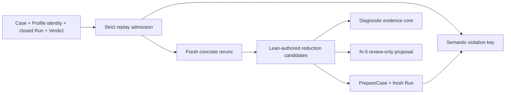

# Deterministic replay, semantic minimization, and reviewed promotion

## Umpire4 Case Runtime reconciliation

This spec consumes the public `Case`, `PreparedCase`, `Run`, and `Verdict` contracts introduced by fn-64. It does not restore `PortableTestPlan`, Run Evaluation, the caller-closure adapter, a resident executor, or a public execution service.

## Intent

Turn one admitted Case-native violation into three separate answers: whether the same semantic violation recurs in fresh Runs, which Producer-authored Program reductions are necessary for it, and which checked expected behavior should be proposed for review. Concrete rerun and semantic replay remain distinct. Temporal SDK history replay is deferred.

The first proof re-expresses the fn-21 duplicate-observation negative control as a Lean-produced generic Case after fn-64. The Case may use only the Case Runtime's public instruction and Contract vocabulary; no scenario-specific Go execution or verification code is allowed.

## Architecture

`tools/umpire/replay` is a deep orchestration module with a small `Open`, `Minimize`, and `Report` surface. It admits exact public Case Runtime values, prepares and runs candidates through the public facade, applies fixed bounds, and keeps transport details private. Lean owns every semantic reduction edit and compiles every candidate Case; Go never edits a Case, Contract, Run, or event stream.

The replay subject is a strict aggregate of canonical Case bytes, the exact non-secret Host Profile/catalog identities used for preparation, and one closed Run/Verdict pair. It is not a new Umpire artifact family, durable Run-recovery record, audit digest, trust store, or compatibility bundle.

## Contracts

Three replay classes are explicit:

- semantic replay evaluates a recorded Run through the same prepared Contract and must reproduce the same decisive transition, terminal violation state, responsible Contract clause, and supporting Observation roles;
- concrete rerun prepares the same canonical Case against the exact Profile identity and executes a fresh isolated Run;
- Temporal SDK history replay is diagnostic only and is outside this spec.

The semantic violation key binds Case, Program, Contract, Profile/catalog, violated terminal state, responsible clause, and canonical supporting Observation roles. It excludes fresh Run/activation identities, target timestamps, paths, durations, cleanup transport details, and other per-attempt values. A different Case, Contract, Profile, terminal state, responsible clause, or support-role relation is a different violation.

Baseline reproducibility requires two fresh Runs. A decisive `violated` Verdict with the same semantic violation key is reproduced; a completed `satisfied` Verdict or different violation is not reproduced; incomplete execution or `inconclusive` evaluation is indeterminate. Preparation failure is an input/admission failure before Run creation. Fn-64 terminal precedence remains authoritative.

Reduction is monotonic and deterministic. Lean exposes a finite ordered list of applicable, typed edits over Producer-authored Program coordinates while keeping the Contract fixed. Each candidate is a complete canonical Case. Invalid or unpreparable candidates are recorded without target effects; a candidate is retained only after two fresh Runs reproduce the original semantic violation key. Reduction ends only after every remaining applicable edit has conclusively failed, or a bound makes the result incomplete.

The diagnostic `EvidenceCore` references supporting events already present in the original closed Run. It never rewrites the Run or Verdict. The first proof must include one labeled non-responsible Observation and prove that the core omits it while retaining the same violation proof.

Only `minimized` or `irreducible` completion may invoke fn-5 to emit one checked Lean source proposal. The proposal contains target-owned expected behavior, never the observed violating trace, is review-only, and is never installed automatically.

## Limits and failure behavior

The first vertical slice uses fixed limits: at most eight semantic edits, twelve fresh Runs, one active Run, 25 minutes wall time, bounded Case/event/report bytes, and bounded progress output. Limits are checked before preparation or dispatch where possible. Cancellation stops new work and lets the active Run follow fn-64 abort/drain/cleanup semantics.

Input drift, crossed identities, duplicate members, noncanonical values, stale Profile/catalog identity, or an original non-violated Verdict rejects before rerun. Target non-success remains a Run outcome. Monitor, cleanup, or Host failure follows fn-64 precedence and cannot turn an inconclusive attempt into reproduction. Proposal or report publication failure never installs a regression and never causes an automatic rerun.

## Acceptance Criteria

- **R1:** Strict admission accepts one canonical Case, exact Profile/catalog identities, and one closed matching Run/Verdict violation; crossed, stale, incomplete, noncanonical, or non-violated inputs fail before target effects.
- **R2:** One stable semantic violation key distinguishes semantic identity from per-Run transport identity and binds the exact Case, Contract violation, responsible clause, and supporting Observation roles.
- **R3:** Two fresh isolated concrete reruns classify the subject as `reproduced`, `not-reproduced`, or `indeterminate` without treating SDK history replay as semantic proof.
- **R4:** Lean owns a finite fixed-order set of typed Producer-authored Program reductions and compiles each complete candidate Case; Go cannot edit semantics, and accepted reductions never reintroduce removed coordinates.
- **R5:** Reduction retains a candidate only after two fresh Runs preserve the original semantic violation key, distinguishes `minimized`, `irreducible`, and bounded-incomplete results, and never silently skips an applicable edit.
- **R6:** The fn-21 negative control is recompiled as one generic Case Runtime Case and proves repeated reproduction plus an EvidenceCore that omits one labeled non-responsible Observation without modifying the recorded Run or Verdict.
- **R7:** Only a complete minimized or irreducible result can emit one fn-5 checked, review-only Lean regression proposal for correct target behavior; observed violating behavior is never promoted or installed.
- **R8:** A bounded library-first controller and thin local command report admission failure, reproduction class, reduction completion, limits, cleanup, proposal status, and tooling failure separately, with deterministic semantic output and no secret-bearing diagnostics.
- **R9:** Semantic replay, concrete rerun, and diagnostic history replay remain separate types and report fields; history replay is explicitly deferred and cannot affect reproduction or promotion.
- **R10:** The former persisted replay-bundle/audit-digest design is retired. This spec adds no Umpire artifact family, trust store, durable Run recovery, resident executor, public network service, or compatibility reader.

## Early proof point

Before reducer or CLI work, compile the fn-21 negative control into a generic Case, run it twice through `PrepareCase`/`PreparedCase.Run`, and prove the same Case-native semantic violation key. If that cannot be expressed without scenario-specific Go behavior, stop and revise the Producer/Case boundary rather than adding an adapter.

## Boundaries

No generic reducer language, concurrent campaign, durable resume, SDK history replay, automatic regression installation, alternate Host protocol, or change to fn-64 execution semantics. Existing comments are preserved when implementation later replaces legacy vocabulary.

## Requirement coverage

| Requirement | Tasks |
| --- | --- |
| R1–R2 | `.1` |
| R3, R9 | `.2`, `.6` |
| R4 | `.3`, `.4` |
| R5 | `.4`, `.6` |
| R6 | `.6`, `.8` |
| R7 | `.5`, `.6` |
| R8 | `.7`, `.8` |
| R10 | `.1`, `.8` |
