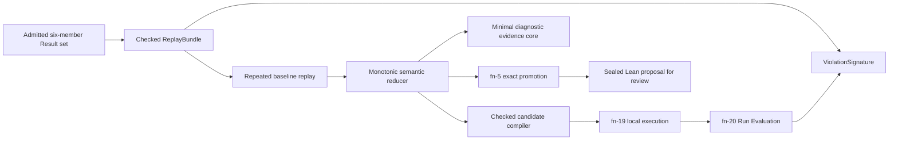

# Deterministic replay, semantic minimization, and reviewed promotion

> HTML render lens (local): open `.flow/artifacts/fn-22-deterministic-replay-semantic/spec.html` — regenerable, markdown is the record. <!-- flow-next:artifact-link -->

## Umpire4 architecture reconciliation

This spec names three replay classes and never treats them as interchangeable:

- **canonical semantic replay** re-evaluates a trace/counterexample through the exact checked Target, Behavior, Implementation Link, and Property declarations and is mandatory for a semantic violation or promotion;
- **concrete experiment rerun** re-executes the complete ExperimentSpec through the runner and Run Evaluation path to establish reproducibility in an environment; and
- **Temporal SDK history replay** checks workflow-code compatibility against a captured Temporal history and is diagnostic evidence only.

The reproducible reduction state is persisted as the fn-18 replay-bundle artifact with the original immutable evidence, exact semantic/operational reproduction tuple, tried candidates, remaining Limits, and Known Gaps. Minimization operates on checked semantic candidates and an accepted witness; it never minimizes logs in place or reruns live side effects implicitly.

## Overview

Compose the current artifact, checked-authoring, local-execution, semantic-Run Evaluation, and exact-promotion boundaries into one bounded C10 path. The path consumes the admitted six-member evaluated violation produced by the deterministic Nexus negative control, independently reproduces the same violation, removes semantic coordinates in a fixed order while the same violation remains reproducible, identifies the minimal diagnostic evidence core without modifying retained RawEvidence, and emits one sealed Lean regression proposal for review.

This is an artifact-consuming orchestration layer, not another runtime, mapper, evaluator, artifact family, or regression installer. The first supported input is deliberately exact: the fn-21 caller-closure duplicate-observation Result set.

## Goal & Context

Model/runtime engineers need to turn one accepted live failure into an inspectable answer to three different questions: does it recur, which authored coordinates are necessary, and what correct target-owned behavior should become a regression? Reviewers need deterministic lineage from the original result through every rejected or accepted reduction to source that has already elaborated but has not been installed.

The user runs one bounded command over an immutable result-set directory. A successful run reports that the failure is reproducible, whether the scenario was reduced or proved irreducible, the retained semantic/evidence coordinates, and the digest/path of a review-only Lean proposal. Non-reproduction, incomplete evidence, exhausted Limits, and tooling failures remain distinct.

## Architecture & Data Models



`tools/umpire/replay` is the deep Go orchestration module. Its public surface is conceptually `Open`, `Run`, and `Report`: strict admission and lineage checks enter once; candidate compilation, isolated execution, Run Evaluation, comparison, Limits, reduction accounting, and promotion gating remain private. It may reuse algorithmic ideas from the existing bounded campaign reducer, but it does not import that package's legacy scenario, claim, trace, or promotion semantics.

`ReplayBundle` is an in-memory checked aggregate over the existing fn-18 six-member set: ExperimentSpec, RuntimeConfiguration, ExperimentRun, RawEvidence, Evidence, Result, their manifest, and their recomputed identities. It adds no persisted schema and admits only operational `succeeded`, Observation Evaluation `accepted`, semantic `violated`, one complete Property partition, and the exact fn-21 program/profile/mapping/fault closure. Crossed members, unknown formats, missing source closure, or a recomputed identity mismatch fail before execution.

`ViolationSignature` is `umpire-violation/v2:` plus SHA-256 of one canonical JSON value with this exact field order: `{formatVersion, targetIdentity, targetBehaviorFingerprint, kernelIdentity, observationProgram, mapping, properties, violatedVerdicts}`. The first three fields reproduce the exact ExperimentSpec plan fields. Observation program, mapping, and each Property reproduce their exact fn-18 `{kind, identity, version, behaviorFingerprint}` `SemanticReference`; `properties` is the complete identity-sorted set. `violatedVerdicts` is sorted by Property identity and each item is `{property, responsibleClauses, spans, appliedLimits, responsibleCoordinates}`. Clauses retain exact `{identity, status, coordinateIdentities}`; spans, typed Limits, semantic coordinates, and the corresponding accepted-trace values retain their existing canonical order and values.

Each responsible coordinate contains exactly `{coordinateIdentity, modelValue, derivation}`. Its derivation contains `{coordinateIdentity, mappingIdentity, bindings, evidenceRoles, orderingRoles, closureRoles, dispositionRoles, appliedEvidenceLimit}`. This is a field-by-field Generated View of fn-18 derivation data:

| Fn-18 field | Signature disposition |
| --- | --- |
| `coordinateIdentity`, `mappingIdentity`, `appliedEvidenceLimit` | Included exactly. |
| `bindings` | Keys sort canonically; model values remain exact; opaque run/correlation values are replaced by deterministic equality-class labels assigned at first occurrence in responsible-coordinate order. Equality and inequality are therefore preserved while concrete run values are erased. |
| `evidenceFactIdentities` | Concrete identities are excluded. Each referenced fact becomes `{role, sourceSchemaIdentity, sourceSchemaVersion, sourceSchemaDigest, kind, subjectRole, fieldRoles, causeRoles}` under the closed fn-21 mapping. `role` is one of `control-receipt|history-requested|history-completed|real-callback|synthetic-contribution|injected-marker`; `subjectRole`, consumed opaque field values, and causal endpoints use the same equality-class labels. Retained semantic values and payload digests remain exact. Records sort by role then canonical projected bytes. |
| `orderingFactIdentities` | Concrete identities are excluded; include sorted `{beforeEvidenceRole, afterEvidenceRole}` edges over the projected evidence-role records. |
| `closureSourceIdentities` | Source instance identities are excluded; include sorted `{sourceKind, schemaIdentity, schemaVersion, schemaDigest, mediaType, closureStatus}` records. |
| `dispositionIdentities` | Concrete identities are excluded; include sorted `{evidenceRole, fieldName, policy, retainedModelValue, digest}`. Opaque retained values use equality-class labels; nullability remains exact. |

The Generated View admits only the exact closed fn-21 role table; an unclassified referenced fact, binding, field, cause, source, or disposition invalidates the bundle instead of being dropped. Diagnostics and irrelevant accepted coordinates are excluded because admitted evaluated violations have no diagnostics and the signature deliberately represents the responsible proof. ExperimentSpec plan identity, RuntimeConfiguration identity/phase budgets/participant bindings, run/fact/receipt/Artifact Checksums, timestamps, namespaces, paths, Known Gaps, and provenance are excluded. Every replayed Result retains its own existing `evaluationOutcomeChecksum`; that identity is not the minimization predicate because a legitimate candidate may have a different plan.

`ReplayCandidate` is also in memory. It contains one canonical checked ExperimentSpec/RuntimeConfiguration input set, its parent candidate identity, one typed reduction edit, and the unchanged intended ViolationSignature. Candidate bytes are always produced from fn-16 checked authoring/planning and the closed Temporal Nexus binding; the reducer never edits JSON or wire structs.

Reduction order is literal and stable: actions in reverse canonical ordinal, ordering constraints in reverse canonical order, requested faults in reverse canonical identity order, then diagnostic evidence dependencies in reverse canonical identity order. Removing an action also removes only structurally dependent ordering edges; every other edit is one coordinate. Equal candidates are ordered by canonical candidate identity. RuntimeConfiguration is closed and has no fn-16 removable-coordinate authority, so this exact vertical slice declares configuration reduction non-applicable and never edits it. The first fn-21 scenario is expected to be irreducible: removing its sole force-close is invalid or cannot preserve the signature, removing its sole requested fault produces an accepted satisfied control, and it has no optional ordering coordinate.

Evidence minimization computes an `EvidenceCore` of references already present in the admitted semantic derivations: responsible Property clauses, Observation outputs, derivations, source facts, and realization receipt. RawEvidence and source-closure facts remain intact and are always supplied to fn-20. A proposed evidence-reference removal is accepted only when the unchanged admitted Result plus remaining derivation dependency graph still provides a closed proof of the same responsible clauses and ViolationSignature. The core is diagnostic report data, never another RawEvidence, Evidence, Result, Claim Assessment input, or persisted artifact.

## API Contracts

- `Open` uses fn-18 decode/validate APIs for one immutable six-member set and rejects anything except the exact fn-21 evaluated violation closure. The baseline signature is computed once after full admission; neither a caller-supplied signature nor a result summary is trusted.
- `Run` uses library entry points behind fn-19 and fn-20 rather than invoking their CLIs. Each live attempt receives a fresh run identity and destination, seed zero, attempt one, the same bounded local authority, and the candidate's newly admitted immutable input set. No artifacts or facts cross attempts.
- Baseline reproducibility requires exactly two independent live attempts. Both must be operationally succeeded, accepted, semantically violated, and equal to the baseline ViolationSignature. A completed accepted satisfied result or a different evaluated violation is `not-reproduced`; operational failed/incomplete, Observation Evaluation unknown/conflict/unsupported, semantic incomplete, cancellation, timeout, or unavailable authority is `indeterminate`.
- The reducer considers at most eight action/ordering/fault candidate edits, performs at most twelve live executions total, and has a 25-minute wall bound in addition to every existing per-phase bound. One trial is enough to reject a candidate. An accepted candidate is executed once more from a fresh environment and is retained only when both Results match the original ViolationSignature. Limits are constants for this first vertical slice, not user configuration. Configuration edits are a closed non-applicable class in the report, not silently attempted or implemented by mutating RuntimeConfiguration.
- Invalid candidate edits and candidates that cannot compile through fn-16 are deterministic rejections recorded in the report, not live executions. A candidate that compiles but becomes accepted satisfied or violates a different clause is also rejected and reduction continues. An indeterminate trial stops minimization without promotion; exhaustion records the untried suffix and is not success.
- Completion distinguishes `minimized` from `irreducible`. Zero accepted reductions with every applicable edit conclusively rejected is a successful irreducible result, not an error. Accepted reductions are monotonic; no removed coordinate is reintroduced and no concurrent or timing-dependent search is permitted.
- Promotion reconstructs the candidate's canonical checked Query and original target-owned `PlannerRun.found` expected trace from the admitted ExperimentSpec lineage. It never promotes the observed count-two trace. Implementation statically registers exactly one fn-5 `PromotionCandidateBinding`, `temporal.nexus.caller-closure.promotion.cancel-unique-regression`, with promoted IDs `workflow-nexus.behavior.regression.cancel-is-unique` and `workflow-nexus.query.regression.cancel-is-unique`, the typed fn-21 fault-bearing original Query/run/target/kernel constants, and the required imports. The primary Lake build can register it only after its exact emitted declaration elaborates into fn-5's unchanged sealed `CompiledPromotionSource`. This build-time proposal registry is distinct from the semantic/stable-regression catalog and does not install the emitted regression.
- The Go adapter resolves only the verified `temporal-model-promote` sibling and invokes it exactly as `temporal-model-promote temporal.nexus.caller-closure.promotion.cancel-unique-regression`; there is no path, environment, candidate, source, or arguments override. It applies a 30-second bound, a 16-MiB stdout bound, a 64-KiB sanitized stderr bound, kills/reaps on cancellation, and requires status 0 plus fn-5's canonical one-LF `umpire-promotion-proposal/v2` envelope. It strictly validates the candidate/binding identity, original Query/artifact/target/kernel lineage, promoted IDs, source identity/SHA, and source bytes from that envelope against the minimized candidate and build-pinned identities. Unknown candidate, nonzero exit, timeout, extra output, malformed/noncanonical envelope, or any crossed field blocks proposal output.
- Runtime Result, ViolationSignature, and reduction lineage never enter `CompiledPromotionSource`. The in-memory orchestration result instead cross-binds `{sourceArtifactSetIdentity, minimizedCandidateIdentity, resultArtifactChecksum, violationSignature, promotionBindingIdentity, compiledSourceIdentity, compiledSourceSha256}` before output. The final command emits the validated compiled source to an explicit proposal path with exclusive creation and canonical LF bytes. No runtime command edits a Lean module, proposal registry, semantic catalog, stable-regression registry, glossary, fixture, Makefile entry, or documentation Generated View; an existing destination is never overwritten.
- One command, `umpire replay-minimize-promote --set <result-set> --proposal <file>`, orchestrates the complete first slice. Its terminal stdout is exactly one canonical JSON report line plus LF on statuses 0 and 2; status 1 leaves stdout empty and terminates stderr with one canonical error line after any progress lines. Status 0 means reproducible, complete minimized/irreducible analysis and sealed proposal emitted; status 2 means valid not-reproduced, indeterminate, or limit-exhausted analysis with no proposal; status 1 means admission, invariant, protocol, compilation infrastructure, or output/publication failure with no successful proposal.
- The root Makefile exposes one thin `umpire-replay-minimize-promote` target using `SET` and `PROPOSAL`; no model-local Makefile or CI workflow is added.

### Report and progress contract

The terminal command envelope is `umpire-replay-report/v2`, not an fn-18 member and never admitted or published as an artifact. Its exact field order is `{formatVersion, sourceArtifactSetIdentity, sourceEvaluationOutcomeChecksum, sourceViolationSignature, classification, completion, Limits, counters, baselineAttempts, candidateTrials, acceptedReductions, nonApplicableClasses, evidenceCore, untriedEdits, promotion, reportIdentity}`. `classification` is `reproduced|not-reproduced|indeterminate|limit-exhausted`; `completion` is `minimized|irreducible|null`. Limits are the literal `{maxSemanticEdits:8, maxLiveExecutions:12, maxWallNanoseconds:1500000000000}` and counters are `{semanticEdits, liveExecutions, elapsedNanoseconds}`.

Baseline attempts are ordinal-sorted `{ordinal, candidateIdentity, runIdentity, resultArtifactChecksum, evaluationOutcomeChecksum, violationSignature, operationalStatus, observationEvaluationStatus, semanticStatus, classification, cleanupComplete}`; attempt `classification` is `matched|resolved-different|indeterminate`. Candidate trials are proposal-order `{editIdentity, parentCandidateIdentity, candidateIdentity, compilationStatus, attempts, decision, reason}` where `candidateIdentity` is null on `compilationStatus: rejected`, compilation status is `compiled|rejected`, attempts use the baseline-attempt shape, and `decision` is `accepted|rejected|indeterminate|untried`. `reason` is exactly `accepted|invalid-edit|non-applicable|compile-rejected|accepted-satisfied|different-violation|indeterminate|limit-exhausted`. Accepted reductions and untried edits are edit-identity arrays in decision order. `nonApplicableClasses` is exactly `["configuration"]` for this binding.

`evidenceCore` is null before successful reproduction or exactly `{propertyIdentities, responsibleClauseIdentities, coordinateIdentities, derivationCoordinateIdentities, evidenceRoles, orderingRoles, closureRoles, dispositionRoles, receiptRoles, identity}`. Every array uses the corresponding ViolationSignature Generated View and its canonical order; `receiptRoles` is the sorted subset of evidence roles required to bind realization. Its `identity` is `umpire-evidence-core/v2:` plus SHA-256 of those preceding fields in that order. This is a nested report value, not an admitted artifact. `promotion` is null except status 0, otherwise `{bindingIdentity, compiledSourceIdentity, compiledSourceSha256, proposalPath}`.

`reportIdentity` is `umpire-replay-report/v2:` plus SHA-256 of the canonical report semantic preimage containing source identities/signature, classification/completion, fixed Limits, semantic edit/live-execution counts, attempt ordinals/candidate identities/statuses/signatures, trial edits/decisions/reasons, reductions/non-applicable classes/core/untried edits, and promotion binding/source identity/SHA. It excludes elapsed time, fresh run identities, Result/evaluation-outcome Artifact Checksums, cleanup transport details, and proposal path. Whole report bytes are not promised equal across live invocations; with the same immutable input and successful semantic outcomes, `reportIdentity`, classifications, edit decisions, EvidenceCore, and proposal SHA must be equal while excluded transport/timing/path fields may differ.

Long-running progress is sanitized NDJSON on stderr using `umpire-replay-progress/v2`. Each line is at most 4 KiB and exactly `{formatVersion, sequence, phase, state, baselineAttempt, editIdentity, candidateIdentity, liveExecutions, maxLiveExecutions, semanticEdits, maxSemanticEdits, elapsedNanoseconds, remainingNanoseconds, cleanupStatus}`. `phase` is `admission|baseline|candidate-compilation|minimization|evidence-core|promotion|proposal|done`; `state` is `begin|end`; nullable attempt/edit/candidate fields are explicit; cleanup is `not-started|running|complete|failed|uncertain`. The command flushes at every phase transition, before and after each live attempt, on cleanup transition, and immediately before wall-bound cancellation, with at most 128 lines. Progress contains no paths, endpoints, credentials, raw fields, opaque correlation values, or artifact bytes and does not affect terminal report identity. Fake-clock tests pin sequence, counters, remaining time, cancellation, and final cleanup emission.

Status 1 terminates stderr with one `umpire-replay-error/v2` line after progress. Its exact field order is `{formatVersion, kind, phase, code, subject, liveExecutionOccurred, liveExecutions, cleanupStatus, proposalCreated}`; kind is `arguments|input|runtime|run-evaluation|candidate|promotion|output|reporting`, phase reuses the progress phase enum, and the final three state fields are never inferred from the error kind. It contains no path, authority material, raw fact value, or partial source bytes.

## Edge Cases & Constraints

- An operational success alone is never reproduction. Equality of `evaluationOutcomeChecksum` alone is neither required nor sufficient across reduced candidates; equality of the recomputed ViolationSignature and all resolved status gates is required.
- A Result with multiple violated Properties or an incomplete Property partition is outside this first exact binding and fails admission. Missing responsible clauses, ambiguous derivations, unsupported dispositions, or signature fields not justified by existing semantic evidence fail closed.
- Baseline attempt disagreement is `not-reproduced` when both attempts are accepted/resolved but differ semantically; it is `indeterminate` when either attempt lacks an accepted resolved answer. Neither case starts minimization or emits a proposal.
- A reduction trial that returns a different evaluated violation cannot become a new campaign automatically. It is recorded as a rejected edit with its independently recomputed signature.
- Live transport bytes, timestamps, destinations, run identities, and `evaluationOutcomeChecksum` may differ across candidates and attempts. Stable comparison never normalizes away target/kernel, mapping/program, Property, responsible-clause, bound, or derivation semantics.
- Evidence-core reduction cannot remove closure, disposition, provenance-binding, or causal prerequisites from the stored artifacts. It may only omit nonessential references from the diagnostic core after validating graph closure.
- Cancellation or wall Limit exhaustion waits for the active fn-19 cleanup contract, publishes no partial proposal, and records the exact first untried edit. There is no checkpoint/resume file; a later invocation starts from the immutable input and repeats deterministically.
- The command is local-only and supports exactly the fn-21 Nexus binding. No arbitrary executable, endpoint, credentials, environment profile, random seed, attempt count, reducer plugin, fault injector, or shell command is accepted.
- Existing comments are preserved. Reusable Lean Umpire modules remain unaware of Temporal, Nexus, runtime artifacts, replay orchestration, and proposal paths.

## Quick commands

```bash
go test -count=1 ./tools/umpire/replay/... ./tools/umpire/cmd/umpire-replay-minimize-promote/...
cd model && mise exec -- lake build Temporal.Feature.Nexus.CallerClosureReplayTests
make umpire-replay-minimize-promote SET=/tmp/umpire-local-results/caller-closure-duplicate-delivery PROPOSAL=/tmp/cancel-is-unique-regression.lean
make umpire-check-regression
```

## Acceptance Criteria

- **R1:** One strict `ReplayBundle` admission path consumes the exact immutable fn-21 six-member Result set, recomputes every fn-18 identity/relation, requires succeeded/accepted/violated closure, and rejects crossed, partial, stale, unsupported, or broader inputs before execution with no output.
- **R2:** One exact canonical `ViolationSignature` and closed fn-21 evidence-role table preserve target/kernel, mapping/program, Property, responsible-clause/bound/span, semantic-coordinate/value, equality/correlation, ordering, closure, disposition, and applied-bound semantics while excluding the enumerated plan/runtime transport identities and values. A field-by-field normalization matrix proves every included mutation changes or invalidates the signature and every excluded mutation does not.
- **R3:** Exactly two isolated baseline attempts through fn-19 and fn-20 distinguish reproducible, not-reproduced, and indeterminate outcomes using the exact status/signature rules, fresh run/output identities, complete cleanup, and no cross-attempt facts.
- **R4:** A deterministic bounded reducer proposes only typed fn-16-compiled action, ordering, and fault edits in the fixed order, explicitly reports configuration as non-applicable, confirms accepted candidates twice, records every rejection/acceptance and untried suffix, and returns successful `irreducible` when no valid edit preserves the violation.
- **R5:** Diagnostic evidence minimization returns the smallest closed responsible clause/Observation/derivation/fact/receipt reference graph under fixed ordering while leaving the complete admitted RawEvidence/Evidence/Result artifacts byte-identical and never acting as a Claim Assessment input.
- **R6:** The exact fn-21 negative control reproducibly yields its uniqueness-only ViolationSignature; removing the requested duplicate-observation fault yields the existing accepted satisfied control and is rejected, the sole required action cannot be removed, and the final result is deterministic minimized or irreducible within twelve executions and 25 minutes.
- **R7:** Only a reproducible complete reduction whose candidate matches the statically registered exact fn-21 candidate may invoke the fixed verified `temporal-model-promote` sibling by its one closed candidate identity. The registry binding reconstructs the original checked expected count-one `PlannerRun.found` lineage and fixed fresh IDs; fn-5's canonical envelope and unchanged sealed, elaborated `CompiledPromotionSource` are strictly validated and cross-bound to runtime/reduction lineage outside that reusable type. The observed count-two trace is never promoted and no runtime registry/source/fixture/catalog edit is possible.
- **R8:** The library, one CLI/root Make target, exact terminal report identity/status contract, bounded sanitized progress stream, fake-controller matrices, focused live proof, aggregate tests, and developer/component documentation make replay, minimization, evidence core, and review-only promotion inspectable. No new persisted artifact family, second semantic authority, generic campaign/reducer plugin surface, remote/CI/release Claim Assessment, model-local Makefile, or prohibited legacy dependency/use is introduced.
- **R9:** Canonical semantic replay, concrete ExperimentSpec rerun, and Temporal SDK history replay have distinct inputs, outcomes, receipts, trust classes, and command/report vocabulary. Only an evaluated violation reproduced by concrete rerun and matched by canonical semantic replay may feed semantic minimization or fn-5 promotion; SDK history replay is compatibility evidence only. Errors: incomplete/encrypted/incompatible history, concrete rerun divergence, stale Target/Behavior/Implementation Link/Property digest, replay disagreement, or missing cleanup remains an honest non-success and cannot support promotion.
- **R10:** A strict replay-bundle artifact retains the original immutable spec/run/evidence/result chain, complete reproduction tuple, semantic witness and derivations, checked reduction candidates, tried/untried order, Limits, provenance, and Known Gaps. This supersedes the no-persisted-replay-family portion of R8. Errors: rewriting raw evidence, minimizing raw logs as semantic input, dropping failed candidates, implicit live execution, or resuming from crossed/tampered state fails admission.

## Early proof point

Task `.1` proves that the admitted fn-21 Result can produce a stable ViolationSignature which remains equal across two synthetic run-transport variants but changes when the responsible uniqueness clause, bound, mapping, or derivation changes. Task `.3` then proves one checked no-fault reduction compiles through fn-16 to the ordinary expected count-one plan; Task `.6` proves that candidate reaches the existing accepted satisfied control. If either early proof fails, revise the signature or candidate-authority boundary before adding broader orchestration.

## Boundaries

- No new persisted ReplayBundle, campaign, minimization, report, evidence, or promotion artifact family and no fn-18 schema revision.
- No new Property, Observation mapper, evaluator, target transition, expected outcome, semantic IR, or `evaluationOutcomeChecksum` formula.
- No promotion of observed evidence, direct source generation in Go, runtime registry/fixture/catalog/source edits, dynamic proposal candidate, or unelaborated proposal. The one static fn-5 proposal-registry binding is implementation wiring, not automatic regression installation.
- No arbitrary scenario, model family, runtime backend, executable, endpoint, credentials, seed, Limits, retry policy, concurrency, plugin, or reducer extension point.
- No discovery scheduling, coverage guidance, checkpoint/resume, corpus retention, formal checker integration, remote/existing-cluster/CI/canary execution, or release Claim Assessment.
- No compatibility alias, model-local Makefile, or prohibited legacy dependency, inspection, invocation, artifact, or migration path.

## Decision Context

The current `evaluationOutcomeChecksum` deliberately includes the ExperimentSpec plan, so using it as the minimization predicate would reject every legitimate plan reduction. The narrower ViolationSignature remains strict about semantic authority and responsible proof while allowing the coordinates C10 is supposed to remove. It is a comparison Generated View over admitted results, not another verdict.

The complete six-member set remains the replay unit because artifact closure and evidence Claim Assessment must not be weakened. Evidence minimization therefore produces a checked diagnostic proof core over retained references rather than rewriting RawEvidence. This makes the smallest explanation inspectable without manufacturing a second allegedly real capture.

The correct promoted regression is the checked target-owned expected count-one trace already carried by the fault-bearing ExperimentSpec planner lineage. The accepted observed count-two trace explains why promotion is warranted but is not valid target behavior. Reusing fn-5's sealed exact-promotion gate keeps source elaboration and review separate from campaign orchestration.

One command matches the user's end-to-end intent and keeps the library decomposition deep: replay, reduction, Run Evaluation, and proposal compilation are independently testable behind a small orchestration surface, without requiring users to shuttle an unnecessary intermediate Drive or Replay DSL between commands.

## References

- Flow spec fn-5 — checked catalog lineage, exact proposal reconstruction, Temporal source binding, and sealed `CompiledPromotionSource`.
- Flow spec fn-16 — checked finite spaces, request-only fault intents, canonical point lowering, and atomic candidate compilation.
- Flow spec fn-18 — six-member artifact sets, strict admission, identity formulas, immutable publication, and status matrix.
- Flow spec fn-19 — bounded local authority, isolated runtime execution, cleanup, raw evidence, and operational status.
- Flow spec fn-20 — sole semantic-Run Evaluation authority, Property partitions, derivations, accepted results, and status contract.
- Flow spec fn-21 — exact deterministic caller-closure evaluated violation and its unchanged expected count-one Model Trace.
- Umpire component and DSL plans — C10 responsibility, pure Property boundary, requested-fault semantics, and review-gated promotion.

## Requirement coverage

| Req | Description | Task(s) | Gap justification |
| --- | --- | --- | --- |
| R1 | Strict admitted replay bundle | `.1` | — |
| R2 | Stable semantic ViolationSignature | `.1`, `.2` | — |
| R3 | Repeated isolated replay classification | `.2`, `.6` | — |
| R4 | Checked deterministic semantic reduction | `.3`, `.4`, `.6` | — |
| R5 | Non-destructive diagnostic evidence core | `.4`, `.6` | — |
| R6 | Exact Nexus negative-control minimization proof | `.6`, `.8` | — |
| R7 | Expected-trace exact reviewed promotion | `.5`, `.7` | — |
| R8 | CLI, Make, tests, docs, and boundaries | `.7`, `.8` | — |
| R9 | Three distinct replay classes | `.1`, `.2`, `.4`, `.6`, `.7` | — |
| R10 | Persisted replay-bundle closure | `.1`, `.4`, `.8` | — |
