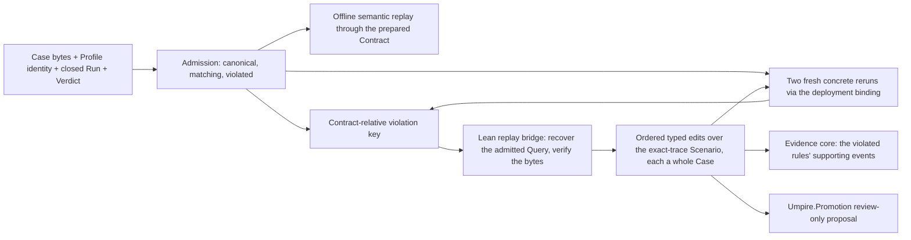
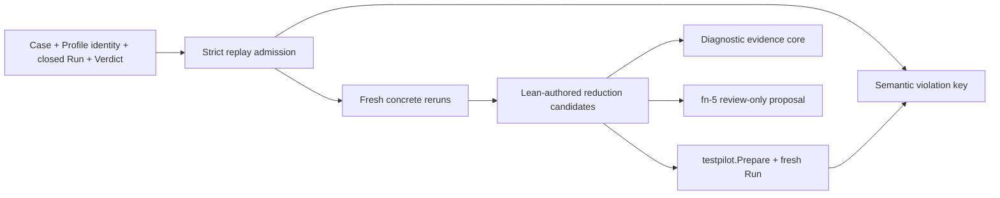

# Deterministic replay, semantic minimization, and reviewed promotion

## Re-plan on fn-85 and fn-33 (2026-09-22)

The first plan (2026-08-26; plan review 2026-09-04: MAJOR_RETHINK, its record under **History**)
was written against the fn-21 duplicate-observation negative control, a variation Space and a
persisted replay subject, all of which fn-86 deleted, and it conflated three things the rethink
asked to keep apart: the exact identity of a candidate Case, the Contract-relative equivalence of
two violations, and the offline semantic replay of a recorded Run. This plan is re-founded on what
the tree now has: Cases are produced by the `case` command from checked Queries under a feature
Realization (fn-85, fn-86), `umpire-run` and the fn-33 deployment binding run one Case against any
deployment, the fn-33 campaign hands out whole Cases and retains each counterexample's candidate
with its admission, and `Umpire.Promotion` compiles a review-only regression source from an
admitted Query and its planning anchor (fn-5, fn-33 .5).

The three points of the rethink, resolved:

- **Exact candidate identity is not violation equivalence.** A Case's identity is its canonical
  bytes' checksum, and a rerun of the same Case shares it. Two violations are *the same violation*
  by a Contract-relative key read in Definition IDs, never Case-local names: the violated rules
  and the terminal state each reached, and the evidence kinds of the step at which each rule
  reached it, never sequence numbers, times, activations, values, instruction ids or the
  accumulated support of every earlier step. A reduced candidate is a different Case with the same
  key, which is what makes a reduction sound; the key and the identity are two report fields and
  two Go types.
- **The negative Case is proved before any reduction.** fn-21's control is gone with the Space it
  varied; its successor is a labeled negative-control Model beside the caller Model that keeps the
  platform's real row authorized and adds one row the platform never takes, which the control
  Query selects and its Property names, produced through the caller Realization and proved
  violated twice against the test cluster, with its Verdict reproduced offline, before the reducer
  exists. A produced Case observes only what its witness lifts today, so a platform that takes
  the real row would record an event the Case never reads and the Run would end inconclusive;
  the Producer is therefore changed first (task .2) so that every witnessed row declares the
  evidence of every result of its (state, action) pair, each kind projected to the result whose
  fact records it. That is a Producer boundary change, named here with its golden and fixture
  regeneration, and it is what makes a violated Verdict reachable for any produced Case, the
  exploration's counterexamples included. If the control still cannot be produced without
  scenario-specific Go, or its Runs come back inconclusive rather than violated, the proof task
  stops and the boundary is revised, as the first plan already required.
- **Offline semantic replay and checked promotion stay explicit.** Semantic replay is the
  recorded Run re-evaluated through the same prepared Contract with no deployment, exposed on the
  Case Runtime facade; it is a type and a report field of its own beside the concrete reruns, and
  SDK history replay stays deferred. Promotion is `Umpire.Promotion.compilePromotionSource` from
  the admitted Query the Lean side recovers for the subject, review-only, written only where the
  caller names, never installed.

## Umpire4 Case Runtime reconciliation

This spec consumes the public `Case`, `PreparedCase`, `Run`, and `Verdict` contracts of fn-64 as
fn-87 tightened them, the deployment binding and bridge client of fn-33, and the `case`, `set` and
`query` commands of fn-85. It restores no `PortableTestPlan`, Run Evaluation, caller-closure
adapter, resident executor or public execution service, and it adds no Umpire artifact family.

## Intent

Turn one admitted violated Run of a produced Case into three separate answers: whether the same
Contract-relative violation recurs in fresh Runs of the same Case, which prefix steps of the
Case's path one last-first sweep can drop while the violation persists, and which checked
expected behavior should be proposed for review. Offline
semantic replay, concrete rerun and reduction remain distinct. Temporal SDK history replay is
deferred.

The first proof re-expresses the negative control as a Lean-produced Case under the caller
Realization: a control Model whose expected behavior the platform contradicts, so its Run is
violated deterministically and honestly, and says so in its name.

## Architecture

`tools/umpire/replay` is the Go orchestration: `Subject` admission and the violation key
(`subject.go`), the offline semantic replay through the facade, two-Run classification over
`tools/umpire/binding` (`rerun.go`), the bounded reducer over the Lean bridge (`minimize.go`), the
report (`report.go`). It admits exact public Case Runtime values, prepares and runs candidates
through the public facade, applies fixed bounds, and keeps transport details private. Lean owns
every semantic edit and compiles every candidate Case (`Temporal.Tool.ReplayBridge`,
`umpire-replay-bridge`, frames over stdin and stdout like the exploration bridge); Go never edits a
Case, Contract, Run or event stream.

**The subject** is one Case and one *recorded Run*. The Case's canonical form is the Lean
renderer's compact canonical ProtoJSON, one owner: the exploration bridge hands it out in that
form and `umpire-fuzz --record-root` writes it so; a checked-in fixture is that form re-indented
with two spaces and a trailing newline by the conformance generator's `persistedForm`, which Go
inverts with `json.Compact`. Admission accepts an input that is the compact form (one trailing
newline allowed, which `--record-root` writes) or its persisted re-indentation, that is
`input == compact(input) || input == persistedForm(compact(input))`, with `persistedForm` decided
once in an importable package the conformance generator and the replay share; anything else is
`noncanonical`. It decodes the compact bytes and takes the subject's *identity* as the SHA-256
of them; the Lean bridge's `admit` re-produces the Case and compares the same
compact bytes. The recorded Run is: a local JSON file holding the closed Run
with its Verdict and the `DriverIdentity` it was prepared under (Profile name, catalog and
environment-binding fingerprints, none secret), written by `umpire-run --record <path>`, by
`umpire-fuzz --record-root <dir>` for each counterexample (its Case bytes as
`<set>-<digest>-case.json` beside its recorded Run as `<set>-<digest>-run.json`, which is how an
exploration counterexample becomes a subject; the campaign's `Drive` gains a per-candidate record
hook that hands each violated Run's Case bytes, Run, Verdict and `DriverIdentity` to the caller
as they close, matched to the summary's counterexamples by candidate identity, so nothing is
retained in the report), and by the live suite's helper through one
`run` method on its bound Case that records into the test's temporary directory, which the
control test alone uses. It is a value the command reads from two files and the deployment flags; the recorded
Run is a file shape of `tools/umpire/replay`, not an artifact family, bundle, digest or trust
store.

**Preparation without a deployment.** `binding` gains a free `Prepare(deployment, handlerQueue,
identity, source)`: it builds the method catalog itself, derives the Profile and calls
`testpilot.Prepare`; it opens no connection, provisions nothing and needs no `Campaign`, and
returns the `PreparedCase` with its `DriverIdentity`. `Campaign.Bind` is built on it and `Bound`
exposes the prepared Case. Admission runs entirely before `binding.Open`, so a crossed, stale or
noncanonical subject is rejected before any resource is created. The identity `umpire-replay`
prepares under (its `DriverIdentity`, not to be confused with the subject's Case identity above)
is fixed: the Profile *name* is the recorded Run's, so that a Run recorded by
`umpire-run` (`umpire-run.<namespace>`), by `umpire-fuzz` (`umpire-fuzz.<namespace>`) or by the
live helper is replayed under its own name; the catalog and the environment bindings (namespace,
task queue, handler queue, Nexus endpoint) are derived from the deployment flags, and
`binding.Deployment` carries no dynamic configuration, so a Profile recorded with switch settings
is `stale` to this slice by design and the control is recorded without them. `stale` is a catalog
or bindings fingerprint other than the recorded Run's. The prepared Case is what the offline
semantic replay evaluates.

**The Lean side recovers the admitted Query.** A produced Case carries no Query, and the Case
Registry holds produced values only, so the replay bridge carries a typed binding table like the
exploration bridge's (`Binding`: the Model, its sets, their Queries and the realization each
`case` block names); the `admit` frame names the set and either the Query (a functional set's)
or the exploration candidate's target key (an exploratory set's, replanned deterministically by
fn-33 .5's guarantee); the bridge re-produces the Case under the set's realization and admits
only when the compact canonical bytes are the subject's, byte for byte. A Case whose bytes no set of the Model produces is
`crossed`, before any target effect.

## Contracts

Three replay classes are explicit and reported apart:

- **semantic replay** re-evaluates the recorded Run through the same prepared Contract offline
  (`PreparedCase.Evaluate`, the facade export of the Case Runtime's own evaluator, over the
  prepared Case admission produced without a deployment) and must reproduce the same Verdict:
  status, each rule's status and terminal state, and the supporting sequences. Beside the Verdict
  it returns the *evaluation*: for each violated rule, the sequence of the event whose evidence
  resolved the obligation violated and that evidence's kind, which the evaluator already knows
  (the monitor rules' transition trace; the correlated monitor's `release`, where a buffered
  evidence may be released by a later event and the released evidence, not the releasing event,
  is the one named). It runs before any rerun and proves the Verdict is the Contract's reading of
  the events, not the Monitor's timing. A replay whose Verdict differs from the recorded one, or
  whose evaluation errs, rejects the subject before any rerun (`semanticReplay` names the cause);
- **concrete rerun** prepares the same canonical Case under the exact Profile identity through
  `binding.Bind` and executes one fresh isolated Run;
- **SDK history replay** is diagnostic only and outside this spec: no type, no field, and it
  affects nothing.

**The violation key** is read in Definition IDs: a Case-local name (a `rule_id`, a monitor
rule's `terminal_state_id`, a monitor rule's observation id, a correlated evidence kind) is
resolved through the Case's `provenance.local_names` rows where a row exists and taken as-is
where none does, because local names are the shortest unique dotted suffix among the Case's own
Definition IDs and a candidate with fewer steps can rename what survives. It binds the violated
rules (by Definition ID, sorted), each with the terminal state it reached and its *violating
evidence*: for a monitor rule the terminal state is the rule's own state and the evidence is the
observation ids the violating event carries, except that a rule violated by its deadline names
the deadline's violation state and no evidence, since which event reaches the count is timing; for a correlated rule the terminal state is the
runtime's constant (`correlated.violated`, taken as-is) and the evidence is the `Kind` of the
decoded `CorrelatedEvidence` value whose release resolved the obligation, both read from the
evaluation the offline replay returns, never searched for. It does not read the Verdict's
`supporting_event_sequences`, because the correlated monitor unions every semantic step's
support into every rule's support (`internal/verification/correlated.go`, `release`), so that set
grows with the path and would call every reduced candidate a different violation. It excludes
`contract_id`, `run_id`, sequences, elapsed times, activation, attempt and instruction ids,
values, source ids, cleanup and diagnostics. A different violated rule set, terminal state or
violating evidence is a different violation. The candidate's identity (its Case checksum) is
recorded beside the key and is never part of it.

**Reproduction** takes two fresh Runs of the subject's Case. The admissible violated form is a
Run whose disposition is `STOPPED_BY_MONITOR` (the evaluator stops at the first violation, and
records a violation found at closure the same way; it refuses `COMPLETED` beside a violation, so
admission rejects that pair as malformed), whose cleanup `SUCCEEDED`, and whose Verdict is
`VIOLATED`; one function in `tools/umpire/replay` decides it, for admission and for reruns
alike. Each Run is classed alone: that form with the subject's key is `reproduced`; a
`COMPLETED` `satisfied` Verdict or a violated Verdict with another key is `not-reproduced`; an
`INCOMPLETE` disposition, an unclosed cleanup or an `inconclusive` Verdict is `indeterminate`.
The pair's class is by precedence: any `not-reproduced` makes the pair `not-reproduced`,
otherwise any `indeterminate` makes it `indeterminate`, otherwise it is `reproduced`. A preparation rejection is an admission failure before
any Run. fn-64 terminal precedence stays authoritative.

**Reduction** starts only on a subject whose pair is `reproduced`; otherwise the report says the
reduction was not attempted and no proposal is compiled. It is over the admitted Query's
Scenario, keeping the Property fixed, in one sweep: Lean enumerates one typed edit in a fixed
order, `dropPrefixStep i` for each step before the target row, last first, defined over the
Scenario's action sequence (rebuilt with `Scenario.exactly` minus occurrence `i`, which is what
every functional Query authors; an exploration Query, which also sets `traceExactly`, drops the
step there too), the behavior author rebuilt from the set's declared Scenario before
`checkAdmitted` (every Scenario ends on its target row and the Producer rejects
a silent step at the end of a path, so a silent step is a prefix step and no second edit names
it), and each edit is tried once against the candidate retained so far; nothing is re-enumerated
after a retention, so `minimized` means no single edit of that sweep reproduced, not that no
subset would. Each edit is re-admitted through `Umpire.Command.checkAdmitted`; one the Model
does not admit (the row is no longer reachable) is `inapplicable`, recorded, no Case produced.
An admitted edit is produced as a whole Case under the same realization, named as the
exploration bridge names a candidate: the *digest* is the edited Query's Plan checksum
(`Umpire.Exploration.candidateDigest`, which exists before the Case is produced and is what the
Case ID must not contain), the Case ID is `temporal.case.<set>.<digest>` and the fixture
`<set>-<digest>`; the subject itself, when it is the retained candidate, has the digest of its
own admitted Query's Plan. The Case checksum is the report's separate `identity` field and names
nothing. An edit whose Case the Producer or `testpilot.Prepare` rejects is `rejected`, recorded
with the reason, never rerun, and counts as inapplicable for completion. The key makes the comparison sound: the violated rule
keeps its Definition ID across candidates (the lowered clause triggers on the Scenario's opening
action with the target's position as its bound, so the trigger and the bound follow the edited
Scenario while the rule's identity does not change), its terminal state and violating evidence
are the same step's whatever the candidate's local names, and rules of dropped steps vanish and
are not in the key. A candidate is retained only after two fresh Runs reproduce the subject's
key; the retained candidate becomes the subject of the next edit; a rejected or non-reproducing
edit is never retried and a dropped step is never reintroduced. A candidate whose pair is
`indeterminate` has its indeterminate Run alone rerun once, one Run spent from the budget; still
indeterminate, the reduction ends `incomplete` naming that edit, never counting it as
non-reproducing. Reduction ends `minimized`
when every edit of the sweep is inapplicable, rejected or conclusively non-reproducing after at
least one was retained, `irreducible` when none was retained, or `incomplete` at a bound or an
undecided edit. An exploration counterexample is already a
shortest-prefix witness (EXP-05, fn-33), so its expected result is `irreducible` at once; a
functional Query authored with a longer Scenario is what reduces.

**The evidence core** is the subset of the recorded Run's events that the violated rules'
supporting sequences name, exactly as the Verdict records them. It references sequences; it
rewrites nothing. The correlated monitor puts every semantic step's support into every rule's
support, so no semantic step is outside the core; what is outside it are the Run's other
instruction events, the realization's own scaffolding (the handler worker's start, the polls that
lift no evidence), which support no rule. The negative control's Run carries such events, and the
core is proved to omit them, named by instruction id, while the same violated rule and terminal
state hold.

**Promotion.** Only a `minimized` or `irreducible` result compiles one proposal (the control's
proposal proves the mechanism only: its expected trace is the row the platform never takes, and
it is never reviewed into a regression set, which its name and documentation say):
`Umpire.Promotion.compilePromotionSource` from the retained candidate's admitted Query, the anchor
read off its planning and fresh names keyed by the candidate's digest (its Plan checksum, the
same digest that names its Case) under the Model's family
(the fn-33 .5 shape, lifted from `Umpire.Exploration.Promotion` into
`Umpire.Command.Promotion.propose`, downstream of `Umpire.Command.Authoring` so that
`Umpire.Promotion` keeps importing only Search and Admission, and both consumers share it). The proposal renders the Model's expected trace, never the observed
violating Run; it is review-only, written only under `--promotion-root` outside the model through
the writer `umpire-fuzz` already has, lifted into `tools/umpire/internal/cli` so both commands
share the containment (both roots resolved through their symlinks first), the check-before-write
and the no-overwrite decisions (each file created exclusively, never replaced), and never
installed.

## Limits and failure behavior

Fixed for the first vertical slice: at most eight edits enumerated, twelve fresh Runs in all (two
for the subject, two per candidate and one per retry, so at most five candidates run live and
fewer when a retry is spent; the edit cap bounds the inapplicable ones), one active Run, 25
minutes wall time, the fn-33 caps on Case bytes,
Run Events and report bytes, and bounded progress output. Limits are checked before preparation or
dispatch. Cancellation stops new work and lets the active Run follow fn-64 abort, drain and cleanup
semantics; a Run lost to a stop is named, never synthesized.

Crossed identities (Case, Program, Run, Profile), a stale Profile identity, a noncanonical Case, an
incomplete or unclosed Run, a `COMPLETED` disposition beside a violation, a non-violated Verdict,
a supporting sequence naming no event, an offline replay that errs or does not reproduce the
recorded Verdict, or a Case no set of the Model produces reject before any rerun, and the
command exits 3 naming the rejection in its field; a proposal that does not compile exits 3
with the `proposal` field naming the error, the rest of the report standing. Target non-success is a Run outcome.
Monitor, cleanup or Driver failure follows fn-64 precedence and cannot turn an inconclusive attempt
into reproduction. A proposal or report write failure never installs anything and never reruns.

## Acceptance Criteria

- **R1:** Strict admission accepts one canonical Case and one recorded Run (closed, matching,
  violated, with the `DriverIdentity` it was prepared under); crossed, stale, incomplete,
  noncanonical, unsupported or non-violated inputs fail before `binding.Open`, so before any
  target effect; "unsupported" is a Verdict whose supporting sequences name no event of the Run.
- **R2:** One stable Contract-relative violation key, read in Definition IDs, distinguishes
  semantic identity from per-Run transport identity and from the candidate's Case identity,
  binding the violated rules, their terminal states and their violating evidence as the
  evaluator reports them.
- **R3:** Two fresh isolated concrete reruns classify the subject `reproduced`, `not-reproduced` or
  `indeterminate`, and SDK history replay is no proof.
- **R4:** Lean owns a finite fixed-order set of typed edits over the admitted Query's exact-trace
  Scenario, re-admits each and compiles each admitted one as a whole Case; Go cannot edit
  semantics, and a retained reduction never reintroduces a dropped step.
- **R5:** Reduction retains a candidate only after two fresh Runs preserve the subject's key,
  distinguishes `minimized`, `irreducible` and `incomplete`, ends `incomplete` on an edit a
  retried indeterminate rerun left undecided, and never silently skips an applicable edit.
- **R6:** The Producer declares every result's evidence on each witnessed row (a kind two rows
  would record is rejected by name), checked in Lean on the produced control Case before any
  live Run; the negative control is one labeled
  Lean-produced Case under the caller Realization whose Model keeps the platform's real row
  authorized, proved violated twice against the test cluster with one key, its Verdict reproduced
  offline, and its evidence core omits the Run's scaffolding events, named by instruction id,
  without modifying the Run or Verdict.
- **R7:** Only a `minimized` or `irreducible` result compiles one checked, review-only proposal of
  the Model's expected behavior; the observed violating Run is never promoted or installed.
- **R8:** A bounded library-first controller and thin local command report admission, semantic
  replay, reproduction class, reduction completion, limits, cleanup, proposal status and tooling
  failure separately, with deterministic output and no secret-bearing diagnostics.
- **R9:** Semantic replay and concrete rerun are separate types and report fields; SDK history
  replay is deferred, has no type and no field, and affects nothing.
- **R10:** No artifact family, trust store, durable Run recovery, resident executor, public
  network service or compatibility reader is added; the retired replay-bundle vocabulary stays
  retired.

## Early proof point

Tasks .2 and .3, before any reducer or command work: have the Producer declare every result's
evidence on witnessed rows and check on the produced control Case that the platform's real event
kind is declared and projected to the real row; then produce the negative-control Case from a
labeled control Model under the caller Realization, run it twice against the test cluster through
the facade, and prove the same Contract-relative violation key and the same Verdict offline. Stop
and revise rather than add an adapter if the control cannot be expressed without
scenario-specific Go, or if its Runs come back inconclusive (an unauthorized transition or an
observe failure) rather than violated.

## Boundaries

No generic reducer language, concurrent campaign, durable resume, SDK history replay, automatic
regression installation, alternate Driver protocol, or change to fn-64 execution semantics. The
control Model enters no functional, canary or exploratory set of the caller Model and no
regression view. Existing comments are preserved where the invariant they describe stands.

## Requirement coverage

| Requirement | Tasks |
| --- | --- |
| R1, R2, R9 | `.1` |
| R6 | `.2`, `.3`, `.8` |
| R3, R9 | `.4` |
| R4 | `.5` |
| R5 | `.6` |
| R7 | `.7` |
| R8, R10 | `.8` |

## Decision Context

- **Why the key is Contract-relative and the identity is not in it (2026-09-22):** a reduced
  candidate is a different Case by construction, so an identity-bearing key could never call two
  violations the same; the Property's clause on the target action is what the edits keep fixed,
  so the violated rule and its terminal state are stable across candidates while the rules of
  dropped steps vanish.
- **Why the negative control is a Model, not a fault axis (2026-09-22):** fn-86 deleted the
  variation Space and its fault choices; a control Model whose step contradicts the platform is
  produced through the same commands and Realization as every other Case, is honest about being a
  control in its name and its documentation, and needs no Go.
- **Why the key reads the terminal step, not the Verdict's support (2026-09-22, plan review round
  one):** `correlated.go` unions every semantic step's support into every rule's support and
  `release` passes each event's ancestors along, so the Verdict's supporting sequences grow with
  the path; a key on them would call every reduced candidate a different violation, and every
  Case `irreducible`. Reading local names as Definition IDs is for the same reason: a candidate
  with fewer definitions can shorten or lengthen the suffix a surviving rule is named by.
- **Why the control's contradiction is a second row, not a replaced one (2026-09-22, plan review
  round one):** the monitor rejects a step that is no authorized row as an unauthorized transition,
  which is an observe failure and an inconclusive Run; a rule is violated only when the observed
  step is an authorized row whose response predicate fails. The control keeps the platform's real
  row and adds the row the Query selects.
- **Why the Producer declares every result's evidence (2026-09-22, plan review round two):**
  `derivedEvidence` and `resolveEvidence` run over the witness's steps only, so a produced Case
  lifts the kinds its witness records and nothing else; a platform that takes another result of
  a witnessed row records an event the Case never reads, the obligation stays pending and the Run
  ends inconclusive. A violated Verdict on a produced Case, the control's or an exploration
  counterexample's, is reachable only when the alternatives' evidence is declared and projected
  to the row that records it. The transition table already carries every result of a witnessed
  (state, action) pair, so the change is to the evidence, not the table.
- **Why the recorded Run carries the identity (2026-09-22, plan review round two):** the `Run`
  proto has no Profile, catalog or binding fingerprint, and deriving the identity from the same
  flags the rerun prepares under could never differ from it; the identity is recorded beside the
  Run by whoever closed it, and `stale` compares the two.
- **Why the evaluator reports the violating evidence (2026-09-22, plan review round two):**
  `Evaluate` closes the Run it evaluates and rejects one whose last event is not `RUN_CLOSED`, so
  a prefix search would build the key on swallowed errors; and the correlated monitor may violate
  in `release` for evidence buffered until a later event, so the releasing event is not the
  evidence. The evaluator knows both and says so.
- **Why the replay Profile takes its name from the recorded Run (2026-09-22, plan review round
  three):** the identity has three parts, and only the name is free; taking it from the record
  keeps `stale` about what can go stale, the catalog and the bindings, and lets a Run recorded by
  any of the three writers be replayed. Dynamic configuration is not in `binding.Deployment`,
  so a Run recorded under switch settings is stale to this slice rather than silently rebound.
- **Why a candidate's digest is its Plan checksum (2026-09-22, plan review round four):** the
  Producer writes the Case ID into the Case, so an ID that contained the Case's own checksum could
  never be computed; the Plan checksum exists before production, and it is what the exploration
  bridge and the proposal names already key on.
- **Why semantic replay is a facade export (2026-09-22):** the Case Runtime evaluates a Run
  through a prepared Contract internally at the end of every Run; exposing that on
  `PreparedCase` is the smallest change that makes the offline class real instead of a report
  field that nothing computes.

## Implementation

Task .1 (2026-09-22): the recorded Run is a local JSON document `{identity: {profile, catalog,
bindings}, run: <compact ProtoJSON Run>}`, written exclusively (never replacing a file) by
`umpire-run --record <path>` after its report, by `umpire-fuzz --record-root <dir>` for each
violated candidate as it closes (through `campaign.DriveRecording`, a Recorder handed the Case
bytes, Run, Verdict and Profile identity, so the report retains nothing), and read strictly.
`binding.Prepare(deployment, handlerQueue, identity, source)` builds the catalog, derives the
Profile and prepares with no connection; `Campaign.Bind` is built on it and `Bound` exposes the
prepared Case and its identity, which `campaign.Bound` now requires of every binder. Admission
(`replay.Admit`) takes the Case in the canonical form `tools/umpire/internal/casefile` decides for
the conformance generator too, decodes it, checks the Run is the Case's and in the admissible
violated form with every supporting sequence naming one event once, prepares under the recorded
Profile name, compares the catalog and bindings fingerprints (`stale`), replays offline and
requires the recorded Verdict, then derives the key. The evaluator records each violated rule's
violating evidence: a monitor rule at `recordTerminal` from the violating event (no evidence for a
deadline), a correlated rule on the obligation `release` resolved, read back in sorted operation
order so the choice is the same on every reading; `PreparedContract.Evaluate` returns them and
the facade's `PreparedCase.Evaluate` exports them as an `Evaluation`. The conformance corpus's
`violated` Case, driven offline by a scripted Driver, pins admission, every rejection, the key's
independence from per-Run values and from a Case-local renaming, and the pair rule. Its
implementation review (`flowctl claude impl-review`, opus at high), round one: NEEDS_WORK with
seven findings, all applied: the violating evidence is pinned live and offline on a monitor rule
whose transition carries an observation and on the correlated Lean fixtures (kind and carrying
event, or nothing at closure, which the docs now say), and the key's evidence part and rule set
are pinned by construction; `umpire-run --record` refuses an existing file or a missing directory
before anything runs and a race after the Run keeps the Verdict's exit code; `Bound.profile` is
gone and `Campaign.Bind` prepares through `PrepareWith` against the campaign's catalog; the
admissible violated form is one function returning its reason class, which `Admit` maps; the
record file name admits only a digest; a recorded Run with bytes after its document is rejected.
Round two: SHIP. Its one note, that `PreparedCase` finds its evaluator by an interface assertion
on the Monitor factory where a typed field would make the check static, is recorded and not
applied: the factory field is the execution package's contract and stays as it is.

## Plan review

Round one (2026-09-22, `flowctl claude plan-review`, opus at high): NEEDS_WORK with eleven
findings, all applied: the evidence core omits the Run's scaffolding events rather than a
semantic step, since the correlated monitor supports every rule with every step; the control keeps
the platform's real row authorized and adds the row its Query selects, with inconclusive Runs a
stop condition; the key is read in Definition IDs through `provenance.local_names` and on the
terminal step's evidence kinds, not on the Verdict's accumulated support or instruction ids;
`binding.Prepare` prepares without a deployment so offline replay and `stale` are decided
in `.1`; the control's fixture goes through `umpire-gen-case-runtime-conformance` into
`tests/testcore/testpilot/testdata` and the module through `Temporal.Feature.Nexus`; every task
declares `Touches`, `.4` lists the exploration bridge and its gate, `.5` the campaign bridge
client; the command's exit codes name a rejected subject and a proposal write failure; the
`dropSilentStep` edit is gone; the admissible violated form is stated.

Round two (2026-09-22): NEEDS_WORK with ten findings, all applied: the control cannot violate
under witness-only evidence, so the Producer declares every result's evidence on witnessed rows
first (new task .2, with a Lean check on the control Case before any live Run); the subject's
identity is recorded beside the Run by `umpire-run --record` and the live suite, so `stale` is
real; `binding.Prepare` is free of `Open` and admission completes before it, so nothing is
provisioned for a rejected subject; the evaluator reports each violated rule's violating evidence
and the key reads that, the correlated evidence kind from the decoded value and the correlated
terminal state as the runtime constant; `.1` pins the key on a synthetic Case a scripted facade
Driver violates offline and the live pinning moves to `.3`; an indeterminate candidate is retried
once and then ends the reduction `incomplete`; the clause's trigger and bound follow the edited
Scenario; the fixture table test is not a touch point; the control's proposal proves the
mechanism only; the proposal writer is shared with `umpire-fuzz`. Tasks renumbered `.1` to `.8`
with the Producer change at `.2`.

Round three (2026-09-22): NEEDS_WORK with eight findings, all applied: the replay Profile's
name is the recorded Run's and only the catalog and bindings are derived from the flags, with
dynamic configuration outside this slice and the control recorded without it, and the `.8` live
proof replays against the live helper's retained resources without `--create`; a compile or
preparation rejection of an edit is `rejected` and counts as inapplicable; the reducer is one
last-first sweep and `minimized` says so; a kind two rows would record is rejected by name and an
alternative's evidence confirms the witness's silent prefix; `umpire-fuzz --record-root` writes
each counterexample's Case and recorded Run so the exploration admit path has an input; the
shared proposal writer resolves symlinks and creates exclusively; the conformance output path is
`common/testing/testpilot/testdata/case-runtime-conformance`; a candidate's Case ID and fixture
follow the exploration bridge's scheme; "unsupported" is defined.

Round four (2026-09-22): NEEDS_WORK with five findings, all applied: a candidate's digest is
the edited Query's Plan checksum and the Case checksum is the report's `identity` alone; an
offline replay that errs or disagrees rejects the subject before any rerun, exit 3; the only
admissible violated disposition is `STOPPED_BY_MONITOR`; `.1` no longer touches the conformance
output; `.8`'s live proof fails rather than skips without the replay bridge and the live gate
builds it first. A deadline-violated monitor rule keys on its violation state alone.

Round five (2026-09-22): NEEDS_WORK with four findings, all applied: the Case's canonical form
is the Lean renderer's compact canonical ProtoJSON, which Go reaches from a persisted fixture by
`json.Compact` and checks by re-indenting, and the identity is its SHA-256; `.4` pins the
classifier's value alone and the report's field set is `.8`'s; the pair rule and the one-Run
retry are stated and counted in the budget; R9 matches the Contracts section. The replay bridge
carries a typed binding table, not the registry; one function decides the admissible violated
form for admission and reruns. Task `.1` stays one task by the owner's decision.

Round six (2026-09-22): SHIP, with six P2 and two P3 notes folded into the plan: the
canonical-form rule admits the compact form or its persisted re-indentation, the persisted form
decided once in an importable package; `dropPrefixStep` is over the Scenario's action sequence;
the reducer starts only on a `reproduced` subject; `umpire-fuzz --record-root` records through a
per-candidate hook in `Drive`, so `.1` touches `tools/umpire/campaign`; the live helper records
through one method the control test uses; a proposal compile failure exits 3; `.8` satisfies R6;
the shared `propose` lives in `Umpire.Command.Promotion`, downstream of Authoring.

## History

2026-09-04 (first plan, MAJOR_RETHINK): written against the fn-21 duplicate-observation negative
control over a variation Space and a persisted replay subject. Its body is kept here as the
record of what it committed to.

Turn one admitted Case-native violation into three separate answers: whether the same semantic violation recurs in fresh Runs, which Producer-authored Program reductions are necessary for it, and which checked expected behavior should be proposed for review. Concrete rerun and semantic replay remain distinct. Temporal SDK history replay is deferred.

The first proof re-expresses the fn-21 duplicate-observation negative control as a Lean-produced generic Case after fn-64. The Case may use only the Case Runtime's public instruction and Contract vocabulary; no scenario-specific Go execution or verification code is allowed.

## Architecture

`tools/umpire/replay` is a deep orchestration module with a small `Open`, `Minimize`, and `Report` surface. It admits exact public Case Runtime values, prepares and runs candidates through the public facade, applies fixed bounds, and keeps transport details private. Lean owns every semantic reduction edit and compiles every candidate Case; Go never edits a Case, Contract, Run, or event stream.

The replay subject is a strict aggregate of canonical Case bytes, the exact non-secret Driver Profile/catalog identities used for preparation, and one closed Run/Verdict pair. It is not a new Umpire artifact family, durable Run-recovery record, audit digest, trust store, or compatibility bundle.

## Contracts

Three replay classes are explicit:

- semantic replay evaluates a recorded Run through the same prepared Contract and must reproduce the same decisive transition, terminal violation state, responsible Contract clause, and supporting Observation roles;
- concrete rerun prepares the same canonical Case against the exact Profile identity and executes a fresh isolated Run;
- Temporal SDK history replay is diagnostic only and is outside this spec.

The semantic violation key binds Case, Program, Contract, Profile/catalog, violated terminal state, responsible clause, and canonical supporting Observation roles. It excludes fresh Run/activation identities, target timestamps, paths, durations, cleanup transport details, and other per-attempt values. A different Case, Contract, Profile, terminal state, responsible clause, or support-role relation is a different violation.

Baseline reproducibility requires two fresh Runs. A decisive `violated` Verdict with the same semantic violation key is reproduced; a completed `satisfied` Verdict or different violation is not reproduced; incomplete execution or `inconclusive` evaluation is indeterminate. Preparation failure is an input/admission failure before Run creation. Fn-64 terminal precedence remains authoritative.

Reduction is monotonic and deterministic. Lean exposes a finite ordered list of applicable, typed edits over Producer-authored Program coordinates while keeping the Contract fixed. Each candidate is a complete canonical Case. Invalid or unpreparable candidates are recorded without target effects; a candidate is retained only after two fresh Runs reproduce the original semantic violation key. Reduction ends only after every remaining applicable edit has conclusively failed, or a bound makes the result incomplete.

The diagnostic `EvidenceCore` references supporting events already present in the original closed Run. It never rewrites the Run or Verdict. The first proof must include one labeled non-responsible Observation and prove that the core omits it while retaining the same violation proof.

Only `minimized` or `irreducible` completion may invoke fn-5 to emit one checked Lean source proposal. The proposal contains target-owned expected behavior, never the observed violating trace, is review-only, and is never installed automatically.

## Limits and failure behavior

The first vertical slice uses fixed limits: at most eight semantic edits, twelve fresh Runs, one active Run, 25 minutes wall time, bounded Case/event/report bytes, and bounded progress output. Limits are checked before preparation or dispatch where possible. Cancellation stops new work and lets the active Run follow fn-64 abort/drain/cleanup semantics.

Input drift, crossed identities, duplicate members, noncanonical values, stale Profile/catalog identity, or an original non-violated Verdict rejects before rerun. Target non-success remains a Run outcome. Monitor, cleanup, or Driver failure follows fn-64 precedence and cannot turn an inconclusive attempt into reproduction. Proposal or report publication failure never installs a regression and never causes an automatic rerun.

## Acceptance Criteria

- **R1:** Strict admission accepts one canonical Case, exact Profile/catalog identities, and one closed matching Run/Verdict violation; crossed, stale, incomplete, noncanonical, or non-violated inputs fail before target effects.
- **R2:** One stable semantic violation key distinguishes semantic identity from per-Run transport identity and binds the exact Case, Contract violation, responsible clause, and supporting Observation roles.
- **R3:** Two fresh isolated concrete reruns classify the subject as `reproduced`, `not-reproduced`, or `indeterminate` without treating SDK history replay as semantic proof.
- **R4:** Lean owns a finite fixed-order set of typed Producer-authored Program reductions and compiles each complete candidate Case; Go cannot edit semantics, and accepted reductions never reintroduce removed coordinates.
- **R5:** Reduction retains a candidate only after two fresh Runs preserve the original semantic violation key, distinguishes `minimized`, `irreducible`, and bounded-incomplete results, and never silently skips an applicable edit.
- **R6:** The fn-21 negative control is recompiled as one generic Case Runtime Case and proves repeated reproduction plus an EvidenceCore that omits one labeled non-responsible Observation without modifying the recorded Run or Verdict.
- **R7:** Only a complete minimized or irreducible result can emit one fn-5 checked, review-only Lean regression proposal for correct target behavior; observed violating behavior is never promoted or installed.
- **R8:** A bounded library-first controller and thin local command report admission failure, reproduction class, reduction completion, limits, cleanup, proposal status, and tooling failure separately, with deterministic semantic output and no secret-bearing diagnostics.
- **R9:** Semantic replay, concrete rerun, and diagnostic history replay remain separate types and report fields; history replay is explicitly deferred and cannot affect reproduction or promotion.
- **R10:** The former persisted replay-bundle/audit-digest design is retired. This spec adds no Umpire artifact family, trust store, durable Run recovery, resident executor, public network service, or compatibility reader.

## Early proof point

Before reducer or CLI work, compile the fn-21 negative control into a generic Case, run it twice through `testpilot.Prepare`/`PreparedCase.Run`, and prove the same Case-native semantic violation key. If that cannot be expressed without scenario-specific Go behavior, stop and revise the Producer/Case boundary rather than adding an adapter.

## Boundaries

No generic reducer language, concurrent campaign, durable resume, SDK history replay, automatic regression installation, alternate Driver protocol, or change to fn-64 execution semantics. Existing comments are preserved when implementation later replaces retired vocabulary.
