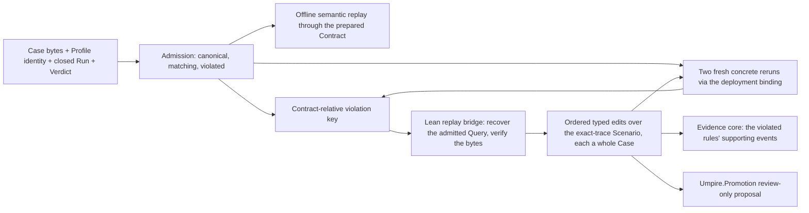
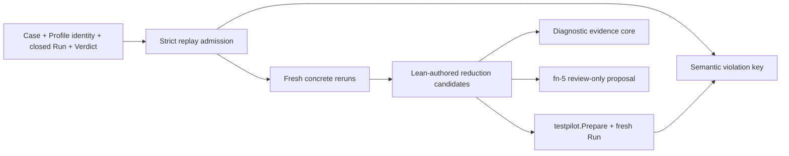

# Deterministic replay, semantic minimization, and reviewed promotion

## Re-plan on fn-85 and fn-33 (2026-09-22)

The first plan (2026-08-26; plan review 2026-09-04: MAJOR_RETHINK, its record under **History**)
was written against the fn-21 duplicate-observation negative control, a variation Space and a
persisted replay subject, all of which fn-86 deleted, and it conflated three things the rethink
asked to keep apart: the exact identity of a candidate Case, the Contract-relative equivalence of
two violations, and the offline semantic replay of a recorded Run. This plan is re-founded on what
the tree now has: Cases are produced by the `case` command from checked Queries under a feature
Realization (fn-85, fn-86), `umpire-run` and the fn-33 deployment binding run one Case against any
deployment, the fn-33 campaign hands out whole Cases and retains each counterexample's candidate
with its admission, and `Umpire.Promotion` compiles a review-only regression source from an
admitted Query and its planning anchor (fn-5, fn-33 .5).

The three points of the rethink, resolved:

- **Exact candidate identity is not violation equivalence.** A Case's identity is its canonical
  bytes' checksum, and a rerun of the same Case shares it. Two violations are *the same violation*
  by a Contract-relative key read in Definition IDs, never Case-local names: the violated rules
  and the terminal state each reached, and the evidence kinds of the step at which each rule
  reached it, never sequence numbers, times, activations, values, instruction ids or the
  accumulated support of every earlier step. A reduced candidate is a different Case with the same
  key, which is what makes a reduction sound; the key and the identity are two report fields and
  two Go types.
- **The negative Case is proved before any reduction.** fn-21's control is gone with the Space it
  varied; its successor is a labeled negative-control Model beside the caller Model that keeps the
  platform's real row authorized and adds one row the platform never takes, which the control
  Query selects and its Property names, produced through the caller Realization and proved
  violated twice against the test cluster, with its Verdict reproduced offline, before the reducer
  exists. If that Case cannot be produced without scenario-specific Go, or its Runs come back
  inconclusive rather than violated, the task stops and the boundary is revised, as the first plan
  already required.
- **Offline semantic replay and checked promotion stay explicit.** Semantic replay is the
  recorded Run re-evaluated through the same prepared Contract with no deployment, exposed on the
  Case Runtime facade; it is a type and a report field of its own beside the concrete reruns, and
  SDK history replay stays deferred. Promotion is `Umpire.Promotion.compilePromotionSource` from
  the admitted Query the Lean side recovers for the subject, review-only, written only where the
  caller names, never installed.

## Umpire4 Case Runtime reconciliation

This spec consumes the public `Case`, `PreparedCase`, `Run`, and `Verdict` contracts of fn-64 as
fn-87 tightened them, the deployment binding and bridge client of fn-33, and the `case`, `set` and
`query` commands of fn-85. It restores no `PortableTestPlan`, Run Evaluation, caller-closure
adapter, resident executor or public execution service, and it adds no Umpire artifact family.

## Intent

Turn one admitted violated Run of a produced Case into three separate answers: whether the same
Contract-relative violation recurs in fresh Runs of the same Case, which steps of the Case's path
are necessary for it, and which checked expected behavior should be proposed for review. Offline
semantic replay, concrete rerun and reduction remain distinct. Temporal SDK history replay is
deferred.

The first proof re-expresses the negative control as a Lean-produced Case under the caller
Realization: a control Model whose expected behavior the platform contradicts, so its Run is
violated deterministically and honestly, and says so in its name.

## Architecture

`tools/umpire/replay` is the Go orchestration: `Subject` admission and the violation key
(`subject.go`), the offline semantic replay through the facade, two-Run classification over
`tools/umpire/binding` (`rerun.go`), the bounded reducer over the Lean bridge (`minimize.go`), the
report (`report.go`). It admits exact public Case Runtime values, prepares and runs candidates
through the public facade, applies fixed bounds, and keeps transport details private. Lean owns
every semantic edit and compiles every candidate Case (`Temporal.Tool.ReplayBridge`,
`umpire-replay-bridge`, frames over stdin and stdout like the exploration bridge); Go never edits a
Case, Contract, Run or event stream.

**The subject** is one canonical Case (the bytes a `case` block registered as a fixture or the
exploration bridge handed out), the Profile identity it was prepared under (`DriverIdentity`:
Profile, catalog and environment-binding fingerprints, none secret), and one closed Run with its
Verdict. It is a value the command reads from two files and the deployment flags; no artifact
family, bundle, digest or trust store.

**Preparation without a deployment.** `binding.Campaign` gains `Prepare(ctx, identity, source)`:
the catalog, `DeriveProfile` and `testpilot.Prepare`, no SDK client and no Driver (`Open` creates
its gRPC client lazily and `Prepare` never uses it), returning the `PreparedCase` and its
`DriverIdentity`; `Bind` is built on it and `Bound` exposes the prepared Case. Admission prepares
the subject this way under the Profile the deployment flags derive: a `DriverIdentity` other than
the subject's is `stale`, decided before any Driver opens, and the prepared Case is what the
offline semantic replay evaluates.

**The Lean side recovers the admitted Query.** A produced Case carries no Query, so the bridge's
`admit` frame names the set and either the Query (a functional set's) or the exploration
candidate's target key (an exploratory set's, replanned deterministically by fn-33 .5's
guarantee); the bridge re-produces the Case under the set's realization and admits only when the
bytes are the subject's, byte for byte. A Case whose bytes no set of the Model produces is
`crossed`, before any target effect.

## Contracts

Three replay classes are explicit and reported apart:

- **semantic replay** re-evaluates the recorded Run through the same prepared Contract offline
  (`PreparedCase.Evaluate`, the facade export of the Case Runtime's own evaluator, over the
  prepared Case admission produced without a deployment) and must reproduce the same Verdict:
  status, each rule's status and terminal state, and the supporting sequences. It runs before any
  rerun and proves the Verdict is the Contract's reading of the events, not the Monitor's timing;
- **concrete rerun** prepares the same canonical Case under the exact Profile identity through
  `binding.Bind` and executes one fresh isolated Run;
- **SDK history replay** is diagnostic only and outside this spec: no type, no field.

**The violation key** is read in Definition IDs: every Case-local name (`rule_id`,
`terminal_state_id`, an observation id) is resolved through the Case's `provenance.local_names`
rows, because local names are the shortest unique dotted suffix among the Case's own Definition
IDs and a candidate with fewer steps can rename what survives. It binds the violated rules (by
Definition ID, sorted) each with the terminal state it reached and the *terminal step's evidence*:
the evidence kinds (by Definition ID, as a sorted set) carried by the event at which the rule's
status became violated, found by evaluating the Run's prefixes offline through
`PreparedCase.Evaluate` and taking the shortest prefix whose Verdict names the rule violated. It
does not read the Verdict's `supporting_event_sequences`, because the correlated monitor unions
every semantic step's support into every rule's support
(`internal/verification/correlated.go`, `release`), so that set grows with the path and would
call every reduced candidate a different violation. It excludes `contract_id`, `run_id`,
sequences, elapsed times, activation, attempt and instruction ids, values, source ids, cleanup and
diagnostics. A different violated rule set, terminal state or terminal-step evidence is a
different violation. The candidate's identity (its Case checksum) is recorded beside the key and
is never part of it.

**Reproduction** takes two fresh Runs of the subject's Case. The admissible violated form is a
Run whose disposition is `STOPPED_BY_MONITOR` (the evaluator stops at the first violation) or
`COMPLETED`, whose cleanup `SUCCEEDED`, and whose Verdict is `VIOLATED`. Both Runs in that form
with the subject's key: `reproduced`. Any `COMPLETED` `satisfied` Verdict or a violated Verdict
with another key: `not-reproduced`. An `INCOMPLETE` disposition, an unclosed cleanup or an
`inconclusive` Verdict: `indeterminate`. A preparation rejection is an admission failure before
any Run. fn-64 terminal precedence stays authoritative.

**Reduction** is over the admitted Query's exact-trace Scenario, keeping the Property fixed. Lean
enumerates one typed edit in a fixed order: `dropPrefixStep i` for each step before the target
row, last first (every Scenario ends on its target row and the Producer rejects a silent step at
the end of a path, so a silent step is a prefix step and no second edit names it). Each edit is
re-admitted through `Umpire.Command.checkAdmitted`; one the Model does not admit (the row is no
longer reachable) is `inapplicable`, recorded, no Case produced. An admitted edit is produced as a
whole Case under the same realization. The key makes the comparison sound: the violated rule is
the Property's clause on the target action, unchanged by the edit, so its Definition ID and
terminal state carry across candidates whatever the candidate's local names, and the terminal
step's evidence is the same step's; rules of dropped steps vanish and are not in the key. A
candidate is retained only after two fresh Runs reproduce the subject's key; the retained
candidate becomes the subject of the next edit; a rejected or non-reproducing edit is never
retried and a dropped step is never reintroduced. Reduction ends `minimized` when every remaining
edit is inapplicable or non-reproducing after at least one was retained, `irreducible` when none
was retained, or `incomplete` at a bound. An exploration counterexample is already a
shortest-prefix witness (EXP-05, fn-33), so its expected result is `irreducible` at once; a
functional Query authored with a longer Scenario is what reduces.

**The evidence core** is the subset of the recorded Run's events that the violated rules'
supporting sequences name, exactly as the Verdict records them. It references sequences; it
rewrites nothing. The correlated monitor puts every semantic step's support into every rule's
support, so no semantic step is outside the core; what is outside it are the Run's other
instruction events, the realization's own scaffolding (the handler worker's start, the polls that
lift no evidence), which support no rule. The negative control's Run carries such events, and the
core is proved to omit them, named by instruction id, while the same violated rule and terminal
state hold.

**Promotion.** Only a `minimized` or `irreducible` result compiles one proposal:
`Umpire.Promotion.compilePromotionSource` from the retained candidate's admitted Query, the anchor
read off its planning and fresh names keyed by the candidate's digest under the Model's family
(the fn-33 .5 shape, lifted from `Umpire.Exploration.Promotion` into `Umpire.Promotion.propose`
so both consumers share it). The proposal renders the Model's expected trace, never the observed
violating Run; it is review-only, written only under `--promotion-root` outside the model, and
never installed.

## Limits and failure behavior

Fixed for the first vertical slice: at most eight edits enumerated, twelve fresh Runs in all (two
for the subject, two per candidate, so at most five candidates run live; the edit cap bounds the
inapplicable ones), one active Run, 25 minutes wall time, the fn-33 caps on Case bytes,
Run Events and report bytes, and bounded progress output. Limits are checked before preparation or
dispatch. Cancellation stops new work and lets the active Run follow fn-64 abort, drain and cleanup
semantics; a Run lost to a stop is named, never synthesized.

Crossed identities (Case, Program, Run, Profile), a stale Profile identity, a noncanonical Case, an
incomplete or unclosed Run, a non-violated Verdict, a supporting sequence naming no event, or a
Case no set of the Model produces reject before any rerun. Target non-success is a Run outcome.
Monitor, cleanup or Driver failure follows fn-64 precedence and cannot turn an inconclusive attempt
into reproduction. A proposal or report write failure never installs anything and never reruns.

## Acceptance Criteria

- **R1:** Strict admission accepts one canonical Case, its exact Profile identity and one closed
  matching violated Run/Verdict; crossed, stale, incomplete, noncanonical, unsupported or
  non-violated inputs fail before target effects.
- **R2:** One stable Contract-relative violation key, read in Definition IDs, distinguishes
  semantic identity from per-Run transport identity and from the candidate's Case identity,
  binding the violated rules, their terminal states and their terminal steps' evidence kinds.
- **R3:** Two fresh isolated concrete reruns classify the subject `reproduced`, `not-reproduced` or
  `indeterminate`, and SDK history replay is no proof.
- **R4:** Lean owns a finite fixed-order set of typed edits over the admitted Query's exact-trace
  Scenario, re-admits each and compiles each admitted one as a whole Case; Go cannot edit
  semantics, and a retained reduction never reintroduces a dropped step.
- **R5:** Reduction retains a candidate only after two fresh Runs preserve the subject's key,
  distinguishes `minimized`, `irreducible` and `incomplete`, and never silently skips an
  applicable edit.
- **R6:** The negative control is one labeled Lean-produced Case under the caller Realization
  whose Model keeps the platform's real row authorized, proved violated twice against the test
  cluster with one key, its Verdict reproduced offline, and its evidence core omits the Run's
  scaffolding events, named by instruction id, without modifying the Run or Verdict.
- **R7:** Only a `minimized` or `irreducible` result compiles one checked, review-only proposal of
  the Model's expected behavior; the observed violating Run is never promoted or installed.
- **R8:** A bounded library-first controller and thin local command report admission, semantic
  replay, reproduction class, reduction completion, limits, cleanup, proposal status and tooling
  failure separately, with deterministic output and no secret-bearing diagnostics.
- **R9:** Semantic replay, concrete rerun and diagnostic history replay stay separate types and
  fields; history replay is deferred and affects nothing.
- **R10:** No artifact family, trust store, durable Run recovery, resident executor, public
  network service or compatibility reader is added; the retired replay-bundle vocabulary stays
  retired.

## Early proof point

Task .2, before any reducer or command work: produce the negative-control Case from a labeled
control Model under the caller Realization, run it twice against the test cluster through the
facade, and prove the same Contract-relative violation key and the same Verdict offline. Stop and
revise rather than add an adapter if the control cannot be expressed without scenario-specific Go,
or if its Runs come back inconclusive (an unauthorized transition or an observe failure) rather
than violated.

## Boundaries

No generic reducer language, concurrent campaign, durable resume, SDK history replay, automatic
regression installation, alternate Driver protocol, or change to fn-64 execution semantics. The
control Model enters no functional, canary or exploratory set of the caller Model and no
regression view. Existing comments are preserved where the invariant they describe stands.

## Requirement coverage

| Requirement | Tasks |
| --- | --- |
| R1, R2, R9 | `.1` |
| R6 | `.2`, `.8` |
| R3, R9 | `.3` |
| R4 | `.4` |
| R5 | `.5` |
| R7 | `.6` |
| R8, R10 | `.7`, `.8` |

## Decision Context

- **Why the key is Contract-relative and the identity is not in it (2026-09-22):** a reduced
  candidate is a different Case by construction, so an identity-bearing key could never call two
  violations the same; the Property's clause on the target action is what the edits keep fixed,
  so the violated rule and its terminal state are stable across candidates while the rules of
  dropped steps vanish.
- **Why the negative control is a Model, not a fault axis (2026-09-22):** fn-86 deleted the
  variation Space and its fault choices; a control Model whose step contradicts the platform is
  produced through the same commands and Realization as every other Case, is honest about being a
  control in its name and its documentation, and needs no Go.
- **Why the key reads the terminal step, not the Verdict's support (2026-09-22, plan review round
  one):** `correlated.go` unions every semantic step's support into every rule's support and
  `release` passes each event's ancestors along, so the Verdict's supporting sequences grow with
  the path; a key on them would call every reduced candidate a different violation, and every
  Case `irreducible`. Reading local names as Definition IDs is for the same reason: a candidate
  with fewer definitions can shorten or lengthen the suffix a surviving rule is named by.
- **Why the control's contradiction is a second row, not a replaced one (2026-09-22, plan review
  round one):** the monitor rejects a step that is no authorized row as an unauthorized transition,
  which is an observe failure and an inconclusive Run; a rule is violated only when the observed
  step is an authorized row whose response predicate fails. The control keeps the platform's real
  row and adds the row the Query selects.
- **Why semantic replay is a facade export (2026-09-22):** the Case Runtime evaluates a Run
  through a prepared Contract internally at the end of every Run; exposing that on
  `PreparedCase` is the smallest change that makes the offline class real instead of a report
  field that nothing computes.

## Plan review

Round one (2026-09-22, `flowctl claude plan-review`, opus at high): NEEDS_WORK with eleven
findings, all applied: the evidence core omits the Run's scaffolding events rather than a
semantic step, since the correlated monitor supports every rule with every step; the control keeps
the platform's real row authorized and adds the row its Query selects, with inconclusive Runs a
stop condition; the key is read in Definition IDs through `provenance.local_names` and on the
terminal step's evidence kinds, not on the Verdict's accumulated support or instruction ids;
`binding.Campaign.Prepare` prepares without a deployment so offline replay and `stale` are decided
in `.1`; the control's fixture goes through `umpire-gen-case-runtime-conformance` into
`tests/testcore/testpilot/testdata` and the module through `Temporal.Feature.Nexus`; every task
declares `Touches`, `.4` lists the exploration bridge and its gate, `.5` the campaign bridge
client; the command's exit codes name a rejected subject and a proposal write failure; the
`dropSilentStep` edit is gone; the admissible violated form is stated.

## History

2026-09-04 (first plan, MAJOR_RETHINK): written against the fn-21 duplicate-observation negative
control over a variation Space and a persisted replay subject. Its body is kept here as the
record of what it committed to.

Turn one admitted Case-native violation into three separate answers: whether the same semantic violation recurs in fresh Runs, which Producer-authored Program reductions are necessary for it, and which checked expected behavior should be proposed for review. Concrete rerun and semantic replay remain distinct. Temporal SDK history replay is deferred.

The first proof re-expresses the fn-21 duplicate-observation negative control as a Lean-produced generic Case after fn-64. The Case may use only the Case Runtime's public instruction and Contract vocabulary; no scenario-specific Go execution or verification code is allowed.

## Architecture

`tools/umpire/replay` is a deep orchestration module with a small `Open`, `Minimize`, and `Report` surface. It admits exact public Case Runtime values, prepares and runs candidates through the public facade, applies fixed bounds, and keeps transport details private. Lean owns every semantic reduction edit and compiles every candidate Case; Go never edits a Case, Contract, Run, or event stream.

The replay subject is a strict aggregate of canonical Case bytes, the exact non-secret Driver Profile/catalog identities used for preparation, and one closed Run/Verdict pair. It is not a new Umpire artifact family, durable Run-recovery record, audit digest, trust store, or compatibility bundle.

## Contracts

Three replay classes are explicit:

- semantic replay evaluates a recorded Run through the same prepared Contract and must reproduce the same decisive transition, terminal violation state, responsible Contract clause, and supporting Observation roles;
- concrete rerun prepares the same canonical Case against the exact Profile identity and executes a fresh isolated Run;
- Temporal SDK history replay is diagnostic only and is outside this spec.

The semantic violation key binds Case, Program, Contract, Profile/catalog, violated terminal state, responsible clause, and canonical supporting Observation roles. It excludes fresh Run/activation identities, target timestamps, paths, durations, cleanup transport details, and other per-attempt values. A different Case, Contract, Profile, terminal state, responsible clause, or support-role relation is a different violation.

Baseline reproducibility requires two fresh Runs. A decisive `violated` Verdict with the same semantic violation key is reproduced; a completed `satisfied` Verdict or different violation is not reproduced; incomplete execution or `inconclusive` evaluation is indeterminate. Preparation failure is an input/admission failure before Run creation. Fn-64 terminal precedence remains authoritative.

Reduction is monotonic and deterministic. Lean exposes a finite ordered list of applicable, typed edits over Producer-authored Program coordinates while keeping the Contract fixed. Each candidate is a complete canonical Case. Invalid or unpreparable candidates are recorded without target effects; a candidate is retained only after two fresh Runs reproduce the original semantic violation key. Reduction ends only after every remaining applicable edit has conclusively failed, or a bound makes the result incomplete.

The diagnostic `EvidenceCore` references supporting events already present in the original closed Run. It never rewrites the Run or Verdict. The first proof must include one labeled non-responsible Observation and prove that the core omits it while retaining the same violation proof.

Only `minimized` or `irreducible` completion may invoke fn-5 to emit one checked Lean source proposal. The proposal contains target-owned expected behavior, never the observed violating trace, is review-only, and is never installed automatically.

## Limits and failure behavior

The first vertical slice uses fixed limits: at most eight semantic edits, twelve fresh Runs, one active Run, 25 minutes wall time, bounded Case/event/report bytes, and bounded progress output. Limits are checked before preparation or dispatch where possible. Cancellation stops new work and lets the active Run follow fn-64 abort/drain/cleanup semantics.

Input drift, crossed identities, duplicate members, noncanonical values, stale Profile/catalog identity, or an original non-violated Verdict rejects before rerun. Target non-success remains a Run outcome. Monitor, cleanup, or Driver failure follows fn-64 precedence and cannot turn an inconclusive attempt into reproduction. Proposal or report publication failure never installs a regression and never causes an automatic rerun.

## Acceptance Criteria

- **R1:** Strict admission accepts one canonical Case, exact Profile/catalog identities, and one closed matching Run/Verdict violation; crossed, stale, incomplete, noncanonical, or non-violated inputs fail before target effects.
- **R2:** One stable semantic violation key distinguishes semantic identity from per-Run transport identity and binds the exact Case, Contract violation, responsible clause, and supporting Observation roles.
- **R3:** Two fresh isolated concrete reruns classify the subject as `reproduced`, `not-reproduced`, or `indeterminate` without treating SDK history replay as semantic proof.
- **R4:** Lean owns a finite fixed-order set of typed Producer-authored Program reductions and compiles each complete candidate Case; Go cannot edit semantics, and accepted reductions never reintroduce removed coordinates.
- **R5:** Reduction retains a candidate only after two fresh Runs preserve the original semantic violation key, distinguishes `minimized`, `irreducible`, and bounded-incomplete results, and never silently skips an applicable edit.
- **R6:** The fn-21 negative control is recompiled as one generic Case Runtime Case and proves repeated reproduction plus an EvidenceCore that omits one labeled non-responsible Observation without modifying the recorded Run or Verdict.
- **R7:** Only a complete minimized or irreducible result can emit one fn-5 checked, review-only Lean regression proposal for correct target behavior; observed violating behavior is never promoted or installed.
- **R8:** A bounded library-first controller and thin local command report admission failure, reproduction class, reduction completion, limits, cleanup, proposal status, and tooling failure separately, with deterministic semantic output and no secret-bearing diagnostics.
- **R9:** Semantic replay, concrete rerun, and diagnostic history replay remain separate types and report fields; history replay is explicitly deferred and cannot affect reproduction or promotion.
- **R10:** The former persisted replay-bundle/audit-digest design is retired. This spec adds no Umpire artifact family, trust store, durable Run recovery, resident executor, public network service, or compatibility reader.

## Early proof point

Before reducer or CLI work, compile the fn-21 negative control into a generic Case, run it twice through `testpilot.Prepare`/`PreparedCase.Run`, and prove the same Case-native semantic violation key. If that cannot be expressed without scenario-specific Go behavior, stop and revise the Producer/Case boundary rather than adding an adapter.

## Boundaries

No generic reducer language, concurrent campaign, durable resume, SDK history replay, automatic regression installation, alternate Driver protocol, or change to fn-64 execution semantics. Existing comments are preserved when implementation later replaces retired vocabulary.
