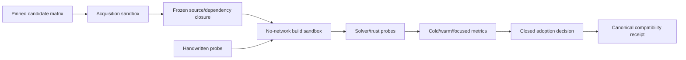

# Veil toolchain compatibility and adoption gate

> HTML render lens: local file `.flow/artifacts/fn-23-veil-toolchain-compatibility-and/spec.html` — regenerable, markdown is the record. <!-- flow-next:artifact-link -->

## Overview

Resolve the first mandatory C11 question without contaminating the primary model: can an unchanged pinned Veil revision and its exact dependency/tool chain build and run a handwritten probe under this repository's Lean 4.33.1 toolchain, behind an opt-in boundary, with acceptable deterministic cost and honest solver trust? The gate evaluates two closed upstream revisions in an isolated temporary copy and emits one canonical decision receipt. It does not add Veil to `model/lakefile.toml`, `lake-manifest.json`, default targets, regression checks, production code, or semantic claims.

The exact upstream candidates recorded on 2026-08-26 are tried in this order: `veil-2.0-preview` commit `2ccca695fe62d2e488da8725a747972c2f115a61`, then `main` commit `300c305e945750ab3fb62de4a79c23161b24da39`. Both currently declare Lean 4.28.0; compatibility is therefore an empirical gate, not an assumed adoption.

## Goal & Context

Model engineers need a reproducible answer before C11 can bind a Temporal property to Veil. Today the current model is dependency-free and pinned to Lean 4.33.1, while active Veil revisions and their solver/Loom dependencies target 4.28.0. Guessing that the version gap is harmless would expose every model developer to an unsupported dependency; silently abandoning Veil would leave the approved optional-checker direction unresolved.

The user runs one opt-in root command. It fetches only exact allowlisted revisions into a disposable directory, removes ambient credentials and authority, exercises one checked-in handwritten compatibility probe with the current toolchain, measures cold/warm/focused cost, and prints `adopt-optional`, `defer-incompatible`, or `inconclusive`. A completed incompatibility is a useful status-0 decision; infrastructure failure remains distinct.

## Architecture & Data Models



`tools/umpire/veilcompat` is one deep diagnostic module with a small `Run(ctx, Request) (Receipt, error)` surface. `Request` accepts only a temporary root and injected test clock/process seams internally; the production command has no revision, repository, executable, solver, timeout, threshold, output-path, or shell override. The candidate matrix, allowlisted URLs, commits, toolchain, supported reference-host profile, resource ceilings, probe digest, and decision thresholds are compile-time constants.

The checked-in probe is handwritten at `model/TemporalVeilCompatibility/Probe.lean`, outside the `Temporal` and `Umpire` library roots. It declares the smallest two-state transition system, one invariant, one establishing case, and one nearby failing mutation using only documented Veil surface. It contains no generated Umpire/Temporal semantics and makes no product claim. A fixed temporary Lake overlay imports that source and the candidate dependency inside a copied model tree; the committed primary Lake files remain byte-identical.

Acquisition and execution are separate. Acquisition permits network only to the frozen closure below, with no Git credential helper, SSH agent, user config, proxy credentials, or writable repository checkout. It records and verifies every Git commit, npm integrity value, archive SHA-256, host-tool version/digest, and system-library digest before any dependency build code runs, then closes network. It materializes a content-addressed Git/Lake source cache, npm cache, and pre-seeded upstream solver target/cache paths in a new read-only input tree. The unchanged Lake targets must consume only those staged inputs; any attempted URL open or cache miss is `closure-network-attempt`, not an invitation to widen authority.

Build/test runs in a separate no-network temporary directory with a filtered environment, current Lean 4.33.1, fixed aggregate and process-tree limits, no host source writes, and cleanup on every path. Only the reference profile `linux/aarch64` with user/mount/network namespace and cgroup-v2 enforcement is eligible for a conclusive matrix in this slice; its libc/runtime comes from the pinned rootfs below, never the host. Other OS/architecture/kernel-capability tuples return completed `inconclusive` before candidate evaluation. On the reference profile, a missing/mismatched required bundle or enforcement facility is infrastructure status 1; a fully staged unchanged dependency that fails for version/build/API/solver/resource reasons is candidate incompatibility.

### Frozen reference closure

- Both Veil candidates resolve the same 13-package Lake closure: Loom `d7fd586dbe9ddcc339f96ab79ee3583bb8cbc2c1`, lean-smt `5c14319297bfa8c56dfda2772d18d9710ef2322a`, lean-auto `1f8a3b2f31366ec7da2a160e634004c52be6631e`, mathlib `8f9d9cff6bd728b17a24e163c9402775d9e6a365`, plausible `55c8532eb21ec9f6d565d51d96b8ca50bd1fbef3`, LeanSearchClient `c5d5b8fe6e5158def25cd28eb94e4141ad97c843`, importGraph `85b59af46828c029a9168f2f9c35119bd0721e6e`, ProofWidgets4 `be3b2e63b1bbf496c478cef98b86972a37c1417d`, aesop `f642a64c76df8ba9cb53dba3b919425a0c2aeaf1`, Qq `b8f98e9087e02c8553945a2c5abf07cec8e798c3`, batteries `495c008c3e3f4fb4256ff5582ddb3abf3198026f`, Cli `4f10f47646cb7d5748d6f423f4a07f98f7bbcc9e`, and lean-cvc5 `ef0efbf437ae79124c65557c13aa5bfcee948f80`, each paired with its exact manifest repository URL.
- Both widget locks have SHA-256 `6eb1aeb1f71c497f0d15596763773bd4d01014b03a311b459ea537a19b10f0bc` and exactly 229 `resolved` npm tarballs. Every tarball URL and SRI `integrity` value in that pinned lock is an individual allowlist entry; acquisition populates an isolated npm cache and execution uses the official `node-v22.22.1-linux-arm64.tar.xz` bundle SHA-256 `0f3550d58d45e5d3cf7103d9e3f69937f09fe82fb5dd474c66a5d816fa58c9ee`, its bundled npm `10.9.4`, `--offline`, and that cache. A missing SRI, lifecycle network attempt, package-count drift, or lock rewrite is a closure failure.
- The Linux/aarch64 solver archives are Z3 4.15.4 `z3-4.15.4-arm64-glibc-2.34.zip` SHA-256 `9e832578e28d9ed51a79b97948728a874854a3c38ee49e7aae05e7d6e0e93508`, Loom cvc5 1.3.1 `cvc5-Linux-arm64-static.zip` SHA-256 `fe2b661834a82fd8830f7a757c340f0e20041fa41e19b038fa02ace0eaf1c6f2`, and lean-cvc5 1.3.2 `cvc5-Linux-arm64-static.zip` SHA-256 `48ba9a122c2f2b2b66c1670b4a0c957f3d92b0014a733d81bac840fd769041a4`. Acquisition pre-seeds the exact upstream output and trace locations; execution proves those targets are cache hits without changing their source.
- The Lean/native compiler input is one hermetic pair: official `lean-4.33.1-linux_aarch64.tar.zst` SHA-256 `f7353a8b2a8741c84558523e450556f9a1c45e3cafcf54399ce68c6a24c55f07` (Lean commit `819816b2e0a3bf405af45ae5c7af2491d8f5bee6`, Lake `5.0.0-src+819816b`) plus official `zig-aarch64-linux-0.16.0.tar.xz` SHA-256 `ea4b09bfb22ec6f6c6ceac57ab63efb6b46e17ab08d21f69f3a48b38e1534f17`. A checked-in constant wrapper named `clang` delegates Lake's unchanged invocation to that Zig bundle as `zig c++ -target aarch64-linux-gnu.2.34`; Zig supplies the compiler resource files, C/C++ headers, crt objects, libc/libc++, archive tools, and linker/sysroot. Its wrapper bytes/digest and both complete unpacked-tree Merkle identities are frozen in `reference_linux_aarch64.go`.
- The runtime is the pinned Ubuntu 26.04 Linux/arm64 OCI manifest `sha256:61b65dc6bddff5e68c552f22126fe77496395f956ff2e983e05d8a52efd63e55`, config `sha256:72e6e4985d829b000482de2a015b990fc0ac7a6d332ec6b9b5722a2724a10191`, and ordered layers `sha256:ed8299a102e92f64acbfa58a37767418df099675d441bc4b89ab8f7f17795b6f` then `sha256:50914c2b24a11b34d9332dbbf527f85d394298a976d84cf1e3a7b1e16205d29e`. Acquisition fetches by digest, verifies compressed digests and safe extraction, and records the merged read-only rootfs Merkle identity. This rootfs supplies the ELF interpreter and runtime `DT_NEEDED` libraries; no mutable image tag or host `/lib` participates.
- Execution chroots/mounts only the frozen runtime rootfs, Lean, Zig, Node/npm, candidate/cache, and temporary output trees. `/usr/include`, `/usr/local/include`, host compiler/library directories, ambient `clang|cc|ld|ar`, and all network namespaces are absent. An ELF preflight recursively resolves `PT_INTERP`/`DT_NEEDED` for every executable against only its owning bundle and the rootfs, while a compile/link/load fixture records `clang -###` and include-search output and rejects every compiler input or invoked subtool outside the Lean/Zig bundles. Git is acquisition-only. Solver archives are unpacked and copied by Go before execution, so upstream `unzip`/`cp` targets must be cache hits and those host tools are absent too. Any rootfs/bundle/wrapper/ELF/compiler-preflight mismatch is status-1 `host-tool`, never candidate evidence.

The terminal receipt is the command envelope `umpire-veil-compatibility/v1`, not a formal verification receipt or admitted artifact. Its exact field order is `{formatVersion,host,currentLeanToolchain,candidates,selectedCandidate,thresholds,decision,reasons,omissions,receiptIdentity}`. `host` is `{os,arch,kernelRelease,profileStatus}`; the first three values are printable strings of at most 64 bytes and `profileStatus` is `supported|unsupported`. `currentLeanToolchain` is `{version,commit,leanSha256,lakeSha256,clangVersion,clangSha256}` with lowercase 64-hex digests. Runtime libc identity belongs to the candidate's pinned rootfs closure, not the host record. `selectedCandidate` is a candidate name or null. `decision` is `adopt-optional|defer-incompatible|inconclusive`; `reasons` and `omissions` are sorted unique arrays of at most 32 closed diagnostic codes, each at most 64 ASCII bytes.

Candidates remain in declared order and each exact record is `{name,repository,commit,declaredLeanToolchain,closure,phases,thresholdResults,solverModes,status,diagnostics}`. `closure` is `{gitDependencies,npmPackages,archives,toolBundles,wrapperSha256,identity}`; all lists use the frozen order, every entry includes name/URL/version or commit plus required digest/integrity, `toolBundles` records the full Lean/Zig/Node archive and unpacked-tree identities, and `identity` covers the canonical closure excluding paths. `phases` is `{acquisition,coldBuild,warmBuild,focusedRuns,positiveProbe,mutationProbe}`. `focusedRuns` is always a three-element array. Every phase result is `{status,elapsedNanoseconds,cpuNanoseconds,peakRssBytes,filesystemBytes,fileCount,processCount,stdoutBytes,stderrBytes,resultCode,diagnostics}` where status is `passed|failed|not-run`, metric/result fields are unsigned integers or null when not-run, diagnostics are sorted closed codes, and elapsed/RSS/stream observations are maxima over the entire descendant process tree for that phase. Candidate `status` is `compatible|incompatible|not-run`.

`thresholdResults` contains one frozen-order record `{metric,phase,run,observed,limit,passed}` for every applicable measurement; `run` is null except focused run indexes 0..2. No average or collapsed focused value exists. The receipt `thresholds` object is exactly `{subprocessWallNanoseconds:600000000000,subprocessCpuNanoseconds:480000000000,totalWallNanoseconds:5400000000000,totalCpuNanoseconds:3600000000000,peakRssBytes:4294967296,processCount:512,filesystemBytes:17179869184,fileCount:250000,acquisitionBytes:8589934592,acquisitionFiles:100000,dependencyCount:64,downloadCount:2048,singleDownloadBytes:2147483648,stdoutBytes:16777216,stderrBytes:1048576}`. Limits are aggregate over the candidate temporary tree unless named `subprocess`; stream limits apply per child and are additionally bounded by the filesystem limit. Threshold equality passes; N+1 fails.

`receiptIdentity` is SHA-256 over canonical `{formatVersion,currentLeanToolchain,candidates,selectedCandidate,thresholds,decision,reasons,omissions}` after replacing host, all raw observed metrics, and every `elapsedNanoseconds|cpuNanoseconds|peakRssBytes|filesystemBytes|fileCount|processCount|stdoutBytes|stderrBytes` value with omission. It retains closure identities, phase statuses/result codes/diagnostics, threshold `{metric,phase,run,limit,passed}`, solver modes/trust, candidate status, selection, reasons, and omissions. The error envelope is exactly `{formatVersion:"umpire-veil-compatibility-error/v1",code,phase,candidate,messageDigest}`; `code` is one of `arguments|transport|closure-integrity|host-tool|sandbox|resource-enforcement|canceled|cleanup|invariant|reporting`, `phase` is a progress phase, `candidate` is a name or null, and `messageDigest` is lowercase 64-hex over sanitized bounded diagnostics.

Decision precedence is exact:

1. `adopt-optional` selects the first candidate that builds unchanged with Lean 4.33.1, passes both probe cases, records all exact dependencies, supports at least one named solver mode with honest trust classification, passes every threshold, and repeats the focused semantic result identically three times.
2. `defer-incompatible` requires complete acquisition and conclusive incompatibility for both candidates due only to version/build/API/solver/determinism/threshold codes.
3. `inconclusive` means the host/platform cannot establish a complete matrix despite valid tooling, such as an unsupported architecture; it never selects a revision.

## API Contracts

- The acquisition phase verifies the exact candidate commit before reading its manifest and rejects submodules, symlinks/path escapes, moving refs, undeclared downloads, mutable checksums, or dependency commits outside the frozen closure. No build executes until acquisition is complete.
- The execution phase uses the repository's current Lean toolchain regardless of each candidate's declared toolchain. It builds the dependency, the fixed probe, and the candidate's smallest relevant library/check target without changing upstream source. Compiler/API errors are recorded as incompatibility, never patched in place.
- Probe success requires the positive invariant to establish and the nearby mutation to produce the candidate's expected non-success/counterexample behavior. Matching output text alone is insufficient; the harness checks exit status, declared trust/solver mode, fixed semantic marker, and normalized result.
- Trust capabilities are closed: `kernel|reconstructed-solver|trusted-solver|testing`. The compatibility gate may report support but makes no established Temporal claim. Weak/trusted solver use is never relabeled kernel proof.
- Resource enforcement uses the exact receipt thresholds. Candidate-caused N+1 after a complete frozen acquisition is `resource-limit` incompatibility; static closure N+1 is `closure-limit` incompatibility; inability to install or read an enforcement control is status-1 `resource-enforcement`. Cancellation sends graceful termination, then kills/reaps after five seconds.
- Receipt stdout is exact canonical JSON plus one LF on statuses 0 and 2. Status 0 means a completed `adopt-optional` or `defer-incompatible` decision; status 2 means a completed `inconclusive` decision; status 1 means arguments, transport, acquisition integrity, host-tool, sandbox, cancellation, cleanup, invariant, or reporting failure and leaves stdout empty.
- Long-running observability is canonical NDJSON on stderr, at most 128 events and 512 bytes per event, excluded from receipt identity. Each event is exactly `{formatVersion:"umpire-veil-compatibility-progress/v1",sequence,phase,candidate,run,status}` with monotonically increasing sequence, candidate nullable, run null or 0..2, status `started|completed|failed`, and phase `host-check|acquisition|cold-build|warm-build|focused-run|positive-probe|mutation-probe|decision|cleanup|terminal`. Statuses 0/2 have only progress lines on stderr; status 1 has zero or more progress lines followed by exactly one terminal canonical error-envelope line.
- Repeating against the same frozen inputs may change timings/host data but must preserve receipt identity, decision, candidate compatibility codes, dependency closure, trust capabilities, and normalized probe results. A revision/manifest/tool download change requires an explicit plan update; the command never follows branch heads.
- The root Makefile exposes only `make umpire-check-veil-compatibility`. It is opt-in, performs no repository write, and is not called by `make umpire-build-model`, `make umpire-check-regression`, default Lake targets, CI, or production build paths.

## Edge Cases & Constraints

- Failure to fetch because of DNS, credentials, rate limits, or transient transport is status 1, not evidence of incompatibility. A fetched exact source that cannot compile unchanged under Lean 4.33.1 is conclusive incompatibility.
- Upstream manifests that name branches are accepted only when their checked-in manifest also supplies immutable resolved commits; any unresolved moving reference blocks that candidate.
- A solver unavailable after complete allowlisted acquisition is incompatibility. An unavailable sandbox/resource-control mechanism on the supported reference host is tooling failure; an unsupported host tuple is `inconclusive` before acquisition, never adoption.
- Raw compiler/solver logs stay in the temporary directory only until the diagnostic code/digest is computed, are bounded and sanitized, never enter stdout/receipt, and are deleted during cleanup.
- A candidate that builds but changes result/trust classification across three focused runs fails determinism. Threshold equality passes; N+1 fails.
- The compatibility probe never imports `Temporal`, changes `ExperimentSpec`, defines a production Property, or enters semantic catalogs. Base `Umpire` and `Temporal` builds are run before and after and must remain byte/import/dependency unchanged.
- Existing comments are preserved. No generated Veil source, dependency fork/patch, second permanent Lake project, server/runtime binary, remote checker service, or automatic dependency adoption is introduced.

## Quick commands

```bash
go test -count=1 ./tools/umpire/veilcompat/... ./tools/umpire/cmd/umpire-veil-compatibility/...
make umpire-check-veil-compatibility
cd model && mise exec -- lake build Umpire Temporal TemporalModelTests
make umpire-check-regression
```

## Acceptance Criteria

- **R1:** One closed candidate manifest pins the exact two upstream commits, 13 Git dependencies, 229-integrity npm lock, three native archives, Lean/Zig/Node bundles, OCI runtime manifest/config/layers, current/declared Lean toolchains, resource ceilings, thresholds, and priority order. Errors: moving/unknown refs, wrong commits, unresolved dependencies, unsafe paths/symlinks, undeclared downloads, duplicate candidates, cache miss, or mutable inputs stop before build.
- **R2:** One handwritten non-product Veil probe remains outside ordinary library roots and proves both a positive two-state invariant and a nearby expected failing mutation under a fixed temporary Lake overlay. Errors: generated source, Temporal/Umpire semantic copying, output-text-only success, missing mutation sensitivity, or any committed primary Lake change fails the gate.
- **R3:** Acquisition and execution are isolated: exact sources/tools are frozen before a no-network, filtered-authority, resource-bounded current-toolchain build; every process is canceled/reaped and every temporary file is cleaned. Errors: ambient credentials/config, network during build, host-source writes, unbounded output/resources, partial cleanup, or a child surviving cancellation is tooling failure.
- **R4:** The matrix records exact dependency revisions, build/probe statuses, normalized diagnostics, solver modes, and honest trust capabilities for both candidates without source patching or fallback. Errors: current-toolchain override missing, a result guessed from compiler text, silent candidate skip, trust-class collapse, or inconsistent repeated probe results prevents adoption.
- **R5:** Candidate-scoped cold, warm, three focused checks, descendant resources, and stream sizes are measured against the exact fixed thresholds; the exact precedence returns `adopt-optional`, `defer-incompatible`, or `inconclusive`. Errors: missing/applicability-ambiguous measurement, N+1 resource/cost, first-compatible priority drift, nondeterministic decision, or adoption without all gates fails closed.
- **R6:** One normative canonical bounded receipt/error/progress/status contract and opt-in root command make the compatibility decision inspectable and repeatable while host/raw metrics remain outside receipt identity. Errors: byte/identity ambiguity, path/log leakage, invalid stdout/stderr split, event overflow, existing target invocation, repository mutation, or implicit network/fetch from ordinary builds fails verification.
- **R7:** Focused fake-process/acquisition/sandbox/clock matrices, at least one status-0 or status-2 opt-in real run on the supported reference host, before/after model checks, developer documentation, and C11 roadmap status prove the gate resolves its decision without changing semantic or production surfaces. A status-1 real run is retained as error evidence but cannot complete the task. Errors: Veil in committed Lake/default/regression/CI/runtime paths, generated source, new semantic claim, prohibited legacy dependency/use, or missing explicit decision evidence blocks completion.

## Early proof point

Task `.1` freezes and validates the two-candidate acquisition closure without executing dependency code. Task `.2` proves the handwritten positive/mutation probe can be parsed and source-digested independently of Veil availability. If either proof fails, revise the compatibility harness/probe before adding process execution.

## Boundaries

- No committed Veil/Loom/solver dependency, primary Lake manifest change, optional checker library, or default import in this slice.
- No Temporal family binding, checker-view equivalence/refinement claim, verification receipt, canonical product counterexample, or promotion input.
- No source patch/fork, generated Veil, checker-neutral IR, server/runtime integration, remote service, CI/scheduled job, or release qualification.
- No model-local Makefile; only the repository-root Makefile may expose the opt-in gate.
- No compatibility alias or prohibited legacy dependency, inspection, invocation, artifact, or migration path.

## Decision Context

The official Veil README recommends a moving `main` dependency, but reproducible adoption requires immutable commits and the checked-in transitive manifest. The active candidates both declare Lean 4.28.0, so committing either dependency before a current-toolchain build would reverse the intended gate.

A disposable overlay lets the exact current primary project and handwritten source be tested without creating a permanent second project or breaking ordinary imports. Separating acquisition from no-network execution acknowledges that dependency builds can execute code while preventing ambient credentials or undeclared downloads from silently expanding authority.

`defer-incompatible` is a successful planning result: the subsequent C11 slice can still deliver Lean-native receipts and canonical counterexample replay while representing Veil as explicitly unsupported until a newly reviewed pinned revision passes this same gate.

## References

- Umpire component and DSL plans — optional family-owned Veil, one semantic authority, trust classes, and canonical replay requirements.
- Current `model/lean-toolchain` and dependency-free `model/lake-manifest.json`/`lakefile.toml`.
- Verse Lab Veil repository, README, `lean-toolchain`, Lakefile, and checked-in dependency manifest at the two pinned commits.
- Lean Lake reference and Lean FAQ — reproducible manifests and the authority implications of building dependencies.

## Requirement coverage

| Req | Description | Task(s) | Gap justification |
| --- | --- | --- | --- |
| R1 | Frozen candidate/acquisition contract | `.1`, `.3` | — |
| R2 | Handwritten positive/mutation probe | `.2`, `.4` | — |
| R3 | Bounded acquisition/execution isolation | `.1`, `.3`, `.5` | — |
| R4 | Complete toolchain/solver/trust matrix | `.3`, `.4` | — |
| R5 | Measurements and decision precedence | `.4`, `.5` | — |
| R6 | Canonical receipt/status/root UX | `.5`, `.6` | — |
| R7 | Integration guards and documentation | `.2`, `.6` | — |
