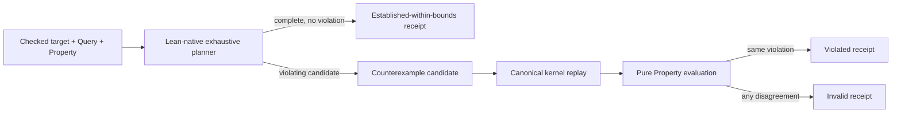

# Lean-native verification receipts and canonical replay

> HTML render lens (local): open `.flow/artifacts/fn-24-lean-native-verification-receipts-and/spec.html` — regenerable, markdown is the record. <!-- flow-next:artifact-link -->

## Umpire4 architecture reconciliation

The reusable module is `Umpire.Verify.Native`, not a generic `Umpire.Formal` authoring surface. Temporal declares model-owned verification profiles containing exact per-commit, nightly, and named checks with bounds, assumptions, trust, omissions, and semantic bindings. The thin public command is `umpire-check-model`; the per-commit profile is default, and `list`/`explain` expose profiles and named checks without letting the CLI assemble or broaden them.

Canonical counterexample replay includes the referenced checked Target, Behavior, Refinement where applicable, and Property. Verification receipts use fn-18's versioned artifact envelope and keep kernel proof, reconstructed proof, trusted solver, bounded search, testing, and concrete replay as distinct trust classes.

## Overview

Add the reusable C11 formal-checking seam that the current model lacks: a checked Lean-native Query can produce a canonical, provenance-rich verification receipt, and any selected violating trace must independently replay through the target's authoritative transition kernel and pure Property evaluator before the receipt may claim `violated`. The first public target is the existing Temporal Workflow–Nexus caller-closure target. Its normal verify Query produces a bounded establishment receipt; a family-owned nearby Property negative control produces a real canonical counterexample for replay tests without changing the production target.

This slice is deliberately independent of Veil. It provides the native receipt/replay authority that remains useful if fn-23 defers Veil and that a later optional family-owned Veil adapter must consume if fn-23 adopts it. It does not extend `ExperimentSpec`, interpret semantics in Go, promote regressions, or touch runtime/production paths.

## Goal & Context

The current reusable model already has checked targets, sound/complete finite kernels, checked verify/counterexample Queries, exhaustive planner outcomes, and pure Property evaluation. It can distinguish verified, violating witness, no-such-trace, budget exhaustion, unsatisfiable behavior, and invalid input, but those values have no formal receipt contract and a selected trace is not independently re-admitted before it is called a semantic counterexample.

Model engineers should be able to run one opt-in root command against a statically registered checked target and save canonical receipt JSON. The receipt must say exactly what was checked, within which bounds, with which completeness evidence and trust class. A counterexample remains only a candidate until the same Lean process proves its setup, initial state, every ordered step, behavior, and violated Property against the canonical checked query.

## Architecture & Data Models



`model/Umpire/Formal` is a reusable vertical module with public facade `Umpire.Formal`. It imports the existing Property, Query, and Planning facades and remains unaware of Temporal, Workflow, Nexus, Veil, execution evidence, and promotion. Its deep public surface is:

```lean
nativeCheck : (query : CheckedQuery law) → IncrementalPlannerKernel query.target →
  Except FormalError NativeCheckResult
replayCounterexample : CheckedQuery law → CounterexampleCandidate → ReplayResult
receiptOfNativeReplay : NativeCounterexample → ReplayResult →
  Except FormalError VerificationReceipt
canonicalVerificationReceiptJson : VerificationReceipt → String
```

Receipt/result constructors are private. Callers cannot provide outcome, trust, completeness, replay status, semantic digests, or receipt identity. `nativeCheck` calls the existing planner itself with the exact dependent `IncrementalPlannerKernel query.target`; it never accepts a free `PlannerRun`, so output from another Query/target/kernel cannot be crossed into a receipt. `NativeCheckResult` is privately constructed as either `.receipt` for a non-counterexample terminal outcome or `.counterexample` containing an opaque `NativeCounterexample` for a found violating candidate. That context retains the public candidate, request/evidence lineage, and claim-neutral `{explored,instrumentation}` diagnostics; callers receive only a candidate accessor and cannot alter those retained fields.

`replayCounterexample` accepts the exposed candidate but recomputes every semantic value from the supplied checked Query and target; it never trusts a backend verdict. `receiptOfNativeReplay` requires both the opaque native context and replay result, recomputes their candidate identity equality, and carries the retained diagnostics into the receipt. A replay result for a different or caller-manufactured candidate cannot be paired with the native context.

The public data vocabulary is:

- `FormalOutcome`: `established|violated|unknown|unsupported|invalid`.
- `FormalTrust`: `kernel|reconstructed-solver|trusted-solver|bounded-symbolic-search|testing|concrete-replay`. These values are not ordered and there is no generic upgrade/coercion function.
- `FormalClaim`: `established-within-bounds|violating-trace|null`.
- `CheckerKind`: `lean-native|external-lean`. A namespaced `checkerIdentity` distinguishes external family adapters without placing backend names in reusable Umpire. This slice constructs only `lean-native`.
- `ReplayStatus`: `matched|target-mismatch|query-mismatch|property-mismatch|kernel-mismatch|bounds-exceeded|setup-rejected|initial-rejected|step-rejected|behavior-rejected|property-satisfied|reason-mismatch|malformed`.

`CounterexampleCandidate` is exactly `{sourceChecker,targetIdentity,targetSemanticDigest,kernelIdentity,kernelContractDigest,queryIdentity,querySemanticDigest,propertyIdentity,propertySemanticDigest,bounds,setup,trace,selectionReason,candidateIdentity}`. Setup bindings are sorted by role/value; the trace retains exact initial state and ordered `{selectedAction,modelOutcome,resultingState,observations}` steps. `candidateIdentity` is `umpire-counterexample-candidate/v1:` plus SHA-256 of all preceding fields in that order. No backend-private state, string log, artifact identity, or `ExperimentSpec` is accepted.

Canonical replay proceeds in a fixed fail-fast order: validate shape and recompute candidate identity; compare target, kernel, query, Property, and bounds identities/digests; require the Query form to be verify/counterexample and the selection reason to be `violatingCounterexample`; admit the sorted setup through `target.resolvedSetups`; admit the initial state through `target.kernel.initialStates setup`; enforce transition and selected-action typed bounds; for each ordered step require the exact `TransitionResult` in `target.kernel.steps currentState selectedAction`; require `query.behavior.admits` the reconstructed `BehaviorTrace`; evaluate the Query's exact single checked Property through `evaluateProperty`; and accept only `satisfied = false`. Kernel list membership carries the existing initial/step soundness proofs; no second transition relation is defined.

`ReplayResult` retains the candidate, exact replay status, canonical `PropertyEvaluation` including clause IDs/results/spans/bounds/provenance when evaluation was reached, and `replayIdentity`. `replayIdentity` is `umpire-counterexample-replay/v1:` plus SHA-256 over canonical `{candidateIdentity,request,status,propertyEvaluation}` where `request` is the receipt request projection derived from the replaying Query, and `propertyEvaluation` is null before evaluation or the exact canonical evaluation afterward. Only a private matched constructor contains the admitted trace and false Property result required by `receiptOfNativeReplay`; changing a serialized status string cannot manufacture a violated receipt.

## Receipt Contract

The terminal envelope is `umpire-verification-receipt/v1` with exact field order `{formatVersion,request,checker,result,evidence,counterexample,diagnostics,omissions,receiptIdentity}`.

- `request` is `{targetIdentity,targetSemanticDigest,kernelIdentity,kernelContractDigest,queryIdentity,querySemanticDigest,propertyIdentity,propertySemanticDigest,view,bounds}`. `view` is exactly `{kind:"canonical-transition-kernel",identity,kernelContractDigest}` in this slice. Bounds reuse canonical typed Query bounds.
- `checker` is `{kind,checkerIdentity,implementationIdentity,toolchain}`. Native values are `lean-native`, `umpire.checker.lean-native`, `umpire-lean-native-planner/v1`, and the exact trimmed `model/lean-toolchain` value.
- `result` is `{outcome,claim,trust,reasons}`. Reasons are a sorted unique closed list: `complete-exhaustive|counterexample-replayed|search-budget-exhausted|behavior-unsatisfiable|planner-invalid|unsupported-query-form|missing-completeness|non-exhaustive-policy|candidate-stale|replay-disagreed|unexpected-planner-outcome`.
- `evidence` is a frozen-order array of `{kind,identity,digest,source}` in exactly target, kernel, Query, Property, role-domain, action-domain, candidate, replay order with inapplicable trailing entries absent. Target/kernel/Query/Property identity, digest, and source come from their existing checked values. Role-domain evidence is `{kind:"finite-role-domain",identity:query.id.value ++ ".completeness.role-domain",digest:completeness.roleDomainDigest,source:query.source}`; action-domain uses `finite-action-domain`, `.completeness.action-domain`, and `actionDomainDigest`. Candidate/replay identities and digests are their canonical identities and use Query source because the native adapter constructed them there. `source` is `{path,line,column,provenance}` and contains no host path.
- `counterexample` is null unless outcome is `violated`, otherwise `{candidateIdentity,trace,propertyEvaluation,replayStatus,replayIdentity}` with replay status necessarily `matched`. Property evaluation uses canonical clause order and exact typed spans/bounds/provenance.
- `diagnostics` is `{explored,instrumentation}` using the existing planner structures. It is inspectable but not claim-bearing.
- `omissions` is a sorted unique closed list. Native values begin with `deployment-qualification|external-checker|external-solver|liveness-beyond-bounds|promotion|runtime-evidence`; `search-incomplete` is added only for unknown budget exhaustion.

`receiptIdentity` is `umpire-verification-receipt/v1:` plus SHA-256 over canonical `{formatVersion,request,checker,result,evidence,counterexample,omissions}`. Diagnostics are excluded so planner instrumentation may improve without changing the checked claim. The whole stdout JSON remains deterministic for the same implementation and inputs; source paths are repository-relative and all arrays have the stated canonical order. Every semantic/source/toolchain mutation changes or invalidates the identity.

## Native Outcome Mapping

| Checked input/result | Receipt outcome | Claim | Trust | Required evidence |
| --- | --- | --- | --- | --- |
| verify + `.verified` + completeness established | established | established-within-bounds | bounded-symbolic-search | complete finite domains + target/kernel/query/property |
| counterexample + `.noSuchTraceWithinCompleteBounds` + completeness established | established | established-within-bounds | bounded-symbolic-search | same |
| verify/counterexample + `.found trace .violatingCounterexample` + matched replay | violated | violating-trace | concrete-replay | candidate + replay + false Property evaluation |
| `.budgetExhausted` | unknown | null | bounded-symbolic-search | bounds + explored counts; `search-incomplete` omission |
| `.unsatisfiable` | invalid | null | testing | `behavior-unsatisfiable` |
| `.invalid` or stale/crossed/malformed/replay disagreement | invalid | null | testing | normalized error/replay evidence |
| witness/select Query, non-exhaustive policy, or missing finite completeness | invalid | null | testing | exact rejection reason; planner is not run |

`kernel` trust is present for future proof-carrying adapters but is not claimed merely because code runs in Lean. The current exhaustive computation is honestly `bounded-symbolic-search`; an accepted concrete counterexample is honestly `concrete-replay`. `native_decide`, compiler success, or a receipt wrapper never upgrades either to `kernel`.

## Temporal Caller-Closure Binding

`Temporal.Feature.Nexus.CallerClosureFormal` is the first family adapter. It statically registers only `workflow-nexus.target.caller-closure` and calls `nativeCheck` with its existing `verifyQuery` plus the dependent specialization of `incrementalKernel`; the existing `verifyRun` remains comparison evidence, not caller-supplied lineage. The adapter binds the caller-closure Property, finite completeness evidence, target semantic digest, and kernel contract digest into the generic native receipt path.

The family also defines one explicitly non-production negative-control Property and Query beside the owning feature: it requires the existing canonical `nexus.observation.pending-cancellation-count` after force-close to be at most zero. It reuses the unchanged caller-closure target, exact-action Behavior, exhaustive bounds, and incremental kernel. The existing canonical force-close trace therefore becomes a planner-selected violating counterexample that replay admits and the pure evaluator rejects. It is available to tests only, is absent from catalog/projection/inspector/public CLI registration, and never changes the production caller-closure Property or target.

Mutation tests alter one coordinate at a time: target/query/Property/kernel digest, setup, initial state, selected action, outcome, resulting state, observation value/order, bound, selection reason, behavior constraint, and negative-control clause. Each either changes candidate identity and is rejected as stale/crossed, fails canonical kernel/behavior admission, or makes the Property satisfied; none can retain a matched replay or violated receipt.

## CLI and Status Contract

The current-model executable is:

```text
temporal-model-verify workflow-nexus.target.caller-closure
```

It is the narrow current equivalent of the roadmap's future umbrella `umpire verify <target>`. `Temporal.Tool.Verify` owns the static target registry and orchestration; reusable Umpire has no Temporal registry. The command accepts exactly one target identity, no query/property/checker/path/environment overrides, and emits exactly one canonical receipt plus LF on stdout after an admitted request. The negative control has no command identity.

- Status 0: canonical `established` receipt.
- Status 2: canonical `violated`, `unknown`, or `unsupported` receipt.
- Status 1 with receipt stdout: canonical semantic `invalid` receipt after request admission.
- Status 1 with guaranteed empty stdout: arguments, unknown target, registry invariant, or serialization failure before output. The full receipt is preconstructed and passed to one stdout write. An actual short/broken stdout write may have exposed an indeterminate prefix that cannot be retracted; it returns status 1 and appends exactly one canonical `umpire-verification-error/v1` stderr line. The error envelope is `{formatVersion,code,target,messageDigest}` with code `arguments|unknown-target|registry|serialization|write` and bounded sanitized fields.

The repository-root Makefile adds only `make umpire-verify TARGET=workflow-nexus.target.caller-closure`; `TARGET` is required and passed as the sole argument. The executable/target is opt-in and is not called by default Lake targets, `make umpire-build-model`, `make umpire-check-regression`, CI, runtime, or production binaries. All Make changes remain in the root Makefile.

## Edge Cases & Constraints

- A verified planner value without `metadata.completeness.established`, exact bounds, and the Query's finite evidence digests is invalid, never established.
- Complete absence of a counterexample establishes only the exact Property within the recorded finite bounds. No unbounded liveness or global Temporal correctness wording appears in receipt fields or docs.
- Replaying the candidate does not rerun the planner and does not accept an `ExperimentSpec`; it reconstructs only the exact `BehaviorTrace` needed by the checked Query.
- Unknown/stale identities fail before semantic replay. An authoritative kernel mismatch, behavior rejection, or now-satisfied Property is `replay-disagreed` invalid evidence, not a different counterexample.
- Empty traces are legal only when admitted by the Behavior and Property; the same setup/initial/bounds checks apply.
- Receipt/error JSON is hand-authored Lean serialization through existing canonical helpers, not deriving-order, filesystem metadata, or general-purpose map iteration.
- Existing comments are preserved. No generated Lean, Go semantics, remote checker, Veil import/dependency, checker-neutral IR, receipt decoder/migration, output file writer, runtime/server path, promotion admission, or release qualification is introduced.

## Quick commands

```bash
cd model && mise exec -- lake build Umpire UmpireTests Temporal TemporalModelTests temporal-model-verify
cd model && mise exec -- lake exe temporal-model-verify workflow-nexus.target.caller-closure
make umpire-verify TARGET=workflow-nexus.target.caller-closure
make umpire-check-regression
```

## Acceptance Criteria

- **R1:** One reusable domain-neutral `Umpire.Formal` API defines the closed request/candidate/replay/receipt/error/trust vocabulary, private construction gates, exact canonical JSON, and identity formulas without Temporal or backend semantics. Errors: caller-supplied outcome/trust/digests/identity, ambiguous ordering/nullability, unknown enum, duplicate evidence/reason/omission, or a mutation that preserves identity fails tests.
- **R2:** The native adapter admits only exhaustive finite verify/counterexample Queries and maps every `PlannerRun` outcome through the exact table with honest bounded-search/testing trust. Errors: missing/crossed completeness, non-exhaustive policy, witness/select, verified-without-completeness, unexpected selection reason, unsatisfiable/budget/invalid relabeled success, or `native_decide` relabeled kernel blocks a receipt claim.
- **R3:** Canonical replay validates identity lineage, typed bounds, setup, initial state, every exact ordered kernel step, Behavior, selection reason, and pure Property result before the private violated-receipt constructor is reachable. Errors: any stale/crossed/altered coordinate, property satisfaction, malformed candidate, or direct status forgery yields a non-matched replay and cannot claim violated or feed promotion.
- **R4:** The existing caller-closure verify Query emits one exact established-within-bounds native receipt; one family-owned test-only at-most-zero negative control over the unchanged target emits a planner candidate, matched canonical replay, and exact violated receipt. Errors: production Property/target drift, negative-control catalog/CLI exposure, second kernel/evaluator, or different public interfaces fail the family proof.
- **R5:** `temporal-model-verify` and the root-only `make umpire-verify TARGET=...` implement the exact target registry, stdout/stderr/status schema, deterministic canonical bytes, and no-write opt-in UX. Errors: optional arguments/overrides, unknown target ambiguity, partial/multiple output, path/log leakage, target graph contamination, repository write, or semantic logic in the tool layer fails verification.
- **R6:** Focused canonical fixtures, outcome/replay/mutation/anti-forgery matrices, aggregate Lean builds, import-direction guards, before/after ExperimentSpec fixture checks, developer/architecture/component documentation, and default-regression checks prove the seam is reusable and isolated. Errors: Temporal/Nexus vocabulary under `model/Umpire`, ExperimentSpec/schema/fixture drift, hand-edited fn-5 glossary/catalog projections, generated source, Veil/dependency/runtime/promotion/release coupling, prohibited legacy dependency/use, or missing C11 roadmap status blocks completion.
- **R7:** `Umpire.Verify.Native` and Temporal-owned checked profiles expose exact per-commit, nightly, and named verification checks with bounds, assumptions, omissions, provenance, semantic identities, and distinct trust classes. Errors: a caller/CLI-assembled check list, broadened profile bound, target/property/refinement mismatch, collapsed trust class, or an unprofiled receipt cannot establish or violate a claim.
- **R8:** `umpire-check-model`, `umpire-check-model --profile nightly`, `--check <name>`, `list`, and `explain <name>` are the sole public verification surface; this supersedes `temporal-model-verify` and target-selected command wording in R5. Errors: unknown profile/check, incompatible flag combination, CLI-invented semantics, noncanonical receipt, or a command claiming universal model correctness fails closed with no receipt.

## Early proof point

Task `.1` must show that a receipt cannot be constructed with caller-supplied outcome/trust/identity and that every identity-bearing mutation changes canonical identity. Task `.3` adds one narrowly scoped Temporal-owned test that sends the existing unchanged caller-closure force-close trace through the generic kernel API and reaches the expected `property-satisfied` terminal status before task `.4` adds the negative-control Property. Reusable Umpire never imports that test. If the generic implementation itself needs Temporal-specific pattern matching, revise its API before exposing a command.

## Boundaries

- No Veil dependency/import/declaration/binding/result; the fn-23-gated optional family adapter is a separate reviewed slice.
- No `ExperimentSpec`, DrivePlan, runtime/evidence/result artifact, replay-minimization, promotion, or qualification schema change.
- No generated checker source, Go semantic interpreter, backend-neutral transition IR, remote service, server/worker integration, CI/default target, or release gate.
- No model-local Makefile; only the repository-root Makefile exposes the opt-in command.
- No compatibility alias or prohibited legacy dependency, inspection, invocation, artifact, or migration path.

## Decision Context

Keeping native receipts separate from optional Veil prevents a toolchain decision from blocking the canonical formal seam. It also gives any future checker exactly one replay gate and receipt vocabulary instead of encouraging each adapter to invent its own semantic result.

The receipt calls the existing exhaustive planner `bounded-symbolic-search` rather than kernel proof because checked Lean implementation and finite completeness do not by themselves serialize a proof term of the Property theorem. Counterexamples use `concrete-replay` because the canonical kernel and evaluator re-admit one exact trace. A later family may add an explicit proof-carrying `kernel` adapter without weakening these names.

The negative control mutates only a test-owned Property expectation over the unchanged target. That yields an accepted real counterexample path while keeping production caller-closure semantics and the reusable replay engine unmodified.

## References

- `model/Umpire/Core.lean` — checked targets, semantic traces, and sound/complete transition kernels.
- `model/Umpire/Query/Language.lean` and `model/Umpire/Planning/Engine.lean` — checked intent, finite completeness, planner outcomes, and instrumentation.
- `model/Umpire/Property/Language.lean` — the pure checked Property evaluator used after replay.
- `model/Temporal/Feature/Nexus/CallerClosure.lean` — first target, query, completeness, and kernel binding.
- `UMPIRE4_DSL.md` and `UMPIRE4_COMPONENTS.md` — formal trust, canonical replay, package direction, and C11 boundaries.

## Requirement coverage

| Req | Description | Task(s) | Gap justification |
| --- | --- | --- | --- |
| R1 | Reusable receipt/replay vocabulary and identity | `.1`, `.3` | — |
| R2 | Honest native outcome mapping | `.2`, `.4` | — |
| R3 | Canonical counterexample replay gate | `.3`, `.4` | — |
| R4 | Caller-closure positive and negative paths | `.4`, `.6` | — |
| R5 | Opt-in command and root Make UX | `.5`, `.6` | — |
| R6 | Mutation, isolation, docs, and roadmap proof | `.1`–`.6` | — |
| R7 | Umpire.Verify.Native ownership | `.1`–`.6` | — |
| R8 | umpire-check-model profiles, list, and explain | `.4`, `.5`, `.6` | — |
