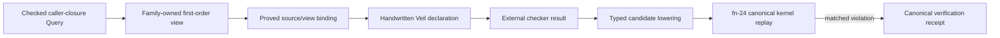

# Optional CallerClosure Veil binding and canonical replay

> HTML render lens (local): open `.flow/artifacts/fn-25-optional-callerclosure-veil-binding-and/spec.html` — regenerable, markdown is the record. <!-- flow-next:artifact-link -->

## Umpire4 architecture reconciliation

Generic opt-in invocation, result admission, trust, and binding support live under `Umpire.Verify.Veil`; the family-specific first-order view, handwritten declaration, correspondence, and checked binding live under `Temporal.Verify.Nexus.CallerClosure`. `Umpire.lean` remains unaware because it does not import the focused Verify subtree—not because reusable Umpire verification machinery is forbidden from depending on Veil behind an explicit import. The only aggregate is `TemporalVerify.lean`; ordinary Temporal facades, tests, tools, artifacts, and runtime paths remain isolated.

## Overview

Consume the completed fn-23 compatibility decision and take exactly one of two honest branches. If
the decision is `adopt-optional`, add one handwritten, family-owned Veil declaration for the existing
Workflow–Nexus caller-closure Property, prove its correspondence to an explicit first-order view,
and lower every external counterexample through fn-24's canonical Lean replay authority before any
violation receipt is emitted. If the decision is `defer-incompatible` or `inconclusive`, record the
exact decision in Flow and the component roadmap and add no Veil dependency, source, Lake target,
executable, Make target, or semantic claim.

This slice is a focused optional integration, not a second semantic language. The reusable
`model/Umpire` package remains unaware of Temporal, Nexus, and Veil; the primary Lake project remains
the only Lake project; and the Lean-native fn-24 verification command remains independently useful.

## Goal & Context

Fn-23 decides whether one exact pinned Veil revision is compatible with the repository's current
Lean toolchain and cost/trust policy. Fn-24 supplies the checker-neutral receipt vocabulary and the
authoritative replay gate. The remaining C11 question is whether a real model family can bind one
meaningful Property to the optional checker without generated source, a generic transition IR, or a
second definition of Temporal semantics.

The first binding is intentionally narrow: one transition of the existing caller-closure target,
the exact checked Property already owned by that feature, and the same typed Limits and semantic
digests used by its checked Query. Adoption is permitted only from an exact completed fn-23
`adopt-optional` receipt whose selected revision, toolchain, closure, solver mode, and trust remain
current at implementation time.

## Closed branch contract

Every task has one of two completion modes selected once by task `.1`; this is an implementation
decision, not a runtime flag:

| Mode | Required fn-23 decision | Repository result |
| --- | --- | --- |
| `adopt` | `adopt-optional`, selected candidate non-null, exact receipt admitted | Add the exact selected dependency, one family-owned binding, focused tests/tool, and a root opt-in Make target. |
| `defer` | `defer-incompatible` or `inconclusive`, exact receipt admitted | Add no Veil dependency/source/target/tool/Make surface. Close adopt-only tasks as not applicable with the exact receipt identity and prove the forbidden surfaces remain absent. |

An fn-23 status-1 infrastructure failure, missing receipt, stale toolchain/closure, malformed receipt,
unselected adoption result, or receipt identity mismatch selects neither mode and blocks fn25. Once
task `.1` records the mode, later tasks may not rerun the gate and switch branches. A future adoption
after defer requires a new reviewed spec and a new compatibility receipt.

The branch record retained in Flow task evidence is exactly
`{formatVersion:"umpire-veil-gate-binding/v2",decisionReceiptIdentity,decisionStableDigest,decision,selectedCandidate,
selectedCommit,closureIdentity,currentLeanToolchain,solverCapabilities,commandSolverMode,commandTrust,
mode}`. `decisionStableDigest` is the lowercase 64-hex SHA-256 recomputed from fn-23's exact normalized
receipt-identity preimage; it must equal fn-23's `receiptIdentity`. Host and all raw measurements
excluded by fn-23 are never retained or reintroduced. In adopt mode, `solverCapabilities` is the selected candidate's complete canonical fn-23
`solverModes` array, without filtering or reordering. The family command selects one entry by the
closed adapter-local precedence `kernel`, `reconstructed-solver`, `trusted-solver`, `testing`, then
lexicographically by the mode's canonical name within the first populated trust class. This is only
a deterministic command policy, not a reusable ordering or trust upgrade. `commandSolverMode` and
`commandTrust` are the selected entry's exact values. In defer mode, `solverCapabilities` is empty and
both command fields are null; all selected candidate fields are also null. The record is not a new
persisted product artifact. Adopt mode compiles the complete record into the family binding so its
identity changes when any gate coordinate or capability changes; defer mode checks in no model/source
surrogate for the record.

## Adopt-mode architecture



### Family-owned first-order view

`model/Temporal/Feature/Nexus/CallerClosure/FirstOrder.lean` owns the only checker view. It is not a
reusable Umpire DSL and is not imported by the ordinary `Temporal` facade. The finite view contains
only the semantic coordinates needed by the existing caller-closure Query:

- state: caller open/closed, cancellation delivery count, and cancellation owner;
- action: the existing force-close action;
- setup: the existing typed Workflow/Nexus roles used by the checked target;
- observation: the existing pending-cancellation count observed after the transition;
- Limits: exactly the checked Query's one-transition typed Limit and complete role/action domains.

The binding supplies total functions from each admitted canonical setup, initial state, action,
transition result, and Property evaluation into the view, plus proofs in both directions over the
closed finite domain:

1. canonical initial states correspond exactly to view initial states;
2. canonical admitted steps correspond exactly to view transitions;
3. the checked caller-closure Property is false exactly when the view invariant is false; and
4. every view counterexample decodes to one unique typed canonical candidate.

The binding records sorted `assumptions`, `exclusions`, and `unsupportedVocabulary`. For this first
slice, `unsupportedVocabulary` must be empty and the domain/Limits must equal the checked Query,
rather than silently projecting or widening it. Any many-to-one action/state mapping, extra checker
step, unproved reverse direction, or non-empty unsupported vocabulary prevents an established or
violated semantic result.

The identity does not attempt to serialize arbitrary Lean functions or proof objects by label. Each
mapping/relation coordinate is a `BindingCoordinateEvidence` record
`{kind,declaration,domainIdentity,codomainIdentity,rows,declarations}`. `kind` is one of
`setup-mapping|state-mapping|action-mapping|observation-mapping|initial-relation|step-relation|
property-relation|counterexample-decoding`; `rows` is the complete finite truth/function table ordered
by the canonical finite-domain enumerations and contains explicit canonical input/output values.
`declarations` is sorted by fully accepted name and each record is exactly
`{name,typeExprDigest,valueExprDigest,axioms}`. The expression digests use a closed structural encoding
of elaborated `Lean.Expr`: constructor tag, de-Bruijn index, fully accepted constant name and universe
arguments, literal value, binder info, and recursively encoded children; pretty printing, source
spans, object files, and declaration metadata are excluded. `axioms` is the sorted unique transitive
axiom-name inventory. The pinned Lean toolchain is part of the gate binding. A semantic-table change,
theorem statement/value change, axiom change, declaration rename, or finite enumeration change must
therefore change a coordinate digest. A proof refactor whose normalized theorem type/value, axiom
inventory, and complete finite table are identical intentionally preserves Behavior Fingerprint.

`viewDigest` is SHA-256 over canonical `{formatVersion:"umpire-caller-closure-first-order-view/v2",
setupDomain,stateDomain,actionDomain,observationDomain,initialRows,stepRows,propertyRows,Limits}`.
`bindingIdentity` is `umpire-caller-closure-first-order-binding/v2:` plus SHA-256 over canonical
`{targetIdentity,targetBehaviorFingerprint,kernelIdentity,kernelContractDigest,queryIdentity,
queryBehaviorFingerprint,propertyIdentity,propertyBehaviorFingerprint,viewIdentity,viewDigest,coordinates,Limits,
assumptions,exclusions,unsupportedVocabulary,gateBinding}`. Source positions are repository-relative;
all JSON field and array orders above are fixed.

### Optional Veil declaration and Lake boundary

`model/Temporal/Feature/Nexus/CallerClosure/Veil.lean` contains the handwritten Veil declaration and
the binding to `FirstOrder`. It imports the exact selected fn-23 revision through one pinned
`[[require]]` in `model/lakefile.toml`; `model/lake-manifest.json` must resolve that same commit and
frozen closure. No fork, patch, generated `.lean`, moving branch, second Lake project, or alternate
toolchain is allowed.

Only the focused roots import it:

- `model/Temporal/Feature/Nexus/CallerClosure/VeilTests.lean`;
- `model/TemporalVeilTests.lean`, a non-default aggregate root; and
- `model/Temporal/Tool/VerifyVeil.lean`, the opt-in executable root.

It must not enter `Temporal.lean`, `TemporalModelTests.lean`, `Umpire.lean`, `UmpireTests.lean`, or
`defaultTargets`. Ordinary model/regression builds therefore remain independent of the optional
dependency after the initial Lake dependency has been resolved.

### External result admission and canonical replay

Fn-24 may gain one narrow reusable constructor/factory under `Umpire.Formal` for admitting an
external Lean result. It accepts closed `CheckerKind.external-lean` metadata, exact checked request
lineage, a declared view/binding identity, bounded result, trust capability, and either no candidate
or a fully typed `CounterexampleCandidate`. It contains no Veil name, Temporal type, first-order
transition IR, backend parser, solver runner, source generator, or trust-upgrade function.

An established external result is admissible only when:

- the binding has complete bidirectional correspondence and empty unsupported vocabulary;
- checker Limits exactly equal the checked Query Limits;
- the checker reports a complete result for the exact gate-selected solver mode;
- its trust is no stronger than fn-23 advertised; and
- the reported evidence identities match the compiled gate and binding identities.

Trust is preserved, never upgraded. A gate capability of `reconstructed-solver` may issue an
established-within-Limits receipt with that trust. `trusted-solver` may issue the same bounded claim
with `trusted-solver` trust. `testing` or a concrete-only mode can exercise the adapter but returns
`unknown` and cannot establish the Property. Kernel trust is never inferred from Lean compilation.

Every external counterexample is decoded injectively through the family binding into fn-24's exact
`CounterexampleCandidate` shape, with source checker `external-lean`, the checked target/kernel/
Query/Property identities, the same setup and initial state, exactly one ordered force-close step,
its exact canonical outcome/resulting state/observations, and reason `violatingCounterexample`.
The external verdict itself cannot emit `violated`: only `replayCounterexample` followed by
`receiptOfNativeReplay` (or its generalized canonical-replay equivalent) can do so. Stale identity,
decode ambiguity, Limits disagreement, kernel disagreement, Behavior rejection, or a now-satisfied
Property is invalid/unknown evidence and never a violation.

Fn-24's exact native `umpire-verification-receipt/v2` bytes and evidence order remain unchanged.
External-view results use the reusable superset `umpire-verification-receipt/v3`, whose envelope is
the same ordered `{formatVersion,request,checker,result,evidence,counterexample,diagnostics,Known Gaps,
receiptIdentity}` and whose checker is `{kind:"external-lean",checkerIdentity:
"temporal.nexus.caller-closure.veil",implementationIdentity:<bindingIdentity>,toolchain:<exact current
toolchain>}`. V3 changes only the closed evidence vocabulary/order needed for an explicit view:
target, kernel, Query, Property, role-domain, action-domain, checker-view, checker-binding,
compatibility-gate, candidate, replay; inapplicable trailing candidate/replay entries are absent.

The three new evidence records are exact `{kind,identity,digest,source}` values. `checker-view` uses
the view Definition ID/Behavior Fingerprint and the `FirstOrder` declaration source. `checker-binding` uses the binding
identity, SHA-256 of the canonical binding-identity preimage, and the `FirstOrder` binding source.
`compatibility-gate` uses identity `umpire-veil-compatibility/v2:` plus the admitted fn-23 receipt
identity, digest `decisionStableDigest` from the frozen branch record, and source
`{path:".flow/specs/fn-23-veil-toolchain-compatibility-
and.md",line:1,column:1,provenance:"flow-reviewed-gate-contract"}`; raw captured receipt bytes and host
paths are not embedded. V3 `receiptIdentity` uses fn-24's formula with `formatVersion` set to v3 and
this exact expanded evidence array. This is a reusable receipt-version evolution, not a Veil-specific
semantic receipt; v2 readers reject v3 rather than partially decoding it.

The production declaration is the sole public binding. Tests additionally define one test-only
negative binding and handwritten invariant inside `VeilTests.lean` for fn-24's existing test-only
at-most-zero Property and checked Query. It has distinct Query/Property/view/binding/checker identities,
the same unchanged target/kernel and exact Limits, and its own bidirectional Property relation. It is
not imported by the production adapter, aggregate facade, catalog, Generated View, inspector, or CLI.
Its candidate may replay only against that negative Query; attempting to pair it with production
lineage is a required stale/crossed rejection.

## Focused command contract

Adopt mode adds:

```text
temporal-model-verify-veil workflow-nexus.target.caller-closure
make umpire-verify-veil TARGET=workflow-nexus.target.caller-closure
```

The executable accepts exactly one statically registered target and no query/property/revision/
solver/path/environment overrides. It emits the v3 receipt with fn-24's semantic status meanings:

- status 0: `established`;
- status 2: `violated`, `unknown`, or `unsupported`;
- status 1 with receipt stdout: admitted semantic `invalid`;
- status 1 with empty stdout: arguments, unknown target, registry, dependency, checker-process,
  resource-limit, invariant, serialization, or write failure before a complete receipt write.

The root Makefile is the only Makefile changed. The target is opt-in, requires `TARGET`, and is not
called by default Lake targets, `make umpire-build-model`, `make umpire-check-regression`, CI, runtime,
or production binaries. Defer mode exposes neither command and documents no unsupported placeholder.

Adopt-mode checker execution inherits fn-23's frozen dependency/toolchain identity and uses a ten
minute wall limit, 4 GiB descendant RSS limit, 512-process limit, and 16 MiB stdout/1 MiB stderr
limits. Limit equality passes; N+1 returns status 1 with no semantic claim. The status-1 error envelope
is exactly `{formatVersion:"umpire-verification-error/v3",code,phase,target,messageDigest}` with code
`arguments|unknown-target|registry|dependency|checker-process|resource-limit|invariant|serialization|
write`, phase `admit|dependency|check|decode|replay|receipt|write`, target nullable, and lowercase
64-hex digest over bounded sanitized diagnostic text.

Progress is canonical NDJSON on stderr, at most 64 events and 512 bytes per event, each exactly
`{formatVersion:"umpire-verification-progress/v2",sequence,phase,status}`. Sequence starts at zero and
increments by one; phase uses the error phase set; status is `started|completed|failed`; phases occur
in the listed order, skipped phases emit no event, and a started phase has exactly one later completed
or failed event. Statuses 0/2 and semantic-invalid status 1 have only progress lines on stderr and one
complete receipt line on stdout. Pre-receipt status 1 has empty stdout and zero or more progress lines
followed by exactly one terminal error-envelope line. A physical short/broken stdout write follows
fn-24's indeterminate-prefix rule and appends the one terminal write error. Progress and errors never
enter receipt identity. The command writes no repository files.

## Verification strategy

Focused adopt-mode tests prove:

- the handwritten invariant establishes for the exact caller-closure checked Query;
- the test-only negative binding/invariant for fn-24's existing at-most-zero Query produces a checker
  candidate that canonically replays only against that negative Query to the expected violated result;
- mutations to every gate/binding/request identity, setup, initial state, action, transition result,
  observation, Property, bound, solver trust, and candidate order fail closed;
- changing the family relation or reverse proof breaks elaboration or changes binding identity;
- no public external-result constructor can forge outcome, trust, completeness, or replay status;
- ordinary `Umpire`, `Temporal`, current model tests, native verify, inspect, and regression commands
  pass without importing optional modules; and
- source/import scans keep backend and Temporal/Nexus vocabulary out of `model/Umpire`.

Defer-mode verification proves the exact selected decision and the absence of the dependency,
manifest entry, optional source roots, executable, Lake target, root Make target, model docs, or
semantic receipt claim. Existing fn-24 native verification and default regression checks still pass.

## Quick commands

Adopt mode:

```bash
cd model && mise exec -- lake build TemporalVeilTests temporal-model-verify-veil
cd model && mise exec -- lake exe temporal-model-verify-veil workflow-nexus.target.caller-closure
make umpire-verify-veil TARGET=workflow-nexus.target.caller-closure
cd model && mise exec -- lake build Umpire UmpireTests Temporal TemporalModelTests temporal-model-verify
make umpire-check-regression
```

Defer mode:

```bash
make umpire-check-veil-compatibility
cd model && mise exec -- lake build Umpire UmpireTests Temporal TemporalModelTests temporal-model-verify
make umpire-check-regression
```

## Acceptance Criteria

- **R1:** Task `.1` admits one exact completed fn-23 receipt, checks identity/toolchain/closure/trust,
  and permanently selects adopt or defer for this implementation. Errors: status-1, missing/stale/
  malformed/crossed receipt, adoption without a selected candidate, or later branch switching blocks
  completion. Adopt mode retains every solver capability and applies the exact deterministic
  command-mode selection rule; it never invents a gate-selected mode.
- **R2:** In adopt mode, one family-owned explicit first-order view has total mappings, exact closed
  Limits, bidirectional initial/step/Property correspondence, injective counterexample decoding,
  empty unsupported vocabulary, and a canonical identity bound to fn-23/fn-24 lineage. Errors:
  Generated View, widening, ambiguous decoding, unproved reverse direction, or reusable/backend-neutral IR
  blocks a semantic claim. In defer mode, no view/binding source exists.
- **R3:** In adopt mode, exactly the selected immutable Veil revision and manifest closure enter the
  primary Lake project behind focused non-default imports, with one handwritten declaration and no
  generated source. Errors: moving/forked/patched revision, second project/toolchain, default import,
  semantic copy, or dependency drift fails. In defer mode, all dependency/source/target surfaces are
  absent.
- **R4:** External result admission preserves fn-23 trust, exact checker/view/request/Limits evidence,
  fn-24's semantic vocabulary, and the exact non-breaking v2-to-v3 receipt rule; only complete proved
  correspondence may establish. Errors: trust
  upgrade, caller-supplied claim, partial binding, crossed identity, stronger Limits, new semantic
  receipt, or backend knowledge in reusable Umpire fails.
- **R5:** Every adopted external counterexample injectively lowers into the canonical typed candidate
  and passes fn-24 kernel/Behavior/Property replay before `violated`; the distinct test-only negative
  Query/binding proves the path without crossing production lineage. Errors: backend verdict accepted
  directly, changed/extra/missing step, stale evidence,
  replay disagreement, or forged matched status cannot produce violation or promotion evidence.
- **R6:** Adopt mode exposes only the exact opt-in command/root Make target with bounded deterministic
  receipt/error/status behavior; defer mode exposes none. Both modes preserve ordinary builds, native
  verification, regression fixtures, import direction, comments, generated projections, and runtime/
  production isolation, and update the C11 roadmap with the exact outcome.
- **R7:** Adopt mode places generic optional mechanics only under `Umpire.Verify.Veil`, family correspondence only under `Temporal.Verify.Nexus.CallerClosure`, and the opt-in aggregate only in `TemporalVerify.lean`; defer mode creates none of them. Errors: Veil in `Umpire.lean`, `Temporal.lean`, ordinary model tests/tools, ExperimentSpec/runtime paths, or a family-specific view under reusable Umpire fails isolation.

## Early proof point

Before adding a dependency, task `.2` must encode the family view and demonstrate the two-way
relation against the existing checked target with plain Lean finite proofs. It must also bind
fn-24's distinct test-only negative Query and demonstrate that its Property is false on the unchanged
canonical force-close trace without admitting that trace against production lineage. If this requires
Temporal-specific case analysis inside reusable Umpire, a second transition relation, or a lossy
decode, stop and revise the family boundary before task `.3`.

## Boundaries

- No changes to `ExperimentSpec`, DrivePlan, runtime/evidence/result artifacts, exploration,
  promotion, local execution, remote execution, Claim Assessment, CI defaults, or production binaries.
- No generated checker source, generic first-order/transition IR, second semantic evaluator, remote
  checker service, general plugin registry, additional family/property, or blanket Veil adoption.
- No backend, Temporal, Workflow, or Nexus vocabulary in reusable `model/Umpire`; no Nexus types in
  external checker factories.
- No compatibility aliases, model-local Makefile, automatic dependency fallback, unsupported stub
  command, or prohibited legacy dependency, inspection, invocation, artifact, or migration path.
- Existing comments are preserved.

## Decision Context

The family-owned first-order view is the smallest honest seam: it gives the optional checker a finite
language it can consume while keeping canonical transition and Property meaning in the existing Lean
target. Bidirectional correspondence and canonical replay prevent the view from becoming a second
authority.

The strict defer branch is equally important. Toolchain incompatibility or an inconclusive supported
gate is evidence, not a reason to check in an empty adapter, conditional import maze, or command that
can never establish a claim. The native fn-24 path remains the stable C11 baseline in either mode.

## Key files

- `.flow/specs/fn-23-veil-toolchain-compatibility-and.md`
- `.flow/specs/fn-24-lean-native-verification-receipts-and.md`
- `.plans/UMPIRE4_COMPONENTS.md`
- `.plans/UMPIRE4_DSL.md`
- `model/Temporal/Feature/Nexus/CallerClosure.lean`
- `model/Umpire/Core.lean`
- `model/Umpire/Property/Language.lean`
- `model/Umpire/Query/Language.lean`
- `model/Umpire/Planning/Engine.lean`
- `model/lakefile.toml`

## References

- `.flow/specs/fn-23-veil-toolchain-compatibility-and.md` — exact adoption decision and closure.
- `.flow/specs/fn-24-lean-native-verification-receipts-and.md` — canonical receipt/replay authority.
- `model/Temporal/Feature/Nexus/CallerClosure.lean` — owning target, Query, Property, and kernel.
- `model/Umpire/Formal.lean` — reusable formal-checking facade after fn-24.
- `model/lakefile.toml` — single primary Lake project and default-target boundary.
- `.plans/UMPIRE4_DSL.md` and `.plans/UMPIRE4_COMPONENTS.md` — optional-checker and C11 direction.

## Requirement coverage

| Req | Description | Task(s) | Gap justification |
| --- | --- | --- | --- |
| R1 | Exact gate receipt admission and closed branch | `.1`, `.6` | — |
| R2 | Family-owned first-order view and proof binding | `.2`, `.5` | — |
| R3 | Exact optional dependency and handwritten declaration | `.3`, `.5`, `.6` | — |
| R4 | Honest external result/receipt admission | `.3`, `.4`, `.5` | — |
| R5 | Typed counterexample lowering and canonical replay | `.4`, `.5` | — |
| R6 | Focused UX, isolation, verification, and roadmap outcome | `.5`, `.6` | — |
| R7 | Verify.Veil, Temporal.Verify, and opt-in aggregate | `.2`–`.6` | — |
