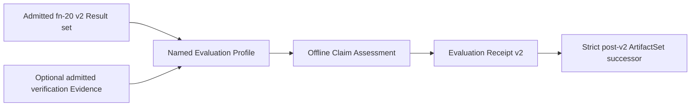

# Local Evaluation Receipts and staged Claim Assessment

> HTML render lens (local): open `.flow/artifacts/fn-26-local-qualification-receipts-and-staged/spec.html` — regenerable, markdown is the record. <!-- flow-next:artifact-link -->

## Intent

Define the reusable Evaluation Profile and Evaluation Receipt contracts needed for a later, explicit local Claim Assessment step. Claim Assessment consumes an admitted v2 Result plus optional admitted verification Evidence; it does not execute an environment, reinterpret Raw Evidence, reevaluate Properties, or acquire authority.

The local profile may state that verification Evidence is absent. That absence remains a Known Gap and can never be treated as proof. The contract preserves Execution, Observation Evaluation, Implementation Link, Property, cleanup, verification, trust, and Claim Assessment outcomes independently.

## Architecture



`Umpire.Evaluation` is a Temporal-free deep module containing inert checked Evaluation Profiles, Claim Assessment values, Evaluation Receipts, Limits, Known Gaps, and canonical projections. The concrete `local-ephemeral` profile lives in a Temporal-owned leaf and binds exact local runtime and Run Evaluation identities without copying their meaning.

`tools/umpire/evaluation` is transport and orchestration only. It admits exact typed v2 Artifacts, applies one compiled named profile through the fixed Lean authority, validates the returned Evaluation Receipt, and delegates immutable publication to the shared Artifact package. It never reads raw facts or invents a claim.

## API Contracts

- `EvaluationProfile/v2` has a closed environment, required-result, Evidence, cleanup, trust, Limit, Known Gap, and claim contract with one Behavior Fingerprint.
- The sole initial profile is `umpire.evaluation-profile.local-ephemeral`, version 2. It accepts only the exact local runner and Run Evaluation closure.
- `EvaluationReceipt/v2` binds the profile Behavior Fingerprint, source Result Artifact Checksum, relevant Artifact Checksums and model Behavior Fingerprints, independent statuses, Claim Assessment decision, claim strength, Limits, Known Gaps, Evidence Links, and cleanup.
- Claim Assessment decisions are `accepted|rejected|incomplete`; they do not replace the underlying operational or semantic statuses.
- The exact fn-20 six-member v2 set is the sole Result source. No pre-v2 reader, compatibility route, migration, or pilot evidence is accepted.
- A post-v2 ArtifactSet successor may add exactly one Evaluation Receipt and one typed receipt-to-Result relation while preserving all source members byte-for-byte.
- The local command accepts only the source set, output root, and fixed profile name; it has no execution, endpoint, credential, checker substitution, or policy-definition flag.

## Edge Cases & Constraints

- Missing optional verification Evidence is explicit and policy-evaluated; missing required Evidence yields incomplete, never accepted.
- A satisfied Property is not itself an accepted Claim Assessment. Cleanup, Known Gaps, trust, required Evidence, and exact profile bindings remain separate inputs.
- Stale profile fingerprint, crossed Result, Artifact Checksum drift, status collapse, missing Evidence Link, conflicting Known Gap, or Limit N+1 rejects before publication.
- Tooling failure returns no Evaluation Receipt. A valid rejected or incomplete assessment remains publishable and inspectable.
- Publication is deterministic, immutable, contained, lock-guarded, and never exposes a partial set.
- No CI, remote, staging, canary, production, release, automatic execution, pilot workflow, or generalized policy language is added.

## Quick commands

```bash
cd model && mise exec -- lake build Umpire.Evaluation.Tests Temporal.System.Evaluation.LocalTests temporal-evaluation-profile
mise exec -- go test -count=1 ./tools/umpire/artifact/... ./tools/umpire/evaluation/... ./tools/umpire/cmd/umpire-assess-local/...
mise exec -- make umpire-assess-local SET=/tmp/umpire-local-results/caller-closure OUTPUT_ROOT=/tmp/umpire-assessed
mise exec -- make umpire-check-local-run-evaluation SET=tools/umpire/temporal/nexus/testdata/caller-closure-run-set OUTPUT_ROOT=/tmp/umpire-local-results
```

## Acceptance Criteria

- **R1:** One Temporal-free `Umpire.Evaluation` module checks closed v2 Evaluation Profiles with stable Behavior Fingerprints, explicit Limits and Known Gaps, and no Temporal, endpoint, credential, path, or authority value.
- **R2:** Claim Assessment admits only the exact fn-20 v2 Result closure and optional admitted verification Evidence; it does not read Raw Evidence, map Model Facts, execute an environment, or reevaluate Properties.
- **R3:** The named local profile binds exact local runtime and Run Evaluation identities and accumulates every applicable reason deterministically. Errors: stale identity/fingerprint, unknown requirement, contradictory policy, missing required Evidence, or trust/status drift yields no accepted claim.
- **R4:** Accepted, rejected, and incomplete Claim Assessment decisions preserve operational, Observation Evaluation, Implementation Link, Property, cleanup, verification, and trust outcomes separately. Errors: status collapse, treating semantic satisfaction or omitted verification as proof, or silently dropping a Known Gap fails completion.
- **R5:** `EvaluationReceipt/v2` and its post-v2 ArtifactSet successor have exact canonical schemas, Artifact Checksums, reference closure, N/N+1 Limits, cross-language goldens, and strict rejection of every pre-v2 or incompatible version.
- **R6:** One bounded offline controller and exact local command validate before publication, expose no execution or substitution authority, and preserve immutable retry-safe publication and truthful reporting.
- **R7:** Independent mutation fixtures and focused/aggregate checks prove profile, Result, Evidence, status, Limit, Known Gap, checksum, fingerprint, receipt, relation, protocol, cancellation, and publication boundaries.
- **R8:** Documentation states the environment-scoped local claim, explicit verification Evidence status, retained exclusions, and the separation between Run Evaluation and Claim Assessment while preserving existing comments.

## Validation Strategy

Start with the pure v2 Evaluation Profile reason table and Behavior Fingerprint. Prove exact fn-20 v2 source admission before constructing a receipt. Cross-language codec and closure tests establish the Evaluation Receipt boundary, then the fixed sibling and CLI tests prove bounded offline orchestration and immutable publication.

## Task Mapping

| Requirement | Tasks | Status |
|---|---|---|
| R1 | `.1`, `.6` | — |
| R2 | `.2`, `.4` | — |
| R3 | `.1`, `.2`, `.4` | — |
| R4 | `.2`, `.4`, `.6` | — |
| R5 | `.3`, `.5`, `.6` | — |
| R6 | `.4`, `.5` | — |
| R7 | `.1`–`.6` | — |
| R8 | `.6` | — |
