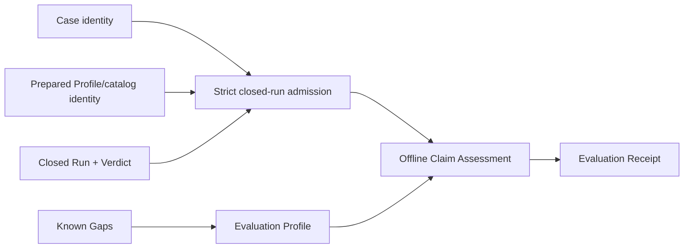

# Local qualification receipts and staged profile contract

## Umpire4 Case Runtime reconciliation

This spec performs offline Claim Assessment over fn-64 Case Runtime outputs. It binds claims to `Case`, preparation Profile/catalog identity, `Run`, and `Verdict`; it does not consume or recreate Run Evaluation Results.

## Intent

Define a reusable Evaluation Profile and immutable Evaluation Receipt for environment-scoped local qualification. Assessment attests to one already closed Run; it never prepares a Case, creates a Run, invokes a Host, reinterprets raw target data, or reevaluates a Contract.

## Architecture

`Umpire.Evaluation` is a Temporal-free deep module containing inert checked Evaluation Profiles, decisions, reasons, Limits, Known Gaps, and receipt projections. A Temporal-owned leaf defines the sole initial `local-ephemeral` profile. `tools/umpire/evaluation` performs transport, exact admission, offline assessment, and immutable publication only.

## Contracts

The admitted subject contains canonical Case identity, Program/Contract identity, prepared Profile and descriptor-catalog identities, the live Host identity recorded by the Run, Run identity/disposition/events/cleanup outcome, and the matching Verdict including supporting events. Admission verifies exact closure before assessment. A stale or crossed value produces no receipt.

An Evaluation Profile describes the environment-scoped claim, required Run/Verdict dispositions, cleanup, verification evidence, trust, Limits, Known Gaps, and claim strength. It contains no endpoint, credential, path, execution authority, Temporal API, or caller-defined code.

Claim Assessment decisions are `accepted`, `rejected`, or `incomplete`. They do not replace Run disposition, Verdict status, cleanup, Host identity, or verification status. A satisfied Verdict is necessary but not sufficient for acceptance; missing required evidence, unresolved Known Gaps, cleanup uncertainty, or trust uncertainty remain explicit.

Several named Evaluation Profiles may assess the same closed Run independently. The same canonical subject and same Profile produce the same receipt identity and byte-identical publication; a different Profile produces a different receipt and never mutates the prior one. No assessment path reruns the Case. Publication retry is safe only for byte-identical content.

The receipt binds the Evaluation Profile identity, Case/Program/Contract identities, preparation Profile/catalog identities, recorded live Host identity, Run identity and disposition, Verdict and supporting events, cleanup, independent assessment reasons, Limits, Known Gaps, and evidence links. It contains no credentials or raw payloads and is not self-authenticating.

## Failure behavior

Malformed, noncanonical, stale, crossed, duplicate, oversized, or open Run/Verdict inputs reject before assessment. Valid negative or incomplete assessments remain publishable. Tooling, cancellation, codec, or publication failure yields no new receipt; retrying assessment or publication does not create a Run. If immutable publication succeeded but reporting failed, the result reports publication ambiguity and forbids automatic rerun.

## Acceptance Criteria

- **R1:** One Temporal-free Evaluation Profile contract expresses environment-scoped claim, required Case Runtime outcomes, evidence, cleanup, trust, Limits, Known Gaps, and stable identity without environment credentials or execution authority.
- **R2:** Claim Assessment admits only an exact closed Case/Profile/catalog/Host/Run/Verdict closure and never prepares, executes, reads raw target data, or reevaluates the Contract.
- **R3:** The fixed `local-ephemeral` profile binds the exact local Host and preparation identities and accumulates all applicable reasons deterministically; stale identity, unknown requirement, contradictory policy, or missing required evidence cannot be accepted.
- **R4:** Accepted, rejected, and incomplete decisions preserve Run disposition, Verdict, cleanup, verification, trust, and Known Gaps as independent fields and never treat satisfaction or absent verification as proof.
- **R5:** Evaluation Receipt and publication closure have exact canonical identities, bounded fields, reference closure, N/N+1 limits, cross-language goldens, and strict rejection of incompatible versions without modifying source Case Runtime values.
- **R6:** One bounded offline controller and thin local command expose no Host, execution, endpoint, credential, arbitrary checker, or policy-definition authority and publish atomically, immutably, and retry-safely.
- **R7:** Mutation, multiplicity, idempotency, cancellation, and publication tests prove every Case/Profile/catalog/Host/Run/Verdict/evidence/status/Limit/Known-Gap binding and show that multiple Profiles never conflict or cause rerun.
- **R8:** Documentation states the exact environment-scoped claim, lack of self-authentication, optional or required evidence, retained exclusions, and separation between Case Runtime verification and offline Claim Assessment while preserving existing comments.

## Early proof point

Admit one fn-64 async Nexus-success Case with its exact local preparation identity and closed Run/Verdict, then deterministically produce the same receipt twice without constructing a Host or Run. Reject one crossed Profile and one crossed Verdict before codec and CLI work.

## Boundaries

No CI, remote, staging, canary, production, release authorization, automatic execution, raw-event interpretation, second Contract evaluator, generic policy language, or compatibility route.

## Requirement coverage

| Requirement | Tasks |
| --- | --- |
| R1, R3 | `.1` |
| R2, R4 | `.2`, `.4` |
| R5 | `.3`, `.5`, `.6` |
| R6 | `.4`, `.5` |
| R7 | `.1`–`.6` |
| R8 | `.6` |
