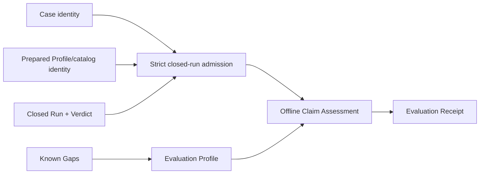

# Local qualification receipts and staged profile contract

## Re-plan on fn-85 and fn-22 (2026-09-23)

The first plan (SHIP, 2026-08-26) was written before the Case Runtime settled and before fn-22
delivered a recorded Run. It named paths that no longer exist (`api/umpire/**`,
`tools/umpire/artifact/**`, `Temporal.System.Evaluation`) and an admission that re-derived the
preparation identity. This re-plan keeps its intent, requirements and boundaries and grounds every
contract in what the tree now has:

- **The subject is fn-22's.** A qualification subject is a canonical Case (the form
  `tools/umpire/internal/casefile` decides) and a recorded Run (`replay.RecordedRun`: the Run with
  its Verdict and the `DriverIdentity` it was prepared under, as `umpire-run --record` and
  `umpire-fuzz --record-root` write it). Admission reads both strictly and never prepares, runs or
  replays. The Case must be format version 1.0. The Run must be the Case's: its `case_id` and
  `program_id` are the Case's, and the set of rule IDs its Verdict names equals the Contract's
  rules -- `contract.rules` and `contract.correlated.rules` together, as the evaluator reports them
  -- each exactly once, whatever its status (a Run carries no Contract ID; the receipt takes the
  Contract ID from the Case). It
  must be closed: a terminal disposition, a cleanup outcome, a Verdict. It must be consistent:
  every supporting sequence names one event once, no rule of the closed Verdict is still `PENDING`
  (the evaluator settles every obligation at close), and the Verdict's status agrees with its rules
  and the disposition as the protocol defines it (violated when any rule is violated, and then the
  disposition is `STOPPED_BY_MONITOR`; satisfied only when every rule is satisfied on a `COMPLETED`
  Run). The recorded catalog fingerprint must be the tree's static catalog's
  (`NewWorkflowServiceCatalog().Identity()`, which reads no Case): admission alone decides
  staleness. The recorded Profile name and bindings fingerprint are bound into the receipt as
  recorded. What replay admission and qualification admission share -- the recorded-Run codec,
  reading the canonical Case, the Case and Program crossing, the supporting sequences -- moves to a
  leaf package, `tools/umpire/internal/recordedrun`, that both import (replay keeps its names as
  aliases), so qualification never imports the package that holds the replay bridge and the
  rerun environment. The caps are named constants: a Case of at most 4 MiB, a recorded Run of at
  most 16 MiB (the bridge frame cap) and 65,536 events, a receipt of at most 1 MiB. These
  constants are the only enforcement: the command reads each input through a reader capped one
  byte past its cap, so an oversized input is refused before it is held in memory, and the receipt
  records the caps it was admitted under.
- **Evidence and verification are the recorded Verdict's.** *Verification* is the recorded Verdict
  status; it is never re-derived. *Evidence* is each rule's supporting sequences: a rule the
  Verdict names at a terminal state with no supporting sequence is unsupported. A Profile may
  require support; an unsupported rule then keeps the decision below `accepted`. The receipt
  carries each rule's supporting sequences as its evidence links, never an event body.
- **Lean owns the Evaluation Profile, Go assesses.** `Umpire.Evaluation` (Temporal-free) declares a
  checked Evaluation Profile as data: the claim, the trust basis, the Known Gap kinds that block
  acceptance, and an ordered reason table whose reasons each name one status-specific condition
  from a closed set -- `verdict-violated`, `verdict-inconclusive`, `disposition-stopped`,
  `disposition-incomplete`, `cleanup-unclosed`, `known-gap-blocking`, `unsupported-rule` -- and the
  decision it forces, `rejected` or `incomplete`. A subject for which no reason holds is accepted.
  It carries no catalog, endpoint, credential, path or execution authority. `Temporal.Evaluation.Local` declares the one
  `local-ephemeral` Profile, whose table is, in precedence order: `verdict-violated` and
  `disposition-stopped` reject (a violated claim is a failed claim); `verdict-inconclusive`,
  `disposition-incomplete`, `cleanup-unclosed`, `known-gap-blocking` (every
  `capability` and `interpretation` gap) and `unsupported-rule` leave it `incomplete` (absent
  verification is never proof, and never a failure either). A non-default `umpire-evaluation-profiles` executable renders every
  declared Profile to canonical JSON under `tools/umpire/evaluation/testdata/profiles/`, checked by
  a Makefile gate that `umpire-check-regression` runs; the Profile's identity is the SHA-256 of
  those bytes. `tools/umpire/evaluation`
  embeds that directory (`//go:embed`) and selects a Profile only by its exact name, so a Profile is
  never a path. A test-only second Profile lives in the Go tests, never in Lean or the embedded set.
- **Assessment decides before anything is rendered.** `Assess(subject, profile) Decision` is pure:
  the decision, every reason that holds in the table's order, and the fields it read. The receipt
  renders a Decision.
- **The receipt is Go's canonical JSON.** `tools/umpire/evaluation` renders the receipt in one
  fixed key order and pins it with goldens; its identity is the SHA-256 of its bytes. It binds the
  Profile name and identity, the Case identity (SHA-256 of the canonical Case) and its Case,
  Program and Contract IDs, the recorded `DriverIdentity`, the Run ID, disposition and cleanup, the
  Verdict with each rule's status, terminal state and supporting sequences, the decision and every
  reason, the trust basis and the admission caps the subject was admitted under, the Known Gaps by kind and
  code, and the receipt format version. It carries no raw payload, event body, credential, path or
  endpoint.
- **Publication is atomic, exclusive and idempotent.** `cli.Publish` writes the receipt to a
  temporary file in the target directory, syncs it, and hard-links it to
  `<root>/<receipt-identity>.json` (`os.Link` is atomic and fails if the name exists), then removes
  the temporary file. An existing name with identical bytes is `already-published`; one with other
  bytes is a conflict that is reported and never overwritten. A crash can leave only a temporary
  file, never a partial receipt under its final name. The name is the content's hash, so no lock is
  needed. No path reruns anything.
- **The command is `umpire-assess run`.** It takes `--case`, `--run`, `--profile <name>` (an exact
  name from the embedded set), `--receipt-root` and `--model-root` (default `model`, resolved like
  `umpire-replay`'s, so a receipt root under the model is refused), and exposes no Driver,
  deployment, endpoint, credential, checker or policy flag.

Tasks .1 to .6 are rewritten below on these contracts: .1 the Lean Profiles and their rendering,
.2 admission and the embedded Profiles, .3 assessment, .4 the receipt and its publication, .5 the
command, .6 the matrices, the live proof and the docs. The requirements R1–R8, the failure
behavior and the boundaries stand, R3's "exact local Driver" read as the recorded identity bound
into the receipt with a current catalog, and R4's "verification" as the recorded Verdict status.

## Umpire4 Case Runtime reconciliation

This spec performs offline Claim Assessment over fn-64 Case Runtime outputs. It binds claims to `Case`, preparation Profile/catalog identity, `Run`, and `Verdict`; it does not consume or recreate Run Evaluation Results.

## Intent

Define a reusable Evaluation Profile and immutable Evaluation Receipt for environment-scoped local qualification. Assessment attests to one already closed Run; it never prepares a Case, creates a Run, invokes a Driver, reinterprets raw target data, or reevaluates a Contract.

## Architecture

`Umpire.Evaluation` is a Temporal-free deep module containing inert checked Evaluation Profiles, decisions, reasons, Limits and Known Gap policy, rendered to canonical JSON. A Temporal-owned leaf (`Temporal.Evaluation.Local`) defines the sole initial `local-ephemeral` profile. `tools/umpire/evaluation` performs exact admission of fn-22's recorded subject, offline assessment against a rendered Profile, receipt rendering and immutable publication only.

## Contracts

The admitted subject contains canonical Case identity, Program/Contract identity, prepared Profile and descriptor-catalog identities, the live Driver identity recorded by the Run, Run identity/disposition/events/cleanup outcome, and the matching Verdict including supporting events. Admission verifies exact closure before assessment. A stale or crossed value produces no receipt.

An Evaluation Profile describes the environment-scoped claim, required Run/Verdict dispositions, cleanup, verification evidence, trust, Limits, Known Gaps, and claim strength. It contains no endpoint, credential, path, execution authority, Temporal API, or caller-defined code.

Claim Assessment decisions are `accepted`, `rejected`, or `incomplete`. They do not replace Run disposition, Verdict status, cleanup, Driver identity, or verification status. A satisfied Verdict is necessary but not sufficient for acceptance; missing required evidence, unresolved Known Gaps, cleanup uncertainty, or trust uncertainty remain explicit.

Several named Evaluation Profiles may assess the same closed Run independently. The same canonical subject and same Profile produce the same receipt identity and byte-identical publication; a different Profile produces a different receipt and never mutates the prior one. No assessment path reruns the Case. Publication retry is safe only for byte-identical content.

The receipt binds the Evaluation Profile identity, Case/Program/Contract identities, preparation Profile/catalog identities, recorded live Driver identity, Run identity and disposition, Verdict and supporting events, cleanup, independent assessment reasons, Limits, Known Gaps, and evidence links. It contains no credentials or raw payloads and is not self-authenticating.

## Failure behavior

Malformed, noncanonical, stale, crossed, duplicate, oversized, or open Run/Verdict inputs reject before assessment. Valid negative or incomplete assessments remain publishable. Tooling, cancellation, codec, or publication failure yields no new receipt; retrying assessment or publication does not create a Run. If immutable publication succeeded but reporting failed, the result reports publication ambiguity and forbids automatic rerun.

## Acceptance Criteria

- **R1:** One Temporal-free Evaluation Profile contract expresses environment-scoped claim, required Case Runtime outcomes, evidence, cleanup, trust, Limits, Known Gaps, and stable identity without environment credentials or execution authority.
- **R2:** Claim Assessment admits only an exact closed Case/Profile/catalog/Driver/Run/Verdict closure and never prepares, executes, reads raw target data, or reevaluates the Contract.
- **R3:** The fixed `local-ephemeral` profile binds the exact local Driver and preparation identities and accumulates all applicable reasons deterministically; stale identity, unknown requirement, contradictory policy, or missing required evidence cannot be accepted.
- **R4:** Accepted, rejected, and incomplete decisions preserve Run disposition, Verdict, cleanup, verification, trust, and Known Gaps as independent fields and never treat satisfaction or absent verification as proof.
- **R5:** Evaluation Receipt and publication closure have exact canonical identities, bounded fields, reference closure, N/N+1 limits, cross-language goldens, and strict rejection of incompatible versions without modifying source Case Runtime values.
- **R6:** One bounded offline controller and thin local command expose no Driver, execution, endpoint, credential, arbitrary checker, or policy-definition authority and publish atomically, immutably, and retry-safely.
- **R7:** Mutation, multiplicity, idempotency, cancellation, and publication tests prove every Case/Profile/catalog/Driver/Run/Verdict/evidence/status/Limit/Known-Gap binding and show that multiple Profiles never conflict or cause rerun.
- **R8:** Documentation states the exact environment-scoped claim, lack of self-authentication, optional or required evidence, retained exclusions, and separation between Case Runtime verification and offline Claim Assessment while preserving existing comments.

## Early proof point

Admit the caller Model's `asyncCompletion` Case with a Run recorded by `umpire-run --record` against the test cluster, and produce the same receipt twice, byte for byte, without constructing a Driver or Run; the negative control's recorded Run (`tools/umpire/replay/testdata`) is admitted and assessed `rejected` for its violated Verdict. Reject one crossed Case and one stale catalog before the codec and command work.

## Boundaries

No CI, remote, staging, canary, production, release authorization, automatic execution, raw-event interpretation, second Contract evaluator, generic policy language, or compatibility route.

## Requirement coverage

| Requirement | Tasks |
| --- | --- |
| R1 | `.1`, `.6` |
| R2 | `.2`, `.3` |
| R3 | `.1`, `.2`, `.3` |
| R4 | `.2`, `.3`, `.6` |
| R5 | `.4`, `.5`, `.6` |
| R6 | `.4`, `.5` |
| R7 | `.1`, `.3`, `.4`, `.5`, `.6` |
| R8 | `.6` |

## Plan review

Round one of the re-plan (`flowctl claude plan-review`, opus at high, 2026-09-23): NEEDS_WORK with
five P1 and three P2 findings, all applied. A Run carries no Contract ID, so Contract crossing is
the Verdict's rule IDs equalling the Contract's, each once; the catalog fingerprint is admission's
alone and leaves the Profile; publication is a synced temporary file hard-linked to its final name,
so a crash never leaves a partial receipt and no lock is needed; assessment returns a Decision in
.3 and .4 renders it, so the receipt's goldens come from `Assess`; the Profiles are embedded and
selected by exact name, and the command takes `--model-root` like `umpire-replay`; evidence is
each rule's supporting sequences and verification the recorded Verdict status, a Profile may
require support; admission checks the Verdict's aggregation against its rules and disposition;
the caps are named constants. The suppressed note is applied too: the test-only Profile lives in
the Go tests, never in the embedded set.

Round two (2026-09-23): NEEDS_WORK with two P1, four P2 and one P3 findings, all applied. The
Contract's rules are `contract.rules` with `contract.correlated.rules`, as the evaluator reports
them, so a correlated-only Case (every Model-produced one) is not crossed; the reason conditions
are status-specific and `local-ephemeral`'s table is written out, so an inconclusive Verdict is
`incomplete` and a violated one `rejected`; admission rejects a Case of another format version as
`incompatible`; the Profile carries its subject Limits and the receipt carries the trust basis, the
Limits and its own format version; the Profile check runs in `umpire-check-regression`; the
unused `profile-name` condition is gone; the Lean/Go Profile agreement is .1's criterion. The FYI
on cancellation is taken: `umpire-assess`'s interrupt matters only around the hard link, which .5
states.

Round three (2026-09-23): NEEDS_WORK with two P1 and three P2 findings, all applied. There is no
pending Verdict status, so `verdict-pending` is gone and a `PENDING` rule in a closed Run is
`inconsistent` at admission; the admission caps are the only enforcement and the receipt records
them, so the Profile carries no Limits of its own; each task's acceptance list is rewritten
against its description; the coverage table follows the tasks' `satisfies` lines; the command
reads each input through a reader capped one byte past its cap. The FYI on the import graph is
taken: the shared recorded-Run code moves to a leaf package both admissions import. The FYI on
trust is recorded: `local-ephemeral-cluster` is asserted, not checked against the recorded
identity, which .6's docs state.

