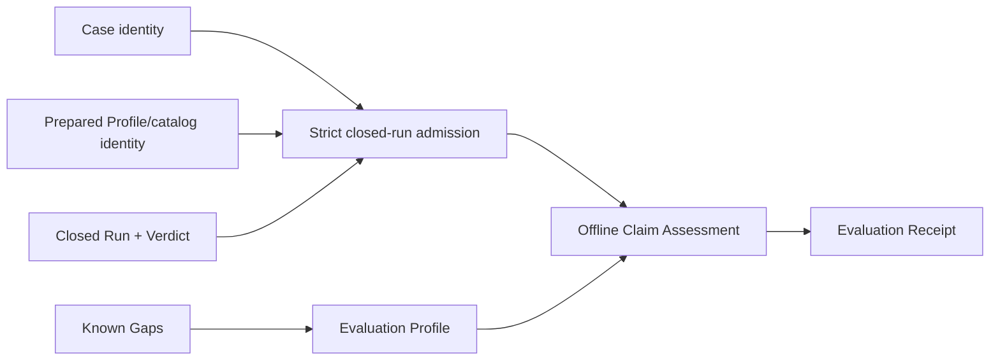

# Local qualification receipts and staged profile contract

## Re-plan on fn-85 and fn-22 (2026-09-23)

The first plan (SHIP, 2026-08-26) was written before the Case Runtime settled and before fn-22
delivered a recorded Run. It named paths that no longer exist (`api/umpire/**`,
`tools/umpire/artifact/**`, `Temporal.System.Evaluation`) and an admission that re-derived the
preparation identity. This re-plan keeps its intent, requirements and boundaries and grounds every
contract in what the tree now has:

- **The subject is fn-22's.** A qualification subject is a canonical Case (the form
  `tools/umpire/internal/casefile` decides) and a recorded Run (`replay.RecordedRun`: the Run with
  its Verdict and the `DriverIdentity` it was prepared under, as `umpire-run --record` and
  `umpire-fuzz --record-root` write it). Admission reads both strictly and never prepares, runs or
  replays. Because it never prepares, the recorded Run must name the Case it ran: the recorded-Run
  format gains `case`, the SHA-256 of the canonical Case bytes the Run was prepared from, computed
  by one helper, `recordedrun.CaseIdentity(bytes)` (`casefile.Canonical`, then SHA-256), which every
  writer and both admissions call; replay exports it as `replay.CaseIdentity` and
  `replay.WriteRecordedRun` takes the Case bytes and computes it, because the live suite (package
  `tests`) may import `replay` but not a `tools/umpire/internal` package. `umpire-fuzz --record-root` already compacts its Case;
  `umpire-run` computes the identity from its fixture while parsing its configuration, and with
  `--record` a fixture that is not in a canonical form is refused before anything runs (exit 3),
  so a live Run is never lost to a record it cannot write; the live suite's `runRecording` takes
  the Case bytes, which its one caller already reads. A Run whose `case` is not the admitted Case's identity is `crossed`, and a
  record without it `incompatible`; replay admission checks it too, and the pinned negative-control
  record is re-encoded with it (deterministic, its pinned sequences unchanged). The binding couples
  that record to the control Case's exact bytes: a change to the control's definitions makes it
  `crossed` until it is recorded again live, which `key_test.go` and .6's docs say. Admission
  checks run in a fixed order. The Case: its byte cap (`oversized`), its canonical form
  (`noncanonical`, a Case that is not JSON at all included, as replay classes it), decoding (`malformed`), its format version (`incompatible`). The recorded Run:
  its byte cap (`oversized`), decoding (`malformed`, a duplicate or case-folded outer key included, in both
  admissions), its event cap (`oversized`), the `case` field
  (`incompatible`, so a legacy record is never `noncanonical`), its re-encoding (`noncanonical`).
  Then the pair: `open` (an empty Run ID, no events, a disposition or cleanup status that is absent
  or `UNSPECIFIED`, no Verdict), `crossed` (reached only with a Verdict present), `inconsistent`,
  `malformed` (Known Gap kinds) and `stale`. IDs are names, not hashes, so a regenerated Case with the same IDs
  never inherits an older Run. The Case must be format version 1.0. The Run must be the Case's: its `case_id` and
  `program_id` are the Case's, and the set of rule IDs its Verdict names equals the Contract's
  rules -- `contract.rules` and `contract.correlated.rules` together, as the evaluator reports them
  -- each exactly once, whatever its status (a Run carries no Contract ID; the receipt takes the
  Contract ID from the Case). It
  must be closed: a non-empty Run ID, at least one event, a terminal disposition, a cleanup
  outcome, a Verdict. It must be consistent:
  every supporting sequence names one event once, every Known Gap the Case's provenance declares
  has a declared, non-`UNSPECIFIED` kind (proto3 enums are open, so an unknown number decodes;
  either is `malformed`), no rule of the closed Verdict is still `PENDING`
  (the evaluator settles every obligation at close) or `UNSPECIFIED`, the Verdict status is not
  `UNSPECIFIED`, and the Verdict's status agrees with its rules and the disposition both ways, as
  the protocol defines it: violated exactly when some rule is violated, and a Run is
  `STOPPED_BY_MONITOR` exactly when its Verdict is violated; satisfied exactly when every rule is
  satisfied on a `COMPLETED` Run; inconclusive otherwise. Any other combination is `inconsistent`. The recorded catalog fingerprint must be the tree's static catalog's
  (`NewWorkflowServiceCatalog().Identity()`, which reads no Case): admission alone decides
  staleness. The catalog fingerprint admission compares against is its parameter: the command
  passes the tree's, and the receipt goldens pass a fixed one, so a catalog change never moves a
  golden. Reading that fingerprint is the only use qualification makes of the Driver package
  (`common/testing/testpilot/temporal`): it builds the method catalog and opens nothing. The
  recorded Profile name and bindings fingerprint are bound into the receipt as recorded. The
  recorded Run must be in its canonical form -- its bytes equal `EncodeRecordedRun`'s re-encoding of
  what they decode to, else `noncanonical` -- and its identity, the SHA-256 of those bytes, is bound
  into the receipt beside the Case identity, so a receipt names the one Run it assessed. The shared
  codec rejects a duplicate or case-folded outer key (Go's decoder matches keys without case), for
  replay admission too. What replay admission and qualification admission share -- the recorded-Run codec,
  reading the canonical Case, the Case and Program crossing, the supporting sequences, and the
  two-way agreement of disposition and Verdict (`recordedrun.Agreement`: violated exactly when
  `STOPPED_BY_MONITOR`, satisfied exactly when every rule is satisfied on a `COMPLETED` Run) -- moves
  to a leaf package, `tools/umpire/internal/recordedrun`, that both import (replay keeps its names as
  aliases), so qualification never imports the package that holds the replay bridge and the
  rerun environment. Replay's `ViolatedForm` (`replay/form.go`, which `replay/rerun.go` also
  calls) stays in replay, rebuilt on `Agreement`: its cleanup, incomplete and non-violated gates are
  replay's admissible-subject test, not qualification's. Qualification admits a violated, stopped
  Run whose cleanup failed or timed out, which `local-ephemeral` then rejects with
  `cleanup-unclosed` among its reasons (the conformance fixture
  `cleanup-failure-after-proved-violation` has that shape). The caps are named constants: a Case of at most 4 MiB, a recorded Run of at
  most 16 MiB (the bridge frame cap) and 65,536 events, a receipt of at most 1 MiB. A receipt over its cap -- reachable only near the event cap,
  since it lists every rule's supporting sequences -- is a tooling failure with its own summary
  (`receipt-oversized`), never a decision and never published. Every tooling failure -- an
  unreadable input, a catalog that does not build, `receipt-oversized`, a rendered receipt that
  does not decode back -- exits 3 with its own named summary status, beside the rejected subject,
  the unknown Profile and the publication conflict or failure. These
  constants are the only enforcement: the command reads each input through a reader capped one
  byte past its cap, so an oversized input is refused before it is held in memory, and the receipt
  records the caps it was admitted under.
- **Evidence and verification are the recorded Verdict's.** *Verification* is the recorded Verdict
  status; it is never re-derived. *Evidence* is each rule's supporting sequences: a rule the
  Verdict names at a terminal state with no supporting sequence is unsupported. A Profile may
  require support; an unsupported rule then keeps the decision below `accepted`. The receipt
  carries each rule's supporting sequences as its evidence links, never an event body.
- **Lean owns the Evaluation Profile, Go assesses.** `Umpire.Evaluation` (Temporal-free) declares a
  checked Evaluation Profile as data: the claim, the trust basis, the Known Gap kinds that block
  acceptance, and an ordered reason table whose reasons each name one status-specific condition
  from a closed set -- `verdict-violated`, `verdict-inconclusive`, `disposition-stopped`,
  `disposition-incomplete`, `cleanup-unclosed`, `known-gap-blocking`, `unsupported-rule` -- and the
  decision it forces, `rejected` or `incomplete`. A subject for which no reason holds is accepted.
  It carries no catalog, endpoint, credential, path or execution authority. `Temporal.Evaluation.Local` declares the one
  `local-ephemeral` Profile, whose table is, in precedence order: `verdict-violated` and
  `disposition-stopped` reject (a violated claim is a failed claim); `verdict-inconclusive`,
  `disposition-incomplete`, `cleanup-unclosed`, `known-gap-blocking` (every
  `capability` and `interpretation` gap) and `unsupported-rule` leave it `incomplete` (absent
  verification is never proof, and never a failure either). A non-default `umpire-evaluation-profiles` executable renders every
  declared Profile to canonical JSON under `tools/umpire/evaluation/profiles/`, checked by
  a Makefile gate that `umpire-check-regression` runs (the directory is `profiles/`, not `testdata/`, since the
  command ships them); the Profile's identity is the SHA-256 of
  those bytes, written `sha256:<hex>` as every Lean fingerprint is (Case and receipt identities
  stay bare hex, as fn-22's are). The cross-language contract is the Lean-rendered Profile
  bytes: Go embeds them and pins their identity against Lean's. The receipt is Go's alone -- Go
  renders it canonically and pins it with Go goldens; Lean never renders or reads one, which is how
  R5's cross-language goldens are read here. Go validates every Profile it loads as strictly as Lean checks a
  declaration, so `Assess` only ever receives a valid one. `tools/umpire/evaluation`
  embeds that directory (`//go:embed`) and selects a Profile only by its exact name, so a Profile is
  never a path. A test-only second Profile lives in the Go tests, never in Lean or the embedded set.
- **Assessment decides before anything is rendered.** `Assess(subject, profile) Decision` is pure:
  the decision, every reason that holds in the table's order, and the fields it read. The receipt
  renders a Decision.
- **The receipt is Go's canonical JSON.** `tools/umpire/evaluation` renders the receipt in one
  fixed key order and pins it with goldens; its identity is the SHA-256 of its bytes. It binds the
  Profile name and identity, the Case identity (SHA-256 of the canonical Case) and its Case,
  Program and Contract IDs, the Run identity, the recorded `DriverIdentity`, the Run ID, disposition and cleanup, the
  Verdict with each rule's status, terminal state and supporting sequences, the decision and every
  reason, the trust basis and the admission caps the subject was admitted under, the Known Gaps by kind and
  code, and the receipt format version. It carries no raw payload, event body, credential, path or
  endpoint.
- **Publication is atomic, exclusive and idempotent.** `cli.Publish` writes the receipt to a
  temporary file in the target directory (dot-prefixed and not ending in `.json`, so a leftover
  never looks like a receipt), syncs it, and hard-links it to
  `<root>/<receipt-identity>.json` (`os.Link` is atomic and fails if the name exists), then removes
  the temporary file. On an existing name, publication `Lstat`s it and requires a regular file (a
  symlink, FIFO, device or directory is a conflict), then opens it with `O_NOFOLLOW|O_NONBLOCK` (so a FIFO swapped in after the
  `Lstat` never blocks) and re-checks it is a regular file before reading it through a reader
  capped one byte past the receipt cap: identical bytes are `already-published`, anything
  else a conflict that is reported and never overwritten. The directory is not synced after the
  link: a crash then may lose the name, never expose a partial receipt, and publishing again
  restores it. `Publish` takes a context and checks it immediately before `os.Link`: cancelled before
  the link, nothing is published and the temporary file is removed; after it, the receipt stands
  and is reported. The receipt is chmod'ed 0644 before the link, as the other writers' files are.
  The receipt root must already exist (as `umpire-run --record`'s directory must), and
  the name must be a bare base name, neither `.` nor `..`. A crash can leave only a temporary
  file, never a partial receipt under its final name. The name is the content's hash, so no lock is
  needed. No path reruns anything.
- **The command is `umpire-assess run`.** It takes `--case`, `--run`, `--profile <name>` (an exact
  name from the embedded set), `--receipt-root` and `--model-root` (default `model`, resolved like
  `umpire-replay`'s, so a receipt root under the model is refused), and exposes no Driver,
  deployment, endpoint, credential, checker or policy flag.

Tasks .1 to .6 are rewritten below on these contracts: .1 the Lean Profiles and their rendering,
.2 admission and the embedded Profiles, .3 assessment, .4 the receipt and its publication, .5 the
command, .6 the matrices, the live proof and the docs. The requirements R1–R8, the failure
behavior and the boundaries stand, R3's "exact local Driver" read as the recorded identity bound
into the receipt with a current catalog, and R4's "verification" as the recorded Verdict status.

## Umpire4 Case Runtime reconciliation

This spec performs offline Claim Assessment over fn-64 Case Runtime outputs. It binds claims to `Case`, preparation Profile/catalog identity, `Run`, and `Verdict`; it does not consume or recreate Run Evaluation Results.

## Intent

Define a reusable Evaluation Profile and immutable Evaluation Receipt for environment-scoped local qualification. Assessment attests to one already closed Run; it never prepares a Case, creates a Run, invokes a Driver, reinterprets raw target data, or reevaluates a Contract.

## Architecture

`Umpire.Evaluation` is a Temporal-free deep module containing inert checked Evaluation Profiles, decisions, reasons, Limits and Known Gap policy, rendered to canonical JSON. A Temporal-owned leaf (`Temporal.Evaluation.Local`) defines the sole initial `local-ephemeral` profile. `tools/umpire/evaluation` performs exact admission of fn-22's recorded subject, offline assessment against a rendered Profile, receipt rendering and immutable publication only.

## Contracts

The admitted subject contains canonical Case identity, Program/Contract identity, prepared Profile and descriptor-catalog identities, the live Driver identity recorded by the Run, Run identity/disposition/events/cleanup outcome, and the matching Verdict including supporting events. Admission verifies exact closure before assessment. A stale or crossed value produces no receipt.

An Evaluation Profile describes the environment-scoped claim, required Run/Verdict dispositions, cleanup, verification evidence, trust, Limits, Known Gaps, and claim strength. It contains no endpoint, credential, path, execution authority, Temporal API, or caller-defined code.

Claim Assessment decisions are `accepted`, `rejected`, or `incomplete`. They do not replace Run disposition, Verdict status, cleanup, Driver identity, or verification status. A satisfied Verdict is necessary but not sufficient for acceptance; missing required evidence, unresolved Known Gaps, cleanup uncertainty, or trust uncertainty remain explicit.

Several named Evaluation Profiles may assess the same closed Run independently. The same canonical subject and same Profile produce the same receipt identity and byte-identical publication; a different Profile produces a different receipt and never mutates the prior one. No assessment path reruns the Case. Publication retry is safe only for byte-identical content.

The receipt binds the Evaluation Profile identity, Case/Program/Contract identities, preparation Profile/catalog identities, recorded live Driver identity, Run identity and disposition, Verdict and supporting events, cleanup, independent assessment reasons, Limits, Known Gaps, and evidence links. It contains no credentials or raw payloads and is not self-authenticating.

## Failure behavior

Malformed, noncanonical, stale, crossed, duplicate, oversized, or open Run/Verdict inputs reject before assessment. Valid negative or incomplete assessments remain publishable. Tooling, cancellation, codec, or publication failure yields no new receipt; retrying assessment or publication does not create a Run. If immutable publication succeeded but reporting failed, the result reports publication ambiguity and forbids automatic rerun.

## Acceptance Criteria

- **R1:** One Temporal-free Evaluation Profile contract expresses environment-scoped claim, required Case Runtime outcomes, evidence, cleanup, trust, Limits, Known Gaps, and stable identity without environment credentials or execution authority.
- **R2:** Claim Assessment admits only an exact closed Case/Profile/catalog/Driver/Run/Verdict closure and never prepares, executes, reads raw target data, or reevaluates the Contract.
- **R3:** The fixed `local-ephemeral` profile binds the exact local Driver and preparation identities and accumulates all applicable reasons deterministically; stale identity, unknown requirement, contradictory policy, or missing required evidence cannot be accepted.
- **R4:** Accepted, rejected, and incomplete decisions preserve Run disposition, Verdict, cleanup, verification, trust, and Known Gaps as independent fields and never treat satisfaction or absent verification as proof.
- **R5:** Evaluation Receipt and publication closure have exact canonical identities, bounded fields, reference closure, N/N+1 limits, cross-language goldens, and strict rejection of incompatible versions without modifying source Case Runtime values.
- **R6:** One bounded offline controller and thin local command expose no Driver, execution, endpoint, credential, arbitrary checker, or policy-definition authority and publish atomically, immutably, and retry-safely.
- **R7:** Mutation, multiplicity, idempotency, cancellation, and publication tests prove every Case/Profile/catalog/Driver/Run/Verdict/evidence/status/Limit/Known-Gap binding and show that multiple Profiles never conflict or cause rerun.
- **R8:** Documentation states the exact environment-scoped claim, lack of self-authentication, optional or required evidence, retained exclusions, and separation between Case Runtime verification and offline Claim Assessment while preserving existing comments.

## Early proof point

Admit the caller Model's `asyncCompletion` Case with a Run recorded by `umpire-run --record` against the test cluster, and produce the same receipt twice, byte for byte, without constructing a Driver or Run; the negative control's recorded Run (`tools/umpire/replay/testdata`) is admitted and assessed `rejected` for its violated Verdict. Reject one crossed Case and one stale catalog before the codec and command work.

## Boundaries

No CI, remote, staging, canary, production, release authorization, automatic execution, raw-event interpretation, second Contract evaluator, generic policy language, or compatibility route.

## Requirement coverage

| Requirement | Tasks |
| --- | --- |
| R1 | `.1`, `.6` |
| R2 | `.2`, `.3` |
| R3 | `.1`, `.2`, `.3` |
| R4 | `.2`, `.3`, `.6` |
| R5 | `.4`, `.5`, `.6` |
| R6 | `.4`, `.5` |
| R7 | `.1`, `.3`, `.4`, `.5`, `.6` |
| R8 | `.6` |

## Implementation

Task .1 (2026-09-23): `Umpire.Evaluation` declares the checked, Temporal-free Evaluation Profile
and `Temporal.Evaluation.Local` the `local-ephemeral` Profile with the plan's table;
`umpire-evaluation-profiles` renders them under `tools/umpire/evaluation/profiles/`, checked by
`umpire-check-evaluation-profiles` within `umpire-check-regression`. The identity is pinned in
`Temporal/Evaluation/LocalTests.lean`. The error type is `ProfileError`: the name the plan gave it is retired vocabulary. Implementation review: SHIP in one round; its two P3 notes applied (blocking
kinds sort by the derived kind order; the renderer reuses the declaration's duplicate check), and
the FYI taken: a Profile has no structural equality, since two declarations can render the same
bytes.

Task .2 (2026-09-23): the recorded Run lives in `tools/umpire/internal/recordedrun` and names the
canonical Case it ran; replay admission rejects another Case's record as `crossed` and a record
naming none as `incompatible`, and the pinned control record was re-encoded with its Case identity,
its Run bytes unchanged. `tools/umpire/evaluation` admits a subject without executing anything and
loads the embedded Profiles by exact name. Undeclared enum numbers are `malformed`: protojson reads
a number as readily as a name, and one the proto does not declare re-encodes to itself.
Implementation review: SHIP in one round; its five P3 notes applied (the caps are constants,
undeclared statuses are `malformed`, a Verdict naming a rule twice says so, replay's `Admit` pins
repeated and case-folded keys, a dead test field is gone).

Task .3 (2026-09-23): `Assess` decides an admitted subject under a Profile from its recorded values
alone, every holding reason listed in the table's order, the recorded facts kept as fields of their
own. A rule is unsupported when the Verdict names it at a terminal state with no supporting event.
Implementation review: SHIP in one round; its two P3 notes applied (a condition the reader cannot
evaluate holds, so it never lets a subject through; the purity test compares the Known Gaps
deeply).

Task .4 (2026-09-23): `Render` and `DecodeReceipt` give the canonical receipt and read only it
back; goldens produced by `Assess` pin an accepted, a rejected and an incomplete receipt.
`cli.Publish` publishes by hard link, exclusively and idempotently. It reads an existing name at
most one byte past the bytes it would publish, which is never more than the receipt cap.
Implementation review: SHIP in one round; its P3 applied (a context cancelled after the check
before the link is pinned to leave the receipt published) and two FYIs taken (`Render` refuses a
Decision made on another subject; the no-follow open retries on `EINTR`).

Task .5 (2026-09-23): `umpire-assess run` is the command. Beyond the statuses the plan lists, an
embedded Profile that does not load is `profile-unreadable` (only a name outside the set is
`unknown-profile`), and a broken internal invariant (an admission error that is no rejection, a
Decision rendered against another Profile or subject) is `internal-error`; both exit 3. The
self-check and the publisher are fields of the command's environment beside the catalog and the
context, so a test reaches the failures no real subject or root produces. Implementation review:
round one NEEDS_WORK with one P2 (the receipt-unreadable, publication-failed and deadline paths
were not pinned) and three P3 findings, all applied; round two SHIP after one transport timeout
was re-dispatched, its three P3 notes applied.

Task .6 (2026-09-23): the live suite records the caller Model's asyncCompletion Case with
`umpire-run --record` and assesses it twice with `umpire-assess run` (accepted, then already
published, the recorded Run unchanged), and rejects the negative control's pinned record; neither
assessment is given an address. Each admission cap admits at N and rejects at N+1. The docs state
the claim, the asserted trust, the lack of self-authentication and the retained exclusions. The
live gate passes with 32 identities. Implementation review: SHIP in one round, its two P3 notes
applied.

## Plan review

Round one of the re-plan (`flowctl claude plan-review`, opus at high, 2026-09-23): NEEDS_WORK with
five P1 and three P2 findings, all applied. A Run carries no Contract ID, so Contract crossing is
the Verdict's rule IDs equalling the Contract's, each once; the catalog fingerprint is admission's
alone and leaves the Profile; publication is a synced temporary file hard-linked to its final name,
so a crash never leaves a partial receipt and no lock is needed; assessment returns a Decision in
.3 and .4 renders it, so the receipt's goldens come from `Assess`; the Profiles are embedded and
selected by exact name, and the command takes `--model-root` like `umpire-replay`; evidence is
each rule's supporting sequences and verification the recorded Verdict status, a Profile may
require support; admission checks the Verdict's aggregation against its rules and disposition;
the caps are named constants. The suppressed note is applied too: the test-only Profile lives in
the Go tests, never in the embedded set.

Round two (2026-09-23): NEEDS_WORK with two P1, four P2 and one P3 findings, all applied. The
Contract's rules are `contract.rules` with `contract.correlated.rules`, as the evaluator reports
them, so a correlated-only Case (every Model-produced one) is not crossed; the reason conditions
are status-specific and `local-ephemeral`'s table is written out, so an inconclusive Verdict is
`incomplete` and a violated one `rejected`; admission rejects a Case of another format version as
`incompatible`; the Profile carries its subject Limits and the receipt carries the trust basis, the
Limits and its own format version; the Profile check runs in `umpire-check-regression`; the
unused `profile-name` condition is gone; the Lean/Go Profile agreement is .1's criterion. The FYI
on cancellation is taken: `umpire-assess`'s interrupt matters only around the hard link, which .5
states.

Round three (2026-09-23): NEEDS_WORK with two P1 and three P2 findings, all applied. There is no
pending Verdict status, so `verdict-pending` is gone and a `PENDING` rule in a closed Run is
`inconsistent` at admission; the admission caps are the only enforcement and the receipt records
them, so the Profile carries no Limits of its own; each task's acceptance list is rewritten
against its description; the coverage table follows the tasks' `satisfies` lines; the command
reads each input through a reader capped one byte past its cap. The FYI on the import graph is
taken: the shared recorded-Run code moves to a leaf package both admissions import. The FYI on
trust is recorded: `local-ephemeral-cluster` is asserted, not checked against the recorded
identity, which .6's docs state.

Round four (2026-09-23): NEEDS_WORK with one P1, two P2 and one P3 finding, all applied. Go
validates each loaded Profile as strictly as Lean declares one -- an unknown condition, decision or
Known Gap kind, an empty table, an empty or duplicate reason, a repeated condition, and
`known-gap-blocking` without blocking kinds or blocking kinds without it all reject -- and Lean adds
the contradictory pair to its declaration checks; the Lean/Go Profile identity agreement is .2's
test, the identity written `sha256:<hex>`; an empty Run ID or a Run with no events is `open`; the
leftover "pending" wording in .3 is gone. The duplication note is taken: the violated-form rule
moves to the shared leaf package with the other shared checks.

Round five (2026-09-23): NEEDS_WORK with one P1, five P2 and two P3 findings, all applied.
Publication on an existing name `Lstat`s it, requires a regular file and reads it capped without
following links, anything else a conflict (.4, .6). The receipt binds the Run's identity, the
SHA-256 of its canonical recorded bytes, and admission requires the recorded Run in the form
`EncodeRecordedRun` writes. Verdict consistency is two-way -- stopped exactly when violated,
satisfied exactly when every rule is satisfied on a `COMPLETED` Run, inconclusive otherwise -- and an
`UNSPECIFIED` rule or Verdict status is `inconsistent`. `replay/form.go` and `replay/rerun.go` are
in .2's files, since `ViolatedForm` moves; .1 names `Temporal/Evaluation/LocalTests.lean` and the
aggregator modules, so the module index covers every new module. R5's cross-language goldens are
read as the Lean-rendered Profiles, the receipt being Go's. The shared codec rejects duplicate
and case-folded outer keys; the test-only Profile fixture and its unexported parse path arrive in
.2. The FYIs are taken: admission takes the catalog fingerprint as a parameter so the goldens
never drift, its one use of the Driver package is building the catalog, and the unsynced directory
after the link is stated.

Round six (2026-09-23): NEEDS_WORK with one P0, one P1, two P2 and one P3 findings, all applied.
The recorded Run now names its Case: the recorded-Run format carries the canonical Case's
SHA-256, which every writer holds, so a regenerated Case with the same IDs is `crossed` against an
older Run rather than inheriting it (P0; a record without it is `incompatible`, and the pinned
control is re-recorded). Only the two-way disposition/Verdict agreement is shared; `ViolatedForm`'s
cleanup and non-violated gates stay replay's, and a violated, stopped Run with a failed cleanup is
an admissible subject that `local-ephemeral` rejects. A Known Gap of an `UNSPECIFIED` or
undeclared kind is `malformed`. A receipt over its cap is the named tooling failure
`receipt-oversized`, tested at N and N+1. Publication requires an existing root and a bare name,
and its temporary file is dot-prefixed and never ends in `.json`. The FYIs: the Case's canonical
check is whitespace only, as fn-22 left it (a Case in another field spelling is another identity,
and its recorded Run then names that identity, so nothing crosses); the evaluation tests import
the history types their fixtures' `Any` values need; the Go identity test pins the same literal
Lean's test does, beside the Makefile byte gate.

Round seven (2026-09-23): NEEDS_WORK with one P1, one P2 and two P3 findings, all applied. Only
the fuzz writer held canonical Case bytes, so one helper, `recordedrun.CaseIdentity`, computes the
recorded `case` for every writer and both admissions; `umpire-run --record` refuses a
non-canonical fixture before anything runs, and `runRecording` takes the Case bytes. Every tooling
failure, `receipt-oversized` among them, exits 3 with a named summary status (.5). Admission's
checks run in a fixed order, so a legacy record is `incompatible`, not `noncanonical`. .2's Files
list the test files the signature changes touch. The FYIs are taken: the pinned control record is
re-encoded, not re-recorded, and its coupling to the control's bytes is documented; the embedded
Profiles live under `profiles/`, not `testdata/`; the existing name is opened non-blocking and
re-checked after `Lstat`.

Round eight (2026-09-23): NEEDS_WORK with one P1, two P2 and one P3 findings, all applied. The
live suite may not import `tools/umpire/internal`, so replay exports `CaseIdentity` and its
`WriteRecordedRun` takes the Case bytes; .2's quick commands vet `./tests/` under the integration
tags. The admission order is stated per input and then for the pair, so a Run with no Verdict is
`open`, never `crossed`, a decode failure is `malformed`, the event cap follows decoding, and an
`UNSPECIFIED` cleanup or disposition is `open`. Cancellation is testable: `umpire-assess` runs
under `cli.Interruptible` and `Publish` checks its context immediately before the link, both sides
pinned. The FYIs are taken: receipts are 0644, a summary stdout cannot take goes to stderr, and
replay's reason classes are unchanged by rebuilding `ViolatedForm` on `Agreement`, its tests
pinning them. R1's "Limits" read as the admission caps the receipt records, as round three settled.

Round cap (2026-09-23): the eighth round reached flowctl's cap of eight plan-review rounds. Each
round's findings were real and applied, and their severity fell (rounds six to eight found one
blocking issue each, all in the recorded-Run `case` binding round six introduced). That binding
changes the recorded-Run format fn-22 shipped, which is a re-plan of the subject contract, so the
counter was reset with `flowctl spec reset-review-rounds` and review continued from round nine.

Round nine (2026-09-23): **SHIP**, its one P2 and three P3 notes folded into the plan. A
duplicate or case-folded outer key is a decoding failure, `malformed`, in both admissions; a Case
that is not JSON is `noncanonical`, as replay classes it; `umpire-assess` runs under
`cli.Interruptible` with a fixed one-minute timeout, whose expiry before the link reports
`interrupted` as an interrupt does; `model/ARCHITECTURE.md`'s replay-admission paragraph is .2's
to update. The FYIs are taken: .1 reuses `Umpire.KnownGap.KnownGapKind` rather than declaring the
kinds again; .6's docs say publication needs hard links and fails closed without them. The older
Contracts prose naming "Limits" and "claim strength" in the Profile is read through the re-plan:
the receipt records the admission caps, and the claim is the Profile's claim text.
