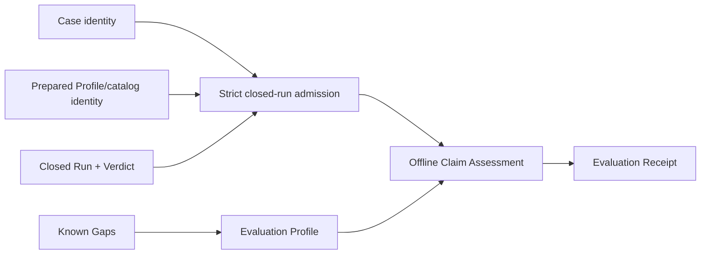

# Local qualification receipts and staged profile contract

## Re-plan on fn-85 and fn-22 (2026-09-23)

The first plan (SHIP, 2026-08-26) was written before the Case Runtime settled and before fn-22
delivered a recorded Run. It named paths that no longer exist (`api/umpire/**`,
`tools/umpire/artifact/**`, `Temporal.System.Evaluation`) and an admission that re-derived the
preparation identity. This re-plan keeps its intent, requirements and boundaries and grounds every
contract in what the tree now has:

- **The subject is fn-22's.** A qualification subject is a canonical Case (the form
  `tools/umpire/internal/casefile` decides) and a recorded Run (`replay.RecordedRun`: the Run with
  its Verdict and the `DriverIdentity` it was prepared under, as `umpire-run --record` and
  `umpire-fuzz --record-root` write it). Admission reads both strictly and never prepares, runs or
  replays: the Run must be the Case's (Case, Program and Contract IDs), closed (a terminal
  disposition, a cleanup outcome, a Verdict), and self-consistent (every supporting sequence names
  one event once, every violated or satisfied rule is a rule of the Contract). The recorded catalog
  fingerprint is compared with the tree's static catalog (`testpilot.Catalog.Identity()` over
  `NewWorkflowServiceCatalog`), which reads no Case; the Profile name and the bindings fingerprint
  are bound into the receipt as recorded, and an Evaluation Profile may require them.
- **Lean owns the Evaluation Profile, Go assesses.** `Umpire.Evaluation` (Temporal-free) declares a
  checked Evaluation Profile as data: the claim, the dispositions, Verdict statuses and cleanup
  outcomes it accepts, the Known Gap kinds that block acceptance, the trust basis, the Limits, and
  an ordered reason table. `Temporal.Evaluation.Local` declares the one `local-ephemeral` Profile.
  A non-default `umpire-evaluation-profiles` executable renders every declared Profile to canonical
  JSON under `tools/umpire/evaluation/testdata/profiles/`, checked by a Makefile gate; the
  Profile's identity is the SHA-256 of those bytes. Go reads the rendered Profile and never defines
  policy of its own.
- **The receipt is Go's canonical JSON.** `tools/umpire/evaluation` renders the receipt in one
  fixed key order and pins it with goldens; its identity is the SHA-256 of its bytes. It binds the
  Profile identity, the Case identity (SHA-256 of the canonical Case) and its Case, Program and
  Contract IDs, the recorded `DriverIdentity`, the Run ID, disposition and cleanup, the Verdict with
  each rule's status, terminal state and supporting sequences, the decision and every reason, the
  Known Gaps and the Limits. It carries no raw payload, event body, credential, path or endpoint.
- **Publication is exclusive and idempotent.** A receipt is written once at
  `<root>/<receipt-identity>.json` through `tools/umpire/internal/cli`, created exclusively: an
  existing file with identical bytes is `already-published`, never rewritten; one with other bytes
  is a publication conflict that is reported and never overwritten. No path reruns anything.
- **The command is `umpire-assess run`.** It takes `--case`, `--run`, `--profile <name>` (one of the
  rendered Profiles, by name) and `--receipt-root`, and exposes no Driver, deployment, endpoint,
  credential, checker or policy flag.

Tasks .1 to .6 are rewritten below on these contracts. The requirements R1–R8, the failure
behavior and the boundaries stand.

## Umpire4 Case Runtime reconciliation

This spec performs offline Claim Assessment over fn-64 Case Runtime outputs. It binds claims to `Case`, preparation Profile/catalog identity, `Run`, and `Verdict`; it does not consume or recreate Run Evaluation Results.

## Intent

Define a reusable Evaluation Profile and immutable Evaluation Receipt for environment-scoped local qualification. Assessment attests to one already closed Run; it never prepares a Case, creates a Run, invokes a Driver, reinterprets raw target data, or reevaluates a Contract.

## Architecture

`Umpire.Evaluation` is a Temporal-free deep module containing inert checked Evaluation Profiles, decisions, reasons, Limits and Known Gap policy, rendered to canonical JSON. A Temporal-owned leaf (`Temporal.Evaluation.Local`) defines the sole initial `local-ephemeral` profile. `tools/umpire/evaluation` performs exact admission of fn-22's recorded subject, offline assessment against a rendered Profile, receipt rendering and immutable publication only.

## Contracts

The admitted subject contains canonical Case identity, Program/Contract identity, prepared Profile and descriptor-catalog identities, the live Driver identity recorded by the Run, Run identity/disposition/events/cleanup outcome, and the matching Verdict including supporting events. Admission verifies exact closure before assessment. A stale or crossed value produces no receipt.

An Evaluation Profile describes the environment-scoped claim, required Run/Verdict dispositions, cleanup, verification evidence, trust, Limits, Known Gaps, and claim strength. It contains no endpoint, credential, path, execution authority, Temporal API, or caller-defined code.

Claim Assessment decisions are `accepted`, `rejected`, or `incomplete`. They do not replace Run disposition, Verdict status, cleanup, Driver identity, or verification status. A satisfied Verdict is necessary but not sufficient for acceptance; missing required evidence, unresolved Known Gaps, cleanup uncertainty, or trust uncertainty remain explicit.

Several named Evaluation Profiles may assess the same closed Run independently. The same canonical subject and same Profile produce the same receipt identity and byte-identical publication; a different Profile produces a different receipt and never mutates the prior one. No assessment path reruns the Case. Publication retry is safe only for byte-identical content.

The receipt binds the Evaluation Profile identity, Case/Program/Contract identities, preparation Profile/catalog identities, recorded live Driver identity, Run identity and disposition, Verdict and supporting events, cleanup, independent assessment reasons, Limits, Known Gaps, and evidence links. It contains no credentials or raw payloads and is not self-authenticating.

## Failure behavior

Malformed, noncanonical, stale, crossed, duplicate, oversized, or open Run/Verdict inputs reject before assessment. Valid negative or incomplete assessments remain publishable. Tooling, cancellation, codec, or publication failure yields no new receipt; retrying assessment or publication does not create a Run. If immutable publication succeeded but reporting failed, the result reports publication ambiguity and forbids automatic rerun.

## Acceptance Criteria

- **R1:** One Temporal-free Evaluation Profile contract expresses environment-scoped claim, required Case Runtime outcomes, evidence, cleanup, trust, Limits, Known Gaps, and stable identity without environment credentials or execution authority.
- **R2:** Claim Assessment admits only an exact closed Case/Profile/catalog/Driver/Run/Verdict closure and never prepares, executes, reads raw target data, or reevaluates the Contract.
- **R3:** The fixed `local-ephemeral` profile binds the exact local Driver and preparation identities and accumulates all applicable reasons deterministically; stale identity, unknown requirement, contradictory policy, or missing required evidence cannot be accepted.
- **R4:** Accepted, rejected, and incomplete decisions preserve Run disposition, Verdict, cleanup, verification, trust, and Known Gaps as independent fields and never treat satisfaction or absent verification as proof.
- **R5:** Evaluation Receipt and publication closure have exact canonical identities, bounded fields, reference closure, N/N+1 limits, cross-language goldens, and strict rejection of incompatible versions without modifying source Case Runtime values.
- **R6:** One bounded offline controller and thin local command expose no Driver, execution, endpoint, credential, arbitrary checker, or policy-definition authority and publish atomically, immutably, and retry-safely.
- **R7:** Mutation, multiplicity, idempotency, cancellation, and publication tests prove every Case/Profile/catalog/Driver/Run/Verdict/evidence/status/Limit/Known-Gap binding and show that multiple Profiles never conflict or cause rerun.
- **R8:** Documentation states the exact environment-scoped claim, lack of self-authentication, optional or required evidence, retained exclusions, and separation between Case Runtime verification and offline Claim Assessment while preserving existing comments.

## Early proof point

Admit the caller Model's `asyncCompletion` Case with a Run recorded by `umpire-run --record` against the test cluster, and produce the same receipt twice, byte for byte, without constructing a Driver or Run; the negative control's recorded Run (`tools/umpire/replay/testdata`) is admitted and assessed `rejected` for its violated Verdict. Reject one crossed Case and one stale catalog before the codec and command work.

## Boundaries

No CI, remote, staging, canary, production, release authorization, automatic execution, raw-event interpretation, second Contract evaluator, generic policy language, or compatibility route.

## Requirement coverage

| Requirement | Tasks |
| --- | --- |
| R1, R3 | `.1` |
| R2, R4 | `.2`, `.4` |
| R5 | `.3`, `.5`, `.6` |
| R6 | `.4`, `.5` |
| R7 | `.1`–`.6` |
| R8 | `.6` |
