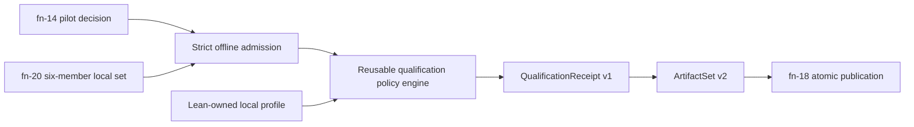

# Local qualification receipts and staged profile contract

> HTML render lens: local file `.flow/artifacts/fn-26-local-qualification-receipts-and-staged/spec.html` — regenerable, markdown is the record. <!-- flow-next:artifact-link -->

## Overview

Add the first current-model C12 seam without acquiring new authority: admit the exact immutable
six-member local conformance set from fn-20, admit fn-14's retained pilot decision, evaluate one
Lean-owned `local-ephemeral` qualification profile, and publish a canonical environment-scoped
qualification receipt. The receipt binds the same ExperimentSpec and every downstream artifact,
preserves operational, evidence-qualification, and semantic status independently, and records that
formal-checker evidence is not provided by this slice.

This is an offline policy/claim step. It starts no Temporal environment, reads no endpoint or
credential, reruns no experiment or semantic checker, and performs no release action. It also freezes
the reusable profile/receipt contract that later CI, remote/staging, canary, and release-graph specs
will extend one profile at a time.

## Goal & Context

Fn-19 can realize one caller-closure ExperimentSpec under a closed local authority and publish
ExperimentRun plus RawEvidence. Fn-20 can interpret that evidence through the canonical Lean mapping
and pure Property evaluator and publish SemanticEvidence plus Result. Those values still answer
different questions from C12: they do not say whether a named environment profile's authority,
evidence, cleanup, pilot authorization, and claim-strength policy were all met.

The first C12 result is deliberately modest: “this exact local-ephemeral run yielded an
environment-qualified satisfied result under this exact policy.” It is not a global correctness,
formal proof, CI, remote, canary, or release claim. The same semantic ExperimentSpec identity becomes
the fixed comparison root for later profile-specific receipts.

## Architecture & data model



### Deep module boundary

`model/Umpire/Qualification` is a reusable, Temporal-free vertical package containing inert checked
profile/status/claim values and canonical projections. Its public facade is `Umpire.Qualification`.
It knows environment classes, authority capability declarations, evidence requirements, cleanup
requirements, claim strengths, and decision states; it does not know Temporal, Nexus, endpoints,
credentials, artifact paths, remote clients, or Property semantics.

The concrete local policy lives under `model/Temporal/System/Qualification/Local.lean`. It references
the exact fn-19 local runtime/evidence profile and the fn-20 caller-closure conformance closure without
moving those declarations. `model/Temporal/Tool/QualificationProfile.lean` is a fixed sibling checker
that exposes only the compiled profile record and canonical digest to Go. It performs no artifact IO
or semantic evaluation.

`tools/umpire/qualification` is the deep Go controller. Its public `QualifyLocal` accepts an fn-18
admitted six-member set, an admitted fn-14 decision value, and the fixed verified compiled local
profile; it returns one admitted seven-member v2 set in memory or a structured tooling error. It
delegates strict decoding/publication to `tools/umpire/artifact`, never interprets raw facts or
Property clauses, and never executes fn-19/fn-20.

### Reusable qualification profile

`QualificationProfile/v1` is exactly `{identity,version,environmentClass,requiredRuntimeProfile,
requiredEvidenceProfile,requiredOperationalStatuses,requiredQualificationStatuses,
requiredSemanticStatuses,requiredPhases,requiredSources,authorityRequirements,cleanupRequirements,
formalEvidencePolicy,claimStrength,omissions,semanticDigest,provenance}`.

- `environmentClass` is exactly `local` in v1. CI, remote, and canary add their values only in the
  reviewed profile-schema version that first implements them.
- Required status arrays are nonempty, sorted unique closed values. A profile cannot coerce or rename
  statuses; it only declares which already-admitted values satisfy its policy.
- `requiredPhases` is an ordered subset of fn-18's five phases with exact allowed statuses.
  `requiredSources` is sorted `{sourceIdentity,requiredClosureStatus,schemaIdentity,schemaVersion,
  schemaDigest}` and never describes a mapping or Property.
- `authorityRequirement` is `{capability,mode}` where mode is `required|forbidden`; it names a checked
  capability, never authority material. `cleanupRequirement` is one of
  `phase-succeeded|source-closed|no-cleanup-omission`; all three are required by the local profile.
  Zero-open-handles remains fn-19 operational evidence and is not reread from raw facts here.
- `formalEvidencePolicy` is exactly `not-provided` in v1. No formal trust is inferred from
  Lean-written model or conformance values.
- `claimStrength` is exactly `environment-qualified-local` in v1.
- `semanticDigest` is `umpire-semantic/v1:` plus canonical JSON of all preceding fields except
  provenance, with source paths repository-relative and arrays in the stated order.

The sole compiled profile identity is `umpire.qualification-profile.local-ephemeral`, version 1. It
requires exact fn-19 runtime profile/evidence profile identities, operational `succeeded`, evidence
qualification `qualified`, semantic `satisfied`, all five phases succeeded, all exact fn-19 sources
closed, cleanup phase succeeded, cleanup source closed, no cleanup omission, no remote/network/
credential/pre-existing-cluster authority capabilities, formal evidence `not-provided`, and claim
strength `environment-qualified-local`.

### Pilot authorization

The command requires an explicit retained fn-14 evidence directory and uses fn-14's public strict
reader; it never accepts a decision string or receipt alone. `PilotDecisionBinding` is
`{formatVersion:"umpire-pilot-decision-binding/v1",receiptIdentity,payloadDigest,outcome,
sourceCommit,sourceTree}` after the reader recomputes every gate.

Only `LEAN_FIRST_GO` permits an accepted qualification. `FACADE_FOLLOW_UP` and `NO_GO` produce a
canonical rejected receipt with reason `pilot-not-authorized`; `INCONCLUSIVE` produces an incomplete
receipt with reason `pilot-inconclusive`. Missing, malformed, stale, or digest-invalid pilot evidence
is a tooling input error and publishes no qualification artifact. The profile cannot override or
weaken this gate.

## Persisted qualification contract

### Receipt family

`umpire-qualification-receipt/v1` is a C12 claim artifact, not a semantic evaluator or replacement
Result. Its exact field order is:

`{formatVersion,profile,pilotDecision,sourceArtifactSetIdentity,result,
experimentSemanticIdentity,runtimeConfigurationSemanticIdentity,runIdentity,semanticScope,
environment,operationalStatus,qualificationStatus,semanticStatus,evidence,cleanup,formalEvidence,
decision,omissions,receiptIdentity,artifactIdentity,provenance}`.

- `profile` is `{identity,version,semanticDigest,provenanceSha256}` and must equal the compiled local
  profile. `pilotDecision` is the exact binding above.
- `sourceArtifactSetIdentity` is the admitted fn-20 six-member v1 set identity and is independently
  reconstructed from the six source members and exact v1 relationships. The original manifest byte
  digest is deliberately not copied because its provenance-bearing bytes are not members of v2.
  `result` is an `ArtifactReference`, exactly `{formatVersion,artifactIdentity,contentSha256,
  semanticIdentity,semanticDigest,provenanceSha256}` with no path field. V2 validation matches it to
  the ordinary path-bearing Result member binding field-for-field. The three semantic/run identities
  repeat the admitted chain and are independently cross-checked.
- `semanticScope` is `{targetIdentity,targetSemanticDigest,query,properties,bounds,
  qualifiedOutcomeIdentity}` copied structurally from the exact admitted ExperimentSpec/Result
  bindings. `query` and `properties` are fn-18 SemanticReferences; properties are sorted. No verdict
  is recomputed.
- `environment` is `{class:"local",runtimeProfile,evidenceProfile}` using exact SemanticReferences.
  Namespace, task queue, host, endpoint, and process identities are deliberately absent from the
  stable claim; their bounded operational provenance remains in Run/RawEvidence.
- `evidence` is `{captureStatus,sourceClosures,requiredSourcesSatisfied}`. It copies the canonical Run/
  RawEvidence closure summary and a mechanically derived Boolean; it never reads fact values.
- `cleanup` is `{phaseStatus,sourceClosureStatus,cleanupOmissions,complete}`. `complete` is true only
  when the profile's three structural cleanup requirements are met. Omission values are exact fn-18
  omissions, sorted/deduplicated without rewriting.
- `formalEvidence` is exactly `{policy:"not-provided",receipts:[],trust:null}` in this slice.
- `decision` is `{status,claimStrength,reasons}`. Status is `accepted|rejected|incomplete`; claim
  strength is the profile value only for accepted, otherwise null. Reasons are sorted unique in the
  closed order `accepted|pilot-not-authorized|pilot-inconclusive|operational-failed|
  operational-incomplete|evidence-not-qualified|semantic-violated|semantic-incomplete|phase-failed|
  phase-incomplete|source-failed|source-incomplete|cleanup-failed|cleanup-incomplete`.
- `omissions` is the canonical union of profile, ExperimentSpec, RuntimeConfiguration, Run, RawEvidence,
  SemanticEvidence, and Result omissions plus the required
  `{code:"formal-evidence-not-provided",subject:<target>,detail:null}`. Collection membership is
  retained in source artifacts; only exact values deduplicate in the receipt.

All applicable conditions are evaluated after structural admission; there is no semantic
short-circuit. The receipt records the sorted unique union of every matching reason, not only the
winning one:

| Condition | Added reason | Decision class |
| --- | --- | --- |
| Pilot `FACADE_FOLLOW_UP|NO_GO` | `pilot-not-authorized` | rejected |
| Pilot `INCONCLUSIVE` | `pilot-inconclusive` | incomplete |
| Operational `failed` | `operational-failed` | rejected |
| Operational `incomplete` | `operational-incomplete` | incomplete |
| Qualification `unknown|conflict|unsupported` | `evidence-not-qualified` | incomplete |
| Semantic `violated` | `semantic-violated` | rejected |
| Semantic `incomplete` | `semantic-incomplete` | incomplete |
| Any required phase `failed` | `phase-failed` | rejected |
| Any required phase `timed-out|canceled|not-started` | `phase-incomplete` | incomplete |
| Any required source `failed` | `source-failed` | rejected |
| Any required source `partial` or missing | `source-incomplete` | incomplete |
| Cleanup phase/source concrete failure or cleanup-failure omission | `cleanup-failed` | rejected |
| Cleanup timeout/cancel/not-started/partial or uncertainty omission | `cleanup-incomplete` | incomplete |

If any rejected-class reason exists, status is `rejected`; otherwise any incomplete-class reason
makes status `incomplete`; otherwise status is `accepted` and reasons is exactly `["accepted"]`.
Invalid/crossed source or profile data is a tooling error with no receipt. Formal evidence absence is
only the required omission because v1 explicitly declares `not-provided`.

`receiptIdentity` is `umpire-qualification-receipt/v1:` plus SHA-256 over canonical
`{formatVersion,profile,pilotDecision,sourceArtifactSetIdentity,result,
experimentSemanticIdentity,runtimeConfigurationSemanticIdentity,runIdentity,semanticScope,
environment,operationalStatus,qualificationStatus,semanticStatus,evidence,cleanup,formalEvidence,
decision,omissions}`. `artifactIdentity` uses fn-18's transport formula over the whole canonical
artifact excluding itself and provenance. Timestamps, paths, output roots, raw facts, payloads,
credentials, endpoints, hostnames, and arbitrary error strings never enter either identity.

New receipt limits are exact: canonical bytes at most 64 MiB; profile status arrays at most 3 each;
5 phases; 64 sources; 64 authority requirements; 3 cleanup requirements; 4096 properties; 64 source
closures; 4096 cleanup omissions; 14 decision reasons; and at most 24,641 receipt omissions (64
profile + six source-artifact arrays of at most 4096 + one formal omission). New identity/enum strings
are 1–512 UTF-8 bytes; reused ArtifactReference, SemanticReference, Omission, bound, provenance, and
semantic-value fields retain fn-18's exact nested limits. The Go receipt decoder alone uses a
1,048,576 `encoding/json`-token ceiling, derived to cover all 24,641 maximum-shape omissions, 4096
properties, 64 closures, profile/provenance maxima, and the enclosing receipt within the 64-MiB byte
ceiling. Every existing fn-18 v1 family retains its 131,072-token ceiling. Receipt equality passes and
byte/token/cardinality N+1 rejects before allocation or identity computation in Lean and Go.

### Artifact-set evolution

Fn-18's exact `umpire-artifact-set/v1` remains byte-for-byte valid and unchanged. Qualification
publication adds `umpire-artifact-set/v2`, containing the six byte-identical v1 input members plus one
receipt. V2 retains every v1 field/order and adds only the relationship kind `qualification-result`.
The relationship goes from the qualification receipt to the exact Result. V2 validation additionally
requires the receipt's reconstructible source set identity to match the complete six source members
and forbids more than one qualification receipt.

V1 readers reject v2; v2 readers accept only the seven-member local closure in this slice. This is a
derived set, not a migration: no v1 bytes are rewritten, and no v1-to-v2 migration command exists.
`PublishSet` receives an admitted v2 set and retains fn-18's immutable, atomic, conflict-safe behavior.

## Controller and CLI contract

The offline direct command is:

```text
umpire-qualify-local --set <directory> --pilot-evidence <directory> --output-root <directory>
```

It accepts no profile, result, property, formal-receipt, endpoint, credential, namespace, authority,
checker, timeout, retry, or output-format override. Admission of the source set and pilot evidence,
then the verified sibling profile handshake, all complete before constructing a receipt. It performs
no network or child execution other than the fixed profile checker and writes only through fn-18
publication.

The controller invokes the sibling exactly as `temporal-qualification-profile local-ephemeral` under
a fixed 10-second context. The child receives closed stdin, may emit at most 1 MiB stdout, and must
emit zero stderr with status 0. Stdout is exactly one canonical LF-terminated
`{formatVersion:"umpire-qualification-profile-export/v1",checkerIdentity,checkerVersion,
checkerSemanticDigest,profile}`; checker values are compile-time expected constants and `profile` is
the exact canonical local v1 profile above. Timeout, cancellation, missing/non-regular/misdirected
sibling, nonzero status, any stderr, N+1 output, malformed/noncanonical/trailing output, or handshake/
profile mismatch kills and reaps the child and returns kind `profile`, phase `profile`, with code
`missing|identity|timeout|canceled|exit|stderr|output-limit|protocol|profile-mismatch`.

The summary is exactly `{formatVersion,profileIdentity,sourceArtifactSetIdentity,runIdentity,
operationalStatus,qualificationStatus,semanticStatus,decision,claimStrength,receiptIdentity,
qualificationReceiptArtifactIdentity,artifactSetIdentity,manifestSha256,destination}` with format
`umpire-local-qualification-summary/v1`. Status 0 means accepted and published. Status 2 means a valid
rejected/incomplete receipt was published. Both write one canonical summary plus LF to stdout and no
stderr.

Tooling failure is exactly `{formatVersion,kind,phase,code,subject,qualificationOccurred,
publicationOccurred,sourceArtifactSetIdentity,receiptIdentity,artifactSetIdentity,manifestSha256,
destination}` with format `umpire-local-qualification-error/v1`. Kinds are
`arguments|input|pilot|profile|invariant|publication|reporting`; phases are
`admission|pilot|profile|decision|construction|publication|reporting`; nullable fields are explicit.
Status 1 writes no success stdout and one error line to stderr. Reporting failure after publication
sets both booleans true and includes the immutable destination so callers do not rerun.

The repository-root Makefile adds only:

```text
make umpire-qualify-local SET=<directory> PILOT_EVIDENCE=<directory> OUTPUT_ROOT=<directory>
```

All variables are required and checked before execution. No model-local Makefile, default target, CI
workflow, automatic pilot run, or implicit qualification is added.

## Verification strategy

- Prove the generic profile validator rejects empty/duplicate status sets, contradictory authority
  requirements, unknown sources, invalid cleanup rules, claim/environment mismatch, and semantic
  digest drift without importing Temporal.
- Pin the exact local profile bytes/digest and verified sibling handshake.
- Mutate every source artifact binding, semantic/run identity, profile coordinate, pilot coordinate,
  status, phase, source closure, cleanup omission, formal field, decision, and omission union; each
  changes identity or fails admission.
- Cover the complete pilot/status precedence matrix, including qualified violated, operational
  failed, partial evidence, cleanup failure, semantic unknown/conflict/unsupported, and the accepted
  satisfied row.
- Prove the six source members remain byte-identical in v2, v1 fixtures/readers remain unchanged,
  v2 rejects partial/extra/duplicate/crossed closures, and publication is idempotent/atomic.
- Run existing local execution, conformance, artifact, model, inspector, and regression checks; do
  not run a live environment in qualification tests.

## Quick commands

```bash
cd model && mise exec -- lake build Umpire.Qualification.Tests Temporal.System.Qualification.LocalTests temporal-qualification-profile
go test -count=1 ./tools/umpire/artifact/... ./tools/umpire/qualification/... ./tools/umpire/cmd/umpire-qualify-local/...
make umpire-qualify-local SET=/tmp/umpire-local-results/caller-closure PILOT_EVIDENCE=docs/research/umpire-milestone-a-pilot-evidence/v1 OUTPUT_ROOT=/tmp/umpire-qualified
make umpire-check-local-conformance SET=tools/umpire/temporal/nexus/testdata/caller-closure-run-set OUTPUT_ROOT=/tmp/umpire-local-results
make umpire-check-regression
```

## Acceptance Criteria

- **R1:** One reusable Temporal-free qualification package defines checked profile, environment,
  authority-capability, evidence, cleanup, formal-evidence, claim-strength, and decision vocabulary
  with exact canonical validation/identity, while one Temporal local profile binds only existing
  fn-19/fn-20 declarations. Errors: domain vocabulary, endpoint/credential/path fields, status
  coercion, contradictory requirements, or digest mutation passing validation fails completion.
- **R2:** Qualification admits only the exact fn-20 six-member v1 set and strictly cross-checks its
  complete fn-18 bindings, semantic references, statuses, phases, closures, omissions, and identities
  before policy evaluation. Errors: missing/extra/duplicate/crossed/stale member, descendant v2 set,
  wrong profile/program/mapping/query/Property, or any raw-fact interpretation produces no receipt.
- **R3:** Fn-14 evidence is read through its strict public reader and bound by exact receipt/payload/
  source identities. Only `LEAN_FIRST_GO` may accept; the other three valid outcomes map through the
  exact rejected/incomplete rows; malformed or caller-declared decisions are tooling errors.
- **R4:** The qualification decision preserves operational, evidence-qualification, and semantic
  status independently, applies the exact phase/source/cleanup/pilot precedence, records the complete
  canonical omission union and explicit absent formal evidence, and claims only local environment-
  qualified satisfaction. Errors: operational/evidence/semantic collapse, cleanup uncertainty,
  semantic violation/incompleteness, omission loss, or inferred formal trust accepted as success
  fails the matrix.
- **R5:** `umpire-qualification-receipt/v1` and the non-breaking `umpire-artifact-set/v2` have exact
  fields, ordering, bounds, identities, strict readers, closure relations, v1 compatibility, and
  immutable publication. Errors: changed v1 bytes, partial v1 decode of v2, rewritten input member,
  duplicate receipt, wrong source set/Result, unsafe path, noncanonical bytes, or partial publication
  fails closed.
- **R6:** The offline controller, exact CLI/root Make target, canonical summary/error/status contract,
  verified profile handshake, and complete positive/negative/idempotence tests expose one safe local
  qualification path with no hidden IO. Errors: optional authority/profile/checker flags, network or
  Temporal execution, rechecking semantics, non-root Make change, default/CI coupling, or write
  outside fn-18 publication fails verification.
- **R7:** Documentation and the component roadmap describe the result as one environment-scoped local
  qualification, reserve CI/remote/canary/release to reviewed follow-ups, preserve existing comments
  and generated projections, and make no universal correctness, deployment, or release claim.

## Early proof point

Task `.1` must construct the generic profile and exact local instance, demonstrate that its canonical
digest changes for every requirement mutation, and keep reusable Umpire free of Temporal/Nexus. Task
`.2` must admit an unchanged fn-20 fixture, derive the one accepted receipt entirely from structural
statuses/references, and show that a qualified-violated fixture is rejected without inspecting a raw
fact or reevaluating a Property. If either proof needs runtime callbacks, semantic evaluation, or a
new environment authority, revise the boundary before adding artifact-set v2.

## Boundaries

- No Temporal execution, participant control, evidence collection/interpretation, Property
  evaluation, replay, minimization, promotion, formal checker invocation, or release aggregation.
- No CI, workflow, remote/staging/public-gRPC/canary profile instance, endpoint, credential, secret
  provider, namespace authority, lease, traffic, fault, rollback, or production access.
- No automatic pilot execution, outcome override, qualification bypass, default build/CI gate, or
  claim stronger than the exact local environment profile.
- No new Result status, semantic IR, second artifact reader/publisher, compatibility alias, generated
  source, model-local Makefile, or prohibited legacy dependency, inspection, invocation, artifact,
  or migration path.
- Existing comments are preserved.

## Decision Context

An offline local receipt proves the policy boundary before credentials and remote cleanup enter the
system. It also gives later profiles one canonical claim artifact and immutable source-set relation,
rather than making every environment invent a status summary.

Qualification does not mean “the Property evaluator ran.” Fn-20 already owns that fact. C12 adds a
profile-scoped policy decision over admitted results, including whether operational cleanup and the
pilot authorization justify carrying that semantic result forward.

Artifact-set v2 is explicit because v1 has a closed relationship vocabulary. Silently placing a new
claim member in v1 would weaken strict admission; rewriting the six source members would destroy the
identity chain this component exists to preserve.

## Key files

- `.flow/specs/fn-14-milestone-a-pilot-baseline-and-lean.md`
- `.flow/specs/fn-18-versioned-umpire-artifact-boundary.md`
- `.flow/specs/fn-19-bounded-local-temporal-execution-and.md`
- `.flow/specs/fn-20-local-execution-semantic-conformance.md`
- `.plans/UMPIRE4_COMPONENTS.md`
- `.plans/UMPIRE4_DSL.md`
- `model/Umpire/Artifact.lean`
- `model/Temporal/Feature/Nexus/CallerClosure.lean`
- `model/lakefile.toml`
- `Makefile`

## References

- Fn-14 — strict pilot decision and sole downstream authorization gate.
- Fn-18 — artifact bindings, runtime/evidence/result schemas, strict set admission, and publication.
- Fn-19 — exact local authority, phase/status/closure/cleanup contract.
- Fn-20 — canonical conformance Result and complete six-member source set.
- Umpire DSL/component plans — Qualification boundary and staged C12 scope.

## Requirement coverage

| Req | Description | Task(s) | Gap justification |
| --- | --- | --- | --- |
| R1 | Reusable profile vocabulary and local instance | `.1`, `.6` | — |
| R2 | Strict six-member source admission | `.2`, `.4`, `.5` | — |
| R3 | Pilot decision authorization | `.1`, `.4`, `.6` | — |
| R4 | Independent decision/status/omission matrix | `.1`, `.2`, `.4`, `.6` | — |
| R5 | Qualification receipt and ArtifactSet v2 | `.3`, `.5`, `.6` | — |
| R6 | Offline controller and root UX | `.4`, `.5`, `.6` | — |
| R7 | Scoped docs and staged boundaries | `.6` | — |
