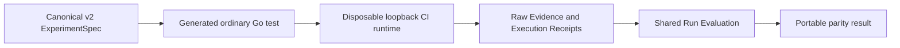

# Hermetic CI execution and Run Evaluation

> HTML render lens (local): open `.flow/artifacts/fn-27-hermetic-ci-execution-and-qualification/spec.html` — regenerable, markdown is the record. <!-- flow-next:artifact-link -->

## Intent

Prove portability by running the byte-identical canonical v2 `ExperimentSpec` used locally through the ordinary CI test command and the same runner and Run Evaluation interfaces. CI changes operational bindings only; it never recompiles semantic meaning, rewrites the Artifact, or introduces a CI-specific evaluator.

This is a bounded hermetic execution proof, not a Claim Assessment platform. It adds no Evaluation Profile, Evaluation Receipt, provenance schema, artifact-set version, release evidence, or environment-specific copy of Feature/System meaning.

## Architecture



The CI path consumes the same exact Artifact bytes, Artifact Checksum, Definition IDs, Behavior Fingerprints, Limits, Known Gaps, Observation program, Implementation Link, query, and Properties as the local path. The generated test uses the existing runner lifecycle and the fixed Run Evaluation boundary; workflow YAML is orchestration only and cannot construct semantic declarations.

The CI runtime is invocation-owned, loopback-only, hermetic, bounded, and fully cleaned up. It accepts no endpoint, credential, namespace selector, arbitrary executable, plugin, or network authority. Each run retains Execution, Observation Evaluation, Implementation Link, Property, cleanup, and tooling outcomes separately.

## API Contracts

- One generated Go test admits the exact v2 Artifact and invokes the shared runner and Run Evaluation APIs.
- The Artifact bytes, format version, Artifact Checksum, and Behavior Fingerprints are checked before runtime IO and compared with the local subject.
- The runtime uses fixed loopback bindings, concurrency one, declared phase/Evidence Limits, and deterministic cleanup.
- The shared Run Evaluation authority alone interprets Evidence; CI code and workflow YAML do not map facts or evaluate Properties.
- Equivalent local and CI Evidence produces the same Observation Evaluation, Implementation Link, Property, and Run Evaluation meaning while run-specific transport identities may differ.
- Drift, recompilation, mixed Artifact versions, missing closure, environment leakage, or incomplete cleanup fails closed and cannot be reported as portable success.
- The public surface is the ordinary pinned CI test command plus the aggregate repository gate. There is no separate CI Claim Assessment command.

## Edge Cases & Constraints

- Artifact drift is detected before environment creation.
- Exactly-at-Limit execution and Evidence are admitted; Limit plus one follows the owning runner or Run Evaluation failure.
- Cancellation kills and reaps the disposable runtime, closes participants, verifies cleanup, and publishes no partial output.
- A valid operational or semantic non-success remains inspectable and cannot be collapsed into a tooling success.
- CI-specific semantic declarations, Evidence mappers, Implementation Links, Properties, or generated Artifact rewrites are forbidden.
- No Evaluation Profile, Evaluation Receipt, provenance Artifact, new artifact-set version, Claim Assessment policy, remote staging, production, or release control plane is added.

## Quick commands

```bash
cd model && mise exec -- lake build Temporal.Tool.RunEvaluationTests
mise exec -- go test -count=1 ./tools/umpire/runtime/... ./tools/umpire/runevaluation/... ./tools/umpire/temporal/nexus/...
mise exec -- go test -count=1 ./tools/umpire/temporal/nexus/... -run '^TestHermeticCIPortability$'
mise exec -- make umpire-check-regression
```

## Acceptance Criteria

- **R1:** CI consumes the byte-identical canonical v2 `ExperimentSpec` used locally and checks its format version, Artifact Checksum, Definition IDs, and Behavior Fingerprints before runtime IO. Errors: recompilation, checksum/fingerprint drift, unsupported version, noncanonical bytes, or incomplete closure performs no runtime IO and fails the portability proof.
- **R2:** One ordinary generated Go test uses the shared runner with a bounded invocation-owned loopback environment, fixed concurrency, and deterministic cleanup. Errors: external endpoint, credential, arbitrary executable, undeclared network authority, Limit drift, participant leak, or incomplete cleanup fails closed.
- **R3:** CI delegates Evidence interpretation to the same Run Evaluation authority used locally and retains Execution, Observation Evaluation, Implementation Link, Property, cleanup, and tooling outcomes separately. Errors: CI-specific mapper/evaluator, direct Evidence-to-Feature translation, status collapse, or Property reevaluation fails completion.
- **R4:** Equivalent local and CI Evidence has the same Behavior Fingerprints and Run Evaluation meaning while allowed runtime transport identities remain distinct. Errors: environment-specific semantic copies, changed Model Trace/Fact meaning, or nondeterministic evaluation fails the parity proof.
- **R5:** Cancellation, timeout, Limit N+1, malformed Evidence, semantic non-success, and cleanup failure are diagnosed at their owning boundaries with no partial publication or false portable-success result.
- **R6:** The public CI surface is the ordinary pinned test command and aggregate repository gate. Errors: a second runner command, custom Claim Assessment workflow, profile selector, semantic flags, or workflow-assembled check list fails completion.
- **R7:** Focused mutation and negative fixtures reject Artifact drift, mixed versions, semantic recompilation, authority leakage, Limit drift, and cleanup leakage without sharing implementation logic with the checks under test.
- **R8:** Contributor and architecture documentation state the exact portability claim and exclusions, preserve existing comments, and introduce no Evaluation Profile, Evaluation Receipt, provenance schema, new artifact-set version, Claim Assessment, remote, canary, or release claim.

## Validation Strategy

The first proof is a generated test that admits the exact local v2 Artifact and fails before runtime IO on one-byte or fingerprint drift. The end-to-end proof then runs that Artifact through the disposable CI runtime and shared Run Evaluation boundary, comparing stable meaning with the local result. Independent mutation fixtures cover each rejection boundary.

## Task Mapping

| Requirement | Tasks | Status |
|---|---|---|
| R1 | `.1`, `.4`, `.8` | — |
| R2 | `.2`, `.5`, `.7` | — |
| R3 | `.3`, `.5`, `.7` | — |
| R4 | `.3`, `.4`, `.7` | — |
| R5 | `.2`, `.5`, `.7`, `.8` | — |
| R6 | `.6`, `.9` | — |
| R7 | `.4`, `.7`, `.8`, `.9` | — |
| R8 | `.9` | — |
