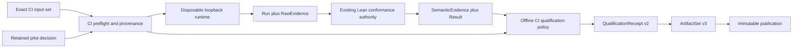

# Hermetic CI execution and qualification

> HTML render lens: local file `.flow/artifacts/fn-27-hermetic-ci-execution-and-qualification/spec.html` — regenerable, markdown is the record. <!-- flow-next:artifact-link -->

## Umpire4 architecture reconciliation

CI runs the same complete ExperimentSpec through generated Go tests and the shared runner/conformance/qualification interfaces; only operational bindings and the CI profile differ. CI never receives an environment-specific copy of semantic meaning and does not depend on the retired fn-14 pilot.

The CI profile also runs the model-declared per-commit `umpire-check-model` profile and binds its admitted verification receipt when required by qualification policy. CI orchestration selects a profile; it does not enumerate or reconstruct individual semantic checks.

## Overview

Add the second current-model C12 profile: execute the same checked caller-closure `ExperimentSpec`
inside one disposable CI runner, interpret the resulting evidence through the existing Lean semantic
authority, and publish a CI-scoped qualification receipt. The profile is deliberately narrower than
release trust. It records bounded, self-reported GitHub Actions provenance and proves an isolated
loopback execution closure, but it has no remote endpoint, credential, deployment, canary, formal,
or release authority.

The implementation composes the existing runtime, conformance, qualification, and immutable
artifact modules behind one end-to-end command. It does not introduce a second semantic evaluator or
make users manually shuttle three intermediate commands. The local profile and every existing v1/v2
wire reader remain byte-for-byte unchanged; CI enters only through reviewed new schema versions.

## Architecture and data flow



The semantic root is the same byte-identical `ExperimentSpec` artifact used by the local path. CI
adds a distinct checked `RuntimeConfiguration` whose runtime profile is
`temporal.runtime-profile.ci-hermetic`, so the runtime-configuration, run, and transport identities
are intentionally different while the experiment semantic identity remains identical.

`tools/umpire/runtime` continues to own the phase machine and inert evidence construction;
`tools/umpire/conformance` continues to own the fixed Go-to-Lean bridge;
`tools/umpire/qualification` continues to own offline policy evaluation; and the generic artifact
module remains the only persisted-byte reader and publisher. A small CI orchestration module owns
only fixed-context collection and ordered composition of those APIs. It cannot interpret a raw fact,
evaluate a Property, choose a profile, acquire external authority, or publish an intermediate set.

## Exact CI profile

`QualificationProfile/v1` remains local-only. `QualificationProfile/v2` is a new closed schema for
this slice. It retains the v1 policy fields and adds exactly `executionBoundary` and
`provenanceRequirements`; its only admitted environment class is `ci` and its only admitted claim
strength is `environment-qualified-ci`.

The sole v2 instance is `umpire.qualification-profile.ci-hermetic`, version 2. It requires:

- the exact CI runtime profile and existing caller-closure evidence profile, operational
  `succeeded`, evidence qualification `qualified`, semantic `satisfied`, all five runtime phases
  succeeded, all four existing sources closed, and the complete cleanup closure;
- runtime authority capabilities for an invocation-owned in-process server, SDK workers, complete
  history reading, loopback transport, and runner-temporary publication;
- forbidden external endpoint, credential, secret-provider, pre-existing-cluster, remote namespace,
  deployment, canary, release, and non-loopback network authority capabilities;
- exact self-reported GitHub Actions context, source revision, workflow definition, runner image,
  toolchain, repository material, output-isolation, and tracked-worktree-integrity projections;
- formal evidence policy `not-provided` and the exact accepted omissions
  `ci-provenance-self-reported`, `builder-authentication-not-provided`, and
  `dependency-materialization-not-attested`.

The hermetic claim begins after repository/tool materialization and ends only after isolation and
cleanup. Checkout, action download, and tool installation happen before that boundary and are
recorded by digest but are not claimed to be network-hermetic or authenticated. During the execution
boundary the adapter exposes only the loopback LiteServer created for that invocation; the runtime
accepts no endpoint, namespace, credential, proxy, arbitrary executable, retry, or authority option.

`executionBoundary` is exactly `{kind:"disposable-loopback",workspacePolicy:"tracked-read-only",
outputPolicy:"runner-temp-only",cachePolicy:"disabled",networkPolicy:"loopback-only",
cleanupPolicy:"owned-resources-closed"}`. The reusable schema treats these as checked inert values;
the concrete Temporal profile supplies their exact meanings without moving domain vocabulary into
reusable Umpire packages.

## CI provenance and trust boundary

`CIProvenance/v1` is a bounded reusable value embedded in the v2 receipt, not a signature or a new
top-level artifact. Every field is required, arrays are non-null, no scalar is nullable, and its exact
field order is:

`{formatVersion,trustClass,provider,repository,sourceRevision,workflow,invocation,runner,toolchain,
materials,isolation,omissions,semanticDigest,provenance}`.

Its nested canonical records are exact:

- `repository = {owner,name}` uses two 1–128-byte lowercase GitHub name strings; the compiled
  Temporal profile fixes their values. `sourceRevision = {commitSha,treeSha}` uses two 40-character
  lowercase hexadecimal Git object identities. The collector requires the CI commit to equal
  checked-out `HEAD`, recomputes its tree, and refuses a dirty tracked worktree before execution.
- `workflow = {identity,ref,definitionSha256}` uses the fixed 1–256-byte repository-relative workflow
  identity, a 1–512-byte full Git ref, and the 64-character lowercase SHA-256 of the checked-out
  workflow bytes. The compiled profile pins identity and digest; changing triggers, permissions,
  action pins, or commands requires a reviewed profile update.
- `invocation = {event,runId,runAttempt,ref}` has event exactly `workflow_dispatch`, unsigned positive
  64-bit run ID, unsigned positive 32-bit attempt at most 1024, and the same full ref as `workflow`.
  The command run identity is exactly `umpire.ci.github.<runId>.attempt-<runAttempt>` and the explicit
  `--run-id` must equal it.
- `runner = {class,label,os,arch,imageOS,imageVersion}` fixes class `github-hosted`, label
  `ubuntu-24.04`, OS `linux`, and architecture `x64`; the final two normalized GitHub image values are
  1–128 bytes each. Hostname, runner name/group, job URL, timestamps, and filesystem paths are absent.
- Each `toolchainEntry = {identity,version,distributionSha256}` has a closed identity and 1–128-byte
  normalized version plus a lowercase SHA-256. `toolchain` contains exactly four entries in
  `go|lake|lean|mise` identity order. The collector uses only fixed commands, hashes the resolved
  regular distribution/executable bytes without persisting their paths, and rejects duplicate,
  symlinked, missing, or noncanonical values.
- Each `material = {path,contentSha256}` has a fixed repository-relative path and lowercase SHA-256.
  `materials` contains exactly six entries sorted by path: the root Go module/checksum and Mise
  configuration plus the Lean toolchain, Lake configuration, and Lake manifest. Missing, extra,
  duplicate, symlinked, non-regular, changed, or N+1 material rejects before execution.
- `isolation = {preflight,postflight}`. `preflight = {trackedTreeStatus,inputRootStatus,
  outputRootStatus,cachePolicy,networkPolicy}` is exactly `clean|contained|contained|disabled|
  loopback-only`. `postflight = {trackedTreeStatus,resourceStatus,authorityStatus}` uses respectively
  `unchanged|changed|unknown`, `closed|leaked|unknown`, and
  `loopback-only|non-loopback-observed|unknown`. Preflight is frozen in a checked in-memory value
  before runtime creation; postflight is observed only after conformance and the runtime's isolation/
  cleanup have terminated. The final `CIProvenance` cannot be constructed from preflight alone.
- `omissions` is exactly the three profile-declared Omissions in canonical Omission order.
  `provenance` is the existing exact `ArtifactProvenance = {sourceIdentities,sources}` record and
  retains all of its nested ordering and limits.

`semanticDigest` is `umpire-semantic/v1:` plus SHA-256 over canonical JSON of every field from
`formatVersion` through `omissions`, excluding itself and `provenance`. The enclosing receipt-identity
projection includes the same complete CI semantic projection but excludes nested and outer
`ArtifactProvenance`; the receipt artifact identity includes the nested provenance through ordinary
artifact bytes. No implementation may hash a raw environment block or substitute the semantic digest
for the inline value.

The collector reads only an allowlist of CI variables and fixed bounded command results. Unknown
environment variables are ignored rather than serialized. The provenance object is at most 1 MiB,
other strings are 1–512 valid UTF-8 bytes unless tightened above, and the collector gets a 10-second
total deadline with 1 MiB combined command output. Preflight and postflight each re-run the tracked
tree check; a changed or unobservable postflight tree can never be accepted. Test-only injection
remains package-private.

An accepted CI receipt therefore means “the exact experiment satisfied its properties under this
exact disposable CI execution and self-reported environment policy.” It is never release-eligible by
itself. Authenticated workload identity, signed builder provenance, artifact attestation, protected
environment approval, and release aggregation are explicitly deferred.

## Execution and semantic conformance

The exact CI input is an admitted two-member ArtifactSet v1 containing the byte-identical checked
caller-closure ExperimentSpec and one CI RuntimeConfiguration. The configuration uses seed zero,
attempt one, the existing five phase budgets and four evidence sources, the fixed Nexus participant
program, and the CI runtime profile. Any local runtime profile, different target/action/occurrence,
fault, budget, participant, evidence profile, capability union, or semantic reference fails before
environment creation.

The CI adapter reuses the existing loopback lifecycle and participant. It does not fork a new runtime
engine or add a pre-existing server mode. Runtime output is the ordinary four-member ArtifactSet v1;
conformance output is the ordinary six-member ArtifactSet v1. All input members remain byte-identical
at each stage. The conformance controller is generalized only enough to admit the exact local or CI
runtime profile against the same compiled mapping/query/Property/source closure. Its checker protocol,
30-second bound, semantic rules, result schema, and local public command remain unchanged.

The end-to-end controller retains failed or incomplete runtime and semantic outcomes as inspectable
evidence whenever the existing modules can construct a valid set. It then applies the CI policy and
publishes a rejected or incomplete receipt. Structural input, provenance, checker, invariant, or
publication failures are tooling errors; they cannot synthesize a qualification receipt. No stage
automatically reruns, reinterprets a prior status, or turns infrastructure success into semantic
satisfaction.

SIGINT/SIGTERM stops new primary work and enters the existing independently bounded isolation and
cleanup path. Because all runtime authority is invocation-owned and in-process, abrupt runner loss
cannot leave a remote operation or namespace. Acceptance still requires explicit successful cleanup;
missing or uncertain cleanup yields a truthful non-success result when construction remains valid.

## Receipt and artifact-set evolution

`umpire-qualification-receipt/v1` remains local-only and unchanged.
`umpire-qualification-receipt/v2` retains the v1 semantic/status bindings and adds the exact
`CIProvenance/v1` value after `environment`. Its field order is:

`{formatVersion,profile,pilotDecision,sourceArtifactSetIdentity,result,
experimentSemanticIdentity,runtimeConfigurationSemanticIdentity,runIdentity,semanticScope,
environment,ciProvenance,operationalStatus,qualificationStatus,semanticStatus,evidence,cleanup,
formalEvidence,decision,omissions,receiptIdentity,artifactIdentity,provenance}`.

The profile, pilot, six-member source closure, pathless Result reference, experiment/configuration/
run identities, semantic scope, statuses, evidence closure, cleanup, absent formal evidence, decision,
and omission union retain the v1 meanings. The environment class is exactly `ci`, the runtime profile
is exactly CI-hermetic, and the CI provenance profile/digest must match independently. Accepted
receipts require the retained pilot outcome `LEAN_FIRST_GO`; the other valid pilot outcomes and every
operational/evidence/semantic/cleanup condition use the existing exhaustive reason accumulation and
rejected-over-incomplete precedence.

V2 adds only the closed reasons `ci-isolation-failed|ci-isolation-incomplete` for structurally valid
post-start outcomes. All applicable rows accumulate alongside the complete fn-26 reason table:

| Exact condition | Added reason | Decision class |
| --- | --- | --- |
| Postflight tracked tree is `changed` | `ci-isolation-failed` | rejected |
| Postflight resource status is `leaked` | `ci-isolation-failed` | rejected |
| Postflight authority is `non-loopback-observed` | `ci-isolation-failed` | rejected |
| Postflight tracked tree, resource status, or authority status is `unknown` | `ci-isolation-incomplete` | incomplete |

Multiple failed and incomplete isolation fields still add each reason only once. Rejected-class
reasons dominate incomplete-class reasons exactly as in fn-26; otherwise any incomplete reason wins,
and only a row-free complete result may have reasons exactly `["accepted"]`. Existing operational,
source, cleanup, semantic, pilot, and CI-isolation reasons are never collapsed into one another.

Missing, malformed, forged-by-parameter, crossed, stale, wrong-workflow, wrong-material,
wrong-runner-class, profile-divergent, or internally inconsistent preflight provenance is a tooling
error before runtime and produces no receipt. Unsafe output containment discovered at either
preflight or the final publication recheck is also a tooling error: the in-memory post-start result
may exist, but no write is attempted through the unsafe root. The three expected trust/materialization
omissions do not make the receipt incomplete because the profile declares them; any missing, extra,
or changed omission fails admission.

`receiptIdentity` uses the v2 prefix and the canonical projection of every field through `omissions`,
with `ciProvenance.provenance` and the receipt's outer provenance excluded. Thus source revision,
workflow definition, runner/toolchain/material identities, isolation, and run identity are
claim-bearing, while source-code provenance, absolute paths, timestamps, job URLs, hostnames, and
output destinations are not. The v1 64-MiB byte and 1,048,576-token ceilings remain the v2 receipt
ceilings; the bounded CI projection fits within those budgets and receives its own equality and N+1
tests.

ArtifactSet v1 and the local seven-member ArtifactSet v2 remain closed and unchanged. New
`umpire-artifact-set/v3` contains exactly the six byte-identical CI conformance members plus one v2
qualification receipt and one `qualification-result` relation to its Result. V3 reconstructs and
checks the exact six-member source-set identity, every CI/configuration/provenance binding, and the
single receipt/result closure. V1 and v2 readers reject v3; the v3 reader accepts no local receipt,
extra attestation artifact, mixed run, partial closure, or descendant set. This is a derived set with
no migration or input rewrite and it uses the existing immutable atomic publisher.

## End-to-end command and workflow

The sole direct command is:

```text
umpire-qualify-ci --set <directory> --pilot-evidence <directory> --output-root <directory> --run-id <namespaced-id>
```

It admits the exact CI input and pilot evidence, verifies CI provenance/profile before runtime IO,
runs the existing runtime, checks the resulting evidence, applies the offline CI qualification, and
publishes only the final v3 set. It resolves the fixed semantic checker and qualification-profile
exporter as verified siblings. It accepts no profile, checker, workflow, provider, repository,
provenance file, endpoint, credential, namespace, task queue, executable, seed, attempt, timeout,
retry, release, or output-format override.

Production invocation is CI-only: absence of the exact checked GitHub Actions context is a provenance
error, not a local fallback. Before runtime, the controller `Lstat`s every existing component of the
workspace, input, runner-temp, and output roots; rejects symlinks and non-directories; resolves physical
paths; requires the read-only input to be a strict descendant of the workspace; requires output to be
a strict descendant of runner-temp and physically disjoint from the entire workspace (and therefore
from input); and uses component-aware relative-path checks for both relationships. There is no third
source root. It retains the resolved root/file identities. Immediately before the sole publisher
call, under the publication lock, it repeats `Lstat`, physical containment, workspace/output
disjointness, and retained-identity checks. Any mismatch, alias, replacement, or containment race is a
tooling error and no unsafe publication is attempted.

The success/result summary is one canonical LF-terminated object with format
`umpire-ci-qualification-summary/v1` and exact ordered fields
`{formatVersion,profileIdentity,trustClass,sourceCommit,sourceTree,workflowDefinitionSha256,
runIdentity,operationalStatus,qualificationStatus,semanticStatus,decision,claimStrength,
receiptIdentity,qualificationReceiptArtifactIdentity,artifactSetIdentity,manifestSha256,
destination}`. Status 0 means accepted and published. Status 2 means a valid rejected/incomplete v3
set was published. Both use stdout only.

Tooling failure is one canonical stderr object with format `umpire-ci-qualification-error/v1` and
ordered fields `{formatVersion,kind,phase,code,subject,executionOccurred,checkingOccurred,
qualificationOccurred,publicationOccurred,runIdentity,receiptIdentity,artifactSetIdentity,
manifestSha256,destination}`. Kinds are
`arguments|input|pilot|provenance|profile|runtime|checker|invariant|publication|reporting`; phases are
`admission|pilot|provenance|profile|execution|conformance|decision|construction|publication|reporting`.
Status 1 writes no success stdout. Reporting failure after publication sets all applicable booleans
and returns the immutable destination so callers do not rerun.

The repository-root Makefile adds only:

```text
make umpire-qualify-ci SET=<directory> PILOT_EVIDENCE=<directory> OUTPUT_ROOT=<directory> RUN_ID=<namespaced-id>
```

All variables are required and checked before execution. No model-local Makefile or default target is
changed.

A dedicated `workflow_dispatch` workflow has `contents: read` and no secret, environment,
deployment, package-write, pull-request-write, or OIDC permission. It pins every action by full commit
SHA, disables caches, uses one fixed hosted runner, has a 30-minute job timeout and ref-scoped
cancel-in-progress concurrency, builds the fixed sibling closure, and invokes the root target over the
checked-in CI input and retained pilot evidence. Output lives only below runner temporary storage.
An `always()` upload retains the bounded result directory for seven days when one exists; upload
transport is not trust evidence. A valid status-2 result is uploaded and then fails the job. The
workflow has no trigger or dependency edge from default tests, pull requests, pushes, releases, or
deployments.

## Verification strategy

- Pin exact v2 profile/export/provenance bytes and digests while proving v1 local fixtures and readers
  remain byte-identical.
- Exercise CI preflight with missing, malformed, N+1, crossed, stale, wrong-workflow, wrong-material,
  mutated tracked-tree, symlink, wrong-run/attempt, unexpected environment, and secret-like inputs;
  every failure occurs before runtime creation.
- Mutate the tracked tree, retained root identities, root components, aliases, and containment after
  preflight; prove postflight status/reasons are deterministic and the final lock-guarded containment
  check never publishes through a changed or symlinked root.
- Reuse the independent runtime phase/failure oracle across the CI profile and prove exactly one
  environment/participant/cleanup lifecycle, loopback-only authority, no surviving handles, and no
  output below the source checkout.
- Run the ordinary checker over both fixed local and CI configurations and prove identical semantic
  meaning for equivalent evidence while their configuration/run/transport identities remain distinct.
- Mutate every v2 receipt/provenance/status/reason/omission/binding and every v3 member/relation; prove
  exact N/N+1 behavior, v1/v2/v3 cross-rejection, source-member byte preservation, and idempotent
  publication.
- Test direct/root statuses 0/1/2, cancellation at every stage, publication/reporting ambiguity, and
  the manual workflow's trigger/permission/action-pin/cache/path/upload constraints without requiring
  a live GitHub run in unit tests.

## Quick commands

```bash
cd model && mise exec -- lake build Umpire.Qualification.Tests Temporal.System.Execution.CIProfileTests Temporal.System.Qualification.CITests Temporal.Tool.ConformanceTests temporal-conformance-checker temporal-qualification-profile
go test -count=1 ./tools/umpire/artifact/... ./tools/umpire/runtime/... ./tools/umpire/conformance/... ./tools/umpire/qualification/... ./tools/umpire/ci/... ./tools/umpire/cmd/umpire-qualify-ci/...
go test -count=1 ./tools/umpire/ci/... -run '^TestCIQualificationEndToEnd$'
make umpire-check-regression
```

## Boundaries / non-goals

- No remote/staging/public endpoint, cloud credential, reusable deployment adapter, namespace lease,
  canary action, traffic exposure, production read/write, or cleanup reconciler is added.
- No authenticated workload identity, OIDC verification, signed builder provenance, artifact
  attestation, protected-environment approval, release evidence graph, release decision, promotion,
  or deployment action is claimed.
- No new Property, Behavior, Query, Observation mapping, scenario, fault, checker meaning, artifact
  repair, migration command, dynamic profile selector, or general CI matrix is introduced.
- No default/PR/push/release workflow, model-local Makefile, generated-regression projection, glossary,
  public API documentation, or legacy dependency is changed.

## Decision context

- A distinct CI RuntimeConfiguration is required because an environment-qualified result must bind
  the authority/profile actually used. Relabeling local artifacts would destroy that invariant;
  duplicating the runtime engine would destroy reuse.
- One end-to-end command is the public surface because runtime, conformance, and qualification are
  implementation stages of one CI goal. Their library APIs and artifact boundaries remain separate
  and inspectable without forcing users to coordinate intermediate directories.
- Self-reported CI provenance is useful for reproducibility and audit but is not authenticated.
  Recording that limitation as exact trust and omission values is safer than silently treating CI
  environment variables or uploaded artifacts as release evidence.
- A new receipt and set version preserves the local schemas' closed-world guarantees. Silent enum or
  relationship expansion is forbidden and no migration is needed because CI derives a new set.

## Acceptance Criteria

- **R1:** One reusable Temporal-free QualificationProfile v2 validates the exact CI environment,
  execution-boundary, provenance-requirement, formal-evidence, omission, and claim vocabulary, while
  one Temporal profile binds only the existing caller-closure runtime/evidence/cleanup semantics.
  Errors: v1 broadening, domain vocabulary in reusable Umpire, empty/duplicate/contradictory policy,
  authority drift, unknown environment/claim, or digest mutation fails completion.
- **R2:** One exact two-member CI input preserves the local ExperimentSpec byte-for-byte while binding
  a distinct CI RuntimeConfiguration, and the existing bounded runtime realizes it under one
  invocation-owned loopback lifecycle with the existing phase/evidence limits. Errors: local/mixed
  profile, changed semantic root, target/action/fault/budget/capability drift, endpoint/credential/
  namespace option, non-loopback authority, source-checkout write, duplicate lifecycle, or surviving
  handle fails before acceptance.
- **R3:** The existing conformance authority admits exactly the local or CI compiled runtime profile
  for the same closed semantic program and emits the ordinary v1 SemanticEvidence/Result closure
  without changing checker protocol or meaning. Errors: arbitrary profile/checker/property/program,
  Go fact interpretation, semantic-reference drift, partial verdict partition, or local-command byte/
  behavior change fails completion.
- **R4:** Bounded CIProvenance v1 records and cross-checks exact source, workflow, invocation, runner,
  toolchain, material, trust, omission, immutable preflight, and observed postflight projections while
  excluding paths, secrets, endpoints, logs, hostnames, and arbitrary environment values. Errors:
  missing, extra, duplicate, stale, mutable, symlinked, N+1, secret-bearing, caller-supplied, or
  mismatched preflight performs no runtime IO; changed/unknown postflight follows the exact isolation
  reason table and cannot support an accepted claim.
- **R5:** QualificationReceipt v2 and ArtifactSet v3 bind the exact pilot, six source members, Result,
  semantic/configuration/run identities, CI provenance, independent statuses, cleanup, formal absence,
  decision, and omission union with exact canonical identities and immutable publication. Errors:
  incompatible version, local/CI crossing, stale source tree, changed workflow/toolchain/runner,
  missing/extra member or relation, invalid reason/omission, byte/token/cardinality N+1, or rewritten
  source member fails admission or yields only the specified non-success decision.
- **R6:** One deep end-to-end controller performs ordered preflight, runtime, conformance, offline
  policy, construction, and final publication without semantic reinterpretation or hidden authority;
  it preserves operational, evidence-qualification, semantic, cleanup, trust, and tooling outcomes
  independently. Errors: cancellation, stage failure, valid non-success, publication conflict, or
  broken reporting follows the exact status/boolean contract and never auto-runs or republishes.
- **R7:** The exact direct/root command and isolated manual workflow have closed arguments, summaries,
  errors, time/size/retention bounds, pinned actions, read-only permissions, no secrets/OIDC/cache,
  read-only input below the workspace, physically disjoint runner-temp output, and no default/release
  coupling; production command use outside the checked CI context is rejected. Errors: missing/extra
  arguments, unpinned action, broader trigger/permission, symlink/alias/component race, workspace-root
  output,
  status-2 evidence loss, or model-local Make change fails verification.
- **R8:** Independent profile/provenance/runtime/conformance/receipt/set/CLI/workflow mutation matrices,
  focused and aggregate Lean/Go checks, the stable regression gate, and scoped contributor docs prove
  the CI-only claim. Errors: nondeterminism, wrong-boundary diagnosis, shared implementation/oracle
  logic, changed generated projection, local schema regression, remote/canary/release claim, missing
  limitation, or lost existing comment fails completion.
- **R9:** CI consumes the byte-identical complete ExperimentSpec through generated Go tests and the shared runner/conformance path; only operational bindings and profile evidence differ from local execution. Errors: CI-specific semantic copies, a second run command/evaluator, regenerated meaning in Go/workflow YAML, or changed ExperimentSpec digest cannot qualify.
- **R10:** The CI profile invokes the model-declared per-commit `umpire-check-model` profile and binds its admitted verification receipt or an explicit policy-approved omission; fn-14 evidence is neither required nor accepted. Errors: workflow-assembled check lists, missing/stale profile digest, trust-class collapse, or treating an absent receipt as established verification fails qualification.

## Early proof point

Task fn-27-hermetic-ci-execution-and-qualification.1 proves that a closed, versioned CI policy can
express the hermetic execution and honest self-reported trust boundary without weakening local v1.
If it fails, reconsider the profile/provenance split before extending runtime, artifact, or workflow
surfaces.

## References

- Flow spec fn-14 — retained pilot-decision evidence and strict reader.
- Flow spec fn-18 — canonical artifact schemas, admission, set validation, and publication.
- Flow spec fn-19 — five-phase runtime, loopback lifecycle, participant, evidence, and limits.
- Flow spec fn-20 — fixed conformance bridge and semantic authority.
- Flow spec fn-26 — local qualification profile, receipt, decisions, and staged C12 boundary.
- Umpire DSL/component plans — profile-qualified Result doctrine and C12 environment sequence.

## Requirement coverage

| Req | Description | Task(s) | Gap justification |
| --- | --- | --- | --- |
| R1 | QualificationProfile v2 and exact Temporal CI policy | `.1` | — |
| R2 | CI RuntimeConfiguration and disposable execution | `.2`, `.5`, `.7`, `.9` | — |
| R3 | CI admission through the canonical conformance authority | `.3`, `.5`, `.7`, `.9` | — |
| R4 | Bounded honest CI provenance and two-stage isolation | `.1`, `.4`, `.5`, `.7`, `.9` | — |
| R5 | QualificationReceipt v2 and ArtifactSet v3 | `.4`, `.8`, `.5`, `.7`, `.9` | — |
| R6 | End-to-end orchestration and status preservation | `.5`, `.6`, `.7`, `.9` | — |
| R7 | Direct/root command and isolated manual workflow | `.6`, `.7`, `.9` | — |
| R8 | Independent verification and scoped documentation | `.7`, `.9` | — |
| R9 | Complete ExperimentSpec through generated CI tests | `.2`, `.3`, `.5`, `.7` | — |
| R10 | Per-commit native model verification without pilot gate | `.5`, `.6`, `.9` | — |


