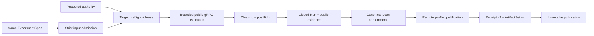

# Authorized remote staging black-box execution and qualification

> HTML render lens: local file `.flow/artifacts/fn-28-authorized-remote-staging-black-box/spec.html` — regenerable, markdown is the record. <!-- flow-next:artifact-link -->

## Umpire4 architecture reconciliation

Remote staging is authorized only when a named Temporal operational owner supplies the closed profile, protected workflow/environment, credentials, leases, cleanup/recovery policy, and retained-artifact channel. It consumes the same complete ExperimentSpec and shared runner/conformance/qualification contracts as local and CI; no staging-specific semantic copy or fn-14 pilot gate exists.

## Overview

Add the first authorized non-loopback C12 profile for the current semantic model. The profile runs
the same byte-identical ExperimentSpec used by the local and CI slices against one preallocated
Temporal staging namespace and Nexus endpoint, observes only the public gRPC boundary plus
runner-owned participant receipts, reuses the canonical Lean conformance authority, and publishes a
profile-scoped qualification receipt.

The production path is intentionally closed: one manual protected workflow, one compiled runtime
and qualification profile, one out-of-band mTLS authority bundle, one server-enforced lease, one
bounded caller-closure action, and one immutable output. No command argument can select an endpoint,
namespace, credential, semantic checker, action, retry policy, or claim strength.

## Goal & Context
<!-- scope: business -->

Local and hermetic CI qualification prove that the semantic artifact and checker composition work in
disposable environments. They do not prove that the same semantic identity survives an authorized
remote boundary with weaker evidence, external target identity, shared infrastructure, and cleanup
obligations. This slice gives developers and operators one inspectable staging answer without
generalizing it into production readiness.

Developers receive a comparable ExperimentRun, Result, and qualification receipt for the same
ExperimentSpec. Operators receive a manual, least-privilege workflow whose authority, target,
limits, cleanup, omissions, and escalation behavior are explicit. Release automation receives no
new eligibility signal.

## Architecture & Data Models
<!-- scope: technical -->



### Ownership and purity

The reusable qualification package adds only domain-neutral v3 vocabulary for a remote environment,
authority capabilities, target/lease attestations, public-boundary evidence requirements, cleanup,
trust, and profile-scoped claim strength. It contains no Temporal, Nexus, staging target, endpoint,
namespace, task queue, credential, workflow-provider, repository, or checker name.

Temporal-owned modules define the concrete `remote-staging-public-grpc` runtime and qualification
profiles, the fixed caller-closure program binding, and the public-evidence Observation mapping. The
existing pure Query, Property, Behavior, transition kernel, and Result semantics remain unchanged.
The Go remote adapter owns secret-bearing authority acquisition and public Temporal transport. The Go
staging controller composes admission, execution, conformance, qualification, receipt construction,
and publication without interpreting semantic facts.

### Exact profile

`QualificationProfile/v3` adds one generic remote environment class and the reusable requirements
needed by this slice. Its only compiled Temporal instance is
`temporal.qualification-profile.remote-staging-public-grpc`, version 3. It requires the exact remote
RuntimeConfiguration, public-history and participant/control/cleanup evidence closures, operational
success, qualified evidence, satisfied semantics, complete cleanup, protected-environment mTLS
authority, target identity stability, an exclusive lease, formal evidence not provided, and claim
strength `environment-qualified-remote`.

The profile always records omissions for server-internal telemetry, in-process server state,
authenticated builder provenance, formal evidence, production traffic, canary coverage, and release
eligibility. Those omissions are compatible with an accepted staging receipt because the profile
never requires the missing capabilities.

### Protected authority and target identity

The production command reads one closed `ProtectedRemoteAuthority/v1` bundle from the fixed process
environment established by the protected workflow. The in-memory bundle contains the fixed
environment identity, TLS endpoint and server name, namespace, Nexus endpoint, root CA, client
certificate and key, and credential expiry. It is capped at 1 MiB, rejects unknown/duplicate/missing
fields and trailing data, requires a hostname TLS endpoint, and must remain valid through the total
run and cleanup budget. It is never accepted from a flag, stdin, repository file, artifact, or
unprotected workflow input.

Before mutation, the adapter proves the expected environment identity, certificate chain and server
name, client-certificate validity, registered namespace, exact Nexus endpoint target, and required
public API capabilities. The resulting target fingerprint is made only from checked identities and
SHA-256 digests; raw endpoints, namespace/task-queue names, certificate/key bytes, payloads, and
headers never enter an artifact, summary, error, log, or semantic identity. The fingerprint is read
again after cleanup. A preflight mismatch performs no remote mutation; post-dispatch drift yields an
incomplete receipt.

### Lease, blast radius, and cleanup

One fixed lease workflow ID serializes the protected environment. Acquisition uses conflict-fail
semantics and a unique invocation binding; only the winner starts a worker. The server-issued lease
run identity is the fence for all later mutations. An ambiguous start is resolved by one read-only
Describe against the expected invocation binding; no second start is sent. A conflicting or
unverifiable lease fails before experiment dispatch.

The lease and caller workflows have server-enforced execution timeouts longer than their phase
budgets. The client sends each start command at most once and never redispatches an operation.
Target-owned Nexus delivery retry cannot be disabled through the public SDK, so every handler
delivery is correlated and retained while an idempotency guard permits exactly one semantic
force-close mutation. Duplicate delivery changes operational evidence, never semantic authority.
One worker, two run-owned workflows, one Nexus operation command, one semantic mutation, 64 public
API calls, one read-only ambiguity lookup per start, one 16-MiB RawEvidence v1 artifact, and eight
minutes wall time are hard maxima. Namespace, endpoint, task-queue, search-attribute, dynamic-
configuration, deployment, and server configuration mutation are forbidden.

Cleanup runs under a fresh bounded context on every exit after lease acquisition. It stops the Nexus
participant, closes or terminates only the fenced caller, releases or terminates only the exact lease
run, stops the worker/client, verifies both run-owned workflow identities are terminal, and then
rechecks the target fingerprint. Only after this step are RawEvidence, remote provenance,
conformance, qualification, and the receipt finalized.

Immediately after lease acquisition, the run mode atomically creates a mode-0600
`RemoteRecoveryRecord/v1` at the fixed runner-temp path supplied by the protected workflow and
updates it after dispatch and cleanup transitions. It contains the invocation binding, exact lease
workflow/run fence, deterministic caller identity, dispatch state, preflight fingerprint digest,
and expiry; it contains no endpoint, namespace, task queue, credential, payload, or artifact claim.
The record is not an Umpire artifact and is never uploaded. The same binary's closed reconcile mode
reads that record, re-acquires the protected authority, revalidates its invocation/target/fence, and
may only terminate or verify the exact recorded resources; it cannot dispatch, conform, qualify, or
publish. The always-run workflow step invokes reconciliation after a nonzero run and removes the
record only after terminal verification. Server execution timeouts remain the backstop when the
runner disappears before reconciliation can execute. Cleanup never deletes or alters the
preallocated namespace or endpoint.

### Black-box semantic evidence

The remote run retains the ordinary Run and RawEvidence v1 families. Its four allowed sources are
runner participant output, public workflow history, the public control receipt, and the cleanup/
reconciliation receipt. The Temporal-owned mapping accepts only the exact source schemas and derives
the existing caller-closure Observation coordinates; it does not inspect server logs, metrics,
database state, internal RPCs, or payload bodies.

Missing or ambiguous required public facts produce `unknown`; a profile incapable of exposing a
required coordinate produces `unsupported`; contradictory identity or ordering facts produce
`conflict`. None can become a satisfied semantic claim. Equivalent qualified facts continue through
the same pure Property evaluator and yield the same qualified-outcome identity as local and CI while
runtime, run, provenance, receipt, and artifact-set identities remain distinct.

### Persisted qualification boundary

`RemoteQualificationProvenance/v1` is a reusable, secret-free value containing authority mode and
expiry class, target pre/post fingerprint digests, lease/fence identity digests, invocation binding,
enforced limits, public capability/evidence closures, cleanup/reconciliation status, trust class,
and declared omissions. The concrete meanings and fixed values are Temporal-owned.

`QualificationReceipt/v3` retains the v2 receipt contract and adds the exact remote provenance plus
the remote environment/profile binding and remote-specific reason set. `ArtifactSet/v4` contains the
six byte-identical ordinary source members and one v3 receipt with the existing single
qualification-result relationship. V1, v2, and v3 set readers and v1/v2 receipt readers remain
byte-for-byte unchanged and reject descendant versions; this is a derived set, not a migration.

Remote-specific reasons accumulate with the existing pilot, operational, evidence, semantic, phase,
source, and cleanup reasons. `remote-authority-lost`, `remote-target-drift`,
`remote-dispatch-ambiguous`, and `remote-lease-unknown` are incomplete-class.
`remote-scope-escape`, `remote-fence-violation`, and a definitive run-owned cleanup failure are
rejected-class. Rejected dominates incomplete. Authority/profile/target/lease failure before the
experiment is dispatched is a tooling error with no receipt; after dispatch, every constructible
non-success result is published honestly with independent statuses intact.

## API Contracts
<!-- scope: technical -->

The only production binary has two closed modes:

```text
umpire-qualify-remote-staging run --set <directory> --pilot-evidence <directory> --output-root <directory> --run-id <id>
umpire-qualify-remote-staging reconcile --run-id <id>
```

Neither mode accepts a target, environment, endpoint, namespace, task queue, credential, profile,
property, action, timeout, retry, checker, executable, publication, or output-format override.
`run-id` is a bounded non-secret invocation identity used only to derive deterministic run-owned
resource IDs and provenance. The fixed protected workflow supplies it from its immutable run
identity. Reconcile reads only the fixed protected authority and recovery-record paths from the
workflow environment, performs no experiment or publication action, and treats a missing record as
a canonical no-op rather than starting a run.

Status 0 means an accepted remote-staging receipt was published. Status 2 means a valid rejected or
incomplete receipt was published. Status 1 means a tooling failure; it publishes no success summary
and reports whether remote dispatch, cleanup, and publication occurred so callers never infer that a
rerun is safe. Summaries and errors are canonical, secret-free, single-line records. A reporting
failure after immutable publication names the destination and forbids automatic rerun.

Long-running observability uses a separate bounded, secret-free `RemoteProgress/v1` JSONL channel at
the fixed runner-temp path supplied by the protected workflow; canonical stdout/stderr terminal
records remain unchanged. Events have only sequence, phase, state, elapsed/remaining-budget buckets,
dispatch/cleanup-required booleans, and a closed message code. Phases are authority, target, lease,
execution, cleanup, postflight, conformance, qualification, publication, and reconciliation; states
are started, heartbeat, completed, and failed. Phase transitions and at most one heartbeat per 30
seconds are capped at 256 events and 64 KiB. The workflow streams this channel to its job log and may
retain it as a diagnostic, but it never enters qualification artifacts or identities.

The repository-root Makefile exposes only the run mode through the corresponding fixed target with required set,
pilot-evidence, output-root, and run-id inputs. The separate manual workflow has no user-selected
target or semantic inputs, uses the fixed protected environment, pinned actions, read-only repository
permission, one concurrency group, a hard job timeout, runner-temp secret/output roots, and an
always-run evidence upload/cleanup path. It is not referenced by default CI, deployment, promotion,
canary, or release workflows.

## Edge Cases & Constraints
<!-- scope: technical -->

- Malformed input, authority, profile, target identity, or pilot evidence fails before remote
  mutation and publishes no receipt.
- Lease conflict or an ambiguous lease that cannot be proven to belong to this invocation starts no
  worker or experiment and performs no retry.
- Every ambiguous experiment dispatch is resolved by one exact read-only lookup; unresolved state is
  incomplete and cleanup proceeds without a second dispatch. Target-owned handler redelivery is
  recorded and deduplicated to one semantic mutation rather than claimed absent.
- Loss of authority, cancellation, target drift, participant crash, evidence truncation, missing or
  invalid recovery state, or public
  API unavailability after dispatch preserves all constructible evidence and cannot yield accepted.
- Scope escape or a definitive fenced cleanup failure is rejected even when the semantic Result is
  satisfied. Cleanup uncertainty is incomplete. Semantic violation remains rejected independently.
- Concurrent or repeated publication is idempotent only for byte-identical content; a conflicting
  writer, symlink/alias change, crossed source set, or changed output identity fails closed.
- Raw target coordinates, credentials, headers, payloads, arbitrary remote errors, and tenant data
  are never retained. Only closed error classes and checked digests cross the artifact boundary.
- A green synthetic public-gRPC integration harness proves protocol behavior, not that the protected
  staging environment was exercised. Only the manual protected workflow may issue the staging claim.

## Quick commands

```bash
cd model && mise exec -- lake build Umpire.Qualification.Tests Temporal.System.Execution.RemoteStagingTests Temporal.System.Qualification.RemoteStagingTests
go test -count=1 ./tools/umpire/temporal/remote/... ./tools/umpire/conformance/... ./tools/umpire/artifact/... ./tools/umpire/staging/...
make umpire-qualify-remote-staging SET=<input-set> PILOT_EVIDENCE=<pilot-evidence> OUTPUT_ROOT=<runner-temp-output> RUN_ID=<workflow-run-id>
make umpire-check-regression
```

## Boundaries
<!-- scope: business -->

- No arbitrary remote target, cloud, namespace, endpoint, scenario, action, property, or evidence
  profile selection.
- No namespace/endpoint provisioning or deletion, deployment mutation, fault injection, production
  traffic, canary control, or automatic remediation.
- No server-internal evidence, telemetry, payload retention, formal proof, authenticated builder
  provenance, cross-environment aggregation, release graph, or release eligibility.
- No new semantic Property, Behavior, Query, transition, planner, ExperimentSpec, or alternate
  semantic evaluator.
- No migration, compatibility alias, permissive reader, automatic rerun, scheduled/default workflow,
  or retained accepted staging fixture produced by tests.

## Decision Context
<!-- scope: both -->

Use a preallocated target and a fixed protected environment because target provisioning and generic
remote selection would enlarge both authority and blast radius without helping the first black-box
claim. Keep authority material out of semantic/runtime artifacts; possession and target checks are
operational provenance, while the ExperimentSpec remains portable.

Use a server-enforced workflow lease plus hard workflow timeouts instead of a new external lock or
cleanup service. This serializes the fixed task queue, gives every mutation a fence, and structurally
bounds residue if the runner disappears. A runner-temp recovery record and closed reconcile mode
cover ordinary process failure without becoming a second target-selection or execution surface.
Treat target-owned Nexus redelivery as observed operational evidence and enforce idempotent semantic
mutation because the public SDK cannot truthfully disable the server policy. Reuse ordinary
Run/RawEvidence/Result artifacts and the canonical Lean checker rather than inventing a remote
semantic IR. Defer production canary and release aggregation because their authority and claim
classes are different.

## Acceptance Criteria
<!-- scope: both -->

- **R1:** A domain-neutral QualificationProfile v3 and one Temporal-owned
  `remote-staging-public-grpc` instance express the exact remote environment, authority, public
  evidence, cleanup, trust, omission, and claim policy without introducing Temporal or scenario
  vocabulary into reusable Umpire. Errors: unknown/duplicate/contradictory/broadened requirements,
  wrong profile/version/digest, secret-bearing field, or any v1/v2 mutation rejects.
- **R2:** The byte-identical ExperimentSpec is paired with one distinct remote RuntimeConfiguration
  and exact Temporal-owned public-evidence mapping while the existing Query, Property, Behavior,
  transition, and Result authorities remain unchanged. Errors: changed ExperimentSpec, arbitrary
  target/semantic selector, wrong program/source schema, missing coordinate, ambiguity, conflict, or
  unsupported public capability cannot produce a qualified satisfied result.
- **R3:** Production authority is acquired only from the fixed protected environment, held only in
  memory, and preflights the exact TLS identity, registered namespace, Nexus endpoint, credential
  validity, public capabilities, and target fingerprint before mutation. Errors: missing/malformed/
  oversized/stale authority, unknown field, IP/insecure endpoint, certificate/hostname mismatch,
  target mismatch, secret disclosure, or unprotected invocation performs no remote mutation and
  yields no receipt.
- **R4:** One exclusive server-enforced lease/fence and exact hard limits bound the public-gRPC
  participant to one worker, two run-owned workflows, one Nexus operation command, one idempotent
  semantic mutation, zero client redispatch, 64 API calls, one 16-MiB RawEvidence v1 artifact, and
  eight minutes; target-owned handler delivery attempts are correlated evidence and namespace/
  endpoint/configuration mutation is impossible. Errors: conflict, unverifiable ambiguous
  acquisition, stale fence, duplicate command or delivery, limit N+1, scope escape, cancellation,
  timeout, participant crash, or target drift follows the specified deduplicated non-success
  behavior.
- **R5:** Cleanup and reconciliation run on every post-lease exit under fresh bounds, affect only the
  exact fenced caller/lease resources, verify terminal state and postflight target identity, and are
  backed by an atomic runner-temp recovery record plus server execution timeouts. Errors: runner
  loss, missing/malformed/stale/tampered recovery record, authority loss, ambiguous dispatch, partial
  startup, cleanup timeout/failure/uncertainty, unrelated-resource encounter, or fingerprint drift
  can never be accepted, redispatch, publish, or delete/alter the preallocated target.
- **R6:** Remote evidence enters the unchanged canonical Lean conformance authority through one fixed
  profile mapping and preserves operational, evidence-qualification, semantic, cleanup, authority,
  target, lease, and trust statuses independently. Errors: missing/extra/crossed/stale source,
  internal-only evidence, payload-derived meaning, unknown/unsupported/conflict fact, checker drift,
  or semantic violation maps to the exact non-success class without a second evaluator.
- **R7:** Secret-free RemoteQualificationProvenance v1, QualificationReceipt v3, and ArtifactSet v4
  have exact canonical identities, limits, reason precedence, source closure, and immutable
  publication while prior receipt/set versions and source-member bytes remain unchanged. Errors:
  raw target/credential/payload data, version crossing, stale/crossed provenance, missing/extra/
  duplicate member or relation, reason/status mismatch, cardinality/token/byte N+1, output alias
  race, or conflicting writer rejects or yields only the specified truthful non-success artifact.
- **R8:** One deep staging controller and one binary with closed run/reconcile modes perform ordered
  admission, authority preflight, lease, execution, cleanup/postflight, evidence/provenance closure,
  conformance, qualification, construction, and one final publication with canonical status 0/1/2
  records plus a separate bounded progress channel. Errors: malformed arguments/recovery state,
  stage failure, valid non-success, cancellation, reporting-after-publication, cleanup uncertainty,
  progress failure, or publication conflict preserves exact dispatch/cleanup/publication facts and
  never redispatches, reruns conformance, qualifies, or republishes from reconcile mode.
- **R9:** A manual protected least-privilege workflow, workflow-only recovery protocol, independent
  public-boundary integration harness, mutation matrices, aggregate checks, and operator
  documentation prove the closed profile and its limitations. Errors: selectable target/semantics,
  unpinned action, broader trigger/permission, missing protected environment/concurrency/timeout/
  progress/always-run reconciliation, uploaded recovery record, secret-bearing artifact/log,
  default/deploy/release coupling, synthetic staging claim, changed generated regression,
  model-local Make change, or missing abort/escalation/retention guidance fails completion.
- **R10:** A named operational owner and protected authority boundary own staging endpoints, credentials, namespaces, leases, recovery, cleanup, rate/concurrency limits, and retained artifacts, while Umpire supplies only stable artifacts, runner, conformance, and qualification interfaces. The exact complete ExperimentSpec remains byte-identical across environments and fn-14 is not a gate. Errors: ambient/unnamed authority, staging semantic copies, Umpire-owned credentials/policy, changed semantic digest, or missing owner/cleanup/recovery closure prevents execution and qualification.

## Early proof point

Task fn-28-authorized-remote-staging-black-box.3 proves that the production boundary can acquire a
closed protected authority, establish a stable target fingerprint, and fail before mutation on every
mismatch. If that cannot be done without leaking target selection or secrets into artifacts,
reconsider the protected-environment adapter before implementing lease or execution work.

## References

- Flow spec fn-14 — retained pilot decision and Lean-first authorization.
- Flow spec fn-18 — strict versioned artifacts, set admission, and immutable publication.
- Flow specs fn-19 and fn-20 — bounded participant runtime and canonical semantic conformance.
- Flow specs fn-26 and fn-27 — qualification profile/receipt evolution and environment-specific
  status preservation.
- Umpire component and DSL plans — reusable semantic ownership and profile-qualified Result doctrine.

## Requirement coverage

| Req | Description | Task(s) | Gap justification |
| --- | --- | --- | --- |
| R1 | Generic v3 vocabulary and exact Temporal remote profile | `.1` | — |
| R2 | Remote RuntimeConfiguration and public evidence mapping | `.2`, `.5` | — |
| R3 | Protected authority and target preflight | `.3`, `.8`, `.9`, `.10` | — |
| R4 | Fenced bounded participant lifecycle | `.4`, `.8`, `.9`, `.10` | — |
| R5 | Cleanup, reconciliation, and postflight identity | `.4`, `.8`, `.9`, `.10` | — |
| R6 | Canonical remote semantic conformance | `.2`, `.5`, `.8`, `.10` | — |
| R7 | Remote provenance, receipt v3, and ArtifactSet v4 | `.6`, `.7`, `.8`, `.10` | — |
| R8 | End-to-end controller and closed run/reconcile command | `.8`, `.9`, `.10` | — |
| R9 | Protected workflow, verification, and operator docs | `.9`, `.10`, `.11` | — |
| R10 | Named operational owner and complete shared ExperimentSpec | `.1`–`.11` | — |


