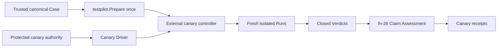

# Bounded production canary execution and qualification

## Re-plan on fn-85, fn-83, fn-22 and fn-26 (2026-09-23)

The first plan (SHIP, 2026-08-26) was written before the Case Runtime settled, before fn-85 gave
the model a canary set, before fn-83 delivered provisioning, and before fn-26 delivered Claim
Assessment. It named paths that no longer exist (`api/umpire/**`, `Temporal.System.Case`) and an
assessment surface that is now concrete. This re-plan keeps the intent, the requirements R1–R10,
the boundaries and the thirteen task slots, and grounds every contract in what the tree has:

- **The fixed Case is fn-85's.** The Caller Model's `nexusCallerCanary` set (purpose `canary`,
  handler `observed`) produces `syncCompletion` and `asyncCompletion` Cases that fn-85 admits only
  when no white-box Known Gap remains; they are produced and registered nowhere. The canary runs
  `nexusCallerCanary.syncCompletion`. The renderer gains a canary registry beside the functional
  one (`Registry.recordCanary`, recorded in the canary branch of the `case` block) and an
  `umpire-case --render-canary <case-id>` mode; `make canary-gen-case` writes
  `tools/canary/testdata/nexusCallerCanary-syncCompletion-case.json` and `canary-check-case`
  diffs a fresh render, in `umpire-check-regression`. The Case reaches its Verdict only from the
  public server observations its Contract names; the handler it observes is performed by a
  canary-owned handler worker on the dedicated handler queue, a separate authority from the
  Case's Driver, which completes the operation synchronously with the fixed result the Case
  expects.
- **The canary policy is data under `tools/canary`, never in Umpire.** One file,
  `tools/canary/policy/production-canary.json`, embedded and decoded strictly (unknown, repeated
  or case-folded keys, a missing field or another version reject), holds: the canary Case's
  identity (SHA-256 of its canonical bytes), the Profile name the Case is prepared under
  (`production-canary`), the Evaluation Profile name, the SHA-256 digests of the target's gRPC
  and HTTP host names, namespace, task queue, handler queue and Nexus endpoint (the raw
  coordinates live only in the protected environment), the trusted ref (`refs/heads/main`) and
  workflow path, and the Limits: 2 iterations per invocation, 2 minutes per Run, 10 minutes per
  invocation, a 2-minute cleanup reserve, the recorded-Run and receipt caps fn-26 fixes, and 64 KiB
  of progress. A limit cannot be raised by a flag.
- **The Evaluation Profile is Lean's, the provenance is canary's.** `Temporal.Evaluation.Canary`
  declares the `production-canary` Evaluation Profile with `Umpire.Evaluation`: trust
  `dedicated-production-canary`, every Known Gap kind blocking, and `local-ephemeral`'s table
  except that `unsupported-rule` rejects (a production claim with a rule nothing supports is a
  failed claim, not a missing one). `umpire-evaluation-profiles` renders each group of declared
  Profiles into the directory its flag names (`--local-dir`, `--canary-dir`), so no Profile
  carries a path and this one lands in `tools/canary/assessment/profiles/`, never in the set
  `umpire-assess` embeds. `tools/umpire/evaluation` exports `ParseProfile` (its strict parse and
  validation), which the canary uses on its embedded copy. Everything canary-specific -- authority
  class, workflow context, target digests, lease and fence, limits, isolation, cleanup and
  reconciliation outcome, and `releaseEligibility: false` -- is the canary provenance document,
  never an Umpire type.
- **Authority and preflight are the protected workflow's.** Credentials (a TLS client certificate
  and key, or an API key) arrive only as environment variables of the protected
  `production-canary` GitHub environment; `tools/canary/authority` turns them into gRPC transport
  and per-RPC credentials for the Driver's server endpoint and the SDK client, and a redacting
  writer keeps them out of every output. Preflight, before any mutation, requires
  `GITHUB_REF` to be the trusted ref, `GITHUB_WORKFLOW_REF` the canary workflow on it,
  `GITHUB_EVENT_NAME` `workflow_dispatch`; the digests of the environment's coordinates to equal
  the policy's; the canonical Case to be the pinned one; the namespace, both queues' routing and
  the Nexus endpoint to exist exactly as the policy names them (Describe calls only, fn-83's
  `provision` package is used by the harness to create them, never by the canary); and the
  catalog to be the tree's. Any mismatch performs no mutation and creates no Run or receipt.
- **One lease, one fence, one Run at a time.** The lease is a workflow with a fixed ID in the canary
  namespace, started with `WORKFLOW_ID_CONFLICT_POLICY_FAIL` and a run timeout equal to the
  invocation limit; its run ID is the fence. Every Run the canary creates carries the fence in its
  workflow IDs (the Profile's identity scope), so cleanup and reconciliation touch only exact
  fenced resources. Runs are serial: the controller prepares the Case once with
  `testpilot.Prepare` and runs the prepared Case for each iteration against a fresh Driver.
  Cleanup runs under a fresh context bounded by the reserve on every exit after the lease is held,
  and the lease is terminated last.
- **Recovery never dispatches.** A mode-0600 recovery record holds only the invocation ID, the lease
  workflow ID and fence, the active Run's ID prefix, the dispatch phase, the cleanup reserve and the
  expiry. A process lost after a Run started leaves that iteration `lost`. `umpire-canary
  reconcile` reads the record, terminates or verifies only workflows carrying its fence, releases
  the lease and marks the scope closed or uncertain; it prepares, runs, assesses and publishes
  nothing. A later invocation starts only after the record is closed or explicitly marked
  uncertain by `reconcile`; nothing reruns automatically.
- **Assessment is fn-26's, verbatim.** Each completed iteration is written as a recorded Run
  (`tools/umpire/recordedrun`, exported from `tools/umpire/internal/recordedrun` so the canary
  imports it) and admitted with `evaluation.Admit` against the tree's catalog, assessed with
  `evaluation.Assess` under the `production-canary` Profile, rendered with `evaluation.Render`,
  and published with the receipt root publisher fn-26 built (exported as
  `tools/umpire/publish`). A lost or unconstructible iteration has no receipt. The canary
  provenance document binds the receipt's identity and is published beside it under its own
  identity; `releaseEligibility` is a constant `false` its decoder rejects any other value of.
- **The command is `umpire-canary`.** `tools/canary/cmd/umpire-canary` has two closed modes, `run` and
  `reconcile`, with no Case, target, Driver, checker, retry, executable, endpoint, credential or
  release flag; `run` takes only the retained-output directory and the recovery-record path. It
  exits 0 when every iteration's receipt is accepted, 1 when any is rejected or incomplete, 2 for
  a lost iteration or cleanup uncertainty, and 3 for a tooling or preflight failure, with one
  bounded JSON summary on stdout.
- **The workflow is manual and protected.** `.github/workflows/umpire-production-canary.yml` runs
  on `workflow_dispatch` only, in the `production-canary` environment, only when the ref is
  `refs/heads/main`, with `contents: read` and no other permission, a job timeout, `umpire-canary
  run`, then `umpire-canary reconcile` under `if: always()`, then the retained receipts,
  provenance and progress uploaded as an artifact. A regression test in `tools/umpire/regression`
  pins those properties the way the CI workflow test pins its own.

Tasks .1 to .13 are rewritten below on these contracts in their existing order and dependencies.
The requirements R1–R10 and the boundaries stand. R1's "canary Assessment Profile" is the Lean
Evaluation Profile plus the canary provenance; R2's "fixed canary Profile/catalog" is the policy's
Profile name and the tree's catalog; R7's "fn-26-derived receipts" are fn-26's receipt bytes
unchanged, beside the provenance; R9's `^TestUmpire` integration selection is kept for the
harness (`TestUmpireCanary*`). Nothing here can be run against production from this repository's
tests: the harness proves every contract against the test cluster with no production credential,
and the production run itself is an operator's manual dispatch.

## Umpire4 Case Runtime reconciliation

This spec is an external consumer of fn-64 and fn-26. It prepares one canonical Case once, executes repeated isolated Runs through the public Go API, and assesses their closed Run/Verdict values. It does not restore `PortableTestPlan`, UmpireExecutor gRPC, Run Evaluation, caller closure, or a canary-specific Umpire command.

## Intent

Run one fixed, bounded, no-fault production canary against dedicated canary-owned Temporal resources. Preserve the fn-64 server/worker Driver authority split while keeping credentials, protected workflow policy, leases, fencing, crash recovery, reconciliation, publication, and operator controls under independently owned `tools/canary` code.

## Architecture

The fixed Case is Lean-produced and expressible entirely in fn-64's generic Program and Contract. The controller verifies its canonical identity and approved source, constructs the fixed non-secret Driver Profile, calls `testpilot.Prepare` once, then executes a bounded serial sequence of fresh Runs. Each Run has fresh state; the PreparedCase is immutable and reusable.

The canary Driver composes fn-64's Temporal server and worker interfaces. Server authority owns descriptors, authorized unary RPCs, channels, credentials, controller-side Nexus completion, and public history observations. Worker authority owns registration and replay-safe workflow/Nexus-handler behavior. Canary orchestration may configure and supervise these interfaces but may not merge their authority or expose credentials through Case, Run, Verdict, receipt, progress, or logs.

## Authority, fencing, and recovery

Only a protected manual workflow on the trusted default ref can acquire the fixed production-canary environment. Preflight checks exact target/routing, namespace, task queue, capability, isolation, workflow context, Case, Profile/catalog, and run-owned identity scope before any target mutation.

One exclusive lease/fence bounds one active Run and dedicated canary-owned resources. The initial controller is serial; a 10x request increase is capped by iteration, wall-time, RPC, worker, evidence, and retained-output limits rather than concurrency. Scope escape, stale fence, ambiguous identity, unrelated resource collision, or unauthorized capability fails closed.

The external controller owns a mode-0600 recovery record containing only invocation identity, lease/fence, active Run identity, dispatch phase, cleanup reserve, and expiry. If the process dies after Run creation, that iteration is `lost`; reconciliation may terminate or verify only exact fenced resources and may never fabricate a Run closure, Verdict, or receipt. Reconciliation cannot dispatch. A later operator-authorized invocation may begin a fresh iteration only after reconciliation closes or explicitly marks the previous scope uncertain; there is no automatic redispatch.

Cleanup runs under a fresh bounded context on every post-lease exit, stops worker/controller resources, closes only exact fenced Runs/resources, verifies terminal state and routing, and preserves uncertainty. Server-side timeouts are the last backstop.

## Assessment and publication

Each completed iteration retains the canonical Case/Profile/catalog/live-Driver/Run/Verdict closure and feeds fn-26 offline Claim Assessment. Isolation, authority, fence, target, cleanup, recovery, trust, and Known Gaps affect the canary claim but do not rewrite Contract semantics. `releaseEligibility` is always false.

A valid satisfied Run can still produce rejected or incomplete canary assessment. A violated Verdict is rejected. Inconclusive or lost work cannot be accepted and produces no fabricated receipt. Same-subject/same-profile receipt publication is idempotent; publication conflict or reporting ambiguity never causes an automatic Run.

Receipts and progress are bounded and secret-free, preserve independent operational/semantic/cleanup/authority statuses, and are not self-authenticating. Authorized production evidence additionally depends on the protected workflow and trusted retained-artifact channel.

## Acceptance Criteria

- **R1:** One domain-neutral canary Assessment Profile expresses the exact environment, authority, isolation, evidence, cleanup, trust, Limits, Known Gaps, claim strength, and mandatory `releaseEligibility:false` without credentials or canary policy entering reusable Umpire types.
- **R2:** One pinned Lean-produced canonical Case uses only fn-64 Program/Contract semantics, binds the fixed no-fault canary Profile/catalog, and reaches Verdict solely from declared public server observations; no scenario adapter or alternate evaluator exists.
- **R3:** Protected authority and preflight admit only the fixed trusted ref, workflow context, production-canary target/routing, capabilities, isolation, Case, Profile, and run-owned identity scope before mutation; any mismatch creates no Run or receipt.
- **R4:** One exclusive lease/fence and closed iteration/RPC/worker/evidence/time limits permit one active serial Run, bound 10x load, and reject collision, ambiguity, stale fence, duplicate dispatch, scope escape, or N+1 work.
- **R5:** External cleanup and recovery operate only on exact fenced resources, record active-process loss as a lost iteration, preserve uncertainty, and never redispatch or synthesize a Verdict; reconciliation has no execution or publication authority.
- **R6:** Every completed iteration preserves the exact Case/Profile/catalog/Driver/Run/Verdict closure and fn-64 terminal precedence; canary evidence changes assessment only and no Run Evaluation or second Contract evaluator is introduced.
- **R7:** Secret-free canary provenance and fn-26-derived receipts have exact canonical identity, independent statuses, source closure, reason precedence, Limits, Known Gaps, immutable publication, and structural `releaseEligibility:false`.
- **R8:** One deep external controller and closed run/reconcile modes preserve stage order, bounded progress, status distinctions, exactly-once publication, and reporting ambiguity without exposing arbitrary target, Case, Driver, checker, retry, or executable selection.
- **R9:** Protected-workflow, public-boundary, crash, mutation, isolation, security, schema, publication, and aggregate tests prove the scope and non-release claim; synthetic tests cannot publish or retain an accepted production receipt.
- **R10:** All canary-specific code, commands, workflows, credentials, policy, leases, fencing, recovery, reconciliation, and operator documentation live under independently owned `tools/canary` and only consume stable Umpire APIs; Umpire never imports canary.

## Early proof point

Before participant work, prove protected preflight distinguishes the exact dedicated canary scope and fixed Case/Profile without exposing target coordinates or claiming global audit. Then prepare that Case once and complete two isolated serial Runs through a test Driver. Stop if any canary policy must enter Umpire.

## Boundaries

No customer traffic, rollout, deployment/config mutation, automatic schedule, release authorization, arbitrary target or Case selection, fault injection, concurrent Runs, new Umpire transport/CLI, server-internal evidence, payload retention, auto-rerun, or self-authenticating receipt claim.

## Requirement coverage

| Requirement | Tasks |
| --- | --- |
| R1 | `.1`, `.12` |
| R2, R6 | `.2`, `.5`, `.10`, `.12` |
| R3 | `.3`, `.8`–`.11` |
| R4 | `.4`, `.8`, `.10`, `.11` |
| R5 | `.4`, `.8`–`.11` |
| R7 | `.6`–`.8`, `.11`, `.12` |
| R8 | `.8`–`.11` |
| R9 | `.9`–`.13` |
| R10 | `.1`–`.13` |

## Plan review

The re-plan awaits its first plan review.
