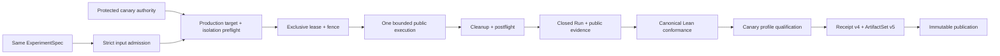

# Bounded production canary execution and qualification

> HTML render lens: local file `.flow/artifacts/fn-29-bounded-production-canary-execution-and/spec.html` — regenerable, markdown is the record. <!-- flow-next:artifact-link -->

## Overview

Add one production-control-plane C12 profile for the current semantic model. The profile runs the
same byte-identical caller-closure ExperimentSpec used by local, CI, and staging against one fixed,
preallocated production-canary namespace and Nexus endpoint that carry no customer traffic. It
observes only the public Temporal boundary plus runner-owned receipts, reuses the canonical Lean
conformance authority, and publishes a production-canary-scoped qualification receipt that is
structurally ineligible to authorize a release.

This is a deliberately closed canary, not a deployment system: one manual protected workflow, one
compiled target/profile, one short-lived in-memory mTLS authority, one exclusive server-side fence,
one run-owned participant, one Nexus operation command, one idempotent semantic mutation, zero
faults, and one immutable output. It cannot select or modify customer traffic, a deployment,
configuration, namespace, endpoint, task queue, semantic property, action, retry policy, or claim
strength.

## Goal & Context
<!-- scope: business -->

The staging slice proves that the artifact and semantic identity survive an authorized remote
public boundary. It does not prove that the same bounded behavior can execute safely against the
production control and data plane under production-only authority and containment rules. This slice
adds exactly that environment-scoped evidence while keeping release aggregation and authorization
in the later release-evidence-graph slice.

Developers receive comparable Run, Result, and qualification artifacts for the same semantic
scenario. Operators receive a manual canary with explicit authority, target, isolation assertion,
blast radius, cleanup, recovery, omissions, and escalation behavior. A successful receipt means
only that this isolated production-canary profile satisfied the admitted properties; it says
nothing about customer traffic, deployment health, release readiness, or general production
conformance.

## Architecture & Data Models
<!-- scope: technical -->



### Ownership and purity

Reusable Umpire qualification modules add only domain-neutral v4 vocabulary for a canary
environment class, protected authority, scope/isolation attestations, public-evidence requirements,
cleanup, trust, omissions, profile-scoped claim strength, and a mandatory non-release-eligible
decision. They contain no Temporal, Nexus, production target, namespace, endpoint, task queue,
workflow provider, repository, credential, checker, or scenario name.

Temporal-owned modules define the exact `production-canary-public-grpc` runtime and qualification
profiles, caller-closure binding, no-fault/no-traffic safety policy, and public-evidence Observation
mapping. The pure Query, Property, Behavior, transition kernel, and Result semantics remain
unchanged. Go owns secret-bearing authority and public transport; one canary controller composes
admission, execution, conformance, qualification, artifact construction, and publication without
interpreting semantic facts.

The future staging implementation's public-remote transport, lease, lifecycle, recovery, progress,
and publication seams are reused or extracted into environment-neutral Go helpers. The production
canary controller must not depend on a staging-named package or duplicate its state machine.
`common/testing/umpire/canary` remains an unchanged non-authoritative testing helper: it may inform
safety tests, but it cannot construct current Run, Result, provenance, receipt, or set artifacts and
cannot interpret evidence.

### Exact canary profile

`QualificationProfile/v4` adds the generic canary requirements needed by this slice. Its only new
compiled Temporal instance is `temporal.qualification-profile.production-canary-public-grpc`,
version 4. It requires the exact canary RuntimeConfiguration; public history and participant,
control, cleanup, and isolation evidence closures; operational success; qualified evidence;
satisfied semantics; complete cleanup; protected-environment mTLS authority; stable target and
Nexus routing identities; an exclusive lease/fence; a dedicated-scope attestation; formal evidence
not provided; claim strength `environment-qualified-production-canary`; and
`releaseEligibility:false`.

The profile always records omissions for server-internal telemetry, database state, payload
inspection, customer-traffic evidence, deployment-health evidence, independently authenticated
builder/approver provenance, independently audited isolation, formal evidence, release aggregation,
and release authorization. The protected environment's isolation/ownership statement is an
operational trust input, not a semantic fact or cryptographic proof that no other production
activity exists. The receipt is not a self-authenticating proof of where it was produced; fn-30 must
bind any future aggregation to a separately trusted retained-artifact channel.

### Protected authority and fixed production scope

The run command reads one closed `ProtectedCanaryAuthority/v1` bundle from the fixed protected
workflow environment. The in-memory bundle contains the fixed environment identity, TLS endpoint
and server name, dedicated namespace, dedicated Nexus endpoint and target task queue, root CA,
client certificate/key, credential expiry, and a closed isolation/ownership attestation. It is
capped at 1 MiB, rejects unknown/duplicate/missing fields and trailing data, and must remain valid
through the total run plus cleanup budget. It is never accepted from flags, stdin, repository files,
input artifacts, ordinary workflow inputs, or an unprotected environment.

Before mutation, the adapter verifies the expected production-canary environment identity,
certificate chain/server name, credential lifetime, registered namespace, exact Nexus endpoint
routing to the dedicated namespace/task queue, required public capabilities, protected workflow
context, and isolation-attestation closure. It also proves that every prospective workflow and
operation identity is run-owned and that no existing resource occupies those identities. Only
checked identity digests enter the target fingerprint; raw endpoints, namespace/task-queue names,
certificates, keys, payloads, headers, actors, and arbitrary remote errors never enter artifacts,
summaries, progress, or logs. A preflight mismatch performs no mutation. The same public routing and
identity fingerprint is checked after cleanup; post-dispatch drift makes the receipt incomplete.

The runtime does not claim to enumerate all activity in the dedicated namespace. Its enforceable
isolation proof is narrower: the protected authority attests exclusive canary ownership, public
preflight verifies the exact dedicated routing, every mutation is fenced to deterministic run-owned
identities, and the command has no traffic/deployment/configuration mutation capability.

Credential exposure is additionally gated outside repository code. The protected
`umpire-production-canary` environment must have a deployment-branch rule admitting only the
protected default branch. A credential-free preflight job rejects any other ref and records the
admitted immutable SHA; the protected job checks out exactly that SHA. This external environment
rule is a provisioning prerequisite because code on an untrusted selected branch could remove an
in-workflow guard before secrets were exposed. Workflow policy tests cover the repository-controlled
guard and checkout, while the runbook requires an operator to verify the external branch rule.

### Lease, mutation, containment, and cleanup

One fixed production-canary lease workflow ID serializes the dedicated target. Lease start uses
`WORKFLOW_ID_REUSE_POLICY_ALLOW_DUPLICATE` and `WORKFLOW_ID_CONFLICT_POLICY_FAIL`: a terminal prior
lease never bricks the canary, while only a currently running execution conflicts. Acquisition is
bound to the protected workflow invocation; only the verified winner may start the sole worker. An
ambiguous start is resolved by one read-only Describe of the fixed ID and must match both the
request-owned invocation binding, workflow type, task queue, running state, and other closed start
fields, never a second start. The run ID discovered from Describe becomes the fence; no run ID is
assumed before the server returns or exposes it. The deterministic caller ID includes workflow run
and attempt identity, uses `WORKFLOW_ID_REUSE_POLICY_REJECT_DUPLICATE` with running-conflict FAIL,
and applies the same request-owned ambiguity check before adopting a discovered run ID. Conflict or
unverifiable acquisition fails before experiment dispatch.

The lease and caller workflows use server-enforced execution timeouts longer than the bounded client
phases. The client sends each start/operation command at most once. Target-owned Nexus delivery may
retry, so every handler delivery is correlated and retained while an idempotency guard allows
exactly one semantic force-close mutation against the run-owned caller workflow. Duplicate delivery
may change operational evidence but cannot change semantic authority.

Hard maxima are one worker, two run-owned workflows, one fixed Nexus operation command, one semantic
mutation, zero requested faults, zero traffic/deployment/configuration actions, one 16-MiB
RawEvidence v1 artifact, and eight minutes wall time. The controller/reconciler may issue at most 64
explicit public RPC attempts: 10 target preflight, 6 lease, 10 dispatch/control, 14 evidence reads,
and an unborrowable 24-call cleanup/terminal-verification/postflight/reconciliation reserve whose
remaining count is persisted in recovery state. N+1 in a foreground partition stops that phase and
enters the reserve; N+1 in the reserve is incomplete and leaves server timeouts as the backstop.
Worker-owned long polls and task-response transport are accounted separately. Production uses the
pinned SDK's `WorkflowTaskPollerBehavior` and `NexusTaskPollerBehavior`, each created by
`NewPollerBehaviorSimpleMaximum` with maximum one; sets `LocalActivityWorkerOnly:true`; registers no
activity/local-activity handlers; and uses `NewFixedSizeTuner` with one workflow, activity,
local-activity, and Nexus slot (the activity slots remain unused). The legacy
`MaxConcurrent*Pollers` and task-execution-size fields remain zero because setting the workflow
variants to one panics in the pinned SDK. Fixed SDK retry policy, delivery/task counts, and the same
wall/server timeouts bound the remaining transport; those autonomous RPCs are not mislabeled as
part of the 64-call controller ceiling. Startup tests cover regular and sticky workflow tasks plus
Nexus handling without panic and observe zero activity polling or activity-task responses.
Namespace, endpoint, task queue, search-attribute,
dynamic-configuration, deployment, routing, traffic, and server-configuration mutation are
structurally absent.

Cleanup runs under a fresh bounded context on every exit after lease acquisition. It stops the
participant, closes or terminates only the exact fenced caller, releases or terminates only the
exact lease run, stops local handles, verifies both run-owned identities terminal, and repeats the
public target/routing fingerprint. It never deletes or alters the preallocated namespace, endpoint,
task queue, deployment, or unrelated workflow.

After lease acquisition, run mode atomically creates a mode-0600 `RemoteRecoveryRecord/v2` at the
fixed runner-temp path and updates it after dispatch/cleanup transitions. V2 retains only the
invocation binding, exact lease/caller fences, dispatch state, target digest, expiry, and remaining
cleanup/reconcile RPC reserve. The staging `RemoteRecoveryRecord/v1` protocol and reader remain
unchanged and reject v2; the shared control package dispatches each closed version only to its exact
profile. The record is not an Umpire artifact and is never uploaded. The same binary's closed
reconcile mode re-acquires protected authority and may only spend the persisted reserve to terminate
or verify exact recorded resources; it cannot dispatch, conform, qualify, construct, or publish. The
workflow always invokes reconciliation after nonzero run completion. Server timeouts remain the
backstop for total runner loss.

### Public evidence and semantic authority

The canary retains ordinary Run and RawEvidence v1 families. Its allowed sources are runner
participant output, public workflow history, public control receipt, cleanup/reconciliation receipt,
and a bounded secret-free canary isolation receipt. The isolation receipt affects operational
qualification only; it cannot create an Observation or rewrite semantic Result status. The
Temporal-owned mapping derives the existing caller-closure Observation coordinates only from the
same admitted public execution sources and never inspects internal logs, metrics, databases,
payload bodies, or authority claims for semantic meaning.

Missing or ambiguous required public facts produce `unknown`; an unavailable required coordinate
produces `unsupported`; contradictory identity/order facts produce `conflict`. None can become a
satisfied semantic claim. Equivalent qualified facts continue through the same pure Property
evaluator and may share qualified-outcome identity with local, CI, and staging, while runtime, run,
canary provenance, receipt, and artifact-set identities remain distinct.

### Persisted qualification boundary

`ProductionCanaryQualificationProvenance/v1` is a reusable, secret-free value containing protected
authority mode/expiry class, workflow-context digest, target/routing pre/post digests, lease/fence
digests, invocation binding, enforced action/fault/resource limits, public capability/evidence
closures, isolation-attestation class, cleanup/reconciliation status, trust class, and declared
omissions. Its concrete fixed meanings remain Temporal-owned.

`QualificationReceipt/v4` preserves the v3 contract and adds the exact canary provenance,
environment/profile binding, canary-specific reason set, claim strength, and immutable
`releaseEligibility:false`. `ArtifactSet/v5` contains the same six byte-identical ordinary source
members plus one v4 receipt and the existing qualification-result relation. All prior receipt/set
readers and fixtures remain unchanged and reject descendant versions; no migration, relabeling, or
compatibility alias is introduced.

Canary reasons accumulate with the existing pilot, operational, evidence, semantic, phase, source,
cleanup, authority, target, and lease reasons. Target drift, authority loss, ambiguous dispatch,
cleanup uncertainty, or reconciliation pending after dispatch is incomplete. A scope escape, stale
fence mutation, forbidden action, definitive run-owned cleanup failure, or semantic violation is
rejected, with rejected dominating incomplete. Invalid input/profile/authority/target/isolation or
lease failure before experiment dispatch is a tooling failure with no receipt. After dispatch,
every constructible non-success result is published honestly with independent statuses intact and
release eligibility always false.

## API Contracts
<!-- scope: technical -->

The production binary has two closed modes:

```text
umpire-qualify-production-canary run --set <directory> --pilot-evidence <directory> --output-root <directory> --run-id <id>
umpire-qualify-production-canary reconcile --run-id <id>
```

Neither mode accepts target, environment, endpoint, namespace, task queue, credential, profile,
property, action, fault, timeout, retry, checker, executable, publication, or claim overrides.
`run-id` is a bounded non-secret workflow invocation identity used only to derive run-owned IDs and
provenance. Reconcile reads the fixed protected authority/recovery paths, treats a missing record as
a canonical no-op, and has no execution or artifact capability.

Status 0 means an accepted, non-release-eligible production-canary receipt was published. Status 2
means a valid rejected or incomplete receipt was published. Status 1 means a tooling failure and no
success summary; the canonical record says whether dispatch, cleanup, and publication occurred.
Errors and summaries are bounded, secret-free single-line records. Reporting failure after immutable
publication identifies only the destination digest and forbids automatic rerun.

Long-running observation reuses the bounded `RemoteProgress/v1` JSONL channel: closed phases/states,
at most one heartbeat per 30 seconds, 256 events, and 64 KiB at the workflow-owned runner-temp path.
It is streamable and optionally retained as a diagnostic, but never enters artifact identity or
qualification.

The repository-root Makefile exposes only run mode through a fixed target with required set,
pilot-evidence, output-root, and run-id inputs. One workflow-dispatch-only job binds the protected
`umpire-production-canary` environment, fixed production authority, read-only repository
permission, pinned actions, concurrency, timeout, runner-temp authority/recovery/progress/output
roots, always-run reconciliation/evidence upload, and no user-selected target or semantic inputs. A
credential-free job first accepts only the protected default ref and emits its SHA; the protected job
is additionally restricted by the environment's external deployment-branch policy and checks out
that exact SHA before authority acquisition. It is not reachable from PR, push, default CI,
deployment, promotion, scheduled, canary rollout, or release workflows.

## Edge Cases & Constraints
<!-- scope: technical -->

- Malformed input, profile, authority, workflow context, target, routing, or isolation attestation
  fails before remote mutation and publishes no receipt.
- A lease conflict or unverifiable ambiguous lease starts no worker and performs no retry.
- Pre-existing run-owned identity collision fails closed; the canary never adopts, signals,
  terminates, or queries payloads from an unrelated resource.
- Duplicate Nexus delivery is retained and deduplicated to one semantic mutation; ambiguous client
  dispatch uses one exact read-only resolution and never sends another command.
- Authority loss, cancellation, target/routing drift, participant crash, evidence overflow,
  observation ambiguity, or public API unavailability after dispatch preserves all constructible
  evidence and cannot yield accepted.
- Scope/fence escape, forbidden traffic/deployment/configuration action, or definitive fenced
  cleanup failure is rejected even if semantics satisfy. Cleanup uncertainty is incomplete.
- Concurrent/repeated publication is idempotent only for byte-identical content; conflicts,
  symlink/alias changes, crossed source sets, or output identity drift fail closed.
- Raw target coordinates, credentials, workflow actors, headers, payloads, tenant/customer data,
  recovery state, and arbitrary remote errors never cross the artifact/log boundary.
- Synthetic public-boundary tests prove protocol behavior only. The harness is forbidden to publish
  or retain an accepted receipt and labels all diagnostics synthetic, but a schema-valid receipt is
  not itself an authenticity proof. Only the protected manual workflow is an authorized producer;
  future consumers must also trust its retained-artifact channel.

## Quick commands

```bash
cd model && mise exec -- lake build Umpire.Qualification.Tests Temporal.System.Execution.ProductionCanaryTests Temporal.System.Qualification.ProductionCanaryTests
go test -count=1 ./tools/umpire/temporal/canary/... ./tools/umpire/conformance/... ./tools/umpire/artifact/... ./tools/umpire/canaryqualification/...
make umpire-qualify-production-canary SET=<input-set> PILOT_EVIDENCE=<pilot-evidence> OUTPUT_ROOT=<runner-temp-output> RUN_ID=<workflow-run-id>
make umpire-check-regression
```

## Boundaries
<!-- scope: business -->

- No arbitrary production target, namespace, endpoint, task queue, scenario, action, property,
  evidence profile, or authority selection.
- No customer traffic, traffic shifting, rollout, deployment/configuration mutation, namespace or
  endpoint provisioning/deletion, fault injection, scheduling, automatic remediation, or rollback
  system. Abort and cleanup affect only fenced run-owned experiment resources.
- No server-internal evidence, payload retention, independently authenticated builder/approver or
  isolation proof, formal proof, cross-environment aggregation, release graph, release eligibility,
  deployment approval, or release authorization.
- No new semantic Property, Behavior, Query, transition, planner, ExperimentSpec, or alternate
  evaluator.
- No default/scheduled/automatic workflow, automatic rerun, test-produced accepted canary fixture,
  compatibility alias, permissive reader, or model-local Make change.

## Decision Context
<!-- scope: both -->

Use one dedicated production-canary namespace/endpoint/task queue rather than customer traffic or a
general target selector. This exercises the production control/data plane while keeping every
mutation fenced to canary-owned resources. Treat the protected environment's ownership/isolation
statement as bounded operational provenance and explicitly retain the lack of independent audit;
do not smuggle it into semantic observations.

Build on the staging remote adapter and control protocol rather than creating an unrelated Drive or
canary execution language. The authored Behavior already fixes the semantic program, while the
RuntimeConfiguration and qualification profile close the production operational choices. Preserve
target-owned redelivery as evidence and use idempotent mutation. Keep the existing generic testing
canary helper non-authoritative. Defer release evidence aggregation because a single environment
receipt, even a green production canary, cannot authorize a release by itself.

## Acceptance Criteria
<!-- scope: both -->

- **R1:** Domain-neutral QualificationProfile v4 and one Temporal-owned
  `production-canary-public-grpc` instance express the exact production-canary environment,
  protected authority, isolation, public evidence, cleanup, trust, omissions, claim strength, and
  mandatory `releaseEligibility:false` without Temporal/scenario vocabulary in reusable Umpire.
  Unknown, duplicate, contradictory, broadened, secret-bearing, or prior-version mutations reject.
- **R2:** The byte-identical ExperimentSpec is paired with one distinct no-fault canary
  RuntimeConfiguration and fixed public Observation mapping while Query, Property, Behavior,
  transition, and Result authorities remain unchanged. Changed semantics, arbitrary target/action,
  internal/payload evidence, unknown, unsupported, ambiguity, or conflict cannot qualify.
- **R3:** Authority is acquired only from the fixed protected workflow, held in memory, and
  preflights exact TLS, production-canary environment, namespace, Nexus routing, credential,
  workflow-context, public-capability, isolation-attestation, and run-owned-identity closures before
  mutation. An external protected-environment branch rule admits only the protected default branch,
  a credential-free guard records the admitted SHA, and the protected job checks out exactly that
  SHA. Any ref, identity, capability, scope, or disclosure mismatch performs no mutation and yields
  no receipt.
- **R4:** One exclusive server lease/fence and hard limits bind one worker, two run-owned workflows,
  one operation command, one idempotent semantic mutation, zero faults/traffic/deployment/config
  actions, a partitioned 64-call controller/reconciler budget with 24 calls reserved for cleanup,
  separately bounded workflow/Nexus transport with no activity polling/responses, 16-MiB
  RawEvidence, and eight minutes. Lease reuse is
  ALLOW_DUPLICATE with running-conflict FAIL; caller reuse is REJECT_DUPLICATE. Sequential terminal
  reuse, simultaneous conflict, stale execution, ambiguity, collision, redelivery, stale fence, N+1,
  scope escape, cancel, timeout, crash, or drift follows the exact bounded non-success behavior.
- **R5:** Cleanup/reconciliation run on every post-lease exit under fresh bounds, affect only exact
  fenced resources, verify terminal state and postflight routing, and use the mode-0600 recovery
  v2 record with persisted remaining RPC reserve plus server timeouts, while staging v1 remains
  unchanged. Runner loss, tampered/stale recovery, authority loss, partial startup, cleanup
  uncertainty, or unrelated resource encounter cannot be accepted or redispatched.
- **R6:** Public execution evidence enters unchanged canonical Lean conformance through one fixed
  mapping; isolation/authority provenance affects qualification only. Operational, evidence,
  semantic, cleanup, authority, target, fence, isolation, trust, and release-eligibility statuses
  remain independent, and no second evaluator is introduced.
- **R7:** Secret-free ProductionCanaryQualificationProvenance v1, QualificationReceipt v4, and
  ArtifactSet v5 have exact canonical identities, limits, reason precedence, source closure,
  `releaseEligibility:false`, and immutable publication while prior versions and six source-member
  bytes remain unchanged. Every secret, version, identity, closure, status, relation, N+1, and
  publication mutation fails closed.
- **R8:** One deep canary controller and closed run/reconcile command preserve stage order,
  post-dispatch non-success evidence, status 0/1/2, bounded progress, and exactly-once publication.
  Reconcile cannot dispatch, conform, qualify, construct, or publish; no path automatically reruns.
- **R9:** A protected workflow, public-boundary harness, adversarial matrices, aggregate checks, and
  operator docs prove isolation scope, zero forbidden capabilities, authority/lease/lifecycle,
  evidence, cleanup/recovery, schemas, publication, and structural non-release eligibility. Tests
  cannot publish or retain an accepted production-canary claim; receipts are explicitly not
  self-authenticating, and authorized production requires both the external trusted-ref rule and the
  trusted retained-artifact channel.

## Early proof point

Task fn-29-bounded-production-canary-execution-and.3 must prove that the protected authority and
public preflight can distinguish the exact dedicated production-canary routing and run-owned scope
without exposing raw target coordinates or pretending to independently audit global production
activity. If this cannot be made fail-closed before mutation, stop before implementing the canary
participant.

## References

- Flow spec fn-14 — retained Lean-first authorization.
- Flow spec fn-18 — strict versioned artifacts and immutable publication.
- Flow specs fn-19 and fn-20 — bounded participant lifecycle and canonical semantic conformance.
- Flow specs fn-26 and fn-27 — qualification and environment-profile versioning.
- Flow spec fn-28 — protected remote public transport, lease, recovery, and staging qualification.
- Umpire component and DSL plans — environment-qualified Result and semantic ownership doctrine.

## Requirement coverage

| Req | Description | Task(s) | Gap justification |
| --- | --- | --- | --- |
| R1 | Generic v4 vocabulary and exact Temporal canary policy | `.1` | — |
| R2 | No-fault canary configuration and fixed public mapping | `.2`, `.5` | — |
| R3 | Protected authority and exact production-canary scope | `.3`, `.8`, `.9`, `.10`, `.11` | — |
| R4 | Fenced bounded participant and forbidden-capability closure | `.4`, `.8`, `.10`, `.11` | — |
| R5 | Cleanup, recovery, reconciliation, and postflight | `.4`, `.8`, `.9`, `.10`, `.11` | — |
| R6 | Canonical conformance and independent statuses | `.2`, `.5`, `.8`, `.10`, `.12` | — |
| R7 | Canary provenance, receipt v4, and ArtifactSet v5 | `.6`, `.7`, `.8`, `.11`, `.12` | — |
| R8 | Deep controller and closed command/workflow | `.8`, `.9`, `.10`, `.11` | — |
| R9 | Protected proof surface and operator documentation | `.9`, `.10`, `.11`, `.12`, `.13` | — |
