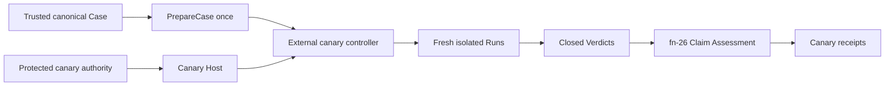

# Bounded production canary execution and qualification

## Umpire4 Case Runtime reconciliation

This spec is an external consumer of fn-64 and fn-26. It prepares one canonical Case once, executes repeated isolated Runs through the public Go API, and assesses their closed Run/Verdict values. It does not restore `PortableTestPlan`, UmpireExecutor gRPC, Run Evaluation, caller closure, or a canary-specific Umpire command.

## Intent

Run one fixed, bounded, no-fault production canary against dedicated canary-owned Temporal resources. Preserve the fn-64 server/worker Host authority split while keeping credentials, protected workflow policy, leases, fencing, crash recovery, reconciliation, publication, and operator controls under independently owned `tools/canary` code.

## Architecture

The fixed Case is Lean-produced and expressible entirely in fn-64's generic Program and Contract. The controller verifies its canonical identity and approved source, constructs the fixed non-secret Host Profile, calls `PrepareCase` once, then executes a bounded serial sequence of fresh Runs. Each Run has fresh state; the PreparedCase is immutable and reusable.

The canary Host composes fn-64's Temporal server and worker interfaces. Server authority owns descriptors, authorized unary RPCs, channels, credentials, controller-side Nexus completion, and public history observations. Worker authority owns registration and replay-safe workflow/Nexus-handler behavior. Canary orchestration may configure and supervise these interfaces but may not merge their authority or expose credentials through Case, Run, Verdict, receipt, progress, or logs.

## Authority, fencing, and recovery

Only a protected manual workflow on the trusted default ref can acquire the fixed production-canary environment. Preflight checks exact target/routing, namespace, task queue, capability, isolation, workflow context, Case, Profile/catalog, and run-owned identity scope before any target mutation.

One exclusive lease/fence bounds one active Run and dedicated canary-owned resources. The initial controller is serial; a 10x request increase is capped by iteration, wall-time, RPC, worker, evidence, and retained-output limits rather than concurrency. Scope escape, stale fence, ambiguous identity, unrelated resource collision, or unauthorized capability fails closed.

The external controller owns a mode-0600 recovery record containing only invocation identity, lease/fence, active Run identity, dispatch phase, cleanup reserve, and expiry. If the process dies after Run creation, that iteration is `lost`; reconciliation may terminate or verify only exact fenced resources and may never fabricate a Run closure, Verdict, or receipt. Reconciliation cannot dispatch. A later operator-authorized invocation may begin a fresh iteration only after reconciliation closes or explicitly marks the previous scope uncertain; there is no automatic redispatch.

Cleanup runs under a fresh bounded context on every post-lease exit, stops worker/controller resources, closes only exact fenced Runs/resources, verifies terminal state and routing, and preserves uncertainty. Server-side timeouts are the last backstop.

## Assessment and publication

Each completed iteration retains the canonical Case/Profile/catalog/live-Host/Run/Verdict closure and feeds fn-26 offline Claim Assessment. Isolation, authority, fence, target, cleanup, recovery, trust, and Known Gaps affect the canary claim but do not rewrite Contract semantics. `releaseEligibility` is always false.

A valid satisfied Run can still produce rejected or incomplete canary assessment. A violated Verdict is rejected. Inconclusive or lost work cannot be accepted and produces no fabricated receipt. Same-subject/same-profile receipt publication is idempotent; publication conflict or reporting ambiguity never causes an automatic Run.

Receipts and progress are bounded and secret-free, preserve independent operational/semantic/cleanup/authority statuses, and are not self-authenticating. Authorized production evidence additionally depends on the protected workflow and trusted retained-artifact channel.

## Acceptance Criteria

- **R1:** One domain-neutral canary Assessment Profile expresses the exact environment, authority, isolation, evidence, cleanup, trust, Limits, Known Gaps, claim strength, and mandatory `releaseEligibility:false` without credentials or canary policy entering reusable Umpire types.
- **R2:** One pinned Lean-produced canonical Case uses only fn-64 Program/Contract semantics, binds the fixed no-fault canary Profile/catalog, and reaches Verdict solely from declared public server observations; no scenario adapter or alternate evaluator exists.
- **R3:** Protected authority and preflight admit only the fixed trusted ref, workflow context, production-canary target/routing, capabilities, isolation, Case, Profile, and run-owned identity scope before mutation; any mismatch creates no Run or receipt.
- **R4:** One exclusive lease/fence and closed iteration/RPC/worker/evidence/time limits permit one active serial Run, bound 10x load, and reject collision, ambiguity, stale fence, duplicate dispatch, scope escape, or N+1 work.
- **R5:** External cleanup and recovery operate only on exact fenced resources, record active-process loss as a lost iteration, preserve uncertainty, and never redispatch or synthesize a Verdict; reconciliation has no execution or publication authority.
- **R6:** Every completed iteration preserves the exact Case/Profile/catalog/Host/Run/Verdict closure and fn-64 terminal precedence; canary evidence changes assessment only and no Run Evaluation or second Contract evaluator is introduced.
- **R7:** Secret-free canary provenance and fn-26-derived receipts have exact canonical identity, independent statuses, source closure, reason precedence, Limits, Known Gaps, immutable publication, and structural `releaseEligibility:false`.
- **R8:** One deep external controller and closed run/reconcile modes preserve stage order, bounded progress, status distinctions, exactly-once publication, and reporting ambiguity without exposing arbitrary target, Case, Host, checker, retry, or executable selection.
- **R9:** Protected-workflow, public-boundary, crash, mutation, isolation, security, schema, publication, and aggregate tests prove the scope and non-release claim; synthetic tests cannot publish or retain an accepted production receipt.
- **R10:** All canary-specific code, commands, workflows, credentials, policy, leases, fencing, recovery, reconciliation, and operator documentation live under independently owned `tools/canary` and only consume stable Umpire APIs; Umpire never imports canary.

## Early proof point

Before participant work, prove protected preflight distinguishes the exact dedicated canary scope and fixed Case/Profile without exposing target coordinates or claiming global audit. Then prepare that Case once and complete two isolated serial Runs through a test Host. Stop if any canary policy must enter Umpire.

## Boundaries

No customer traffic, rollout, deployment/config mutation, automatic schedule, release authorization, arbitrary target or Case selection, fault injection, concurrent Runs, new Umpire transport/CLI, server-internal evidence, payload retention, auto-rerun, or self-authenticating receipt claim.

## Requirement coverage

| Requirement | Tasks |
| --- | --- |
| R1 | `.1`, `.12` |
| R2, R6 | `.2`, `.5`, `.10`, `.12` |
| R3 | `.3`, `.8`–`.11` |
| R4 | `.4`, `.8`, `.10`, `.11` |
| R5 | `.4`, `.8`–`.11` |
| R7 | `.6`–`.8`, `.11`, `.12` |
| R8 | `.8`–`.11` |
| R9 | `.9`–`.13` |
| R10 | `.1`–`.13` |
