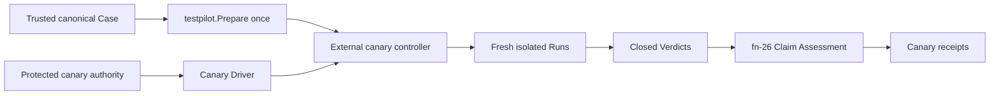

# Bounded production canary execution and qualification

## Re-plan on fn-85, fn-83, fn-22 and fn-26 (2026-09-23)

The first plan (SHIP, 2026-08-26) was written before the Case Runtime settled, before fn-85 gave
the model a canary set, before fn-83 delivered provisioning, and before fn-26 delivered Claim
Assessment. It named paths that no longer exist (`api/umpire/**`, `Temporal.System.Case`) and an
assessment surface that is now concrete. This re-plan keeps the intent, the requirements R1–R10,
the boundaries and the thirteen task slots, and grounds every contract in what the tree has:

- **The fixed Case is fn-85's.** The Caller Model's `nexusCallerCanary` set (purpose `canary`,
  handler `observed`) produces `syncCompletion` and `asyncCompletion` Cases that fn-85 admits only
  when no white-box Known Gap remains; they are produced and registered nowhere. The canary runs
  `nexusCallerCanary.syncCompletion`. The renderer gains a canary registry beside the functional
  one (`Registry.recordCanary`, recorded in the canary branch of the `case` block) and an
  `umpire-case --render-canary <case-id>` mode; `make canary-gen-case` writes its output, the
  canonical compact form, to
  `tools/canary/casebinding/testdata/nexusCallerCanary-syncCompletion-case.json`, which
  `casebinding` embeds, and `canary-check-case`
  diffs a fresh render, in `umpire-check-regression`. The Case reaches its Verdict only from the
  public server observations its Contract names. The produced Case carries its own Nexus handler
  entrypoint (the realization is the functional set's; `handler: observed` changes what the
  verifier reads, not the Program), so the Driver's worker authority performs the handler's
  synchronous reply under its own reservation, and the canary adds no handler of its own: a
  second poller on the handler queue would race the Case's.
- **The canary's Driver Profile is hand-authored.** fn-80 decided that a canary keeps a
  hand-authored Profile, since a Profile is an authorization snapshot (QLF-01) and a derived one
  would let a change to `DeriveProfile`, `DefaultCeilings` or `DefaultInstructionLimits` silently
  widen what the production credential may do. `tools/canary/casebinding` therefore holds the
  canary's `ProfileSpec` as explicit literals -- roles, methods and opcodes, command types, binding
  IDs, the Program, Contract and correlated limits, the instruction defaults -- with only the
  environment's coordinates filled in at run time, and a test that it equals `DeriveProfile`'s
  output for the pinned Case under the same environment, so drift on either side fails review
  rather than changing production's authority.
- **The canary policy is data under `tools/canary`, never in Umpire.** One file,
  `tools/canary/policy/production-canary.json`, embedded and decoded strictly (unknown, repeated
  or case-folded keys, a missing field or another version reject), holds: the canary Case's
  identity (SHA-256 of its canonical bytes), the Profile name the Case is prepared under
  (`production-canary`), the Evaluation Profile name, the authority class (`protected-workflow`;
  the harness's is `harness`), the SHA-256 digests of the target's gRPC
  host name, namespace, task queue, handler queue and Nexus endpoint (no HTTP coordinate: the
  system callback serves only asynchronous completion, and the canary runs `syncCompletion`) (the raw
  coordinates live only in the protected environment), the lease's workflow ID, type and task
  queue, the trusted ref (`refs/heads/main`) and workflow path, and the Limits: 2 iterations per invocation, 10 minutes per invocation, a
  2-minute cleanup reserve, a 24-hour lease run timeout (rejected unless longer than the invocation
  limit plus the reserve), and 64 KiB of progress. A limit cannot be raised by a flag. The coordinate digests are the
  operator's: the repository cannot know production's names, so the committed policy starts with
  each coordinate the literal `unconfigured`, which preflight refuses with its own status
  (`policy-unconfigured`), and the runbook's procedure is to compute each digest from the protected
  environment's value and commit them in a reviewed pull request to `main`, as for any later
  coordinate change. A Run's own
  duration is bounded by the Temporal Profile (30 seconds, and 20 of cleanup), so the policy sets
  no per-Run limit of its own. The Run's own RPC, worker, duration and event ceilings are the
  Temporal Profile's (`testpilotdriver.DefaultCeilings`, which `DeriveProfile` applies), and the
  evidence ceilings are fn-26's admission caps; together with the policy's they are every limit R4
  names. The recorded-Run and receipt caps are fn-26's (`evaluation.AdmissionCaps()`), recorded in
  each receipt, and are not restated in the policy.
- **The Evaluation Profile is Lean's, the provenance is canary's.** `Temporal.Evaluation.Canary`
  declares the `production-canary` Evaluation Profile with `Umpire.Evaluation`: trust
  `dedicated-production-canary`, every Known Gap kind blocking, and `local-ephemeral`'s table
  except that `unsupported-rule` rejects (a production claim with a rule nothing supports is a
  failed claim, not a missing one). `umpire-evaluation-profiles` renders each group of declared
  Profiles into the directory its flag names (`--local-dir`, `--canary-dir`, `--harness-dir`), so no Profile
  carries a path and this one lands in `tools/canary/assessment/profiles/`, never in the set
  `umpire-assess` embeds. `tools/umpire/evaluation` exports `ParseProfile` (its strict parse and
  validation), which the canary uses on its embedded copy. Everything canary-specific -- authority
  class, workflow context, target digests, lease and fence, limits, isolation, cleanup and
  reconciliation outcome, and `releaseEligibility: false` -- is the canary provenance document,
  never an Umpire type.
- **Authority and preflight are the protected workflow's.** Credentials (a TLS client certificate
  and key, or an API key) arrive only as environment variables of the protected
  `production-canary` GitHub environment; `tools/canary/authority` turns them into gRPC transport
  and per-RPC credentials for the Driver's server endpoint and the SDK client, and a redacting
  writer keeps them out of every output. Preflight, before any mutation, requires
  `GITHUB_REF` to be the trusted ref, `GITHUB_WORKFLOW_REF` the canary workflow on it,
  `GITHUB_EVENT_NAME` `workflow_dispatch`; the digests of the environment's coordinates to equal
  the policy's; the canonical Case to be the pinned one (fn-83's `provision` package creates the
  resources in the harness, never in the canary); and the
  catalog to be the tree's. The namespace must exist (`DescribeNamespace`). The credential is a
  namespace writer on the canary namespace and nothing else: every call the canary makes (the
  Case's own, the lease's start, signal, termination and history reads, `DescribeNamespace`) is
  namespace-scoped apart from the SDK client's `GetSystemInfo` on dial, and the canary never lists
  or reads Nexus endpoints, which needs cluster admin. The endpoint's target (the canary
  namespace and handler queue) is therefore an operator-maintained precondition, like the
  environment's protection, which the runbook states; it is proved after the fact by the Run
  itself, whose Case observes the handler's reply publicly, so a repointed endpoint is a Run that
  is not accepted and publishes a rejected or incomplete receipt. Every other mismatch preflight
  checks performs no mutation and creates no Run or receipt; the `PreparedCase` preflight makes is
  the one the controller runs. The coordinate digests are unsalted, so for a guessable name they confirm a
  guess: the coordinates are not secrets, the credential is.
- **One lease, one fence, one Run at a time.** The lease is a workflow with the policy's fixed ID and
  type (`umpire-canary-lease`) on a lease task queue no worker polls (`umpire-canary-lease`, in
  the policy), started with `WORKFLOW_ID_CONFLICT_POLICY_FAIL` and a 24-hour run timeout, a
  backstop far longer than any operator's response; its run ID is the fence. A Run's ID is
  Testpilot's own (`PreparedCase.Run` creates it and the canary Case's workflow ID is it), so the
  canary fences Runs by wrapping the Driver: `FencedDriver` captures the Run ID at `Open`,
  signals it to the lease workflow (`run-opened`, sent to the exact lease ID and fence run ID, so a stale fence
  fails the signal, and recorded in the lease's history by the server with no worker) and only then delegates. The lease's signals are the durable, server-side list
  of every workflow ID the fence may touch; cleanup and reconciliation act on those exact IDs and
  on nothing else. Runs are serial: preflight prepares the Case once with `testpilot.Prepare` and
  the controller runs that `PreparedCase` for each iteration against a fresh fenced Driver. A
  non-accepted iteration ends the invocation: no further Run is made against production after a
  rejected or incomplete one. Cleanup runs under a fresh context bounded by the reserve on every
  exit after the lease is held, and the controller terminates the lease only after every fenced
  workflow is verified closed.
- **Recovery never dispatches, and the guard is on the server.** The lease's latest run says whether
  the scope is clean: open, or closed any way other than a canary termination (the controller
  terminates it with reason `umpire-canary: released`, reconcile with `umpire-canary:
  reconciled`), means unreconciled -- a lost process, or a lease that reached its 24-hour timeout
  -- and `run` refuses before taking a new lease, recording that lease's ID and run ID in its
  recovery file as `found`. Both read the lease's close event from its history, since a describe
  reports `TERMINATED` without the reason, through one predicate, `leaseState`, the controller and
  reconcile share. Only `umpire-canary reconcile` clears it, and it acts on exactly the `(lease ID,
  run ID)` its own job's recovery file names, never on whatever lease happens to be live: a lease
  its own job `took` it reconciles at once, since the process that took it has exited; a lease its
  job `found` it refuses while that lease run is younger than the invocation limit plus the
  cleanup reserve (a live invocation cannot be older), exiting 2 with the status `lease-in-use`; verifies or terminates exactly the workflow IDs that run's
  `run-opened` signals name (a workflow the server reports not found on two reads an RPC timeout
  apart never started, and counts as closed), then closes the scope -- terminating the lease run if it is still open, or, when it had
  closed any non-canary way (timed out, or terminated by hand with another reason), starting and
  at once terminating a fresh lease run with the reconciled reason -- or leaves it and reports the
  scope uncertain. A lease ID the server does not find at all is a clean scope (the first run ever,
  or one whose history aged out). Because a closed lease's history ages out with the namespace's
  retention, and the Case's workflows set no timeout, the canary namespace's retention must exceed
  the longest gap an operator lets pass before reconciling (the runbook states 30 days); every
  published provenance and every reconciliation report also lists the workflow IDs its lease
  fenced, so they outlive retention. It prepares, runs, assesses and publishes nothing, and
  writes only its own bounded reconciliation report (the lost and unpublished iterations, what it
  closed, what it could not verify). An uncertain scope is cleared by an operator who closes the
  listed workflows by hand and runs the workflow again, whose reconcile then verifies them; the
  runbook says so. The runner is a fresh GitHub-hosted runner per dispatch, so nothing is kept on
  it between jobs; the mode-0600 recovery file (invocation ID, the lease ID and run ID it took or
  found, the current Run ID and phase) lives only for its job.
- **Assessment is fn-26's, verbatim, and publication comes last.** Each completed iteration is
  encoded as a recorded Run (`tools/umpire/recordedrun`, exported from
  `tools/umpire/internal/recordedrun` in .1 so the canary can also compute a Case's identity), admitted with `evaluation.Admit`
  against the tree's catalog, assessed with `evaluation.Assess` under the policy's Evaluation
  Profile and rendered with `evaluation.Render`, all held in memory. After the cleanup attempt,
  whatever its outcome (released, or uncertain with the lease held), each iteration's receipt is
  published with the exclusive publisher fn-26 built
  (exported as `tools/umpire/publish`), then its provenance, which carries the invocation's
  cleanup outcome, `uncertain` included; a process lost before publication leaves its iterations unpublished, which
  reconcile reports as lost. A lost or unconstructible iteration has no receipt. `releaseEligibility`
  is a constant `false` the provenance decoder rejects any other value of.
- **What is retained is secret-free; recorded Runs are never written.** A recorded Run holds the
  observed history events whole -- the task queue and endpoint names, the operation's payloads,
  error text -- so the canary encodes it only in memory, for admission, and never writes it. The uploaded artifact holds only receipts, provenance documents, the summary and the
  progress log, and credentials and raw coordinates never appear in any of them (receipts carry
  identities, IDs, statuses and sequence numbers; provenance carries digests). The Redactor
  applies to progress, the summary and logs; a recorded Run is never rewritten.
- **The command is `umpire-canary`.** `tools/canary/cmd/umpire-canary` has two closed modes, `run` and
  `reconcile`, with no Case, target, Driver, checker, retry, executable, endpoint, credential or
  release flag; each takes only `--output <dir>` and `--recovery <file>`. `run` exits by precedence
  3 > 2 > 1 > 0: 3 for a preflight, tooling or unreported publication (each with a named status),
  2 for `lease-unreconciled` or when cleanup is uncertain and the lease stays held, 1 when an
  iteration is rejected or incomplete, 0 when every iteration's receipt is accepted. `reconcile`
  exits 0 when the scope is closed and the lease released, or with status `nothing-to-reconcile`
  when its job wrote no recovery file (preflight refused before any lease); 2 when it is uncertain
  or `lease-in-use`; 3 for a tooling failure; a recovery file that records no lease (the process died between
  starting the lease and recording it) is also `nothing-to-reconcile`, reported as a lease that may
  be held, which the next dispatch's `found` path recovers. A publication conflict is a `run`
  exit 3 (`publication-conflict`). The controller takes its transport as a value; the untagged
  binary's only transport source is `authority`, which requires a credential (a TLS pair or an
  API key), and a test that needs plaintext passes it directly, as the harness build's source
  does. Each writes one bounded JSON summary on stdout.
- **The harness is a separate build.** A `canary_harness` build tag compiles a policy and hook
  provider into a harness binary only: it reads a test policy (the test cluster's digests, the
  `canary-harness` Evaluation Profile, which Lean declares beside `production-canary` but renders
  into `tools/canary/testharness/profiles/`, embedded only by the harness build, and a `harness`
  authority class) and a crash hook from the environment. The untagged binary has one policy, the
  embedded one, which selects `production-canary`, and embeds no other Profile; a regression test
  pins that the untagged build has no override path, so a harness receipt is never a production
  receipt.
- **The workflow is manual and protected, and the protection is the environment's.** A
  `workflow_dispatch` runs the workflow file and code of whatever branch it is dispatched on, so the
  guarantee that only `main` receives the credentials is a precondition on the repository's
  `production-canary` environment: deployment branches restricted to `main` and required
  reviewers, which the runbook states and an operator configures. The in-repo checks are defense
  in depth: `.github/workflows/umpire-production-canary.yml` runs on `workflow_dispatch` only, in
  one `concurrency` group (`umpire-production-canary`, never cancelling one in progress) so no two
  jobs overlap, in that environment, only when the ref is `refs/heads/main`, with `contents: read` and no other
  permission, a job timeout, `umpire-canary run`, then `umpire-canary reconcile` under
  `if: always()`, then the receipts, provenance, summaries and progress uploaded under
  `if: always()`; preflight re-checks the ref. The job's timeout is 30 minutes (build, the
  10-minute invocation, the reserve and reconcile). The workflow's regression test and the check
  that the untagged build has no override path live in `tools/canary`. The tree has one
  regression gate, so `umpire-check-regression` also runs the canary's checks -- the canary Case
  render (`canary-check-case`), the canary Profiles' render, and the canary's live tests, which
  follow the live suite's convention (`tests/testpilot_canary_test.go`, `TestTestpilotCanary*`)
  so `umpire-check-live-tests` selects them -- while no Umpire package imports `tools/canary`.
- **The early proof is .2 with .4's two-Run test.** .2 pins and prepares the canary Case under the
  canary's names with no canary policy in Umpire, and .4 runs the prepared Case twice, serially,
  through a fenced scripted Driver (answering the Program's instructions deterministically, as
  replay's tests do), before any participant work; a finding there
  that canary policy must enter Umpire stops the spec.

Tasks .1 to .13 are rewritten below on these contracts in their existing order and dependencies.
The requirements R1–R10 and the boundaries stand. R1's "canary Assessment Profile" is the Lean
Evaluation Profile plus the canary provenance; R2's "fixed canary Profile/catalog" is the policy's
Profile name and the tree's catalog; R7's "fn-26-derived receipts" are fn-26's receipt bytes
unchanged, beside the provenance; R9's integration selection is the live suite's `^TestTestpilot`,
which picks the harness up as `TestTestpilotCanary*`; R3's routing is proved by the Run, the
endpoint's target being an operator precondition, since reading it needs cluster admin. Nothing here can be run against production from this repository's
tests: the harness proves every contract against the test cluster with no production credential,
and the production run itself is an operator's manual dispatch.

## Umpire4 Case Runtime reconciliation

This spec is an external consumer of fn-64 and fn-26. It prepares one canonical Case once, executes repeated isolated Runs through the public Go API, and assesses their closed Run/Verdict values. It does not restore `PortableTestPlan`, UmpireExecutor gRPC, Run Evaluation, caller closure, or a canary-specific Umpire command.

## Intent

Run one fixed, bounded, no-fault production canary against dedicated canary-owned Temporal resources. Preserve the fn-64 server/worker Driver authority split while keeping credentials, protected workflow policy, leases, fencing, crash recovery, reconciliation, publication, and operator controls under independently owned `tools/canary` code.

## Architecture

The fixed Case is Lean-produced and expressible entirely in fn-64's generic Program and Contract. The controller verifies its canonical identity and approved source, constructs the fixed non-secret Driver Profile, calls `testpilot.Prepare` once, then executes a bounded serial sequence of fresh Runs. Each Run has fresh state; the PreparedCase is immutable and reusable.

The canary Driver composes fn-64's Temporal server and worker interfaces. Server authority owns descriptors, authorized unary RPCs, channels, credentials, controller-side Nexus completion, and public history observations. Worker authority owns registration and replay-safe workflow/Nexus-handler behavior. Canary orchestration may configure and supervise these interfaces but may not merge their authority or expose credentials through Case, Run, Verdict, receipt, progress, or logs.

## Authority, fencing, and recovery

Only a protected manual workflow on the trusted default ref can acquire the fixed production-canary environment. Preflight checks exact target/routing, namespace, task queue, capability, isolation, workflow context, Case, Profile/catalog, and run-owned identity scope before any target mutation.

One exclusive lease/fence bounds one active Run and dedicated canary-owned resources. The initial controller is serial; a 10x request increase is capped by iteration, wall-time, RPC, worker, evidence, and retained-output limits rather than concurrency. Scope escape, stale fence, ambiguous identity, unrelated resource collision, or unauthorized capability fails closed.

The external controller owns a mode-0600 recovery record containing only invocation identity, lease/fence, active Run identity, dispatch phase, cleanup reserve, and expiry. If the process dies after Run creation, that iteration is `lost`; reconciliation may terminate or verify only exact fenced resources and may never fabricate a Run closure, Verdict, or receipt. Reconciliation cannot dispatch. A later operator-authorized invocation may begin a fresh iteration only after reconciliation closes or explicitly marks the previous scope uncertain; there is no automatic redispatch.

Cleanup runs under a fresh bounded context on every post-lease exit, stops worker/controller resources, closes only exact fenced Runs/resources, verifies terminal state and routing, and preserves uncertainty. *(Re-plan: the lease's run timeout is the only server-side timeout; the Case's workflows set none, so reconcile is the only thing that closes an orphan.)*

## Assessment and publication

Each completed iteration retains the canonical Case/Profile/catalog/live-Driver/Run/Verdict closure and feeds fn-26 offline Claim Assessment. Isolation, authority, fence, target, cleanup, recovery, trust, and Known Gaps affect the canary claim but do not rewrite Contract semantics. `releaseEligibility` is always false.

A valid satisfied Run can still produce rejected or incomplete canary assessment. A violated Verdict is rejected. Inconclusive or lost work cannot be accepted and produces no fabricated receipt. Same-subject/same-profile receipt publication is idempotent; publication conflict or reporting ambiguity never causes an automatic Run.

Receipts and progress are bounded and secret-free, preserve independent operational/semantic/cleanup/authority statuses, and are not self-authenticating. Authorized production evidence additionally depends on the protected workflow and trusted retained-artifact channel.

## Acceptance Criteria

- **R1:** One domain-neutral canary Assessment Profile expresses the exact environment, authority, isolation, evidence, cleanup, trust, Limits, Known Gaps, claim strength, and mandatory `releaseEligibility:false` without credentials or canary policy entering reusable Umpire types.
- **R2:** One pinned Lean-produced canonical Case uses only fn-64 Program/Contract semantics, binds the fixed no-fault canary Profile/catalog, and reaches Verdict solely from declared public server observations; no scenario adapter or alternate evaluator exists.
- **R3:** Protected authority and preflight admit only the fixed trusted ref, workflow context, production-canary target/routing, capabilities, isolation, Case, Profile, and run-owned identity scope before mutation; any mismatch creates no Run or receipt.
- **R4:** One exclusive lease/fence and closed iteration/RPC/worker/evidence/time limits permit one active serial Run, bound 10x load, and reject collision, ambiguity, stale fence, duplicate dispatch, scope escape, or N+1 work.
- **R5:** External cleanup and recovery operate only on exact fenced resources, record active-process loss as a lost iteration, preserve uncertainty, and never redispatch or synthesize a Verdict; reconciliation has no execution or publication authority.
- **R6:** Every completed iteration preserves the exact Case/Profile/catalog/Driver/Run/Verdict closure and fn-64 terminal precedence; canary evidence changes assessment only and no Run Evaluation or second Contract evaluator is introduced.
- **R7:** Secret-free canary provenance and fn-26-derived receipts have exact canonical identity, independent statuses, source closure, reason precedence, Limits, Known Gaps, immutable publication, and structural `releaseEligibility:false`.
- **R8:** One deep external controller and closed run/reconcile modes preserve stage order, bounded progress, status distinctions, exactly-once publication, and reporting ambiguity without exposing arbitrary target, Case, Driver, checker, retry, or executable selection.
- **R9:** Protected-workflow, public-boundary, crash, mutation, isolation, security, schema, publication, and aggregate tests prove the scope and non-release claim; synthetic tests cannot publish or retain an accepted production receipt.
- **R10:** All canary-specific code, commands, workflows, credentials, policy, leases, fencing, recovery, reconciliation, and operator documentation live under independently owned `tools/canary` and only consume stable Umpire APIs; Umpire never imports canary.

## Early proof point

Before participant work, prove protected preflight distinguishes the exact dedicated canary scope and fixed Case/Profile without exposing target coordinates or claiming global audit. Then prepare that Case once and complete two isolated serial Runs through a test Driver. Stop if any canary policy must enter Umpire.

## Boundaries

No customer traffic, rollout, deployment/config mutation, automatic schedule, release authorization, arbitrary target or Case selection, fault injection, concurrent Runs, new Umpire transport/CLI, server-internal evidence, payload retention, auto-rerun, or self-authenticating receipt claim.

## Requirement coverage

| Requirement | Tasks |
| --- | --- |
| R1 | `.1`, `.12` |
| R2, R6 | `.2`, `.5`, `.10`, `.12` |
| R3 | `.3`, `.8`–`.11` |
| R4 | `.4`, `.8`, `.10`, `.11` |
| R5 | `.4`, `.8`–`.11` |
| R7 | `.6`–`.8`, `.11`, `.12` |
| R8 | `.8`–`.11` |
| R9 | `.9`–`.13` |
| R10 | `.1`–`.13` |

## Implementation

Task .1 (2026-09-23): `Temporal.Evaluation.Canary` declares `production-canary` and
`canary-harness`, the table derived from `local-ephemeral`'s so they cannot drift; the renderer
writes each group into the directory that embeds it. `tools/umpire/internal/recordedrun` moved to
`tools/umpire/recordedrun` and its importers followed it, rather than keeping an alias package.
`evaluation` exports `ParseProfile` and `LoadProfileIn`, which the canary's loader uses.
`tools/canary/policy` is committed unconfigured. Implementation review: SHIP in one round; its four
P3 notes applied (limit ceilings against overflow, the derived table, one loader, the authority
classes returned fresh).

Task .2 (2026-09-23): canary Cases are recorded in their own registry (`Registry.recordCanary`,
called from the canary branch of the `case` block after the white-box-gap check), and
`umpire-case --render-canary <case-id>` renders only a registered one. `make canary-gen-case`
writes the pinned Case to `tools/canary/casebinding/testdata/`, which `.gitignore` now admits, and
`canary-check-case` joins `umpire-check-regression`. The policy pins the Case's identity.
`casebinding.Bind` prepares the pinned Case under the hand-authored `ProfileSpec`, which a test holds
equal to `DeriveProfile`'s output. Tests pin that the Case names only the two public methods and
correlates only history and the scheduled source, and that a changed Case, a crossed Profile name,
another catalog or other bindings refuse before the Driver validates or opens anything.
Implementation review: NEEDS_WORK twice (the ignored fixture, then refusal coverage), SHIP on the
third round; its three P3 notes applied.

Task .3 (2026-09-23): `tools/canary/authority` reads the coordinates and the credential only
through an injected lookup and builds a TLS transport for the Driver's endpoint and the SDK client
(an API key rides as a bearer token that requires TLS; the endpoint carries the namespace header).
Its Redactor removes every credential and coordinate, a PEM's body lines and a target's host
included, through `Redact`, a bounded line-buffered writer and an SDK logger. `tools/canary/preflight`
checks the workflow context, the policy's configuration, the coordinate digests and the pinned Case
before any connection, then makes one read, `DescribeNamespace`, through an interface with no
mutating method. It returns a `Scope` of the invocation ID (the Actions run and attempt), the
digests and the prepared Case, or a named, redacted refusal. Implementation review: SHIP in one
round; its two P3 notes and four FYIs applied (one digest helper and mismatch list, the Scope's
doc, gRPC NotFound, a floor on PEM line secrets, a bounded writer, and the unenforced transport
check removed).

Task .4 (2026-09-23): `tools/canary/recovery` is the strict, canonical, mode-0600 record, created
exclusively and rewritten atomically. `tools/canary/controller` reads the lease through
`leaseState` (describe, then the close event for its reason) and `workflowClosed` (not found on two
reads an RPC timeout apart is never started), takes the lease with the fail conflict policy, and
fences each Run: `FencedDriver` signals `run-opened` to the exact fence run before it opens, opens
one Run only, and its Session refuses any workflow start but the fenced Run ID. The loop runs the
prepared Case serially through a fresh Driver per iteration, stops after the first iteration not
accepted, at the policy's iterations, when less than one iteration's worst case (two total
durations, three cleanup windows and the release) is left, or when a Driver does not release; a
panic is an unconstructible iteration. Cleanup, under an absolute deadline of the invocation limit
plus the reserve, closes exactly the fenced IDs and releases the lease only when each is verified
closed. `TestTestpilotCanaryLifecycle` runs the pinned Case twice through the real Driver against
the test cluster: two satisfied Runs, both fenced on one lease, verified closed, lease released.
The controller gets its own context of the invocation limit there, since a test context's ceiling
is shorter than one iteration's bound. Implementation review: NEEDS_WORK (the invocation could
outlive reconcile's age guard; testifylint forms; a dropped release error), then SHIP; its three
P3 notes and the test FYIs applied. A lease run that starts and times out between the read and the
take is a race the server's reuse policies cannot close; the window is the length of one RPC.

## Plan review

Round one of the re-plan (`flowctl claude plan-review`, opus at high, 2026-09-23): NEEDS_WORK with
two P0, five P1, four P2 and one P3 findings, all applied. Testpilot owns a Run's ID, so Runs are
fenced by a wrapping Driver that signals each Run ID to the lease before delegating, and cleanup
and reconciliation act on exactly those IDs (P0). A recorded Run holds whole history events,
queue and endpoint names and payloads among them, so recorded Runs stay on the runner and only
receipts, provenance, summaries and progress are uploaded (P0). Publication follows cleanup, so
provenance carries the invocation's cleanup outcome, and reconcile writes only its own report,
never a receipt. The lease is the server-side guard across fresh runners: a lost process leaves
it held and only reconcile releases it, with a 24-hour run timeout as backstop. The harness is a
`canary_harness` build with its own policy and a `canary-harness` Profile, and the untagged binary
has no override. Protecting the environment to `main` with reviewers is a stated precondition;
the in-repo checks are defense in depth. .3 depends on .2; the endpoint is found with
`ListNexusEndpoints` and checked for its target; exit statuses have a precedence and reconcile
its own; the lease has its own unpolled queue and type; the early proof is .2 with .4's two-Run
test; every task has a Touches line; preflight's `PreparedCase` is the one the controller runs.

Round two (2026-09-23): NEEDS_WORK with two P0, one P1, two P2 and one P3 findings, all applied.
The produced canary Case carries its own handler entrypoint and the Driver's worker performs it,
so the canary adds no handler worker (P0). Reconcile acts only on the `(lease ID, run ID)` its own
job recorded, refuses a lease run younger than an invocation could be, and the workflow runs in
one non-cancelling concurrency group, so no job ever ends another's Run (P0). A lease that timed
out, or closed any way but a canary termination, is unreconciled: `run` refuses and reconcile
closes its orphans and then records the scope reconciled (P1). The caps are fn-26's, recorded in
the receipt, not restated in the policy; `casebinding` takes the Driver environment, tested with
test names in .2 and given the environment's coordinates in .3; the `canary-harness` Profile is
rendered and embedded only in the harness build. The FYIs are taken: a fenced workflow the server
does not find never started, and the runbook says how an operator clears an uncertain scope.

Round three (2026-09-23): NEEDS_WORK with three P1, three P2 and four P3 findings, all applied.
Listing Nexus endpoints needs cluster admin, so the canary's credential is a namespace writer on
the canary namespace alone and the endpoint's route is proved by the Run's own public observation
of the handler's reply, never by a preflight read. The recovery file records whether its job took
or found the lease, and only a found lease is held back by the age guard, with its own status
`lease-in-use`; the job's own lease is reconciled at once. The recorded-Run export, with the Case
identity it computes, moves to .1, so .2 never re-implements the canonical form. Publication
follows the cleanup attempt whatever its outcome and provenance records `uncertain`; the lease run
timeout is a policy limit the harness can shorten; every R4 limit is named with its source (the
policy, the Temporal Profile's `DefaultCeilings`, fn-26's caps). Cleanup closes the iteration's
Driver; the lease's close reason is read from its history through one shared predicate; the
renderer's three directory flags agree; the early proof precedes participant work, not
authority. The FYIs are taken: the workflow test and the untagged-build check move to
`tools/canary`, unsalted digests are stated as confirming a guess, and the job timeout is 30
minutes.

Round four (2026-09-23): NEEDS_WORK with two P1, four P2 and two P3 findings, all applied. The
endpoint's target is an operator-maintained precondition, proved after the fact by the Run's own
observation of the handler's reply, and R3 is read that way: a repointed endpoint is a Run that is
not accepted, with a receipt, while every mismatch preflight does check creates nothing (P1). The
harness follows the live suite's convention, `TestTestpilotCanary*` in
`tests/testpilot_canary_test.go`, so `umpire-check-live-tests` runs it (P1). The authority class
is a policy field copied into the provenance, whose decoder accepts exactly `protected-workflow`
and `harness`; the harness policy source rejects any Profile but `canary-harness` and any class
but `harness`. A lease closed any non-canary way, a manual termination included, is closed by a
fresh reconciled lease run; a lease not found is clean; the namespace's retention floor is an
operator precondition and every provenance and report lists the fenced workflow IDs. The
publisher moves whole into `tools/umpire/publish` (`Resolve`, `Within` and the no-follow open with
it), `cli` delegating; `run` names `lease-unreconciled` (exit 2). The tree's one regression gate
runs the canary's checks, which the spec now says instead of claiming Umpire's suite keeps only its
own rule.

Round five (2026-09-23): NEEDS_WORK with two P1, two P2 and three P3 findings, all applied. The
recovery record (its type, 0600 write, updates and strict decode) moves to .4, where the lease and
the loop first write it; .9 keeps only reconcile and the workflow. .4's two-Run early proof runs
the loop against the test cluster through the real Driver -- the Case's worker and handler
entrypoints need reservations no scripted Driver grants -- and decides each iteration with an
injected function that .8 wires to fn-26. The untagged build requires a credential; plaintext is
the harness's alone. Reconcile with no recovery file exits 0 as `nothing-to-reconcile`, and both
modes take the same two flags. The HTTP coordinate is dropped (the canary runs a synchronous
Case), recorded Runs stay in memory, `cli` keeps aliases for every publisher type and constant its
callers use, the policy sets no per-Run limit (the Temporal Profile bounds a Run) and rejects a
lease timeout no longer than an invocation, and reconcile reads a not-found workflow twice before
counting it never started. `umpire-check-regression`'s Go test line gains `./tools/canary/...`.

Round six (2026-09-23): NEEDS_WORK with one P1, three P2 and two P3 findings, all applied. The
controller takes its transport as a value, so the untagged binary's only transport source is
`authority`, which requires a credential, while the in-process lifecycle test passes plaintext
directly; `build_test.go` pins that no untagged, non-test package builds a plaintext transport
(P1). .4's Run bound is the Temporal Profile's; the harness source's refusals are compiled and run
by a `canary_harness`-tagged test line and a live case with a production-naming policy; .12 edits
the CI workflow and its regression test so CI runs the canary's unit tests and checks, the new path
appended to the pinned command. .2 updates the comments that said canary Cases are registered
nowhere; reconcile's status for a recovery file with no lease, and a publication conflict's place
in `run`'s precedence, are named; the authority-class set is defined once, in the policy package.

Round seven (2026-09-23): NEEDS_WORK with one P1, three P2 and two P3 findings, all applied. The
production coordinate digests are the operator's: the committed policy starts `unconfigured`,
which preflight refuses as `policy-unconfigured`, and the runbook gives the procedure for
committing them (P1). The pinned Case lives under `tools/canary/casebinding/testdata/`, which the
package embeds; .1 commits the all-zero Case identity and .2 replaces it with the real one. An
iteration whose Run errors or whose record admission rejects is `unconstructible`, ends the
invocation and exits 3. The rule that a workflow not found on two reads an RPC timeout apart never
started is one predicate, `workflowClosed`, beside `leaseState`, shared by cleanup and reconcile;
`run-opened` is signalled to the exact lease ID and fence run ID; .4's quick commands run the
lifecycle test.

Round eight (2026-09-23): NEEDS_WORK with one P1, three P2 and one P3 findings, all applied. The
canary's Driver Profile is hand-authored, as fn-80 decided, and a test holds it equal to
`DeriveProfile`'s output for the pinned Case, so drift fails review instead of widening what the
production credential may do (P1). The pinned Case is the renderer's canonical output, compared by
a plain diff. Every SDK client the canary builds logs through the Redactor, and the harness scans
the process's whole stdout and stderr for planted coordinates. .8 defines the injection seams (a
policy source, a transport source, a phase hook that is nil in the untagged build) that .10's
harness build fills. `decide` returns the iteration's outcome (status, receipt bytes, error),
which .4 keeps per iteration. The FYIs are taken: the invocation deadline runs from `run`'s start,
and the canary's CI checks run in a job of their own with a 30-minute timeout.

Round cap (2026-09-23): the eighth round reached flowctl's cap of eight plan-review rounds. Every
round's findings were real and applied, and they narrowed (twelve findings in round one, five in
round eight, one blocking issue in each of the last four). Several rounds changed the plan's core
contracts -- fencing through a wrapping Driver, the lease as the server-side guard, the harness
as a separate build, the hand-authored Driver Profile -- which is re-planning, so the counter was
reset with `flowctl spec reset-review-rounds` and review continued from round nine.

Round nine (2026-09-23): **SHIP**, its one P2 and four P3 notes folded into the plan. The recovery
record keeps each iteration's publication, so reconcile reports an iteration lost only when its
own job knows it was not published; on the `found` path it reports the fenced IDs as publication
unknown, pointing at the earlier invocation's artifact. The digested gRPC coordinate is the whole
`UMPIRE_CANARY_GRPC` value (`host:port`); the policy names the repository and preflight matches
`GITHUB_WORKFLOW_REF` as `<repository>/<workflow path>@<ref>` exactly; the workflow redirects each
mode's stdout and stderr into named files in the uploaded directory; the age guard applies only to
an open lease run. The suppressed notes are taken: the live gate's Go test gains an explicit
30-minute `-timeout`, and the runbook adds the endpoint's allowed-caller-namespace setting where the
deployment has one. `canary-check-case` joins `umpire-check-regression` once, in .2.
