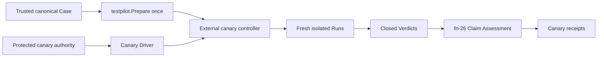

# Bounded production canary execution and qualification

## Re-plan on fn-85, fn-83, fn-22 and fn-26 (2026-09-23)

The first plan (SHIP, 2026-08-26) was written before the Case Runtime settled, before fn-85 gave
the model a canary set, before fn-83 delivered provisioning, and before fn-26 delivered Claim
Assessment. It named paths that no longer exist (`api/umpire/**`, `Temporal.System.Case`) and an
assessment surface that is now concrete. This re-plan keeps the intent, the requirements R1–R10,
the boundaries and the thirteen task slots, and grounds every contract in what the tree has:

- **The fixed Case is fn-85's.** The Caller Model's `nexusCallerCanary` set (purpose `canary`,
  handler `observed`) produces `syncCompletion` and `asyncCompletion` Cases that fn-85 admits only
  when no white-box Known Gap remains; they are produced and registered nowhere. The canary runs
  `nexusCallerCanary.syncCompletion`. The renderer gains a canary registry beside the functional
  one (`Registry.recordCanary`, recorded in the canary branch of the `case` block) and an
  `umpire-case --render-canary <case-id>` mode; `make canary-gen-case` writes
  `tools/canary/testdata/nexusCallerCanary-syncCompletion-case.json` and `canary-check-case`
  diffs a fresh render, in `umpire-check-regression`. The Case reaches its Verdict only from the
  public server observations its Contract names; the handler it observes is performed by a
  canary-owned handler worker on the dedicated handler queue, a separate authority from the
  Case's Driver, which completes the operation synchronously with the fixed result the Case
  expects.
- **The canary policy is data under `tools/canary`, never in Umpire.** One file,
  `tools/canary/policy/production-canary.json`, embedded and decoded strictly (unknown, repeated
  or case-folded keys, a missing field or another version reject), holds: the canary Case's
  identity (SHA-256 of its canonical bytes), the Profile name the Case is prepared under
  (`production-canary`), the Evaluation Profile name, the SHA-256 digests of the target's gRPC
  and HTTP host names, namespace, task queue, handler queue and Nexus endpoint (the raw
  coordinates live only in the protected environment), the lease's workflow ID, type and task
  queue, the trusted ref (`refs/heads/main`) and workflow path, and the Limits: 2 iterations per invocation, 2 minutes per Run, 10 minutes per
  invocation, a 2-minute cleanup reserve, the recorded-Run and receipt caps fn-26 fixes, and 64 KiB
  of progress. A limit cannot be raised by a flag.
- **The Evaluation Profile is Lean's, the provenance is canary's.** `Temporal.Evaluation.Canary`
  declares the `production-canary` Evaluation Profile with `Umpire.Evaluation`: trust
  `dedicated-production-canary`, every Known Gap kind blocking, and `local-ephemeral`'s table
  except that `unsupported-rule` rejects (a production claim with a rule nothing supports is a
  failed claim, not a missing one). `umpire-evaluation-profiles` renders each group of declared
  Profiles into the directory its flag names (`--local-dir`, `--canary-dir`), so no Profile
  carries a path and this one lands in `tools/canary/assessment/profiles/`, never in the set
  `umpire-assess` embeds. `tools/umpire/evaluation` exports `ParseProfile` (its strict parse and
  validation), which the canary uses on its embedded copy. Everything canary-specific -- authority
  class, workflow context, target digests, lease and fence, limits, isolation, cleanup and
  reconciliation outcome, and `releaseEligibility: false` -- is the canary provenance document,
  never an Umpire type.
- **Authority and preflight are the protected workflow's.** Credentials (a TLS client certificate
  and key, or an API key) arrive only as environment variables of the protected
  `production-canary` GitHub environment; `tools/canary/authority` turns them into gRPC transport
  and per-RPC credentials for the Driver's server endpoint and the SDK client, and a redacting
  writer keeps them out of every output. Preflight, before any mutation, requires
  `GITHUB_REF` to be the trusted ref, `GITHUB_WORKFLOW_REF` the canary workflow on it,
  `GITHUB_EVENT_NAME` `workflow_dispatch`; the digests of the environment's coordinates to equal
  the policy's; the canonical Case to be the pinned one (fn-83's `provision` package creates the
  resources in the harness, never in the canary); and the
  catalog to be the tree's. The namespace must exist (`DescribeNamespace`), and the Nexus endpoint,
  found by name with `ListNexusEndpoints`, must target that namespace and the handler queue (task
  queues are created lazily, so their existence proves nothing). Any mismatch performs no mutation
  and creates no Run or receipt; the `PreparedCase` preflight makes is the one the controller runs.
- **One lease, one fence, one Run at a time.** The lease is a workflow with the policy's fixed ID and
  type (`umpire-canary-lease`) on a lease task queue no worker polls (`umpire-canary-lease`, in
  the policy), started with `WORKFLOW_ID_CONFLICT_POLICY_FAIL` and a 24-hour run timeout, a
  backstop far longer than any operator's response; its run ID is the fence. A Run's ID is
  Testpilot's own (`PreparedCase.Run` creates it and the canary Case's workflow ID is it), so the
  canary fences Runs by wrapping the Driver: `FencedDriver` captures the Run ID at `Open`,
  signals it to the lease workflow (`run-opened`, recorded in the lease's history by the server
  with no worker) and only then delegates. The lease's signals are the durable, server-side list
  of every workflow ID the fence may touch; cleanup and reconciliation act on those exact IDs and
  on nothing else. Runs are serial: preflight prepares the Case once with `testpilot.Prepare` and
  the controller runs that `PreparedCase` for each iteration against a fresh fenced Driver. A
  non-accepted iteration ends the invocation: no further Run is made against production after a
  rejected or incomplete one. Cleanup runs under a fresh context bounded by the reserve on every
  exit after the lease is held, and the controller terminates the lease only after every fenced
  workflow is verified closed.
- **Recovery never dispatches, and the guard is on the server.** A lost process leaves the lease
  held, so the next `run` collides on the lease's ID and refuses, naming the scope as
  unreconciled; only `umpire-canary reconcile` releases it. Reconcile reads the lease by its fixed
  ID, verifies or terminates exactly the workflow IDs its `run-opened` signals name, and
  terminates the lease once each is verified closed, or leaves it held and reports the scope
  uncertain; it prepares, runs, assesses and publishes nothing, and writes only its own bounded
  reconciliation report (the lost iterations, what it closed, what it could not verify). The
  runner is a fresh GitHub-hosted runner per dispatch, so nothing is kept on it between jobs; a
  mode-0600 recovery file written in the job (invocation ID, fence, the current Run ID and phase)
  only lets the same job's `reconcile` step name what was in flight before it reads the lease.
- **Assessment is fn-26's, verbatim, and publication comes last.** Each completed iteration is
  encoded as a recorded Run (`tools/umpire/recordedrun`, exported from
  `tools/umpire/internal/recordedrun` so the canary imports it), admitted with `evaluation.Admit`
  against the tree's catalog, assessed with `evaluation.Assess` under the policy's Evaluation
  Profile and rendered with `evaluation.Render`, all held in memory. After cleanup and the lease's
  release, each iteration's receipt is published with the exclusive publisher fn-26 built
  (exported as `tools/umpire/publish`), then its provenance, which now carries the invocation's
  cleanup outcome; a process lost before publication leaves its iterations unpublished, which
  reconcile reports as lost. A lost or unconstructible iteration has no receipt. `releaseEligibility`
  is a constant `false` the provenance decoder rejects any other value of.
- **What is retained is secret-free; what is not stays on the runner.** A recorded Run holds the
  observed history events whole -- the task queue and endpoint names, the operation's payloads,
  error text -- so it is never uploaded: recorded Runs live in a runner-local directory the job
  removes. The uploaded artifact holds only receipts, provenance documents, the summary and the
  progress log, and credentials and raw coordinates never appear in any of them (receipts carry
  identities, IDs, statuses and sequence numbers; provenance carries digests). The Redactor
  applies to progress, the summary and logs; a recorded Run is never rewritten.
- **The command is `umpire-canary`.** `tools/canary/cmd/umpire-canary` has two closed modes, `run` and
  `reconcile`, with no Case, target, Driver, checker, retry, executable, endpoint, credential or
  release flag; each takes only the retained-output directory, the runner-local directory and the
  recovery-file path. `run` exits by precedence 3 > 2 > 1 > 0: 3 for a preflight, tooling or
  unreported publication (each with a named status), 2 when cleanup is uncertain or the lease
  could not be released, 1 when an iteration is rejected or incomplete, 0 when every iteration's
  receipt is accepted. `reconcile` exits 0 when the scope is closed and the lease released, 2 when
  it is uncertain, 3 for a tooling failure. Each writes one bounded JSON summary on stdout.
- **The harness is a separate build.** A `canary_harness` build tag compiles a policy and hook
  provider into a harness binary only: it reads a test policy (the test cluster's digests, the
  `canary-harness` Evaluation Profile Lean declares beside `production-canary`, and a
  `harness` authority class) and a crash hook from the environment. The untagged binary has one
  policy, the embedded one, and one Profile, `production-canary`; a regression test pins that the
  untagged build has no override path, so a harness receipt is never a production receipt.
- **The workflow is manual and protected, and the protection is the environment's.** A
  `workflow_dispatch` runs the workflow file and code of whatever branch it is dispatched on, so the
  guarantee that only `main` receives the credentials is a precondition on the repository's
  `production-canary` environment: deployment branches restricted to `main` and required
  reviewers, which the runbook states and an operator configures. The in-repo checks are defense
  in depth: `.github/workflows/umpire-production-canary.yml` runs on `workflow_dispatch` only, in
  that environment, only when the ref is `refs/heads/main`, with `contents: read` and no other
  permission, a job timeout, `umpire-canary run`, then `umpire-canary reconcile` under
  `if: always()`, then the receipts, provenance, summaries and progress uploaded under
  `if: always()`; preflight re-checks the ref. A regression test in `tools/umpire/regression` pins
  the file's properties.
- **The early proof is .2 with .4's two-Run test.** .2 pins and prepares the canary Case under the
  canary's names with no canary policy in Umpire, and .4 runs the prepared Case twice, serially,
  through a fenced in-process Driver, before any authority or participant work; a finding there
  that canary policy must enter Umpire stops the spec.

Tasks .1 to .13 are rewritten below on these contracts in their existing order and dependencies.
The requirements R1–R10 and the boundaries stand. R1's "canary Assessment Profile" is the Lean
Evaluation Profile plus the canary provenance; R2's "fixed canary Profile/catalog" is the policy's
Profile name and the tree's catalog; R7's "fn-26-derived receipts" are fn-26's receipt bytes
unchanged, beside the provenance; R9's `^TestUmpire` integration selection is kept for the
harness (`TestUmpireCanary*`). Nothing here can be run against production from this repository's
tests: the harness proves every contract against the test cluster with no production credential,
and the production run itself is an operator's manual dispatch.

## Umpire4 Case Runtime reconciliation

This spec is an external consumer of fn-64 and fn-26. It prepares one canonical Case once, executes repeated isolated Runs through the public Go API, and assesses their closed Run/Verdict values. It does not restore `PortableTestPlan`, UmpireExecutor gRPC, Run Evaluation, caller closure, or a canary-specific Umpire command.

## Intent

Run one fixed, bounded, no-fault production canary against dedicated canary-owned Temporal resources. Preserve the fn-64 server/worker Driver authority split while keeping credentials, protected workflow policy, leases, fencing, crash recovery, reconciliation, publication, and operator controls under independently owned `tools/canary` code.

## Architecture

The fixed Case is Lean-produced and expressible entirely in fn-64's generic Program and Contract. The controller verifies its canonical identity and approved source, constructs the fixed non-secret Driver Profile, calls `testpilot.Prepare` once, then executes a bounded serial sequence of fresh Runs. Each Run has fresh state; the PreparedCase is immutable and reusable.

The canary Driver composes fn-64's Temporal server and worker interfaces. Server authority owns descriptors, authorized unary RPCs, channels, credentials, controller-side Nexus completion, and public history observations. Worker authority owns registration and replay-safe workflow/Nexus-handler behavior. Canary orchestration may configure and supervise these interfaces but may not merge their authority or expose credentials through Case, Run, Verdict, receipt, progress, or logs.

## Authority, fencing, and recovery

Only a protected manual workflow on the trusted default ref can acquire the fixed production-canary environment. Preflight checks exact target/routing, namespace, task queue, capability, isolation, workflow context, Case, Profile/catalog, and run-owned identity scope before any target mutation.

One exclusive lease/fence bounds one active Run and dedicated canary-owned resources. The initial controller is serial; a 10x request increase is capped by iteration, wall-time, RPC, worker, evidence, and retained-output limits rather than concurrency. Scope escape, stale fence, ambiguous identity, unrelated resource collision, or unauthorized capability fails closed.

The external controller owns a mode-0600 recovery record containing only invocation identity, lease/fence, active Run identity, dispatch phase, cleanup reserve, and expiry. If the process dies after Run creation, that iteration is `lost`; reconciliation may terminate or verify only exact fenced resources and may never fabricate a Run closure, Verdict, or receipt. Reconciliation cannot dispatch. A later operator-authorized invocation may begin a fresh iteration only after reconciliation closes or explicitly marks the previous scope uncertain; there is no automatic redispatch.

Cleanup runs under a fresh bounded context on every post-lease exit, stops worker/controller resources, closes only exact fenced Runs/resources, verifies terminal state and routing, and preserves uncertainty. Server-side timeouts are the last backstop.

## Assessment and publication

Each completed iteration retains the canonical Case/Profile/catalog/live-Driver/Run/Verdict closure and feeds fn-26 offline Claim Assessment. Isolation, authority, fence, target, cleanup, recovery, trust, and Known Gaps affect the canary claim but do not rewrite Contract semantics. `releaseEligibility` is always false.

A valid satisfied Run can still produce rejected or incomplete canary assessment. A violated Verdict is rejected. Inconclusive or lost work cannot be accepted and produces no fabricated receipt. Same-subject/same-profile receipt publication is idempotent; publication conflict or reporting ambiguity never causes an automatic Run.

Receipts and progress are bounded and secret-free, preserve independent operational/semantic/cleanup/authority statuses, and are not self-authenticating. Authorized production evidence additionally depends on the protected workflow and trusted retained-artifact channel.

## Acceptance Criteria

- **R1:** One domain-neutral canary Assessment Profile expresses the exact environment, authority, isolation, evidence, cleanup, trust, Limits, Known Gaps, claim strength, and mandatory `releaseEligibility:false` without credentials or canary policy entering reusable Umpire types.
- **R2:** One pinned Lean-produced canonical Case uses only fn-64 Program/Contract semantics, binds the fixed no-fault canary Profile/catalog, and reaches Verdict solely from declared public server observations; no scenario adapter or alternate evaluator exists.
- **R3:** Protected authority and preflight admit only the fixed trusted ref, workflow context, production-canary target/routing, capabilities, isolation, Case, Profile, and run-owned identity scope before mutation; any mismatch creates no Run or receipt.
- **R4:** One exclusive lease/fence and closed iteration/RPC/worker/evidence/time limits permit one active serial Run, bound 10x load, and reject collision, ambiguity, stale fence, duplicate dispatch, scope escape, or N+1 work.
- **R5:** External cleanup and recovery operate only on exact fenced resources, record active-process loss as a lost iteration, preserve uncertainty, and never redispatch or synthesize a Verdict; reconciliation has no execution or publication authority.
- **R6:** Every completed iteration preserves the exact Case/Profile/catalog/Driver/Run/Verdict closure and fn-64 terminal precedence; canary evidence changes assessment only and no Run Evaluation or second Contract evaluator is introduced.
- **R7:** Secret-free canary provenance and fn-26-derived receipts have exact canonical identity, independent statuses, source closure, reason precedence, Limits, Known Gaps, immutable publication, and structural `releaseEligibility:false`.
- **R8:** One deep external controller and closed run/reconcile modes preserve stage order, bounded progress, status distinctions, exactly-once publication, and reporting ambiguity without exposing arbitrary target, Case, Driver, checker, retry, or executable selection.
- **R9:** Protected-workflow, public-boundary, crash, mutation, isolation, security, schema, publication, and aggregate tests prove the scope and non-release claim; synthetic tests cannot publish or retain an accepted production receipt.
- **R10:** All canary-specific code, commands, workflows, credentials, policy, leases, fencing, recovery, reconciliation, and operator documentation live under independently owned `tools/canary` and only consume stable Umpire APIs; Umpire never imports canary.

## Early proof point

Before participant work, prove protected preflight distinguishes the exact dedicated canary scope and fixed Case/Profile without exposing target coordinates or claiming global audit. Then prepare that Case once and complete two isolated serial Runs through a test Driver. Stop if any canary policy must enter Umpire.

## Boundaries

No customer traffic, rollout, deployment/config mutation, automatic schedule, release authorization, arbitrary target or Case selection, fault injection, concurrent Runs, new Umpire transport/CLI, server-internal evidence, payload retention, auto-rerun, or self-authenticating receipt claim.

## Requirement coverage

| Requirement | Tasks |
| --- | --- |
| R1 | `.1`, `.12` |
| R2, R6 | `.2`, `.5`, `.10`, `.12` |
| R3 | `.3`, `.8`–`.11` |
| R4 | `.4`, `.8`, `.10`, `.11` |
| R5 | `.4`, `.8`–`.11` |
| R7 | `.6`–`.8`, `.11`, `.12` |
| R8 | `.8`–`.11` |
| R9 | `.9`–`.13` |
| R10 | `.1`–`.13` |

## Plan review

Round one of the re-plan (`flowctl claude plan-review`, opus at high, 2026-09-23): NEEDS_WORK with
two P0, five P1, four P2 and one P3 findings, all applied. Testpilot owns a Run's ID, so Runs are
fenced by a wrapping Driver that signals each Run ID to the lease before delegating, and cleanup
and reconciliation act on exactly those IDs (P0). A recorded Run holds whole history events,
queue and endpoint names and payloads among them, so recorded Runs stay on the runner and only
receipts, provenance, summaries and progress are uploaded (P0). Publication follows cleanup, so
provenance carries the invocation's cleanup outcome, and reconcile writes only its own report,
never a receipt. The lease is the server-side guard across fresh runners: a lost process leaves
it held and only reconcile releases it, with a 24-hour run timeout as backstop. The harness is a
`canary_harness` build with its own policy and a `canary-harness` Profile, and the untagged binary
has no override. Protecting the environment to `main` with reviewers is a stated precondition;
the in-repo checks are defense in depth. .3 depends on .2; the endpoint is found with
`ListNexusEndpoints` and checked for its target; exit statuses have a precedence and reconcile
its own; the lease has its own unpolled queue and type; the early proof is .2 with .4's two-Run
test; every task has a Touches line; preflight's `PreparedCase` is the one the controller runs.
