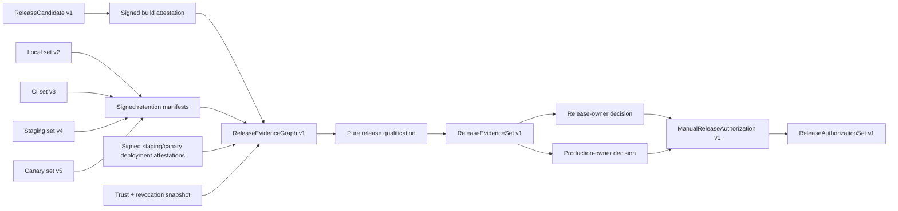

# Release evidence graph and manual authorization

> HTML render lens (local): open `.flow/artifacts/fn-30-release-evidence-graph-and-manual/spec.html` — regenerable, markdown is the record. <!-- flow-next:artifact-link -->

## Umpire4 architecture reconciliation

Release evidence evaluation and manual authorization are downstream deployment-owner concerns, not reusable Umpire modules or commands. This spec is re-scoped to a release-policy component under the standalone canary/release ownership boundary (or an existing external release platform) that consumes signed retained qualification/canary evidence. `tools/umpire` contributes only generic admitted receipts and has no release candidate, signer, role approval, revocation, deployment attestation, workflow, or authorization type.

The standalone canary producer supplies retained evidence through its trusted channel; the release owner supplies build/deployment attestations and human-role authority. No import or control edge points back from Umpire into canary/release systems, and no release decision can reinterpret semantic evidence.

## Overview

Add the first current-model release-evidence graph and manual authorization boundary. The graph
admits exactly one retained local, hermetic-CI, remote-staging, and production-canary qualification
receipt for the same byte-identical ExperimentSpec and qualified semantic outcome, authenticates
each receipt through a separate signed retention channel, and binds the staging/canary runs to one
immutable Temporal server release candidate through independently signed build and deployment
attestations supplied by the existing protected build and deployment authorities.

Graph qualification and human authorization remain distinct. A pure, versioned policy can conclude
only `qualified-for-human-review`, `held`, or `rejected`. Two separate protected role authorities
must then approve the exact candidate, graph, policy, omissions, and expiry to create a manual
authorization. No receipt, environment, graph, role decision, command, workflow, or artifact in this
slice can deploy, promote an image tag, change traffic, modify configuration, roll back, or invoke an
existing release workflow.

## Goal & Context
<!-- scope: business -->

Fn-26 through fn-29 deliberately produce environment-scoped claims. Their bytes are inspectable but
not self-authenticating, and each source remains non-release-authorizing. This slice composes those
claims without erasing their different trust, evidence, cleanup, authority, formal, and omission
profiles.

Release reviewers receive one immutable graph explaining exactly which candidate and evidence were
admitted, what was missing or accepted as an omission, why the graph is qualified/held/rejected, and
when it expires. Release and production owners record distinct role decisions against that exact
graph. Deployment tooling receives, at most, a content-addressed authorization reference for a
future separately reviewed handoff; fn-30 itself has no deployment authority.

## Architecture & Data Models
<!-- scope: technical -->



### Ownership and deep seams

`Umpire.Qualification.Release` owns domain-neutral, pure, versioned candidate, graph, trust,
policy, decision, authorization, expiry, revocation, and canonical identity types. It contains no
Temporal, Nexus, repository, workflow provider, environment name, image registry, task queue,
checker, deployment client, or credential vocabulary.

`Temporal.System.Qualification.Release` compiles the sole exact first policy: Temporal
server candidate shape, four required environment profiles and receipt/set versions, semantic and
candidate bindings, freshness windows, trust roles, accepted omissions, graph limits, two-role
approval rule, and non-deployment claim. It does not evaluate Property semantics or verify
cryptography.

The `tools/umpire/release` Go package is the deep operational verifier. It strictly decodes source sets and signed
channel records, verifies signatures and role/key validity, recomputes identities and graph closure,
invokes the fixed Lean release-policy export, constructs release artifacts, and delegates immutable
publication. It does not execute an ExperimentSpec, interpret evidence, rerun conformance, mint an
environment receipt, alter source artifacts, promote, deploy, or call a release workflow.

Existing qualification receipts and ArtifactSet v1-v5 readers remain closed and byte-for-byte
unchanged. The release aggregate uses new `ReleaseEvidenceSet/v1` and
`ReleaseAuthorizationSet/v1` families because their members are signed cross-set references and
role decisions, not another version of ArtifactSet's same-set member closure. They reuse the strict
codec and atomic publisher infrastructure without weakening prior set semantics.

### Exact release candidate

`ReleaseCandidate/v1` identifies one deployable Temporal server build as:

```text
repositoryIdentity
sourceCommit
sourceTree
modelSourceDigest
ociImageIndexDigest
platformManifestDigests
buildManifestDigest
intendedReleaseVersion
intendedTagAnnotation
sbomDigest | not-provided
candidateIdentity
```

The OCI image-index and per-platform manifest digests, source commit/tree, model source digest, and
build manifest are security bindings. The intended tag is display metadata and can never substitute
for an immutable digest. SBOM absence is an explicit first-policy omission and never inferred as
present. Unknown repositories, digest algorithms, platforms, fields, or tag-only candidates reject.

The ExperimentSpec is not the deployable candidate. It is the identical semantic evidence subject
across the four environment receipts and is bound to the candidate through source/build identity and
the signed execution/deployment channel described below.

### Trusted retention and candidate-execution channel

Receipt bytes enter release evaluation only through `TrustedRetentionManifest/v1`. Each manifest
binds the exact profile, receipt/set identities and content SHA-256 digests, immutable producer
workflow run/ref/SHA, retention repository/object identity, candidate source commit/tree when
available, signer role/key ID, issued/expiry times, trust class, and declared omissions. The
domain-separated Ed25519 signature covers the canonical manifest bytes excluding only the signature.
Downloading an Actions artifact is transport, never authentication.

Fn-30 adds signing hooks around the future producer workflows without changing any receipt or
source-set bytes:

- local evidence is ingested by the protected release-evidence channel and remains explicitly
  `untrusted-local-execution` even though retention is signed;
- hermetic CI evidence is signed by the fixed CI-evidence role and binds the candidate source
  commit/tree, not an image-execution claim;
- staging and canary evidence are signed by their existing protected environment roles and retain
  every original trust/omission field.

`CandidateBuildAttestation/v1`, signed by the build authority, binds the candidate's source,
image-index/platform, build-manifest, model, and optional SBOM digests. Exactly two
`CandidateDeploymentAttestation/v1` records, signed by the deployment authority, bind that immutable
candidate to the remote-staging and production-canary environment/profile identities, pre/post
target fingerprints, and an interval that encloses the corresponding run and cleanup/postflight.
The graph is held if a public receipt is otherwise green but no valid deployment attestation proves
which candidate occupied that target interval.

Those three attestations are mandatory externally provisioned release inputs, not claims inferred or
minted by Umpire. The protected build authority obtains the image-index and per-platform digests from
the fixed registry's digest-addressed read API, joins them to the immutable build archive's source,
tree, model, build-manifest, and optional SBOM digests, signs the canonical build attestation, and
publishes it to append-only retention by content identity. The protected deployment authority reads
the immutable deployment inventory/event log, which records candidate digest, environment target
fingerprint, and occupancy start/end, signs one canonical staging and one canonical canary
attestation only after each interval closes, and publishes them the same way. The evidence index may
name only those fixed retained object identities and content digests. Missing objects, incomplete
occupancy, mutable tags, caller-supplied URLs, or attestations whose intervals do not enclose the
corresponding run and cleanup/postflight yield held evidence; malformed, unauthenticated, or crossed
records are invalid. Implementing the build or deployment authority and its inventory is outside
this slice.

`ReleaseTrustSnapshot/v1` is signed by the pinned offline release-root key and supplies the exact
active public keys, unique roles, validity windows, and append-only revocations for evidence,
release-evidence-index, build, deployment, release-owner, and production-owner authorities. `ReleaseEvaluationContext/v1`
binds a protected-runner-asserted evaluation time, trust-snapshot digest, policy digest, and
invocation identity. The first policy explicitly records the omission that its wall clock and
individual human reviewer identities are not independently attested. Unknown algorithms/roles,
bad signatures, signature/domain malleability, unauthenticated/expired trust snapshots, or crossed
candidate/environment bindings are invalid input and publish no graph; authenticated evidence/key
staleness and current-snapshot revocation follow the held/rejected partition below.

Private signing keys exist only in their distinct protected environments. Canonical artifacts,
summaries, logs, progress, and retained bundles contain public keys/key IDs and signatures but never
private key bytes, raw secrets, endpoints, tenant/customer data, or arbitrary provider payloads.

Fn-30 does own the three signer surfaces required inside its workflows: retention manifests, the
release evidence index, and role decisions. A separate closed protected signer reads exactly one Ed25519 key from the fixed
`UMPIRE_RELEASE_SIGNING_KEY_B64` secret environment variable, derives its key ID and unique active
role from the supplied trust snapshot, enforces the mode's maximum lifetime, signs the canonical
record under its mode/version domain, writes one 0600 artifact, zeroes the decoded key buffer, and
emits no secret-bearing output. It accepts no key path, key bytes, key ID, role selector, algorithm,
domain, clock, repository, URL, or output-format option. Absence, malformed secret material,
ambiguous/wrong role, invalid trust, or publication failure produces no signed record. Test signers
are injected in process and can never create an artifact accepted by the protected production trust
snapshot.

`ReleaseEvidenceIndex/v1` is the sole authenticated completeness boundary for graph input. It binds
the candidate identity, fixed retention collection, evaluation invocation, issued time, expiry no
later than 15 minutes, and exactly seven ordered slots: local, CI, staging, canary, build attestation,
staging deployment attestation, and canary deployment attestation. A present slot carries the closed
artifact kind/version, retained object identity, content SHA-256, producer identity, and expected
signer role. A gap slot carries only the closed expected kind/profile/authority plus one reason from
`not-found`, `not-yet-retained`, or `occupancy-not-closed`; it cannot carry attacker bytes or an
arbitrary locator. The protected release-evidence job constructs the index after fixed-location
lookups, signs it with the unique `release-evidence-index` role, and publishes it immutably. The
qualifier never derives a gap from caller omission: absent/tampered/expired indexes, wrong slot count
or order, duplicated identities, unknown reasons, present-object digest mismatch, or an unlisted
object is invalid and publishes nothing.

### Exact evidence quorum and graph

The first Temporal policy defines exactly one qualification slot for each profile:

| Profile | Receipt | Source set | Maximum age | Candidate binding |
| --- | --- | --- | --- | --- |
| local ephemeral | v1 | ArtifactSet v2 | 24 hours | signed retention + source commit/tree |
| hermetic CI | v2 | ArtifactSet v3 | 12 hours | signed CI retention + source commit/tree |
| remote staging | v3 | ArtifactSet v4 | 8 hours | signed retention + deployment attestation |
| production canary | v4 | ArtifactSet v5 | 2 hours | signed retention + deployment attestation |

All four must bind the same pilot decision, ExperimentSpec identity and bytes, target/query/property
identities, bounds, and qualified-outcome identity. Each must retain its own RuntimeConfiguration,
Run, environment provenance, target, trust, evidence, cleanup, authority, omission, receipt, and set
identity. Underlying run/source-set/receipt identities must be pairwise distinct; duplicate or
aliased evidence cannot satisfy diversity. Every source field, including canary
`releaseEligibility:false`, remains immutable. The graph never turns a source receipt into an
authorizing claim.

The reusable `ReleaseEvidenceGraph/v1` is a canonical DAG with at most 32 nodes, 64 edges, depth 8,
and 2 MiB. It always contains four profile slots, one build-attestation slot, and two
deployment-attestation slots. Each slot is exactly one of `present(checked identity)` or
`gap(reason, expected identity/profile)`; a gap is a canonical policy input, never a fabricated
artifact. Closed node classes are candidate, evidence slot, evidence gap, build attestation, source
set, qualification receipt, retention manifest, deployment attestation, trust snapshot, evaluation
context, signed evidence index, and policy. Closed
edges bind candidate build/source, receipt source-set/result/profile, retention receipt/set,
deployment candidate/environment/target interval, common semantic identities, trust signer/key,
evidence-index slot membership, and policy input. Canonical topological order, exact required cardinalities, complete edge closure,
and identity recomputation reject cycles, dangling edges, duplicates, cross-candidate references,
mixed versions, or graph/byte N+1.

The graph records optional formal evidence only as the exact source receipts' existing
`not-provided` state in v1. It does not consume optional external checker or replay artifacts and
cannot let their absence or presence replace a required environment.

### Pure graph qualification

The fixed Lean policy reads only the admitted graph projection and emits
`ReleaseQualificationDecision/v1`:

- `qualified-for-human-review` requires all four authentic, accepted, fresh, non-revoked,
  sufficiently distinct, candidate-bound sources; identical semantic scope/outcome; successful
  operational/evidence/semantic/cleanup statuses; exact target/build/deployment bindings; accepted
  first-policy omissions; and no contradictory reason;
- `held` means a required slot is missing or authentic evidence is expired, not candidate-bound,
  partial, pending cleanup/reconciliation, non-diverse, or outside a freshness window;
- `rejected` means valid evidence establishes a semantic violation, definitive safety/cleanup/fence
  failure, candidate/source mismatch, revoked candidate/evidence, policy violation, or deployment
  attestation contradiction. Rejected dominates held.

Malformed/crossed/noncanonical graphs, invalid signatures, untrusted keys, and limit breaches are
tooling/input errors and produce no graph artifact. Evaluation time, trust snapshot, policy, and
every source expiry are identity inputs. A policy/trust/time/evidence change creates a new immutable
graph and decision; historical artifacts are never rewritten. A qualified graph expires at the
earliest source/key/attestation expiry and no later than two hours after evaluation.

Admission is deliberately two-stage. Strict decoding, canonical identity, signature/domain/role,
trust-root, and structural checks must succeed before a record can become a checked node; failures
there are invalid input and publish nothing. A supported, correctly signed record from a known role
remains admissible when its evidence/key lifetime has elapsed: it is marked authentic-but-stale and
yields held. A trust snapshot that is itself malformed, unauthenticated, or expired is invalid.
Revocation entries from a valid current trust snapshot are admissible facts and yield rejected for a
revoked candidate/evidence or prevent authorization for a revoked owner key. A missing required
retained object becomes an explicit gap node and yields held. Unsupported schema/version/algorithm,
bad signatures, wrong roles, or crossed identities never become gaps because treating attacker bytes
as absence would hide invalid input.

`ReleaseQualificationReceipt/v1` persists candidate, graph, policy, trust snapshot, evaluation,
terminal decision/reasons, source summaries, accepted omissions, and expiry without recomputing or
rewriting any semantic Result.

### Manual role decisions and authorization

Qualification never self-authorizes. `ReleaseRoleDecision/v1` is a signed `approve|deny|revoke`
statement that binds one candidate, graph, ReleaseQualificationReceipt, release policy, trust
snapshot, accepted omissions, role, invocation, issued time, and expiry. Approval requires exactly
one valid `release-owner` and one valid `production-owner` decision from distinct active keys and
separate protected environment jobs. The approval key sets are disjoint from evidence/build/
deployment signers. An individual reviewer name may be recorded only as an opaque protected-
environment assertion and is omitted from identity/trust claims.

`ManualReleaseAuthorization/v1` can be constructed only when the graph is still
qualified-for-human-review, both role approvals are current and byte-exact, no denial/revocation
exists, and every candidate/graph/policy/trust/omission binding matches. Its `notAfter` is the
earliest graph or role expiry and at most two hours after the later approval. It contains no target,
deployment command, registry credential, rollout, traffic, configuration, or rollback authority.

A valid deny by either role yields an immutable denied decision and no authorization. A later valid
revoke by either role produces `ReleaseAuthorizationRevocation/v1` referencing the exact
authorization. Approval requires two roles; deny or revoke requires one, so safety veto is
asymmetric. `ReleaseAuthorizationSet/v1` retains the graph qualification reference, exact role
decisions, authorization when present, and revocation head. Events form an append-only predecessor
chain per candidate/graph. Concurrent identical writes are idempotent; crossed sequences,
conflicting decisions, stale predecessors, or approval after denial/revocation/expiry fail closed.

### Persisted release sets

`ReleaseEvidenceSet/v1` contains exact copies of the candidate, trust snapshot, evaluation context,
signed evidence index,
all present build/deployment attestations, retention manifests, qualification receipts and source
ArtifactSet manifests, the seven fixed evidence slots (including canonical gaps), graph, and
ReleaseQualificationReceipt, with closed relationships and content digests. It references retained
source member bytes by the signed set manifests rather than copying or rewriting them. A held set is
therefore complete and inspectable without inventing missing source bytes; a qualified/rejected set
has all four profile slots and all three attestation slots present. Readers can inspect the complete
release reasoning and independently retrieve/revalidate the original source sets from the signed
retention locations.

`ReleaseAuthorizationSet/v1` contains one qualified ReleaseEvidenceSet identity, the role decision
records, optional authorization, optional revocation, exact predecessor head, and closed
relationships. Both families use strict limits, safe relative paths, one-at-a-time decoding,
immutable atomic publication, and output-root revalidation. Prior artifact families/readers remain
unchanged and reject these families.

## API Contracts
<!-- scope: technical -->

The verifier/controller binary exposes closed modes:

```text
umpire-release qualify --candidate <file> --evidence-index <file> --trust-snapshot <file> --output-root <directory> --invocation-id <id>
umpire-release authorize --qualified-set <directory> --release-owner-decision <file> --production-owner-decision <file> --trust-snapshot <file> --output-root <directory> --invocation-id <id>
umpire-release deny --qualified-set <directory> --role-decision <file> --output-root <directory> --invocation-id <id>
umpire-release revoke --authorization-set <directory> --role-decision <file> --output-root <directory> --invocation-id <id>
```

The protected signer binary exposes only:

```text
umpire-release-sign retention --unsigned-record <file> --trust-snapshot <file> --output <file>
umpire-release-sign evidence-index --candidate <file> --fixed-retention-manifest <file> --trust-snapshot <file> --output <file>
umpire-release-sign role-decision --qualified-set <directory> --decision <approve|deny|revoke> --trust-snapshot <file> --output <file>
```

The evidence-index signer performs the seven fixed-location lookups named by the repository-owned
retention manifest, computes present/gap slots itself, and accepts no caller-authored slot list,
object locator, digest, reason, issued/expiry time, or signer-role override. Network/provider access,
when required for those lookups, is confined to the protected release-evidence job and fixed
repository adapter; the emitted index contains no endpoint or credential.

The role-decision signer derives candidate, graph, policy, trust, omissions, predecessor head,
invocation, and maximum expiry from the qualified/current authorization set; the protected runner
supplies issued time. It never accepts those bindings as caller overrides. Environment-gate refusal
or timeout creates no role decision and cannot be relabeled as a signed deny. Deny/revoke exists only
when a role's protected job explicitly invokes that decision mode.

Files are strict, bounded canonical artifacts; the workflow fetches them only from fixed retention
locations by content identity. No mode accepts a target, namespace, endpoint, credential, private
key, semantic checker, profile, policy, clock, deploy command, registry tag mutation, traffic,
configuration, rollback, release-workflow, arbitrary URL, repository, executable, or output-format
override. The signer has the sole fixed-secret exception described above; verifier/controller modes
never receive signing material.

The Lean policy bridge is one fixed sibling executable, `umpire-release-policy`, built from the same
exact source checkout as the controller and named in a generated policy manifest whose executable
SHA-256 and `ReleasePolicy/v1` identity the controller embeds. It accepts one canonical
`ReleasePolicyInput/v1` value on stdin (graph projection, evaluation time, trust/omission facts, and
policy identity) and emits one canonical `ReleasePolicyOutput/v1` value on stdout (policy identity,
input digest, terminal decision, sorted complete reason codes, and `notAfter`). The controller allows
2 MiB stdin, 128 KiB stdout, 64 KiB stderr, and five seconds; it supplies no path/argument override.
Missing/digest-mismatched executables, timeout, nonzero exit, extra output, limit breach,
noncanonical response, or policy/input-digest mismatch is tooling-invalid, publishes no set, and
maps to status 1. The policy executable never reads files, environment, network, clock, or secrets.

For `qualify`, status 0 means a qualified-for-human-review set was published; status 2 means a valid
held/rejected set was published; status 1 means invalid/tooling input and no graph set. For manual
modes, status 0 means an approved authorization or valid deny/revocation set was published, status 2
means a well-formed but expired/held/conflicting role decision produced no authorization, and status
1 means invalid/tooling input. Canonical stdout/stderr records distinguish qualification,
authorization, denial, revocation, publication, and whether any authorization exists. No status is
a deployment result.

Repository-root Make targets expose qualify and authorize/deny/revoke with required artifact paths,
output root, and invocation ID only. No model-local Make change is allowed.

One dedicated workflow-dispatch-only release-authorization workflow accepts only a closed operation
(`qualify`, `authorize`, role-specific `deny`, or role-specific `revoke`) and bounded
candidate/evidence-index/current-set content identities. A credential-free job restricts execution to the
protected default ref and records its immutable SHA. Qualification runs under the protected
release-evidence environment, signs local retention, performs the seven fixed retention lookups,
signs/publishes `ReleaseEvidenceIndex/v1`, and then qualifies only that index. Externally signed build
and deployment attestations can appear only as present slots in that index. Release-owner and production-owner approvals run as separate jobs
under distinct protected environments, required reviewers, deployment-branch restrictions, and
signing keys; each explicitly invokes the protected role-decision signer after its gate succeeds. A
refused/timed-out gate yields no decision and no authorization. A final keyless job verifies both signed decisions and publishes the authorization
set. Actions are pinned, repository permission is read-only, retention inputs/output are fixed,
concurrency is candidate-scoped, and timeouts are hard. The workflow has no PR/push/schedule/release/
deployment trigger and never calls or edits existing release/promotion workflows.

## Edge Cases & Constraints
<!-- scope: technical -->

- A valid receipt without a valid signed retention manifest is not release evidence.
- Caller omission never creates a gap. Only a current, canonical, correctly signed
  ReleaseEvidenceIndex can assert one of the three closed gap reasons for one of its seven fixed
  slots.
- A missing retained source or attestation becomes an authenticated gap only after the fixed evidence
  index itself is admitted; malformed, unsigned, wrong-role, crossed, or unsupported bytes are
  invalid rather than gaps.
- A correctly signed source for another candidate, source tree, environment, profile, target
  fingerprint, run interval, policy, or retention object fails closed.
- A staging/canary receipt without a valid candidate deployment attestation is held, not inferred to
  have exercised the candidate.
- One receipt, duplicate profiles, aliased source/run identities, missing profile, crossed semantic
  identities, or mixed candidate evidence cannot satisfy quorum.
- Unknown/unsupported/partial evidence, cleanup/reconciliation pending, expiry, or insufficient
  diversity is held; valid contradiction/violation/safety failure/revocation is rejected.
- A green canary receipt remains `releaseEligibility:false`; its evidence is one graph input and
  never becomes authorization by field mutation or relabeling.
- Signature malleability, wrong domain/key/role, unauthenticated/expired trust snapshot, invalid time
  order, duplicate JSON keys, trailing bytes, unsafe paths, symlinks, concurrent conflicts, or
  graph/byte/cardinality N+1 is invalid and publishes nothing; authentic evidence/key expiry holds,
  while a valid current-snapshot revocation rejects or prevents authorization.
- Approval copied across candidate/graph/policy/trust/omission identities rejects. One role cannot
  impersonate both approvals. A deny/revoke veto prevents authorization.
- Expiry/revocation creates a new immutable decision/head; it never mutates historical evidence or
  authorization bytes.
- A successful command/workflow can only publish evidence or authorization artifacts. Capability
  scans must prove there is no deployment, registry-write, traffic, configuration, or rollback path.

## Quick commands

```bash
cd model && mise exec -- lake build Umpire.Qualification.Release.Tests Temporal.System.Qualification.ReleaseTests
go test -count=1 ./tools/umpire/release/... ./tools/umpire/artifact/... ./tools/umpire/cmd/umpire-release/...
make umpire-qualify-release-evidence CANDIDATE=<candidate> EVIDENCE_INDEX=<index> TRUST_SNAPSHOT=<trust> OUTPUT_ROOT=<output> INVOCATION_ID=<id>
make umpire-authorize-release QUALIFIED_SET=<set> RELEASE_OWNER_DECISION=<decision> PRODUCTION_OWNER_DECISION=<decision> TRUST_SNAPSHOT=<trust> OUTPUT_ROOT=<output> INVOCATION_ID=<id>
make umpire-check-regression
```

## Boundaries
<!-- scope: business -->

- No experiment execution, evidence interpretation, semantic reevaluation, replay, minimization,
  promotion, generated regression, or formal-checker invocation.
- No image build, tag promotion, registry mutation, deployment, rollout, traffic/configuration
  change, monitoring, rollback, or release-workflow invocation.
- No single-receipt, single-environment, canary-only, unsigned, stale, unauthenticated, or automatic
  authorization.
- No mutable tag as candidate identity, arbitrary evidence URL/repository, provider artifact as
  authentication, policy/clock/key selector, private key input, or permissive version reader.
- No compatibility alias, source receipt/set rewrite, migration, test-produced accepted production
  authorization, default/scheduled workflow, or model-local Make change.
- No build/deployment authority, registry writer, deployment inventory, or attestation producer;
  their exact externally signed records are mandatory inputs from existing protected authorities.

## Decision Context
<!-- scope: both -->

Treat the Temporal server OCI image-index digest and source tree as the release candidate; the
ExperimentSpec identifies what was semantically tested. Require signed build/deployment bindings
because fn-28/fn-29 public evidence cannot truthfully identify a deployed image by itself. Keep
retention signatures outside receipt bytes so prior artifacts remain immutable and their original
trust claims are not upgraded retroactively.

Treat build/deployment attestations as explicit externally provisioned authority records rather than
adding deployment or registry capabilities to Umpire. Own only the retention and role-decision
signers needed by this slice. Represent authenticated absence/staleness as canonical evidence slots
so held remains inspectable, while keeping malformed or untrusted bytes outside the graph entirely.

Use a pure graph policy before human authorization so missing evidence and accepted omissions remain
inspectable, deterministic inputs rather than workflow conditionals. Require two disjoint protected
role authorities to approve but let either role veto/revoke. Make the authorization a bounded
handoff reference rather than a deployment capability. Defer any executor, rollout, monitoring, or
rollback integration to a separately reviewed successor.

## Acceptance Criteria
<!-- scope: both -->

- **R1:** Domain-neutral ReleaseCandidate, graph, policy, decision, expiry, revocation, and
  authorization types plus one Temporal policy distinguish the immutable server candidate from the
  ExperimentSpec evidence subject and contain no Temporal/deployment/provider vocabulary in reusable
  Umpire. Unknown/duplicate/broadened fields, tag-only identity, wrong digest/platform, or prior-type
  mutation rejects.
- **R2:** TrustedRetentionManifest v1, ReleaseEvidenceIndex v1, externally provisioned CandidateBuildAttestation v1, two
  CandidateDeploymentAttestation v1 records, ReleaseTrustSnapshot v1, and ReleaseEvaluationContext
  v1 have strict canonical bytes, domain-separated Ed25519 verification, exact roles/validity/
  revocation/candidate/target/run-interval bindings, limits, and secret exclusions; protected
  retention/index/role signers have fixed key acquisition and no selector surface. Malformed,
  unauthenticated, unsupported, wrong-role, or crossed input publishes no graph; authentic stale
  records become held slots and valid revocation facts become rejected/non-authorizing inputs.
- **R3:** Exactly one local v1/set-v2, CI v2/set-v3, staging v3/set-v4, and canary v4/set-v5 receipt
  is strictly admitted through signed retention, shares the same pilot/ExperimentSpec/query/property/
  bounds/outcome identity, retains distinct environment/run/trust/omission facts, and binds source
  plus remote target intervals to the same candidate. Missing or authentic-stale inputs occupy
  explicit gap/stale slots and yield held; duplicate, aliased, mixed, or contradictory candidate
  evidence cannot qualify and invalid bytes publish nothing.
- **R4:** ReleaseEvidenceGraph v1 has exact canonical present/gap slots,
  nodes/edges/order/limits/identity, and the fixed
  Lean policy produces only qualified-for-human-review, held, or rejected with complete accumulating
  reasons, freshness, trust, omission, and expiry handling through the bounded fixed-executable
  protocol. It never reinterprets evidence, changes source releaseEligibility, or authorizes/deploys.
- **R5:** ReleaseQualificationReceipt v1 and ReleaseEvidenceSet v1 preserve exact candidate, source,
  trust, attestation, graph, decision, omission, expiry, and external-retention relationships under
  strict immutable publication while all prior artifact bytes/readers remain unchanged.
- **R6:** ReleaseRoleDecision v1, ManualReleaseAuthorization v1,
  ReleaseAuthorizationRevocation v1, and ReleaseAuthorizationSet v1 require two distinct protected
  roles to approve the exact current qualified graph, allow either role to deny/revoke, bind
  predecessor/expiry/trust/omissions, use the fixed protected signer after an environment gate, and
  reject copying, races, stale heads, gate refusal masquerading as denial, or post-expiry approval.
- **R7:** One deep release controller and closed qualify/authorize/deny/revoke command preserve
  invalid versus held/rejected versus approved/denied/revoked statuses, perform exactly one final
  publication per mode, and expose no execution/semantic/deployment/private-key capability.
- **R8:** Producer retention hooks, one protected fixed-lookup ReleaseEvidenceIndex producer, and one trusted-ref-gated, candidate-scoped, multi-environment
  manual workflow authenticate inputs and role decisions with pinned actions, least privilege,
  separate keys/review gates, hard concurrency/timeouts, fixed retention locations, and no edge to
  existing release/promotion/deployment workflows. Externally signed build/deployment attestations
  enter only through fixed content identities; this slice never mints them.
- **R9:** A controlled end-to-end harness, adversarial trust/candidate/graph/approval matrices,
  cross-language/version/secret/capability tests, aggregate gates, and operator docs prove the exact
  quorum, candidate execution binding, trusted channel, two-role veto/approval, immutable histories,
  and non-deployment boundary without minting a retained production authorization in tests.
- **R10:** Release graph, candidate, signing, role decision, revocation, workflow, and manual authorization code lives entirely under the independently owned canary/release or external release boundary and consumes signed retained Umpire/canary receipts through stable interfaces. This supersedes any reusable-Umpire ownership in R1–R9. Errors: release vocabulary in `model/Umpire` or `tools/umpire`, an Umpire release command/workflow/signer, reinterpretation of semantic results, unsigned canary evidence, or a control/import edge from Umpire into deployment authority fails completion.

## Early proof point

Task fn-30-release-evidence-graph-and-manual.2 must prove that a signed build/deployment/retention
channel can bind one immutable candidate to existing environment receipt/set and target-fingerprint
identities without rewriting their bytes or treating provider artifact transport as authentication.
If this cannot be verified independently and fail closed, stop before implementing graph
qualification or manual authorization.

## References

- Flow spec fn-14 — retained Lean-first pilot decision.
- Flow spec fn-18 — strict artifact admission and immutable publication.
- Flow specs fn-26 through fn-29 — local, CI, staging, and canary qualification source contracts.
- Umpire component and DSL plans — environment-qualified Result and release-graph responsibility.

## Requirement coverage

| Req | Description | Task(s) | Gap justification |
| --- | --- | --- | --- |
| R1 | Candidate, graph, release policy, and authorization vocabulary | `.1`, `.4`, `.5`, `.7` | — |
| R2 | Signed retention/build/deployment/trust channel | `.2`, `.3`, `.6`, `.7` | — |
| R3 | Exact four-profile quorum and candidate binding | `.2`, `.3`, `.4`, `.7` | — |
| R4 | Canonical graph and pure qualification | `.1`, `.4`, `.7` | — |
| R5 | Release qualification artifacts and publication | `.4`, `.7` | — |
| R6 | Two-role manual authorization/deny/revoke history | `.5`, `.6`, `.7` | — |
| R7 | Deep controller and closed commands | `.4`, `.5`, `.6`, `.7` | — |
| R8 | Producer hooks and protected workflow | `.3`, `.6`, `.7` | — |
| R9 | Layered verification and operator documentation | `.7` | — |
| R10 | External release-policy ownership | `.1`–`.7` | — |
