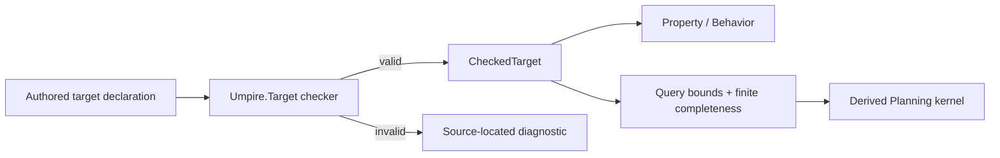

# Deepen Umpire Target and simplify Temporal target authoring

> HTML render lens (local): open `.flow/artifacts/fn-31-deepen-umpire-target-and-simplify/spec.html` — regenerable, markdown is the record. <!-- flow-next:artifact-link -->

## Overview

Turn `Umpire.Target` into the deep checked composition module required by the revised Umpire4 architecture. Preserve existing target semantics and canonical artifacts while moving routine provider, connector, identity, stable provenance, digest, checked-result extraction, finite-planning availability, and planner-derivation plumbing behind one cohesive typed Lean interface. Keep Target as the reusable semantic-model substrate below Property, Behavior, Query, and Planning rather than presenting it as a second scenario or regression language. Prove the boundary with the domain-neutral Switch target, the Temporal Nexus target authors, and their downstream query consumers before Refinement, discovery, and additional domain models bind to the current low-level seam.

## Goal & Context
<!-- scope: business -->

A semantic-model maintainer should define or extend a reusable Feature or System target by stating its semantic vocabulary, capabilities, transition kernel, required laws, and—when exhaustive planning is supported—its finite planning domain once, without manually assembling reusable Umpire checking, canonicalization, extraction, Query, or Planning internals. Ordinary Temporal engineers should then consume that `CheckedTarget` from Property, Behavior, and Query declarations without constructing proof-carrying backend records. Umpire maintainers retain the lower-level typed checker for new kernels and expert extensions, while the ordinary typed facade produces a complete checked declaration or a precise source-located compiler diagnostic.

## Architecture & Data Models
<!-- scope: technical -->

`Umpire.Target` owns the authored-to-checked transition for target vocabulary, capabilities, laws, providers, connectors, transition semantics, canonical identity, and stable semantic provenance. It also owns an additive finite-planning capability: targets that support exhaustive planning carry target-owned action/initial/step enumeration, explicit soundness/completeness proofs, and the existing stable role/action-domain contract tokens; targets that omit it remain fully checked semantic targets but cannot satisfy an exhaustive Query. Target remains below and imports neither Query nor Planning. Its established deterministic `composeTarget` validation and canonical projections remain the semantic baseline and focused expert seam; the ordinary public path adds occurrence capture and compiler-facing diagnostics without creating a second checker.

`Umpire.Query` continues to own query bounds, the query-level completeness view, and its typed failures. Its adapter admits an available Target finite-planning capability or returns the existing `missingFiniteCompleteness`; omission is explicit planning unavailability, not a partially checked Target. `Umpire.Planning` continues to own the indexed `IncrementalPlannerKernel`, finite ordering obligations, and execution. Their public constructors derive those downstream views from a checked target so examples no longer assemble `FiniteCompletenessEvidence`, `FiniteKernelOrder`, or `IncrementalPlannerKernel` records. Property, Behavior, and Query remain the only public scenario/question languages; Target is the checked semantic substrate they consume.



Meaning-bearing choices remain explicit: states, actions, outcomes, observations, capabilities, laws, transition behavior, omissions, and competing providers or cross-domain connectors at Target; bounds and query completeness remain explicit at Query. The deep interfaces hide construction mechanics, not semantic decisions. `Umpire` remains domain-neutral, and Feature/System ownership remains a Temporal concern above these modules.

## Approach

- Reduce `Umpire.Core` to stable shared vocabulary and make target composition/canonicalization private implementation detail behind `Umpire.Target`.
- Preserve the established pure target checker and canonicalization as the single low-level semantic implementation, then add an approachable authored declaration/check path that returns a complete `CheckedTarget` or one deterministic `AuthoringDiagnostic`.
- Add the narrow compiler-facing elaboration adapter required to capture authored occurrences and emit Lean diagnostics. It may provide source-capture syntax, but it must not introduce a general `feature ... where` grammar or another semantic representation.
- Preserve a lower-level `Except DeclarationError` extension path for Umpire maintainers without re-exporting it as the ordinary example path.
- Keep the dependency direction `Target -> Property/Behavior -> Query -> Artifact/Planning`; adapt Query and Planning constructors to consume checked Target values without moving Query bounds, finite query evidence, or planner execution into Target.
- Separate stable `SemanticSource` provenance from an elaboration-only authored-occurrence table used for exact diagnostics; only stable provenance participates in checked values, semantic identities, and artifact bytes. Each syntax occurrence receives a nonsemantic `AuthoringOccurrenceId` derived from its source span and local ordinal plus a closed occurrence role/path (for example declaration, provider definition/reference, connector definition/reference, law, meaning, reconciliation, or kernel). Validation failures retain that role/path until diagnostic lookup, so repeated use of one identity cannot select an unrelated span. Matching occurrences are canonically source-sorted so duplicates remain unambiguous and input-list reordering cannot change the diagnostic.
- Migrate the domain-neutral Switch target, the BasicLifecycle and CallerClosure target authors, and the BasicOperations query consumers only after semantic and byte compatibility fixtures exist.
- Keep physical Temporal family decomposition proportional; do not split files merely for symmetry.

## Quick commands

```bash
cd model && mise exec -- lake build Umpire.TargetTests Umpire.QueryTests Umpire.Planning.Tests
cd model && mise exec -- lake build Temporal.Feature.Nexus.Examples.BasicLifecycleTests Temporal.Feature.Nexus.Examples.BasicOperationsTests Temporal.Feature.Nexus.CallerClosureTests
cd model && mise exec -- lake build UmpireTests TemporalModelTests
make umpire-check-regression
make lint-model
```

## API Contracts
<!-- scope: technical -->

- The low-level target checker accepts inert authored data plus explicitly supplied transition/law obligations and returns either one canonical `CheckedTarget` or one deterministic typed `DeclarationError`. A single detailed validation pass also retains the closed occurrence role/path for compiler diagnostics; the existing `composeTarget` result is its compatibility projection, not a second checker. The ordinary authored adapter combines that result with compiler-captured occurrence metadata and returns or emits one `AuthoringDiagnostic`; unchecked or partially checked values cannot enter Query, Planning, Observation, Refinement, or Artifact APIs.
- Stable semantic identities and digests are independent of declaration order, documentation, and elaboration-site layout. Existing `SemanticSource` values remain stable serialized provenance. The ordinary authoring wrapper captures Lean source information in a separate authored-occurrence table keyed by nonsemantic `AuthoringOccurrenceId`; each row also carries its declaration identity and closed occurrence role/path. Diagnostic lookup first matches the failure's role/path and then sorts occurrences by `(path, start, end, localOrdinal)`. For a duplicate, the earliest occurrence is the original and the next is the offending occurrence regardless of input-list order. `AuthoringDiagnostic` combines that location with the typed error but the table, occurrence role, and occurrence ID are excluded from `CheckedTarget`, canonical projections, digests, and artifacts.
- Semantic-model maintainers do not construct raw provider/connector collection records, canonical metadata, checked-result extraction proofs, `FiniteCompletenessEvidence`, `FiniteKernelOrder`, or `IncrementalPlannerKernel` records. Provider/connector choices, transition semantics, and proof obligations remain explicit declarative inputs to the appropriate checked constructor. A maintainer may opt a target into exhaustive planning by supplying its finite domain and the existing stable role/action-domain contract tokens once at Target; Query copies those tokens verbatim into its canonical completeness view. Ordinary Property/Behavior/Query authors neither invent nor repeatedly thread those tokens or any downstream planning records.
- Competing providers and cross-domain relationships remain explicit and cannot be selected by declaration order or type-class search.
- Target validation preserves the current pinned order: validate declaration identities and declaration duplicates; require the target declaration kind; reject duplicate provider and connector identities; validate providers, including declaration references, laws, and meanings; validate connectors, including declaration references, laws, and reconciliation membership; validate required capability references and provider coverage; reject provider conflicts and connector ambiguity; then validate kernel availability and kernel identity. These produce only the existing `DeclarationErrorKind` cases: `emptyIdentity`, `invalidIdentity`, `duplicateIdentity`, `unknownIdentity`, `wrongKind`, `missingLaw`, `unexpectedLaw`, `lawContractMismatch`, `missingProvider`, `conflictingProviders`, `ambiguousConnector`, and `incompleteKernel`. An invalid proof does not become runtime data: law and soundness/completeness disagreement remains an elaboration-time proof obligation, while an intentionally incomplete kernel uses `KernelAvailability.incomplete`.
- The checked Target exposes an additive finite-planning capability rather than making new fields mandatory on every target constructor. When available, it carries an explicit finite action list with focused `actionSound` and `actionComplete` obligations alongside the existing initial/step lists and proofs, plus stable role/action-domain contract tokens. When absent, the Target is still semantically checked and the exhaustive Query adapter returns `missingFiniteCompleteness`. A family maintainer proves and names the finite domain once; ordinary query authors never recreate it. Query retains `invalidBound`, `unitMismatch`, `missingFiniteCompleteness`, and `targetKernelMismatch`; its checked adapter derives role assignments from `CheckedTarget.resolvedSetups`, copies the stable contract tokens verbatim, and admits action completeness before Planning starts. Planning derives its indexed kernel and ordering view from admitted Query completeness plus those target-owned finite lists, without Target importing either module.

## Edge Cases & Constraints
<!-- scope: technical -->

- Existing comments, public Property/Behavior/Query semantics, planner outcomes, and canonical regression fixtures are preserved.
- Authoring sugar may not infer target outcomes, omit required laws, silently select a provider, or manufacture completeness evidence.
- BasicOperations remains a downstream consumer of the shared BasicLifecycle target; the migration must not create a duplicate BasicOperations target or move query meaning into Target.
- Domain-neutral fixtures prove the full public interface without importing `Temporal`; import checks prevent `Umpire.*` from acquiring Temporal vocabulary or dependencies.
- Existing low-level APIs may move or become internal only when all current callers are migrated in the same task and no compatibility facade is needed by another active consumer.
- Diagnostics must not require authors to use `Except.toOption`, prove `isSome`, or invoke `native_decide` merely to extract a valid declaration. Diagnostic lookup uses the validation-stage occurrence role/path before source sorting, and duplicate diagnostics source-sort matching occurrence spans to select the canonical original/offending pair. Diagnostic fixtures reuse identities in definitions, metadata, and references to prove the right occurrence is selected, and vary authored layout independently from stable `SemanticSource`, semantic digests, canonical target metadata, and persisted artifacts; occurrence spans never enter those semantic products.
- The completed fn-34 import-graph lint remains the enforcement substrate. This spec extends its policy coverage for the Target facade and examples rather than introducing another import scanner.

## Acceptance Criteria
<!-- scope: both -->

- **R1:** `Umpire.Target` is the single deep module for target declaration, composition, validation, canonicalization, and checked transition-kernel binding, while `Umpire.Core` retains only stable shared vocabulary. The existing low-level checker remains the sole semantic implementation; Target typed failures use the pinned existing `DeclarationErrorKind` order through `incompleteKernel`, while Query independently owns bound, finite-completeness, and target-kernel mismatch failures. Errors: a second checker, duplicated canonicalization, a partial checked value, or a downstream value produced after either boundary rejects fails completion.
- **R2:** Domain-neutral and Temporal semantic-model maintainers use one approachable checked Target path without assembling provider/connector collections, canonical metadata/digests, checked-result extraction proofs, or planner backend structures; ordinary scenario authors consume its result through Property, Behavior, and Query. A maintainer may supply the existing stable role/action-domain compatibility tokens once when declaring an exhaustive finite-planning capability, but ordinary authors do not invent or thread them downstream. Property/Behavior/Query remain the only scenario/question languages, while Target is their semantic substrate. Errors: any migrated example still requiring routine plumbing, a second regression interface, or a second public path with different semantics fails completion.
- **R3:** The interface keeps every meaning-bearing state, finite action domain, action-domain soundness/completeness obligation, stable finite-domain contract token, outcome, observation, capability, law, transition, Query bound, planning omission, provider choice, and connector explicit. Family maintainers opt into and prove the finite action domain once at Target; Target remains fully checked when planning data is explicitly unavailable, and an exhaustive Query then fails with `missingFiniteCompleteness`. Query derives its available completeness view without weakening or manufacturing evidence and copies compatibility tokens verbatim. Errors: declaration order, implicit type-class search, undocumented defaults, synthesized digest tokens, or author-supplied outcomes outside the authoritative transition kernel cannot affect checked semantics.
- **R4:** Invalid ordinary declarations produce deterministic `AuthoringDiagnostic` values with exact file/line/column from an elaboration-only authored-occurrence table, while the expert seam retains typed `DeclarationError`. Validation-stage occurrence roles distinguish definitions, metadata, references, laws, meanings, reconciliation, and kernel occurrences that reuse one identity. Duplicate identities resolve against source-sorted matching occurrence spans and report the canonical original/offending pair independently of authored-list order. Stable `SemanticSource` remains the serialized provenance contract; authored occurrence IDs, roles, and spans never enter checked values, semantic identities/digests, canonical metadata, or artifacts. Errors: opaque extraction failures, panics, partial checked values, wrong-role or source-order-dependent diagnostics, occurrence data entering semantic products, or an expert seam bypassing checking fails completion.
- **R5:** The Switch target, BasicLifecycle and CallerClosure target authors, and BasicOperations AsyncStart/SuccessfulCompletion query consumers migrate with unchanged checked meaning, Query/Planning behavior, stable provenance, and byte-identical canonical artifacts for equivalent stable semantic inputs. The compatibility inventory also covers every live ordinary Nexus consumer present when the matrix lands, including Observation coverage if available, without making fn-4 a hard dependency. Errors: a duplicate BasicOperations target, changed semantic identity/digest, canonical bytes, planner outcome, regression projection, or existing valid/invalid fixture result blocks migration.
- **R6:** Facade, import-graph, mutation, aggregate, and documentation checks mechanically enforce Umpire domain purity, ordinary import isolation, deterministic checking, public-interface-only examples, and the distinction between Target substrate and Property/Behavior/Query scenario languages. The final docs teach the compiled typed facade and preserve the no-second-regression-interface rule without promising a general macro DSL. Errors: `Umpire.*` importing `Temporal.*`, tests reaching through private internals, stale low-level walkthroughs, contradictory authoring rules, lost comments, or generated/runtime/Veil/Umpire3 coupling fails verification.

## Early proof point

Task `.1` proves the existing target semantics and canonical products can be represented through a smaller public boundary without weakening validation. If the equivalence fixtures fail, reconsider the facade/internal split before migrating any Temporal family.

## Boundaries
<!-- scope: business -->

- No new Property, Behavior, Space, Observation, Refinement, Artifact, Exploration, or verification semantics; Query and Planning changes are API/derivation refactors that preserve their existing bounds, completeness, ordering, and outcome semantics.
- No wholesale physical split of CallerClosure or other Temporal families before the public target interface removes their boilerplate.
- No general `feature ... where` language, universal domain-model AST, or second scenario/regression DSL. A narrow elaboration wrapper used only for occurrence capture and compiler diagnostics is in scope; its inert declarations lower to the established Target checker.
- No compatibility facade without a demonstrated active consumer.
- No runtime, CLI, persisted artifact format, Go code, Veil dependency, or Umpire3 reuse.

## Decision Context
<!-- scope: both -->

### Motivation
<!-- scope: business -->

The revised architecture makes target depth the prerequisite for downstream semantic composition. Refinement, discovery/catalog work, and additional Temporal families would otherwise bind to or copy today’s low-level composition surface and make later simplification more expensive.

### Implementation Tradeoffs
<!-- scope: technical -->

This work preserves semantic behavior and narrows the interface before reorganizing model families. A single deep Target module is preferred over shallow helper wrappers because checking, canonicalization, composition, and diagnostics must evolve together behind one contract.

Target is not a fourth scenario language: it is the checked semantic-model substrate used by the distinct Property, Behavior, and Query languages. The low-level `Except DeclarationError` checker remains the expert extension seam; the ordinary facade adds source capture and diagnostics without duplicating semantics. The existing task order keeps architecture/docs after the public API and example migrations, then runs the compatibility matrix as the final gate over both code and documented facade.

## References

- Revised Umpire4 model architecture and deep-module specifications: Target depth precedes additional authoring languages; Umpire remains Temporal-independent.
- `fn-34-enforce-lean-model-boundaries-with` — completed task set providing the import-graph lint extended by this spec.
- `fn-5-umpire-discovery-promotion-and-artifact` and `fn-32-add-umpire-refinement-and-the-first` — downstream consumers that must target the deep checked facade rather than the current assembly path.
- Current checked Target language and tests — exact typed failures, validation order, canonicalization, and the low-level expert seam.
- Current Query and Planning languages and tests — bounds, completeness evidence, finite ordering, indexed derivation, and their owned errors.
- The domain-neutral Switch target plus the BasicLifecycle, BasicOperations AsyncStart/SuccessfulCompletion, and CallerClosure Temporal examples — migration inventory.

## Requirement coverage

| Req | Description | Task(s) | Gap justification |
| --- | --- | --- | --- |
| R1 | Deep Target ownership and typed validation | `.1`, `.2`, `.7` | — |
| R2 | Approachable single authoring path | `.2`, `.3`, `.4`, `.7` | — |
| R3 | Explicit semantic choices | `.2`, `.3`, `.4`, `.7` | — |
| R4 | Diagnostics and expert seam | `.2`, `.5` | — |
| R5 | Semantic and artifact compatibility | `.1`, `.3`, `.4`, `.6`, `.7` | — |
| R6 | Purity, imports, mutation, docs | `.1`–`.7` | — |
