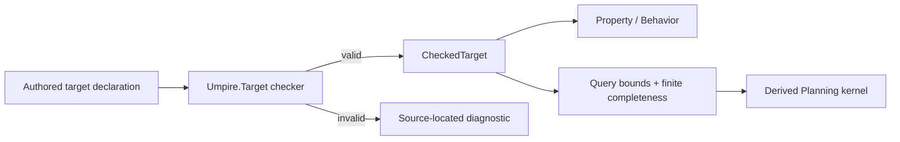

# Deepen Umpire Target and simplify Temporal target authoring

> HTML render lens (local): open `.flow/artifacts/fn-31-deepen-umpire-target-and-simplify/spec.html` — regenerable, markdown is the record. <!-- flow-next:artifact-link -->

## Overview

Turn `Umpire.Target` into the deep checked composition module required by the revised Umpire4 architecture. Preserve existing target semantics and canonical artifacts while moving routine provider, connector, identity, stable provenance, digest, and checked-result extraction plumbing behind a cohesive public authoring interface. Adapt the downstream Query and Planning seams so ordinary authors derive query completeness and planner kernels from checked values without reversing the dependency direction. Migrate the domain-neutral Switch example and the existing Temporal Nexus families through that interface before adding further authoring languages.

## Goal & Context
<!-- scope: business -->

A Temporal engineer with Lean basics should be able to define or extend a Feature or System target by stating its semantic vocabulary, capabilities, transition kernel, and required laws without manually assembling reusable Umpire internals. Umpire maintainers retain lower-level typed construction for new kernels and expert extensions, but ordinary models receive checked declarations or precise source-located diagnostics.

## Architecture & Data Models
<!-- scope: technical -->

`Umpire.Target` owns the authored-to-checked transition for target vocabulary, capabilities, laws, providers, connectors, target-owned action/initial/step enumeration with explicit soundness/completeness proofs, transition semantics, canonical identity, and stable semantic provenance. It remains below and imports neither Query nor Planning. `Umpire.Query` continues to own query bounds, role/action finite-completeness evidence, and their typed failures; `Umpire.Planning` continues to own the indexed `IncrementalPlannerKernel`, ordering proofs, and execution. Their public constructors are adapted to derive those downstream views from a checked target and declarative finite inputs so examples no longer assemble proof-carrying backend records.



Meaning-bearing choices remain explicit: states, actions, outcomes, observations, capabilities, laws, transition behavior, omissions, and competing providers or cross-domain connectors at Target; bounds and query completeness remain explicit at Query. The deep interfaces hide construction mechanics, not semantic decisions. `Umpire` remains domain-neutral, and Feature/System ownership remains a Temporal concern above these modules.

## Approach

- Reduce `Umpire.Core` to stable shared vocabulary and make target composition/canonicalization private implementation detail behind `Umpire.Target`.
- Add an approachable authored declaration/check operation that returns a complete `CheckedTarget` or one deterministic typed error suitable for source-located diagnostics.
- Preserve a lower-level typed extension path for model maintainers without exposing it as the ordinary example path.
- Keep the dependency direction `Target -> Property/Behavior -> Query -> Artifact/Planning`; adapt Query and Planning constructors to consume checked Target values without moving Query bounds, finite query evidence, or planner execution into Target.
- Separate stable `SemanticSource` provenance from an elaboration-only authored-occurrence table used for exact diagnostics; only stable provenance participates in checked values, semantic identities, and artifact bytes. Each syntax occurrence receives a nonsemantic `AuthoringOccurrenceId` derived from its source span and local ordinal, and declaration identities map to a canonically source-sorted list of occurrences so duplicates remain unambiguous and input-list reordering cannot change the diagnostic.
- Migrate domain-neutral and Temporal examples only after byte-for-byte and semantic equivalence fixtures exist.
- Keep physical Temporal family decomposition proportional; do not split files merely for symmetry.

## Quick commands

```bash
cd model && mise exec -- lake build Umpire.TargetTests Umpire.QueryTests Umpire.Planning.Tests
cd model && mise exec -- lake build Temporal.Feature.Nexus.Examples.BasicLifecycleTests Temporal.Feature.Nexus.Examples.BasicOperationsTests Temporal.Feature.Nexus.CallerClosureTests
cd model && mise exec -- lake build UmpireTests TemporalModelTests
make umpire-check-regression
```

## API Contracts
<!-- scope: technical -->

- Target checking accepts inert authored data plus explicitly supplied transition/law obligations and returns either one canonical `CheckedTarget` or one deterministic typed `DeclarationError`; unchecked or partially checked values cannot enter Query, Planning, Observation, Refinement, or Artifact APIs.
- Stable semantic identities and digests are independent of declaration order, documentation, and elaboration-site layout. Existing `SemanticSource` values remain stable serialized provenance. The ordinary authoring wrapper captures Lean source information in a separate authored-occurrence table keyed by nonsemantic `AuthoringOccurrenceId`; each row also carries its declaration identity. Diagnostic lookup sorts matching occurrences by `(path, start, end, localOrdinal)`. For a duplicate, the earliest occurrence is the original and the next is the offending occurrence regardless of input-list order. `AuthoringDiagnostic` combines that location with the typed error but the table and occurrence ID are excluded from `CheckedTarget`, canonical projections, digests, and artifacts.
- Ordinary target authors do not construct raw provider/connector records, canonical metadata, digest strings, checked-result extraction proofs, `FiniteCompletenessEvidence`, `FiniteKernelOrder`, or `IncrementalPlannerKernel` records. Provider/connector choices and finite domains remain explicit declarative inputs to the appropriate checked constructor.
- Competing providers and cross-domain relationships remain explicit and cannot be selected by declaration order or type-class search.
- Target validation has one pinned order: identity syntax; duplicate provider/connector identities; referenced declaration existence/kind; law requirement/witness presence and digest agreement; provider coverage/conflict; connector membership/ambiguity; then `KernelAvailability`. These produce only the existing `DeclarationErrorKind` cases: `emptyIdentity`, `invalidIdentity`, `duplicateIdentity`, `unknownIdentity`, `wrongKind`, `missingLaw`, `unexpectedLaw`, `lawContractMismatch`, `missingProvider`, `conflictingProviders`, `ambiguousConnector`, and `incompleteKernel`. An invalid proof does not become runtime data: law and soundness/completeness disagreement remains an elaboration-time proof obligation, while an intentionally incomplete kernel uses `KernelAvailability.incomplete`.
- The checked Target kernel exposes an explicit finite action list plus focused `actionSound` and `actionComplete` obligations, alongside its existing initial/step lists and proofs. A family maintainer proves these semantic obligations once; ordinary query authors never recreate them. Query retains `invalidBound`, `unitMismatch`, `missingFiniteCompleteness`, and `targetKernelMismatch`; its checked adapter derives role assignments from `CheckedTarget.resolvedSetups` and action completeness from the checked kernel before Planning starts. Planning derives its indexed kernel and ordering view from admitted Query completeness plus those target-owned finite lists, without Target importing either module.

## Edge Cases & Constraints
<!-- scope: technical -->

- Existing comments, public Property/Behavior/Query semantics, planner outcomes, and canonical regression fixtures are preserved.
- Authoring sugar may not infer target outcomes, omit required laws, silently select a provider, or manufacture completeness evidence.
- Domain-neutral fixtures prove the full public interface without importing `Temporal`; import checks prevent `Umpire.*` from acquiring Temporal vocabulary or dependencies.
- Existing low-level APIs may move or become internal only when all current callers are migrated in the same task and no compatibility facade is needed by another active consumer.
- Diagnostics must not require authors to use `Except.toOption`, prove `isSome`, or invoke `native_decide` merely to extract a valid declaration. Diagnostic fixtures pin exact file, line, and column independently from stable canonical provenance.

## Acceptance Criteria
<!-- scope: both -->

- **R1:** `Umpire.Target` is the single deep module for target declaration, composition, validation, canonicalization, and checked transition-kernel binding, while `Umpire.Core` retains only stable shared vocabulary. Target typed failures use the pinned existing `DeclarationErrorKind` order through `incompleteKernel`; Query independently owns bound, finite-completeness, and target-kernel mismatch failures. No checked or downstream value is produced after either boundary rejects.
- **R2:** Ordinary domain-neutral and Temporal target declarations use one approachable checked authoring path without assembling provider/connector collections, metadata/digests, checked-result extraction proofs, or planner backend structures. Errors: any example still requiring that routine plumbing, or a second public authoring path with different semantics, fails completion.
- **R3:** The interface keeps every meaning-bearing state, finite action domain, action-domain soundness/completeness obligation, outcome, observation, capability, law, transition, Query bound, omission, provider choice, and connector explicit. Family maintainers prove the finite action domain once in the checked Target kernel; Query derives its completeness view without weakening or manufacturing evidence. Errors: declaration order, implicit type-class search, undocumented defaults, or author-supplied outcomes outside the authoritative transition kernel cannot affect checked semantics.
- **R4:** Invalid authored declarations produce deterministic `AuthoringDiagnostic` values with exact file/line/column from an elaboration-only authored-occurrence table, while stable `SemanticSource` provenance and canonical bytes remain unchanged. Duplicate identities resolve against source-sorted occurrence spans and report the canonical original/offending pair independent of authored-list order. Model maintainers retain a focused low-level typed extension seam. Errors: location data entering semantic identity/artifacts, opaque extraction failures, panics, partial checked values, source-order-dependent diagnostics, or a low-level seam bypassing checking fail completion.
- **R5:** The Switch example and current Temporal Nexus target families migrate with unchanged checked meaning, Query/Planning behavior, and byte-identical canonical artifacts for equivalent inputs. Errors: changed semantic identity/digest, planner outcome, regression projection, or existing valid/invalid fixture result blocks migration.
- **R6:** Facade, import, mutation, and aggregate tests mechanically enforce Umpire domain purity, ordinary import isolation, deterministic checking, and public-interface-only examples. Errors: `Umpire.*` importing `Temporal.*`, tests reaching through private internals, lost comments, or generated/runtime/Veil coupling fails verification.

## Early proof point

Task `.1` proves the existing target semantics and canonical products can be represented through a smaller public boundary without weakening validation. If the equivalence fixtures fail, reconsider the facade/internal split before migrating any Temporal family.

## Boundaries
<!-- scope: business -->

- No new Property, Behavior, Space, Observation, Refinement, Artifact, Exploration, or verification semantics; Query and Planning changes are API/derivation refactors that preserve their existing bounds, completeness, ordering, and outcome semantics.
- No wholesale physical split of CallerClosure or other Temporal families before the public target interface removes their boilerplate.
- No macro syntax commitment beyond an approachable checked declaration contract.
- No compatibility facade without a demonstrated active consumer.
- No runtime, CLI, persisted artifact format, Go code, Veil dependency, or Umpire3 reuse.

## Decision Context
<!-- scope: both -->

### Motivation
<!-- scope: business -->

The revised architecture makes target depth the prerequisite for new authoring languages. Adding Space, Refinement, or additional Temporal families on top of today’s low-level composition surface would copy plumbing into every model and make later simplification more expensive.

### Implementation Tradeoffs
<!-- scope: technical -->

This work preserves semantic behavior and narrows the interface before reorganizing model families. A single deep Target module is preferred over shallow helper wrappers because checking, canonicalization, composition, and diagnostics must evolve together behind one contract.

## References

- Revised Umpire4 model architecture and deep-module specifications: Target depth precedes additional authoring languages; Umpire remains Temporal-independent.
- `model/Umpire/Target/Language.lean` and `model/Umpire/Target/Tests/**` — current checked target language, exact typed failures, validation order, and canonicalization.
- `model/Umpire/Query/Language.lean` and `model/Umpire/Query/Tests/**` — current bounds, finite-completeness evidence, and Query-owned errors.
- `model/Umpire/Planning/Engine.lean` and `model/Umpire/Planning/Tests/**` — current indexed kernel and finite-order derivation.
- `model/Umpire/Examples/Switch.lean` plus the BasicLifecycle, BasicOperations.AsyncStart, BasicOperations.SuccessfulCompletion, and CallerClosure Temporal families — migration inventory.

## Requirement coverage

| Req | Description | Task(s) | Gap justification |
| --- | --- | --- | --- |
| R1 | Deep Target ownership and typed validation | `.1`, `.2`, `.7` | — |
| R2 | Approachable single authoring path | `.2`, `.3`, `.4`, `.7` | — |
| R3 | Explicit semantic choices | `.2`, `.3`, `.4`, `.7` | — |
| R4 | Diagnostics and expert seam | `.2`, `.5` | — |
| R5 | Semantic and artifact compatibility | `.1`, `.3`, `.4`, `.6`, `.7` | — |
| R6 | Purity, imports, mutation, docs | `.1`–`.6` | — |
