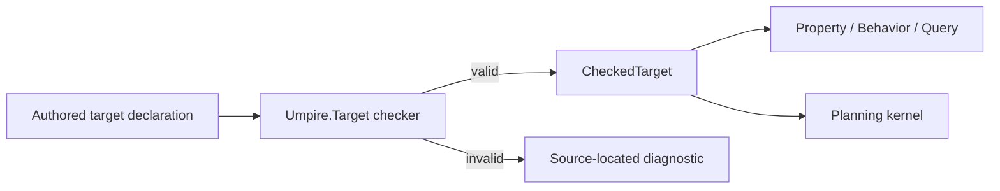

# Deepen Umpire Target and simplify Temporal target authoring

## Overview

Turn `Umpire.Target` into the deep checked composition module required by the revised Umpire4 architecture. Preserve existing target semantics and canonical artifacts while moving routine provider, connector, identity, source, digest, checked-result extraction, and planner-kernel plumbing behind a cohesive public authoring interface. Migrate the domain-neutral Switch example and the existing Temporal Nexus families through that interface before adding further authoring languages.

## Goal & Context
<!-- scope: business -->

A Temporal engineer with Lean basics should be able to define or extend a Feature or System target by stating its semantic vocabulary, capabilities, transition kernel, and required laws without manually assembling reusable Umpire internals. Umpire maintainers retain lower-level typed construction for new kernels and expert extensions, but ordinary models receive checked declarations or precise source-located diagnostics.

## Architecture & Data Models
<!-- scope: technical -->

`Umpire.Target` owns the authored-to-checked transition for target vocabulary, capabilities, laws, providers, connectors, finite enumeration, transition semantics, canonical identity, and planner-kernel binding. Its public facade exposes a small declaration/checking interface; implementation modules retain canonicalization, graph validation, proof obligations, and low-level extension records.



Meaning-bearing choices remain explicit: states, actions, outcomes, observations, capabilities, laws, transition behavior, bounds, omissions, and competing providers or cross-domain connectors. The deep interface hides construction mechanics, not semantic decisions. `Umpire` remains domain-neutral, and Feature/System ownership remains a Temporal concern above this module.

## Approach

- Reduce `Umpire.Core` to stable shared vocabulary and make target composition/canonicalization private implementation detail behind `Umpire.Target`.
- Add an approachable authored declaration/check operation that returns a complete `CheckedTarget` or one deterministic typed error suitable for source-located diagnostics.
- Preserve a lower-level typed extension path for model maintainers without exposing it as the ordinary example path.
- Migrate domain-neutral and Temporal examples only after byte-for-byte and semantic equivalence fixtures exist.
- Keep physical Temporal family decomposition proportional; do not split files merely for symmetry.

## Quick commands

```bash
cd model && mise exec -- lake build Umpire.TargetTests Umpire.Examples.SwitchTests
cd model && mise exec -- lake build Temporal.Feature.Nexus.Examples.BasicLifecycleTests Temporal.Feature.Nexus.Examples.BasicOperationsTests Temporal.Feature.Nexus.CallerClosureTests
cd model && mise exec -- lake build UmpireTests TemporalModelTests
make umpire-check-regression
```

## API Contracts
<!-- scope: technical -->

- Checking accepts inert authored data plus explicitly supplied transition/law obligations and returns either one canonical `CheckedTarget` or one deterministic typed target error; unchecked or partially checked values cannot enter Query, Planning, Observation, Refinement, or Artifact APIs.
- Stable semantic identities and digests are independent of declaration order, documentation, and source layout. Equivalent existing declarations produce the same checked semantic values and canonical artifacts.
- Ordinary target authors do not construct provider/connector lists, canonical metadata, digest strings, checked-result extraction proofs, or planner backend records.
- Competing providers and cross-domain relationships remain explicit and cannot be selected by declaration order or type-class search.
- Precise diagnostics cover wrong-kind/unknown declarations, duplicate identities, missing capabilities or laws, incompatible providers, missing/ambiguous connectors, incomplete enumeration, invalid bounds, and kernel/law disagreement.

## Edge Cases & Constraints
<!-- scope: technical -->

- Existing comments, public Property/Behavior/Query semantics, planner outcomes, and canonical regression fixtures are preserved.
- Authoring sugar may not infer target outcomes, omit required laws, silently select a provider, or manufacture completeness evidence.
- Domain-neutral fixtures prove the full public interface without importing `Temporal`; import checks prevent `Umpire.*` from acquiring Temporal vocabulary or dependencies.
- Existing low-level APIs may move or become internal only when all current callers are migrated in the same task and no compatibility facade is needed by another active consumer.
- Diagnostics must not require authors to use `Except.toOption`, prove `isSome`, or invoke `native_decide` merely to extract a valid declaration.

## Acceptance Criteria
<!-- scope: both -->

- **R1:** `Umpire.Target` is the single deep module for target declaration, composition, validation, canonicalization, and checked kernel binding, while `Umpire.Core` retains only stable shared vocabulary. Errors: duplicate/wrong-kind identities, missing capabilities/laws, incompatible providers, absent or ambiguous connectors, incomplete finite enumeration, invalid bounds, or kernel/law disagreement return one typed failure and no checked target.
- **R2:** Ordinary domain-neutral and Temporal target declarations use one approachable checked authoring path without assembling provider/connector collections, metadata/digests, checked-result extraction proofs, or planner backend structures. Errors: any example still requiring that routine plumbing, or a second public authoring path with different semantics, fails completion.
- **R3:** The interface keeps every meaning-bearing state, action, outcome, observation, capability, law, transition, bound, omission, provider choice, and connector explicit. Errors: declaration order, implicit type-class search, undocumented defaults, or author-supplied outcomes outside the authoritative transition kernel cannot affect checked semantics.
- **R4:** Invalid authored declarations produce deterministic source-located diagnostics suitable for ordinary Lean development, while model maintainers retain a focused low-level typed extension seam. Errors: opaque extraction failures, panics, partial checked values, diagnostics dependent on source order, or a low-level seam that bypasses checking fail completion.
- **R5:** The Switch example and current Temporal Nexus target families migrate with unchanged checked meaning, Query/Planning behavior, and byte-identical canonical artifacts for equivalent inputs. Errors: changed semantic identity/digest, planner outcome, regression projection, or existing valid/invalid fixture result blocks migration.
- **R6:** Facade, import, mutation, and aggregate tests mechanically enforce Umpire domain purity, ordinary import isolation, deterministic checking, and public-interface-only examples. Errors: `Umpire.*` importing `Temporal.*`, tests reaching through private internals, lost comments, or generated/runtime/Veil coupling fails verification.

## Early proof point

Task `.1` proves the existing target semantics and canonical products can be represented through a smaller public boundary without weakening validation. If the equivalence fixtures fail, reconsider the facade/internal split before migrating any Temporal family.

## Boundaries
<!-- scope: business -->

- No new Property, Behavior, Space, Query, Observation, Refinement, Artifact, Planning, Exploration, or verification semantics.
- No wholesale physical split of CallerClosure or other Temporal families before the public target interface removes their boilerplate.
- No macro syntax commitment beyond an approachable checked declaration contract.
- No compatibility facade without a demonstrated active consumer.
- No runtime, CLI, persisted artifact format, Go code, Veil dependency, or Umpire3 reuse.

## Decision Context
<!-- scope: both -->

### Motivation
<!-- scope: business -->

The revised architecture makes target depth the prerequisite for new authoring languages. Adding Space, Refinement, or additional Temporal families on top of today’s low-level composition surface would copy plumbing into every model and make later simplification more expensive.

### Implementation Tradeoffs
<!-- scope: technical -->

This work preserves semantic behavior and narrows the interface before reorganizing model families. A single deep Target module is preferred over shallow helper wrappers because checking, canonicalization, composition, and diagnostics must evolve together behind one contract.

## References

- Revised Umpire4 model architecture and deep-module specifications: Target depth precedes additional authoring languages; Umpire remains Temporal-independent.
- Current checked target language and validation/canonicalization suites.
- Current Switch and Temporal Nexus families that expose routine provider, connector, extraction, and planner plumbing.

## Requirement coverage

| Req | Description | Task(s) | Gap justification |
| --- | --- | --- | --- |
| R1 | Deep Target ownership and typed validation | `.1`, `.2` | — |
| R2 | Approachable single authoring path | `.2`, `.3`, `.4` | — |
| R3 | Explicit semantic choices | `.2`, `.3`, `.4` | — |
| R4 | Diagnostics and expert seam | `.2`, `.5` | — |
| R5 | Semantic and artifact compatibility | `.1`, `.3`, `.4` | — |
| R6 | Purity, imports, mutation, docs | `.1`–`.5` | — |
