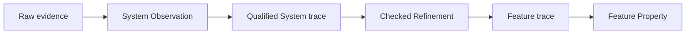

# Add Umpire Refinement and the first Temporal Feature/System correspondence

## Overview

Add one reusable `Umpire.Refinement` deep module and prove it with the first independently authored Temporal Feature/System correspondence. A checked refinement relates System implementation meaning to Feature product meaning without letting either side import or redefine the other. It becomes the required seam between System-owned observation qualification and Feature-owned Property evaluation in later conformance work.

## Goal & Context
<!-- scope: business -->

Temporal model authors need to describe product guarantees and implementation mechanisms at different semantic altitudes while still proving how a concrete System trace establishes a Feature trace. Model engineers should be able to diagnose observation failure, refinement failure, and Feature Property failure as separate outcomes. Runtime and qualification specs need one stable checked refinement contract rather than inventing family-specific translations.

## Architecture & Data Models
<!-- scope: technical -->

`Umpire.Refinement` owns inert declarations, checking, canonical identity, trace correspondence, and derivations. It consumes independently checked source and destination targets plus explicit mappings and proof obligations; it neither imports Temporal nor interprets raw evidence.



The first Temporal family keeps canonical product meaning under `Temporal.Feature.Nexus` and introduces the minimum pure mechanism meaning under `Temporal.System.Nexus`. Only a focused `Temporal.System.Nexus.Refinement` leaf imports both. Base Feature and System modules remain independently understandable and testable.

## Approach

- Define a domain-neutral authored-to-checked refinement lifecycle with stable identities, explicit source/destination targets, trace/value/occurrence mappings, obligations, omissions, and typed errors.
- Preserve a complete derivation for every mapped semantic coordinate so a downstream Result can explain which System facts establish each Feature fact.
- Add a small pure Nexus System mechanism and focused refinement leaf; avoid pulling runtime adapters or evidence-source details into Feature.
- Provide a conformance-facing operation over an already-qualified System trace, leaving raw-evidence interpretation to `Umpire.Observation`.
- Enforce import direction and mutation-test observation and refinement failures independently.

## Quick commands

```bash
cd model && mise exec -- lake build Umpire.Refinement.Tests
cd model && mise exec -- lake build Temporal.System.Nexus.RefinementTests
cd model && mise exec -- lake build UmpireTests TemporalModelTests
make umpire-check-regression
```

## API Contracts
<!-- scope: technical -->

- `checkRefinement` accepts an inert declaration, an independently checked System/source target, and an independently checked Feature/destination target; it returns one canonical checked refinement or one deterministic typed error.
- A declaration explicitly maps compatible states, actions, target-owned outcomes, observations, relations, occurrences, and capabilities, and supplies the required initial/step/trace correspondence obligations. Unmapped or intentionally unsupported vocabulary is an explicit omission.
- Applying a checked refinement to a qualified source trace returns either one destination trace plus a coordinate-complete refinement derivation, or one distinct `invalid`, `unknown`, `conflict`, or `unsupported` refinement outcome. It never returns a partial destination trace.
- The refinement identity binds source/destination target identities and digests, mapping/version, obligations, bounds, and omissions; declaration order and documentation do not affect it.
- Observation qualification, refinement application, and Feature Property evaluation retain distinct outcomes and diagnostic provenance.

## Edge Cases & Constraints
<!-- scope: technical -->

- Wrong-kind or stale target references, duplicate/ambiguous mappings, missing reverse or step obligations, non-total required mappings, incompatible bounds, unsupported vocabulary without an omission, or source/destination digest drift fail checking.
- A qualified System trace whose coordinate cannot be mapped yields a refinement non-success and cannot reach Feature Property evaluation; an Observation failure never masquerades as a refinement failure.
- Repeated equal values remain distinct through stable semantic coordinates and derivations.
- Feature never imports System or Verify; base System never imports Feature; only the focused refinement leaf may import both.
- The first family remains pure and synthetic. Runtime programs, evidence adapters, persisted artifacts, execution, and qualification remain downstream.

## Acceptance Criteria
<!-- scope: both -->

- **R1:** One domain-neutral `Umpire.Refinement` facade checks explicit source/destination target correspondences into a canonical immutable value before use. Errors: stale/wrong-kind targets, duplicate or ambiguous mappings, missing obligations, incompatible capabilities/bounds, unsupported vocabulary without omission, or digest drift return one typed failure and no checked refinement.
- **R2:** Checked refinements explicitly cover required state, action, target-outcome, observation, relation, occurrence, and capability correspondences plus initial/step/trace obligations and omissions. Errors: implicit declaration-order selection, partial required mappings, outcome invention, unproved reverse/step behavior, or hidden unsupported cases cannot check.
- **R3:** Applying a checked refinement to a qualified source trace returns one complete destination trace and coordinate-complete derivation, or a distinct invalid/unknown/conflict/unsupported outcome with no partial trace. Errors: missing/duplicate/contradictory source coordinates, unmapped required vocabulary, bound exhaustion, or derivation mismatch prevents Feature Property evaluation.
- **R4:** One pure Temporal Nexus System model and focused refinement leaf establish the existing Feature caller-closure meaning while Feature and base System remain independently understandable and testable. Errors: Feature importing System, base System importing Feature, runtime/evidence details in Feature, or either side redefining the other fails completion.
- **R5:** Independent mutations prove Observation, Refinement, and Feature Property failures are diagnosed at their responsible boundaries and retain distinct identities/derivations. Errors: a mapping/correspondence mutation surviving, a failure reported by the wrong layer, or an oracle implemented by the code under test fails verification.
- **R6:** Public facades, import checks, architecture documentation, and aggregate tests make Refinement the only Feature/System composition seam without changing existing Feature semantics or canonical artifacts. Errors: Temporal vocabulary under `Umpire`, a second family-specific composition API, Verify/Veil exposure, lost comments, or regression drift blocks completion.

## Early proof point

Task `.1` proves a domain-neutral checked refinement can distinguish a valid correspondence from stale, incomplete, ambiguous, and mutation-broken declarations while retaining complete coordinate derivations. If it fails, reconsider the mapping/obligation boundary before adding the Temporal family.

## Boundaries
<!-- scope: business -->

- No raw-evidence mapping, live runtime, participant program, execution, qualification, or persisted artifact schema.
- No change to existing Feature product meaning, Property evaluation, Behavior, Query, Planning, or target transitions.
- No Veil or optional formal-checker integration.
- No broad Temporal System model; only the minimum pure Nexus mechanism needed to prove the seam.
- No Umpire3 reuse or compatibility facade.

## Decision Context
<!-- scope: both -->

### Motivation
<!-- scope: business -->

Without an explicit refinement seam, live evidence either leaks implementation facts into portable Feature Properties or lets adapters claim product meaning directly. Both create a second semantic authority and make failures impossible to attribute cleanly.

### Implementation Tradeoffs
<!-- scope: technical -->

Refinement is its own deep module because correspondence checking, canonical identity, trace translation, derivations, and diagnostics are reusable and independently testable. The first Temporal family is intentionally small; runtime-specific System programs and observations remain in downstream execution/conformance specs.

## References

- Revised Umpire4 semantic-altitude, explicit-refinement, module-isolation, and failure-separation rules.
- Existing checked Target, Observation, Property, and caller-closure Feature semantics.

## Requirement coverage

| Req | Description | Task(s) | Gap justification |
| --- | --- | --- | --- |
| R1 | Checked domain-neutral Refinement facade | `.1`, `.2` | — |
| R2 | Explicit correspondence and obligations | `.1`, `.2`, `.3` | — |
| R3 | Total application and derivations | `.2`, `.4` | — |
| R4 | First isolated Temporal correspondence | `.3`, `.4` | — |
| R5 | Layer-specific mutation assurance | `.4`, `.5` | — |
| R6 | Facades, imports, docs, compatibility | `.1`–`.5` | — |
