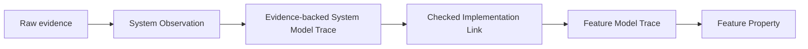

# Add Umpire Implementation Link and the first Temporal Feature/System correspondence

> HTML render lens (local): open `.flow/artifacts/fn-32-add-umpire-refinement-and-the-first/spec.html` — regenerable, markdown is the record. <!-- flow-next:artifact-link -->

## Overview

Add one reusable `Umpire.ImplementationLink` deep module and prove it with the first independently authored Temporal Feature/System correspondence. A checked Implementation Link relates System implementation meaning to Feature product meaning without letting either side import or redefine the other. It becomes the required seam between System-owned Observation Evaluation and Feature-owned Property evaluation in later Run Evaluation work.

## Goal & Context
<!-- scope: business -->

Temporal model authors need to describe product guarantees and implementation mechanisms at different semantic altitudes while still proving how a concrete System trace establishes a Feature Model Trace. Model engineers should be able to diagnose observation failure, Implementation Link failure, and Feature Property failure as separate outcomes. Runtime and Observation Evaluation specs need one stable checked Implementation Link contract rather than inventing family-specific translations.

## Architecture & Data Models
<!-- scope: technical -->

`Umpire.ImplementationLink` owns inert declarations, checking, canonical identity, trace correspondence, and Evidence Links. It consumes independently checked source and destination targets plus explicit mappings and proof obligations; it neither imports Temporal nor interprets raw evidence.



The first Temporal family keeps canonical product meaning under `Temporal.Feature.Nexus` and introduces the minimum pure mechanism meaning under `Temporal.System.Nexus`. Only a focused `Temporal.System.Nexus.ImplementationLink` leaf imports both. Base Feature and System modules remain independently understandable and testable.

### Normative prototype correspondence

The prototype is a **bounded forward simulation**, not bisimulation, reverse simulation, or surjectivity. The inert `ImplementationLinkDeclaration` carries canonical finite tables for setup, state, action, target-owned outcome, observation, relation, and capability correspondence; an explicit support/Known Gap partition; and one positive `semantic-transitions` application Limit. Named `Behavior.NamedOccurrence` values are outside this target-to-target contract. Trace identity is preserved positionally by `initialState`, step index, and observation position; a later Behavior-aware Implementation Link may add named-occurrence correspondence without changing the prototype.

A separate proof-carrying `ImplementationLinkWitness declaration source destination` is supplied to `checkImplementationLink`. It is indexed by the exact declaration and checked targets and contains:

- `initialForward`: for every source setup and source initial state admitted by the source kernel, the table-mapped setup/state is admitted by the destination kernel;
- `stepForward`: for every authoritative source step, mapping its pre-state, action, outcome, post-state, and observations yields one authoritative destination step; and
- `requiredCoverage`: every source setup/value reachable from the checked source kernel is either mapped exactly once or named in the explicit Known Gap partition, with mapped relation/capability Behavior Fingerprints matching the destination target.

The trace theorem is derived inductively from `initialForward` and `stepForward`; authors do not supply an independent trace proof. There is no reverse obligation. `checkImplementationLink declaration source destination witness` validates identities/Behavior Fingerprints, table kinds and uniqueness, the support/Known Gap partition, positive Limit/unit, and witness indexing before returning `CheckedImplementationLink`; proof terms are not serialized or hashed.

`applyImplementationLink checked sourceSetup evidenceBackedTrace` first replays the Evidence-backed Model Trace against the checked source target: the initial value must occur in `source.kernel.initialStates sourceSetup`, every exact step result must occur in `source.kernel.steps state action`, and the trace vocabulary must close against resolved source meanings. Only then does it translate positionally. The forward witness establishes destination-kernel authority for the complete translated trace. No non-success invokes Feature Property evaluation.

| Failure kind | Status | Required diagnostic data |
| --- | --- | --- |
| stale source/destination identity or Behavior Fingerprint, setup mismatch, non-authoritative initial state or step, invalid coordinate | `invalid` | Implementation Link/target Behavior Fingerprints, setup Behavior Fingerprint, coordinate, related identities |
| absent required coordinate, positive application Limit exhausted | `unknown` | coordinate, applied Limit, observed count |
| duplicate or contradictory coordinate, multiple mapped destinations, Evidence Link mismatch | `conflict` | all competing coordinates/identities and Evidence Link Behavior Fingerprint |
| trace reaches an explicitly omitted source value, or vocabulary kind is outside the declared prototype support partition | `unsupported` | coordinate, omitted identity/kind, Known Gap reason |

`ImplementationLinkDiagnostic.identity` canonically binds Implementation Link identity/Behavior Fingerprint, failure kind/status, source coordinate, related identities, Limit/count, and Known Gap/provenance fields. The table is exhaustive: each `ImplementationLinkFailureKind` has exactly one status.

## Approach

- Define a domain-neutral authored-to-checked Implementation Link lifecycle with stable identities, explicit source/destination targets, finite setup/value mappings, forward-simulation obligations, positional trace coordinates, Known Gaps, and typed errors.
- Preserve a complete Evidence Link for every mapped semantic coordinate so a downstream Result can explain which System facts establish each Feature fact.
- Add a small pure Nexus System mechanism and focused Implementation Link leaf; avoid pulling runtime adapters or evidence-source details into Feature.
- Provide a Run Evaluation-facing operation over an already-Evidence-backed System Model Trace, leaving raw-evidence interpretation to `Umpire.Observation`.
- Enforce import direction and mutation-test observation and Implementation Link failures independently.

## Quick commands

```bash
cd model && mise exec -- lake build Umpire.ImplementationLink.Tests
cd model && mise exec -- lake build Temporal.System.Nexus.ImplementationLinkTests
cd model && mise exec -- lake build UmpireTests TemporalModelTests
make umpire-check-regression
```

## API Contracts
<!-- scope: technical -->

- `checkImplementationLink` accepts an inert declaration, independently checked System/source and Feature/destination targets, and a proof-carrying witness indexed by those exact inputs; it returns one canonical checked Implementation Link or one deterministic typed error. The declaration is inert and canonical; proofs remain nonserialized Lean values.
- A declaration explicitly maps compatible setups, states, actions, target-owned outcomes, observations, relations, and capabilities, and supplies the prototype forward initial/step obligations plus a complete support/Known Gap partition. Named Behavior occurrences are excluded; positional trace coordinates are derived. The trace theorem follows inductively, and no reverse/bisimulation obligation is implied.
- Applying a checked Implementation Link to a source setup and accepted source trace first replays initial state and every step through the linked source kernel, then returns either one authoritative destination trace plus a coordinate-complete Implementation Link Evidence Link, or the exact `invalid`, `unknown`, `conflict`, or `unsupported` outcome from the normative table. It never returns a partial destination trace.
- The Implementation Link identity binds source/destination target identities and Behavior Fingerprints, mapping/version, obligations, Limits, and Known Gaps; declaration order and documentation do not affect it.
- Observation Evaluation, Implementation Link application, and Feature Property evaluation retain distinct outcomes and diagnostic provenance.

## Edge Cases & Constraints
<!-- scope: technical -->

- Wrong-kind or stale target references, duplicate/ambiguous mappings, a missing forward initial/step or coverage witness, non-total support/Known Gap partition, invalid application Limit, unsupported vocabulary without a Known Gap, or source/destination Behavior Fingerprint drift fail checking. The prototype never requires a reverse obligation.
- An Evidence-backed System Model Trace whose coordinate cannot be mapped yields an Implementation Link non-success and cannot reach Feature Property evaluation; an Observation failure never masquerades as an Implementation Link failure.
- Repeated equal values remain distinct through stable semantic coordinates and Evidence Links.
- Feature never imports System or Verify; base System never imports Feature; only the focused production leaf `Temporal.System.Nexus.ImplementationLink` may import both. Composed tests live at the exact non-base-System root `Temporal.ImplementationLinkTests.Nexus`, which Task `.5` adds to fn-34's explicit test exception set together with near-miss rejection fixtures.
- The first family remains pure and synthetic. Runtime programs, evidence adapters, persisted artifacts, execution, and Observation Evaluation remain downstream.

## Acceptance Criteria
<!-- scope: both -->

- **R1:** One domain-neutral `Umpire.ImplementationLink` facade checks an inert finite mapping declaration plus an exact proof-carrying forward-simulation witness against independently checked source/destination targets into a canonical immutable value before use. Errors: stale/wrong-kind targets, duplicate or ambiguous mappings, missing forward/coverage obligations, incompatible capabilities/Limits, incomplete support/Known Gap partition, or Behavior Fingerprint drift return one typed failure and no checked Implementation Link.
- **R2:** Checked Implementation Links explicitly cover required setup, state, action, target-outcome, observation, relation, and capability correspondences plus forward initial/step obligations and Known Gaps. Positional trace coordinates are derived; named Behavior occurrences and reverse/bisimulation are out of the prototype. Errors: implicit declaration-order selection, partial support/Known Gap partition, outcome invention, unproved forward behavior, or hidden unsupported cases cannot check.
- **R3:** Applying a checked Implementation Link to `sourceSetup` plus an accepted source trace first admits the exact initial state and steps through the linked source kernel, then returns one authoritative complete destination trace and coordinate-complete Evidence Link, or the exhaustively assigned invalid/unknown/conflict/unsupported outcome with no partial trace. Errors: source target/Behavior Fingerprint/setup drift, impossible transition, missing/duplicate/contradictory coordinate, explicit Known Gap, Limit Reached, or Evidence Link mismatch prevents Feature Property evaluation.
- **R4:** One pure Temporal Nexus System model and focused Implementation Link leaf establish the existing ordinary Feature Nexus lifecycle meaning for start, cancel, and successful completion while Feature and base System remain independently understandable and testable. AutoClose and CallerClosure remain experimental and outside this production seam. Errors: Feature importing System, base System importing Feature, runtime/evidence details in Feature, or either side redefining the other fails completion.
- **R5:** Independent mutations prove Observation, Implementation Link, and Feature Property failures are diagnosed at their responsible boundaries and retain distinct identities/Evidence Links. Errors: a mapping/correspondence mutation surviving, a failure reported by the wrong layer, or an oracle implemented by the code under test fails verification.
- **R6:** Public facades, import checks, architecture documentation, and aggregate tests make Implementation Link the only Feature/System composition seam without changing existing Feature semantics or canonical artifacts. Errors: Temporal vocabulary under `Umpire`, a second family-specific composition API, Verify/Veil exposure, lost comments, or regression drift blocks completion.

## Early proof point

Task `.1` proves a domain-neutral checked forward simulation can distinguish a valid correspondence from stale, incomplete, ambiguous, and mutation-broken declarations while pinning the exact propositions, support/Known Gap partition, and proof-witness indexing. If it fails, reconsider the mapping/obligation boundary before adding the Temporal family.

## Boundaries
<!-- scope: business -->

- No raw-evidence mapping, live runtime, participant program, execution, Observation Evaluation, or persisted artifact schema.
- No change to existing Feature product meaning, Property evaluation, Behavior, Query, Planning, or target transitions.
- No Veil or optional formal-checker integration.
- No broad Temporal System model; only the minimum pure Nexus mechanism needed to prove the seam.
- No Umpire3 reuse or compatibility facade.

## Decision Context
<!-- scope: both -->

### Motivation
<!-- scope: business -->

Without an explicit Implementation Link seam, live evidence either leaks implementation facts into portable Feature Properties or lets adapters claim product meaning directly. Both create a second semantic authority and make failures impossible to attribute cleanly.

### Implementation Tradeoffs
<!-- scope: technical -->

Implementation Link is its own deep module because correspondence checking, canonical identity, trace translation, Evidence Links, and diagnostics are reusable and independently testable. The first Temporal family is intentionally small; runtime-specific System programs and observations remain in downstream execution/Run Evaluation specs.

## References

- Revised Umpire4 semantic-altitude, explicit-Implementation Link, module-isolation, and failure-separation rules.
- `model/Umpire/Target/Language.lean` — authoritative initial/step relations and finite enumeration.
- `model/Umpire/Observation/Evaluation.lean` — current Evidence-backed Model Trace and Evidence Link boundary.
- `model/Umpire/Behavior/Language.lean` — named occurrences intentionally excluded from target-to-target prototype Implementation Link.
- `model/Umpire/Property/Language.lean`, `model/Temporal/Feature/Nexus/Lifecycle.lean`, and `model/Temporal/Feature/Nexus/Operations.lean` — unchanged destination trace consumer and first ordinary Feature meaning.

## Requirement coverage

| Req | Description | Task(s) | Gap justification |
| --- | --- | --- | --- |
| R1 | Checked domain-neutral Implementation Link facade | `.1`, `.2` | — |
| R2 | Explicit correspondence and obligations | `.1`, `.2`, `.3` | — |
| R3 | Total application and Evidence Links | `.2`, `.4` | — |
| R4 | First isolated Temporal correspondence | `.3`, `.4` | — |
| R5 | Layer-specific mutation assurance | `.4`, `.5` | — |
| R6 | Facades, imports, docs, compatibility | `.1`–`.5` | — |
