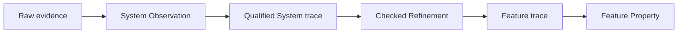

# Add Umpire Refinement and the first Temporal Feature/System correspondence

## Overview

Add one reusable `Umpire.Refinement` deep module and prove it with the first independently authored Temporal Feature/System correspondence. A checked refinement relates System implementation meaning to Feature product meaning without letting either side import or redefine the other. It becomes the required seam between System-owned observation qualification and Feature-owned Property evaluation in later conformance work.

## Goal & Context
<!-- scope: business -->

Temporal model authors need to describe product guarantees and implementation mechanisms at different semantic altitudes while still proving how a concrete System trace establishes a Feature trace. Model engineers should be able to diagnose observation failure, refinement failure, and Feature Property failure as separate outcomes. Runtime and qualification specs need one stable checked refinement contract rather than inventing family-specific translations.

## Architecture & Data Models
<!-- scope: technical -->

`Umpire.Refinement` owns inert declarations, checking, canonical identity, trace correspondence, and derivations. It consumes independently checked source and destination targets plus explicit mappings and proof obligations; it neither imports Temporal nor interprets raw evidence.



The first Temporal family keeps canonical product meaning under `Temporal.Feature.Nexus` and introduces the minimum pure mechanism meaning under `Temporal.System.Nexus`. Only a focused `Temporal.System.Nexus.Refinement` leaf imports both. Base Feature and System modules remain independently understandable and testable.

### Normative v1 correspondence

V1 is a **bounded forward simulation**, not bisimulation, reverse simulation, or surjectivity. The inert `RefinementDeclaration` carries canonical finite tables for setup, state, action, target-owned outcome, observation, relation, and capability correspondence; an explicit support/omission partition; and one positive `semantic-transitions` application bound. Named `Behavior.NamedOccurrence` values are outside this target-to-target contract. Trace identity is preserved positionally by `initialState`, step index, and observation position; a later Behavior-aware refinement may add named-occurrence correspondence without changing v1.

A separate proof-carrying `RefinementWitness declaration source destination` is supplied to `checkRefinement`. It is indexed by the exact declaration and checked targets and contains:

- `initialForward`: for every source setup and source initial state admitted by the source kernel, the table-mapped setup/state is admitted by the destination kernel;
- `stepForward`: for every authoritative source step, mapping its pre-state, action, outcome, post-state, and observations yields one authoritative destination step; and
- `requiredCoverage`: every source setup/value reachable from the checked source kernel is either mapped exactly once or named in the explicit omission partition, with mapped relation/capability digests matching the destination target.

The trace theorem is derived inductively from `initialForward` and `stepForward`; authors do not supply an independent trace proof. There is no reverse obligation. `checkRefinement declaration source destination witness` validates identities/digests, table kinds and uniqueness, the support/omission partition, positive bound/unit, and witness indexing before returning `CheckedRefinement`; proof terms are not serialized or hashed.

`applyRefinement checked sourceSetup qualifiedTrace` first replays the qualified trace against the checked source target: the initial value must occur in `source.kernel.initialStates sourceSetup`, every exact step result must occur in `source.kernel.steps state action`, and the trace vocabulary must close against resolved source meanings. Only then does it translate positionally. The forward witness establishes destination-kernel authority for the complete translated trace. No non-success invokes Feature Property evaluation.

| Failure kind | Status | Required diagnostic data |
| --- | --- | --- |
| stale source/destination identity or digest, setup mismatch, non-authoritative initial state or step, invalid coordinate | `invalid` | refinement/target digests, setup digest, coordinate, related identities |
| absent required coordinate, positive application bound exhausted | `unknown` | coordinate, applied bound, observed count |
| duplicate or contradictory coordinate, multiple mapped destinations, derivation mismatch | `conflict` | all competing coordinates/identities and derivation digest |
| trace reaches an explicitly omitted source value, or vocabulary kind is outside the declared v1 support partition | `unsupported` | coordinate, omitted identity/kind, omission reason |

`RefinementDiagnostic.identity` canonically binds refinement identity/digest, failure kind/status, source coordinate, related identities, bound/count, and omission/provenance fields. The table is exhaustive: each `RefinementFailureKind` has exactly one status.

## Approach

- Define a domain-neutral authored-to-checked refinement lifecycle with stable identities, explicit source/destination targets, finite setup/value mappings, forward-simulation obligations, positional trace coordinates, omissions, and typed errors.
- Preserve a complete derivation for every mapped semantic coordinate so a downstream Result can explain which System facts establish each Feature fact.
- Add a small pure Nexus System mechanism and focused refinement leaf; avoid pulling runtime adapters or evidence-source details into Feature.
- Provide a conformance-facing operation over an already-qualified System trace, leaving raw-evidence interpretation to `Umpire.Observation`.
- Enforce import direction and mutation-test observation and refinement failures independently.

## Quick commands

```bash
cd model && mise exec -- lake build Umpire.Refinement.Tests
cd model && mise exec -- lake build Temporal.System.Nexus.RefinementTests
cd model && mise exec -- lake build UmpireTests TemporalModelTests
make umpire-check-regression
```

## API Contracts
<!-- scope: technical -->

- `checkRefinement` accepts an inert declaration, independently checked System/source and Feature/destination targets, and a proof-carrying witness indexed by those exact inputs; it returns one canonical checked refinement or one deterministic typed error. The declaration is inert and canonical; proofs remain nonserialized Lean values.
- A declaration explicitly maps compatible setups, states, actions, target-owned outcomes, observations, relations, and capabilities, and supplies the v1 forward initial/step obligations plus a complete support/omission partition. Named Behavior occurrences are excluded; positional trace coordinates are derived. The trace theorem follows inductively, and no reverse/bisimulation obligation is implied.
- Applying a checked refinement to a source setup and qualified source trace first replays initial state and every step through the bound source kernel, then returns either one authoritative destination trace plus a coordinate-complete refinement derivation, or the exact `invalid`, `unknown`, `conflict`, or `unsupported` outcome from the normative table. It never returns a partial destination trace.
- The refinement identity binds source/destination target identities and digests, mapping/version, obligations, bounds, and omissions; declaration order and documentation do not affect it.
- Observation qualification, refinement application, and Feature Property evaluation retain distinct outcomes and diagnostic provenance.

## Edge Cases & Constraints
<!-- scope: technical -->

- Wrong-kind or stale target references, duplicate/ambiguous mappings, a missing forward initial/step or coverage witness, non-total support/omission partition, invalid application bound, unsupported vocabulary without an omission, or source/destination digest drift fail checking. V1 never requires a reverse obligation.
- A qualified System trace whose coordinate cannot be mapped yields a refinement non-success and cannot reach Feature Property evaluation; an Observation failure never masquerades as a refinement failure.
- Repeated equal values remain distinct through stable semantic coordinates and derivations.
- Feature never imports System or Verify; base System never imports Feature; only the focused production leaf `Temporal.System.Nexus.Refinement` may import both. Composed tests live at the exact non-base-System root `Temporal.RefinementTests.Nexus`, which Task `.5` adds to fn-34's explicit test exception set together with near-miss rejection fixtures.
- The first family remains pure and synthetic. Runtime programs, evidence adapters, persisted artifacts, execution, and qualification remain downstream.

## Acceptance Criteria
<!-- scope: both -->

- **R1:** One domain-neutral `Umpire.Refinement` facade checks an inert finite mapping declaration plus an exact proof-carrying forward-simulation witness against independently checked source/destination targets into a canonical immutable value before use. Errors: stale/wrong-kind targets, duplicate or ambiguous mappings, missing forward/coverage obligations, incompatible capabilities/bounds, incomplete support/omission partition, or digest drift return one typed failure and no checked refinement.
- **R2:** Checked refinements explicitly cover required setup, state, action, target-outcome, observation, relation, and capability correspondences plus forward initial/step obligations and omissions. Positional trace coordinates are derived; named Behavior occurrences and reverse/bisimulation are out of v1. Errors: implicit declaration-order selection, partial support/omission partition, outcome invention, unproved forward behavior, or hidden unsupported cases cannot check.
- **R3:** Applying a checked refinement to `sourceSetup` plus a qualified source trace first admits the exact initial state and steps through the bound source kernel, then returns one authoritative complete destination trace and coordinate-complete derivation, or the exhaustively assigned invalid/unknown/conflict/unsupported outcome with no partial trace. Errors: source target/digest/setup drift, impossible transition, missing/duplicate/contradictory coordinate, explicit omission, bound exhaustion, or derivation mismatch prevents Feature Property evaluation.
- **R4:** One pure Temporal Nexus System model and focused refinement leaf establish the existing Feature caller-closure meaning while Feature and base System remain independently understandable and testable. Errors: Feature importing System, base System importing Feature, runtime/evidence details in Feature, or either side redefining the other fails completion.
- **R5:** Independent mutations prove Observation, Refinement, and Feature Property failures are diagnosed at their responsible boundaries and retain distinct identities/derivations. Errors: a mapping/correspondence mutation surviving, a failure reported by the wrong layer, or an oracle implemented by the code under test fails verification.
- **R6:** Public facades, import checks, architecture documentation, and aggregate tests make Refinement the only Feature/System composition seam without changing existing Feature semantics or canonical artifacts. Errors: Temporal vocabulary under `Umpire`, a second family-specific composition API, Verify/Veil exposure, lost comments, or regression drift blocks completion.

## Early proof point

Task `.1` proves a domain-neutral checked forward simulation can distinguish a valid correspondence from stale, incomplete, ambiguous, and mutation-broken declarations while pinning the exact propositions, support/omission partition, and proof-witness indexing. If it fails, reconsider the mapping/obligation boundary before adding the Temporal family.

## Boundaries
<!-- scope: business -->

- No raw-evidence mapping, live runtime, participant program, execution, qualification, or persisted artifact schema.
- No change to existing Feature product meaning, Property evaluation, Behavior, Query, Planning, or target transitions.
- No Veil or optional formal-checker integration.
- No broad Temporal System model; only the minimum pure Nexus mechanism needed to prove the seam.
- No Umpire3 reuse or compatibility facade.

## Decision Context
<!-- scope: both -->

### Motivation
<!-- scope: business -->

Without an explicit refinement seam, live evidence either leaks implementation facts into portable Feature Properties or lets adapters claim product meaning directly. Both create a second semantic authority and make failures impossible to attribute cleanly.

### Implementation Tradeoffs
<!-- scope: technical -->

Refinement is its own deep module because correspondence checking, canonical identity, trace translation, derivations, and diagnostics are reusable and independently testable. The first Temporal family is intentionally small; runtime-specific System programs and observations remain in downstream execution/conformance specs.

## References

- Revised Umpire4 semantic-altitude, explicit-refinement, module-isolation, and failure-separation rules.
- `model/Umpire/Target/Language.lean` — authoritative initial/step relations and finite enumeration.
- `model/Umpire/Observation/Qualification.lean` — current qualified trace and derivation boundary.
- `model/Umpire/Behavior/Language.lean` — named occurrences intentionally excluded from target-to-target refinement v1.
- `model/Umpire/Property/Language.lean` and `model/Temporal/Feature/Nexus/CallerClosure.lean` — unchanged destination trace consumer and first Feature meaning.

## Requirement coverage

| Req | Description | Task(s) | Gap justification |
| --- | --- | --- | --- |
| R1 | Checked domain-neutral Refinement facade | `.1`, `.2` | — |
| R2 | Explicit correspondence and obligations | `.1`, `.2`, `.3` | — |
| R3 | Total application and derivations | `.2`, `.4` | — |
| R4 | First isolated Temporal correspondence | `.3`, `.4` | — |
| R5 | Layer-specific mutation assurance | `.4`, `.5` | — |
| R6 | Facades, imports, docs, compatibility | `.1`–`.5` | — |


