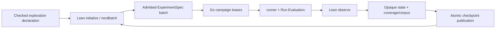

# Run resumable semantic exploration campaigns with umpire-fuzz

> HTML render lens (local): open `.flow/artifacts/fn-33-run-resumable-semantic-exploration/spec.html` — regenerable, markdown is the record. <!-- flow-next:artifact-link -->

## Overview

Add the Go `campaign` deep module and the `umpire-fuzz` command around Lean-owned `Umpire.Exploration`. Lean owns the closed v2 finite candidate selection, semantic coverage, and opaque cursor/outstanding/observed state through `initialize`, `nextBatch`, and `observe`; Go leases and executes admitted batches concurrently through the shared runner/Run Evaluation path, publishes exact checkpoints, and resumes after bounded failures without acquiring semantic authority.

## Goal & Context
<!-- scope: business -->

Model engineers need to fuzz a real authorized environment for a bounded time while preserving reproducibility, avoiding duplicate active work, and retaining model-defined semantic coverage. They should be able to list and explain a named exploration, start or resume a campaign, inspect why candidates were selected, and distinguish time/budget exhaustion from completeness or absence.

## Architecture & Data Models
<!-- scope: technical -->



The Go campaign module treats Lean exploration state as bounded opaque canonical data except for transport identities, leases, and admission metadata required for safe coordination. Each reserved semantic trace identity has at most one active lease. Results bind the lease, ExperimentSpec, run/evidence/Result artifacts, environment profile, and cleanup outcome before Lean observes them.

### Runnable binding, bridge, and durable state

A checked Temporal-owned `RunnableExplorationBinding` joins an existing fn-5 catalog subject to one checked Exploration Definition ID/Behavior Fingerprint, the complete ExperimentSpec/RuntimeConfiguration input-set identity, environment profile Definition ID/Behavior Fingerprint, allowed seed set, campaign time range, parallelism ceiling, pinned-set Behavior Fingerprint, and fixed runner/Run Evaluation identities. `umpire-fuzz list` walks the checked fn-5 catalog and left-joins this operational binding set by catalog subject; it does not enumerate a second semantic registry or add catalog entries. The first runnable subject is the existing `workflow-nexus.query.exact-action-caller-closure`. Its internal semantic source `temporal.nexus.caller-closure.runtime-smoke` uses the fn-17 proof-bearing exact-catalog certificate to preserve the catalog ExperimentSpec bytes and identity: exhaustive, selection budget one, seed zero, no faults or pins, the exact fn-19 caller-closure ExperimentSpec and ephemeral-local RuntimeConfiguration, parallelism exactly one, an effective one-item batch from its one-member source, and campaign time 1 second through 5 minutes. Fake campaigns—not this one-point live proof—cover N-way leases and pinned-regression independence.

The fixed Lean sibling executable is `umpire-exploration-bridge`. It is resolved from the installed tool manifest/sibling directory, never from PATH or a flag. Each invocation exchanges exactly one request and one response: a four-byte unsigned big-endian length followed by canonical compact JSON, then EOF. `initialize` and `next-batch` requests/responses are each at most 16 MiB; `observe` requests are at most 72 MiB and responses at most 16 MiB. A batch contains at most eight ExperimentSpecs or eight full fn-18-admitted Results. Each ExperimentSpec remains under its 1 MiB member ceiling and each Result under its 8 MiB member ceiling; operation-level N/N+1 byte and item limits are tested independently. Envelopes bind `umpire-exploration-bridge/v2`, operation `initialize|next-batch|observe`, invocation identity, runnable-binding Definition ID/Behavior Fingerprint, model/checker/protocol identities and versions, prior state identity when applicable, and payload digest. The bridge validates the full Result closure, computes one opaque checked admission identity plus reproduction-tuple digest, and constructs fn-17 domain-neutral `ExplorationObservation/v2`; Go never derives semantic credit, coverage, corpus, priority, or mutation data. A response is `ok` with canonical state/batch/report bindings or `rejected` with one typed Lean error; both exit 0. Malformed/trailing/oversized frames, member-limit drift, handshake drift, timeout, empty response, nonzero exit, or stderr overflow are tooling failures and produce no state. Each call has a 30-second timeout; cancellation sends termination, waits two seconds, kills if needed, and always reaps. Stderr is capped at 64 KiB, sanitized, and never canonical.

`umpire-campaign-checkpoint/v2` is a distinct fn-18 artifact. It binds—without altering `umpire-coverage-checkpoint/v2`—campaign/runnable-binding identity, the coverage-checkpoint binding, environment input-set/profile binding, generation, optional parent campaign-checkpoint binding, sorted leases and attempts, accepted/rejected/stale result lineage, completed Run/Evidence/Result artifact-set bindings, campaign/protocol/model/checker versions, time/parallelism/batch/seed Limits, termination, Known Gaps, and provenance. Fn-18 set closure gains explicit campaign-to-coverage, campaign-to-input-set, and campaign-to-result relationships plus strict cross-binding/mutation fixtures.

The state layout is `STATE/lock` plus immutable `STATE/checkpoints/<campaign-checkpoint-artifact-identity>/...`; publication temp paths and the lock are never artifact members. `umpire-fuzz` resolves/creates one non-symlink state root, holds a nonblocking exclusive process lock from admission through the final checkpoint publication, uses directory mode 0700 and file mode 0600, and performs all relative opens without symlink following or root escape. A competing process fails before execution. OS lock release enables crash recovery.

Resume validates every complete campaign checkpoint and its artifact closure, ignores only fn-18-recognized incomplete publication temps, and requires exactly one generation-zero node with null parent. Every later node has the same campaign/binding identity, generation `parent + 1`, and a valid parent digest. Ancestors are retained. Missing parents, cycles, generation gaps, invalid complete-looking directories, multiple children of one parent, or multiple maximal leaves reject as ambiguous before a lease. The unique valid leaf is authoritative; no mutable `current` pointer exists.

Progress is canonical NDJSON on stderr with schema `umpire-fuzz-progress/v2`, at most 4 KiB per line and one periodic event per second plus state-transition events. Events are `started|leased|result|checkpoint|stopping|cleanup|finished` and include campaign identity, generation, leased/active/completed/rejected/retry counts, remaining time, checkpoint identity when published, cleanup status, and final termination reason. Progress is bounded diagnostic output: it never enters semantic/campaign identities or deterministic stdout comparisons. Final stdout remains one canonical summary.

## Approach

- Freeze the exact framed Go/Lean exploration protocol from fn-17, the checked runnable binding projected through fn-5, and the distinct fn-18 campaign-checkpoint closure.
- Implement deterministic leases, parallel worker coordination, duplicate/stale result handling, cancellation, and atomic checkpoints without reproducing selection or coverage logic.
- Execute only through fn-19 runner/participant adapters and fn-20 Run Evaluation; preserve operational, semantic, cleanup, and tooling outcomes independently.
- Expose the revised CLI contract with exact list/explain/run/resume behavior and model-declared Limits.
- Prove crash/resume and time-exhaustion behavior with fake adapters before one bounded local campaign.

## Quick commands

```bash
go test -count=1 -tags test_dep ./tools/umpire/campaign/...
go test -count=1 -tags test_dep ./tools/umpire/cmd/umpire-fuzz/...
cd model && mise exec -- lake build Umpire.Exploration.Tests Temporal.Tool.ExplorationTests
make umpire-fuzz-list
```

## API Contracts
<!-- scope: technical -->

- `campaign.Start` and `campaign.Resume` accept one checked `RunnableExplorationBinding`, its exact admitted input set/environment profile, explicit time/parallelism/state/seed inputs that only tighten the binding, one exclusively locked state root, and fixed runner/Run Evaluation adapters.
- The Lean bridge uses the exact framed `umpire-exploration-bridge/v2` envelopes and operation-specific limits above: `initialize(binding, seed)` and `nextBatch(state)` return canonical state plus admitted batches, while `observe(state, admittedResults)` validates full fn-18 Results and returns canonical state/report or one typed rejection.
- Lease reservation is atomic by semantic trace identity. Stale, expired, duplicate, crossed, or already-observed results never receive semantic credit.
- Every successful state transition publishes a new exact `umpire-campaign-checkpoint/v2` set with monotone parent/generation lineage and the full closure above. Resume derives one authoritative head by validation; it never uses or writes a mutable pointer.
- `umpire-fuzz list`, `explain <exploration>`, and `<exploration> --environment <profile> --time <duration> --parallelism <n> --state <directory> --seed <seed>` are the public surface. List/explain are fn-5 catalog projections augmented by the checked runnable binding. Resume uses the same command and exclusively locked existing state directory; incompatible or ambiguous lineage rejects before execution.

## Edge Cases & Constraints
<!-- scope: technical -->

- Time exhaustion stops new leases, cancels/collects workers within declared Limits, records outstanding/expired work, publishes a resumable campaign checkpoint when valid, emits `stopping|cleanup|finished` progress, and never claims completeness.
- Worker crash, canceled runner, cleanup failure, Run Evaluation non-success, duplicate delivery, checkpoint interruption, or process restart retains an exact phase outcome; none silently drops a candidate or credits coverage.
- Active leases prevent repetition within a campaign. An expired candidate may be re-leased only under the declared deterministic policy and keeps prior attempt lineage.
- Go never decodes or edits semantic coverage/corpus/priorities, proposes mutations, selects candidates, or infers Known Gap/absence.
- Known regressions execute independently of the exploratory budget and remain a separate result partition.

## Acceptance Criteria
<!-- scope: both -->

- **R1:** The fixed sibling bridge implements the exact 4-byte-length/canonical-JSON `umpire-exploration-bridge/v2` protocol and process lifecycle for Lean `initialize`, `nextBatch`, and `observe`. Initialize/next-batch request and response frames cap at 16 MiB; observe request caps at 72 MiB and response at 16 MiB; every batch caps at eight, ExperimentSpecs at 1 MiB each, and Results at 8 MiB each. It preserves the full reproduction tuple and lets Lean validate each admitted Result closure before constructing the opaque checked admission identity and domain-neutral observation. Errors: malformed/noncanonical/trailing/oversized exchange, N+1 items, member-limit drift, executable/model/checker/protocol/strategy/Limits/seed mismatch, crossed state, unknown result, timeout/cancellation/reap failure, or non-monotone transition yields no new state.
- **R2:** The Go campaign module owns only leases, bounded parallel execution, opaque state transport, checkpoint publication, and resume; Lean remains sole owner of the closed finite candidate selection, model-defined coverage, cursor/outstanding/observed transitions, and semantic termination. Fn-17 v2 deliberately exposes no mutation language, adaptive corpus, or priority feedback, and Go cannot invent them. Errors: Go-side semantic scoring/mutation/corpus/priority, implicit adapter selection, duplicate active identity, stale lease result, or unbound artifact cannot receive credit.
- **R3:** Campaign workers execute complete ExperimentSpecs only through the shared runner/Run Evaluation interfaces and return exact operational/evidence/Implementation Link/property/cleanup outcomes to Lean. Errors: a private runtime/evaluator, missing cleanup/result, environment-specific semantic copy, crossed receipt, or tooling failure mislabeled as a semantic result fails completion.
- **R4:** Every accepted transition publishes one immutable `umpire-campaign-checkpoint/v2` binding the unchanged coverage checkpoint plus leases/attempts/results/environment/Limits/versions/parent-generation/provenance/Known Gaps. An exclusive safe state-root lock and exact unique-head algorithm govern resume. Errors: partial/unsafe publication, symlink/root escape, competing process, tampered lease/state, lost result, missing parent, fork, generation gap, multiple heads, incompatible resume, or identity drift rejects before new work.
- **R5:** `umpire-fuzz` provides exact fn-5-backed list/explain and checked-binding-backed run/resume behavior, useful bounded progress, and may only tighten model-declared environment/time/parallelism/state/seed Limits. Errors: second registry, CLI-authored behavior/mutation/coverage, broadened Limits, arbitrary adapter/authority, unsafe/ambiguous state directory, silent long-running operation, or runtime completeness/absence claim fails closed.
- **R6:** Fake-worker, two-process lock, lease, cancellation, duplicate, crash, cleanup, checkpoint-fork, progress, and resume matrices prove deterministic selection lineage, no active duplication, resumable time exhaustion, and pinned-regression independence. One bounded local run of the exact one-point caller-closure runtime-smoke binding proves the runner/Run Evaluation vertical path; it is not the parallel/pinned proof. Errors: a surviving mutation, wrong-layer diagnosis, nondeterministic non-duration output, lost comment, or Umpire3 reuse fails verification.

## Early proof point

Task `.2` proves parallel lease reservation, result admission, time exhaustion, and crash/resume are deterministic over fake workers without inspecting opaque semantic state. If it fails, reconsider the lease/checkpoint boundary before binding the real runner.

## Boundaries
<!-- scope: business -->

- No new Property, Behavior, Space, Query, target, planner, coverage, mutation, corpus, or priority semantics in Go; closed fn-17 v2 has no mutation/corpus/priority extension point.
- No completeness claim from runtime fuzzing and no replacement for model-only exhaustive verification.
- No replay, minimization, promotion, Claim Assessment-policy, canary, or release behavior.
- No arbitrary plugin/executable/adapter selection or ambient authority.
- No Umpire3 inspection, dependency, compatibility, or reuse.

## Decision Context
<!-- scope: both -->

### Motivation
<!-- scope: business -->

The revised CLI requires long-running resumable runtime fuzzing, while the model must remain the smart part of the system. Splitting pure Exploration from operational campaign coordination prevents Go concurrency concerns from leaking into semantic selection and avoids a dependency cycle with artifact checkpoints and the runner.

### Implementation Tradeoffs
<!-- scope: technical -->

Opaque Lean state keeps semantic evolution behind a stable protocol. Go retains only the identities and leases required for safe parallelism, accepting the cost of Lean round trips in exchange for one semantic authority and reproducible campaigns.

## References

- Fn-5 — authoritative catalog/list/explain Generated View used by runnable binding discovery.
- Fn-17 — checked Exploration language, selectors, semantic coverage, state, and protocol authority.
- Fn-18 — strict artifact/checkpoint admission and atomic publication.
- Fn-19 and fn-20 — shared runner, raw evidence, Implementation Link, and Run Evaluation Result.
- Revised Umpire4 CLI and component architecture — `umpire-fuzz`, opaque state, and Go/Lean ownership.

## Requirement coverage

| Req | Description | Task(s) | Gap justification |
| --- | --- | --- | --- |
| R1 | Versioned Lean campaign bridge | `.1`, `.3` | — |
| R2 | Lease/parallel ownership boundary | `.2`, `.3` | — |
| R3 | Shared runner/Run Evaluation execution | `.3`, `.5`, `.6` | — |
| R4 | Atomic checkpoints and resume | `.1`, `.2`, `.4` | — |
| R5 | `umpire-fuzz` UX and bound discipline | `.4`, `.5`, `.6` | — |
| R6 | Failure matrices and local proof | `.2`, `.5`, `.6` | — |
