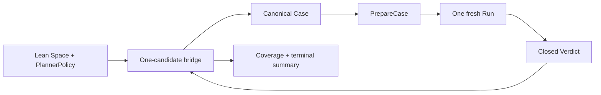

# Run serial bounded semantic exploration with umpire-fuzz

## Umpire4 Case Runtime reconciliation

This spec drives fn-64 exclusively through `PrepareCase` and `PreparedCase.Run`. It removes every dependency on resident executors, `PortableTestPlan`, Run Evaluation, caller closure, and scenario-specific Go bindings.

## Intent

Prove that the Lean-owned exploration layer can choose a bounded sequence of complete Cases while a shallow Go coordinator prepares and runs exactly one candidate at a time. The command reports selection, decisive Verdict coverage, exhaustion, limits, and interruption honestly.

## Architecture

Lean owns candidate order, candidate identity, semantic coverage, the requested uncovered coordinate, and finite exhaustion. Each `next` response contains one whole canonical Case plus an opaque checked candidate/lineage identity; Go never parameterizes a Case family or interprets model coordinates. Duplicate, stale, or crossed candidate identities reject before preparation.

Go owns framing, the fixed Host Profile, static and runtime Limit accounting, process lifecycle, `PrepareCase`, one active `Run`, cleanup observation, and terminal reporting. It may cache only the current process-local campaign state. Prepared Cases are not shared between different candidate identities.

## Contracts

The bridge supports `initialize`, `next`, `observe`, and `finish`. `next` is unavailable while a candidate is outstanding. `observe` accepts only the exact candidate identity plus its closed Run and Verdict after cleanup. Preparation failure is reported as `prepare-rejected` and creates no Run. A completed Run with decisive `satisfied` or `violated` Verdict may update Lean-owned coverage; incomplete/inconclusive work, failed or uncertain cleanup, and crossed results receive no coverage.

The sole first campaign is a bounded Space compiled by the retained fn-17/fn-40 Lean surfaces into generic Cases supported by fn-64. It must include the async Nexus-success Case and may add only checked variations expressible in the public Case IR. No Go adapter, runtime opcode, or Contract checker is added for a campaign point.

Terminal status is `exhausted`, `limit-reached`, `stopped`, or `tooling-failure`. The summary reports selected, prepared, started, decisive, and covered counts without collapsing them. A process crash or SIGINT after Run creation records a lost/stopped iteration when the supervisor can do so, performs bounded cleanup when still alive, and never synthesizes a Verdict or coverage. A later invocation starts from the same checked inputs with no resume token.

For fixed checked inputs, seed, candidate bound, decisive observation stream, and terminal reason, selection order and semantic summary are deterministic. Runtime timing may change the completed prefix but never identities. Pinned regressions remain outside exploration Limits.

## Limits and scale

Only one bridge call, preparation, and Run may be active. Admission caps total candidates, aggregate Case bytes, per-Case static work, per-Run work/time, terminal event references, and summary bytes. A 10x increase in candidate volume remains bounded by rejecting or stopping at the declared campaign limits; it does not create concurrency or unbounded retained state.

## Acceptance Criteria

- **R1:** One canonical Lean bridge keeps selection, full Case production, candidate identity, semantic coverage, requested coordinate, and exhaustion Lean-owned while Go sees only checked bindings, Limits, one complete Case, and one closed Run/Verdict result.
- **R2:** The coordinator prepares and executes exactly one candidate at a time through fn-64, observes cleanup before advancing, and cannot request another candidate while preparation or Run work is outstanding.
- **R3:** Candidate, Case, Profile/catalog, PlannerPolicy, seed, Limits, Run, and Verdict identities remain exactly bound; duplicate, stale, crossed, incomplete, or oversized values reject at their owning boundary without semantic coverage.
- **R4:** The closed command output distinguishes exhaustion, limit, stop/lost iteration, preparation rejection, runtime/tooling failure, and decisive Verdict coverage without treating unexecuted, inconclusive, or cleanup-uncertain work as coverage.
- **R5:** Identical checked inputs and decisive observation stream produce the same candidate order and canonical semantic summary; wall-clock prefix variation is excluded, and pinned regressions remain independent.
- **R6:** Coordination is a bounded process-local serial loop with explicit candidate/byte/static-work/Run/report limits; concurrency, leases, durable recovery, resume, and adaptive selection have no placeholder API or persisted format.

## Early proof point

Cross one Lean-produced canonical Case through the bridge, prepare it through the public fn-64 facade, complete one Run and cleanup, return its decisive Verdict, and update Lean-owned coverage. Stop if Go must interpret a model coordinate or add scenario logic.

## Boundaries

No concurrent Runs, worker pool, lease, durable campaign state, resume, resident executor, public runtime service, alternate evaluator, automatic regression installation, adaptive corpus, or timing-dependent semantic identity.

## Requirement coverage

| Requirement | Tasks |
| --- | --- |
| R1, R3 | `.1`, `.2` |
| R2, R6 | `.6`, `.3` |
| R4 | `.4` |
| R5 | `.5` |
