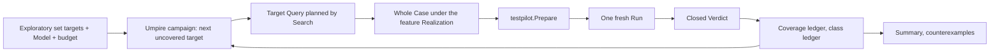

# Run serial bounded semantic exploration with umpire-fuzz

## Umpire4 Case Runtime reconciliation

This spec drives fn-64 exclusively through `testpilot.Prepare` and `PreparedCase.Run`. It removes every dependency on resident executors, `PortableTestPlan`, Run Evaluation, caller closure, and scenario-specific Go bindings.

## Re-plan on fn-85 (2026-09-21)

The first plan explored a variation Space (`Temporal.Feature.Nexus.Experimental`, deleted by fn-86 R6; its record is under **History** below). fn-85 replaced that input with the exploratory set: `set … purpose: exploratory` names the machine it covers, a coverage goal (`rows`, `results`, `classMembers`) and a `limits` budget, and admission enumerates its **coverage targets** deterministically (`Umpire.Command.coverageTargets`, pinned by a golden). The sole first campaign is the caller Model's `nexusCallerExploration` over `nexusProtocol` under `four` (steps 4, actions 4, search 32768): 889 targets, 885 rows, 2 results, 2 class members (`Temporal/Feature/Nexus/Caller/Fixtures/CallerExploratoryCoverage.json`). A campaign that needs fault axes declares fault actions on its Model; no Space is compiled.

What changes: the candidate space is the set's target list, a candidate is a whole Case that reaches one not-yet-covered target, coverage is credited per target from a satisfied Run along the candidate's planned witness path, and a class-member target whose candidate's decisive Verdict is `violated` is a counterexample that Promotion keeps for review. What stays: one Lean-owned selection order, one Go coordinator that prepares and runs exactly one candidate at a time through fn-64, exact identities at every boundary, an honest terminal summary, and no concurrency, leases, resume or adaptive selection.

## Intent

Prove that the Lean-owned exploration layer can walk an exploratory set's coverage targets by choosing a bounded sequence of complete Cases, one target at a time, while a shallow Go coordinator prepares and runs exactly one candidate at a time against a real deployment. The command reports selection, decisive Verdict coverage per target, unreachable targets, counterexamples, exhaustion, limits and interruption honestly.

## Architecture

**Umpire owns the campaign** (`Umpire.Exploration`, re-founded on the set; the module keeps its name, which fn-46's module index pins as a facade): the checked campaign is one `SetDeclaration` with `purpose: exploratory`, the `DeclaredModel` it names, its target list and the `Limits` value its `budget:` names (the declaration carries the name; the campaign takes the value). One campaign is over one Model, so every Query it admits shares that Model's index. Selection is deterministic and not adaptive: the next candidate is the first target in enumeration order that has not been planned (status `pending`); a target is planned at most once per campaign, whatever its candidate's fate. A candidate is a **target Query** whose Scenario sets both `traceExactly`, an **exact trace** (`AuthoredExactTrace`: every step carries its action, outcome and resulting state, so the state before the final step is pinned) from a start state to the target's row followed by the row's action and outcome, and `actionsExactly`, that trace's action list in the same order (the Producer reads `actionsExactly`, the checker requires the two to agree); the Property is the action clause on that final action naming the row's outcome, for every target kind, so it always carries at least one clause (a `classMember` target's row is the one chosen for it below, and its outcome is that row's). The row a target names is the row for a `row` target, the first row in table order among the reachable rows whose results contain the outcome for a `result` target, and the first reachable row whose action is the member for a `classMember` target; the prefix is a shortest path over the table to that row's source within the budget's steps, new code beside `coverageTargets` (whose reachability closure keeps no paths). The Query is admitted and searched with the same authoring `Umpire.Command.check` uses, extended to return the `AdmittedQuery` beside the `CheckedModel`, and the campaign keeps both. The candidate is the `CheckedModel`; its identity is its Artifact checksum; the targets it is expected to cover are the rows, results and class members on its planned witness path, which by construction contains the selected target (a witness that does not is a broken campaign invariant: `tooling-failure`, reported, never run). A target is `unreachable` only when no prefix reaches its row within the budget's steps or admission reports `notSelected`; any other admission error (`invalidTarget`, `invalidVocabulary`, `admission`, `instances`) is a defect in the campaign's own Query and ends the campaign as `tooling-failure`. Coverage is credited only from a `satisfied` Verdict on a completed Run with closed cleanup, and what it credits is the planned witness path, which is exactly what the Case's Contract rules confirmed; a `violated` Verdict credits nothing and marks the candidate's targets `violated`; a preparation rejection, an inconclusive, crossed or cleanup-uncertain result credits nothing and marks them `attempted`. The class ledger records, per claimed class, the decisive verdict of its member target's candidate; a class-member target whose candidate's Verdict is `violated` is a **counterexample**, which the campaign reports and hands to Promotion as a proposal for human review, never an installed regression (the Model enumerates one example per class, so member-versus-member divergence is outside this spec). The candidate's exact-prefix shortest witness is the minimization EXP-05 requires: there is no shorter trace to that row under the Model. The pinned Cases of the feature's functional sets are outside the campaign and consume none of its budget.

**Temporal owns the bridge** (`Temporal.Tool.ExplorationBridge`, executable `umpire-explore`): `initialize` names the set; `next` returns one whole canonical Case produced by `Umpire.Command.produce` from the candidate's `CheckedModel` under the feature's `Realization`, claims, evidence catalog and relations (the values the `case … realizes` block emits; the block is extended to accept an exploratory set and emit them with no fixture), plus the opaque candidate identity and the target keys on its planned path; `observe` accepts only the exact outstanding identity with its closed Run and Verdict after cleanup, decodes them, checks the Case ID, disposition, cleanup status and Verdict status, and returns what was credited; `finish` returns the summary. Go never interprets a target, a Model coordinate or a Case family. The bridge process writes nothing to stdout beyond frames.

**Go owns the loop** (`tools/umpire/campaign`, command `umpire-fuzz run`): framing, the fixed Driver Profile and deployment binding `umpire-run` already performs (gRPC address, namespace, task queue, Nexus endpoint, handler queue), static and runtime Limit accounting, process lifecycle, `testpilot.Prepare`, one active `PreparedCase.Run`, cleanup observation and terminal reporting. It may cache only the current process-local campaign state. Prepared Cases are not shared between candidate identities.

## Contracts

The bridge supports `initialize`, `next`, `observe`, and `finish`. `next` is unavailable while a candidate is outstanding. `observe` accepts only the exact candidate identity plus its closed Run and Verdict after cleanup. Preparation failure is reported as `prepare-rejected` and creates no Run; the candidate's targets stay uncovered and the campaign advances. A completed Run with closed cleanup and a `satisfied` Verdict credits every target on the candidate's planned witness path; a `violated` Verdict credits nothing and marks those targets `violated`; a preparation rejection, incomplete or inconclusive work, failed or uncertain cleanup, and crossed results credit nothing and mark them `attempted`. A target is planned at most once per campaign, so no target is re-selected after a non-decisive result. (Every row of the first campaign has one result, so a decisive Run is either the planned path confirmed or a violation; there is no separately observed path.)

Terminal status is `exhausted` (no target is pending: each is covered, unreachable, violated or attempted), `limit-reached` (a campaign counter: the candidate cap, aggregate Case bytes, or report bytes; the budget's `search` limit bounds one Search and never trips this), `stopped`, or `tooling-failure` (a loader, bridge, admission or invariant failure). The summary reports selected, prepared, started, decisive, covered, unreachable, violated, attempted and counterexample counts without collapsing them, plus each counterexample (class, member target, candidate identity, the promotion source's SHA-256). While a campaign runs, one progress line per candidate on stderr (identity, selected target key, then its outcome) lets an operator follow a long campaign without touching the canonical stdout summary. A process crash or SIGINT after Run creation records a lost/stopped iteration when the supervisor can do so, performs bounded cleanup when still alive, and never synthesizes a Verdict or coverage. A later invocation starts from the same checked inputs with no resume token.

For fixed checked inputs (set, Model, budget, candidate cap) and a fixed decisive observation stream, selection order, per-target credit and the canonical summary are deterministic. Runtime timing may change the completed prefix but never identities. Pinned regressions remain outside exploration Limits.

## Limits and scale

Only one bridge call, preparation, and Run may be active. Admission caps total candidates, aggregate Case bytes, per-Case static work, per-Run work/time, terminal event references, and summary bytes. Each candidate costs one bounded Search within the budget and one Case production; there is no all-targets path table. A 10x increase in targets (a Model with ten times the rows, or a campaign over several sets in sequence) remains bounded by the candidate cap and the budget's search count, rejecting or stopping at the declared limits; it does not create concurrency or unbounded retained state. The first-generation Space-based `Umpire.Exploration` (Core, Language, Engine, Candidate, Selection, Guided, Coverage over `VariationSpace`, and `Session.beginSession`) is retired by task .1; `Session`'s `next` and `observe` are kept over the new candidate. `Umpire.Variations` stays: the Switch example, its tests and the Testpilot README use it, and only the Exploration consumer goes. The UMPIRE4 spec's Exploration concept ("selection from a declared `Umpire.Variations` space") and the Variations concept's sentence that Exploration draws candidates from `Umpire.VariationSpace` are amended to the set-based definition as one GOV-02 draft in task .1.

## Acceptance Criteria

- **R1:** One canonical Lean bridge keeps target selection, target-Query admission and search, full Case production, candidate identity, per-target coverage along the planned witness path, the class ledger and exhaustion Lean-owned while Go sees only checked bindings, Limits, one complete Case, and one closed Run/Verdict result. Errors: a frame that would let Go name a target, a coordinate or a Case family rejects at the bridge.
- **R2:** The coordinator prepares and executes exactly one candidate at a time through fn-64 with the deployment binding `umpire-run` performs, observes cleanup before advancing, and cannot request another candidate while preparation or Run work is outstanding.
- **R3:** Candidate, Case, Profile/catalog, budget, Limits, Run, and Verdict identities remain exactly bound; duplicate, stale, crossed, incomplete, or oversized values reject at their owning boundary without coverage.
- **R4:** The closed command output distinguishes exhaustion, limit, stop/lost iteration, preparation rejection, runtime/tooling failure, per-target coverage, unreachable, violated and attempted targets, and counterexamples, without treating unexecuted, inconclusive, or cleanup-uncertain work as coverage.
- **R5:** Identical checked inputs and decisive observation stream produce the same candidate order, per-target credit and canonical summary; wall-clock prefix variation is excluded; pinned regressions remain independent; a counterexample renders (`renderPromotionSource`), compiles (`compilePromotionSource` from the retained `AdmittedQuery` and a `PromotionBaseAnchor`) and compares to the same SHA-256 every time, and installs nothing.
- **R6:** Coordination is a bounded process-local serial loop with explicit candidate/byte/static-work/Run/report limits and one bounded Search per candidate; concurrency, leases, durable recovery, resume, and adaptive selection have no placeholder API or persisted format.

## Early proof point

Task .2's proof: through the real bridge, take the first row target of `nexusCallerExploration`, form and admit its target Query, produce the whole Case under `nexusCallerCases.realization`, and show `testpilot.Prepare` accepts it. Task .3's integration proof (non-gating, it needs the development cluster) completes one Run and cleanup, returns its decisive Verdict, and credits the planned path. Stop if Go must interpret a target or add scenario logic, or if the Producer cannot produce from a target Query's `CheckedModel` with the emitted realization values.

## Boundaries

No concurrent Runs, worker pool, lease, durable campaign state, resume, resident executor, public runtime service, alternate evaluator, automatic regression installation, adaptive corpus, variation Space, or timing-dependent semantic identity. No new Testpilot instruction, runtime opcode, Contract checker, or Go adapter for a campaign point.

## Requirement coverage

| Requirement | Tasks |
| --- | --- |
| R1, R3 | `.1`, `.2` |
| R2 | `.3`, `.6` |
| R6 | `.1`, `.3`, `.6` |
| R4 | `.4` |
| R5 | `.5` |

Execution order: `.1`, `.2`, `.3`, `.6`, `.4`, `.5`; `.4`'s exit codes rest on `.6`'s state machine. `.3`'s guard against a second `next` before `observe` is local to the bridge client; `.6` owns the coordinator's state machine.

## Decision Context

Task .1 (2026-09-22) refined the target Query's reachability rule while implementing it: a
transition contract binds every occurrence of its action at search time, and the Producer lowers
it from the first occurrence, so the prefix to a target's row may take the row's action earlier
only with the row's outcome. `Target.pathTo` searches under that admissibility per candidate; a
row with no such path is `unreachable` under this Query form (the counter's last self-loop is the
pinned example), which is honest coverage rather than a Run that no deployment could satisfy.
Class members enumerate in the machine's action order, which is by member name.

Task .2 (2026-09-22) found two things the plan assumed and the caller realization does not
give. First, the caller machine's table enumerates every `schedule` member (each timeout expiring
or not, eight members) while `asyncNexus` binds three, and the Producer places no instruction for a
path action no binding names (the Success slice relies on that for its waits), so the first row
target of `nexusCallerExploration` -- the schedule with all three timeouts expiring -- produced a
Program with no Nexus operation that `Prepare` rejected on its handler reservation. The bridge now
reads the realization's bindings and the machine's timers (the exploratory `case` block emits the
timers beside the claims, catalog and relations) before producing: a candidate whose path performs
a member with no binding and no timer behind it is credited `unrealizable` -- its own observation
and ledger status, distinct from `attempted`, which says a Run was spent -- without a Run, listed
as skipped on the frame that follows, and the campaign moves on within the same `next`. The
implementation review asked whether to stop instead, bind every member, or filter the targets at
`Campaign.check`; the skip with its own status was chosen because the enumeration is the Model's
and what the realization cannot run is a finding the ledger should show, not hide. The status is
credited to the target planned and to the class members of the unbound members only, never to the
rest of the skipped path (a result every bound schedule reaches stays pending), so `observe` takes
the covers to credit beside the observation.
The Producer is not changed to reject, because a realization may leave an action unbound on
purpose. Second, a path whose only evidence is the scheduled read lifts no history event, and a
history read with an empty evidence lift is a Case `Prepare` rejects; `asyncNexus`'s history read
now lifts nothing when no resolved rule reads history, which leaves every functional Case's bytes
unchanged. The proof point therefore holds for the first realizable row target: the first row
target is skipped as unrealizable and the next row's Case is accepted by `Prepare` under the caller
Profile (`TestExplorationBridgeFirstCandidatePrepares`). A Run for another Case, a Run whose
cleanup is not closed, an incomplete or inconclusive Run and a Verdict that is not decisive are
`inconclusive` and mark the planned path `attempted`; a violated Verdict on a Run the Monitor
stopped is `violated`, since that is how the evaluator ends a violated Run. `finish` reports
`exhausted`, `tooling-failure`, or the status the coordinator names (`stopped`, `limit-reached`)
when targets are pending, because the candidate cap and the byte counters are the coordinator's.
Counterexamples carry `promotionSourceSha256` as JSON null until task .5 compiles the source.
The frames are exact: each kind admits a closed key set and any other key rejects; a Run the bridge
cannot read (undecodable, or naming no Run or Case) rejects the frame and leaves the candidate
outstanding rather than spending it. `initialize` names the Profile identity the coordinator runs
under, which the bridge echoes on every frame and requires unchanged on `observe`; `initialized`
writes the budget's Limits out by value. The Profile's contents stay the coordinator's (task .3):
a Run carries no Profile, so the identity is the binding the bridge can check.

Task .2's implementation review (`flowctl claude impl-review`, opus at high, 2026-09-22): four
NEEDS_WORK rounds, all findings applied -- exact frames with closed key sets, unreadable Runs
rejected rather than spent, the Profile identity named at `initialize` and required on `observe`,
Limits written out by value, the `unrealizable` status and its narrow credit, one helper for the
case block's machine terms, wording -- then SHIP with four P3 notes, applied after the verdict:
credit never leaves the planned path whatever covers `observe` is handed, the functional timeout
and retry witnesses pin that timer steps report nothing unbound, one failure helper in `step`, and
the Go proof's comment. Three transport rounds returned no verdict and were refunded.

Task .3 (2026-09-22): the deployment binding is lifted from `umpire-run` into `tools/umpire/binding`
as `Open` (campaign-scoped: connection, provisioning, catalog) and `Campaign.Bind`
(candidate-scoped: derived Profile, `Prepare`, SDK client, composite Driver); `umpire-run` binds one
Case through both and keeps its behavior, messages and exit codes. The bridge client
(`tools/umpire/campaign.Bridge`) matches every reply to its frame by sequence number, set and
profile, refuses a second `next` while a candidate is outstanding and an `observe` for another
identity before writing anything, treats a `rejected` reply as leaving the campaign untouched, and
caps frames in both directions. `RunCandidate` is the serial path: decode, bind (a
`*testpilot.PreparationError` is observed as `prepare-rejected` before any Driver opens), one Run,
release, then `observe` with the closed Run as ProtoJSON. A binding failure that is not the Case's
own and a Run that could not execute leave the candidate outstanding and are returned as
`bind-failed` and `run-failed`, because the bridge accepts only a Run or a preparation rejection
and nothing honest can be observed for them; task .6's state machine ends the campaign on them.
The Profile identity named at `initialize` is the identity the Case is bound under, so the
prepared Case's Driver identity carries it. The integration proof runs under
`-tags 'test_dep integration'` against a cluster named by `UMPIRE_FUZZ_GRPC`/`UMPIRE_FUZZ_HTTP`
and skips, saying so, without one; the live-bridge test runs the real `umpire-explore` whenever
it is built. Its implementation review (round one) added two rules: a closed Run the facade
returns beside an error -- a recorder or Monitor close failure after the Verdict was fixed -- is
observed, with the error carried beside the outcome, because a proved Verdict is not erased by
what followed it; and a bridge whose stream is out of step (an unwritable frame, an unreadable or
mismatched reply, a frame over the cap, a context that ended mid-exchange) is broken, and every
later call returns that failure without writing a frame. Round two made every reply mismatch,
including one found by the kind's own check, break the bridge, and gave the campaign binding one
handler queue for the endpoint's route and every handler's poll. Round three bounded `Close`: a
finished bridge gets its EOF and a bounded wait, a broken or unfinished one is killed, and the
frame write runs under the same context guard as the read. A `DeriveProfile` failure stays
`bind-failed` rather than `prepare-rejected`: a produced Case with no derivable Profile is a
tooling defect that ends the campaign, not a candidate the deployment declined. Round four:
SHIP, with four notes applied after the verdict: a `rejected` reply under another sequence
number breaks the bridge like any mismatch; the Run-without-cleanup branch is tested and the
release-before-observe order pinned; the binding's unused exports are gone and its SDK dial
honours the context; a Case whose handler-queue binding disagrees with the campaign's is refused
at `Bind` rather than left to time out. Three transport rounds returned no verdict and were
refunded.

Task .6 (2026-09-22): `campaign.Session` is the process-local coordinator state -- idle,
planning, preparing, running, observing, finished -- one value, every transition consuming the one
it starts from (a consumed value refuses everything with `ErrConsumed`), so a second outstanding
candidate has no representation. The caps are the campaign's own counters, checked before the
action each bounds: candidates, aggregate Case bytes and aggregate Run Events before each `next`
(a Case that arrives over the byte cap is never bound), the Run timeout on the Run's context
before it opens, the report cap on the rendered report; exceeding one is `limit-reached`, never
truncation, and the budget's `search` limit is never a campaign cap. `Drive` is the loop: it moves
the session as the serial path of task .3 moves each candidate (the path reports its steps to a
listener, so `RunCandidate` and the coordinator share one path), asks the bridge for its summary on
a bounded context of its own once the campaign ended, and reports the coordinator's terminal as
authoritative beside it. A context that ends during a Run is `stopped` with the Run's candidate as
the lost iteration, released and never observed; between candidates it is `stopped` with none lost;
any other failure is `tooling-failure`. Nothing is recovered, resumed or persisted. Its
implementation review (round one) settled four points: the lost iteration is named whenever a
Run was opened for the outstanding candidate and not credited, which covers the facade's real
stop shape (a closed incomplete Run whose cleanup ran, never observed) as well as a Run in
flight; `Drive` returns the error that struck, wrapped, so a caller can still tell a broken bridge
from a rejected frame from a Run's deadline; `Plan` is refused from every state but idle before
the caps are looked at, so a tripped cap never ends a campaign with a candidate outstanding; and
the report keeps a summary per candidate (identity, target, kind, observation, credited keys),
never a Run, so the retained state is the counters and one line per candidate. A Run that
reaches its timeout is observed as the interrupted Run the facade closes, which the bridge reads
as inconclusive; it is per-Run work and never `limit-reached`. The report cap is a `*LimitError`
for the command to map. The bridge's own progress lines and `Drive`'s say the same thing, so the
command routes one of them to stderr, not both. Round two: SHIP, with three notes applied after
the verdict: a consumed value refuses every transition with `ErrConsumed` before any state check;
`prepared` counts candidates whose Run opened and `started` the Runs that came back closed, so a
lost iteration is prepared and not started; and `Drive`'s error contract is written down (the
Terminal is authoritative, the error carries the cause only when the coordinator itself was
struck). The report marks a lost iteration's line `lost`. One transport round returned no
verdict and was refunded.

Task .4 (2026-09-22): `umpire-fuzz run` names the set, the deployment as `umpire-run` names it,
the campaign's caps and the bridge's location, and nothing else: a flag naming a target or a
Limit is refused by the flag set. It opens the deployment binding once and the bridge under the
Profile identity `umpire-fuzz.<namespace>`, drives the coordinator, and writes one canonical JSON
summary to stdout: the coordinator's terminal (`status`, `limit`, `failure`, `lost`), the set,
Profile, machine, budget and Limits, the counters (planned, prepared, started, decisive, rejected,
failed, inconclusive, skipped, Case bytes, Run Events), the bridge's coverage counts and
per-target ledger copied as answered, the counterexamples, and one line per candidate. Exit codes:
3 for a tooling failure first, because nothing else it reports can then be trusted; 1 for a
counterexample or violated coverage next, because the finding is what the campaign ran for,
whatever stopped it; 2 for a cap or a stop; 0 for exhaustion. The report cap is checked on the
rendered summary; over it, the terminal, the counters, the coverage counts and the counterexamples
alone are written, an exhausted campaign as `limit-reached`, never a truncated report. The bridge's stderr is the command's stderr, so its one progress line per candidate is the
operator's, and the coordinator's identical lines go nowhere; the command adds one line naming the
terminal. `make umpire-fuzz` builds the command and `make umpire-fuzz-run SET=<set>` builds the
bridge and runs a campaign against the deployment `UMPIRE_FUZZ_*` names. Its implementation review
(round one) settled five points: the bridge is started on a context that outlives the campaign's
and in a process group of its own, so a stop or the timeout ends the campaign and the bridge's
summary is still read before release closes it; a report whose terminal is not one of the four,
or that ended exhausted or limit-reached without the bridge's summary, is settled as a tooling
failure, and a violated Run observed before a stop exits 1 with or without the summary; the
report-cap fallback keeps a tooling-failure or stopped terminal (what it names outranks the cap)
and turns only a campaign that ended well into `limit-reached`; the terminal-only summary is the
floor a cap cannot go below, refused under 1024 bytes at parse; and the Make target checks its
inputs before the model build. Round two: the bridge and model-root paths are made absolute at
parse (a relative bridge was looked up inside the model root the bridge runs in, so the default
flags found nothing), the terminal-only fallback is checked against the cap too and says on
stderr when it is still over, and the Make target checks each variable once. Round three: the
terminal-only summary keeps the counterexamples (by identity and digest, never the source
bytes), because they are what exit 1 names and the class targets bound them, and a campaign that
ended at one of its own caps keeps that cap's name under the report cap; only an exhausted
campaign becomes `limit-reached` by `report-bytes`. Round four: the coverage counts stay in that
summary too, since they are fixed in size and a violated row-only candidate is no counterexample,
so they alone explain exit 1 under the cap; a proposal write failure keeps the terminal's lost
identity and limit name; and the report cap is checked through `Caps.CheckReport`, not a second
coordinator.

Task .5 (2026-09-22): determinism is pinned where each side owns it. In Lean, the campaign
replays a scripted observation stream keyed by candidate identity (`Umpire.Exploration.Tests.Campaign`):
two campaigns checked from the same declarations record the same candidates, statuses and summary,
a stream cut short records the completed prefix with the same identities and leaves the rest
pending, and a stream keyed by foreign identities records nothing. The bridge is pinned as a
function of its frames (`ExplorationBridgeTests`, `determinism`): the same script writes the same
frames, progress lines and diagnostics byte for byte, and a cut script writes the full script's
prefix. In Go, `Drive` twice over the same fake answers gives the same report bytes, and a campaign
stopped during its second Run reports the first outcome as the full campaign did, then the lost
iteration; `umpire-fuzz run` twice writes the same summary bytes and a candidate cap writes the
prefix of the candidates. Pinned regressions are outside the campaign: the switch's compiled
regression source (`Umpire.Promotion.Tests.Fixtures.CompiledSource`) promotes the exact-action
Query under a fresh name, no campaign candidate is that Query or its base, and the summary's
selected count is the campaign's own candidates. The counterexample's proposal: `Campaign.observe`
retains the candidate of a violated class-member target (once per identity), and
`Umpire.Exploration.Promotion` compiles each through `compilePromotionSource` from the retained
`AdmittedQuery`, an anchor read off the candidate's own planning (its Query's identities, the
`PlanResult`, the Plan, the found trace and its selection reason) and fresh names under the Model's
family keyed by the candidate's digest (`promotion-source`, `behavior regression-<digest>`,
`query regression-<digest>`), at the location `<set>-<digest>.lean` with provenance
`umpire-explore`; the expectation is the rendering itself, so the compiler proves replanning
reproduces the anchor and seals the bytes and SHA-256. The lamp's hard counterexample compiles
to the same digest from two campaigns, a satisfied or non-decisive member proposes nothing, and
the soft counterexample's proposal is not the hard one's. The bridge's `finished` frame carries
per counterexample `promotionSourceSha256`, `promotionSourcePath` and `promotionSource`, or
`promotionError`; the Go client decodes them and derives nothing. `umpire-fuzz run` reports each
counterexample by digest and path (never the bytes, which would carry a summary past its cap),
and `--promotion-root <dir>` writes each compiled proposal at the path the bridge named, refusing
a root inside `--model-root` at parse and a path that would leave the root at write (the
campaign's findings stand, the command exits 3); the summary says where each was written. The
integration proof (two bridges over the same set hand out and credit the same first candidate)
skips without a cluster, as .3's does. Its implementation review (`flowctl claude impl-review`,
opus at high) was SHIP in one round; its one P3 is applied: every proposal path is checked
before any file is written, and a write that fails after others returns what was written so the
summary names it.

Maintainability (plan review): duplication - the one-outstanding invariant is `.6`'s state machine; `.3` keeps only a local guard in the bridge client and `.6` supersedes it; structure - the deployment binding lifted from `umpire-run` lives in a neutral package `tools/umpire/binding` that both `umpire-run` and the campaign consume, never in the campaign package.

## Plan review (2026-09-21)

Round one (a same-session agent), NEEDS_WORK with eight findings, all applied the same day: the target Query is formed as an exact Scenario plus an action Property and admitted through `Umpire.Command.check` (the Producer takes a `CheckedModel`, never a Plan); credit is the planned witness path on a `satisfied` Verdict, because the model decodes no Run evidence and a Verdict carries rule status only; the counterexample is a violated class-member target, because the Model enumerates one example per class; the `case … realizes` block is extended to emit an exploratory set's realization values; `Umpire.Variations` stays and the retirement's importers are listed; `Campaign.check` takes the `Limits` value; the Go binding is split into campaign and candidate scope; `.6` precedes `.4`. Round two (2026-09-22, `flowctl claude plan-review`, opus at high): NEEDS_WORK with thirteen findings, all applied; round three: two consequences of that rewrite (the Scenario must set `actionsExactly` beside `traceExactly`, and a class-member Property needs an outcome clause), applied: the target Query's Scenario is an exact trace, so the source state is pinned and the witness contains the selected target; the ledger gains `attempted` and `next` selects only unplanned targets; `check` is extended to return the `AdmittedQuery`; `SetEntry` records the machine's declaration name; result and class-member targets name their row by a stated rule and the prefix walk is new code; class-member tests use a test-local machine so the Switch fixtures stay pinned; `limit-reached` is a campaign counter only; admission errors other than `notSelected` are `tooling-failure`; each candidate has its own fixture and run scope; the GOV-02 draft covers the Variations concept too; the shortest witness is EXP-05's minimization; a progress line per candidate. The rounds that follow are recorded in the Flow receipt.

## History

2026-09-20 (fn-86 .5): the experimental inputs this campaign was written against, `Temporal.Feature.Nexus.Experimental.{VariationSpace,Exploration}`, are deleted with the first-generation lifecycle they varied; what they declared is recorded here. The Space (`temporal.nexus.basic-lifecycle.space.fault-matrix`) varied one base Query over the two-action lifecycle Scenario (start then handler-reported success, each exactly once, in order; the Query picked the async-start and successful-completion Properties under `Limits.bounded 2 2 32`) along two independent request-only fault axes: a start axis with a baseline choice and a start-delay fault at the start occurrence, and a completion axis with a baseline choice and a handler-failure fault at the success occurrence, each choice a coverage goal sought twice; the four points compiled to four Artifacts whose selected choices, requested faults, requested actions, outcomes and resulting states were pinned, and reordering the axes, choices, faults and goals left the canonical metadata and the batch unchanged. The Exploration ran that Space under `Umpire.Exploration` with an exhaustive policy at a limit of four (one stable identity order, `exhausted`), an uncovered-coordinate policy on the first fact at a limit of one (`coordinateSelected`, `limitReached`), pinned candidates preceding and leaving the exploratory partition without consuming its limit, and a one-candidate session that admitted only the exact checked binding and rejected crossed and stale observations. The successor inputs are the caller Model's exploratory set `nexusCallerExploration` and its coverage targets (fn-85 .12; `Temporal/Feature/Nexus/Caller/Fixtures/CallerExploratoryCoverage.json`), which enumerate what the protocol machine's Queries reach without a variation Space; a campaign that needs fault axes declares them on that Model.
