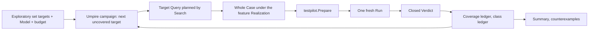

# Run serial bounded semantic exploration with umpire-fuzz

## Umpire4 Case Runtime reconciliation

This spec drives fn-64 exclusively through `testpilot.Prepare` and `PreparedCase.Run`. It removes every dependency on resident executors, `PortableTestPlan`, Run Evaluation, caller closure, and scenario-specific Go bindings.

## Re-plan on fn-85 (2026-09-21)

The first plan explored a variation Space (`Temporal.Feature.Nexus.Experimental`, deleted by fn-86 R6; its record is under **History** below). fn-85 replaced that input with the exploratory set: `set … purpose: exploratory` names the machine it covers, a coverage goal (`rows`, `results`, `classMembers`) and a `limits` budget, and admission enumerates its **coverage targets** deterministically (`Umpire.Command.coverageTargets`, pinned by a golden). The sole first campaign is the caller Model's `nexusCallerExploration` over `nexusProtocol` under `four` (steps 4, actions 4, search 32768): 889 targets, 885 rows, 2 results, 2 class members (`Temporal/Feature/Nexus/Caller/Fixtures/CallerExploratoryCoverage.json`). A campaign that needs fault axes declares fault actions on its Model; no Space is compiled.

What changes: the candidate space is the set's target list, a candidate is a whole Case that reaches one not-yet-covered target, coverage is credited per target from a satisfied Run along the candidate's planned witness path, and a class-member target whose candidate's decisive Verdict is `violated` is a counterexample that Promotion keeps for review. What stays: one Lean-owned selection order, one Go coordinator that prepares and runs exactly one candidate at a time through fn-64, exact identities at every boundary, an honest terminal summary, and no concurrency, leases, resume or adaptive selection.

## Intent

Prove that the Lean-owned exploration layer can walk an exploratory set's coverage targets by choosing a bounded sequence of complete Cases, one target at a time, while a shallow Go coordinator prepares and runs exactly one candidate at a time against a real deployment. The command reports selection, decisive Verdict coverage per target, unreachable targets, counterexamples, exhaustion, limits and interruption honestly.

## Architecture

**Umpire owns the campaign** (`Umpire.Exploration`, re-founded on the set; the module keeps its name, which fn-46's module index pins as a facade): the checked campaign is one `SetDeclaration` with `purpose: exploratory`, the `DeclaredModel` it names, its target list and the `Limits` value its `budget:` names (the declaration carries the name; the campaign takes the value). Selection is deterministic and not adaptive: the next candidate is the first target in enumeration order that is neither covered, unreachable nor violated. A candidate is a **target Query** formed the way every command Query is: a `Scenario.exactly` over a table-walked prefix from a start state to the target's source state (as `coverageTargets` walks) followed by the target's action, and a Property on that action whose outcome clause names the row's result (a `row` target), the result value (a `result` target) or the member's action alone (a `classMember` target); it is admitted and searched through `Umpire.Command.check` within the budget, keeping the `AdmittedQuery`. The candidate is the resulting `CheckedModel`; its identity is its Artifact checksum; the targets it is expected to cover are the rows, results and class members on its planned witness path, so one Case may cover many targets. A target is `unreachable` when no prefix reaches its source within the budget's steps or the search outcome is not a satisfying witness; it consumes no Run. Coverage is credited only from a `satisfied` Verdict on a completed Run with closed cleanup, and what it credits is the planned witness path, which is exactly what the Case's Contract rules confirmed; a `violated` Verdict credits nothing and marks the candidate's targets `violated`; inconclusive, crossed and cleanup-uncertain results credit nothing and leave the targets pending for no further candidate in the same campaign. The class ledger records, per claimed class, the decisive verdict of its member target's candidate; a class-member target whose candidate's Verdict is `violated` is a **counterexample**, which the campaign reports and hands to Promotion as a proposal for human review, never an installed regression (the Model enumerates one example per class, so member-versus-member divergence is outside this spec). The pinned Cases of the feature's functional sets are outside the campaign and consume none of its budget.

**Temporal owns the bridge** (`Temporal.Tool.ExplorationBridge`, executable `umpire-explore`): `initialize` names the set; `next` returns one whole canonical Case produced by `Umpire.Command.produce` from the candidate's `CheckedModel` under the feature's `Realization`, claims, evidence catalog and relations (the values the `case … realizes` block emits; the block is extended to accept an exploratory set and emit them with no fixture), plus the opaque candidate identity and the target keys on its planned path; `observe` accepts only the exact outstanding identity with its closed Run and Verdict after cleanup, decodes them, checks the Case ID, disposition, cleanup status and Verdict status, and returns what was credited; `finish` returns the summary. Go never interprets a target, a Model coordinate or a Case family. The bridge process writes nothing to stdout beyond frames.

**Go owns the loop** (`tools/umpire/campaign`, command `umpire-fuzz run`): framing, the fixed Driver Profile and deployment binding `umpire-run` already performs (gRPC address, namespace, task queue, Nexus endpoint, handler queue), static and runtime Limit accounting, process lifecycle, `testpilot.Prepare`, one active `PreparedCase.Run`, cleanup observation and terminal reporting. It may cache only the current process-local campaign state. Prepared Cases are not shared between candidate identities.

## Contracts

The bridge supports `initialize`, `next`, `observe`, and `finish`. `next` is unavailable while a candidate is outstanding. `observe` accepts only the exact candidate identity plus its closed Run and Verdict after cleanup. Preparation failure is reported as `prepare-rejected` and creates no Run; the candidate's targets stay uncovered and the campaign advances. A completed Run with closed cleanup and a `satisfied` Verdict credits every target on the candidate's planned witness path; a `violated` Verdict credits nothing and marks those targets `violated`; incomplete or inconclusive work, failed or uncertain cleanup, and crossed results credit nothing. A target is planned at most once per campaign. (Every row of the first campaign has one result, so a decisive Run is either the planned path confirmed or a violation; there is no separately observed path.)

Terminal status is `exhausted` (every target covered, unreachable, violated or left pending by a non-decisive result), `limit-reached` (candidate cap, aggregate bytes, or the budget's search count), `stopped`, or `tooling-failure`. The summary reports selected, prepared, started, decisive, covered, unreachable, violated, pending and counterexample counts without collapsing them, plus each counterexample (class, member target, candidate identity, the promotion source's SHA-256). A process crash or SIGINT after Run creation records a lost/stopped iteration when the supervisor can do so, performs bounded cleanup when still alive, and never synthesizes a Verdict or coverage. A later invocation starts from the same checked inputs with no resume token.

For fixed checked inputs (set, Model, budget, candidate cap) and a fixed decisive observation stream, selection order, per-target credit and the canonical summary are deterministic. Runtime timing may change the completed prefix but never identities. Pinned regressions remain outside exploration Limits.

## Limits and scale

Only one bridge call, preparation, and Run may be active. Admission caps total candidates, aggregate Case bytes, per-Case static work, per-Run work/time, terminal event references, and summary bytes. Each candidate costs one bounded Search within the budget and one Case production; there is no all-targets path table. A 10x increase in targets (a Model with ten times the rows, or a campaign over several sets in sequence) remains bounded by the candidate cap and the budget's search count, rejecting or stopping at the declared limits; it does not create concurrency or unbounded retained state. The first-generation Space-based `Umpire.Exploration` (Core, Language, Engine, Candidate, Selection, Guided, Coverage over `VariationSpace`, and `Session.beginSession`) is retired by task .1; `Session`'s `next` and `observe` are kept over the new candidate. `Umpire.Variations` stays: the Switch example, its tests and the Testpilot README use it, and only the Exploration consumer goes. The UMPIRE4 spec's Exploration concept ("selection from a declared `Umpire.Variations` space") is amended to the set-based definition as a GOV-02 draft in task .1.

## Acceptance Criteria

- **R1:** One canonical Lean bridge keeps target selection, target-Query admission and search, full Case production, candidate identity, per-target coverage along the planned witness path, the class ledger and exhaustion Lean-owned while Go sees only checked bindings, Limits, one complete Case, and one closed Run/Verdict result. Errors: a frame that would let Go name a target, a coordinate or a Case family rejects at the bridge.
- **R2:** The coordinator prepares and executes exactly one candidate at a time through fn-64 with the deployment binding `umpire-run` performs, observes cleanup before advancing, and cannot request another candidate while preparation or Run work is outstanding.
- **R3:** Candidate, Case, Profile/catalog, budget, Limits, Run, and Verdict identities remain exactly bound; duplicate, stale, crossed, incomplete, or oversized values reject at their owning boundary without coverage.
- **R4:** The closed command output distinguishes exhaustion, limit, stop/lost iteration, preparation rejection, runtime/tooling failure, per-target coverage, unreachable, violated and pending targets, and counterexamples, without treating unexecuted, inconclusive, or cleanup-uncertain work as coverage.
- **R5:** Identical checked inputs and decisive observation stream produce the same candidate order, per-target credit and canonical summary; wall-clock prefix variation is excluded; pinned regressions remain independent; a counterexample renders (`renderPromotionSource`), compiles (`compilePromotionSource` from the retained `AdmittedQuery` and a `PromotionBaseAnchor`) and compares to the same SHA-256 every time, and installs nothing.
- **R6:** Coordination is a bounded process-local serial loop with explicit candidate/byte/static-work/Run/report limits and one bounded Search per candidate; concurrency, leases, durable recovery, resume, and adaptive selection have no placeholder API or persisted format.

## Early proof point

Task .2's proof: through the real bridge, take the first row target of `nexusCallerExploration`, form and admit its target Query, produce the whole Case under `nexusCallerCases.realization`, and show `testpilot.Prepare` accepts it. Task .3's integration proof (non-gating, it needs the development cluster) completes one Run and cleanup, returns its decisive Verdict, and credits the planned path. Stop if Go must interpret a target or add scenario logic, or if the Producer cannot produce from a target Query's `CheckedModel` with the emitted realization values.

## Boundaries

No concurrent Runs, worker pool, lease, durable campaign state, resume, resident executor, public runtime service, alternate evaluator, automatic regression installation, adaptive corpus, variation Space, or timing-dependent semantic identity. No new Testpilot instruction, runtime opcode, Contract checker, or Go adapter for a campaign point.

## Requirement coverage

| Requirement | Tasks |
| --- | --- |
| R1, R3 | `.1`, `.2` |
| R2 | `.3`, `.6` |
| R6 | `.1`, `.3`, `.6` |
| R4 | `.4` |
| R5 | `.5` |

Execution order: `.1`, `.2`, `.3`, `.6`, `.4`, `.5`; `.4`'s exit codes and `.3`'s one-outstanding guarantee rest on `.6`'s state machine.

## Plan review (2026-09-21)

One round, NEEDS_WORK with eight findings, all applied the same day: the target Query is formed as an exact Scenario plus an action Property and admitted through `Umpire.Command.check` (the Producer takes a `CheckedModel`, never a Plan); credit is the planned witness path on a `satisfied` Verdict, because the model decodes no Run evidence and a Verdict carries rule status only; the counterexample is a violated class-member target, because the Model enumerates one example per class; the `case … realizes` block is extended to emit an exploratory set's realization values; `Umpire.Variations` stays and the retirement's importers are listed; `Campaign.check` takes the `Limits` value; the Go binding is split into campaign and candidate scope; `.6` precedes `.4`. The reviewer was a same-session agent; a cross-model plan review is owed before task `.1` starts, as the order document requires.

## History

2026-09-20 (fn-86 .5): the experimental inputs this campaign was written against, `Temporal.Feature.Nexus.Experimental.{VariationSpace,Exploration}`, are deleted with the first-generation lifecycle they varied; what they declared is recorded here. The Space (`temporal.nexus.basic-lifecycle.space.fault-matrix`) varied one base Query over the two-action lifecycle Scenario (start then handler-reported success, each exactly once, in order; the Query picked the async-start and successful-completion Properties under `Limits.bounded 2 2 32`) along two independent request-only fault axes: a start axis with a baseline choice and a start-delay fault at the start occurrence, and a completion axis with a baseline choice and a handler-failure fault at the success occurrence, each choice a coverage goal sought twice; the four points compiled to four Artifacts whose selected choices, requested faults, requested actions, outcomes and resulting states were pinned, and reordering the axes, choices, faults and goals left the canonical metadata and the batch unchanged. The Exploration ran that Space under `Umpire.Exploration` with an exhaustive policy at a limit of four (one stable identity order, `exhausted`), an uncovered-coordinate policy on the first fact at a limit of one (`coordinateSelected`, `limitReached`), pinned candidates preceding and leaving the exploratory partition without consuming its limit, and a one-candidate session that admitted only the exact checked binding and rejected crossed and stale observations. The successor inputs are the caller Model's exploratory set `nexusCallerExploration` and its coverage targets (fn-85 .12; `Temporal/Feature/Nexus/Caller/Fixtures/CallerExploratoryCoverage.json`), which enumerate what the protocol machine's Queries reach without a variation Space; a campaign that needs fault axes declares them on that Model.
