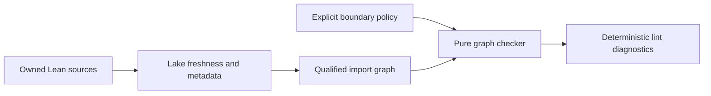

# Enforce Lean model boundaries with import graph lint

## Overview

Add one architecture check to the existing Lean model lint driver. The check reads the complete
first-party module graph, applies explicit qualified-module dependency rules transitively, and
fails with a deterministic shortest import path for every violation. It turns the hard Umpire 4
module seams into an executable contract while leaving semantic-altitude and deep-module judgments
as normative design review rules.

## Goal & Context
<!-- scope: business -->

Lean model authors currently rely partly on source-text import checks and documentation to preserve
the separation between domain-neutral `Umpire`, product-owned `Temporal.Feature`, mechanism-owned
`Temporal.System`, and opt-in verification modules. A transitive import or an uncovered tool root
can bypass those checks. Developers need the ordinary model lint command to reject such drift with
an actionable qualified-module path.

This changes developer and CI feedback only. It has no end-user, production-runtime, deployment,
configuration, or operational surface.

## Architecture & Data Models
<!-- scope: technical -->

`ModelLint.ImportGraph` is a pure deep module. Its inputs are first-party module records containing
qualified names and authoritative direct imports plus an explicit policy containing module classes,
ordinary and opt-in roots, and exact exception sets. Its output is a deterministic collection of
violations; it performs no builds, filesystem access, printing, or process exit.

The existing model lint driver remains the thin adapter. It asks Lake to make every owned source
module current, inventories canonical source paths beneath the Lake package root while excluding
build state, reads direct edges from Lean module metadata, proves that every owned source is present
and classified, invokes the pure checker, renders all findings, and combines the result with the
existing declaration linters.



The policy enforces these reachability rules:

- `Shared.*` cannot reach `Umpire.*` or `Temporal.*`.
- `Umpire.*` cannot reach `Temporal.*`.
- `Temporal.Feature.*` cannot reach `Temporal.System.*`, `Temporal.Verify.*`, or
  `Umpire.Verify.Veil`.
- Base `Temporal.System.*` cannot reach `Temporal.Feature.*`; only an exact, reviewed refinement
  leaf allowlist may compose both. The initial authorized identity is
  `Temporal.System.Nexus.Refinement`, not a suffix wildcard.
- Ordinary `Umpire`, `Temporal`, model-test, and `Temporal.Tool.*` roots cannot reach
  `Temporal.Verify.*` or `Umpire.Verify.Veil`. The closed opt-in consumer allowlist contains exactly
  `TemporalVerify`, `TemporalVeilTests`, `Temporal.Tool.VerifyVeil`, and
  `Temporal.Feature.Nexus.CallerClosure.VeilTests`; every other aggregate, tool, or test remains
  ordinary.
- External dependency modules are graph leaves outside the first-party policy. An unclassified or
  uncovered first-party module is an error, not an implicit permissive class.

## Approach

- Extract graph traversal, classification, rule evaluation, path selection, and diagnostic data
  into the pure `ModelLint.ImportGraph` interface.
- Build a complete current graph from Lean's module metadata rather than parsing import statements
  as text, reconciling it with a contained, symlink-safe source inventory.
- Cover the ordinary aggregates, tests, tools, lint infrastructure, and future opt-in roots through
  one owned-source inventory check.
- Add an executed internal test target with synthetic positive and negative graph regressions,
  including direct and transitive failures, exact exceptions, incomplete inventory, multiple paths,
  and defensive cycle handling. Its controlled violation mode exercises shared rendering and exit
  composition so the Make gate can assert non-zero status and deterministic stderr.
- Run the executed tests, controlled expected failure, and live graph check through the existing
  model lint entrypoint, then remove only the duplicated Feature/System source-text direction checks.
- Separate machine-enforced module-boundary rules from non-mechanical module-design rules in the
  normative index and align the supporting architecture documentation.

## API Contracts
<!-- scope: technical -->

- `ModelLint.ImportGraph.check` accepts an explicit policy and a complete array of module records and
  returns every architecture violation without performing I/O.
- Each violation identifies the rule, source class or root, forbidden destination, and one shortest
  qualified import path. Equal-length paths and multiple violations have stable qualified-name
  ordering.
- The adapter distinguishes Lake build or metadata failures, incomplete or unclassified inventory,
  and architecture violations. Each category causes a non-zero lint result without suppressing the
  existing declaration-linter result.
- The existing model lint command remains the sole user-facing entrypoint. A non-default internal
  test executable may expose only fixed test fixtures; no new package, dependency, default build
  target, production input, or runtime interface is introduced.

## Edge Cases & Constraints
<!-- scope: technical -->

- Reachability is transitive. A facade or helper cannot hide a prohibited edge.
- Module identity and classification use fully qualified Lean names, never filesystem-prefix or
  source-text guesses.
- The owned-source inventory canonicalizes the Lake package source root, forcibly prunes `.lake`
  and build/runtime state, rejects duplicate module identities, and does not follow a symlink outside
  the canonical root. Traversal, canonicalization, containment, and permission failures fail closed.
- Lake must validate freshness before metadata is trusted. Missing modules, failed builds, malformed
  metadata, or first-party imports absent from the inventory fail closed with the responsible module
  named.
- The checker reports all distinct violations in one run. Cycles are handled defensively, and a
  stable lexical tie-break selects among equal shortest paths.
- The linter writes no cache, generated inventory, lock, or source change; interruption and retry are
  safe.
- Work is proportional to the checked module graph. At ten times the present module count, bounded
  breadth-first traversals over the in-memory adjacency map remain suitable for lint-time use and do
  not affect runtime performance.
- The change consumes only local Lake/Lean metadata and adds no network, credential, executable-input,
  or production security surface.

## Quick commands

```bash
cd model && mise exec -- lake build modelLintTests modelLint
make lint-model
make lint
```

## Acceptance Criteria
<!-- scope: both -->

- **R1:** The lint driver constructs a fresh, complete direct-import graph for every first-party Lean
  source owned by the model package and excludes external dependency modules from policy
  classification. Errors: a build/import failure, missing metadata, uncovered source, unknown
  first-party import, unclassified first-party module, duplicate module identity, traversal or
  permission failure, or symlink escaping the canonical source root fails closed and names the
  responsible qualified module or source path; `.lake` and build/runtime state are forcibly
  excluded.
- **R2:** One pure checker enforces the complete qualified-module rule matrix transitively, including
  Shared and Umpire independence, Feature isolation, base-System isolation, exact refinement
  exceptions, and ordinary Verify/Veil isolation with a closed exact opt-in consumer class. Errors:
  direct or indirect forbidden reachability fails; wildcard refinement or verification exemptions,
  missing opt-in executable/test consumers, and implicit permissive classes are rejected.
- **R3:** Architecture failures report every distinct violation with its rule and a deterministic
  shortest fully qualified import path, and make the existing lint command exit non-zero without
  hiding declaration-linter failures. Errors: cycles terminate safely; equal shortest paths and
  multiple findings retain stable lexical ordering; Lake/metadata failures remain distinguishable
  from policy violations.
- **R4:** Executable synthetic regressions cover allowed edges, every prohibited direct and
  transitive edge class, allowed exact refinement and opt-in verification composition, rejected
  near-miss exceptions, incomplete/unclassified inventory, multiple paths, and cycles; the current
  real model graph passes through the normal lint entrypoint. The lint gate executes the internal
  suite and a controlled forbidden-edge mode, asserting its non-zero status and deterministic
  stderr/path before running the live graph. Errors: compile-only tests, expected-failure status or
  diagnostics not asserted by the gate, source-text parsing as the architecture authority, or
  retained duplicate Feature/System grep enforcement fails completion.
- **R5:** The normative index groups mechanically enforced module boundaries separately from
  non-mechanical module-design requirements, preserves all existing rule IDs, adds rather than
  reuses IDs where a new rule is required, and uses fully qualified names in backticks. Supporting
  model and component documents name the existing model lint command as the single import-boundary
  mechanism without claiming it enforces semantic altitude, deep interfaces, or isolated
  testability. Shared independence receives explicit normative ownership. Errors: renumbered IDs,
  duplicated normative rule tables, ambiguous module names, an unsupported Shared boundary, or
  documentation that assigns subjective design checks to the graph linter fails completion.

## Early proof point

Task `.1` proves that authoritative Lean metadata can produce a complete graph and that the pure
checker rejects a synthetic transitive violation with a deterministic shortest path while the
current repository passes. If that fails, reconsider module inventory and metadata acquisition
before updating the normative and supporting documentation.

## Boundaries
<!-- scope: business -->

- No separate Lake package, new third-party dependency, default-target expansion, or user-facing
  lint command.
- No source-text import parser, auto-fix, generated policy file, configurable policy surface, or
  broad name-pattern exception.
- No attempt to lint semantic authority, semantic altitude, deep-module quality, narrow contracts,
  or isolated testability.
- No replacement of existing declaration linters or unrelated domain-vocabulary and regression
  checks.
- No unrelated glossary restructuring or implementation of the dependent Umpire 4 feature,
  refinement, or verification specs.

## Decision Context
<!-- scope: both -->

The existing custom Lake lint driver is the smallest integration seam and already participates in
the repository lint gate. A pure graph checker keeps policy behavior fast and exhaustively testable,
while a thin metadata adapter contains Lake and filesystem concerns. Exact reviewed allowlists fail
closed and make exceptions visible; prefix-wide refinement or verification exemptions would create
an architectural bypass. A contained source inventory closes unreferenced-module escapes without
treating dependency caches as first-party code. An executed expected-failure fixture covers the
driver behavior that compile-time examples cannot observe. A separate Lake package would strongly enforce the top-level dependency
direction but adds build structure and still would not express the finer Feature/System/Verify
matrix. Source-text grep is retained only for non-import checks it actually owns.

## References

- Umpire 4 development rules: semantic authority and MOD-01 through MOD-08.
- Umpire 4 model architecture: qualified module layout, refinement leaves, and opt-in verification
  aggregate.
- Umpire 4 component design: dependency rules and architecture testing strategy.
- Lean authoring guidelines: deep modules, module documentation, executable regressions, and normal
  lint verification.

## Requirement coverage

| Req | Description | Task(s) | Gap justification |
| --- | --- | --- | --- |
| R1 | Fresh, contained, complete first-party graph and fail-closed inventory | `.1` | — |
| R2 | Transitive qualified-module policy, Shared isolation, and exact exceptions | `.1` | — |
| R3 | Deterministic complete diagnostics and lint status | `.1` | — |
| R4 | Synthetic and live lint regressions through the existing gate | `.1` | — |
| R5 | Normative/supporting documentation alignment | `.2` | — |
